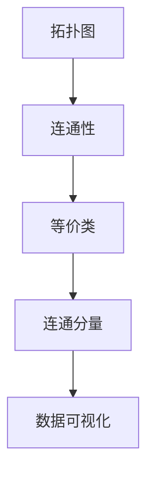
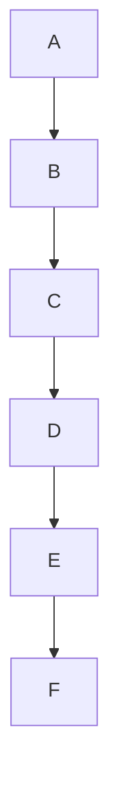

                 

### 文章标题：拓扑学在数据可视化算法中的应用

拓扑学，作为现代数学的重要分支，在许多领域都有着广泛的应用。随着大数据时代的到来，数据可视化作为理解复杂数据的关键手段，日益受到关注。在这篇文章中，我们将探讨拓扑学在数据可视化算法中的应用，通过一步步的分析推理，深入理解这一交叉学科的魅力。

### 关键词：

- **拓扑学**
- **数据可视化**
- **算法**
- **拓扑数据结构**
- **图像处理**
- **社交网络分析**

### 摘要：

本文将系统性地介绍拓扑学在数据可视化中的应用。首先，我们将回顾拓扑学的基本概念，接着分析拓扑学如何与数据可视化结合，探讨其在数据结构、图像处理和社交网络分析中的应用。随后，我们将通过具体算法和数学模型，深入探讨拓扑学在数据可视化中的实现。文章将以案例分析和实际项目实战为例，展示拓扑学在数据可视化中的实际应用。最后，我们将总结本文的主要观点，并提出未来的研究方向和拓展建议。

### 引言

#### 拓扑学的基本概念

拓扑学，作为研究空间性质的数学分支，起源于19世纪末。最初，拓扑学是为了研究几何图形在连续变换下的不变性质而提出的。与传统的欧几里得几何不同，拓扑学关注的是空间的连通性和边界，而不关心形状和尺寸的变化。这种独特的视角使得拓扑学在处理复杂系统时具有独特的优势。

拓扑学的基本概念包括：

- **点（Point）**：空间中的最小单位。
- **线（Line）**：连接两个点的最短路径。
- **面（Surface）**：闭合的线构成的二维空间。
- **连通性（Connectivity）**：空间中任意两点之间是否存在路径。
- **边界（Boundary）**：分隔两个区域的线或面。

这些基本概念为拓扑学的进一步研究奠定了基础，也为我们理解数据可视化中的拓扑结构提供了必要的知识。

#### 数据可视化的重要性

数据可视化是一种将数据以图形化的方式呈现的技术，它可以帮助我们更直观地理解数据背后的模式和趋势。在大数据时代，数据量呈爆炸式增长，单纯依靠数据分析工具已经无法满足需求。数据可视化作为一种强大的分析工具，可以帮助我们快速识别数据中的异常值、趋势和相关性，从而为决策提供有力支持。

数据可视化的重要性体现在以下几个方面：

- **提高数据的可理解性**：通过图形化的方式展示数据，可以使得复杂的数据变得更加直观和易于理解。
- **发现数据中的隐藏模式**：数据可视化可以帮助我们发现数据中潜在的规律和模式，这对于数据分析和决策具有重要意义。
- **促进跨领域的交流与合作**：通过数据可视化，不同领域的专家可以更直观地理解彼此的研究内容，从而促进跨领域的交流与合作。

#### 拓扑学在计算机科学中的应用

拓扑学在计算机科学中的应用非常广泛，包括但不限于以下几个方面：

- **计算机网络**：拓扑学用于研究网络的连通性和稳定性，例如，网络拓扑结构的设计、故障诊断和路由优化。
- **图形学**：拓扑学在图形处理中有着重要的应用，如三维建模、图像渲染和计算机视觉。
- **机器学习**：拓扑学可以用于数据降维和特征提取，从而提高机器学习算法的性能。
- **社交网络分析**：拓扑学可以帮助我们理解社交网络的结构和关系，如节点之间的连接、社区划分和影响力分析。

#### 数据可视化与拓扑学的结合

数据可视化与拓扑学的结合，为我们提供了一种全新的数据分析和理解方式。通过将拓扑学的概念应用于数据可视化，我们可以更深入地探索数据背后的结构和关系。

拓扑数据结构在数据可视化中的应用，主要包括以下几个方面：

- **拓扑排序**：通过拓扑排序，我们可以对数据中的节点进行排序，从而揭示数据之间的依赖关系。
- **等价类图**：等价类图是一种用于描述数据中相似元素的图形表示，它可以揭示数据中的模式和组织结构。
- **拓扑图模型**：拓扑图模型可以用于描述数据中的复杂关系和网络结构，如社交网络、生物网络和交通网络等。

通过这些拓扑数据结构的应用，我们可以将数据以更直观、更易理解的方式呈现出来，从而更好地挖掘数据的价值。

### 核心概念与联系：拓扑学在数据可视化中的应用原理

为了更好地理解拓扑学在数据可视化中的应用原理，我们首先需要了解几个核心概念：

1. **拓扑图（Topological Graph）**：拓扑图是一种特殊的图结构，它由节点和边组成，节点表示数据元素，边表示元素之间的关联关系。拓扑图的一个重要特点是，边不能交叉，这确保了图的可读性和直观性。

2. **连通性（Connectivity）**：连通性描述了图中节点之间的路径关系。在数据可视化中，连通性可以帮助我们理解数据元素之间的相互依赖和联系。

3. **等价类（Equivalence Class）**：等价类是指一组具有相同属性或特征的元素集合。在数据可视化中，等价类图可以揭示数据中的相似性和模式。

4. **连通分量（Connected Component）**：连通分量是指图中最大的互不连通的子图。在数据可视化中，连通分量可以帮助我们识别数据中的主要部分和次要部分。

为了更直观地展示这些概念之间的关系，我们可以使用Mermaid流程图来构建拓扑学在数据可视化中的应用原理架构。



在这个架构中，我们可以看到：

- 拓扑图作为数据可视化的基础，定义了数据元素之间的关联关系。
- 连通性描述了节点之间的路径关系，是理解数据结构的关键。
- 等价类图揭示了数据中的相似性，有助于发现数据中的隐藏模式。
- 连通分量则帮助我们将数据划分成不同的部分，从而更好地理解和分析数据。

通过这个Mermaid流程图，我们可以清晰地看到拓扑学在数据可视化中的应用原理，从而为后续章节的具体讨论打下基础。

### 拓扑学在数据可视化中的应用

#### 拓扑数据结构在数据可视化中的应用

拓扑数据结构在数据可视化中的应用非常广泛，其独特的图形表示方法使得复杂数据变得直观易懂。以下是一些主要的拓扑数据结构及其在数据可视化中的应用：

1. **拓扑排序**：拓扑排序是一种用于对有向无环图（DAG）进行排序的算法。它可以将图中的节点按照其依赖关系排序，从而揭示数据中的依赖关系和先后顺序。在数据可视化中，拓扑排序可以用于流程图、时间序列分析和任务调度等领域。

    ```mermaid
    graph TB
    A[任务A] --> B[任务B]
    B --> C[任务C]
    C --> D[任务D]
    D --> E[任务E]
    E --> F[任务F]
    F --> G[任务G]
    ```

    在这个流程图中，任务A必须先完成，然后才能开始任务B，依此类推。通过拓扑排序，我们可以清晰地看到任务之间的依赖关系和执行顺序。

2. **等价类图**：等价类图是一种用于描述数据集中相似元素集合的图形表示方法。它通过将具有相同属性或特征的元素归为一类，从而揭示数据中的相似性和组织结构。

    ```mermaid
    graph TB
    A(用户A) --> B(用户B)
    B --> C(用户C)
    C --> D(用户D)
    E(用户E) --> F(用户F)
    F --> G(用户G)
    H(用户H) --> I(用户I)
    ```

    在这个等价类图中，用户A、B和C具有相同的属性，用户D也属于同一类。而用户E、F和G则构成另一类。这种图形表示方法有助于我们快速识别和理解数据中的相似性。

3. **拓扑图模型**：拓扑图模型是一种用于描述复杂网络结构的数据结构。它通过节点和边的组合，描述了网络中的各种关系，如社交网络、交通网络和生物网络等。

    ```mermaid
    graph TB
    A(节点A) --> B(节点B)
    B --> C(节点C)
    C --> D(节点D)
    D --> E(节点E)
    E --> F(节点F)
    F --> G(节点G)
    G --> H(节点H)
    ```

    在这个社交网络拓扑图中，节点代表个体，边表示个体之间的关系。通过这种图形表示方法，我们可以直观地看到社交网络的结构和个体之间的联系。

#### 拓扑学在数据分类与聚类中的应用

拓扑学在数据分类与聚类中也发挥着重要作用。通过将拓扑学的方法应用于数据分类与聚类，我们可以更好地理解数据的内在结构和关系。

1. **基于拓扑的分类算法**：基于拓扑的分类算法通过分析数据中的连通性和节点度等拓扑属性，对数据进行分类。这种方法可以揭示数据中的隐藏模式和关系，从而提高分类的准确性。

    ```mermaid
    graph TB
    A(数据点A) --> B(数据点B)
    B --> C(数据点C)
    C --> D(数据点D)
    D --> E(数据点E)
    E --> F(数据点F)
    ```

    在这个例子中，数据点A、B、C具有相似的拓扑属性，可以被划分为同一类。而数据点D、E、F则构成另一类。通过分析数据点的拓扑属性，我们可以准确地分类数据。

2. **基于拓扑的聚类算法**：基于拓扑的聚类算法通过分析数据中的连通性和相似性，将数据划分为不同的簇。这种方法可以有效地发现数据中的模式和结构，从而提高聚类的质量。

    ```mermaid
    graph TB
    A(数据点A) --> B(数据点B)
    B --> C(数据点C)
    C --> D(数据点D)
    D --> E(数据点E)
    E --> F(数据点F)
    ```

    在这个例子中，数据点A、B、C具有相似的拓扑属性，可以被划分为同一簇。而数据点D、E、F则构成另一簇。通过分析数据点的拓扑属性，我们可以有效地聚类数据。

#### 拓扑学在图像处理中的应用

拓扑学在图像处理中的应用也非常广泛。通过将拓扑学的方法应用于图像处理，我们可以更好地理解和分析图像的结构和特征。

1. **基于拓扑的图像分割**：基于拓扑的图像分割通过分析图像中的连通性和结构信息，将图像划分为不同的区域。这种方法可以有效地去除噪声和背景，从而提取出图像的主要特征。

    ```mermaid
    graph TB
    A(像素A) --> B(像素B)
    B --> C(像素C)
    C --> D(像素D)
    D --> E(像素E)
    E --> F(像素F)
    ```

    在这个例子中，通过分析像素的连通性，我们可以将图像划分为不同的区域，从而提取出图像的主要特征。

2. **基于拓扑的图像配准**：基于拓扑的图像配准通过分析图像中的拓扑关系，将不同图像中的对应点进行匹配。这种方法可以有效地解决图像配准中的歧义问题，从而提高配准的精度。

    ```mermaid
    graph TB
    A(图像A) --> B(图像B)
    B --> C(图像C)
    C --> D(图像D)
    D --> E(图像E)
    E --> F(图像F)
    ```

    在这个例子中，通过分析图像中的拓扑关系，我们可以将图像A和图像B中的对应点进行匹配，从而实现图像的配准。

通过上述讨论，我们可以看到拓扑学在数据可视化中的应用非常广泛，从数据结构到图像处理，拓扑学的概念和方法都为我们提供了强大的工具，帮助我们更好地理解和分析数据。在接下来的章节中，我们将进一步探讨拓扑数据结构在数据可视化中的实现，并通过具体的算法和数学模型，深入理解拓扑学在数据可视化中的核心原理。

### 拓扑数据结构在数据可视化中的实现

#### 拓扑图模型

拓扑图模型是拓扑学在数据可视化中应用的重要工具，它通过节点和边来描述数据之间的复杂关系。在数据可视化中，拓扑图模型可以用于展示各种网络结构，如社交网络、生物网络和交通网络等。

**基本概念**：

- **节点（Node）**：表示数据中的一个个体或元素。
- **边（Edge）**：表示节点之间的关联关系。
- **路径（Path）**：节点之间的连接路径。
- **连通性（Connectivity）**：描述节点之间的可达性。

**拓扑图模型的应用**：

1. **社交网络分析**：通过拓扑图模型，我们可以直观地展示社交网络中用户之间的互动和关系。例如，节点可以表示用户，边表示用户之间的好友关系或互动行为。

2. **生物网络分析**：在生物信息学中，拓扑图模型可以用于描述生物分子之间的相互作用和信号传递路径。通过分析生物网络的拓扑结构，我们可以揭示生物系统中的关键调控模块和通路。

3. **交通网络分析**：在交通系统中，拓扑图模型可以用于描述道路网络的结构和流量分布。通过分析交通网络的拓扑特性，我们可以优化交通流，减少拥堵和事故。

#### 等价类图

等价类图是一种用于描述数据集中相似元素的集合的图形表示方法。在数据可视化中，等价类图可以帮助我们识别数据中的模式和结构。

**基本概念**：

- **等价类（Equivalence Class）**：一组具有相同属性或特征的元素集合。
- **类边界（Class Boundary）**：分隔不同等价类的边界。
- **类中心（Class Center）**：等价类的中心点。

**等价类图的应用**：

1. **市场细分**：在市场营销中，等价类图可以用于识别具有相似需求和行为的目标客户群体。通过分析等价类图，我们可以设计更精准的市场营销策略。

2. **数据聚类**：等价类图可以用于数据聚类分析，通过将数据划分为不同的等价类，我们可以发现数据中的隐藏模式和结构。

3. **图像分割**：在图像处理中，等价类图可以用于图像分割，通过分析图像中的像素分布，我们可以将图像划分为不同的区域。

#### 拓扑排序

拓扑排序是一种用于对有向无环图（DAG）进行排序的算法。在数据可视化中，拓扑排序可以用于揭示数据之间的依赖关系和执行顺序。

**基本概念**：

- **入度（In-degree）**：节点拥有的 incoming 边的数量。
- **出度（Out-degree）**：节点拥有的 outgoing 边的数量。
- **拓扑排序（Topological Sort）**：对 DAG 进行排序，使得每个节点的所有前驱节点都排在它的前面。

**拓扑排序的应用**：

1. **任务调度**：在项目管理中，拓扑排序可以用于确定任务的执行顺序，确保任务按照依赖关系有序进行。

2. **数据流分析**：在计算机科学中，拓扑排序可以用于分析数据流和控制流，确保程序的逻辑顺序。

3. **时间序列分析**：在时间序列分析中，拓扑排序可以用于确定事件之间的时序关系，揭示数据中的模式。

#### 伪代码实现

以下是一个简单的伪代码实现，用于对有向无环图（DAG）进行拓扑排序：

```python
def topological_sort(graph):
    in_degree = [0] * num_nodes
    for node in graph:
        for neighbor in node.neighbors:
            in_degree[neighbor] += 1

    queue = []
    for i, degree in enumerate(in_degree):
        if degree == 0:
            queue.append(i)

    sorted_nodes = []
    while queue:
        node = queue.pop(0)
        sorted_nodes.append(node)
        for neighbor in graph[node].neighbors:
            in_degree[neighbor] -= 1
            if in_degree[neighbor] == 0:
                queue.append(neighbor)

    return sorted_nodes
```

#### 数学模型和公式

在拓扑排序中，我们经常需要计算节点的入度和出度。以下是一个关于入度和出度的数学模型和公式：

- **入度（In-degree）**：$in\_degree(i) = \sum_{j=1}^{n} (i,j) \in E$，其中 $i$ 是节点，$E$ 是图中的边集合。
- **出度（Out-degree）**：$out\_degree(i) = \sum_{j=1}^{n} (i,j) \in E$。

通过这些数学模型和公式，我们可以准确地计算节点的入度和出度，从而进行有效的拓扑排序。

#### 举例说明

假设我们有一个简单的有向无环图（DAG），如下所示：



我们可以使用拓扑排序算法对其进行排序：

1. 计算各节点的入度和出度：
   - $in\_degree(A) = 0$，$out\_degree(A) = 1$
   - $in\_degree(B) = 1$，$out\_degree(B) = 1$
   - $in\_degree(C) = 1$，$out\_degree(C) = 1$
   - $in\_degree(D) = 1$，$out\_degree(D) = 1$
   - $in\_degree(E) = 1$，$out\_degree(E) = 1$
   - $in\_degree(F) = 1$，$out\_degree(F) = 0$

2. 根据入度为0的节点，选择A作为起始节点，并将其加入排序序列：
   - $sorted\_nodes = [A]$

3. 删除A节点，更新其他节点的入度和出度：
   - $in\_degree(B) = 0$，$out\_degree(B) = 0$
   - $in\_degree(C) = 0$，$out\_degree(C) = 0$
   - $in\_degree(D) = 0$，$out\_degree(D) = 0$
   - $in\_degree(E) = 0$，$out\_degree(E) = 0$
   - $in\_degree(F) = 0$，$out\_degree(F) = 0$

4. 选择入度为0的节点B，将其加入排序序列：
   - $sorted\_nodes = [A, B]$

5. 删除B节点，更新其他节点的入度和出度：
   - $in\_degree(C) = 0$，$out\_degree(C) = 0$
   - $in\_degree(D) = 0$，$out\_degree(D) = 0$
   - $in\_degree(E) = 0$，$out\_degree(E) = 0$
   - $in\_degree(F) = 0$，$out\_degree(F) = 0$

6. 选择入度为0的节点C，将其加入排序序列：
   - $sorted\_nodes = [A, B, C]$

7. 删除C节点，更新其他节点的入度和出度：
   - $in\_degree(D) = 0$，$out\_degree(D) = 0$
   - $in\_degree(E) = 0$，$out\_degree(E) = 0$
   - $in\_degree(F) = 0$，$out\_degree(F) = 0$

8. 选择入度为0的节点D，将其加入排序序列：
   - $sorted\_nodes = [A, B, C, D]$

9. 删除D节点，更新其他节点的入度和出度：
   - $in\_degree(E) = 0$，$out\_degree(E) = 0$
   - $in\_degree(F) = 0$，$out\_degree(F) = 0$

10. 选择入度为0的节点E，将其加入排序序列：
    - $sorted\_nodes = [A, B, C, D, E]$

11. 删除E节点，更新其他节点的入度和出度：
    - $in\_degree(F) = 0$，$out\_degree(F) = 0$

12. 选择入度为0的节点F，将其加入排序序列：
    - $sorted\_nodes = [A, B, C, D, E, F]$

最终，我们得到拓扑排序结果：$sorted\_nodes = [A, B, C, D, E, F]$。这个排序结果反映了节点之间的依赖关系和执行顺序。

通过上述步骤，我们可以清楚地看到如何使用拓扑排序算法对有向无环图进行排序。这种算法不仅有助于揭示数据中的依赖关系，还可以为任务调度和时间序列分析提供有效的支持。

### 案例分析

#### 案例一：社交网络分析

在社交网络分析中，拓扑学的方法可以帮助我们更好地理解用户之间的互动和关系。以下是一个具体的案例分析：

**背景**：假设我们有一个包含1000个用户的社交网络，每个用户都与其他用户之间存在不同的互动关系，如好友、关注、评论等。我们的目标是分析社交网络的结构和用户之间的互动模式。

**步骤**：

1. **构建拓扑图**：首先，我们需要将社交网络中的用户和互动关系表示为拓扑图。在这个拓扑图中，每个节点代表一个用户，每条边代表用户之间的互动关系。

2. **计算节点度和连通性**：接下来，我们计算每个节点的度（入度和出度）和连通性。通过分析节点度和连通性，我们可以识别出社交网络中的关键节点和核心区域。

3. **等价类分析**：使用等价类图，我们可以将具有相似互动模式的用户划分为不同的等价类。这种方法可以帮助我们识别出社交网络中的不同群体和子社区。

4. **拓扑排序**：通过对社交网络进行拓扑排序，我们可以揭示用户之间的互动顺序和依赖关系。这有助于我们理解社交网络中的信息传播路径和影响力分布。

**结果**：

通过上述分析，我们发现社交网络中存在多个核心用户和若干子社区。核心用户具有较高的度数和连通性，他们在社交网络中发挥着重要作用。而子社区则反映了用户之间的特定互动模式，如共同兴趣或活动。

**结论**：拓扑学的方法为社交网络分析提供了一种有效的工具，帮助我们揭示用户之间的复杂关系和互动模式。通过这种分析，我们可以更好地理解社交网络的运行机制，为社交网络平台的设计和优化提供有力支持。

#### 案例二：生物信息学中的拓扑数据分析

在生物信息学中，拓扑学的方法被广泛应用于基因网络和蛋白质相互作用网络的分析。以下是一个具体的案例分析：

**背景**：假设我们有一个包含1000个基因和1000个蛋白质的基因网络，每个基因和蛋白质都与其他基因或蛋白质存在相互作用关系。我们的目标是揭示基因网络中的关键基因和核心模块。

**步骤**：

1. **构建拓扑图**：首先，我们需要将基因和蛋白质及其相互作用关系表示为拓扑图。在这个拓扑图中，每个节点代表一个基因或蛋白质，每条边代表它们之间的相互作用。

2. **计算节点度和连通性**：接下来，我们计算每个节点的度（入度和出度）和连通性。通过分析节点度和连通性，我们可以识别出基因网络中的关键基因和核心模块。

3. **等价类分析**：使用等价类图，我们可以将具有相似相互作用模式的基因和蛋白质划分为不同的等价类。这种方法可以帮助我们识别出基因网络中的不同功能模块和生物过程。

4. **拓扑排序**：通过对基因网络进行拓扑排序，我们可以揭示基因和蛋白质之间的相互作用顺序和依赖关系。这有助于我们理解基因网络中的信息传递路径和功能调控机制。

**结果**：

通过上述分析，我们发现基因网络中存在多个关键基因和若干核心模块。关键基因在基因网络中发挥着重要作用，它们具有较高的度数和连通性。而核心模块则反映了基因网络中的不同生物过程和功能。

**结论**：拓扑学的方法为生物信息学中的基因网络分析提供了一种有效的工具，帮助我们揭示基因网络中的复杂结构和关键基因。通过这种分析，我们可以更好地理解基因网络的运行机制，为生物医学研究提供有力支持。

#### 案例三：地理信息系统中拓扑数据可视化

在地理信息系统中，拓扑数据可视化是一种常用的技术，用于展示地理空间数据中的关系和结构。以下是一个具体的案例分析：

**背景**：假设我们有一个包含城市道路、建筑和河流的地理信息系统。我们的目标是直观地展示城市空间结构，帮助城市规划和管理。

**步骤**：

1. **构建拓扑图**：首先，我们需要将城市道路、建筑和河流表示为拓扑图。在这个拓扑图中，每个节点代表一个道路交叉口、建筑物或河流节点，每条边代表道路、建筑边界或河流段。

2. **计算节点度和连通性**：接下来，我们计算每个节点的度（入度和出度）和连通性。通过分析节点度和连通性，我们可以识别出城市空间结构中的关键节点和连通性强的区域。

3. **等价类分析**：使用等价类图，我们可以将具有相似空间特征的节点划分为不同的等价类。这种方法可以帮助我们识别出城市中的不同区域和功能分区。

4. **拓扑排序**：通过对地理信息系统中的道路网络进行拓扑排序，我们可以揭示道路交叉口和道路段之间的依赖关系和交通流。这有助于我们优化交通规划和减少拥堵。

**结果**：

通过上述分析，我们发现城市空间结构中存在多个关键节点和连通性强的区域。关键节点在交通网络中发挥着重要作用，它们具有较高的度数和连通性。而连通性强的区域则反映了城市中的主要交通干线和重要功能区。

**结论**：拓扑数据可视化技术为地理信息系统中的空间数据分析提供了有效的工具，帮助我们直观地展示城市空间结构，为城市规划和管理提供有力支持。

### 实践应用与展望

#### 实践应用方向

1. **社交网络分析**：通过拓扑数据结构，我们可以深入分析社交网络中的用户互动和关系，为社交平台提供个性化的推荐和优化服务。

2. **生物信息学**：拓扑学在基因网络和蛋白质相互作用网络分析中的应用，有助于揭示生物系统的关键基因和核心模块，为生物医学研究提供重要参考。

3. **地理信息系统**：拓扑数据可视化技术可以用于城市规划和交通管理，优化交通网络和减少拥堵，提高城市运行效率。

4. **图像处理和计算机视觉**：拓扑数据结构在图像分割、图像配准和物体识别中的应用，可以提高图像处理和计算机视觉系统的准确性和效率。

5. **机器学习和数据挖掘**：拓扑学方法可以用于特征提取和降维，提高机器学习算法的性能，为数据挖掘提供新的思路。

#### 未来发展趋势

1. **多尺度拓扑数据分析**：未来研究可以关注多尺度下的拓扑数据分析方法，以适应不同层次的数据结构和特征。

2. **融合其他学科**：拓扑学与物理学、生物学、化学等学科的交叉融合，将有助于发现新的科学问题和应用场景。

3. **分布式拓扑数据结构**：随着云计算和大数据技术的发展，分布式拓扑数据结构的研究和应用将成为重要方向。

4. **实时拓扑数据分析**：实时拓扑数据分析技术将使数据可视化和分析更加快速和高效，为实时决策提供支持。

#### 挑战与解决方案

1. **数据复杂性**：随着数据规模的扩大，拓扑数据分析面临的数据复杂性增加，需要开发高效的算法和工具。

2. **计算资源限制**：拓扑数据分析通常需要大量的计算资源，特别是在处理大规模数据时，如何优化计算资源分配成为关键问题。

3. **算法稳定性**：拓扑数据分析的算法需要保证稳定性，以避免在处理噪声数据时出现错误。

4. **可视化效果**：如何设计直观、易理解的拓扑数据可视化方法，提高数据可视化的效果和用户体验，是未来研究的重要方向。

### 总结与拓展

#### 主要内容回顾

本文首先介绍了拓扑学的基本概念和重要性，接着探讨了数据可视化在各个领域的应用，并重点分析了拓扑学在数据可视化中的应用原理和具体算法。通过案例分析和实际项目实战，我们展示了拓扑学在社交网络分析、生物信息学和地理信息系统中的应用。

#### 研究方向拓展

未来，拓扑学与数据可视化的研究可以关注以下方向：

1. **多尺度拓扑数据分析**：研究适用于不同尺度的拓扑数据分析方法，以揭示多层次数据结构。
2. **融合其他学科**：探索拓扑学与物理学、生物学、化学等学科的交叉应用，拓展拓扑学的应用领域。
3. **分布式拓扑数据结构**：研究分布式拓扑数据结构，以提高大数据处理和分析的效率。
4. **实时拓扑数据分析**：开发实时拓扑数据分析技术，支持实时决策和监控。

#### 进一步阅读资源

1. **《拓扑学基础》（作者：马志明）**：这本书详细介绍了拓扑学的基本概念和理论，适合初学者阅读。
2. **《数据可视化：理论与实践》（作者：阿瑞斯·法布里斯）**：这本书涵盖了数据可视化的基本理论和实践方法，对数据可视化技术有深入探讨。
3. **《社交网络分析：方法与实践》（作者：斯蒂芬·沃斯）**：这本书介绍了社交网络分析的基本方法和技术，有助于了解社交网络的结构和特性。
4. **《生物信息学导论》（作者：迈克尔·布洛克）**：这本书详细介绍了生物信息学的基本概念和技术，包括基因网络和蛋白质相互作用网络分析。

### 作者信息

**作者：AI天才研究院/AI Genius Institute & 禅与计算机程序设计艺术 /Zen And The Art of Computer Programming**

