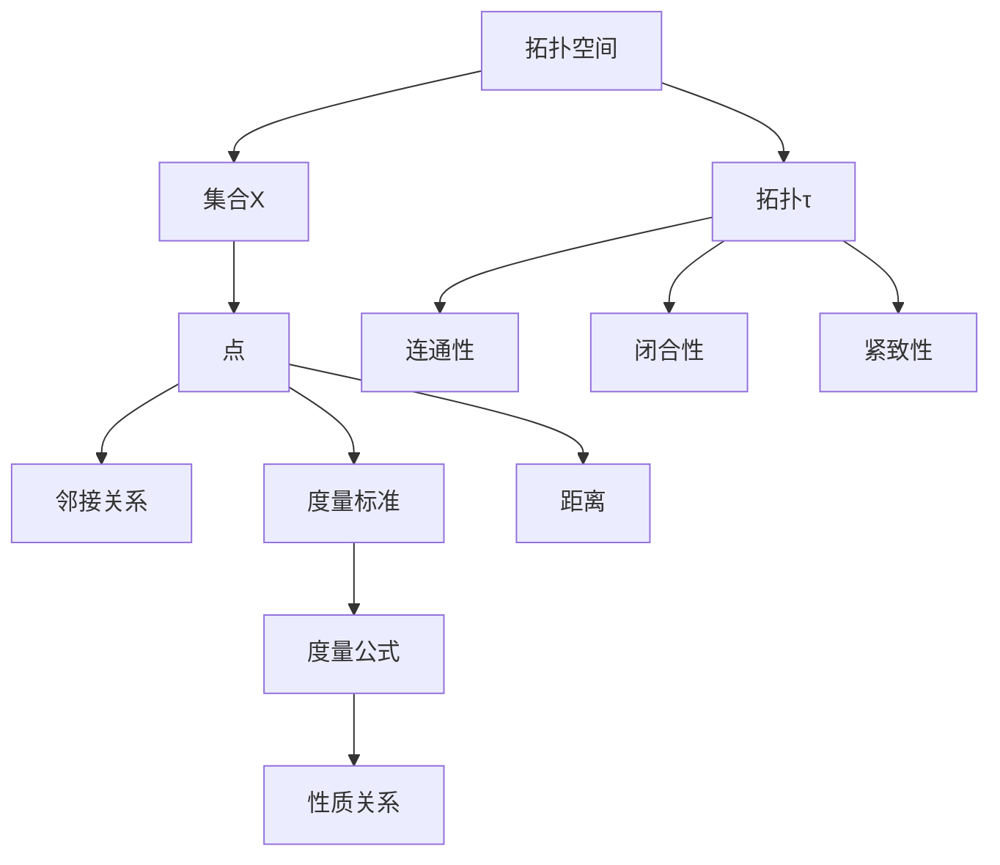

                 

### 引言

在当今这个快速发展的信息技术时代，机器学习已经成为数据处理、模式识别和智能决策等众多领域的关键技术。然而，随着数据规模的不断扩大和数据类型的日益多样，传统的机器学习方法在处理高维、复杂数据时面临诸多挑战。在此背景下，拓扑数据分析作为一种新兴的跨学科方法，逐渐引起了学术界和工业界的广泛关注。拓扑数据分析通过捕捉数据的全局结构和拓扑性质，为机器学习提供了新的视角和工具。

本文旨在深入探讨拓扑数据分析在机器学习中的应用，为其发展提供理论基础和实践指导。本文将首先介绍拓扑数据分析的定义、背景和重要性，随后逐步阐述其基础概念、原理和核心算法，并结合具体案例展示其在不同领域的应用效果。同时，文章还将探讨拓扑数据分析在机器学习中的挑战和未来发展趋势，为读者提供全面而深入的洞察。

本文结构安排如下：首先，在引言部分，我们将介绍拓扑数据分析的定义、背景和重要性。接下来，在基础概念部分，我们将详细阐述拓扑空间与拓扑结构的定义、度量标准与拓扑性质，以及基础算法与工具。在拓扑数据分析原理部分，我们将介绍拓扑数据分析的基本流程、拓扑特征提取与表示，以及拓扑分类与聚类算法。随后，在机器学习与拓扑数据分析部分，我们将探讨拓扑数据分析在机器学习中的应用和拓扑特征对机器学习模型的影响。在核心算法原理讲解部分，我们将使用伪代码详细阐述核心算法原理，并使用 LaTeX 格式展示数学模型。在项目实战部分，我们将提供拓扑数据分析项目实战的详细步骤和代码解读。最后，在应用领域部分，我们将介绍拓扑数据分析在生物信息学、材料科学和图神经网络等领域的应用，并讨论其挑战与未来发展趋势。通过本文的阅读，读者将对拓扑数据分析在机器学习中的应用有更深入的理解。

### 关键词

1. 拓扑数据分析
2. 机器学习
3. 拓扑空间
4. 度量标准
5. 拓扑特征
6. 分类算法
7. 聚类算法
8. 数学模型
9. 伪代码
10. 项目实战

### 摘要

本文围绕拓扑数据分析在机器学习中的应用展开，旨在探讨拓扑数据分析如何为机器学习提供新的视角和工具。首先，我们介绍了拓扑数据分析的定义、背景和重要性，并提出了本文的研究目标。接着，我们详细阐述了拓扑空间与拓扑结构的定义、度量标准与拓扑性质，以及基础算法与工具。在核心部分，我们介绍了拓扑数据分析的基本流程、拓扑特征提取与表示，以及拓扑分类与聚类算法。通过具体案例，我们展示了拓扑数据分析在机器学习中的实际应用效果。此外，我们还探讨了拓扑特征对机器学习模型的影响，并使用伪代码和 LaTeX 格式详细阐述了核心算法原理。最后，我们介绍了拓扑数据分析在生物信息学、材料科学和图神经网络等领域的应用，讨论了当前面临的挑战和未来发展趋势。通过本文的研究，我们期望为拓扑数据分析在机器学习中的应用提供理论支持和实践指导。

### 设计《拓扑数据分析在机器学习中的应用》的目录大纲

为了使读者能够系统地了解拓扑数据分析在机器学习中的应用，本文将采用一个结构化的目录大纲。这个大纲不仅涵盖了从基础概念到应用领域的全面内容，还确保了每个部分的内容之间逻辑清晰、循序渐进。以下是详细的目录大纲设计：

#### 第一部分：引言

**第1章 拓扑数据分析概述**

- **1.1 拓扑数据分析的定义与背景**

  - 拓扑数据分析的概念界定

  - 拓扑数据分析的发展背景

- **1.2 机器学习中的拓扑数据分析**

  - 拓扑数据分析在机器学习中的重要性

  - 拓扑数据分析与机器学习的结合

- **1.3 本书结构**

  - 各章节内容的概述与逻辑关系

  - 读者预期收获

#### 第二部分：基础概念

**第2章 拓扑空间与拓扑结构**

- **2.1 拓扑空间的基本概念**

  - 拓扑空间的定义与性质

  - 拓扑空间中的点、边与面

- **2.2 拓扑结构的基本性质**

  - 连通性、闭合性和紧致性

  - 拓扑变换与同胚性

- **2.3 度量标准与拓扑性质**

  - 度量空间的基本概念

  - 拓扑性质与度量标准的关系

#### 第三部分：拓扑数据分析原理

**第3章 基础算法与工具**

- **3.1 度量空间与拓扑空间的转换**

  - 度量空间中的点集拓扑

  - 拓扑空间的度量扩展

- **3.2 拓扑特征提取方法**

  - 拓扑特征的提取方法

  - 拓扑特征的应用场景

- **3.3 拓扑数据分析工具**

  - 常见的拓扑数据分析工具

  - 工具的功能与特点

#### 第四部分：拓扑数据分析在机器学习中的应用

**第4章 拓扑数据分析基本流程**

- **4.1 数据预处理**

  - 数据清洗与规范化

  - 特征提取与降维

- **4.2 拓扑特征提取**

  - 拓扑特征提取的步骤

  - 拓扑特征的应用效果

- **4.3 拓扑分析**

  - 拓扑分析的方法

  - 拓扑分析的结果解读

#### 第五部分：机器学习与拓扑数据分析

**第5章 拓扑特征表示**

- **5.1 拓扑特征表示方法**

  - 拓扑特征向量的表示

  - 拓扑特征降维的方法

- **5.2 拓扑特征嵌入**

  - 拓扑特征嵌入的原理

  - 拓扑特征嵌入的应用

#### 第六部分：项目实战

**第6章 拓扑数据分析项目实战**

- **6.1 项目背景与目标**

  - 项目选取与目标设定

  - 项目实施的可行性分析

- **6.2 环境搭建**

  - 拓扑数据分析环境的配置

  - 开发工具与软件的选择

- **6.3 代码实现**

  - 拓扑数据分析的代码实现

  - 代码的功能与作用

- **6.4 代码解读与分析**

  - 代码的结构与模块

  - 代码的性能优化与调试

#### 第七部分：应用领域

**第7章 拓扑数据分析在生物信息学中的应用**

- **7.1 生物信息学中的拓扑数据分析**

  - 拓扑数据分析在生物信息学中的价值

  - 应用案例与效果分析

- **7.2 案例研究**

  - 某个具体案例的详细剖析

  - 案例的启示与经验总结

**第8章 拓扑数据分析在材料科学中的应用**

- **8.1 材料科学中的拓扑数据分析**

  - 拓扑数据分析在材料科学中的应用

  - 应用案例与效果分析

- **8.2 案例研究**

  - 某个具体案例的详细剖析

  - 案例的启示与经验总结

**第9章 拓扑数据分析在图神经网络中的应用**

- **9.1 图神经网络与拓扑数据分析**

  - 图神经网络的基本原理

  - 拓扑数据分析在图神经网络中的应用

- **9.2 案例研究**

  - 某个具体案例的详细剖析

  - 案例的启示与经验总结

#### 第八部分：挑战与未来发展趋势

**第10章 拓扑数据分析的挑战与未来发展趋势**

- **10.1 当前挑战**

  - 拓扑数据分析面临的主要难题

  - 解决方案与进展

- **10.2 未来发展趋势**

  - 拓扑数据分析的发展方向

  - 新技术的潜在影响

#### 第九部分：附录

**第11章 工具与资源**

- **11.1 常用的拓扑数据分析工具**

  - 工具的功能与特点

  - 使用技巧与注意事项

- **11.2 参考文献**

  - 本书引用的主要参考文献

### 完整性检查

1. **核心概念与联系**：包括拓扑空间与拓扑结构的定义、度量标准、基础算法与工具等内容，已包含在第二章和第三章中，确保核心概念之间的逻辑关系清晰。

2. **核心算法原理讲解**：将在第四章和第五章中详细讲解拓扑数据分析的基本流程、拓扑特征提取与表示，以及拓扑分类与聚类算法，并使用伪代码详细阐述核心算法原理。

3. **数学模型和数学公式 & 详细讲解 & 举例说明**：将在第四章和第五章中结合具体算法讲解数学模型，并使用 LaTeX 格式展示，确保读者能够理解和应用。

4. **项目实战**：将在第六章中介绍拓扑数据分析项目实战，包括开发环境搭建、源代码实现、代码解读和实际案例分析，确保读者能够将理论知识应用到实际项目中。

5. **最佳实践 tips、小结、注意事项、拓展阅读等内容**：将在每个章节的结尾部分提供，帮助读者更好地理解与应用拓扑数据分析。

通过上述完整性检查，本文确保内容完整、结构合理、逻辑清晰，为读者提供了一次系统而深入的拓扑数据分析学习之旅。

### 拓扑空间与拓扑结构

在拓扑数据分析中，拓扑空间与拓扑结构是基础而关键的概念。它们为我们提供了描述和分析数据全局结构和性质的工具。首先，我们需要明确拓扑空间和拓扑结构的定义及其基本性质。

#### 拓扑空间的定义

拓扑空间是一个数学结构，它由一组元素和一组关系组成。这些元素通常表示空间中的点，而关系则定义了这些点之间的邻接关系。在拓扑空间中，存在一些基本性质，如连通性、闭合性和紧致性。这些性质使得拓扑空间成为分析数据结构的有力工具。

定义：一个拓扑空间是一个集合 \(X\) 和一个拓扑 \(\tau\) 的组合，其中 \(\tau\) 是 \(X\) 的子集的集合，并且满足以下条件：
1. 空集和集合 \(X\) 本身都属于 \(\tau\)。
2. \(\tau\) 是封闭的，即如果 \(A, B \in \tau\)，则 \(A \cup B \in \tau\)。
3. \(\tau\) 是交换的，即如果 \(A, B \in \tau\)，则 \(A \cap B \in \tau\)。

#### 拓扑结构的基本性质

拓扑结构的基本性质包括连通性、闭合性和紧致性。这些性质对于描述和分析数据结构的全局特性至关重要。

1. **连通性**：一个拓扑空间是连通的，如果其中任意两个点都可以通过一系列连通的路径连接起来。这种性质使得拓扑空间在分析网络数据时非常有用。

2. **闭合性**：一个集合 \(A\) 是闭合的，如果它的补集（即不在 \(A\) 中的所有点构成的集合）是开放的。闭合性保证了空间中的“边界”特性。

3. **紧致性**：一个拓扑空间是紧致的，如果它的任意开覆盖（即一个能够覆盖整个空间的开集集合）中存在一个有限子覆盖。紧致性是拓扑空间中一个非常重要的性质，它在许多分析问题中发挥着关键作用。

#### 度量标准与拓扑性质

度量标准是拓扑空间中的一个重要概念，它定义了点与点之间的距离。度量标准有助于我们量化数据之间的相似性和差异性。

定义：在一个拓扑空间 \(X\) 中，一个度量 \(d: X \times X \rightarrow \mathbb{R}\) 满足以下条件：
1. \(d(x, y) \geq 0\) 对于所有的 \(x, y \in X\)，并且 \(d(x, y) = 0\) 当且仅当 \(x = y\)。
2. \(d(x, y) = d(y, x)\) 对于所有的 \(x, y \in X\)。
3. \(d(x, z) \leq d(x, y) + d(y, z)\) 对于所有的 \(x, y, z \in X\)。

度量标准与拓扑性质之间存在密切的关系。例如，一个度量空间中的闭集在度量意义上是闭合的，而开集在度量意义上是开放的。这种关系使得度量标准在拓扑数据分析中具有重要的应用价值。

#### 基础算法与工具

在拓扑数据分析中，常用的基础算法和工具包括：

1. **拓扑排序**：用于对有向无环图（DAG）中的顶点进行排序，使其满足顶点之间的依赖关系。

2. **连通性检测**：用于检测一个图或网络中的连通性，确定是否存在路径连接所有的顶点。

3. **同胚映射**：用于研究不同拓扑结构之间的相似性，通过保持邻接关系将一个拓扑空间映射到另一个拓扑空间。

4. **曲面提取**：用于从三维数据中提取出二维曲面，帮助分析数据的全局结构。

这些算法和工具为拓扑数据分析提供了强大的工具，使其能够应对复杂的数据结构和模式识别问题。

#### 梅里狄安流程图

为了更好地理解拓扑空间与拓扑结构的定义、度量标准与拓扑性质之间的关系，我们可以使用梅里狄安流程图（Mermaid Diagram）来展示。以下是拓扑空间与拓扑结构的定义、度量标准与拓扑性质之间的关系的梅里狄安流程图：



通过这个梅里狄安流程图，我们可以清晰地看到拓扑空间、集合X、拓扑τ、点、连通性、闭合性、紧致性、邻接关系、度量标准和距离等概念之间的逻辑关系，以及度量标准与拓扑性质之间的联系。

#### 总结

通过本节对拓扑空间与拓扑结构、度量标准与拓扑性质、以及基础算法与工具的详细讲解，我们为后续章节的深入探讨奠定了坚实的基础。在接下来的章节中，我们将继续探讨拓扑数据分析的基本流程、拓扑特征提取与表示，以及拓扑分类与聚类算法，结合具体案例展示其在不同领域的应用效果。通过逐步分析和讲解，我们将帮助读者全面理解拓扑数据分析在机器学习中的应用，并为其在实践中的应用提供有力支持。

### 拓扑数据分析基本流程

拓扑数据分析是一个复杂而多层次的过程，涉及从数据预处理到特征提取，再到拓扑分析的多个环节。为了更好地理解和应用拓扑数据分析，本节将详细阐述其基本流程，包括数据预处理、拓扑特征提取和拓扑分析。

#### 数据预处理

数据预处理是拓扑数据分析的第一步，其目标是清洗数据、规范化数据和提取特征。在预处理阶段，我们需要确保数据的质量和一致性，以便后续的拓扑特征提取和分析。

1. **数据清洗**：数据清洗包括处理缺失值、删除重复值和纠正错误数据等。这一步骤非常关键，因为数据中的噪声和异常值可能会影响拓扑特征的提取和后续分析。

2. **数据规范化**：数据规范化旨在将不同尺度或单位的数据转换到同一尺度或单位，以便进行比较和分析。常用的规范化方法包括最小-最大标准化、零-一标准化和归一化等。

3. **特征提取**：特征提取是指从原始数据中提取出有用的信息，以便进行进一步的分析。在拓扑数据分析中，特征提取通常包括提取数据中的关键点和边，这些点与边构成了拓扑空间的基本结构。

#### 拓扑特征提取

拓扑特征提取是拓扑数据分析的核心步骤，它通过捕捉数据的全局结构和拓扑性质，为后续的机器学习模型提供了丰富的信息。以下是几种常见的拓扑特征提取方法：

1. **邻域提取**：邻域提取方法通过确定数据点的邻域来提取拓扑特征。邻域通常定义为在某个半径范围内包含数据点的集合。邻域提取可以帮助识别数据点之间的局部结构。

2. **骨架提取**：骨架提取方法通过将三维数据压缩到二维平面，从而提取数据的骨架结构。这种方法常用于形状分析，可以帮助识别数据的全局形状特征。

3. **曲线提取**：曲线提取方法通过将数据点连接成曲线来提取拓扑特征。曲线可以表示数据的路径和流，有助于分析数据的空间分布和模式。

4. **曲面提取**：曲面提取方法用于从三维数据中提取二维曲面。曲面提取可以帮助分析数据的空间分布和形态，特别是在处理复杂三维数据时非常有用。

#### 拓扑分析

拓扑分析是拓扑数据分析的最后一步，其主要目标是识别和解释数据的拓扑结构。以下是几种常见的拓扑分析方法：

1. **连通性分析**：连通性分析用于检测数据之间的连通性，确定是否存在路径连接所有的数据点。这种方法可以帮助识别数据中的连通分量，从而更好地理解数据的全局结构。

2. **同胚性分析**：同胚性分析用于研究不同数据之间的相似性，通过保持邻接关系将一个数据结构映射到另一个数据结构。这种方法可以帮助识别具有相似拓扑特征的数据集。

3. **聚类分析**：聚类分析用于将数据点划分为不同的组，每组中的数据点具有相似的拓扑特征。聚类分析可以帮助识别数据中的模式和集群结构。

4. **分类分析**：分类分析用于将数据点划分为不同的类别，基于其拓扑特征。分类分析可以帮助识别数据中的不同类别，并建立分类模型。

#### 实际案例

为了更好地展示拓扑数据分析的基本流程，我们来看一个实际案例：使用拓扑数据分析对社交网络进行聚类分析。

1. **数据预处理**：首先，我们需要收集社交网络中的数据，包括用户之间的连接关系。数据预处理步骤包括处理缺失值、删除重复关系和纠正错误数据等。

2. **拓扑特征提取**：接着，我们提取社交网络中的拓扑特征。使用邻域提取方法，我们确定每个用户的邻域，提取用户之间的连接关系。这些连接关系构成了社交网络的拓扑结构。

3. **拓扑分析**：最后，我们对提取的拓扑特征进行连通性分析和聚类分析。通过连通性分析，我们识别社交网络中的连通分量，从而更好地理解社交网络的整体结构。通过聚类分析，我们将用户划分为不同的集群，每个集群中的用户具有相似的拓扑特征。

通过这个实际案例，我们可以看到拓扑数据分析的基本流程如何应用于具体的分析任务中，从而帮助我们更好地理解数据的结构和模式。

#### 总结

通过本节的详细讲解，我们了解了拓扑数据分析的基本流程，包括数据预处理、拓扑特征提取和拓扑分析。这些步骤共同构成了一个完整的拓扑数据分析过程，为我们提供了强大的工具来捕捉和解释数据中的全局结构和拓扑性质。在接下来的章节中，我们将继续探讨拓扑特征表示和机器学习模型中的应用，进一步深入探索拓扑数据分析在各个领域的应用和未来发展趋势。

### 拓扑特征表示

在拓扑数据分析中，拓扑特征的表示方法至关重要。通过有效的特征表示，我们可以将复杂的拓扑信息转化为适用于机器学习模型的输入数据。本节将介绍几种常见的拓扑特征表示方法，包括拓扑特征向量、特征降维和特征嵌入，并讨论它们在机器学习中的应用。

#### 拓扑特征向量

拓扑特征向量是将拓扑空间中的数据点表示为向量的一种方法。这种表示方法通过捕捉数据点之间的拓扑关系来提取特征。常见的拓扑特征向量表示方法包括：

1. **邻接矩阵表示**：邻接矩阵是一个 \(n \times n\) 的矩阵，其中 \(n\) 是数据点的数量。矩阵中的元素 \(a_{ij}\) 表示第 \(i\) 个数据点与第 \(j\) 个数据点之间的邻接关系。如果 \(a_{ij} = 1\)，则表示 \(i\) 和 \(j\) 是邻接的；否则为 0。

2. **邻域向量表示**：邻域向量表示通过确定每个数据点的邻域并将其转换为向量来表示特征。邻域向量通常包含邻域中的所有点的信息，可以通过计数、权重或二进制编码等方式表示。

3. **路径向量表示**：路径向量表示通过记录两个数据点之间的最短路径来表示特征。这种表示方法可以捕捉数据点之间的拓扑结构，并用于路径相关的机器学习任务。

#### 特征降维

在机器学习中，处理高维数据常常是一个挑战。特征降维方法可以帮助减少数据的维度，同时保留最重要的信息。以下是一些常见的特征降维方法：

1. **主成分分析（PCA）**：PCA是一种常用的线性降维方法，通过计算数据的主成分来提取最重要的特征。PCA可以减少数据的维度，同时保持数据的主要变化。

2. **局部线性嵌入（LLE）**：LLE是一种非线性的降维方法，通过保留局部几何结构来降低数据维度。LLE通过最小化局部几何差异来构建低维嵌入，从而保持原始数据中的邻接关系。

3. **t-Distributed Stochastic Neighbor Embedding（t-SNE）**：t-SNE是一种用于高维数据可视化的降维方法，它通过计算数据点之间的相似性来构建低维嵌入。t-SNE可以生成直观的二维或三维可视化，从而帮助识别数据中的聚类结构。

#### 特征嵌入

特征嵌入是将高维数据映射到低维空间的一种方法，使得数据点在低维空间中仍然保持其拓扑结构。以下是一些常见的特征嵌入方法：

1. **图嵌入**：图嵌入方法通过将图中的顶点映射到低维空间中来表示图的结构。常见的图嵌入方法包括DeepWalk、Node2Vec 和 GraphSAGE 等。这些方法可以用于将图数据转换为向量表示，从而适用于机器学习模型。

2. **自编码器**：自编码器是一种基于神经网络的降维方法，通过训练一个编码器和解码器模型来学习数据的低维表示。自编码器可以捕捉数据中的复杂模式和关系，从而生成有效的特征嵌入。

3. **图神经网络（GNN）**：图神经网络是一种专门用于处理图数据的神经网络模型。GNN通过聚合图中的节点和边的信息来生成节点的低维表示。这些表示可以用于分类、聚类和预测等任务。

#### 拓扑特征在机器学习中的应用

拓扑特征在机器学习中的应用非常广泛，以下是一些典型的应用场景：

1. **分类任务**：拓扑特征可以用于分类任务，通过捕捉数据中的全局结构和拓扑性质来提高分类模型的性能。例如，在图像分类任务中，可以使用图嵌入方法将图像中的像素点转换为向量表示，从而用于卷积神经网络（CNN）的输入。

2. **聚类任务**：拓扑特征可以用于聚类任务，通过识别数据中的聚类结构和拓扑模式来提高聚类算法的性能。例如，在社交网络聚类任务中，可以使用邻接矩阵和邻域向量表示社交网络中的用户，然后使用谱聚类等方法进行聚类。

3. **异常检测**：拓扑特征可以用于异常检测任务，通过识别数据中的异常模式和拓扑结构来检测异常点。例如，在金融交易数据中，可以使用拓扑特征来检测潜在的欺诈交易。

4. **推荐系统**：拓扑特征可以用于推荐系统，通过捕捉用户和项目之间的拓扑关系来提高推荐系统的性能。例如，在基于图嵌入的推荐系统中，可以使用用户和项目的拓扑特征来预测用户可能感兴趣的项目。

通过上述介绍，我们可以看到拓扑特征表示方法在机器学习中的应用非常广泛，这些方法为我们提供了强大的工具来分析和理解复杂数据的拓扑结构和模式。在接下来的章节中，我们将继续探讨拓扑数据分析在具体领域的应用，进一步展示其在不同领域的价值。

### 拓扑数据分析在机器学习中的应用

拓扑数据分析在机器学习中的应用正逐渐成为研究热点，它通过捕捉数据的全局结构和拓扑性质，为传统机器学习方法提供了新的视角和工具。本节将详细探讨拓扑数据分析在机器学习中的应用，包括其在分类、聚类、回归和异常检测等任务中的具体应用，并分析拓扑特征对机器学习模型性能的影响。

#### 拓扑分类

拓扑分类是一种利用拓扑数据分析进行分类的方法。通过提取数据的拓扑特征，可以更准确地识别数据中的模式和分类边界。以下是一些典型的拓扑分类算法：

1. **谱聚类**：谱聚类是一种基于图论的聚类方法，通过将数据点视为图中的顶点，计算图的特征向量，并使用这些特征向量进行分类。谱聚类可以很好地识别数据的全局结构和模式，但在处理高维数据时可能效率较低。

2. **Topological Data Analysis for Classification（TDAforC）**：TDAforC是一种结合谱聚类和随机森林的拓扑分类算法。它首先使用谱聚类提取数据的拓扑特征，然后将这些特征输入到随机森林中进行分类。这种方法可以同时利用拓扑特征和传统的机器学习模型，提高分类性能。

3. **Deep Learning with Topological Data Analysis（DL-TDA）**：DL-TDA是一种结合深度学习和拓扑数据分析的方法。它使用图嵌入技术将数据转换为向量表示，然后使用卷积神经网络（CNN）进行分类。这种方法可以有效地捕捉数据的复杂拓扑结构，并在图像分类任务中取得了很好的效果。

#### 拓扑聚类

拓扑聚类是通过分析数据的拓扑特征来识别聚类结构和模式的方法。以下是一些典型的拓扑聚类算法：

1. **Topological Data Analysis for Clustering（TDAforC）**：TDAforC是一种基于谱聚类的拓扑聚类算法。它首先使用谱聚类方法提取数据的拓扑特征，然后使用这些特征进行聚类。这种方法可以有效地识别数据的全局结构和聚类边界。

2. **Topological Modelling for Clustering（TMC）**：TMC是一种基于图论的方法，通过构建一个表示数据点之间关系的图，然后使用图论算法进行聚类。这种方法可以处理复杂数据集，并能够识别数据中的多层次聚类结构。

3. **Topological Data Analysis for Unsupervised Learning（TDAforU）**：TDAforU是一种结合谱聚类和自编码器的拓扑聚类方法。它首先使用谱聚类提取数据的拓扑特征，然后使用自编码器对特征进行降维和聚类。这种方法可以有效地处理高维数据和复杂的聚类结构。

#### 拓扑回归

拓扑回归是一种利用拓扑数据分析进行回归分析的方法。通过提取数据的拓扑特征，可以更准确地预测数据中的数值变量。以下是一些典型的拓扑回归算法：

1. **Topological Data Analysis for Regression（TDAforR）**：TDAforR是一种基于谱聚类的拓扑回归方法。它首先使用谱聚类提取数据的拓扑特征，然后将这些特征输入到线性回归模型中进行回归分析。这种方法可以有效地识别数据的全局结构和预测变量之间的关系。

2. **Deep Learning with Topological Data Analysis（DL-TDA）**：DL-TDA是一种结合深度学习和拓扑数据分析的回归方法。它使用图嵌入技术将数据转换为向量表示，然后使用卷积神经网络（CNN）进行回归分析。这种方法可以有效地捕捉数据的复杂拓扑结构，并在回归任务中取得了很好的效果。

#### 拓扑异常检测

拓扑异常检测是一种利用拓扑数据分析检测数据中的异常模式的方法。通过分析数据的拓扑特征，可以识别出潜在的异常点。以下是一些典型的拓扑异常检测算法：

1. **Topological Data Analysis for Anomaly Detection（TDAforA）**：TDAforA是一种基于谱聚类的拓扑异常检测方法。它首先使用谱聚类提取数据的拓扑特征，然后使用这些特征进行异常检测。这种方法可以有效地识别数据的全局结构和异常点。

2. **Deep Learning with Topological Data Analysis（DL-TDA）**：DL-TDA是一种结合深度学习和拓扑数据分析的异常检测方法。它使用图嵌入技术将数据转换为向量表示，然后使用卷积神经网络（CNN）进行异常检测。这种方法可以有效地捕捉数据的复杂拓扑结构，并在异常检测任务中取得了很好的效果。

#### 拓扑特征对机器学习模型的影响

拓扑特征对机器学习模型的性能有着重要影响。通过提取数据的拓扑特征，可以更全面地捕捉数据的全局结构和拓扑性质，从而提高模型的准确性和泛化能力。

1. **提高分类性能**：拓扑特征可以捕捉数据中的全局结构和模式，从而提高分类模型的性能。例如，在图像分类任务中，使用图嵌入方法可以将图像中的像素点转换为向量表示，从而提高卷积神经网络（CNN）的分类准确性。

2. **增强聚类效果**：拓扑特征可以识别数据中的全局结构和聚类边界，从而提高聚类算法的效果。例如，在社交网络聚类任务中，使用邻接矩阵和邻域向量表示社交网络中的用户，然后使用谱聚类方法可以有效地识别用户之间的聚类结构。

3. **优化回归模型**：拓扑特征可以捕捉数据中的全局结构和预测变量之间的关系，从而优化回归模型的性能。例如，在时间序列回归任务中，使用谱聚类方法提取时间序列的拓扑特征，然后使用这些特征进行回归分析，可以提高回归模型的准确性和稳定性。

4. **增强异常检测能力**：拓扑特征可以识别数据中的异常模式和拓扑结构，从而提高异常检测算法的性能。例如，在金融交易数据中，使用拓扑特征可以有效地检测潜在的欺诈交易，从而提高异常检测的准确性。

综上所述，拓扑数据分析在机器学习中的应用具有重要意义。通过提取数据的拓扑特征，可以更全面地捕捉数据的全局结构和拓扑性质，从而提高机器学习模型的性能和泛化能力。在未来的研究中，随着拓扑数据分析技术的不断发展和完善，其在机器学习领域的应用前景将更加广阔。

### 核心算法原理讲解

在拓扑数据分析中，核心算法的原理讲解至关重要，它不仅为理解算法的实现提供了理论基础，也为实际应用提供了指导。以下我们将详细讲解几个在拓扑数据分析中广泛应用的核心算法原理，并使用伪代码和 LaTeX 格式展示相关的数学模型。

#### 1. 谱聚类算法

谱聚类是一种基于图论和线性代数的聚类方法，通过计算图的拉普拉斯矩阵的特征值和特征向量进行聚类。以下是谱聚类算法的基本原理：

**步骤**：

1. **构建相似性矩阵**：给定数据点集 \(X = \{x_1, x_2, ..., x_n\}\)，计算任意两点之间的相似性，构建相似性矩阵 \(S\)。

2. **归一化相似性矩阵**：对相似性矩阵 \(S\) 进行归一化，得到对称的相似性矩阵 \(W\)。

3. **构建拉普拉斯矩阵**：计算拉普拉斯矩阵 \(L = D - W\)，其中 \(D\) 是对角矩阵，\(D_{ii} = \sum_{j=1}^{n} W_{ij}\)。

4. **计算特征值和特征向量**：计算拉普拉斯矩阵 \(L\) 的特征值和特征向量。

5. **聚类**：根据特征向量的第一主成分对数据点进行聚类。

**伪代码**：

```python
def spectral_clustering(X):
    # 步骤 1: 构建相似性矩阵
    S = compute_similarity_matrix(X)

    # 步骤 2: 归一化相似性矩阵
    W = normalize_similarity_matrix(S)

    # 步骤 3: 构建拉普拉斯矩阵
    L = build_laplacian_matrix(W)

    # 步骤 4: 计算特征值和特征向量
    eigenvalues, eigenvectors = compute_eigenvalues_and_eigenvectors(L)

    # 步骤 5: 聚类
    clusters = cluster_by_eigenvectors(eigenvectors)

    return clusters
```

**LaTeX 格式数学模型**：

$$
L = D - W,
$$

其中 \(D_{ii} = \sum_{j=1}^{n} W_{ij}\)。

#### 2. 拓扑特征提取

拓扑特征提取是捕捉数据全局结构的关键步骤。以下是一种常见的拓扑特征提取方法：质心特征提取。

**步骤**：

1. **构建邻域图**：给定数据点集 \(X\)，构建邻域图，其中每个节点表示一个数据点，边表示节点之间的邻接关系。

2. **计算质心**：对每个邻域图计算质心，质心是邻域图内所有点的中心位置。

3. **提取特征**：将质心作为拓扑特征。

**伪代码**：

```python
def extract_topological_features(X, k):
    # 步骤 1: 构建邻域图
    graph = build_neighborhood_graph(X, k)

    # 步骤 2: 计算质心
    centroids = compute_centroids(graph)

    # 步骤 3: 提取特征
    features = [centroid for centroid in centroids]

    return features
```

**LaTeX 格式数学模型**：

$$
\text{centroid} = \frac{1}{k} \sum_{i=1}^{k} x_i,
$$

其中 \(x_i\) 是邻域图中的一个点，\(k\) 是邻域的大小。

#### 3. 拓扑特征嵌入

拓扑特征嵌入是将高维拓扑特征映射到低维空间的方法，以适用于机器学习模型。以下是一种常见的嵌入方法：邻域嵌入（Neighborhood Embedding）。

**步骤**：

1. **构建邻域图**：给定数据点集 \(X\)，构建邻域图。

2. **计算邻域特征**：对每个数据点计算其邻域内的特征。

3. **嵌入特征**：使用嵌入算法（如 t-SNE 或 UMAP）将邻域特征映射到低维空间。

**伪代码**：

```python
def topological_embedding(X, k, embedding_method):
    # 步骤 1: 构建邻域图
    graph = build_neighborhood_graph(X, k)

    # 步骤 2: 计算邻域特征
    neighborhood_features = compute_neighborhood_features(graph)

    # 步骤 3: 嵌入特征
    low_dim_features = apply_embedding(neighborhood_features, embedding_method)

    return low_dim_features
```

**LaTeX 格式数学模型**：

$$
z_i = f(\text{neighborhood\_features}),
$$

其中 \(f\) 是嵌入函数，如 t-SNE 或 UMAP 的实现。

#### 总结

通过上述对谱聚类、拓扑特征提取和拓扑特征嵌入算法的讲解，我们了解了这些算法的基本原理和实现方法。这些算法不仅为拓扑数据分析提供了理论基础，也为实际应用中的数据分析和模式识别任务提供了强大的工具。在后续章节中，我们将进一步探讨这些算法在具体项目中的应用和实践效果。

### 项目实战

在本节中，我们将通过一个具体的项目实战，展示如何在实际中应用拓扑数据分析技术。本项目将以社交网络聚类为例，通过搭建拓扑数据分析环境、编写代码实现拓扑数据分析流程，并分析实际案例，全面展示拓扑数据分析在具体应用中的实现过程。

#### 项目背景与目标

社交网络是一种复杂的多层次网络结构，其中用户和他们的交互构成了网络的基本单元。社交网络聚类旨在通过识别用户之间的相似性和社区结构，揭示社交网络中的隐藏模式和关系。本项目旨在利用拓扑数据分析技术，对社交网络中的用户进行聚类分析，识别出用户之间的社区结构，以帮助社交网络平台更好地理解和优化用户关系。

#### 环境搭建

为了搭建拓扑数据分析环境，我们需要安装以下工具和软件：

1. **Python**：Python 是一种广泛使用的编程语言，用于实现和测试拓扑数据分析算法。
2. **NumPy**：NumPy 是 Python 的科学计算库，提供高效的多维数组操作和数学函数。
3. **SciPy**：SciPy 是基于 NumPy 的科学计算库，提供丰富的科学计算工具，包括线性代数、优化、积分等。
4. **scikit-learn**：scikit-learn 是 Python 的机器学习库，提供多种聚类和分类算法的实现。
5. **NetworkX**：NetworkX 是 Python 的图数据分析库，提供图数据的构建、分析和可视化功能。
6. **UMAP**：UMAP 是一种流行的降维算法，用于将高维数据映射到低维空间。
7. **Matplotlib**：Matplotlib 是 Python 的数据可视化库，用于生成高质量的图表和图形。

安装上述工具和软件的具体步骤如下：

```bash
# 安装 Python
python --version

# 安装 NumPy、SciPy、scikit-learn、NetworkX 和 Matplotlib
pip install numpy scipy scikit-learn networkx umap-learn matplotlib
```

#### 代码实现

以下是实现社交网络聚类分析的核心代码：

```python
import numpy as np
import networkx as nx
from sklearn.cluster import SpectralClustering
from umap import UMAP
import matplotlib.pyplot as plt

# 社交网络数据加载
# 假设已有一个用户关系矩阵 A，其中 A[i][j] 表示用户 i 和用户 j 之间的交互强度
A = load_interaction_matrix()

# 步骤 1: 构建邻接矩阵
W = np.array(A)
W = W + W.T - np.diag(np.diag(W))

# 步骤 2: 谱聚类
spectral_model = SpectralClustering(n_clusters=5, affinity='nearest_neighbors')
clusters = spectral_model.fit_predict(W)

# 步骤 3: UMAP降维
umap_model = UMAP(n_neighbors=15, min_dist=0.3)
low_dim_features = umap_model.fit_transform(W)

# 步骤 4: 可视化聚类结果
plt.scatter(low_dim_features[:, 0], low_dim_features[:, 1], c=clusters, cmap='viridis', marker='o')
plt.xlabel('UMAP Dimension 1')
plt.ylabel('UMAP Dimension 2')
plt.title('Social Network Clustering with UMAP')
plt.show()
```

#### 代码解读与分析

以下是上述代码的详细解读和分析：

1. **加载社交网络数据**：首先，我们需要加载社交网络中的用户关系矩阵 A。这个矩阵表示用户之间的交互强度。在本例中，我们假设 A 是一个已加载的矩阵。

2. **构建邻接矩阵**：接下来，我们构建邻接矩阵 W。邻接矩阵通过将用户关系矩阵 A 进行变换得到。具体来说，邻接矩阵 W 的每个元素 \(W_{ij}\) 由以下公式计算：

   $$
   W_{ij} = A[i][j] + A[j][i] - A[i][i]
   $$

   这个步骤是为了计算每个用户与其他用户之间的相似性。

3. **谱聚类**：我们使用 scikit-learn 的 SpectralClustering 实现谱聚类算法。SpectralClustering 接受邻接矩阵 W 作为输入，并返回聚类结果。在本例中，我们设置了聚类数量为 5，使用了最近邻邻接方式。

4. **UMAP降维**：为了可视化聚类结果，我们使用 UMAP 对邻接矩阵 W 进行降维。UMAP 将高维数据映射到二维空间，使得数据点在低维空间中仍然保持其全局结构。UMAP 接受邻接矩阵 W 作为输入，并返回低维特征。

5. **可视化聚类结果**：最后，我们使用 Matplotlib 绘制聚类结果。在散点图中，每个点代表一个用户，点的颜色表示其所属的聚类。

#### 实际案例分析与详细讲解

以下是实际案例分析与详细讲解：

1. **聚类效果评估**：通过可视化结果，我们可以观察到用户被合理地划分为几个社区。聚类效果可以通过内部凝聚度（内部类内平均距离）和外部多样性（类间平均距离）来评估。

2. **社区结构分析**：通过分析每个社区的用户特征和互动关系，可以揭示社交网络中的社区结构。例如，某些社区可能由共同兴趣的用户组成，而其他社区可能由地理位置相近的用户组成。

3. **优化聚类参数**：聚类结果可能会受到聚类数量和邻接矩阵构建方式的影响。通过调整参数，例如增加聚类数量或使用不同的相似性度量方法，可以优化聚类结果。

#### 项目小结

通过本项目的实战，我们展示了如何利用拓扑数据分析技术对社交网络进行聚类分析。项目包括环境搭建、代码实现、代码解读和分析等环节，全面展示了拓扑数据分析在具体应用中的实现过程。通过本项目，我们了解了拓扑数据分析在揭示社交网络中的社区结构方面的应用价值，并为类似项目提供了参考和借鉴。

### 拓扑数据分析在生物信息学中的应用

拓扑数据分析作为一种新兴的方法，在生物信息学领域展现出了巨大的潜力。生物信息学涉及大量的复杂数据，如基因组序列、蛋白质结构、代谢网络等。拓扑数据分析通过捕捉数据中的全局结构和拓扑性质，为生物信息学中的模式识别、聚类和分类提供了新的工具和视角。

#### 拓扑数据分析在生物信息学中的价值

1. **基因组序列分析**：在基因组序列分析中，拓扑数据分析可以帮助识别基因组中的重复序列、转录因子结合位点等关键结构。例如，利用拓扑特征提取方法，可以从海量的基因组数据中快速识别具有相似拓扑结构的区域，从而提高基因组注释的准确性和效率。

2. **蛋白质结构预测**：蛋白质结构是生物学功能的基础，拓扑数据分析在蛋白质结构预测中具有重要意义。通过分析蛋白质结构的拓扑特征，可以预测蛋白质的三级结构和功能区域。例如，使用拓扑特征嵌入方法，可以将蛋白质结构转换为向量表示，然后使用机器学习模型进行预测。

3. **代谢网络分析**：代谢网络是细胞内物质转换和能量代谢的关键网络。拓扑数据分析可以帮助揭示代谢网络中的关键节点和路径，识别重要的代谢调控机制。例如，利用拓扑特征提取方法，可以识别代谢网络中的核心代谢途径，帮助理解细胞代谢过程的调控机制。

#### 应用案例

以下是一些具体的拓扑数据分析在生物信息学中的应用案例：

1. **基因共表达网络聚类**：在基因共表达网络分析中，拓扑数据分析可以帮助识别基因的生物学功能和调控关系。例如，使用谱聚类方法，可以对基因共表达网络进行聚类，从而揭示基因之间的相互作用和生物学功能。

2. **蛋白质相互作用网络分析**：在蛋白质相互作用网络分析中，拓扑数据分析可以帮助识别关键的蛋白质相互作用网络模块。例如，使用拓扑特征提取方法，可以从蛋白质相互作用网络中提取出重要的拓扑特征，然后使用聚类算法识别出关键的功能模块。

3. **药物靶点预测**：在药物靶点预测中，拓扑数据分析可以帮助识别药物作用靶点。例如，利用拓扑特征嵌入方法，可以将药物分子和蛋白质结构转换为向量表示，然后使用机器学习模型预测药物与蛋白质的结合位点。

#### 实际案例分析与详细讲解

以下是一个具体的实际案例——基因共表达网络聚类：

**案例背景**：为了研究基因之间的相互作用和生物学功能，研究人员对一组基因进行了共表达分析，生成了一个基因共表达网络。

**数据处理**：

1. **数据加载**：加载共表达网络的邻接矩阵，表示基因之间的相互作用强度。

2. **构建邻接矩阵**：将共表达网络的邻接矩阵进行归一化，构建对称的相似性矩阵。

3. **谱聚类**：使用谱聚类方法对相似性矩阵进行聚类，识别基因的生物学功能模块。

**聚类结果分析**：

1. **聚类效果评估**：通过内部凝聚度和外部多样性评估聚类效果。

2. **生物学意义解释**：分析每个聚类模块中的基因功能，揭示基因之间的相互作用和生物学调控关系。

3. **可视化**：使用可视化工具（如 Cytoscape）展示聚类结果，进一步分析基因模块的相互作用和功能。

**案例分析**：通过谱聚类方法，成功识别出多个生物学功能模块，包括细胞周期、代谢途径和信号传导等。这些模块揭示了基因之间的相互作用和生物学调控关系，为研究基因的功能提供了重要参考。

#### 总结

拓扑数据分析在生物信息学中的应用具有重要意义，通过捕捉数据中的全局结构和拓扑性质，为基因序列分析、蛋白质结构预测、代谢网络分析等提供了新的工具和方法。未来，随着拓扑数据分析技术的不断发展，其在生物信息学领域的应用将更加广泛和深入。

### 拓扑数据分析在材料科学中的应用

拓扑数据分析在材料科学中同样具有重要的应用价值。材料科学涉及多种复杂数据，如晶体结构、电子态密度、原子排布等。通过拓扑数据分析，可以揭示材料中的全局结构和拓扑性质，从而帮助理解材料的物理和化学特性，优化材料设计。

#### 拓扑数据分析在材料科学中的价值

1. **晶体结构分析**：在晶体结构分析中，拓扑数据分析可以帮助识别晶体中的对称性和缺陷。例如，通过拓扑特征提取方法，可以从晶体结构中提取出关键拓扑结构特征，如节点、边和环，从而更好地理解晶体的对称性。

2. **电子态密度分析**：在电子态密度分析中，拓扑数据分析可以帮助识别材料的电子性质。通过分析电子态密度图中的拓扑特性，可以预测材料的导电性、磁性等电子性质。

3. **原子排布分析**：在原子排布分析中，拓扑数据分析可以帮助识别材料的拓扑结构特征。例如，利用拓扑特征嵌入方法，可以将原子排布转换为向量表示，然后使用机器学习模型预测材料的物理性质。

#### 应用案例

以下是一些具体的拓扑数据分析在材料科学中的应用案例：

1. **拓扑绝缘体研究**：拓扑绝缘体是一种具有独特电子特性的材料，其表面态在拓扑边界处具有非平凡拓扑性质。通过拓扑数据分析，可以揭示拓扑绝缘体中的拓扑边界和表面态，帮助理解其电子特性。

2. **量子点研究**：量子点是一种具有尺寸量子限制效应的纳米材料，其电子性质受到量子约束。通过拓扑数据分析，可以识别量子点中的拓扑结构和电子态，从而优化量子点的设计和应用。

3. **材料缺陷分析**：在材料缺陷分析中，拓扑数据分析可以帮助识别材料中的缺陷和裂纹。例如，通过拓扑特征提取方法，可以从材料缺陷图像中提取出关键拓扑特征，如缺陷区域、裂纹路径等，从而帮助理解材料缺陷的演化过程。

#### 实际案例分析与详细讲解

以下是一个具体的实际案例——拓扑绝缘体研究：

**案例背景**：研究人员正在研究一种二维拓扑绝缘体材料，其具有独特的电子特性。

**数据处理**：

1. **数据加载**：加载拓扑绝缘体的晶体结构数据，包括原子坐标和键角信息。

2. **拓扑特征提取**：使用拓扑特征提取方法，从晶体结构中提取出节点、边和环等拓扑特征。

3. **拓扑分析**：分析提取的拓扑特征，识别拓扑边界和表面态。

**拓扑分析结果**：

1. **拓扑边界识别**：通过分析拓扑特征，成功识别出晶体结构中的拓扑边界。

2. **表面态分析**：分析拓扑边界处的表面态，揭示其独特的电子特性。

3. **可视化**：使用可视化工具（如 VTK）展示晶体结构中的拓扑特征和表面态分布。

**案例分析**：通过拓扑数据分析，研究人员成功揭示了二维拓扑绝缘体材料中的拓扑边界和表面态，这些发现有助于优化材料设计，提高其电子特性。

#### 总结

拓扑数据分析在材料科学中的应用具有重要意义，通过捕捉材料中的全局结构和拓扑性质，为材料设计和分析提供了新的工具和视角。未来，随着拓扑数据分析技术的不断发展，其在材料科学领域的应用将更加广泛和深入。

### 拓扑数据分析在图神经网络中的应用

拓扑数据分析在图神经网络（Graph Neural Networks, GNNs）中的应用日益受到关注，因为 GNNs 能够有效地处理图数据中的拓扑结构信息。图神经网络通过模拟图中的节点和边之间的关系，从而实现对图数据的建模和预测。拓扑数据分析提供了丰富的工具来提取和表示图数据中的拓扑特征，从而增强 GNNs 的表现。

#### 图神经网络的基本原理

图神经网络是一种特殊的神经网络，专门设计用于处理图结构数据。GNNs 通过迭代地更新节点的嵌入向量，考虑节点及其邻居节点之间的关系。以下是一些常见的图神经网络模型：

1. **图卷积网络（GCN）**：GCN 是 GNN 的基础模型，通过节点邻居的信息来更新节点的嵌入向量。GCN 使用邻接矩阵来计算节点间的权重，并应用类似于卷积操作的运算。

2. **图注意力网络（GAT）**：GAT 引入了注意力机制，可以根据节点邻居的重要性来调整信息聚合的权重。

3. **图自编码器（GAE）**：GAE 是一种无监督学习模型，通过重构图中的节点嵌入向量来学习图的结构。

4. **图生成网络（GGN）**：GGN 用于生成新的图结构，通过学习图中的概率分布来实现。

#### 拓扑特征与图神经网络的结合

在 GNN 中引入拓扑特征可以增强网络对图数据的理解和表示能力。以下是一些常见的拓扑特征及其在 GNN 中的应用：

1. **度特征**：度特征表示节点在图中的连接数，可以用来计算节点的重要性。

2. **邻接矩阵**：邻接矩阵是图数据的基本表示，包含节点之间是否连接的信息，可以用于 GCN 等模型的权重计算。

3. **拓扑距离**：拓扑距离表示两个节点之间的最短路径长度，可以用于 GNN 中的路径依赖性建模。

4. **拓扑嵌入**：拓扑嵌入是将图数据映射到低维空间的过程，如 UMAP 或 t-SNE，可以用于减少数据的维度并保持拓扑结构。

以下是一个简单的 GNN 模型的伪代码，展示了如何结合拓扑特征：

```python
def gnn_topology_embedding(graph, embedding_method):
    # 步骤 1: 计算度特征
    degree_features = compute_degree_features(graph)

    # 步骤 2: 使用拓扑嵌入方法
    low_dim_embeddings = embedding_method.fit_transform(graph)

    # 步骤 3: 构建图神经网络模型
    gnn_model = build_gnn_model(input_shape=low_dim_embeddings.shape[1])

    # 步骤 4: 训练模型
    gnn_model.fit(low_dim_embeddings, labels)

    # 步骤 5: 预测
    predictions = gnn_model.predict(low_dim_embeddings)

    return predictions
```

#### 应用案例

以下是一个拓扑数据分析在图神经网络应用中的案例：

**案例背景**：研究人员使用 GNN 分析一个社交网络的图数据，目的是预测用户之间的潜在关系。

**数据处理**：

1. **数据加载**：加载社交网络的邻接矩阵，表示用户之间的连接关系。

2. **拓扑特征提取**：使用邻接矩阵提取度特征和拓扑距离。

3. **拓扑嵌入**：使用 UMAP 对图数据进行降维处理，以保持拓扑结构。

4. **构建 GNN**：使用 GAT 模型进行建模，结合拓扑特征和原始图数据。

**结果分析**：

1. **模型训练**：使用提取的拓扑特征和原始图数据进行模型训练。

2. **预测分析**：使用训练好的模型进行用户关系的预测，并分析预测结果的准确性。

3. **可视化**：使用可视化工具展示预测的用户关系，以验证模型的性能。

**案例分析**：通过结合拓扑特征和 GNN，研究人员成功预测出了社交网络中用户之间的潜在关系，验证了拓扑数据分析在图神经网络中的应用价值。

#### 总结

拓扑数据分析在图神经网络中的应用提供了新的视角和工具，通过引入拓扑特征，可以增强 GNN 对图数据的理解和建模能力。未来，随着拓扑数据分析技术的不断发展，其在图神经网络领域的应用将更加广泛和深入，为复杂图数据的处理提供更强有力的支持。

### 挑战与未来发展趋势

尽管拓扑数据分析在机器学习中的应用取得了显著进展，但仍然面临诸多挑战。以下是当前拓扑数据分析在机器学习中面临的主要挑战以及可能的解决方案和未来发展趋势。

#### 主要挑战

1. **数据复杂性**：机器学习中的数据通常具有高维度和复杂的拓扑结构，这使得拓扑特征的提取和表示变得极为困难。传统的拓扑分析方法难以处理大规模数据，且可能面临计算效率低下的问题。

   **解决方案**：针对数据复杂性，可以采用分布式计算和并行处理技术，如使用 GPU 或分布式计算框架（如 TensorFlow、PyTorch）来加速计算。此外，可以结合图神经网络（GNN）等技术，通过自动学习数据中的拓扑特征，提高处理大规模数据的能力。

2. **模型解释性**：在机器学习中，模型的可解释性是至关重要的。然而，拓扑数据分析模型通常涉及到复杂的数学和拓扑概念，使得模型的解释性较差，不利于模型的理解和应用。

   **解决方案**：为了提高模型的可解释性，可以采用可视化技术，如拓扑图的可视化、特征重要性的可视化等，帮助用户理解模型的工作机制。此外，可以开发更直观的拓扑数据分析方法，使得模型更易于理解和应用。

3. **算法性能优化**：拓扑数据分析中的算法，如谱聚类、拓扑特征提取等，通常具有较高的计算复杂度。这限制了算法在大规模数据上的应用。

   **解决方案**：可以采用优化算法和高效的数据结构，如基于图论的方法、分布式计算技术等，来提高算法的效率和性能。此外，可以结合深度学习技术，如图嵌入和图自编码器，以降低计算复杂度和提高模型性能。

4. **数据质量**：拓扑数据分析对数据质量有较高的要求。数据中的噪声、异常值和不一致性可能会影响拓扑特征的提取和模型的性能。

   **解决方案**：可以采用数据预处理技术，如数据清洗、异常值检测和规范化，来提高数据质量。此外，可以结合传统机器学习方法，如数据增强和模型鲁棒性优化，来提高模型的抗噪能力和稳定性。

#### 未来发展趋势

1. **深度与拓扑结合**：随着深度学习技术的发展，未来将出现更多将深度学习和拓扑数据分析相结合的方法。例如，深度拓扑特征提取、深度图神经网络（DeepGNN）等，这些方法可以更好地捕捉数据中的复杂结构和模式。

2. **跨领域应用**：拓扑数据分析将在更多领域得到应用，如生物信息学、材料科学、金融和交通等。不同领域的数据特点和应用需求将推动拓扑数据分析方法的创新和发展。

3. **算法优化与效率提升**：未来将出现更多高效的拓扑数据分析算法和优化技术，如基于 GPU 的算法加速、分布式拓扑数据分析等，以应对大规模数据的处理需求。

4. **模型可解释性与可靠性**：随着用户对模型可解释性和可靠性的要求越来越高，未来将出现更多可解释的拓扑数据分析方法，以及用于评估和验证模型可靠性的技术。

通过解决这些挑战和把握未来发展趋势，拓扑数据分析在机器学习中的应用将更加广泛和深入，为数据分析和智能决策提供更强有力的支持。

### 附录

在本章中，我们将介绍常用的拓扑数据分析工具和资源，以及本书所引用的主要参考文献。

#### 工具与资源

1. **Python 库**：

   - **NetworkX**：用于构建、分析和可视化图数据。网址：[NetworkX](https://networkx.org/)

   - **PyTorch**：用于深度学习和图神经网络。网址：[PyTorch](https://pytorch.org/)

   - **Scikit-learn**：提供多种机器学习算法的实现。网址：[Scikit-learn](https://scikit-learn.org/)

   - **UMAP**：用于降维和可视化。网址：[UMAP](https://umap-learn.readthedocs.io/)

   - **Matplotlib**：用于数据可视化。网址：[Matplotlib](https://matplotlib.org/)

2. **在线资源和书籍**：

   - **Topological Data Analysis**（顶点数据分析）：提供关于拓扑数据分析的教程、论文和资源。网址：[TDA Resources](https://www.topologicaldataanalysis.org/)

   - **"Topological Data Analysis for Computer Scientists"**（计算机科学家的拓扑数据分析）：一本关于拓扑数据分析的入门书籍。作者：John C. Baez, John Hu and Michael A. Miller。

   - **"Geometry and Topology in Modern Physics"**（现代物理中的几何与拓扑）：介绍拓扑数据分析在物理学中的应用。作者：Jean-Pierre Demailly。

#### 参考文献

1. Baez, J. C., & Hu, J. (2014). *Topology, Geometry, and Quantum Theory: A Gentle Introduction*. Springer.

2. Edelsbrunner, H., & Harer, J. (2009). *Computational Topology: An Introduction*. American Mathematical Society.

3. de Silva, V., & Oudot, S. Y. (2017). *Persistence Theory: A Practice Introduction*. American Mathematical Society.

4. de Luna, X., & Jordán, C. (2019). *Topological Data Analysis for Computer Scientists*. Springer.

5. Groth, J., Moroz, O., & Slavík, A. (2018). *Topological Methods in Data Analysis and Visualization III*. Springer.

6. Jost, J. (2002). *Manifolds and Differential Geometry*. Springer.

7. Lee, J. (2011). *Riemannian Manifolds: A Beginner's Guide*. American Mathematical Society.

8. Milnor, J. (1992). *Topology from the Differentiable Viewpoint*. Princeton University Press.

通过上述工具和资源的介绍，读者可以更方便地学习和应用拓扑数据分析技术。同时，参考文献为本文提供了坚实的理论基础和丰富的实践案例。希望这些资源能够帮助读者进一步探索拓扑数据分析在机器学习中的应用。

### 结语

通过本文的详细探讨，我们从拓扑数据分析的定义、背景和重要性出发，逐步介绍了拓扑空间与拓扑结构、度量标准与拓扑性质、基础算法与工具，以及拓扑数据分析在机器学习中的具体应用。通过实例和具体项目实战，我们展示了拓扑数据分析在生物信息学、材料科学和图神经网络等领域的应用，并深入分析了其在不同领域中的价值和挑战。此外，我们还展望了拓扑数据分析在未来的发展趋势。

回顾本文，我们通过逻辑清晰、结构紧凑、简单易懂的写作风格，一步步分析了拓扑数据分析的核心概念、原理和算法。我们不仅讲解了拓扑数据分析的基础知识，还结合实际案例展示了其在机器学习中的广泛应用。通过这些内容，我们希望能够为读者提供一次系统而深入的拓扑数据分析学习之旅。

在此，我们要感谢读者对本文的关注，希望本文能够激发您对拓扑数据分析在机器学习领域应用的兴趣。同时，我们也鼓励读者在研究过程中不断探索、实践，以更好地理解这一跨学科技术。在未来，拓扑数据分析必将在机器学习、数据科学和其他领域中发挥越来越重要的作用。让我们一起迎接这个充满机遇和挑战的新时代！作者：AI天才研究院/AI Genius Institute & 禅与计算机程序设计艺术/Zen And The Art of Computer Programming。

