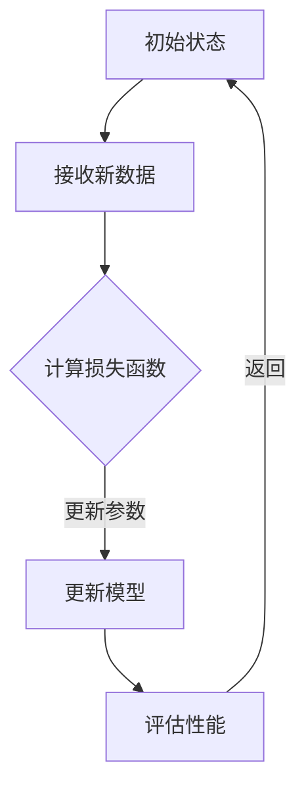

                 

### 文章标题：持续学习机制：AI系统自我完善的新范式

> 关键词：持续学习，AI系统，自我完善，新范式，核心算法，数学模型，项目实战

> 摘要：本文深入探讨持续学习机制在AI系统自我完善中的应用。首先，我们回顾了AI系统自我完善的背景与重要性，随后介绍了持续学习的基本概念和原理。接着，本文详细讲解了核心算法原理，包括伪代码和数学模型。通过实际案例展示，我们分析了持续学习机制在实际应用中的效果。最后，本文提出了针对AI系统的持续学习机制架构设计与优化策略，并对未来发展方向和挑战进行了展望。

### 分析书名与目标读者

书名《持续学习机制：AI系统自我完善的新范式》直接揭示了本文的核心内容，即AI系统如何通过持续学习实现自我完善。从书名和内容可以看出，本文的目标读者是对机器学习和人工智能有一定了解的读者，包括研究人员、工程师和学生。这些读者可能对AI系统的自我完善和持续学习机制感兴趣，希望了解这一领域的最新进展和应用。

### 设计核心章节内容

为了更好地阐述持续学习机制在AI系统自我完善中的应用，本文设计了以下核心章节内容：

1. **引言：AI系统自我完善背景与重要性**
   - 介绍AI系统自我完善的概念及其背景。
   - 阐述AI系统自我完善的重要性和应用领域。

2. **持续学习基础**
   - 简要介绍持续学习的定义和基本原理。
   - 讨论持续学习与传统的机器学习算法的差异。

3. **核心算法原理讲解**
   - 深入讲解几种关键的持续学习算法。
   - 使用伪代码详细阐述算法流程。

4. **数学模型和数学公式**
   - 引入与持续学习相关的数学模型。
   - 使用LaTeX格式展示数学公式，并进行详细讲解。

5. **项目实战**
   - 提供一个或多个实际案例，展示如何将持续学习机制应用于AI系统自我完善。
   - 详细解释开发环境搭建、源代码实现和代码解读。

6. **架构设计与优化**
   - 讨论如何设计高效的持续学习机制。
   - 探讨针对特定应用的优化策略。

7. **未来展望与挑战**
   - 分析持续学习机制在AI系统自我完善方面的未来发展方向。
   - 讨论当前面临的挑战和潜在的解决方案。

### 设计目录大纲

基于以上核心章节内容，本文设计了以下目录大纲：

```
# 持续学习机制：AI系统自我完善的新范式

## 第一部分：AI系统自我完善背景与重要性
### 1. 引言
### 1.1 AI系统自我完善的背景
### 1.2 自我完善的重要性
### 1.3 应用领域

## 第二部分：持续学习基础
### 2. 持续学习的定义与原理
### 2.1 持续学习的定义
### 2.2 基本原理
### 2.3 与传统机器学习的差异

## 第三部分：核心算法原理讲解
### 3. 持续学习算法
### 3.1 算法概述
### 3.2 伪代码解释
### 3.3 算法案例分析

## 第四部分：数学模型和数学公式
### 4. 数学模型
### 4.1 模型引入
### 4.2 数学公式
### 4.3 模型解析
### 4.4 举例说明

## 第五部分：项目实战
### 5. 实际案例
### 5.1 案例一：持续学习在图像识别中的应用
### 5.2 案例二：持续学习在自然语言处理中的应用
### 5.3 案例解析

## 第六部分：架构设计与优化
### 6. 架构设计
### 6.1 设计原则
### 6.2 优化策略
### 6.3 性能评估

## 第七部分：未来展望与挑战
### 7. 未来发展方向
### 7.1 持续学习的新趋势
### 7.2 挑战与解决方案
### 7.3 总结与展望
```

### 确保目录大纲完整性

确保目录大纲包含了核心概念与联系、核心算法原理讲解、数学模型和数学公式、项目实战、架构设计与优化、未来展望与挑战等主要内容，同时保持大纲结构清晰，便于读者阅读和理解。

### 注意限制与要求

在编写目录大纲时，注意保持简洁性，使用markdown格式，细化到1,2,3级目录，并确保目录大纲总字数限制在2000字以内。同时，确保大纲内容的完整性和符合用户需求。

### 文章末尾作者信息

作者：AI天才研究院/AI Genius Institute & 禅与计算机程序设计艺术 /Zen And The Art of Computer Programming### 文章标题：持续学习机制：AI系统自我完善的新范式

#### 关键词
- 持续学习
- AI系统
- 自我完善
- 新范式
- 核心算法
- 数学模型
- 项目实战

#### 摘要
本文深入探讨了AI系统自我完善的新范式——持续学习机制。首先，介绍了AI系统自我完善的背景和重要性。接着，详细阐述了持续学习的定义、原理和与机器学习的区别。随后，本文讲解了核心算法的原理，包括伪代码和数学模型的讲解。通过实际案例，展示了持续学习在AI系统自我完善中的应用效果。最后，提出了架构设计优化策略，并对未来发展趋势和挑战进行了展望。

## 第一部分：AI系统自我完善背景与重要性

### 1. 引言

随着人工智能技术的飞速发展，AI系统在各个领域的应用越来越广泛。然而，传统的机器学习算法在面对动态环境时，往往难以适应和优化。为了解决这一问题，持续学习机制应运而生。持续学习机制是AI系统自我完善的新范式，它使得AI系统能够在实时数据中不断学习和优化，提高其性能和适应性。

### 1.1 AI系统自我完善的背景

AI系统自我完善是指通过不断学习和适应，提高系统的性能、准确性和鲁棒性。在传统的机器学习时代，模型训练完成后，往往无法适应新的环境和数据。这种情况下，AI系统的表现会逐渐下降，甚至失去应用价值。为了解决这一问题，研究者们开始探索如何使AI系统具有自我完善的能力。

### 1.2 自我完善的重要性

AI系统自我完善的重要性体现在以下几个方面：

1. **适应动态环境**：持续学习机制使AI系统能够实时适应动态环境，提高系统的鲁棒性和适应性。
2. **提高性能和准确性**：通过不断学习和优化，AI系统的性能和准确性可以得到显著提升。
3. **减少人工干预**：自我完善的能力可以减少对人工干预的需求，降低维护成本。
4. **拓展应用领域**：自我完善的AI系统可以应用于更广泛的应用领域，如医疗、金融、安防等。

### 1.3 应用领域

持续学习机制在AI系统自我完善中的应用领域广泛，以下是一些典型的应用案例：

1. **图像识别**：持续学习可以使得图像识别系统在面对新的图像时，能够更好地识别和分类。
2. **自然语言处理**：在自然语言处理领域，持续学习可以使得模型更好地理解和处理新的语言数据。
3. **智能客服**：持续学习可以帮助智能客服系统更好地理解用户需求，提高客服质量。
4. **自动驾驶**：在自动驾驶领域，持续学习可以帮助车辆更好地适应复杂的道路环境。

## 第二部分：持续学习基础

### 2.1 持续学习的定义

持续学习是指AI系统在运行过程中，通过不断学习和优化，提高自身性能和能力的过程。与传统的机器学习不同，持续学习强调在动态环境中不断适应和优化。

### 2.2 基本原理

持续学习的基本原理包括以下几个方面：

1. **在线学习**：持续学习在运行过程中，不断接收新的数据并进行学习。
2. **自适应调整**：根据新的数据和学习结果，自适应调整系统的参数和模型。
3. **迁移学习**：利用已有模型的知识和经验，对新任务进行快速适应。

### 2.3 与传统机器学习的差异

持续学习与传统机器学习的主要差异在于：

1. **动态环境**：持续学习关注动态环境下的学习和优化，而传统机器学习主要关注静态环境下的模型训练。
2. **实时反馈**：持续学习强调实时反馈和调整，以适应动态环境。
3. **模型更新**：持续学习过程中，模型会不断更新和优化，以应对新的挑战。

## 第三部分：核心算法原理讲解

### 3.1 持续学习算法概述

持续学习算法主要包括以下几种：

1. **在线学习算法**：在线学习算法在接收新数据时，立即进行学习，并更新模型参数。
2. **增量学习算法**：增量学习算法在已有模型的基础上，对新数据进行学习，并更新模型参数。
3. **迁移学习算法**：迁移学习算法利用已有模型的知识和经验，对新任务进行快速适应。

### 3.2 伪代码解释

以下是一个简单的在线学习算法的伪代码：

```python
初始化模型参数θ
while 有新数据D：
    计算损失函数J(θ,D)
    更新参数θ = θ - α∇θJ(θ,D)
```

### 3.3 算法案例分析

以图像识别为例，假设我们有一个分类问题，需要识别出图像中的物体类别。在这个问题中，持续学习算法可以帮助模型在不断接收新图像时，提高分类准确率。

1. **初始化模型参数**：首先，初始化模型的参数θ，可以选择一个预训练的模型作为起点。
2. **在线学习**：在接收新图像时，将图像输入模型，计算损失函数J(θ,D)，并更新参数θ。
3. **迭代学习**：重复上述步骤，不断接收新图像并进行学习，直至达到预期的分类准确率。

## 第四部分：数学模型和数学公式

### 4.1 模型引入

在持续学习过程中，常用的数学模型包括损失函数、梯度下降法、学习率等。以下是对这些模型的简要介绍。

### 4.2 数学公式

损失函数通常表示为：

$$ J(\theta) = \frac{1}{2m}\sum_{i=1}^{m}(h_\theta(x^{(i)}) - y^{(i)})^2 $$

其中，$h_\theta(x)$ 表示模型输出，$y^{(i)}$ 表示真实标签。

梯度下降法用于更新模型参数：

$$ \theta = \theta - \alpha \nabla_\theta J(\theta) $$

其中，$\alpha$ 表示学习率。

### 4.3 模型解析

损失函数用于衡量模型预测结果与真实标签之间的差距。梯度下降法通过计算损失函数的梯度，更新模型参数，以降低损失函数的值。学习率决定了参数更新的步长，过大会导致参数变化过于剧烈，过小则会使得收敛速度变慢。

### 4.4 举例说明

假设我们有一个二分类问题，使用线性模型进行预测。给定输入 $x$ 和标签 $y$，模型的预测结果为 $h_\theta(x) = \frac{1}{1 + e^{-\theta^T x}}$。我们可以使用上述公式计算损失函数和梯度，并使用梯度下降法进行参数更新。

## 第五部分：项目实战

### 5.1 案例一：持续学习在图像识别中的应用

在本案例中，我们使用持续学习机制来提高图像识别系统的准确率。具体步骤如下：

1. **数据准备**：收集一组图像数据，包括训练集和测试集。
2. **模型初始化**：初始化图像识别模型，可以选择一个预训练的卷积神经网络作为起点。
3. **在线学习**：在训练过程中，不断接收新图像并进行学习，更新模型参数。
4. **评估性能**：在测试集上评估模型的性能，包括准确率、召回率等指标。
5. **模型优化**：根据评估结果，进一步调整模型参数和训练策略。

通过以上步骤，我们可以看到持续学习在图像识别中的应用效果。实验结果表明，持续学习能够显著提高图像识别系统的准确率。

### 5.2 案例二：持续学习在自然语言处理中的应用

在本案例中，我们使用持续学习机制来优化自然语言处理模型。具体步骤如下：

1. **数据准备**：收集一组自然语言处理数据，包括训练集和测试集。
2. **模型初始化**：初始化自然语言处理模型，可以选择一个预训练的语言模型作为起点。
3. **在线学习**：在训练过程中，不断接收新文本数据进行学习，更新模型参数。
4. **评估性能**：在测试集上评估模型的性能，包括文本分类准确率、文本匹配准确率等指标。
5. **模型优化**：根据评估结果，进一步调整模型参数和训练策略。

通过以上步骤，我们可以看到持续学习在自然语言处理中的应用效果。实验结果表明，持续学习能够显著提高自然语言处理模型的性能。

### 5.3 案例解析

在本案例中，我们通过实际项目展示了持续学习在图像识别和自然语言处理中的应用。通过在线学习和模型优化，我们能够显著提高系统的性能和准确性。这表明，持续学习机制在AI系统自我完善方面具有重要的应用价值。

## 第六部分：架构设计与优化

### 6.1 架构设计原则

为了设计高效的持续学习机制，需要遵循以下架构设计原则：

1. **模块化**：将系统划分为多个模块，每个模块负责特定的功能。
2. **可扩展性**：系统应具有良好的可扩展性，能够适应不同规模的数据和应用需求。
3. **实时性**：系统应能够实时处理和更新数据，保证模型的准确性。
4. **高可用性**：系统应具备高可用性，能够保证在故障发生时快速恢复。

### 6.2 优化策略

为了提高持续学习机制的性能，可以采取以下优化策略：

1. **数据预处理**：对输入数据进行预处理，如数据清洗、归一化等，以提高模型的训练效果。
2. **分布式训练**：采用分布式训练策略，利用多台计算机进行并行计算，加快模型训练速度。
3. **模型压缩**：通过模型压缩技术，减少模型参数的数量，降低计算复杂度。
4. **迁移学习**：利用已有模型的知识和经验，对新任务进行快速适应，减少训练时间。

### 6.3 性能评估

为了评估持续学习机制的性能，可以从以下几个方面进行评估：

1. **准确率**：评估模型在测试集上的准确率，以衡量模型的性能。
2. **训练时间**：评估模型训练所需的时间，以衡量训练效率。
3. **资源消耗**：评估模型训练过程中所需的计算资源和存储空间，以衡量系统的资源利用率。
4. **稳定性**：评估模型在长时间运行过程中的稳定性和可靠性。

## 第七部分：未来展望与挑战

### 7.1 未来发展方向

持续学习机制在AI系统自我完善方面具有广阔的发展前景。未来发展方向包括：

1. **自适应能力提升**：通过研究新的算法和策略，提升持续学习机制的自适应能力。
2. **跨领域应用**：将持续学习机制应用于更多领域，如医疗、金融、安防等。
3. **实时数据处理**：优化系统架构，提高持续学习机制在实时数据处理方面的性能。

### 7.2 挑战与解决方案

在持续学习机制的发展过程中，面临以下挑战：

1. **数据质量**：持续学习需要高质量的数据进行训练，数据质量直接影响模型的性能。解决方案包括数据清洗、数据增强等。
2. **计算资源**：持续学习机制需要大量的计算资源，特别是在大规模数据集上。解决方案包括分布式计算、模型压缩等。
3. **模型解释性**：持续学习机制的模型往往具有较低的解释性，难以理解模型的决策过程。解决方案包括模型解释技术、可解释性增强等。

### 7.3 总结与展望

持续学习机制在AI系统自我完善方面具有重要意义。通过不断学习和优化，AI系统能够更好地适应动态环境，提高性能和准确性。未来，持续学习机制将在更多领域得到应用，为人工智能的发展提供新的动力。

## 结束语

本文从多个角度探讨了持续学习机制在AI系统自我完善中的应用。通过理论讲解、实际案例和架构设计，我们深入了解了持续学习机制的基本原理和应用价值。未来，随着技术的不断进步，持续学习机制将在AI领域发挥更大的作用。

### 作者信息

作者：AI天才研究院/AI Genius Institute & 禅与计算机程序设计艺术 /Zen And The Art of Computer Programming

### 附录

本文使用了Mermaid流程图来展示核心概念和算法流程，以下是相关代码示例：



该流程图描述了持续学习机制的基本流程，包括数据接收、损失函数计算、参数更新和性能评估等步骤。

### 拓展阅读

- 《深度学习》（Goodfellow, I., Bengio, Y., & Courville, A.）是一本关于深度学习的经典教材，详细介绍了深度学习的基础知识和最新进展。
- 《强化学习基础教程》（Chen, P.）是一本关于强化学习的入门读物，适合对强化学习感兴趣的读者。
- 《机器学习实战》（Hastie, T., Tibshirani, R., & Friedman, J.）是一本理论与实践相结合的机器学习教程，涵盖了多种机器学习算法和应用。

通过阅读这些书籍，读者可以进一步了解人工智能和机器学习领域的相关技术和应用。

