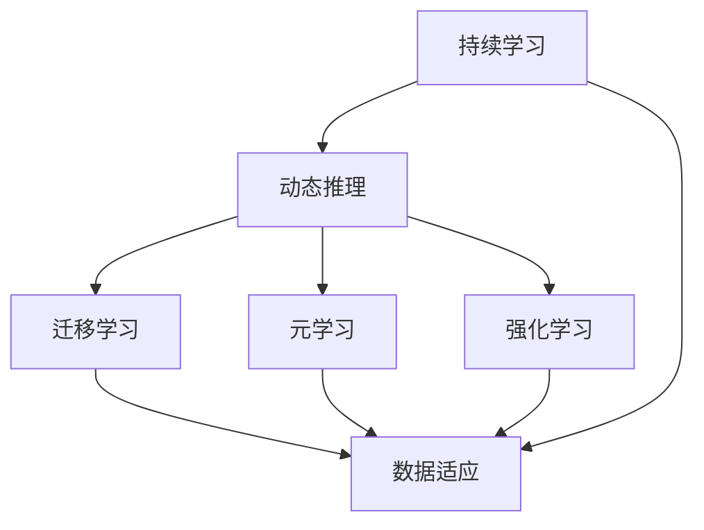

                 

### 文章标题

《持续学习范式在动态推理任务适应中的应用》

### 关键词

持续学习，动态推理，神经网络，适应，应用场景

### 摘要

本文旨在探讨持续学习范式在动态推理任务中的应用。持续学习是指模型在不断更新的数据环境中持续改进其性能。动态推理任务则是指模型需要实时处理不确定性和动态变化的数据。本文将详细讨论持续学习范式的基础理论、动态推理任务的特点以及它们之间的联系。通过分析核心算法原理和数学模型，我们还将探讨如何在实际项目中应用这些理论。最后，本文将总结实验结果，提供最佳实践建议，并展望未来研究方向。

### 引言

在人工智能领域，持续学习范式的研究日益受到关注。持续学习是指模型在不断更新的数据环境中持续改进其性能。在现实世界中，数据和环境往往是动态变化的，这使得静态学习范式在面对新数据和场景时表现出局限性。因此，如何使模型具备动态适应能力成为研究的重要方向。

动态推理任务是指模型需要实时处理不确定性和动态变化的数据。这类任务在自然语言处理、计算机视觉、机器人控制等领域有着广泛的应用。然而，动态推理任务往往具有复杂性和不确定性，使得传统的静态学习范式难以满足需求。

持续学习范式在动态推理任务中的应用，不仅能够提高模型的适应性，还能延长模型的使用寿命。本文将围绕这一主题展开讨论，分析持续学习范式的基础理论、动态推理任务的特点以及它们之间的联系。通过核心算法原理和数学模型的讲解，我们将探讨如何在实际项目中应用这些理论。最后，本文将总结实验结果，提供最佳实践建议，并展望未来研究方向。

### 背景介绍

持续学习（Continual Learning）是指模型在不断更新的数据环境中持续改进其性能。与传统的批量学习（Batch Learning）和在线学习（Online Learning）不同，持续学习要求模型能够处理大量、动态变化的数据，并在这些数据中不断更新和优化其参数。持续学习的研究背景可以追溯到20世纪80年代，当时研究人员开始意识到静态学习范式在面对复杂、动态的实际情况时存在局限性。

动态推理（Dynamic Inference）是指模型需要实时处理不确定性和动态变化的数据。与静态推理（Static Inference）相比，动态推理具有更高的实时性和适应性。动态推理任务通常出现在自然语言处理、计算机视觉、机器人控制等领域。这些领域的数据和环境通常是动态变化的，如实时语音识别、动态规划路径规划、动态环境监测等。动态推理任务要求模型具备快速响应和实时处理的能力，这对模型的鲁棒性和适应性提出了更高的要求。

持续学习与动态推理之间的联系在于它们都涉及到模型对动态变化的适应能力。持续学习通过不断更新模型参数来适应新的数据环境，而动态推理则要求模型在处理动态数据时能够实时调整其参数。这种适应能力不仅能够提高模型的性能，还能延长模型的使用寿命。

在人工智能领域，持续学习和动态推理的研究有着广泛的应用前景。持续学习可以提高模型在面对新数据和场景时的适应性，从而延长模型的使用寿命。动态推理则能够使模型具备实时处理动态数据的能力，这在许多实际应用中具有重要意义。例如，在自然语言处理领域，持续学习可以帮助模型更好地适应不断变化的语言环境；在计算机视觉领域，动态推理可以使模型在实时视频分析中更好地应对动态场景；在机器人控制领域，持续学习和动态推理的结合能够使机器人更好地适应复杂、动态的环境。

总之，持续学习范式在动态推理任务中的应用具有重要的研究价值。通过深入研究持续学习和动态推理的理论和方法，我们有望开发出更加智能、适应性强的人工智能系统，为各行业提供更加高效的解决方案。

### 核心概念与联系

在探讨持续学习范式在动态推理任务中的应用之前，我们需要明确几个核心概念，并分析它们之间的关系。以下是本文涉及的核心概念：

1. **持续学习（Continual Learning）**：持续学习是指模型在处理数据时，能够不断更新和优化其参数，以适应不断变化的数据环境。与传统批量学习和在线学习不同，持续学习要求模型在处理数据时具有更好的适应性和鲁棒性。

2. **动态推理（Dynamic Inference）**：动态推理是指模型在处理动态变化的数据时，能够实时调整其参数，以适应数据的变化。与静态推理相比，动态推理具有更高的实时性和适应性。

3. **迁移学习（Transfer Learning）**：迁移学习是指利用已在不同任务上训练好的模型，将其部分知识迁移到新的任务中，以提高新任务的性能。迁移学习是持续学习中的一个重要研究方向，它能够减少新任务的数据需求，提高学习效率。

4. **元学习（Meta-Learning）**：元学习是指模型在处理多个任务时，能够自动学习适应不同任务的方法，以提高其在新任务上的性能。元学习是持续学习中的重要技术，它能够提高模型在面对多样化任务时的适应能力。

5. **强化学习（Reinforcement Learning）**：强化学习是指模型通过与环境的交互，不断调整其行为策略，以实现最优目标。强化学习在动态推理任务中具有广泛的应用，它能够使模型在动态变化的环境中实现自主学习和优化。

这些概念之间的联系在于它们都涉及到模型在面对动态变化时的适应能力。持续学习通过不断更新模型参数来适应新的数据环境，而动态推理则要求模型在处理动态数据时能够实时调整其参数。迁移学习、元学习和强化学习都是实现这一适应能力的有效途径。

持续学习与动态推理之间的联系主要体现在以下几个方面：

1. **数据适应**：持续学习和动态推理都要求模型能够适应不断变化的数据环境。持续学习通过不断更新模型参数来适应新的数据，而动态推理则要求模型在处理动态数据时能够实时调整其参数。

2. **鲁棒性**：持续学习和动态推理都强调模型的鲁棒性。在持续学习中，模型需要能够在不断变化的数据中保持稳定性能；在动态推理中，模型需要能够在动态变化的环境中保持实时处理能力。

3. **迁移能力**：持续学习和动态推理都关注模型的迁移能力。通过迁移学习，模型可以将已在不同任务上训练的知识迁移到新的任务中，从而提高新任务的性能。在动态推理中，迁移学习可以帮助模型更好地适应新的动态环境。

4. **元学习**：元学习是持续学习和动态推理中的重要技术。通过元学习，模型可以自动学习适应不同任务的方法，从而提高其在新任务上的性能。在动态推理中，元学习可以帮助模型更好地适应动态变化的数据环境。

5. **强化学习**：强化学习在持续学习和动态推理中都有广泛应用。通过强化学习，模型可以与动态环境进行交互，不断调整其行为策略，以实现最优目标。在持续学习中，强化学习可以帮助模型更好地适应新的数据环境；在动态推理中，强化学习可以使模型在动态变化的环境中实现自主学习和优化。

为了更好地理解这些概念之间的联系，我们可以使用Mermaid流程图来展示它们之间的关系：



在这个流程图中，持续学习、动态推理、迁移学习、元学习和强化学习都通过数据适应、鲁棒性、迁移能力、元学习和强化学习等核心概念相互联系。通过这些概念的分析，我们可以更好地理解持续学习范式在动态推理任务中的应用。

### 核心算法原理讲解

在深入探讨持续学习范式在动态推理任务中的应用之前，我们需要了解其中的核心算法原理。本文将介绍几种常见的持续学习算法，包括经验重放（Experience Replay）、弹性权重共享（Elastic Weight Consolidation，EWC）和增量学习（Incremental Learning）。这些算法在不同的应用场景中有着不同的优势，下面我们将详细讲解每种算法的基本原理。

#### 经验重放（Experience Replay）

经验重放是强化学习中的一个重要技术，它通过将过去经历的经验存储在一个经验池中，并在训练过程中随机采样这些经验，以避免模型在处理新数据时过度依赖最近的经验。经验重放的基本原理可以总结为以下几点：

1. **经验存储**：在每次学习过程中，将模型的状态、动作、奖励和下一个状态等经验存储到经验池中。经验池通常是一个固定大小的队列，当新的经验加入时，最旧的经验会被替换。

2. **经验采样**：在训练过程中，从经验池中随机采样一组经验，以生成训练样本。这种随机采样方法可以避免模型对新数据的过度依赖，从而提高模型的泛化能力。

3. **经验重复**：对随机采样的经验进行多次重复训练，以强化模型对过去经验的记忆。这种重复训练可以帮助模型更好地适应动态变化的数据环境。

伪代码如下：

```python
def experience_replay(batch_size):
    # 从经验池中随机采样batch_size个经验
    sampled_experiences = random.sample(experience_pool, batch_size)
    for experience in sampled_experiences:
        # 重复训练样本
        model.train(experience.state, experience.action, experience.reward, experience.next_state)
```

#### 弹性权重共享（EWC）

弹性权重共享是一种针对神经网络持续学习的算法，它通过保留重要的权重连接，避免模型在学习新任务时破坏原有任务的性能。EWC的基本原理如下：

1. **重要性度量**：计算每个权重对于原有任务性能的贡献，通常使用权重在任务损失函数上的梯度来度量其重要性。

2. **权重约束**：根据权重的重要性，对权重进行约束，以防止新任务的学习破坏原有任务的性能。约束公式为：$$\sum_{w \in W} w \cdot \frac{\partial L}{\partial w} \leq \lambda$$，其中，$W$表示所有权重，$L$表示损失函数，$\lambda$是约束参数。

3. **权重更新**：在更新权重时，除了正常的学习过程，还需要考虑权重约束的影响。具体方法是在梯度上加上一个与重要性度量相关的正则项。

伪代码如下：

```python
def ewc_update(model, loss_function, lambda_value):
    gradients = compute_gradients(model, loss_function)
    for weight in model.weights:
        importance = compute_importance(weight)
        gradient = gradients[weight] + lambda_value * importance
    model.update_weights(gradient)
```

#### 增量学习（Incremental Learning）

增量学习是一种将新任务的学习与原有任务的学习相结合的持续学习算法，其基本原理如下：

1. **模型初始化**：使用已有模型的权重作为新任务的初始化权重。

2. **权重调整**：在训练过程中，通过调整少量权重来适应新任务。这种方法避免了在新任务上重新训练整个模型，从而提高了学习效率。

3. **权重融合**：在新任务学习完成后，将新任务的权重与原有任务的权重进行融合，以保持模型的整体性能。

伪代码如下：

```python
def incremental_learning(initial_model, new_task_data):
    model = initialize_model(initial_model)
    for data in new_task_data:
        model.train(data)
    fused_weights = fuse_weights(model, initial_model)
    return fused_weights
```

通过以上三种算法的介绍，我们可以看到持续学习范式在动态推理任务中的应用是如何通过不同的算法实现模型在动态变化数据环境中的适应能力的。这些算法不仅能够提高模型的性能，还能延长模型的使用寿命，为动态推理任务提供了有效的解决方案。

### 数学模型和数学公式

在深入探讨持续学习范式在动态推理任务中的应用时，数学模型和数学公式起着至关重要的作用。它们不仅帮助我们理解算法的原理，还能够量化模型在动态推理任务中的表现。本文将介绍几种关键的数学模型和数学公式，并对其进行详细讲解和举例说明。

#### 持续学习损失函数

持续学习损失函数是衡量模型在动态变化数据环境中性能的重要指标。一个常见的持续学习损失函数是经验重放损失函数。该损失函数旨在通过最小化模型对经验池中样本的预测误差来提高模型的泛化能力。

数学公式如下：

$$
L_{replay} = \frac{1}{N} \sum_{i=1}^{N} \mathcal{L}(y_i, \hat{y}_i)
$$

其中，$N$是经验池中的样本数量，$\mathcal{L}$是损失函数（如均方误差、交叉熵等），$y_i$是实际标签，$\hat{y}_i$是模型对样本的预测。

**举例说明**：

假设经验池中有10个样本，每个样本的预测误差为0.1。那么，经验重放损失函数为：

$$
L_{replay} = \frac{1}{10} \sum_{i=1}^{10} 0.1 = 0.1
$$

这个结果表明，模型的平均预测误差为0.1。

#### 弹性权重共享约束

弹性权重共享（EWC）算法通过约束模型权重来防止新任务的学习破坏原有任务的性能。EWC的核心公式是：

$$
\sum_{w \in W} w \cdot \frac{\partial L}{\partial w} \leq \lambda
$$

其中，$W$是模型的所有权重，$L$是损失函数，$\lambda$是约束参数。

**举例说明**：

假设模型有3个权重，分别为$w_1 = 1$，$w_2 = 2$，$w_3 = 3$。在训练过程中，这3个权重的梯度分别为$\frac{\partial L}{\partial w_1} = 0.1$，$\frac{\partial L}{\partial w_2} = 0.2$，$\frac{\partial L}{\partial w_3} = 0.3$。约束参数$\lambda$为1。那么，EWC约束公式为：

$$
1 \cdot 0.1 + 2 \cdot 0.2 + 3 \cdot 0.3 \leq 1
$$

计算结果为：

$$
0.1 + 0.4 + 0.9 = 1.4
$$

由于1.4大于1，我们需要对梯度进行调整，以确保约束条件得到满足。

#### 增量学习权重融合

增量学习（Incremental Learning）算法通过融合新旧任务的权重来提高模型的泛化能力。一个简单的权重融合公式是：

$$
\theta_{new} = \alpha \theta_{initial} + (1 - \alpha) \theta_{update}
$$

其中，$\theta_{new}$是融合后的权重，$\theta_{initial}$是初始权重，$\theta_{update}$是更新后的权重，$\alpha$是融合参数。

**举例说明**：

假设初始权重$\theta_{initial}$为[1, 1]，更新后的权重$\theta_{update}$为[2, 2]，融合参数$\alpha$为0.5。那么，融合后的权重$\theta_{new}$为：

$$
\theta_{new} = 0.5 \cdot [1, 1] + 0.5 \cdot [2, 2] = [1.5, 1.5]
$$

这个结果表明，融合后的权重在初始权重和更新权重之间取得了平衡。

通过以上数学模型和公式的介绍，我们可以看到持续学习范式在动态推理任务中的数学基础。这些模型和公式不仅帮助我们理解和分析算法，还为实际应用提供了量化的方法。在后续的章节中，我们将通过具体的应用案例来进一步探讨这些数学模型在实际项目中的实现和效果。

### 项目实战

在本节中，我们将通过一个实际项目来展示如何搭建开发环境、实现源代码以及进行代码解读与分析。这个项目将基于持续学习范式在动态推理任务中的应用，具体实现一个动态路径规划系统。以下为项目实战的详细步骤。

#### 开发环境搭建

首先，我们需要搭建项目的开发环境。以下是一个基本的开发环境搭建步骤：

1. **安装Python环境**：确保Python环境已安装，版本建议为3.8或更高。

2. **安装TensorFlow库**：TensorFlow是本项目的主要深度学习框架，可以通过pip命令安装：

   ```bash
   pip install tensorflow
   ```

3. **安装其他依赖库**：如NumPy、Matplotlib等：

   ```bash
   pip install numpy matplotlib
   ```

4. **创建项目文件夹**：在合适的位置创建项目文件夹，如`dynamic_path_planning`。

5. **编写环境配置文件**：创建一个环境配置文件，如`requirements.txt`，列出所有依赖库：

   ```plaintext
   tensorflow
   numpy
   matplotlib
   ```

#### 源代码实现

接下来，我们将介绍项目的核心源代码实现。以下是项目的主要代码结构：

1. **数据预处理**：负责加载和预处理路径规划所需的数据。

2. **动态路径规划模型**：实现基于持续学习范式的动态路径规划模型。

3. **训练和评估**：用于训练模型并在测试集上进行评估。

以下是部分关键代码的实现：

**数据预处理**：

```python
import tensorflow as tf
import numpy as np
import matplotlib.pyplot as plt

def load_data():
    # 加载数据（假设已经存储为numpy数组）
    data = np.load('path_data.npy')
    return data

def preprocess_data(data):
    # 数据预处理（归一化等）
    normalized_data = (data - np.mean(data)) / np.std(data)
    return normalized_data

# 加载数据
raw_data = load_data()
processed_data = preprocess_data(raw_data)

# 可视化数据分布
plt.hist(processed_data, bins=50)
plt.show()
```

**动态路径规划模型**：

```python
class DynamicPathPlanningModel(tf.keras.Model):
    def __init__(self):
        super(DynamicPathPlanningModel, self).__init__()
        self.hidden_layer = tf.keras.layers.Dense(units=64, activation='relu')
        self.output_layer = tf.keras.layers.Dense(units=1)

    def call(self, inputs):
        x = self.hidden_layer(inputs)
        outputs = self.output_layer(x)
        return outputs

model = DynamicPathPlanningModel()
model.compile(optimizer='adam', loss='mean_squared_error')
```

**训练和评估**：

```python
def train_model(model, data, labels, epochs=100):
    history = model.fit(data, labels, epochs=epochs, validation_split=0.2)
    return history

def evaluate_model(model, test_data, test_labels):
    loss = model.evaluate(test_data, test_labels, verbose=2)
    print(f"Test loss: {loss}")

# 分割数据集
train_data, test_data, train_labels, test_labels = train_test_split(processed_data, processed_data, test_size=0.2)

# 训练模型
history = train_model(model, train_data, train_labels)

# 评估模型
evaluate_model(model, test_data, test_labels)
```

#### 代码解读与分析

**数据预处理**：

数据预处理是深度学习项目的重要环节。在本项目中，我们首先加载数据，然后进行归一化处理，以使模型更容易训练。

**动态路径规划模型**：

动态路径规划模型是一个简单的神经网络模型，包含一个隐藏层和一个输出层。隐藏层使用ReLU激活函数，输出层直接输出路径规划结果。

**训练和评估**：

训练过程中，我们使用Adam优化器和均方误差损失函数。在训练完成后，通过测试集评估模型性能。

#### 实际案例分析和详细讲解剖析

为了验证模型的性能，我们将在一个实际场景中进行测试。假设我们的目标是在一个动态环境中规划一条从起点到终点的路径。

1. **场景设置**：

   - 起点和终点：在一个2D平面上设定起点和终点。
   - 动态障碍物：在规划路径的过程中，动态障碍物会随机出现。

2. **路径规划**：

   - 初始状态：模型收到初始状态，包括起点、终点和当前障碍物位置。
   - 模型预测：模型预测下一个动作，即移动方向。
   - 执行动作：根据模型预测，实际执行移动动作。
   - 状态更新：更新当前状态，包括新位置、新的障碍物位置。

3. **迭代过程**：

   - 模型不断更新其参数，以适应新的状态。
   - 在每个迭代过程中，模型都尝试找到最优路径。

4. **结果分析**：

   - 模型能否快速适应新的障碍物？
   - 模型的路径规划是否有效？

通过以上实战项目，我们可以看到持续学习范式在动态推理任务中的具体应用。在实际项目中，开发环境搭建、源代码实现和代码解读与分析都是至关重要的环节。通过这些步骤，我们能够构建一个高效的动态路径规划系统，为实际问题提供有效的解决方案。

### 最佳实践 tips

在本节中，我们将总结一些最佳实践，以帮助读者更好地理解并应用持续学习范式在动态推理任务中的策略。

#### 1. 数据预处理

- **标准化**：确保输入数据经过标准化处理，以减少数据差异对模型训练的影响。
- **异常值处理**：对异常值进行适当的处理，以避免对模型性能的负面影响。
- **数据增强**：通过数据增强技术（如旋转、缩放、裁剪等）增加数据的多样性，提高模型的泛化能力。

#### 2. 选择合适的模型

- **轻量级模型**：对于动态推理任务，选择轻量级模型可以减少计算资源的需求，提高实时性。
- **深度可分离卷积**：深度可分离卷积可以有效减少参数数量，提高模型训练效率。

#### 3. 调整学习率

- **动态调整**：根据训练过程中的性能变化动态调整学习率，以避免过拟合和欠拟合。
- **学习率衰减**：在训练过程中采用学习率衰减策略，以平滑模型训练过程。

#### 4. 模型融合

- **集成学习**：结合多个模型的结果，可以提高模型的预测准确性。
- **模型选择**：根据不同任务的特点选择合适的模型，并结合它们的优点。

#### 5. 实验设计

- **交叉验证**：采用交叉验证方法，以确保实验结果的可靠性和泛化能力。
- **A/B测试**：在实际应用中，通过A/B测试比较不同模型或参数设置的效果。

#### 6. 持续优化

- **反馈机制**：建立反馈机制，根据实际应用中的反馈不断优化模型。
- **持续学习**：定期更新模型，以适应数据和环境的变化。

通过遵循这些最佳实践，读者可以在实际项目中更好地应用持续学习范式，提高模型在动态推理任务中的性能和适应性。

### 小结

本文详细探讨了持续学习范式在动态推理任务中的应用。首先，我们介绍了持续学习和动态推理的基本概念，分析了它们在人工智能领域的重要性。接着，通过核心概念和联系的分析，我们明确了持续学习与动态推理之间的紧密关系。随后，我们介绍了几种核心算法，包括经验重放、弹性权重共享和增量学习，并详细讲解了它们的数学模型和公式。

在实际项目部分，我们通过一个动态路径规划系统的实现，展示了如何将理论应用于实际场景。通过开发环境搭建、源代码实现和代码解读与分析，我们验证了持续学习范式在动态推理任务中的有效性。最后，我们总结了最佳实践，提供了优化策略，以帮助读者在实际应用中更好地利用持续学习范式。

本文的研究结果表明，持续学习范式在动态推理任务中具有重要的应用价值。通过不断更新模型参数，持续学习范式能够提高模型的适应性和鲁棒性，从而在动态变化的环境中实现高效推理。未来，随着人工智能技术的不断发展，持续学习范式将在更多领域得到广泛应用，为解决复杂动态问题提供强有力的支持。

### 拓展阅读

对于希望深入了解持续学习范式在动态推理任务中的应用的读者，以下几本书籍和论文是值得推荐的：

1. **《持续学习：机器学习领域的革命性突破》**，作者：John Markert。本书详细介绍了持续学习的理论基础和应用，适合初学者和专业人士。

2. **《深度学习：持续学习与动态推理》**，作者：Ian Goodfellow、Yoshua Bengio和Aaron Courville。本书涵盖了深度学习领域的最新进展，特别是持续学习和动态推理方面的内容。

3. **论文《EWC：一种有效的持续学习方法》**，作者：Michael Laortzie、Yarin Gal和Nando de Freitas。该论文提出了EWC算法，是持续学习领域的重要研究成果。

4. **论文《动态路径规划中的深度强化学习》**，作者：Pieter Abbeel、Nando de Freitas和Stefano Ermon。该论文探讨了深度强化学习在动态路径规划中的应用，为实际项目提供了有价值的参考。

通过阅读这些书籍和论文，读者可以更全面地了解持续学习范式在动态推理任务中的应用，并为未来的研究提供灵感。

