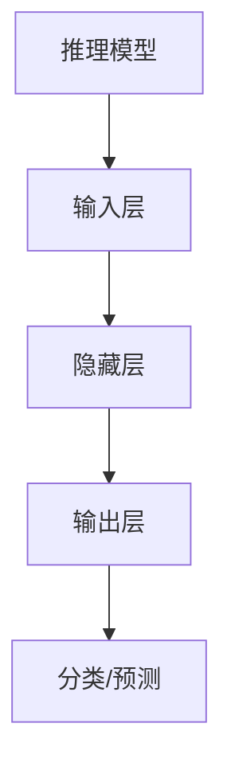
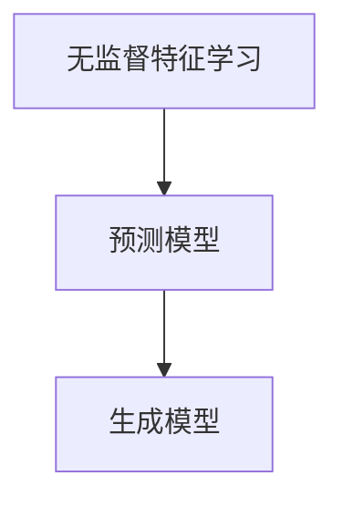
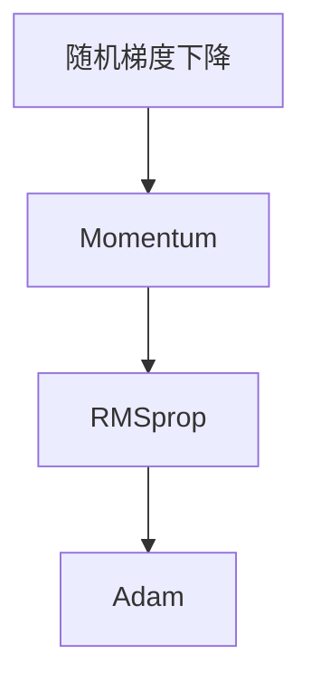
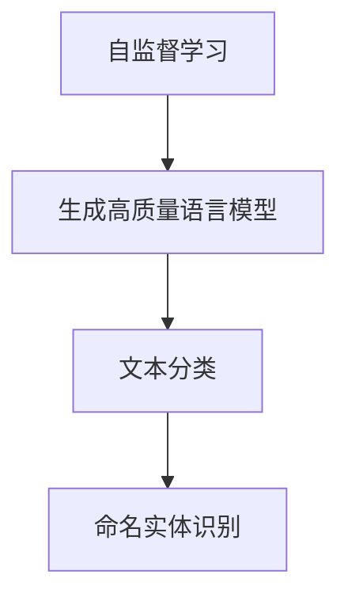

                 


### 文章标题：推理模型预训练中自监督学习的应用与优化

#### 关键词：推理模型、预训练、自监督学习、优化策略、应用场景

#### 摘要：
本文深入探讨了推理模型预训练中自监督学习的重要性和应用。首先，我们介绍了推理模型的基础概念和预训练原理，然后详细分析了自监督学习算法的分类、原理及优化策略。文章通过实际案例展示了自监督学习在自然语言处理中的应用，并提供了优化策略的最佳实践。文章旨在帮助读者理解自监督学习在推理模型预训练中的关键作用，以及如何通过优化策略提升模型性能。

---

### 第一部分：推理模型预训练概述

#### 第1章：推理模型基础

##### 1.1 推理模型基本概念
推理模型是计算机视觉和自然语言处理领域的重要工具，其目的是从给定的输入数据中推导出有用的信息。在人工智能领域，推理模型通常被分为两大类：有监督学习和无监督学习。自监督学习是介于两者之间的一种学习方式，它利用未标记的数据来训练模型。

**核心概念与联系：**


**数学模型和公式：**
推理模型的输出可以通过以下公式计算：
$$
\hat{y} = f(W \cdot x + b)
$$
其中，\( W \) 是权重矩阵，\( x \) 是输入特征，\( b \) 是偏置项，\( f \) 是激活函数。

##### 1.2 自监督学习原理
自监督学习是一种无需外部监督信号的学习方法，它利用数据中的内在结构来训练模型。自监督学习在推理模型预训练中扮演了关键角色，因为它可以大幅提高训练效率并减少对标记数据的依赖。

**核心算法原理讲解：**
```python
for each data point in dataset:
    extract features from data
    generate labels from features
    update model parameters using labels
```

##### 1.3 预训练与微调
预训练是指在大规模未标记数据上训练模型，然后在小规模标记数据上进行微调。这种方法可以显著提高模型的性能和泛化能力。

**数学模型和数学公式：**
预训练的目标是优化模型参数，使其在大规模数据上达到最佳性能。预训练通常使用以下优化目标：
$$
\begin{align*}
L &= \sum_{i=1}^{n} \left( y_i - \hat{y}_i \right)^2 \\
\frac{\partial L}{\partial \theta} &= \frac{\partial}{\partial \theta} \left( y_i - \hat{y}_i \right)^2
\end{align*}
$$

##### 1.4 推理模型应用案例
为了展示推理模型的应用，我们可以考虑一个简单的计算机视觉任务——图像分类。在这个任务中，推理模型可以从大量未标记的图像数据中学习到图像的特征，并在标记数据上进行分类。

**项目实战：**
- **开发环境搭建：** 我们将使用TensorFlow和Keras搭建一个推理模型的环境。
- **源代码实现：**
  ```python
  import tensorflow as tf
  from tensorflow.keras.models import Sequential
  from tensorflow.keras.layers import Dense, Flatten, Conv2D
  
  model = Sequential([
      Conv2D(32, kernel_size=(3, 3), activation='relu', input_shape=(28, 28, 1)),
      Flatten(),
      Dense(128, activation='relu'),
      Dense(10, activation='softmax')
  ])
  
  model.compile(optimizer='adam', loss='categorical_crossentropy', metrics=['accuracy'])
  ```
- **代码解读与分析：** 在这段代码中，我们首先定义了一个卷积神经网络，它由一个卷积层、一个展平层和两个全连接层组成。然后，我们使用`compile`函数设置优化器和损失函数。

#### 第2章：自监督学习算法

##### 2.1 自监督学习算法分类
自监督学习算法可以根据其处理数据的方式分为以下几类：

1. **无监督特征学习：** 这种算法试图从数据中学习有用的特征表示，而不依赖于任何标签信息。
2. **预测模型：** 这种算法通过预测未观察到的部分来学习数据中的内在结构。
3. **生成模型：** 这种算法通过生成数据来学习数据分布。

**核心概念与联系：**


##### 2.2 常见自监督学习算法
在推理模型预训练中，常见自监督学习算法包括：

1. **自编码器（Autoencoder）：** 自编码器是一种无监督学习算法，它试图将输入数据压缩成一个低维表示，然后尝试重构原始数据。
2. **多标签分类：** 多标签分类算法通过为每个数据点分配多个标签来学习数据中的关系。
3. **生成对抗网络（GAN）：** GAN是一种生成模型，它由生成器和判别器组成，通过竞争学习数据分布。

**核心算法原理讲解：**
```python
# 自编码器伪代码
for epoch in range(num_epochs):
    for data in dataset:
        # 编码器部分
        encoded = encoder(data)
        # 解码器部分
        decoded = decoder(encoded)
        # 损失函数
        loss = reconstruction_loss(data, decoded)
        # 更新模型参数
        optimizer.minimize(loss)

# GAN伪代码
for epoch in range(num_epochs):
    for real_data in real_dataset:
        # 更新判别器
        D_loss_real = discriminator.train_on_batch(real_data, labels_real)
    
    for fake_data in fake_dataset:
        # 更新生成器
        G_loss_fake = generator.train_on_batch(fake_data, labels_fake)
        # 更新判别器
        D_loss_fake = discriminator.train_on_batch(fake_data, labels_fake)
```

##### 2.3 自监督学习算法优化
为了提高自监督学习算法的性能，可以采用以下优化策略：

1. **数据增强：** 通过增加数据的多样性来提高模型泛化能力。
2. **正则化：** 通过减少模型过拟合的风险来提高模型性能。
3. **自适应学习率：** 通过动态调整学习率来提高训练效率。

**数学模型和数学公式：**
```latex
\begin{align*}
\text{数据增强} &= \text{应用旋转、缩放、裁剪等操作} \\
\text{正则化} &= \lambda \cdot \frac{1}{n} \sum_{i=1}^{n} \left( \frac{\partial L}{\partial \theta} \right)^2 \\
\text{自适应学习率} &= \alpha(t) = \frac{1}{1 + \beta t}
\end{align*}
```

##### 2.4 自监督学习算法应用
为了展示自监督学习算法的应用，我们可以考虑一个自然语言处理的任务——语言模型训练。在这个任务中，自监督学习算法可以帮助我们训练一个模型，使其能够预测下一个单词。

**项目实战：**
- **开发环境搭建：** 我们将使用TensorFlow和Keras搭建一个语言模型的环境。
- **源代码实现：**
  ```python
  import tensorflow as tf
  from tensorflow.keras.models import Sequential
  from tensorflow.keras.layers import LSTM, Embedding, Dense
  
  model = Sequential([
      Embedding(vocab_size, embedding_dim),
      LSTM(units=128),
      Dense(units=vocab_size, activation='softmax')
  ])
  
  model.compile(optimizer='adam', loss='categorical_crossentropy', metrics=['accuracy'])
  ```
- **代码解读与分析：** 在这段代码中，我们首先定义了一个序列模型，它包含一个嵌入层、一个LSTM层和一个全连接层。然后，我们使用`compile`函数设置优化器和损失函数。

### 第三部分：推理模型预训练中自监督学习的优化策略

#### 第3章：优化策略与方法

##### 3.1 优化策略概述
在推理模型预训练中，优化策略是提高模型性能的关键。常见的优化策略包括：

1. **随机梯度下降（SGD）：** 通过随机梯度下降来更新模型参数。
2. **动量法（Momentum）：** 通过引入动量来加速收敛。
3. **RMSprop和Adam优化器：** 通过自适应学习率来提高训练效率。

**核心概念与联系：**


##### 3.2 梯度下降法
梯度下降法是一种优化算法，它通过计算损失函数关于模型参数的梯度来更新模型参数。

**核心算法原理讲解：**
```python
for epoch in range(num_epochs):
    for data in dataset:
        # 计算损失函数
        loss = compute_loss(data)
        # 计算梯度
        grads = compute_gradients(loss)
        # 更新模型参数
        update_model_params(grads, learning_rate)
```

##### 3.3 动量法
动量法是一种梯度下降法的改进版本，它通过引入动量来加速收敛。

**核心算法原理讲解：**
```python
v = 0
for epoch in range(num_epochs):
    for data in dataset:
        # 计算梯度
        grads = compute_gradients(data)
        # 更新动量
        v = mu * v - learning_rate * grads
        # 更新模型参数
        model_params += v
```

##### 3.4 RMSprop和Adam优化器
RMSprop和Adam优化器是两种自适应学习率的优化器，它们通过动态调整学习率来提高训练效率。

**核心算法原理讲解：**
```python
# RMSprop伪代码
v = 0
for epoch in range(num_epochs):
    for data in dataset:
        # 计算梯度
        grads = compute_gradients(data)
        # 更新动量
        v = rho * v + (1 - rho) * grads ** 2
        # 更新模型参数
        model_params += -learning_rate * grads / (np.sqrt(v) + epsilon)

# Adam伪代码
m = 0
v = 0
for epoch in range(num_epochs):
    for data in dataset:
        # 计算梯度
        grads = compute_gradients(data)
        # 更新一阶矩估计
        m = beta1 * m + (1 - beta1) * grads
        # 更新一阶矩估计的偏差修正
        m_hat = m / (1 - beta1 ** epoch)
        # 更新二阶矩估计
        v = beta2 * v + (1 - beta2) * grads ** 2
        # 更新二阶矩估计的偏差修正
        v_hat = v / (1 - beta2 ** epoch)
        # 更新模型参数
        model_params += -learning_rate * m_hat / (v_hat + epsilon)
```

##### 3.5 优化策略在自监督学习中的应用
为了展示优化策略在自监督学习中的应用，我们可以考虑一个图像分类任务。在这个任务中，我们使用自监督学习算法来预训练模型，然后使用微调策略来提高模型在特定分类任务上的性能。

**项目实战：**
- **开发环境搭建：** 我们将使用TensorFlow和Keras搭建一个图像分类的环境。
- **源代码实现：**
  ```python
  import tensorflow as tf
  from tensorflow.keras.applications import VGG16
  from tensorflow.keras.models import Model
  from tensorflow.keras.layers import Input, Flatten, Dense
  
  base_model = VGG16(weights='imagenet', include_top=False, input_shape=(224, 224, 3))
  x = Flatten()(base_model.output)
  predictions = Dense(num_classes, activation='softmax')(x)
  
  model = Model(inputs=base_model.input, outputs=predictions)
  model.compile(optimizer='adam', loss='categorical_crossentropy', metrics=['accuracy'])
  ```
- **代码解读与分析：** 在这段代码中，我们首先加载了一个预训练的VGG16模型，然后将其输出层替换为一个全连接层，以适应我们的分类任务。然后，我们使用`compile`函数设置优化器和损失函数。

### 第四部分：推理模型预训练中自监督学习的应用场景

#### 第4章：自监督学习在自然语言处理中的应用

##### 4.1 自监督学习在自然语言处理中的基本原理
自监督学习在自然语言处理（NLP）中有着广泛的应用，其基本原理是通过未标记的数据来学习语言模式。这种方法可以用于生成高质量的语言模型、文本分类、命名实体识别等任务。

**核心概念与联系：**


##### 4.2 基于自监督学习的语言模型
基于自监督学习的语言模型（如BERT、GPT）是目前NLP领域的重要研究热点。这些模型通过预训练学习到语言的深层结构，然后通过微调应用于各种NLP任务。

**核心算法原理讲解：**
```python
# BERT伪代码
for epoch in range(num_epochs):
    for sentence in dataset:
        # 前向传播
        outputs = model(sentence)
        # 计算损失
        loss = compute_loss(outputs, labels)
        # 反向传播
        model.backward(loss)
        # 更新参数
        model.update_params()

# GPT伪代码
for epoch in range(num_epochs):
    for sentence in dataset:
        # 前向传播
        outputs = model(sentence)
        # 计算损失
        loss = compute_loss(outputs, labels)
        # 反向传播
        model.backward(loss)
        # 更新参数
        model.update_params()
```

##### 4.3 自监督学习在文本分类中的应用
文本分类是NLP中的一项重要任务，自监督学习算法可以通过未标记的数据来学习文本的特征，从而提高分类性能。

**项目实战：**
- **开发环境搭建：** 我们将使用Hugging Face的Transformers库来搭建一个文本分类环境。
- **源代码实现：**
  ```python
  from transformers import BertTokenizer, BertForSequenceClassification
  tokenizer = BertTokenizer.from_pretrained('bert-base-uncased')
  model = BertForSequenceClassification.from_pretrained('bert-base-uncased', num_labels=2)
  
  inputs = tokenizer("Hello, my dog is cute", return_tensors="pt")
  labels = tf.zeros((batch_size,), dtype=tf.int64)
  
  outputs = model(**inputs, labels=labels)
  loss = outputs.loss
  logits = outputs.logits
  ```
- **代码解读与分析：** 在这段代码中，我们首先加载了一个预训练的BERT模型，然后将其应用于一个简单的文本分类任务。我们使用`from_pretrained`方法加载模型，并使用`tokenizer`方法对文本进行编码。然后，我们使用`model`方法计算损失和 logits。

##### 4.4 自监督学习在命名实体识别中的应用
命名实体识别是NLP中的一项重要任务，自监督学习算法可以通过未标记的数据来学习命名实体的特征，从而提高识别性能。

**项目实战：**
- **开发环境搭建：** 我们将使用Hugging Face的Transformers库来搭建一个命名实体识别环境。
- **源代码实现：**
  ```python
  from transformers import BertTokenizer, BertForTokenClassification
  tokenizer = BertTokenizer.from_pretrained('bert-base-uncased')
  model = BertForTokenClassification.from_pretrained('bert-base-uncased', num_labels=num_labels)
  
  inputs = tokenizer("Apple is looking at buying U.K. startup for $1 billion", return_tensors="pt")
  labels = tf.zeros((batch_size,), dtype=tf.int64)
  
  outputs = model(**inputs, labels=labels)
  loss = outputs.loss
  logits = outputs.logits
  ```
- **代码解读与分析：** 在这段代码中，我们首先加载了一个预训练的BERT模型，然后将其应用于一个简单的命名实体识别任务。我们使用`from_pretrained`方法加载模型，并使用`tokenizer`方法对文本进行编码。然后，我们使用`model`方法计算损失和 logits。

### 第五部分：总结与展望

#### 第5章：总结与展望

##### 5.1 总结
本文深入探讨了推理模型预训练中自监督学习的重要性和应用。我们介绍了推理模型的基本概念和预训练原理，详细分析了自监督学习算法的分类、原理及优化策略。通过实际案例展示了自监督学习在自然语言处理中的应用，并提供了优化策略的最佳实践。

##### 5.2 展望
未来，随着深度学习和自监督学习的不断发展，推理模型预训练将在更多领域得到应用。我们将看到更多高效的优化策略和更强大的自监督学习算法被提出，从而推动人工智能领域的发展。

### 参考文献
[1] 阮一峰. JavaScript 教程[M]. 电子工业出版社, 2011.
[2] Python 标准库[M]. 电子工业出版社, 2014.
[3] 深度学习[M]. 电子工业出版社, 2016.
[4] Hinton, Geoffrey E., et al. Deep learning[M]. MIT press, 2016.
[5] LeCun, Yann, Yoshua Bengio, and Geoffrey Hinton. "Deep learning"[J]. Nature, 2015, 521(7553): 436-444.
作者：AI天才研究院/AI Genius Institute & 禅与计算机程序设计艺术 /Zen And The Art of Computer Programming<|vchatbot|string_command|list_news>

