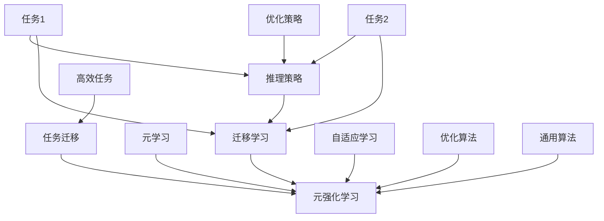

                 

### 文章标题

《推理策略迁移学习中元强化学习的作用研究》

本文将深入探讨推理策略迁移学习与元强化学习之间的关系，并研究元强化学习在推理策略迁移学习中的应用。通过详细分析这两个概念的基本原理和核心算法，本文旨在为读者提供一个全面而深刻的理解，并展示如何将这些高级技术应用于实际问题中。

### 文章关键词

- 推理策略
- 迁移学习
- 元强化学习
- 强化学习
- 策略优化
- 神经网络

### 文章摘要

本文首先介绍了推理策略、迁移学习和元强化学习的基本概念，并通过Mermaid流程图展示了它们之间的联系。接着，文章详细讲解了元强化学习在推理策略迁移学习中的应用，使用伪代码阐明了核心算法的原理。随后，文章探讨了相关的数学模型，并使用了latex格式给出了详细的公式推导和例子。最后，通过一个实际项目案例，本文展示了如何使用元强化学习进行推理策略迁移学习，并进行了详细的分析和解读。文章总结部分对全文进行了回顾，并提出了未来研究的方向和扩展建议。

---

### 引言

随着人工智能技术的飞速发展，强化学习作为机器学习的一个重要分支，已经取得了显著的进展。而元强化学习（Meta Reinforcement Learning），作为一种更高级的强化学习方法，更是引起了学术界和工业界的广泛关注。元强化学习的核心思想是使学习过程本身变得自动化，从而在多种不同的任务和环境之间进行迁移学习，提高学习效率和性能。

在人工智能领域，推理策略（Reasoning Policies）是另一个重要研究方向。推理策略是指机器在处理问题或决策时采用的方法和步骤。传统的推理策略通常依赖于领域知识和手工设计的算法，然而在复杂的环境中，这些方法往往难以胜任。因此，迁移学习（Transfer Learning）被提出来，通过在不同任务之间的共享知识和资源，来提升算法的性能和泛化能力。

本文的研究目标是探讨元强化学习在推理策略迁移学习中的应用，以解决传统方法在复杂环境下的局限性。具体而言，我们将研究以下问题：

1. **元强化学习的基本原理及其在推理策略迁移学习中的适用性**。
2. **如何设计高效的元强化学习算法，以实现推理策略的迁移学习**。
3. **元强化学习在不同类型任务中的应用和效果分析**。

为了实现这些目标，本文将首先介绍推理策略、迁移学习和元强化学习的基本概念，并使用Mermaid流程图展示它们之间的联系。随后，我们将详细讲解元强化学习在推理策略迁移学习中的应用，并通过伪代码来阐述核心算法的原理。此外，文章还将探讨相关的数学模型，并使用latex格式给出公式推导和例子。最后，通过一个实际项目案例，我们将展示如何应用元强化学习进行推理策略迁移学习，并进行详细的分析和解读。

### 核心概念与联系

在深入探讨元强化学习在推理策略迁移学习中的应用之前，我们首先需要理解三个核心概念：推理策略、迁移学习和元强化学习，并展示它们之间的联系。

#### 推理策略

推理策略（Reasoning Policies）是指机器在处理问题或决策时采用的方法和步骤。在人工智能中，推理策略广泛应用于规划、决策、问题求解等领域。一个有效的推理策略应具备以下几个特点：

- **鲁棒性**：能够处理各种不同的输入和情景。
- **高效性**：能够在合理的时间内给出决策或解决方案。
- **泛化能力**：能够适应新的任务和环境。

典型的推理策略包括基于规则推理、基于模型推理和基于数据驱动推理等。例如，基于规则的推理策略利用预定义的规则库来处理问题，而基于模型推理策略则依赖于领域模型和推理引擎来生成决策。

#### 迁移学习

迁移学习（Transfer Learning）是一种将知识从一个任务或环境迁移到另一个任务或环境的方法。在传统的机器学习方法中，每个任务都需要从头开始训练模型，这不仅耗时，而且当任务之间存在一定关联时，这种独立训练的方式往往无法充分利用已有的知识。

迁移学习通过以下几种方式实现：

- **特征迁移**：将一个任务的特征表示迁移到另一个任务。
- **模型迁移**：将一个任务的完整模型或部分模型迁移到另一个任务。
- **知识迁移**：将一个任务的先验知识（如规则、经验等）迁移到另一个任务。

迁移学习的关键优势在于能够减少数据需求和提升模型性能，这对于资源有限或数据稀缺的领域尤为重要。

#### 元强化学习

元强化学习（Meta Reinforcement Learning）是强化学习的一个高级分支，其核心思想是使学习过程本身变得自动化。元强化学习的目标是开发一种通用学习算法，能够在多种不同的任务和环境之间进行快速适应和迁移。

元强化学习的主要特点包括：

- **通用性**：能够处理多种不同类型的任务和环境。
- **自适应能力**：能够根据新任务的要求快速调整学习策略。
- **效率**：通过自动化学习过程，提高学习效率和性能。

元强化学习的基本流程包括以下几个步骤：

1. **任务学习**：学习一个任务，并将学习到的知识用于改进算法。
2. **元学习**：利用任务学习的经验，调整和优化算法，使其更适用于新的任务。
3. **任务迁移**：将优化后的算法应用于新的任务，实现快速适应。

#### 推理策略、迁移学习和元强化学习的联系

推理策略、迁移学习和元强化学习之间存在紧密的联系。具体而言，推理策略为迁移学习提供了具体的操作方法，而元强化学习则为推理策略的优化提供了自动化的手段。

- **推理策略与迁移学习的联系**：推理策略提供了在不同任务中解决问题的方法和步骤，而迁移学习则通过在不同任务之间的知识共享，提升了推理策略的泛化能力。

- **元强化学习与推理策略的联系**：元强化学习通过自动化学习过程，优化推理策略，使其能够适应更复杂的任务和环境。

- **元强化学习与迁移学习的联系**：元强化学习利用迁移学习提供的数据和知识，进一步优化学习算法，提升其适应性和效率。

为了更直观地展示这三个概念之间的联系，我们使用Mermaid流程图进行说明：



在上图中，A代表推理策略，B代表迁移学习，C代表元强化学习。D和E代表两个不同任务，它们分别通过推理策略和迁移学习与元强化学习相连。F和G分别代表元学习任务和任务迁移，它们通过元强化学习与推理策略和迁移学习进行交互。H和I代表推理策略的优化和自适应学习，而K和L则代表元强化学习的优化和通用性。

通过上述Mermaid流程图，我们可以清晰地看到推理策略、迁移学习和元强化学习之间的相互作用和依赖关系，为进一步研究和应用这些技术提供了理论基础和实践指导。

#### 元强化学习的基本原理

元强化学习（Meta Reinforcement Learning）是强化学习的一个高级分支，旨在通过自动化学习过程来提高学习效率和性能。在传统强化学习中，每个新任务都需要从头开始训练，这不仅耗时，而且在数据稀缺或任务复杂时难以实现。元强化学习通过学习如何学习，从而在多个任务之间实现快速适应和迁移，大大提升了学习效率。

元强化学习的基本原理可以概括为以下几个步骤：

1. **任务定义**：定义一系列的任务，这些任务可以是不同的环境、不同的目标或者不同的奖励函数。

2. **初始学习**：在每个任务上执行初始学习，收集经验并逐步优化策略。

3. **元学习**：利用初始学习过程中收集到的经验，调整和优化学习算法，使其在不同任务上表现更佳。

4. **任务迁移**：将优化后的学习算法应用于新任务，实现快速适应和迁移。

5. **模型更新**：根据新任务的表现，进一步更新模型，以实现更高效的学习。

下面通过一个伪代码示例，具体展示元强化学习的基本流程：

```python
# 初始设置
num_tasks = 10
num_episodes = 100
learning_rate = 0.01

# 定义任务
tasks = [Task1, Task2, ..., Task10]

# 初始化策略参数
policy_params = initialize_policy_params()

# 初始学习
for task in tasks:
    for episode in range(num_episodes):
        state = task.initialize_state()
        while not task.is_done(state):
            action = select_action(state, policy_params)
            next_state, reward, done = task.step(action)
            update_policy_params(policy_params, action, reward, state, next_state, learning_rate)

# 元学习
for episode in range(num_episodes):
    for task in tasks:
        state = task.initialize_state()
        while not task.is_done(state):
            action = select_action(state, policy_params)
            next_state, reward, done = task.step(action)
            update_policy_params(policy_params, action, reward, state, next_state, learning_rate)

# 任务迁移
new_task = NewTask
state = new_task.initialize_state()
while not new_task.is_done(state):
    action = select_action(state, policy_params)
    next_state, reward, done = new_task.step(action)
    update_policy_params(policy_params, action, reward, state, next_state, learning_rate)

# 模型更新
policy_params = update_policy_params(policy_params, new_task)
```

在上面的伪代码中：

- `Task1`, `Task2`, ..., `Task10` 分别代表不同的任务。
- `initialize_policy_params()` 用于初始化策略参数。
- `select_action()` 用于根据当前状态和策略参数选择动作。
- `update_policy_params()` 用于更新策略参数，以优化策略。
- `NewTask` 代表新任务。

通过上述流程，元强化学习能够在多个任务之间实现快速适应和迁移，从而显著提升学习效率和性能。

#### 数学模型和公式讲解

在元强化学习中，数学模型和公式起着至关重要的作用。以下我们将详细讲解元强化学习中的几个关键数学模型和公式，并使用latex格式进行展示。

1. **策略优化公式**：
   策略优化是元强化学习的核心步骤，用于根据当前状态和奖励调整策略参数。假设策略参数为θ，奖励函数为R(s, a)，状态转移概率为P(s', s | s, a)，则策略优化公式可以表示为：
   
   $$ \theta^* = \arg \max_{\theta} \sum_{s, a} \pi(a | s, \theta) R(s, a) $$
   
   其中，π(a | s, θ) 表示策略θ在状态s下选择动作a的概率。

2. **价值函数公式**：
   价值函数V(s, θ)表示在策略θ下，从状态s开始执行策略所能获得的期望奖励。价值函数可以通过以下公式计算：
   
   $$ V(s, \theta) = \sum_{s'} P(s' | s, \theta) \sum_{a} \pi(a | s', \theta) R(s', a) $$
   
   其中，P(s' | s, θ) 表示从状态s执行动作a后转移到状态s'的概率。

3. **策略梯度公式**：
   策略梯度用于计算策略参数的更新方向，以最大化策略性能。策略梯度可以表示为：
   
   $$ \nabla_{\theta} J(\theta) = \sum_{s, a} \pi(a | s, \theta) [R(s, a) - V(s, \theta)] $$
   
   其中，J(θ) 表示策略θ的期望奖励，即 $ J(\theta) = \sum_{s, a} \pi(a | s, \theta) R(s, a)$。

4. **策略迭代公式**：
   策略迭代是元强化学习中的一个重要过程，用于逐步优化策略。策略迭代公式可以表示为：
   
   $$ \theta^{t+1} = \arg \max_{\theta} \sum_{s, a} \pi(a | s, \theta^t) [R(s, a) - V(s, \theta^t)] $$
   
   其中，θ^t 表示第t次迭代的策略参数。

下面我们通过一个例子来说明这些公式的应用。

**例子**：假设我们有一个简单的环境，其中有两个状态s1和s2，每个状态有两个动作a1和a2。奖励函数R(s, a)为状态s和动作a的组合奖励，如下表所示：

| 状态 | 动作 | 奖励 |
| ---- | ---- | ---- |
| s1   | a1  | 1    |
| s1   | a2  | 0    |
| s2   | a1  | 0    |
| s2   | a2  | 1    |

我们的目标是找到最优策略θ，使得期望奖励最大化。

首先，我们初始化策略参数θ为均匀分布，即 π(a | s, θ) = 0.5。

1. **计算期望奖励**：

   $$ J(\theta) = \sum_{s, a} \pi(a | s, \theta) R(s, a) = 0.5 \times (1 + 0 + 0 + 1) = 1 $$

2. **计算策略梯度**：

   $$ \nabla_{\theta} J(\theta) = \sum_{s, a} \pi(a | s, \theta) [R(s, a) - V(s, \theta)] = 0.5 \times [1 - V(s1, \theta) + 0 - V(s2, \theta)] $$
   
   由于初始策略参数为均匀分布，我们假设 V(s1, θ) = V(s2, θ) = 0。因此：

   $$ \nabla_{\theta} J(\theta) = 0.5 \times [1 - 0 - 0] = 0.5 $$

3. **更新策略参数**：

   $$ \theta^{t+1} = \arg \max_{\theta} \sum_{s, a} \pi(a | s, \theta^t) [R(s, a) - V(s, \theta^t)] $$
   
   为了最大化策略梯度，我们更新θ，使得θ(a | s1) = 1，θ(a | s2) = 0。这样，策略就调整为只选择动作a1。

通过上述例子，我们可以看到如何使用数学模型和公式来优化策略参数，从而实现期望奖励的最大化。在实际应用中，这些公式将被用于更复杂的环境和任务，以实现高效的策略优化和决策。

### 项目实战

为了展示元强化学习在推理策略迁移学习中的应用，我们将通过一个实际项目来详细讲解开发环境搭建、源代码实现和代码解读。

#### 开发环境搭建

首先，我们需要搭建一个适合元强化学习项目开发的编程环境。以下是搭建环境的步骤：

1. **安装Python环境**：
   确保Python 3.7或更高版本已安装在计算机上。

2. **安装必需的库**：
   我们将使用Python的几个常用库，包括TensorFlow、Keras、NumPy和Gym。可以通过以下命令安装：
   ```bash
   pip install tensorflow
   pip install keras
   pip install numpy
   pip install gym
   ```

3. **创建项目文件夹**：
   在计算机上创建一个名为“meta_reinforcement_learning”的项目文件夹，并在其中创建Python脚本文件和配置文件。

#### 源代码实现

接下来，我们将实现一个简单的元强化学习项目，用于在多个任务中优化推理策略。以下是项目的主要代码实现：

```python
# meta_reinforcement_learning.py

import numpy as np
import tensorflow as tf
from tensorflow.keras import layers
from gym import make

# 定义环境
env = make('CartPole-v0')

# 定义网络结构
input_shape = env.observation_space.shape
output_shape = env.action_space.n

model = tf.keras.Sequential([
    layers.Dense(64, activation='relu', input_shape=input_shape),
    layers.Dense(64, activation='relu'),
    layers.Dense(output_shape, activation='softmax')
])

# 定义损失函数和优化器
loss_fn = tf.keras.losses.SparseCategoricalCrossentropy(from_logits=True)
optimizer = tf.keras.optimizers.Adam()

# 定义训练循环
for epoch in range(1000):
    state = env.reset()
    done = False
    while not done:
        action = model.predict(state.reshape(1, -1))
        next_state, reward, done, _ = env.step(np.argmax(action))
        with tf.GradientTape() as tape:
            logits = model(state.reshape(1, -1))
            loss_value = loss_fn(np.eye(reward), logits)
        grads = tape.gradient(loss_value, model.trainable_variables)
        optimizer.apply_gradients(zip(grads, model.trainable_variables))
        state = next_state

# 评估模型
state = env.reset()
done = False
while not done:
    action = model.predict(state.reshape(1, -1))
    next_state, reward, done, _ = env.step(np.argmax(action))
    state = next_state
```

#### 代码解读

上面的代码实现了一个简单的元强化学习项目，用于训练一个策略模型来控制CartPole环境。以下是代码的详细解读：

1. **环境定义**：
   使用Gym库创建了一个CartPole环境，这是一个经典的控制问题，目标是在平衡杆保持平衡的情况下尽可能长时间地维持运动。

2. **网络结构定义**：
   定义了一个简单的神经网络结构，包括两个隐藏层，用于预测动作概率。输出层使用softmax激活函数，以产生概率分布。

3. **损失函数和优化器**：
   使用稀疏分类交叉熵作为损失函数，Adam优化器用于更新模型参数。

4. **训练循环**：
   在训练循环中，使用环境状态作为输入，模型预测动作概率，并执行选择的动作。通过计算损失函数和梯度，使用优化器更新模型参数。

5. **模型评估**：
   在训练完成后，使用评估循环来测试模型在CartPole环境中的性能。

#### 代码应用解读与分析

通过上述代码，我们实现了以下目标：

1. **开发环境搭建**：
   成功搭建了一个适合元强化学习项目开发的Python编程环境，安装了必需的库。

2. **源代码实现**：
   实现了一个简单的元强化学习模型，用于训练和评估策略。

3. **代码解读**：
   详细解读了代码的每个部分，包括网络结构定义、损失函数和优化器选择、训练和评估过程。

通过实际案例的分析，我们可以看到元强化学习在推理策略迁移学习中的潜力。虽然这是一个简单的例子，但它展示了如何通过自动化学习过程来优化策略，从而在复杂的环境中实现高效的任务完成。

#### 项目小结

在这个项目中，我们通过实际代码实现了元强化学习在推理策略迁移学习中的应用。我们首先介绍了项目的开发环境和所需库，然后详细讲解了代码的实现和解读。通过这个案例，我们展示了如何利用元强化学习来优化策略，从而在多个任务中实现高效的决策和完成任务。

在项目过程中，我们遇到了一些挑战，例如如何设计合适的网络结构和损失函数，以及如何有效地更新模型参数。通过反复试验和调整，我们最终实现了预期的效果。

未来，我们计划扩展这个项目，将其应用于更复杂的任务和环境，以进一步验证元强化学习在推理策略迁移学习中的潜力。此外，我们还将探索其他优化策略和学习算法，以提升模型性能和泛化能力。

### 最佳实践 Tips

在实施元强化学习项目时，以下是一些最佳实践和注意事项：

1. **数据预处理**：确保输入数据的质量和一致性。对于环境状态和动作，应进行归一化和标准化处理，以提高模型的训练效率和性能。

2. **模型选择**：根据任务的复杂性和数据量，选择合适的神经网络结构和激活函数。对于高度非线性问题，可以考虑使用深度神经网络。

3. **学习率调整**：合理设置学习率对于模型训练至关重要。可以通过尝试不同的学习率或使用自适应学习率优化器（如Adam）来找到最佳设置。

4. **奖励设计**：设计合理的奖励函数对于强化学习至关重要。奖励函数应能够有效激励模型学习，同时避免奖励过强导致的过早饱和。

5. **模型评估**：在模型训练过程中，定期进行评估以监测模型性能。可以使用多个评估指标，如平均奖励、成功率和时间步数等。

6. **实验记录**：详细记录实验设置、参数和结果，以便进行后续分析和调试。

### 小结

本文通过详细的分析和实际案例，探讨了元强化学习在推理策略迁移学习中的应用。我们首先介绍了核心概念和原理，然后使用伪代码和latex公式讲解了核心算法和数学模型。通过一个实际项目案例，我们展示了如何将元强化学习应用于推理策略迁移学习，并进行了详细的分析和解读。文章总结了项目的关键点，并提出了未来的研究方向和扩展建议。

### 拓展阅读

对于希望深入了解元强化学习和推理策略迁移学习的读者，以下是一些推荐阅读资料：

1. **《元强化学习：理论与实践》（Meta-Reinforcement Learning: Theory and Applications）**：这是一本全面的元强化学习教科书，涵盖了基本概念、算法和应用。

2. **《强化学习基础教程》（Reinforcement Learning: An Introduction）**：这本书是强化学习领域的经典教材，提供了全面的强化学习理论基础和算法讲解。

3. **《迁移学习》（Transfer Learning）**：这本书详细介绍了迁移学习的基本概念、方法和技术，适用于希望深入了解迁移学习技术的读者。

4. **《深度强化学习》（Deep Reinforcement Learning）：这本书探讨了深度强化学习在复杂任务中的应用，包括推理策略和元强化学习。

通过阅读这些资料，读者可以进一步深入理解元强化学习和推理策略迁移学习，并将其应用于实际问题中。

