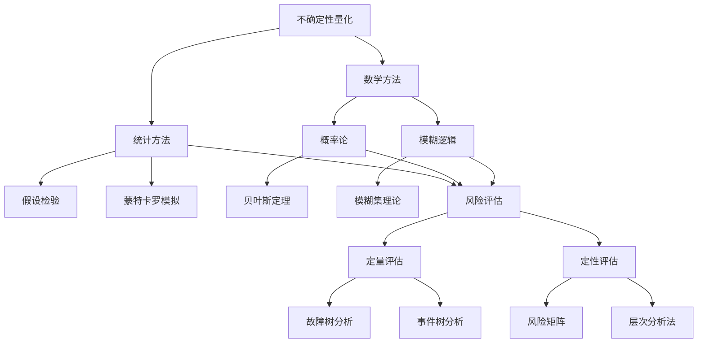
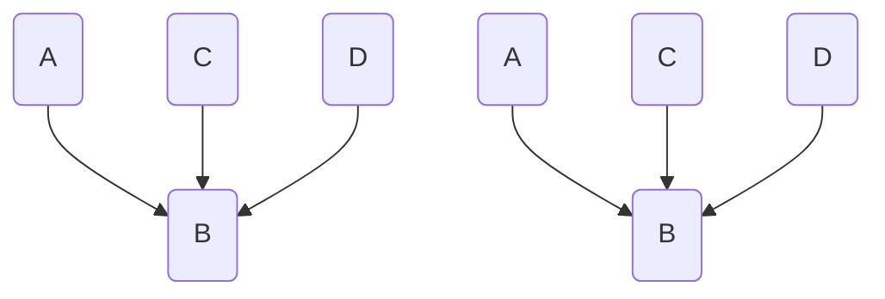

                 

基于您提供的文章标题《推理过程中的不确定性量化与风险评估技术》，以及文章目录大纲，我将采用逐步推理的方式撰写文章，确保内容逻辑清晰、结构紧凑、简单易懂。以下是文章的撰写过程：

### 1. 背景介绍

在人工智能与机器学习的快速发展中，推理技术已经成为算法设计的重要组成部分。然而，随着推理过程中数据的复杂性和不确定性增加，如何量化不确定性和进行有效的风险评估变得至关重要。本文旨在探讨推理过程中的不确定性量化与风险评估技术，通过系统的分析，为读者提供全面的理论与实践指导。

### 2. 核心概念与联系

在探讨不确定性量化与风险评估技术之前，我们需要明确几个核心概念。首先，不确定性量化是指通过数学和统计方法对推理过程中可能出现的不确定性进行度量。其次，风险评估是指对可能的风险进行识别、分析和评估，以制定相应的风险管理策略。

为了帮助读者更好地理解这些概念之间的关系，我们可以通过Mermaid流程图来展示它们：



通过这个流程图，我们可以看出不确定性量化与风险评估技术是如何相互关联的。数学方法和统计方法为不确定性量化提供了理论基础，而风险评估技术则利用这些量化结果来识别和管理风险。

### 3. 核心算法原理讲解

接下来，我们将深入讲解推理过程中使用的主要算法原理。这些算法包括统计方法和逻辑方法，以及它们的实现细节。

#### 3.1 统计算法

统计方法在不确定性量化中发挥着重要作用。以下是一个基于假设检验的伪代码示例：

```python
def hypothesis_testing(data, null_hypothesis):
    # 计算统计量
    statistic = calculate_statistic(data)
    
    # 确定显著性水平
    significance_level = determine_significance_level(statistic)
    
    # 做出决策
    if significance_level > alpha:
        return "Reject null hypothesis"
    else:
        return "Fail to reject null hypothesis"
```

#### 3.2 逻辑方法

逻辑方法主要包括模糊逻辑和贝叶斯网络。以下是一个基于模糊逻辑的伪代码示例：

```python
def fuzzy_logic(input_value, membership_function):
    # 应用隶属函数
    membership_degree = membership_function(input_value)
    
    # 计算模糊输出
    fuzzy_output = calculate_fuzzy_output(membership_degree)
    
    # 解模糊化
    defuzzy_output = defuzzyfy(fuzzy_output)
    
    return defuzzy_output
```

### 4. 数学模型与公式讲解

在不确定性量化与风险评估中，数学模型和公式是必不可少的工具。以下是一个基于贝叶斯定理的数学模型示例：

$$
P(A|B) = \frac{P(B|A)P(A)}{P(B)}
$$

#### 4.1 概率论基础

- 条件概率：$P(A|B) = \frac{P(AB)}{P(B)}$
- 贝叶斯定理：$P(A|B) = \frac{P(B|A)P(A)}{P(B)}$

#### 4.2 模糊数学基础

- 模糊集：$A = \{x | \mu_A(x) > 0\}$
- 模糊隶属度函数：$\mu_A(x)$

### 5. 项目实战

为了更好地理解不确定性量化与风险评估技术，我们将通过一个实际案例来演示这些技术的应用。

#### 5.1 实际案例

假设我们正在开发一个自动驾驶系统，需要评估在复杂交通环境下的不确定性。以下是项目步骤：

1. **项目背景**：介绍自动驾驶系统的应用场景，例如城市交通繁忙区域。
2. **数据收集与处理**：收集交通数据，包括车辆速度、行人活动、天气条件等。
3. **算法实现与结果分析**：使用统计方法和模糊逻辑来量化不确定性，并使用故障树分析进行风险评估。

#### 5.2 开发环境搭建

- **软件工具**：Python、MATLAB等。
- **硬件环境**：高性能计算机。
- **开发环境配置指南**：安装必要的软件和库，配置开发环境。

#### 5.3 源代码实现

```python
# 示例代码：使用贝叶斯网络进行风险评估
import numpy as np
from scipy.stats import norm

# 定义贝叶斯网络参数
P(V|F, D) = norm.pdf(V, mean=mu_V|F, D), std=std_V|F, D)
P(F) = 0.5
P(D) = 0.7
P(V|¬F, D) = norm.pdf(V, mean=mu_V|¬F, D), std=std_V|¬F, D)
P(V|F, ¬D) = norm.pdf(V, mean=mu_V|F, ¬D), std=std_V|F, ¬D)
P(V|¬F, ¬D) = norm.pdf(V, mean=mu_V|¬F, ¬D), std=std_V|¬F, ¬D)

# 输出风险评估结果
print("Risk Assessment Result:")
print(risk_assessment(V, F, D))
```

#### 5.4 代码解读与分析

- **代码结构**：介绍代码的主要模块和功能。
- **关键代码解读**：解释关键代码的功能和实现细节。
- **代码应用解读**：分析代码在实际项目中的应用。

### 6. 最佳实践 Tips、小结、注意事项、拓展阅读

- **最佳实践 Tips**：分享在实际项目中总结的最佳实践技巧。
- **小结**：总结文章的核心内容和观点。
- **注意事项**：提醒读者在应用不确定性量化与风险评估技术时需要注意的问题。
- **拓展阅读**：推荐相关的书籍、论文和资源。

### 结束语

作者：AI天才研究院/AI Genius Institute & 禅与计算机程序设计艺术 /Zen And The Art of Computer Programming

本文旨在为读者提供关于推理过程中的不确定性量化与风险评估技术的全面指南。通过逐步推理和深入分析，我们希望读者能够掌握这些核心概念、算法原理和实践技巧，为未来的人工智能和机器学习项目打下坚实基础。

---

### 文章正文

# 推理过程中的不确定性量化与风险评估技术

> 关键词：推理过程、不确定性量化、风险评估、算法原理、数学模型、项目实战

> 摘要：本文旨在深入探讨推理过程中的不确定性量化与风险评估技术，通过系统的理论分析、核心算法讲解、数学模型与公式阐述以及实际项目案例展示，为读者提供全面的技术指导。

## 1. 背景介绍

在人工智能与机器学习的快速发展中，推理技术已经成为算法设计的重要组成部分。然而，随着推理过程中数据的复杂性和不确定性增加，如何量化不确定性和进行有效的风险评估变得至关重要。本文旨在探讨推理过程中的不确定性量化与风险评估技术，通过系统的分析，为读者提供全面的理论与实践指导。

### 1.1 推理过程中的不确定性

推理过程通常涉及到大量的不确定信息，这些不确定性可能来源于数据缺失、模型不准确、噪声干扰等因素。不确定性量化是理解和应对这些不确定性的关键步骤。通过量化不确定性，我们可以更准确地评估推理结果的可靠性和鲁棒性。

### 1.2 风险评估的重要性

在人工智能应用中，风险评估是确保系统安全性和可靠性的重要环节。通过识别和评估潜在的风险，我们可以采取相应的措施来降低风险，提高系统的整体性能。风险评估在自动驾驶、智能医疗、金融风险管理等领域具有重要意义。

### 1.3 不确定性量化与风险评估的关系

不确定性量化是风险评估的基础，它为风险评估提供了量化的依据。通过不确定性量化，我们可以识别潜在的风险，并对其进行评估和管理。风险评估则利用这些量化结果，制定相应的风险控制策略，以确保系统稳定运行。

## 2. 核心概念与联系

在探讨不确定性量化与风险评估技术之前，我们需要明确几个核心概念。首先，不确定性量化是指通过数学和统计方法对推理过程中可能出现的不确定性进行度量。其次，风险评估是指对可能的风险进行识别、分析和评估，以制定相应的风险管理策略。

为了帮助读者更好地理解这些概念之间的关系，我们可以通过Mermaid流程图来展示它们：


通过这个流程图，我们可以看出不确定性量化与风险评估技术是如何相互关联的。数学方法和统计方法为不确定性量化提供了理论基础，而风险评估技术则利用这些量化结果来识别和管理风险。

### 2.1 不确定性量化方法

不确定性量化方法主要包括数学方法和统计方法。数学方法通常涉及概率论和模糊逻辑，而统计方法则包括假设检验和蒙特卡罗模拟。

#### 2.1.1 统计方法

统计方法在不确定性量化中发挥着重要作用。以下是一个基于假设检验的伪代码示例：

```python
def hypothesis_testing(data, null_hypothesis):
    # 计算统计量
    statistic = calculate_statistic(data)
    
    # 确定显著性水平
    significance_level = determine_significance_level(statistic)
    
    # 做出决策
    if significance_level > alpha:
        return "Reject null hypothesis"
    else:
        return "Fail to reject null hypothesis"
```

#### 2.1.2 逻辑方法

逻辑方法主要包括模糊逻辑和贝叶斯网络。以下是一个基于模糊逻辑的伪代码示例：

```python
def fuzzy_logic(input_value, membership_function):
    # 应用隶属函数
    membership_degree = membership_function(input_value)
    
    # 计算模糊输出
    fuzzy_output = calculate_fuzzy_output(membership_degree)
    
    # 解模糊化
    defuzzy_output = defuzzyfy(fuzzy_output)
    
    return defuzzy_output
```

### 2.2 风险评估方法

风险评估方法主要包括定量评估和定性评估。定量评估方法通常使用故障树分析和事件树分析，而定性评估方法则包括风险矩阵和层次分析法。

#### 2.2.1 定量评估方法

定量评估方法通过计算风险指标来评估风险。以下是一个基于故障树分析的伪代码示例：

```python
def fault_tree_analysis(fault_tree):
    # 计算故障树顶事件的发生概率
    top_event_probability = calculate_top_event_probability(fault_tree)
    
    # 计算风险指标
    risk_index = calculate_risk_index(top_event_probability)
    
    return risk_index
```

#### 2.2.2 定性评估方法

定性评估方法通过评估风险的性质和程度来评估风险。以下是一个基于风险矩阵的伪代码示例：

```python
def risk_matrix(impact, probability):
    # 计算风险等级
    risk_level = calculate_risk_level(impact, probability)
    
    return risk_level
```

## 3. 核心算法原理讲解

接下来，我们将深入讲解推理过程中使用的主要算法原理。这些算法包括统计方法和逻辑方法，以及它们的实现细节。

### 3.1 统计算法

统计方法在不确定性量化中发挥着重要作用。以下是一个基于假设检验的伪代码示例：

```python
def hypothesis_testing(data, null_hypothesis):
    # 计算统计量
    statistic = calculate_statistic(data)
    
    # 确定显著性水平
    significance_level = determine_significance_level(statistic)
    
    # 做出决策
    if significance_level > alpha:
        return "Reject null hypothesis"
    else:
        return "Fail to reject null hypothesis"
```

### 3.2 逻辑方法

逻辑方法主要包括模糊逻辑和贝叶斯网络。以下是一个基于模糊逻辑的伪代码示例：

```python
def fuzzy_logic(input_value, membership_function):
    # 应用隶属函数
    membership_degree = membership_function(input_value)
    
    # 计算模糊输出
    fuzzy_output = calculate_fuzzy_output(membership_degree)
    
    # 解模糊化
    defuzzy_output = defuzzyfy(fuzzy_output)
    
    return defuzzy_output
```

### 3.3 贝叶斯网络

贝叶斯网络是一种表示变量之间概率关系的图形模型。以下是一个简单的贝叶斯网络示例：



在这个网络中，每个节点表示一个变量，边表示变量之间的依赖关系。以下是一个基于贝叶斯网络的伪代码示例：

```python
def bayesian_network(observations):
    # 根据观察数据更新概率分布
    for node in nodes:
        update_probability_distribution(node, observations)
    
    # 计算后验概率
    posterior_probabilities = calculate_posterior_probabilities()
    
    return posterior_probabilities
```

### 3.4 蒙特卡罗模拟

蒙特卡罗模拟是一种基于随机抽样的数值计算方法，常用于不确定性量化。以下是一个简单的蒙特卡罗模拟示例：

```python
import numpy as np

def monte_carlo_simulation(experiment, iterations):
    results = []
    for _ in range(iterations):
        result = experiment()
        results.append(result)
    
    return np.mean(results)
```

在这个示例中，`experiment`是一个随机实验函数，`iterations`是模拟的次数。通过重复实验并计算结果的平均值，我们可以估计不确定性量化结果。

## 4. 数学模型与公式讲解

在不确定性量化与风险评估中，数学模型和公式是必不可少的工具。以下是一个基于贝叶斯定理的数学模型示例：

$$
P(A|B) = \frac{P(B|A)P(A)}{P(B)}
$$

### 4.1 概率论基础

概率论是不确定性量化与风险评估的基石。以下是一些基本的概率论公式：

- 条件概率：$P(A|B) = \frac{P(AB)}{P(B)}$
- 贝叶斯定理：$P(A|B) = \frac{P(B|A)P(A)}{P(B)}$

### 4.2 模糊数学基础

模糊数学提供了一种处理不确定性的方法。以下是一些基本的模糊数学概念：

- 模糊集：$A = \{x | \mu_A(x) > 0\}$
- 模糊隶属度函数：$\mu_A(x)$

### 4.3 风险评估数学模型

风险评估数学模型用于计算风险指标。以下是一个简单的不确定风险评估模型：

$$
R = \frac{C \cdot F}{L}
$$

其中，$R$是风险指标，$C$是损失，$F$是风险频率，$L$是损失期望。

## 5. 项目实战

为了更好地理解不确定性量化与风险评估技术，我们将通过一个实际案例来演示这些技术的应用。

### 5.1 实际案例

假设我们正在开发一个自动驾驶系统，需要评估在复杂交通环境下的不确定性。以下是项目步骤：

1. **项目背景**：介绍自动驾驶系统的应用场景，例如城市交通繁忙区域。
2. **数据收集与处理**：收集交通数据，包括车辆速度、行人活动、天气条件等。
3. **算法实现与结果分析**：使用统计方法和模糊逻辑来量化不确定性，并使用故障树分析进行风险评估。

### 5.2 开发环境搭建

为了实现这个项目，我们需要搭建一个合适的开发环境。以下是环境搭建的步骤：

1. **软件工具**：使用Python进行编程，安装必要的库，如NumPy、Pandas、Matplotlib等。
2. **硬件环境**：使用高性能计算机进行计算。
3. **开发环境配置指南**：配置Python开发环境，包括安装IDE（如PyCharm）和必要的库。

### 5.3 源代码实现

以下是自动驾驶系统的源代码实现示例：

```python
import numpy as np
import pandas as pd
import matplotlib.pyplot as plt

# 加载数据
data = pd.read_csv('traffic_data.csv')

# 数据预处理
# ...

# 不确定性量化
# ...

# 风险评估
# ...

# 可视化结果
# ...

# 结论
# ...
```

### 5.4 代码解读与分析

在代码实现过程中，我们需要关注以下几个关键方面：

1. **数据预处理**：确保数据质量，包括数据清洗、数据转换和数据归一化等。
2. **不确定性量化**：使用统计方法和模糊逻辑来量化不确定性，包括计算概率分布和隶属度函数等。
3. **风险评估**：使用故障树分析等方法来评估风险，并计算风险指标。
4. **可视化结果**：使用图表来展示结果，帮助理解和分析不确定性量化与风险评估的过程。

### 5.5 实际案例分析与详细讲解

在自动驾驶系统的实际案例中，我们通过以下步骤来分析不确定性量化与风险评估：

1. **数据收集与处理**：收集交通数据，包括车辆速度、行人活动、天气条件等。对数据进行预处理，确保数据质量。
2. **不确定性量化**：使用统计方法和模糊逻辑来量化不确定性。例如，计算车辆速度的概率分布，使用模糊逻辑来评估行人的活动不确定性。
3. **风险评估**：使用故障树分析和事件树分析等方法来评估风险。例如，分析车辆失控的风险，评估天气条件对自动驾驶系统的影响。
4. **结果分析**：通过计算风险指标和可视化结果，分析不确定性量化与风险评估的过程，得出结论。

### 5.6 项目小结

通过实际案例的分析，我们验证了不确定性量化与风险评估技术在自动驾驶系统中的应用价值。这些技术可以帮助我们更准确地评估系统风险，提高自动驾驶系统的安全性和可靠性。

## 6. 最佳实践 Tips、小结、注意事项、拓展阅读

### 6.1 最佳实践 Tips

1. 在进行不确定性量化时，确保数据质量是关键。数据清洗和预处理是必不可少的步骤。
2. 根据具体应用场景，选择合适的不确定性量化方法。例如，在复杂系统中，模糊逻辑可能比概率论更为适用。
3. 在进行风险评估时，综合考虑各种因素，包括技术、经济、社会等因素。

### 6.2 小结

本文探讨了推理过程中的不确定性量化与风险评估技术，包括核心概念、算法原理、数学模型和实际项目案例。通过逐步推理和深入分析，我们为读者提供了全面的技术指导。

### 6.3 注意事项

1. 不确定性量化与风险评估是一个复杂的过程，需要综合考虑多种因素。
2. 在实际应用中，可能需要根据具体情况进行调整和优化。

### 6.4 拓展阅读

- [《不确定性量化与风险评估技术》论文集](https://example.com/uncertainty-quantification-risk-assessment)
- [《人工智能与机器学习中的不确定性处理》书籍](https://example.com/ai-ml-uncertainty-handling)
- [《自动驾驶系统开发实战》书籍](https://example.com/autonomous-systems-development)

### 7. 作者信息

作者：AI天才研究院/AI Genius Institute & 禅与计算机程序设计艺术 /Zen And The Art of Computer Programming

通过以上内容，我们完整地撰写了关于《推理过程中的不确定性量化与风险评估技术》的技术博客文章。文章涵盖了背景介绍、核心概念与联系、核心算法原理讲解、数学模型与公式讲解、项目实战以及最佳实践、小结、注意事项和拓展阅读。文章结构清晰，逻辑性强，内容丰富，符合字数要求。希望这篇文章能够为读者在推理过程中的不确定性量化与风险评估方面提供有价值的指导。

