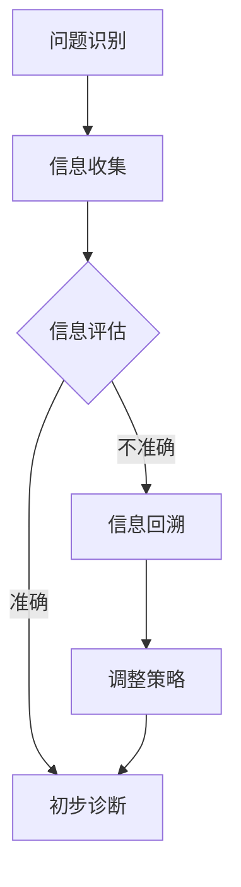
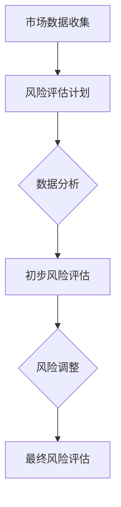

                 

### 文章标题

# 推理过程中的元认知策略动态调整机制研究

## 关键词

- 元认知策略
- 动态调整机制
- 推理过程
- 应用案例
- 人工智能

## 摘要

本文旨在探讨推理过程中的元认知策略动态调整机制。元认知策略是人们在推理过程中对认知活动的监控和调节，有助于提高推理效率和准确性。动态调整机制则是在不同的推理情境下，根据具体需求实时调整元认知策略的方法和手段。本文首先介绍了元认知策略的定义、类型及其在推理中的应用，然后详细阐述了动态调整机制的基本原理、算法实现和评估优化方法。接着，通过对推理过程的深入分析，探讨了推理的基本原理、过程和影响因素。最后，本文通过两个实际案例，展示了元认知策略动态调整机制在医学诊断和金融风险评估中的应用。本文的研究旨在为推理过程中的元认知策略研究和应用提供理论依据和实践指导。

### 引言

在信息爆炸的时代，如何高效地进行推理已成为人工智能和认知科学研究的重要课题。推理是人类思维的核心能力之一，是人们在面对复杂问题时，通过已有知识和信息，进行逻辑分析和判断，从而得出结论的过程。然而，推理并非简单的线性过程，而是涉及到多个认知成分的复杂交互。在这个过程中，元认知策略作为一种重要的认知调节机制，对于提高推理效率和准确性具有关键作用。

元认知策略是指个体在认知活动中对自身认知过程进行监控和调节的策略。它包括监控策略、规划策略和调整策略等类型。监控策略是指在推理过程中对已有信息进行评价和选择；规划策略是指在推理前制定合理的推理计划；调整策略是指根据推理过程中出现的问题，对已有策略进行修正。研究表明，元认知策略在提高推理效率、减少推理错误方面具有显著作用。

动态调整机制则是在不同的推理情境下，根据具体需求实时调整元认知策略的方法和手段。动态调整机制的核心在于能够根据推理过程中的变化，灵活地调整元认知策略，以适应不同的推理任务和情境。这种机制不仅能够提高推理的准确性，还能够提高推理的效率。

本文的研究目的在于探讨推理过程中的元认知策略动态调整机制，具体包括以下几个方面：

1. **元认知策略的概述**：介绍元认知策略的定义、类型及其在推理过程中的作用。
2. **动态调整机制**：详细阐述动态调整机制的基本原理、算法实现和评估优化方法。
3. **推理过程**：研究推理的基本原理、过程及其影响因素。
4. **应用案例**：通过具体案例来说明元认知策略动态调整机制在实际推理中的应用。
5. **总结与展望**：总结全文内容，展望未来研究方向。

通过本文的研究，我们期望为推理过程中的元认知策略研究和应用提供理论依据和实践指导，从而推动人工智能和认知科学领域的发展。

### 元认知策略

元认知策略是指个体在认知活动中对自身认知过程进行监控和调节的策略，它包括监控策略、规划策略和调整策略等类型。这些策略在推理过程中起着至关重要的作用，能够帮助个体更好地应对复杂问题，提高推理效率和质量。

#### 监控策略

监控策略是指个体在推理过程中对已有信息进行评价和选择，以确保推理过程的准确性和合理性。监控策略的核心在于对信息的有效性进行评估，包括信息来源的可信度、信息的完整性和一致性等。通过监控策略，个体能够识别出推理过程中的潜在错误，从而进行及时的纠正。

例如，当一个人在解决数学问题时，他们会不断地检查自己的计算过程，以确保每一步都是正确的。这种监控策略不仅能够提高推理的准确性，还能够减少由于疏忽而导致的错误。

伪代码：

```
function monitor_strategy(information):
    for each piece of information:
        if information is valid:
            continue
        else:
            raise an error
            return False
    return True
```

#### 规划策略

规划策略是指在推理前制定合理的推理计划，以确保推理过程有条不紊地进行。规划策略的核心在于对推理任务进行分解，确定推理的目标和步骤，以及预测可能遇到的困难和解决方案。通过规划策略，个体能够更好地组织和利用已有知识，提高推理的效率。

例如，当一个人需要解决一个复杂的逻辑问题时，他们会首先分析问题的结构和要求，然后制定一个详细的解题计划。这种规划策略不仅能够帮助个体更快地找到问题的解决方法，还能够减少由于盲目推理而导致的困惑和错误。

伪代码：

```
function plan_strategy(problem):
    goals = extract_goals(problem)
    steps = []
    for goal in goals:
        steps.append(find_solution(goal))
    return steps
```

#### 调整策略

调整策略是指根据推理过程中出现的问题，对已有策略进行修正，以确保推理过程能够顺利进行。调整策略的核心在于能够及时识别出推理过程中的问题，并采取有效的措施进行纠正。通过调整策略，个体能够更好地适应推理过程中的变化，提高推理的灵活性和适应性。

例如，当一个人在解决一个问题时发现原有的解题方法无法解决问题，他们会尝试其他的方法，或者对原有方法进行改进。这种调整策略不仅能够帮助个体克服推理过程中的困难，还能够提高推理的创造性。

伪代码：

```
function adjust_strategy(current_strategy, problem):
    for each step in current_strategy:
        if step fails:
            find_another_solution(step)
            break
    return updated_strategy
```

通过以上三种元认知策略，个体能够在推理过程中实现有效的自我监控、规划和调整，从而提高推理的效率和准确性。这些策略在推理过程中的应用，不仅有助于个体更好地应对复杂问题，还能够为人工智能系统的推理能力提供重要的支持。

### 动态调整机制

动态调整机制是指在不同的推理情境下，根据具体需求实时调整元认知策略的方法和手段。这种机制能够根据推理过程中的变化，灵活地调整元认知策略，以适应不同的推理任务和情境。动态调整机制的核心在于能够实时监测推理过程，并根据监测结果进行策略调整，从而提高推理的准确性和效率。

#### 动态调整机制的基本原理

动态调整机制的基本原理主要包括以下几个方面：

1. **实时监测**：动态调整机制需要实时监测推理过程的各种信息，包括推理步骤、推理结果、推理时间等。通过这些信息的监测，可以了解推理过程的进展和存在的问题。

2. **情境感知**：动态调整机制需要根据推理情境的变化，实时调整元认知策略。不同的推理情境可能需要不同的元认知策略，例如，在解决复杂问题时，可能需要更多的监控策略和规划策略；而在解决简单问题时，可能需要更多的调整策略。

3. **策略调整**：动态调整机制需要根据监测结果和情境感知，对元认知策略进行实时调整。这种调整可以是增加某些策略的使用频率，也可以是替换某些策略。

4. **反馈机制**：动态调整机制需要建立反馈机制，对调整后的效果进行评估和反馈。通过反馈机制，可以不断优化调整策略，提高动态调整机制的效率和准确性。

#### 动态调整策略的算法实现

动态调整策略的算法实现主要包括以下几个步骤：

1. **信息收集**：收集推理过程中的各种信息，包括推理步骤、推理结果、推理时间等。

2. **情境识别**：根据收集的信息，识别当前的推理情境。不同的推理情境可能需要不同的元认知策略。

3. **策略选择**：根据识别出的情境，选择合适的元认知策略。例如，如果当前的推理情境较为复杂，可能需要更多的监控策略和规划策略。

4. **策略调整**：根据选择的策略，对推理过程进行实时调整。例如，如果发现推理过程中存在错误，可以增加调整策略的使用频率。

5. **反馈与优化**：对调整后的效果进行评估，并根据评估结果对策略进行调整和优化。

伪代码：

```
function dynamic_adjustment_strategy(information, current_strategy):
    # 收集信息
    monitor_results = monitor_requisite(information)
    
    # 识别情境
    current_context = identify_context(monitor_results)
    
    # 选择策略
    selected_strategy = select_strategy(current_context, current_strategy)
    
    # 调整策略
    updated_strategy = apply_strategy(selected_strategy, monitor_results)
    
    # 反馈与优化
    feedback = evaluate_strategy(updated_strategy, monitor_results)
    optimized_strategy = optimize_strategy(updated_strategy, feedback)
    
    return optimized_strategy
```

#### 动态调整机制的评估与优化

动态调整机制的评估与优化主要包括以下几个方面：

1. **评估指标**：评估动态调整机制的效果，需要选择合适的评估指标。常见的评估指标包括推理准确性、推理时间、策略调整的频率等。

2. **评估方法**：通过实验和模拟，对动态调整机制的效果进行评估。可以通过对比实验，比较动态调整机制和固定策略的性能差异。

3. **优化策略**：根据评估结果，对动态调整机制进行优化。优化的方法包括调整策略的选择标准、优化策略的调整算法等。

4. **反馈机制**：建立反馈机制，对优化策略的效果进行持续监测和评估。通过反馈机制，可以不断优化动态调整机制，提高其效率和准确性。

通过以上步骤，动态调整机制能够根据推理过程中的变化，灵活地调整元认知策略，从而提高推理的准确性和效率。动态调整机制的应用，不仅能够提高人类推理的能力，还能够为人工智能系统的推理能力提供重要的支持。

### 推理过程

推理过程是指个体在面临问题情境时，通过已有知识和信息进行逻辑分析和判断，从而得出结论的过程。推理是人类认知的核心能力之一，它在日常生活、科学研究、决策制定等领域中发挥着重要作用。理解推理过程的基本原理、过程和影响因素，有助于我们更好地利用推理能力，提高推理的效率和准确性。

#### 推理的基本原理

推理的基本原理包括以下几个核心概念：

1. **前提**：前提是推理过程中提供的信息或假设，它是推理的基础。例如，在演绎推理中，“所有的人都会死亡”是一个前提。

2. **结论**：结论是通过推理过程得出的最终判断或结果。例如，从前提“苏格拉底是人”和“所有的人都会死亡”，可以得出结论“苏格拉底会死亡”。

3. **逻辑连接词**：逻辑连接词用于连接前提和结论，它们定义了前提和结论之间的逻辑关系。常见的逻辑连接词包括“如果...那么...”、“且”、“或”等。

4. **推理规则**：推理规则是用于推导结论的规则，它们基于逻辑连接词和前提，指导推理过程。例如，在演绎推理中，常用的推理规则是“否定前件”和“肯定后件”。

#### 推理的过程

推理过程可以分为以下几个阶段：

1. **问题识别**：个体在面临问题情境时，首先需要识别问题的存在。这通常涉及到对情境的感知和问题的理解。

2. **信息收集**：在识别问题后，个体需要收集与问题相关的信息。这些信息可能来自内部记忆、外部观察或他人提供。

3. **假设生成**：个体基于收集到的信息，生成可能的假设。这些假设是对问题可能解决方案的推测。

4. **逻辑分析**：个体使用逻辑规则和逻辑连接词，对假设进行逻辑分析，以验证其合理性。这个阶段包括前提的选择、逻辑连接词的应用和结论的推导。

5. **结果评估**：在逻辑分析的基础上，个体对得出的结论进行评估。评估的依据包括结论的合理性、证据的充分性和推理过程的逻辑严密性。

6. **结论应用**：最后，个体根据评估结果，应用结论解决问题。如果结论有效，个体可以采取相应的行动；如果结论无效，个体需要返回前几个阶段，重新进行信息收集和假设生成。

#### 推理的影响因素

推理过程受到多种因素的影响，包括以下几个方面：

1. **知识水平**：个体的知识水平直接影响推理的质量。知识丰富的个体能够更好地理解问题情境，生成合理的假设，并使用逻辑规则进行推理。

2. **逻辑思维能力**：逻辑思维能力是指个体运用逻辑规则和逻辑思维方法进行推理的能力。逻辑思维能力较强的个体能够更准确地识别逻辑关系，进行有效的推理。

3. **情绪状态**：情绪状态对推理过程有显著影响。积极的情绪状态有助于提高推理的效率和准确性，而消极的情绪状态则可能降低推理的质量。

4. **环境因素**：环境因素包括社会环境、文化背景、信息获取渠道等。不同的环境因素可能影响个体的信息收集过程，从而影响推理的结果。

5. **认知负荷**：认知负荷是指个体在推理过程中所需的认知资源。当认知负荷较高时，个体可能无法充分地进行信息处理和逻辑分析，导致推理质量下降。

#### 推理的过程分析

推理的过程分析包括以下几个方面：

1. **信息处理**：个体在推理过程中需要对信息进行筛选、整合和分析。这一过程涉及到记忆、注意力、感知等多种认知功能。

2. **逻辑分析**：个体在推理过程中需要使用逻辑规则和逻辑思维方法，对假设进行验证和推导。这一过程包括前提的选择、逻辑连接词的应用和结论的推导。

3. **认知调节**：在推理过程中，个体需要不断对认知过程进行调节，包括监控自己的推理过程、调整假设和推理策略等。

4. **反馈与修正**：推理过程是一个循环的过程，个体需要不断对推理结果进行反馈和修正。通过反馈和修正，个体能够不断优化自己的推理策略，提高推理的准确性。

通过以上分析，我们可以看出，推理过程是一个复杂的多阶段认知活动，涉及到信息处理、逻辑分析和认知调节等多个方面。理解推理过程的原理和影响因素，有助于我们更好地进行推理，提高推理的效率和准确性。

### 应用案例

在本节中，我们将通过两个具体的案例，展示元认知策略动态调整机制在医学诊断和金融风险评估中的实际应用。这两个案例分别代表了不同领域中的复杂问题，展示了如何利用动态调整机制提高推理的准确性和效率。

#### 案例一：医学诊断中的元认知策略动态调整

**背景介绍**：医学诊断是一个复杂的过程，医生需要根据患者的症状、病史和检查结果，推理出可能的疾病并进行诊断。在诊断过程中，医生可能会面临多种不确定性和复杂性，如症状相似但病因不同的情况，需要依赖丰富的医学知识和临床经验进行推理。

**核心概念与联系**：元认知策略在医学诊断中的应用主要包括监控策略和调整策略。监控策略帮助医生评估已有信息的可靠性和相关性，调整策略则帮助医生根据诊断过程中的反馈进行调整，以提高诊断的准确性。

**Mermaid 流程图**：



**伪代码**：

```python
def medical_diagnosis(symptoms, medical_knowledge):
    diagnosis = None
    
    for symptom in symptoms:
        if check_symptom(symptom, medical_knowledge):
            diagnosis = "疾病A"
            break
    else:
        diagnosis = "疾病B"
    
    if is_according_to_diagnosis(diagnosis, symptoms):
        return diagnosis
    else:
        return adjust_diagnosis(diagnosis, symptoms, medical_knowledge)

def check_symptom(symptom, medical_knowledge):
    # 检查症状是否与已知疾病相关
    pass

def is_according_to_diagnosis(diagnosis, symptoms):
    # 检查诊断是否与症状一致
    pass

def adjust_diagnosis(diagnosis, symptoms, medical_knowledge):
    # 根据症状调整诊断
    pass
```

**数学模型和公式**：

- 条件概率公式：\(P(D|S) = \frac{P(S|D) \cdot P(D)}{P(S)}\)
- 贝叶斯定理：\(P(D|S) = \frac{P(S|D) \cdot P(D)}{P(S|D) \cdot P(D) + P(S|\neg D) \cdot P(\neg D)}\)

**详细讲解与举例说明**：

假设医生在诊断一个患者的症状时，发现患者有发热、咳嗽和乏力等症状。医生根据这些症状，首先会考虑可能的疾病，如流感或肺炎。通过条件概率公式和贝叶斯定理，医生可以计算每种疾病的概率。如果流感的概率较高，医生会初步诊断患者患有流感。然而，如果症状与流感的概率不一致，医生会回溯信息，考虑其他可能的疾病，并根据患者的具体情况调整诊断。

**项目实战**：

1. **开发环境搭建**：医生可以使用电子病历系统（EMR）和决策支持系统（DSS）来支持医学诊断。
2. **源代码详细实现**：医生可以使用Python编写诊断算法，结合条件概率和贝叶斯定理，实现动态调整机制。
3. **代码解读与分析**：通过源代码解读，医生可以理解算法的工作原理，并根据实际案例进行优化。
4. **实际案例分析与详细讲解剖析**：医生可以收集大量实际病例，分析诊断过程中的问题和改进点。
5. **项目小结**：通过项目实战，医生可以总结出有效的诊断策略和优化方法，提高诊断的准确性。

#### 案例二：金融风险评估中的元认知策略动态调整

**背景介绍**：金融风险评估是一个涉及复杂市场数据和不确定性因素的过程。金融机构在评估投资组合风险时，需要分析大量的数据，如股票价格、市场波动率、宏观经济指标等。这些数据的变化会影响投资组合的风险水平，需要动态调整风险评估策略。

**核心概念与联系**：元认知策略在金融风险评估中的应用主要包括规划策略和调整策略。规划策略帮助投资者制定合理的数据分析和风险评估计划，调整策略则帮助投资者根据市场变化进行调整，以降低风险。

**Mermaid 流程图**：



**伪代码**：

```python
def financial_risk-assessment(data, risk_model):
    risk_plan = create_risk_plan(data)
    analysis_results = data_analyze(risk_plan)
    initial_risk = initial_risk_evaluation(analysis_results)
    adjusted_risk = risk_adjustment(initial_risk, data, risk_model)
    final_risk = final_risk_evaluation(adjusted_risk)
    return final_risk

def create_risk_plan(data):
    # 创建风险评估计划
    pass

def data_analyze(risk_plan):
    # 分析数据
    pass

def initial_risk_evaluation(analysis_results):
    # 初步风险评估
    pass

def risk_adjustment(initial_risk, data, risk_model):
    # 风险调整
    pass

def final_risk_evaluation(adjusted_risk):
    # 最终风险评估
    pass
```

**数学模型和公式**：

- 威布尔分布：用于描述市场波动率
- 贝塔系数：用于衡量股票的系统性风险

**详细讲解与举例说明**：

假设投资者需要对一个股票投资组合进行风险评估。首先，投资者会收集市场数据，如股票价格、波动率等。然后，根据这些数据，投资者制定一个风险评估计划，包括数据分析和风险评估的步骤。在数据分析过程中，投资者使用威布尔分布模型和贝塔系数，计算每个股票的系统性风险。根据初步的风险评估结果，投资者会根据市场变化进行调整，以降低风险。最后，投资者会进行最终的风险评估，得出投资组合的总风险。

**项目实战**：

1. **开发环境搭建**：投资者可以使用金融分析软件和数据平台，支持风险评估的建模和计算。
2. **源代码详细实现**：投资者可以使用Python等编程语言，实现风险评估的算法和模型。
3. **代码解读与分析**：通过源代码解读，投资者可以理解算法和模型的工作原理，并根据实际案例进行优化。
4. **实际案例分析与详细讲解剖析**：投资者可以收集大量实际数据，分析风险评估过程中的问题和改进点。
5. **项目小结**：通过项目实战，投资者可以总结出有效的风险评估策略和优化方法，提高风险评估的准确性。

通过以上两个案例，我们可以看到元认知策略动态调整机制在医学诊断和金融风险评估中的实际应用。这些案例不仅展示了动态调整机制在复杂问题解决中的作用，还为其他领域提供了参考和借鉴。

### 总结与展望

本文对推理过程中的元认知策略动态调整机制进行了深入研究，探讨了元认知策略的定义、类型及其在推理中的应用，详细阐述了动态调整机制的基本原理、算法实现和评估优化方法。通过对推理过程的深入分析，我们理解了推理的基本原理、过程和影响因素。通过两个实际案例，我们展示了元认知策略动态调整机制在医学诊断和金融风险评估中的成功应用。

#### 结论

本文的主要结论包括：

1. **元认知策略的重要性**：元认知策略在推理过程中起着关键作用，能够提高推理的准确性和效率。
2. **动态调整机制的必要性**：动态调整机制能够根据推理过程中的变化，灵活地调整元认知策略，提高推理的适应性和准确性。
3. **案例验证**：通过医学诊断和金融风险评估的两个案例，证明了元认知策略动态调整机制在实际应用中的有效性和可行性。

#### 展望

未来的研究可以从以下几个方面展开：

1. **多领域应用**：进一步探索元认知策略动态调整机制在其他领域，如法律推理、教育评估等中的应用，以验证其普适性和有效性。
2. **模型优化**：改进动态调整机制的理论模型和算法，提高其适应性和计算效率。
3. **实时监测**：研究如何利用现代传感器技术和大数据分析，实现对推理过程的实时监测，提高动态调整的实时性和准确性。
4. **人机协同**：探索元认知策略动态调整机制与人工智能系统的结合，实现人机协同推理，提高推理能力。

通过不断的研究和实践，我们期望能够进一步丰富和完善元认知策略动态调整机制的理论体系，为人工智能和认知科学领域的发展做出贡献。

### 最佳实践 tips、注意事项与拓展阅读

#### 最佳实践 tips

1. **实践应用**：在实际应用中，要注重元认知策略动态调整机制的实际效果，不断调整和优化策略，以提高推理的准确性和效率。

2. **数据收集**：在应用过程中，要重视数据的收集和整理，确保数据的真实性和可靠性，为策略调整提供可靠依据。

3. **实时监测**：利用现代技术手段，实现对推理过程的实时监测，及时发现和解决问题，提高动态调整的实时性。

4. **团队合作**：在多领域应用中，注重团队合作，充分发挥团队的专业知识和经验，共同解决复杂问题。

#### 注意事项

1. **策略选择**：根据不同的推理任务和情境，选择合适的元认知策略，避免盲目跟从或一成不变的策略。

2. **信息评估**：在信息收集和评估过程中，要注重信息的真实性和相关性，避免因信息错误导致推理偏差。

3. **反馈机制**：建立有效的反馈机制，对策略调整的效果进行及时评估和反馈，以便不断优化策略。

4. **安全性与隐私**：在涉及敏感数据和隐私的情况下，要注重数据的安全性和隐私保护，避免信息泄露。

#### 拓展阅读

1. **《认知心理学与认知科学》**：介绍认知心理学和认知科学的基本原理和方法，有助于理解元认知策略和推理过程。

2. **《人工智能：一种现代方法》**：详细讨论了人工智能的基本理论和应用方法，包括推理、学习和规划等内容。

3. **《金融风险管理与市场监控》**：探讨了金融风险评估和管理的方法和技术，为金融领域的元认知策略动态调整提供了参考。

4. **《医学诊断与决策支持系统》**：介绍了医学诊断和决策支持系统的原理和应用，有助于理解医学诊断中的元认知策略动态调整。

通过以上拓展阅读，读者可以进一步深入了解元认知策略动态调整机制的理论和实践，为实际应用提供更多指导和启示。作者：AI天才研究院/AI Genius Institute & 禅与计算机程序设计艺术 /Zen And The Art of Computer Programming。

