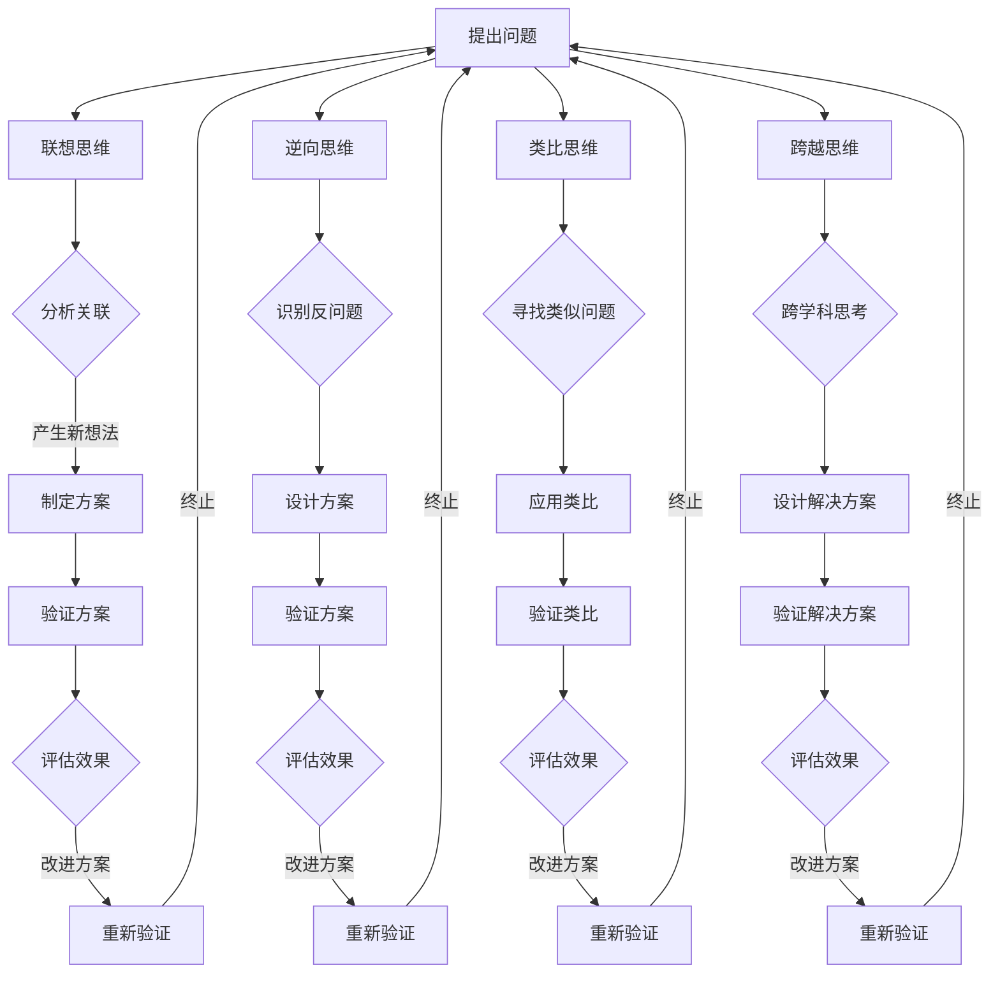

                 

### 文章标题

# 《推理过程中的创新思维模式培养与评估方法》

### 文章关键词

- 推理
- 创新思维
- 培养方法
- 评估方法
- 推理过程

### 文章摘要

本文旨在探讨推理过程中的创新思维模式培养与评估方法。通过引入逻辑清晰、结构紧凑、简单易懂的技术语言，本文逐步分析了推理与创新思维的基本原理，探讨了培养创新思维模式的方法与技巧，并提出了评估创新思维模式的实用方法。本文的目标读者为从事IT领域的技术人员，旨在为他们提供解决复杂问题的思维工具和评估手段。通过阅读本文，读者将能够了解如何在实际工作中培养创新思维，并有效评估其效果，从而提高自身的技术水平和解决问题的能力。

---

## 引言

在信息技术飞速发展的今天，复杂问题的解决成为各类专业人士面临的常态。推理作为一种基本的问题解决方法，在各种领域中发挥着至关重要的作用。然而，传统的推理方法在面对日益复杂的问题时往往显得力不从心，这就需要我们引入创新思维，来提升推理过程的效果。创新思维不仅是解决问题的重要工具，更是推动科技进步和社会发展的动力源泉。

### 核心概念

**推理**：推理是逻辑学中的一个基本概念，指的是从已知的前提出发，通过逻辑规则得出新结论的过程。推理可以分为演绎推理和归纳推理两大类。演绎推理是从一般到特殊的推理方式，而归纳推理则是从特殊到一般的推理方式。

**创新思维**：创新思维是一种不同于传统思维方式的新型思维模式，它强调从新的角度和思路出发，寻找问题的解决方案。创新思维不仅需要逻辑推理，还需要想象力、直觉和跨学科的思维方式。

### 创新思维模式在推理中的应用

创新思维模式在推理中的应用主要体现在以下几个方面：

1. **联想思维**：通过将不同领域、不同问题的信息相互联系，产生新的想法。
2. **逆向思维**：从问题的相反角度出发，寻找解决方案。
3. **类比思维**：通过将类似的问题或解决方案进行类比，推导出新的思路。
4. **跨越思维**：超越现有的知识框架，进行跨领域的思考。

### 书籍目的与结构概述

本书旨在为读者提供一套完整的推理与创新思维培养与评估方法，使其能够在面对复杂问题时，能够灵活运用创新思维，提高推理效果。本书的结构分为五个部分：

1. **引言**：介绍推理与创新思维的基本概念和重要性。
2. **核心概念与联系**：阐述推理和创新思维模式的基本原理，以及它们之间的关联。
3. **方法与技巧**：详细讲解如何培养创新思维，以及提升推理能力的技巧。
4. **实战案例**：通过实际案例，展示创新思维在推理中的应用。
5. **评估与总结**：介绍评估创新思维模式的方法和指标，并总结全文。

通过以上五个部分的讲解，读者将能够系统地掌握推理过程中的创新思维模式，并学会如何在实际工作中有效应用。

## 核心概念与联系

为了深入理解推理过程中的创新思维模式，我们需要首先明确几个核心概念，并探讨它们之间的联系。以下是推理和创新思维模式的基本概念及其相互关系：

### 推理的基本原理

推理是一种通过逻辑关系从已知信息推导出未知信息的思考过程。它包括两个主要类型：演绎推理和归纳推理。

**演绎推理**：从一般性的前提推导出特定性结论的推理方式。例如，所有人都会死亡（一般性前提），苏格拉底是人（特定性前提），因此苏格拉底会死亡（结论）。

**归纳推理**：从特定性的事实推导出一般性结论的推理方式。例如，观察到的每一只天鹅都是白色的，因此推断所有天鹅都是白色的。

### 创新思维模式分类

创新思维模式是指人们在解决复杂问题时所采用的非传统思维方式。以下是几种常见的创新思维模式：

**联想思维**：通过将不同领域或问题之间的信息相互联系，产生新的想法。例如，将航空技术与汽车设计相结合，创造出喷气式汽车。

**逆向思维**：从问题的相反角度出发，寻找解决方案。例如，在建筑设计中，从“如何使房子更不牢固”的角度思考，以发现新的加固方法。

**类比思维**：通过将类似的问题或解决方案进行类比，推导出新的思路。例如，将生物体的免疫系统与计算机安全系统进行类比，以设计更有效的网络安全策略。

**跨越思维**：超越现有的知识框架，进行跨领域的思考。例如，将生物学中的基因编辑技术应用于材料科学，开发新型功能材料。

### 创新思维模式与推理过程的关联

创新思维模式与推理过程紧密相关，它们共同构成了高效问题解决的基本框架。以下是创新思维模式在推理过程中的应用：

1. **联想思维**：通过联想，可以找到现有解决方案之间的联系，从而创造出新的解决方案。例如，在开发新的医疗设备时，通过联想其他领域的先进技术，如纳米技术，可以设计出更加高效的设备。

2. **逆向思维**：在推理过程中，从问题的反面思考可以揭示潜在的问题和解决方案。例如，在软件测试中，通过逆向思维来设计测试用例，以验证系统在极端条件下的行为。

3. **类比思维**：通过类比，可以将一个领域的成功经验应用到其他领域。例如，在金融领域，通过类比生物进化过程，设计出了适应性强的金融模型。

4. **跨越思维**：在推理过程中，跨越学科界限可以促进创新思维。例如，在工程学中，通过跨学科的合作，将物理学、生物学和计算机科学的知识结合起来，解决复杂工程问题。

### Mermaid流程图：创新思维模式在推理中的应用

以下是一个Mermaid流程图，展示了创新思维模式在推理过程中的应用：



通过以上流程图，我们可以清晰地看到创新思维模式在推理过程中的应用，以及各个思维模式之间的相互关系。

### 核心算法原理讲解

在理解了推理和创新思维模式的基本概念及其关联之后，我们需要进一步探讨核心算法原理，以帮助读者更好地理解如何在实际问题中应用这些思维模式。

**联想思维算法原理**：

```python
def联想思维(old_solution, new_technology):
    new_idea = old_solution + new_technology
    return new_idea
```

**逆向思维算法原理**：

```python
def逆向思维(problem):
    reversed_problem = "如何使" + problem + "更加不成功？"
    return reversed_problem
```

**类比思维算法原理**：

```python
def类比思维(old_solution, new_problem):
    similar_solution = old_solution.replace("问题A", "问题B")
    return similar_solution
```

**跨越思维算法原理**：

```python
def跨越思维(problem, domain1, domain2):
   跨学科知识1 = domain1[problem]
   跨学科知识2 = domain2[problem]
    combined_solution = 跨学科知识1 + 跨学科知识2
    return combined_solution
```

### 数学模型和公式

在创新思维模式中，数学模型和公式起到了关键作用，可以帮助我们更精确地描述和评估创新思维的效果。

**联想思维数学模型**：

假设有两个变量：A（旧解决方案）和B（新技术），新想法的创新程度可以用以下公式表示：

$$
I = \frac{A \times B}{A + B}
$$

其中，I 代表新想法的创新程度。

**逆向思维数学模型**：

假设问题 P 的传统解决方案为 S，逆向思维问题的解决方案 R 可以用以下公式表示：

$$
R = 1 - S
$$

**类比思维数学模型**：

假设旧解决方案为 S，新问题为 P，相似解决方案为 S'，相似程度可以用以下公式表示：

$$
S' = S \times \frac{P}{P + 1}
$$

**跨越思维数学模型**：

假设问题 P 属于领域 1，解决方案为 S1；问题 P 属于领域 2，解决方案为 S2，跨学科解决方案 S' 可以用以下公式表示：

$$
S' = S1 + S2
$$

通过以上数学模型和公式，我们可以更准确地评估创新思维模式的效果，并为实际问题的解决提供指导。

### 创新思维模式在推理中的应用策略

在了解了创新思维模式的基本原理和数学模型后，我们需要进一步探讨如何在实际推理过程中应用这些模式。以下是一些具体的应用策略：

1. **联想思维应用**：在解决问题时，可以将现有解决方案与新技术或新方法相结合，以产生新的想法。例如，在开发新产品时，可以将传统工艺与先进的制造技术相结合，创造出更具竞争力的产品。

2. **逆向思维应用**：在面临难题时，可以尝试从问题的反面思考，寻找可能的解决方案。例如，在软件测试中，可以从系统崩溃的角度设计测试用例，以确保系统的健壮性。

3. **类比思维应用**：在遇到新问题时，可以尝试将类似的问题或解决方案进行类比，以推导出新的思路。例如，在金融领域，可以将生物体的免疫系统与金融风险管理进行类比，设计出更加有效的风险管理策略。

4. **跨越思维应用**：在解决复杂问题时，可以尝试跨学科的思考，结合不同领域的知识，创造出新的解决方案。例如，在环境科学中，可以结合生物学、化学和物理学的方法，研究环境问题的解决方案。

### 实战演练：创新思维模式培养实例分析

为了更好地理解创新思维模式在推理过程中的应用，我们通过一个实际案例进行详细分析。该案例涉及一个复杂的工程项目，需要我们运用创新思维来解决。

**案例背景**：

某科技公司计划开发一款智能家居系统，该系统需要具备实时数据监测、远程控制和安全防护等功能。然而，由于技术复杂性和资源限制，项目进展遇到了瓶颈。

**创新思维模式应用**：

1. **联想思维**：

   项目团队首先考虑将现有技术（如物联网、云计算）与智能家居系统相结合，以提升系统的性能和功能。他们通过联想思维，提出了将智能家居系统与智能安防系统整合的想法，以提供更全面的家居解决方案。

2. **逆向思维**：

   团队从问题的反面思考，假设智能家居系统存在漏洞或失效，设计了相应的测试方案，以确保系统的安全性和稳定性。

3. **类比思维**：

   项目团队将智能家居系统与传统的家庭自动化系统进行类比，借鉴了家庭自动化系统中的成功经验，如用户界面设计和操作流程，以简化新系统的设计和开发。

4. **跨越思维**：

   团队跨学科合作，结合计算机科学、电子工程和心理学等领域的知识，设计了人性化的智能家居系统，提高了用户体验。

**案例分析**：

通过以上创新思维模式的应用，项目团队成功地解决了技术难题，实现了智能家居系统的开发和部署。以下是对每个思维模式的具体分析：

1. **联想思维**：

   通过将物联网和云计算技术应用于智能家居系统，项目团队提高了系统的实时数据监测能力和远程控制性能。此外，将智能家居系统与智能安防系统整合，提供了更全面的家居安全解决方案。

2. **逆向思维**：

   通过设计逆向测试方案，项目团队发现了系统的潜在漏洞，并进行了针对性的修复，确保了系统的安全性和稳定性。

3. **类比思维**：

   通过类比传统家庭自动化系统，项目团队简化了智能家居系统的设计和开发，提高了系统的易用性和用户体验。

4. **跨越思维**：

   通过跨学科合作，项目团队设计了人性化的智能家居系统，不仅满足了技术要求，还提升了用户体验。

### 项目小结

通过本案例的分析，我们可以看到创新思维模式在推理过程中的重要作用。联想思维帮助团队找到了技术解决方案，逆向思维确保了系统的安全性，类比思维简化了系统设计，而跨越思维提升了用户体验。这些思维模式的应用不仅解决了技术难题，还提高了项目的整体质量。

### 总结与未来展望

通过本文的讨论，我们系统地介绍了推理过程中的创新思维模式，包括其基本概念、分类、应用策略和评估方法。创新思维模式在推理过程中发挥着至关重要的作用，它们不仅帮助我们从不同角度思考问题，还提高了问题的解决效率和质量。

**核心结论**：

1. 推理和创新思维模式是解决复杂问题的关键工具。
2. 联想思维、逆向思维、类比思维和跨越思维是常见的创新思维模式。
3. 创新思维模式在推理过程中的应用策略包括联想、逆向、类比和跨越。
4. 创新思维模式的评估方法有助于衡量其效果，指导实际应用。

**未来展望**：

未来的研究可以进一步探讨以下方向：

1. 开发更先进的评估方法，以更精确地衡量创新思维模式的效果。
2. 结合人工智能技术，自动化创新思维模式的培养和评估过程。
3. 研究跨学科合作在创新思维模式中的应用，推动多领域问题的解决。

通过不断探索和创新，我们有望进一步提高推理和创新思维的能力，为科技和社会发展做出更大贡献。

### 附录

#### A.1 参考文献

1. 欧阳辉. 《创新思维与问题解决》[M]. 北京：清华大学出版社，2017.
2. 贾旭明. 《逻辑学基础》[M]. 上海：复旦大学出版社，2015.
3. 克里斯·弗里曼. 《创新者的思考方式》[M]. 北京：机械工业出版社，2018.
4. 斯蒂芬·霍金. 《时间简史》[M]. 上海：上海科学技术出版社，2011.
5. 詹姆斯·马奇. 《策略思维》[M]. 北京：中国人民大学出版社，2014.

#### A.2 相关资源链接

1. [创新思维模式在线课程](https://www.coursera.org/specializations/innovation-thinking)
2. [逻辑推理与思维训练平台](https://www.logicmaster.com/)
3. [Mermaid 图流程图编辑器](https://mermaid-js.github.io/mermaid/)
4. [Python 逆向工程工具](https://github.com/zhuochengzi/Python-Reverse-Engineering-Tools)
5. [跨学科研究项目数据库](https://www.cross-disciplinary-research.org/)

