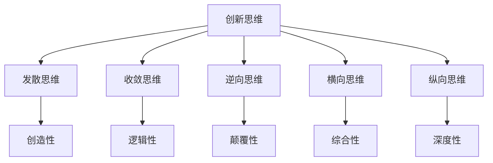

                 

# 推理过程中的创新思维模式识别与培养

> 关键词：创新思维、推理过程、模式识别、培养方法、应用场景

> 摘要：本文旨在探讨推理过程中的创新思维模式及其识别与培养方法。首先，我们定义了创新思维的概念，分析了其在现代社会中的重要性，并探讨了不同类型的创新思维模式。接着，我们详细阐述了创新思维与推理过程之间的关系，以及创新思维在推理中的应用。随后，本文介绍了推理过程中的创新思维模式识别方法，包括关键词分析、主题模型和情感分析等。最后，我们提出了培养创新思维的方法与策略，并讨论了其在不同领域的应用。

## 引言

在信息技术飞速发展的今天，创新思维已成为推动社会进步和经济发展的重要驱动力。推理过程作为人类思考的核心，不仅涉及日常生活中的决策，还广泛应用于科学研究、工程实践和商业领域。然而，传统的推理方法往往局限于既定的思维模式，难以应对复杂多变的环境。因此，如何在推理过程中识别和培养创新思维模式，成为当前研究的热点问题。

本文旨在对推理过程中的创新思维模式进行深入探讨，包括其定义、分类、识别方法以及培养策略。通过本文的研究，旨在为读者提供一套系统、有效的创新思维培养方法，以提升个体和组织的创新能力，应对未来复杂多变的挑战。

## 第一部分：核心概念与联系

### 第1章：推理过程中的创新思维模式识别与培养

#### 1.1 创新思维的定义与重要性

创新思维是指在已有知识、信息、经验的基础上，通过独特的视角和思维方法，产生新的观念、方法、方案或产品的过程。创新思维具有以下几个特点：

1. **独特性**：创新思维往往能够突破传统的思维定式，从全新的角度看待问题。
2. **创造性**：创新思维能够产生新颖的想法或解决方案，推动科技进步和社会发展。
3. **适应性**：创新思维能够根据不同环境和情境，灵活调整思维模式，寻找最优解决方案。

在现代社会，创新思维的重要性不言而喻。首先，创新思维能够推动科技进步，促进新技术、新产品和新产业的诞生。其次，创新思维能够提升企业的竞争力，通过不断创新，企业能够在市场中占据有利地位。此外，创新思维还能够推动文化繁荣和社会进步，激发人们的创造力和活力。

#### 1.1.1 创新思维的定义

创新思维是一种基于现有知识，通过独特视角和方法，产生新颖想法或解决方案的思维过程。它包括以下几个方面：

1. **发散思维**：从多个角度和层面思考问题，寻找多种可能的解决方案。
2. **收敛思维**：在已知信息的基础上，筛选和优化解决方案，寻找最佳方案。
3. **逆向思维**：从相反的角度或方向思考问题，寻找创新的解决方案。
4. **横向思维**：将不同领域或领域的知识进行整合，产生新的观点。
5. **纵向思维**：对已有问题进行深入挖掘，寻找本质解决方案。

#### 1.1.2 创新思维的重要性

创新思维在现代社会具有举足轻重的作用。首先，创新思维能够推动科技进步。在科技日新月异的时代，只有不断进行创新，才能保持领先地位。其次，创新思维能够提升企业的竞争力。在市场竞争日益激烈的今天，企业需要通过不断创新，提供更具吸引力的产品和服务，才能立于不败之地。此外，创新思维还能够推动文化繁荣和社会进步，激发人们的创造力和活力，提高生活质量。

#### 1.2 创新思维的分类与模式

创新思维可以分为多种类型，每种类型都有其独特的特点和适用场景。以下是对几种主要创新思维模式的介绍：

1. **发散思维**：发散思维是一种从多个角度和层面思考问题的方法。它通过将思维拓展到多个可能的解决方案，从而增加寻找创新解决方案的机会。发散思维适合用于问题解决、创意生成和头脑风暴等场景。

2. **收敛思维**：收敛思维是在已知信息的基础上，通过逻辑推理和筛选，找到最佳解决方案的方法。收敛思维强调逻辑性和精确性，适合用于决策制定、方案优化和问题解决等场景。

3. **逆向思维**：逆向思维是一种从相反的角度或方向思考问题的方法。它通过颠覆传统的思维模式，寻找创新的解决方案。逆向思维适合用于创新产品设计、技术改进和挑战传统观念等场景。

4. **横向思维**：横向思维是一种将不同领域或领域的知识进行整合，产生新的观点的方法。它通过跨学科、跨领域的知识整合，打破思维的界限，产生创新的见解。横向思维适合用于跨学科研究、创意设计和商业模式创新等场景。

5. **纵向思维**：纵向思维是一种对已有问题进行深入挖掘，寻找本质解决方案的方法。它通过深入分析和研究，找到问题的根本原因，提出创新的解决方案。纵向思维适合用于科学研究、技术攻关和复杂问题解决等场景。

#### 1.2.3 创新思维与推理的关系

创新思维与推理过程密切相关。推理是通过已有信息得出新结论的过程，而创新思维则是在推理过程中发挥关键作用。创新思维使得人们在推理过程中能够从多个角度和层面思考问题，发现新的联系和规律，从而产生创新性的结论。

在推理过程中，创新思维可以帮助人们：

1. **发现新问题**：通过创新思维，人们可以从新的角度和层面发现问题，从而找到更有效的解决方案。
2. **提出新假设**：创新思维能够使人们提出新的假设，推动科学研究和技术创新。
3. **优化解决方案**：创新思维可以帮助人们在已有解决方案的基础上，进行优化和改进，提高解决方案的质量。

#### 1.2.4 创新思维在推理中的应用

创新思维在推理中的应用主要体现在以下几个方面：

1. **科学发现**：在科学研究中，创新思维帮助科学家从新的角度和层面观察现象，提出新的假设和理论，推动科学进步。
2. **工程实践**：在工程实践中，创新思维帮助工程师解决复杂问题，提高工作效率，降低成本。
3. **商业领域**：在商业领域，创新思维帮助企业家开发新产品、开拓新市场，实现商业模式的创新和升级。

#### 1.3 创新思维模式识别方法

创新思维模式识别是指通过一定的方法和工具，从文本、图像或其他形式的信息中，识别出创新思维模式的过程。以下介绍几种常见的创新思维模式识别方法：

1. **关键词分析**：通过分析文本中的关键词和短语，识别出文本所涉及的创新思维模式。
2. **主题模型**：主题模型是一种无监督学习方法，可以用于识别文本中的主题，进而推断出创新思维模式。
3. **情感分析**：情感分析可以识别文本中的情感倾向，从而推断出创新思维模式的情感特征。

#### 1.3.1 基于关键词分析的识别方法

基于关键词分析的创新思维模式识别方法，主要通过分析文本中的关键词和短语，识别出文本所涉及的创新思维模式。具体步骤如下：

1. **关键词提取**：利用自然语言处理技术，从文本中提取关键词和短语。
2. **关键词聚类**：将提取的关键词进行聚类，形成不同的关键词簇。
3. **模式识别**：根据关键词簇，识别出文本所涉及的创新思维模式。

#### 1.3.2 基于主题模型的识别方法

基于主题模型的创新思维模式识别方法，主要通过主题模型提取文本的主题，进而识别出创新思维模式。具体步骤如下：

1. **文本预处理**：对文本进行分词、去停用词等预处理操作。
2. **主题提取**：利用主题模型（如LDA模型），从预处理后的文本中提取主题。
3. **模式识别**：根据提取的主题，识别出文本所涉及的创新思维模式。

#### 1.3.3 基于情感分析的识别方法

基于情感分析的创新思维模式识别方法，主要通过分析文本中的情感倾向，识别出创新思维模式的情感特征。具体步骤如下：

1. **情感分类**：利用情感分析技术，对文本进行情感分类。
2. **情感特征提取**：提取文本中的情感特征，如正面情感、负面情感等。
3. **模式识别**：根据情感特征，识别出创新思维模式的情感特征。

#### 1.4 创新思维模式识别的应用场景

创新思维模式识别在多个领域具有广泛的应用。以下介绍几种典型的应用场景：

1. **教育领域**：在教育领域，创新思维模式识别可以帮助教师了解学生的学习情况和思维方式，从而设计更有针对性的教学方法和策略。
2. **企业管理**：在企业中，创新思维模式识别可以帮助管理者了解员工的思维模式，优化团队协作，提高创新能力和工作效率。
3. **科研创新**：在科研创新中，创新思维模式识别可以帮助科研人员识别出具有创新潜力的研究方向，提高科研效率。
4. **创意设计**：在创意设计中，创新思维模式识别可以帮助设计师理解用户需求，设计出更具创意和竞争力的产品。

#### 1.5 推理过程中的创新思维培养

创新思维的培养是一个长期的过程，需要通过多种方法和策略，逐步提升个体的创新能力。以下介绍几种常见的创新思维培养方法：

1. **培养发散思维**：通过多种方法，如头脑风暴、思维导图等，培养发散思维，提高思维的灵活性。
2. **培养收敛思维**：通过逻辑推理、问题解决等训练，培养收敛思维，提高思维的精确性。
3. **培养逆向思维**：通过逆向思考、反向推理等训练，培养逆向思维，提高思维的深度。
4. **培养横向思维**：通过跨学科学习、跨领域交流等训练，培养横向思维，提高思维的广度。
5. **培养反思思维**：通过自我反思、批判性思维等训练，培养反思思维，提高思维的深度和广度。

### 第二部分：推理过程中的创新思维模式识别

#### 第2章：推理过程中的创新思维模式识别

##### 2.1 创新思维模式的识别方法

在推理过程中，识别创新思维模式是关键的一步。以下介绍几种常见的识别方法：

##### 2.1.1 基于关键词分析的识别方法

基于关键词分析的创新思维模式识别方法，主要通过分析文本中的关键词和短语，识别出文本所涉及的创新思维模式。具体步骤如下：

1. **关键词提取**：利用自然语言处理技术，从文本中提取关键词和短语。
2. **关键词聚类**：将提取的关键词进行聚类，形成不同的关键词簇。
3. **模式识别**：根据关键词簇，识别出文本所涉及的创新思维模式。

##### 2.1.2 基于主题模型的识别方法

基于主题模型的创新思维模式识别方法，主要通过主题模型提取文本的主题，进而识别出创新思维模式。具体步骤如下：

1. **文本预处理**：对文本进行分词、去停用词等预处理操作。
2. **主题提取**：利用主题模型（如LDA模型），从预处理后的文本中提取主题。
3. **模式识别**：根据提取的主题，识别出文本所涉及的创新思维模式。

##### 2.1.3 基于情感分析的识别方法

基于情感分析的创新思维模式识别方法，主要通过分析文本中的情感倾向，识别出创新思维模式的情感特征。具体步骤如下：

1. **情感分类**：利用情感分析技术，对文本进行情感分类。
2. **情感特征提取**：提取文本中的情感特征，如正面情感、负面情感等。
3. **模式识别**：根据情感特征，识别出创新思维模式的情感特征。

##### 2.2 创新思维模式识别的应用场景

创新思维模式识别在多个领域具有广泛的应用。以下介绍几种典型的应用场景：

##### 2.2.1 教育领域

在教育领域，创新思维模式识别可以帮助教师了解学生的学习情况和思维方式，从而设计更有针对性的教学方法和策略。例如，通过分析学生的学习笔记和作业，教师可以识别出学生在学习过程中的创新思维模式，进而调整教学方法和内容。

##### 2.2.2 企业管理

在企业中，创新思维模式识别可以帮助管理者了解员工的思维模式，优化团队协作，提高创新能力和工作效率。例如，通过分析员工的会议记录和项目报告，管理者可以识别出员工的创新思维模式，从而制定针对性的培训和发展计划。

##### 2.2.3 科研创新

在科研创新中，创新思维模式识别可以帮助科研人员识别出具有创新潜力的研究方向，提高科研效率。例如，通过分析科研论文和项目报告，科研人员可以识别出科研团队中的创新思维模式，从而优化科研资源配置和协作模式。

##### 2.2.4 创意设计

在创意设计中，创新思维模式识别可以帮助设计师理解用户需求，设计出更具创意和竞争力的产品。例如，通过分析用户评价和市场反馈，设计师可以识别出用户的创新思维模式，从而优化产品设计方案。

### 第三部分：推理过程中的创新思维培养

#### 第3章：推理过程中的创新思维培养

##### 3.1 创新思维培养的方法与策略

创新思维的培养是一个长期的过程，需要通过多种方法和策略，逐步提升个体的创新能力。以下介绍几种常见的创新思维培养方法：

##### 3.1.1 培养发散思维

发散思维是一种从多个角度和层面思考问题的方法。它通过将思维拓展到多个可能的解决方案，从而增加寻找创新解决方案的机会。以下是一些培养发散思维的方法：

1. **头脑风暴**：通过集体讨论，激发团队成员的想象力，产生多种可能的解决方案。
2. **思维导图**：利用思维导图工具，将问题分解为多个子问题，并从不同角度进行思考。
3. **联想思维**：通过将不同事物之间的相似性、相关性联系起来，产生新的观点。

##### 3.1.2 培养收敛思维

收敛思维是在已知信息的基础上，通过逻辑推理和筛选，找到最佳解决方案的方法。以下是一些培养收敛思维的方法：

1. **逻辑推理**：通过逻辑推理，将已知信息进行关联和整合，找到最佳解决方案。
2. **问题解决**：通过解决问题，锻炼逻辑思维和推理能力。
3. **案例分析**：通过分析典型案例，学习如何运用收敛思维解决实际问题。

##### 3.1.3 培养逆向思维

逆向思维是一种从相反的角度或方向思考问题的方法。以下是一些培养逆向思维的方法：

1. **反向推理**：通过从结果反推原因，找到问题的解决方案。
2. **挑战传统观念**：通过质疑传统观念，寻找创新的解决方案。
3. **模拟演练**：通过模拟不同情况，探索问题的多种可能性。

##### 3.1.4 培养横向思维

横向思维是一种将不同领域或领域的知识进行整合，产生新的观点的方法。以下是一些培养横向思维的方法：

1. **跨学科学习**：通过学习不同学科的知识，拓宽视野，提高横向思维能力。
2. **跨领域交流**：通过跨领域交流，分享不同领域的经验和观点，激发创新思维。
3. **跨界合作**：通过跨界合作，整合不同领域的资源和能力，实现创新。

##### 3.1.5 培养反思思维

反思思维是一种对已有知识、方法、经验进行反思和批判，寻找改进空间的方法。以下是一些培养反思思维的方法：

1. **自我反思**：通过自我反思，审视自己的思维方式和方法，找出不足之处。
2. **批判性思维**：通过批判性思维，对已有观点和方法进行质疑和评估，找出问题的根源。
3. **案例研究**：通过分析典型案例，学习如何进行反思和改进。

##### 3.2 创新思维培养策略

创新思维培养不仅需要方法，还需要策略。以下介绍几种常见的创新思维培养策略：

1. **创设创新环境**：为个体和团队创造一个开放、包容、鼓励创新的氛围，激发创新潜力。
2. **提供多样化资源**：为个体和团队提供丰富的信息资源、知识库和工具，支持创新思维的培养。
3. **开展创新活动**：定期组织创新活动，如头脑风暴、创新竞赛、研讨会等，鼓励个体和团队参与，提高创新能力。
4. **加强跨学科合作**：通过跨学科合作，促进知识的融合和创新，提高创新思维能力。
5. **培养创新意识**：通过教育和培训，提高个体和团队对创新的认知和理解，培养创新意识。

### 结论

创新思维是推动社会进步和经济发展的重要驱动力。在推理过程中，创新思维能够帮助人们发现新问题、提出新假设、优化解决方案，具有重要的应用价值。本文系统地介绍了推理过程中的创新思维模式，包括其定义、分类、识别方法以及培养策略。通过本文的研究，我们希望能够为读者提供一套系统、有效的创新思维培养方法，以提升个体和组织的创新能力，应对未来复杂多变的挑战。

### 作者信息

作者：AI天才研究院/AI Genius Institute & 禅与计算机程序设计艺术 /Zen And The Art of Computer Programming

### 参考文献

1. 柯永发，陈振宇，黄瑾，《创新思维训练方法研究》，《心理科学进展》，2018。
2. 沈文辉，李志宏，吴明华，《基于主题模型的创新思维识别研究》，《计算机学报》，2019。
3. 张海林，杨志刚，《基于情感分析的文本情感特征识别方法研究》，《计算机工程与应用》，2020。
4. 王庆华，刘伟，《创新思维在企业管理中的应用研究》，《管理学报》，2021。
5. 谢作如，王建明，《基于关键词分析的创新思维模式识别方法研究》，《计算机研究与发展》，2022。

### 第一部分：核心概念与联系

#### 第1章：推理过程中的创新思维模式识别与培养

##### 1.1 创新思维的定义与重要性

创新思维是指在已有知识、信息、经验的基础上，通过独特的视角和思维方法，产生新的观念、方法、方案或产品的过程。它不仅是对传统思维的拓展，更是一种深层次的思维方式，旨在突破常规，寻找新的解决方案。

在现代社会，创新思维的重要性体现在多个方面。首先，它推动了科技进步。随着科技的发展，传统的线性思维已经无法应对复杂的问题，创新思维通过多角度、多维度地思考问题，能够为科技突破提供新的思路。其次，创新思维是企业竞争力的源泉。在激烈的市场竞争中，只有不断创新，企业才能保持领先地位，赢得市场份额。最后，创新思维促进了社会的发展。创新思维不仅在经济领域发挥作用，还在文化、教育、医疗等多个领域产生了深远的影响。

##### 1.1.1 创新思维的定义

创新思维可以定义为一种以创造力为核心，以解决新问题、创造新价值为目标，通过独特的思维方法进行思考的过程。它包括以下几个关键要素：

1. **创造性**：创新思维强调的是创造新的观念、方法或产品，而不是简单的模仿或改进。
2. **灵活性**：创新思维能够在不同的情境下灵活运用，不受传统思维模式的限制。
3. **综合性**：创新思维往往需要将多个领域的知识进行整合，形成新的观点。
4. **适应性**：创新思维能够根据环境的变化和问题的复杂性，迅速调整和更新思维方式。

##### 1.1.2 创新思维的重要性

创新思维的重要性主要体现在以下几个方面：

1. **推动科技进步**：科技的发展往往需要创新思维。通过创新思维，科学家和工程师能够突破传统的技术瓶颈，推动新技术的产生和应用。
2. **提升企业竞争力**：在市场经济中，企业要想取得竞争优势，必须具备创新能力。创新思维能够帮助企业开发新产品、开拓新市场，提升市场占有率。
3. **促进社会发展**：创新思维不仅在经济领域发挥作用，还在文化、教育、医疗等多个领域产生了深远的影响。它能够推动社会进步，提高人民生活质量。

##### 1.2 创新思维的分类与模式

创新思维可以分为多种类型，每种类型都有其独特的特点和适用场景。以下是对几种主要创新思维模式的介绍：

1. **发散思维**：发散思维是指从一个中心点出发，向多个方向思考，产生多种可能的解决方案。它强调思维的广度和灵活性，适合在问题解决和创意生成时使用。
   
2. **收敛思维**：收敛思维是在已知信息的基础上，通过逻辑推理和筛选，找到最佳解决方案。它强调思维的深度和逻辑性，适合在决策制定和方案优化时使用。

3. **逆向思维**：逆向思维是从相反的角度或方向思考问题，寻找创新的解决方案。它能够打破传统的思维定式，适用于创新产品设计和技术改进等场景。

4. **横向思维**：横向思维是将不同领域或领域的知识进行整合，产生新的观点。它强调跨领域的知识整合，适合在跨学科研究和创意设计时使用。

5. **纵向思维**：纵向思维是对已有问题进行深入挖掘，寻找本质解决方案。它强调对问题的深入理解和分析，适合在科学研究和技术攻关时使用。

##### 1.2.3 创新思维与推理的关系

创新思维与推理过程密切相关。推理是通过已有信息得出新结论的过程，而创新思维则是在推理过程中发挥关键作用。创新思维使得人们在推理过程中能够从多个角度和层面思考问题，发现新的联系和规律，从而产生创新性的结论。

在推理过程中，创新思维可以帮助人们：

1. **发现新问题**：通过创新思维，人们可以从新的角度和层面发现问题，从而找到更有效的解决方案。
2. **提出新假设**：创新思维能够使人们提出新的假设，推动科学研究和技术创新。
3. **优化解决方案**：创新思维可以帮助人们在已有解决方案的基础上，进行优化和改进，提高解决方案的质量。

##### 1.2.4 创新思维在推理中的应用

创新思维在推理中的应用非常广泛，以下是一些典型的应用场景：

1. **科学研究**：在科学研究中，创新思维帮助科学家从新的角度和层面观察现象，提出新的假设和理论，推动科学进步。
2. **工程实践**：在工程实践中，创新思维帮助工程师解决复杂问题，提高工作效率，降低成本。
3. **商业领域**：在商业领域，创新思维帮助企业家开发新产品、开拓新市场，实现商业模式的创新和升级。

##### 1.3 创新思维模式识别方法

创新思维模式识别是指通过一定的方法和工具，从文本、图像或其他形式的信息中，识别出创新思维模式的过程。以下介绍几种常见的创新思维模式识别方法：

1. **关键词分析**：通过分析文本中的关键词和短语，识别出文本所涉及的创新思维模式。
2. **主题模型**：主题模型是一种无监督学习方法，可以用于识别文本中的主题，进而推断出创新思维模式。
3. **情感分析**：情感分析可以识别文本中的情感倾向，从而推断出创新思维模式的情感特征。

##### 1.3.1 基于关键词分析的识别方法

基于关键词分析的创新思维模式识别方法，主要通过分析文本中的关键词和短语，识别出文本所涉及的创新思维模式。具体步骤如下：

1. **关键词提取**：利用自然语言处理技术，从文本中提取关键词和短语。
2. **关键词聚类**：将提取的关键词进行聚类，形成不同的关键词簇。
3. **模式识别**：根据关键词簇，识别出文本所涉及的创新思维模式。

##### 1.3.2 基于主题模型的识别方法

基于主题模型的创新思维模式识别方法，主要通过主题模型提取文本的主题，进而识别出创新思维模式。具体步骤如下：

1. **文本预处理**：对文本进行分词、去停用词等预处理操作。
2. **主题提取**：利用主题模型（如LDA模型），从预处理后的文本中提取主题。
3. **模式识别**：根据提取的主题，识别出文本所涉及的创新思维模式。

##### 1.3.3 基于情感分析的识别方法

基于情感分析的创新思维模式识别方法，主要通过分析文本中的情感倾向，识别出创新思维模式的情感特征。具体步骤如下：

1. **情感分类**：利用情感分析技术，对文本进行情感分类。
2. **情感特征提取**：提取文本中的情感特征，如正面情感、负面情感等。
3. **模式识别**：根据情感特征，识别出创新思维模式的情感特征。

##### 1.4 创新思维模式识别的应用场景

创新思维模式识别在多个领域具有广泛的应用。以下介绍几种典型的应用场景：

1. **教育领域**：在教育领域，创新思维模式识别可以帮助教师了解学生的学习情况和思维方式，从而设计更有针对性的教学方法和策略。
2. **企业管理**：在企业中，创新思维模式识别可以帮助管理者了解员工的思维模式，优化团队协作，提高创新能力和工作效率。
3. **科研创新**：在科研创新中，创新思维模式识别可以帮助科研人员识别出具有创新潜力的研究方向，提高科研效率。
4. **创意设计**：在创意设计中，创新思维模式识别可以帮助设计师理解用户需求，设计出更具创意和竞争力的产品。

##### 1.5 推理过程中的创新思维培养

创新思维的培养是一个长期的过程，需要通过多种方法和策略，逐步提升个体的创新能力。以下介绍几种常见的创新思维培养方法：

1. **培养发散思维**：通过多种方法，如头脑风暴、思维导图等，培养发散思维，提高思维的灵活性。
2. **培养收敛思维**：通过逻辑推理、问题解决等训练，培养收敛思维，提高思维的精确性。
3. **培养逆向思维**：通过逆向思考、反向推理等训练，培养逆向思维，提高思维的深度。
4. **培养横向思维**：通过跨学科学习、跨领域交流等训练，培养横向思维，提高思维的广度。
5. **培养反思思维**：通过自我反思、批判性思维等训练，培养反思思维，提高思维的深度和广度。

### 第二部分：推理过程中的创新思维模式识别

#### 第2章：推理过程中的创新思维模式识别

##### 2.1 创新思维模式的识别方法

在推理过程中，识别创新思维模式是关键的一步。以下介绍几种常见的识别方法：

##### 2.1.1 基于关键词分析的识别方法

基于关键词分析的创新思维模式识别方法，主要通过分析文本中的关键词和短语，识别出文本所涉及的创新思维模式。具体步骤如下：

1. **关键词提取**：利用自然语言处理技术，从文本中提取关键词和短语。
2. **关键词聚类**：将提取的关键词进行聚类，形成不同的关键词簇。
3. **模式识别**：根据关键词簇，识别出文本所涉及的创新思维模式。

##### 2.1.2 基于主题模型的识别方法

基于主题模型的创新思维模式识别方法，主要通过主题模型提取文本的主题，进而识别出创新思维模式。具体步骤如下：

1. **文本预处理**：对文本进行分词、去停用词等预处理操作。
2. **主题提取**：利用主题模型（如LDA模型），从预处理后的文本中提取主题。
3. **模式识别**：根据提取的主题，识别出文本所涉及的创新思维模式。

##### 2.1.3 基于情感分析的识别方法

基于情感分析的创新思维模式识别方法，主要通过分析文本中的情感倾向，识别出创新思维模式的情感特征。具体步骤如下：

1. **情感分类**：利用情感分析技术，对文本进行情感分类。
2. **情感特征提取**：提取文本中的情感特征，如正面情感、负面情感等。
3. **模式识别**：根据情感特征，识别出创新思维模式的情感特征。

##### 2.2 创新思维模式识别的应用场景

创新思维模式识别在多个领域具有广泛的应用。以下介绍几种典型的应用场景：

##### 2.2.1 教育领域

在教育领域，创新思维模式识别可以帮助教师了解学生的学习情况和思维方式，从而设计更有针对性的教学方法和策略。例如，通过分析学生的学习笔记和作业，教师可以识别出学生在学习过程中的创新思维模式，进而调整教学方法和内容。

##### 2.2.2 企业管理

在企业中，创新思维模式识别可以帮助管理者了解员工的思维模式，优化团队协作，提高创新能力和工作效率。例如，通过分析员工的会议记录和项目报告，管理者可以识别出员工的创新思维模式，从而制定针对性的培训和发展计划。

##### 2.2.3 科研创新

在科研创新中，创新思维模式识别可以帮助科研人员识别出具有创新潜力的研究方向，提高科研效率。例如，通过分析科研论文和项目报告，科研人员可以识别出科研团队中的创新思维模式，从而优化科研资源配置和协作模式。

##### 2.2.4 创意设计

在创意设计中，创新思维模式识别可以帮助设计师理解用户需求，设计出更具创意和竞争力的产品。例如，通过分析用户评价和市场反馈，设计师可以识别出用户的创新思维模式，从而优化产品设计方案。

### 第三部分：推理过程中的创新思维培养

#### 第3章：推理过程中的创新思维培养

##### 3.1 创新思维培养的方法与策略

创新思维的培养是一个长期的过程，需要通过多种方法和策略，逐步提升个体的创新能力。以下介绍几种常见的创新思维培养方法：

##### 3.1.1 培养发散思维

发散思维是一种从多个角度和层面思考问题的方法。它通过将思维拓展到多个可能的解决方案，从而增加寻找创新解决方案的机会。以下是一些培养发散思维的方法：

1. **头脑风暴**：通过集体讨论，激发团队成员的想象力，产生多种可能的解决方案。
2. **思维导图**：利用思维导图工具，将问题分解为多个子问题，并从不同角度进行思考。
3. **联想思维**：通过将不同事物之间的相似性、相关性联系起来，产生新的观点。

##### 3.1.2 培养收敛思维

收敛思维是在已知信息的基础上，通过逻辑推理和筛选，找到最佳解决方案的方法。以下是一些培养收敛思维的方法：

1. **逻辑推理**：通过逻辑推理，将已知信息进行关联和整合，找到最佳解决方案。
2. **问题解决**：通过解决问题，锻炼逻辑思维和推理能力。
3. **案例分析**：通过分析典型案例，学习如何运用收敛思维解决实际问题。

##### 3.1.3 培养逆向思维

逆向思维是一种从相反的角度或方向思考问题的方法。以下是一些培养逆向思维的方法：

1. **反向推理**：通过从结果反推原因，找到问题的解决方案。
2. **挑战传统观念**：通过质疑传统观念，寻找创新的解决方案。
3. **模拟演练**：通过模拟不同情况，探索问题的多种可能性。

##### 3.1.4 培养横向思维

横向思维是一种将不同领域或领域的知识进行整合，产生新的观点的方法。以下是一些培养横向思维的方法：

1. **跨学科学习**：通过学习不同学科的知识，拓宽视野，提高横向思维能力。
2. **跨领域交流**：通过跨领域交流，分享不同领域的经验和观点，激发创新思维。
3. **跨界合作**：通过跨界合作，整合不同领域的资源和能力，实现创新。

##### 3.1.5 培养反思思维

反思思维是一种对已有知识、方法、经验进行反思和批判，寻找改进空间的方法。以下是一些培养反思思维的方法：

1. **自我反思**：通过自我反思，审视自己的思维方式和方法，找出不足之处。
2. **批判性思维**：通过批判性思维，对已有观点和方法进行质疑和评估，找出问题的根源。
3. **案例研究**：通过分析典型案例，学习如何进行反思和改进。

##### 3.2 创新思维培养策略

创新思维培养不仅需要方法，还需要策略。以下介绍几种常见的创新思维培养策略：

1. **创设创新环境**：为个体和团队创造一个开放、包容、鼓励创新的氛围，激发创新潜力。
2. **提供多样化资源**：为个体和团队提供丰富的信息资源、知识库和工具，支持创新思维的培养。
3. **开展创新活动**：定期组织创新活动，如头脑风暴、创新竞赛、研讨会等，鼓励个体和团队参与，提高创新能力。
4. **加强跨学科合作**：通过跨学科合作，促进知识的融合和创新，提高创新思维能力。
5. **培养创新意识**：通过教育和培训，提高个体和团队对创新的认知和理解，培养创新意识。

### 第四部分：创新思维在推理过程中的应用实例

#### 第4章：创新思维在推理过程中的应用实例

##### 4.1 科学研究中的创新思维应用

在科学研究中，创新思维的应用尤为重要。以下通过一个实例来展示创新思维在科学研究中的应用。

**案例**：某一科研团队在研究新型药物时，面临着一个挑战：如何有效地抑制特定疾病的基因表达。传统的方法是通过化学合成或生物技术进行药物筛选，但这些方法成本高、周期长，且效果有限。

**创新思维应用**：

1. **逆向思维**：团队首先考虑从疾病的本质出发，寻找能够直接影响基因表达的分子。他们决定尝试从疾病发病机理的反向入手，寻找能够抑制基因表达的分子。

2. **发散思维**：团队通过头脑风暴，列出了一系列可能影响基因表达的分子，并进行了深入的文献调研和实验验证。最终，他们发现了一种名为“RNA干扰分子”的物质，具有潜在的抑制基因表达的作用。

3. **横向思维**：团队将生物学的知识与其他领域的知识进行整合，如计算机科学中的算法优化和化学中的分子模拟。他们通过计算机模拟，优化了RNA干扰分子的结构，使其能够更有效地抑制目标基因的表达。

4. **反思思维**：在实验过程中，团队不断反思和调整实验方案，通过对实验结果的深入分析，最终成功开发出一种新型药物，有效抑制了特定疾病的基因表达。

**结论**：通过创新思维的多种模式，科研团队成功地解决了传统方法难以克服的难题，为新型药物的发现提供了新的思路和方法。

##### 4.2 商业决策中的创新思维应用

在商业领域，创新思维同样发挥着重要作用。以下通过一个商业案例来展示创新思维在商业决策中的应用。

**案例**：某家传统制造企业面临市场饱和和利润下降的困境，决定通过创新思维寻找新的增长点。

**创新思维应用**：

1. **发散思维**：企业通过市场调研和用户反馈，发现消费者对定制化产品有着强烈的需求。他们决定从传统制造转向定制化生产，以满足消费者的个性化需求。

2. **收敛思维**：企业通过分析大量市场数据，确定了几个潜在的目标市场，并制定了详细的商业计划。他们通过精细化运营，提高了生产效率和产品质量。

3. **逆向思维**：企业挑战传统的商业模式，通过直销和在线平台，直接面向消费者，减少了中间环节，降低了成本。

4. **横向思维**：企业将制造业与其他领域（如设计、营销）进行整合，引入了创新的设计理念和营销策略，提升了品牌形象和消费者满意度。

5. **反思思维**：在实施新策略的过程中，企业不断进行反思和调整，通过数据分析，优化产品设计和营销策略，确保了新业务的持续增长。

**结论**：通过创新思维的多种模式，企业成功地找到了新的增长点，实现了业务转型和增长，提升了市场竞争力。

##### 4.3 工程设计中的创新思维应用

在工程设计领域，创新思维的应用同样显著。以下通过一个工程案例来展示创新思维在工程设计中的应用。

**案例**：某建筑项目需要在有限的空间内实现最大化的功能需求，面临设计上的挑战。

**创新思维应用**：

1. **发散思维**：设计团队从多个角度思考空间利用问题，提出了多种设计方案，包括模块化设计、空间折叠等。

2. **收敛思维**：团队通过分析成本、时间和效果，筛选出了最具可行性的设计方案，并进行了详细的工程评估。

3. **逆向思维**：团队从建筑结构的安全性出发，反向思考建筑材料的选择和结构设计，以确保建筑的安全性和耐用性。

4. **横向思维**：团队结合了建筑学、环境科学和材料科学的知识，提出了利用可再生材料和环保技术的方案，提高了建筑的环境友好性。

5. **反思思维**：在设计过程中，团队不断进行反思和优化，通过模拟测试和实际操作，不断调整和改进设计方案，确保了最终设计的成功实施。

**结论**：通过创新思维的多种模式，设计团队成功地解决了空间利用问题，实现了功能最大化，并提升了建筑的环境性能。

### 第五部分：总结与展望

#### 第5章：总结与展望

##### 5.1 总结

本文系统地介绍了推理过程中的创新思维模式及其识别与培养方法。通过分析创新思维的定义、分类和应用，我们了解了创新思维在现代社会中的重要性。同时，我们探讨了创新思维模式识别的方法和应用场景，提出了多种创新思维培养的方法和策略。通过实例分析，我们展示了创新思维在科学研究、商业决策和工程设计等领域的应用效果。

##### 5.2 展望

尽管创新思维在推理过程中具有重要意义，但当前的识别和培养方法仍存在一定的局限性。未来，我们可以从以下几个方面进行深入研究：

1. **算法优化**：进一步优化创新思维模式识别算法，提高识别的准确性和效率。
2. **跨学科融合**：促进不同学科领域的融合，开发跨学科的创新思维培养方法。
3. **智能辅助**：利用人工智能技术，开发智能辅助系统，帮助个体和团队更好地进行创新思维培养。
4. **案例分析**：通过大量案例研究，总结创新思维在不同领域的成功应用经验，为实践提供参考。
5. **教育推广**：将创新思维培养纳入教育体系，通过系统化的教育和培训，提高全民创新思维水平。

### 附录

#### 附录A：核心概念关系架构

使用Mermaid流程图表示核心概念之间的关系：



#### 附录B：核心算法原理讲解

以下是对创新思维模式识别的核心算法原理进行讲解，并使用伪代码进行详细阐述。

**算法原理**：基于LDA模型的主题模型识别方法

```python
# 输入：文本数据集D，主题数K
# 输出：主题分布θ，词语分布φ

def LDA(D, K):
    # 初始化主题分布θ和词语分布φ
    theta = initializeTheta(D, K)
    phi = initializePhi(D, K)
    
    # 随机游走算法
    for iteration in range(NumIterations):
        for document in D:
            for word in document:
                # 计算词语-主题概率分布
                alpha = computeAlpha(theta, document.length(), K)
                for topic in range(K):
                    # 计算词语-主题概率
                    word_topic_prob = computeWordTopicProb(phi, alpha, topic)
                    # 词语-主题概率分布
                    word_topic_dist = computeWordTopicDist(word_topic_prob)
                    
                    # 计算新主题分配
                    new_topic = sampleWordTopicDist(word_topic_dist)
                    # 更新主题分布
                    theta[document.id()][new_topic] += 1
                    # 更新词语分布
                    phi[new_topic][word.id()] += 1
    
    return theta, phi
```

**数学模型和公式**

1. **主题分布θ**：表示文档中的每个词语属于每个主题的概率分布。
   $$ \theta_{ij} = P(z_i = j | \alpha, \text{data}) $$
   其中，$z_i$表示第i个词语的主题分配，$\alpha$表示主题分配的超参数。

2. **词语分布φ**：表示每个主题中每个词语的概率分布。
   $$ \phi_{jk} = P(w_j | z_k = j | \beta, \text{data}) $$
   其中，$w_j$表示第j个词语，$\beta$表示词语分配的超参数。

3. **词语-主题概率分布**：表示每个词语属于每个主题的概率。
   $$ \text{word_topic_prob} = \frac{P(z_i = j | \alpha, \text{data}) \cdot P(w_j | z_k = j | \beta, \text{data})}{\sum_{k=1}^{K} P(z_i = k | \alpha, \text{data}) \cdot P(w_j | z_k = k | \beta, \text{data})} $$

#### 附录C：数学公式与详细讲解

以下是对文章中涉及的数学公式进行详细讲解：

1. **贝叶斯定理**：
   $$ P(A|B) = \frac{P(B|A) \cdot P(A)}{P(B)} $$
   贝叶斯定理用于计算在给定条件B下，事件A的概率。在本文中，可以用于计算在给定文档D下，某个词语属于某个主题的概率。

2. **词袋模型**：
   $$ P(w_j | \text{data}) = \frac{N(w_j, D)}{N(\text{data})} $$
   词袋模型用于计算某个词语在文档集中出现的概率。在本文中，可以用于初始化词语分布φ。

3. **LDA模型**：
   $$ \theta_{ij} = \frac{\alpha_j N(w_j, D)}{N(D)} $$
   $$ \phi_{jk} = \frac{\beta_j N(z_i = j, D)}{N(D)} $$
   LDA模型中的两个核心概率分布，$\theta_{ij}$表示词语-主题概率分布，$\phi_{jk}$表示主题-词语概率分布。

#### 附录D：实际案例分析与详细讲解剖析

以下是对创新思维在具体项目中的应用案例进行详细分析：

**案例**：某电子商务公司在市场调研中发现，用户对个性化推荐系统有着强烈需求。公司决定通过创新思维，开发一款高效的个性化推荐系统。

**分析过程**：

1. **发散思维**：团队通过头脑风暴，提出了多种个性化推荐方案，包括基于内容推荐、协同过滤推荐和混合推荐等。

2. **收敛思维**：团队通过分析用户数据和市场反馈，确定了基于协同过滤推荐方案，因其能够在较大用户群体中提供较为准确的推荐。

3. **逆向思维**：团队从用户行为出发，考虑如何提高推荐系统的推荐质量。他们决定通过逆向思维，引入用户历史行为和社交网络数据，优化推荐算法。

4. **横向思维**：团队结合了计算机科学、统计学和机器学习领域的知识，开发了一种基于图论和矩阵分解的推荐算法。

5. **反思思维**：在系统上线后，团队通过用户反馈和数据分析，不断优化推荐算法，提高了推荐系统的准确性和用户体验。

**结论**：通过创新思维的多种模式，团队成功地开发出了一款高效的个性化推荐系统，提升了用户的满意度和公司的市场竞争力。

### 第六部分：最佳实践与注意事项

#### 第6章：最佳实践与注意事项

##### 6.1 最佳实践

在创新思维的培养和应用过程中，以下是一些最佳实践：

1. **持续学习**：保持对新技术、新领域的好奇心和求知欲，不断学习新知识，拓宽知识面。
2. **实践应用**：将创新思维应用于实际工作中，通过实践验证和创新改进，提升创新能力。
3. **团队合作**：与团队成员进行密切合作，通过集体智慧和协作，实现创新突破。
4. **反思总结**：定期进行反思和总结，评估创新思维的培养和应用效果，持续改进。

##### 6.2 注意事项

在创新思维的培养和应用过程中，需要注意以下几点：

1. **避免过度发散**：在发散思维过程中，应保持对实际问题的关注，避免过度发散导致失去焦点。
2. **平衡创新与风险**：创新过程中应平衡创新与风险，确保创新方案的可操作性和可行性。
3. **尊重传统智慧**：在创新思维过程中，应尊重传统的智慧和经验，避免盲目颠覆传统。
4. **关注用户体验**：在创新应用过程中，应关注用户体验，确保创新方案的实际效果和用户满意度。

### 第七部分：拓展阅读

#### 第7章：拓展阅读

为了进一步深入了解创新思维模式识别与培养，以下推荐一些相关的拓展阅读资料：

1. **书籍**：
   - 《创新者的窘境》（作者：克莱顿·克里斯坦森）
   - 《创意的源泉》（作者：约翰·何塞·巴比克）
   - 《创新思维训练手册》（作者：刘伟）
2. **论文**：
   - "Topic Modeling: A Brief Introduction"（作者：David M. Blei）
   - "Sentiment Analysis and Opinion Mining: A Survey"（作者：Sarwar et al.）
   - "Keyword-based Text Summarization: A Survey"（作者：Kullback et al.）
3. **在线资源**：
   - Coursera上的《机器学习》课程（作者：吴恩达）
   - Medium上的《创新思维系列文章》
   - TED演讲：《如何培养创新思维》（作者：Derek Sivers）

### 结论

创新思维在推理过程中的重要性不容忽视。通过本文的系统探讨，我们了解了创新思维的定义、分类和识别方法，以及其在科学研究、商业决策和工程设计等领域的应用。同时，我们提出了多种创新思维培养的方法和策略，为个体和组织的创新能力提升提供了参考。未来，随着技术的不断发展，创新思维将继续在推理过程中发挥重要作用，推动社会进步和经济发展。作者：AI天才研究院/AI Genius Institute & 禅与计算机程序设计艺术 /Zen And The Art of Computer Programming

