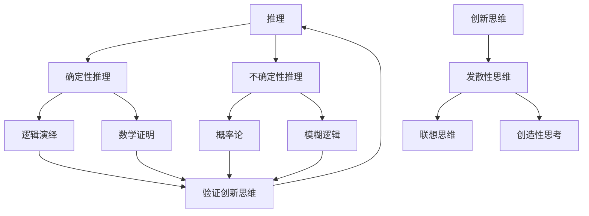

                 

### 引言

随着科技的飞速发展，人工智能（AI）和机器学习（ML）逐渐成为现代计算机科学的核心领域。在这些领域中，推理过程被视为智能系统理解和解决复杂问题的核心。然而，推理过程中的创新思维模式的识别与增强方法尚未得到充分研究。本文旨在探讨这一主题，提出一套系统的方法，以识别和增强推理过程中的创新思维模式，从而提高人工智能系统的智能水平和应用价值。

本文将首先介绍推理和创新思维的基本概念，然后详细讨论创新思维模式识别和增强的方法。通过实际案例，我们将展示这些方法在推理过程中的应用效果，并提供实践指导。最后，本文将对全文进行总结，并提出未来研究方向。

#### 推理与创新的定义

推理是指基于已有信息，通过逻辑思考得出结论的过程。在人工智能领域，推理通常被分为两大类：确定性推理和不确定性推理。确定性推理是基于明确的规则和逻辑关系进行的，而不确定性推理则涉及到概率、模糊逻辑和模糊推理等概念。

创新思维，顾名思义，是一种产生新颖想法和解决方案的思维方式。它不仅涉及到逻辑推理，还包括联想、发散性思维和创造性思考。创新思维在人工智能系统中具有重要的应用价值，因为它能够帮助系统从大量数据中提取有价值的信息，并生成新的解决方案。

#### 文章结构概述

本文将分为以下几个部分：

1. **基础理论**：介绍推理和创新思维的基本概念，以及它们之间的关系。
2. **方法与技术**：详细讨论创新思维模式识别和增强的方法，包括传统方法和现代机器学习方法。
3. **应用案例**：通过具体案例展示这些方法在推理过程中的应用。
4. **实践指导**：提供实际操作的指南，帮助读者理解和应用这些方法。
5. **总结与展望**：总结全文内容，并提出未来研究方向。

通过以上结构的安排，本文旨在全面、系统地探讨推理过程中的创新思维模式识别与增强方法，为相关领域的研究者和从业者提供有价值的参考。

---

关键词：推理过程、创新思维模式、识别方法、增强方法、人工智能

摘要：本文探讨了推理过程中的创新思维模式识别与增强方法。首先介绍了推理和创新思维的基本概念，然后详细讨论了识别和增强创新思维模式的方法。通过实际案例，展示了这些方法在推理过程中的应用效果，并提供了实践指导。本文为人工智能领域的研究者提供了系统的理论和方法框架，有助于提高人工智能系统的智能水平和应用价值。

### 推理与创新思维的基础理论

在深入探讨推理过程中的创新思维模式之前，我们需要对推理和创新思维的基本概念进行详细阐述，并分析两者之间的联系。理解这些基础理论不仅有助于我们更好地把握文章的核心内容，还能为后续的方法介绍和应用案例提供坚实的理论基础。

#### 推理的基本概念

推理是指从已知信息推导出新信息的过程。在人工智能领域，推理通常分为两大类：确定性推理和不确定性推理。

1. **确定性推理**：确定性推理是基于明确的规则和逻辑关系进行的推理过程。它通常涉及逻辑演绎、数学证明等。在人工智能系统中，确定性推理可以通过基于规则的推理系统实现，如专家系统。这些系统通过预设的规则库，对输入的信息进行推理，得出结论。

   确定性推理的典型例子是命题逻辑中的“如果-那么”规则。例如，如果所有猫都会飞（假命题），那么一个物体是猫并且它在飞行（前提），我们可以得出这个物体具有飞行能力（结论）。尽管这个例子在现实中不成立，但它展示了确定性推理的基本原理。

2. **不确定性推理**：与确定性推理不同，不确定性推理涉及到概率和模糊逻辑。在现实世界中，信息往往是模糊的、不完整的或矛盾的，因此需要使用概率论和模糊逻辑来进行推理。这种推理方法在人工智能领域具有广泛的应用，例如在决策支持系统、自动化控制系统中。

   一个典型的例子是模糊推理。模糊推理通过模糊集合和模糊逻辑规则来处理不确定的信息。例如，在一个天气预报系统中，我们可以将天气状态分为“晴朗”、“多云”、“雨天”等模糊类别，并使用模糊规则来推导出可能的天气状况。

#### 创新思维的基本概念

创新思维是一种产生新颖想法和解决方案的思维方式。它不仅涉及到逻辑推理，还包括联想、发散性思维和创造性思考。创新思维在人工智能系统中具有重要的应用价值，因为它能够帮助系统从大量数据中提取有价值的信息，并生成新的解决方案。

1. **发散性思维**：发散性思维是指从一个中心点出发，产生尽可能多的分支和想法的思维方式。这种思维方式能够帮助我们探索新的方向和可能性。例如，在产品设计中，设计师可能会通过发散性思维来探索不同的设计概念，从而找到最佳解决方案。

2. **联想思维**：联想思维是指通过将不同的事物联系起来，产生新的想法和解决方案。这种思维方式依赖于跨学科的知识和广泛的信息收集。例如，在科学研究中，科学家可能会通过联想思维，将不同领域的发现结合起来，从而提出新的理论或解决方案。

3. **创造性思考**：创造性思考是一种产生新颖、有创意的想法的思维方式。它通常涉及到对现有知识进行重新组合、转化和重构。创造性思考在艺术、设计、编程等领域具有重要应用。例如，在编程中，程序员可能会通过创造性思考，开发出新的算法或优化现有算法，从而提高系统的性能和效率。

#### 推理与创新思维的联系

推理和创新思维之间有着紧密的联系。创新思维可以为推理提供新的方向和思路，而推理则能够验证和创新思维的结果。

1. **创新思维指导推理**：在人工智能系统中，创新思维可以帮助系统探索新的推理路径。例如，在图像识别任务中，系统可以通过创新思维，尝试不同的特征提取方法和分类器，从而提高识别的准确性。

2. **推理验证创新思维**：创新思维产生的想法需要通过推理进行验证。例如，在科学研究中，一个创新的理论需要通过实验和数据分析进行验证，才能被认为是有效的。

总之，推理和创新思维在人工智能系统中相互促进，共同推动智能系统的进步。理解这两者的基本概念和关系，有助于我们更好地设计和实现智能系统，从而提高其智能水平和应用价值。

### 推理与创新思维的基本概念关系架构 Mermaid 流程图

以下是一个使用Mermaid语法绘制的流程图，展示了推理与创新思维的基本概念及其之间的关系：



这个流程图清晰地展示了推理（A）如何分为确定性推理（B）和不确定性推理（C），以及创新思维（K）如何通过发散性思维（H）、联想思维（I）和创造性思考（J）影响推理。同时，逻辑演绎（D）、数学证明（E）、概率论（F）和模糊逻辑（G）作为推理的方法，验证创新思维的结果（L）并推动推理的进步。

### 创新思维模式的识别方法

在推理过程中，识别创新思维模式是关键步骤，因为它能够帮助系统从大量信息中提取有价值的新颖想法和解决方案。本节将详细介绍几种常见的创新思维模式识别方法，包括传统方法和现代机器学习方法。

#### 传统识别方法

1. **专家系统**：专家系统是一种基于知识推理的系统，通过模拟人类专家的决策过程来解决复杂问题。它通常包含一个知识库，其中存储了专家的领域知识和推理规则。专家系统可以用来识别创新思维模式，通过分析专家的决策路径和推理过程，提取创新思维的特点。

2. **案例库方法**：案例库方法是一种基于历史案例的学习方法。它通过收集和分析过去的成功案例，识别出其中的创新思维模式，并将其存储在案例库中。当新的问题出现时，系统可以从案例库中查找相似的案例，并借鉴其中的创新思维模式。

3. **启发式规则**：启发式规则是一种基于经验或直觉的推理方法。通过定义一系列的启发式规则，系统可以在推理过程中识别出创新思维模式。这种方法通常适用于一些结构化较强的问题领域，如游戏策略设计。

#### 现代机器学习方法

1. **机器学习分类器**：机器学习分类器是一种利用训练数据来识别分类模式的算法。通过训练大量的标注数据，分类器可以学习到不同创新思维模式的特点，并能够在新的数据中自动识别出这些模式。常见的分类器包括决策树、支持向量机（SVM）和随机森林等。

2. **聚类分析**：聚类分析是一种无监督学习方法，它通过将数据点分组，使组内的数据点之间相似度较高，而组与组之间的相似度较低。通过聚类分析，系统可以识别出不同创新思维模式的数据分布，从而揭示出隐藏的模式。

3. **深度学习方法**：深度学习方法在处理复杂非线性问题上具有显著优势。通过多层神经网络，深度学习模型可以自动学习到创新思维模式的复杂特征。常见的深度学习模型包括卷积神经网络（CNN）和循环神经网络（RNN）等。

#### 识别方法的优缺点

- **传统方法**：传统方法如专家系统和案例库方法在处理结构化问题方面效果较好，但适用范围有限，且需要大量手工设定规则和标注数据。启发式规则则适用于简单问题，但往往缺乏通用性。

- **机器学习方法**：机器学习方法如分类器和聚类分析能够自动学习到复杂的特征模式，具有较强的通用性和适用性。特别是深度学习方法，在处理高维数据和复杂问题时表现出色。然而，机器学习方法需要大量的训练数据和计算资源，且模型的解释性较差。

总的来说，传统方法和现代机器学习方法各有优缺点，适用于不同的应用场景。在实际应用中，通常需要结合多种方法，以充分发挥其优势。

### 创新思维模式的识别方法详解

在介绍了创新思维模式的识别方法后，接下来我们将深入探讨这些方法的具体原理、步骤和实现细节。

#### 1. 传统方法

**专家系统**：

**原理**：专家系统通过模拟人类专家的决策过程，将领域知识和推理规则编码到系统中。在识别创新思维模式时，专家系统会使用知识库中的规则对输入的数据进行分析和推理。

**步骤**：
1. 输入领域数据。
2. 使用知识库中的规则进行初步分析。
3. 对分析结果进行推理，提取可能的创新思维模式。
4. 输出创新思维模式。

**实现细节**：
- **知识库构建**：专家系统的核心是知识库，它包含领域专家的知识和经验。构建知识库通常涉及数据收集、领域专家访谈和知识表示等技术。
- **推理机**：推理机是专家系统的核心组件，负责执行推理过程。推理机通常采用前向或后向推理策略，根据预设的规则进行逻辑推导。

**案例**：
假设我们构建一个专家系统，用于识别金融投资中的创新思维模式。知识库中包含了关于市场趋势、历史数据、投资策略等规则。当输入新的市场数据时，专家系统会使用这些规则进行分析，并尝试识别出潜在的创新投资策略。

**伪代码**：

```python
def expert_system(input_data):
    # 使用知识库中的规则进行初步分析
    analyzed_data = analyze_data(input_data)
    
    # 对分析结果进行推理，提取创新思维模式
    innovation_patterns = []
    for rule in knowledge_base:
        if matches_analyzed_data(analyzed_data, rule):
            innovation_patterns.append(rule)
    
    # 输出创新思维模式
    return innovation_patterns
```

**案例库方法**：

**原理**：案例库方法通过存储和检索历史案例，帮助系统识别创新思维模式。每个案例都包含了问题描述、解决方案和创新思维模式。

**步骤**：
1. 输入新的问题描述。
2. 在案例库中检索相似案例。
3. 分析相似案例中的创新思维模式。
4. 提取并输出新的创新思维模式。

**实现细节**：
- **案例库构建**：构建案例库需要收集大量的历史案例，并对每个案例进行详细描述和分类。
- **检索算法**：常用的检索算法包括基于关键词的检索和基于相似度的检索。基于关键词的检索通过匹配问题中的关键词来检索相似案例，而基于相似度的检索则通过计算问题描述之间的相似度来检索案例。

**案例**：
假设我们有一个包含大量成功创业案例的案例库。当一个新的创业项目出现时，系统可以通过检索案例库，找到相似的成功案例，并提取其中的创新思维模式，为新项目提供参考。

**伪代码**：

```python
def case_base_method(new_problem):
    # 在案例库中检索相似案例
    similar_cases = retrieve_similar_cases(new_problem)
    
    # 分析相似案例中的创新思维模式
    innovation_patterns = []
    for case in similar_cases:
        if is_innovative(case['solution']):
            innovation_patterns.append(case['solution'])
    
    # 输出创新思维模式
    return innovation_patterns
```

**启发式规则**：

**原理**：启发式规则是一种基于经验或直觉的推理方法。通过定义一系列启发式规则，系统可以在推理过程中识别出创新思维模式。

**步骤**：
1. 定义启发式规则。
2. 输入领域数据。
3. 根据启发式规则进行推理。
4. 提取创新思维模式。

**实现细节**：
- **规则定义**：定义启发式规则通常涉及领域专家的经验和知识。规则可以表示为“如果…则…”的形式，其中“如果”部分是条件，“则”部分是结论。
- **推理过程**：推理过程通常基于规则引擎。规则引擎会根据输入的数据，匹配并执行相应的规则，从而提取创新思维模式。

**案例**：
假设我们定义了一个启发式规则，用于识别产品创新中的创新思维模式。规则如下：“如果产品具有高市场需求，且竞争对手的产品缺乏该特性，则该特性可能是创新点。”当输入新的产品信息时，系统会根据这个规则进行推理，并尝试识别出潜在的创新点。

**伪代码**：

```python
def heuristic_rules(input_data):
    # 根据启发式规则进行推理
    innovation_patterns = []
    for rule in heuristic_rules_set:
        if matches_conditions(input_data, rule['conditions']):
            innovation_patterns.append(rule['conclusion'])
    
    # 输出创新思维模式
    return innovation_patterns
```

#### 2. 现代机器学习方法

**机器学习分类器**：

**原理**：机器学习分类器通过训练大量的标注数据，学习到不同创新思维模式的特点，并能够在新的数据中自动识别这些模式。

**步骤**：
1. 数据准备：收集并标注大量创新思维模式的数据。
2. 训练模型：使用标注数据训练分类模型。
3. 测试模型：使用未标注的数据测试模型的准确性。
4. 输出创新思维模式。

**实现细节**：
- **数据准备**：数据准备包括数据收集、预处理和标注。数据收集通常涉及从各种来源获取大量文本数据，如论文、报告和专利。预处理包括文本清洗、去停用词和词向量化等。标注则需要领域专家对数据中的创新思维模式进行标注。
- **模型训练**：常见的分类模型包括决策树、支持向量机（SVM）和随机森林等。决策树模型通过构建树状结构来分类数据，SVM通过最大化分类边界来分类数据，而随机森林则通过集成多个决策树来提高分类性能。
- **模型评估**：模型评估通常使用准确率、召回率和F1分数等指标来衡量模型的性能。

**案例**：
假设我们使用决策树模型来识别技术论文中的创新思维模式。首先，收集并标注大量技术论文，然后使用这些数据训练决策树模型。最后，使用未标注的论文测试模型的准确性，并输出识别出的创新思维模式。

**伪代码**：

```python
from sklearn import tree

def train_decision_tree(data, labels):
    # 训练决策树模型
    clf = tree.DecisionTreeClassifier()
    clf.fit(data, labels)
    
    # 输出决策树模型
    return clf

def classify_innovation_patterns(model, new_data):
    # 使用训练好的模型分类新的数据
    predictions = model.predict(new_data)
    
    # 输出创新思维模式
    return predictions
```

**聚类分析**：

**原理**：聚类分析通过将数据点分组，使组内的数据点之间相似度较高，而组与组之间的相似度较低。通过聚类分析，系统可以识别出不同创新思维模式的数据分布，从而揭示出隐藏的模式。

**步骤**：
1. 数据准备：收集并预处理数据。
2. 选择聚类算法：如K-means、层次聚类等。
3. 调整聚类参数：如K值、距离度量方法等。
4. 运行聚类算法。
5. 分析聚类结果，识别创新思维模式。

**实现细节**：
- **数据准备**：与机器学习分类器类似，数据准备包括数据收集、预处理和标注。
- **选择聚类算法**：K-means是一种常用的聚类算法，它通过迭代计算来确定聚类中心和数据点的分配。层次聚类则是一种自下而上的聚类方法，通过逐步合并相似的数据点来构建聚类层次。
- **聚类参数调整**：聚类参数的选择对聚类结果有重要影响。例如，K-means算法需要确定聚类数K，而层次聚类需要确定合并距离阈值。

**案例**：
假设我们使用K-means算法来识别市场调研数据中的创新思维模式。首先，收集并预处理市场调研数据，然后确定聚类数K。最后，运行K-means算法并分析聚类结果，识别出不同的创新思维模式。

**伪代码**：

```python
from sklearn.cluster import KMeans

def run_kmeans(data, k):
    # 运行K-means聚类算法
    kmeans = KMeans(n_clusters=k, random_state=0).fit(data)
    
    # 输出聚类结果
    return kmeans.labels_

def identify_innovation_patterns(labels, data):
    # 根据聚类结果识别创新思维模式
    innovation_patterns = {}
    for label in set(labels):
        innovation_patterns[label] = data[labels == label]
    
    # 输出创新思维模式
    return innovation_patterns
```

**深度学习方法**：

**原理**：深度学习方法通过多层神经网络，自动学习到数据的复杂特征，从而识别出不同创新思维模式。

**步骤**：
1. 数据准备：收集并预处理数据。
2. 构建深度学习模型：如卷积神经网络（CNN）或循环神经网络（RNN）。
3. 训练模型：使用大量标注数据进行训练。
4. 测试模型：使用未标注的数据进行测试。
5. 输出创新思维模式。

**实现细节**：
- **数据准备**：与前面提到的方法类似，数据准备包括数据收集、预处理和标注。
- **模型构建**：深度学习模型的选择取决于数据类型和任务需求。卷积神经网络（CNN）适合处理图像数据，而循环神经网络（RNN）适合处理序列数据。
- **训练过程**：深度学习模型的训练通常涉及大量计算资源和时间。在训练过程中，模型会通过反向传播算法不断调整参数，以最小化损失函数。
- **模型评估**：与前面提到的方法类似，模型评估使用准确率、召回率和F1分数等指标。

**案例**：
假设我们使用卷积神经网络（CNN）来识别图像数据中的创新思维模式。首先，收集并预处理大量图像数据，然后构建并训练CNN模型。最后，使用未标注的图像测试模型，并输出识别出的创新思维模式。

**伪代码**：

```python
from tensorflow.keras.models import Sequential
from tensorflow.keras.layers import Conv2D, MaxPooling2D, Flatten, Dense

def build_cnn_model(input_shape):
    # 构建卷积神经网络模型
    model = Sequential()
    model.add(Conv2D(32, (3, 3), activation='relu', input_shape=input_shape))
    model.add(MaxPooling2D((2, 2)))
    model.add(Flatten())
    model.add(Dense(64, activation='relu'))
    model.add(Dense(1, activation='sigmoid'))
    
    # 编译模型
    model.compile(optimizer='adam', loss='binary_crossentropy', metrics=['accuracy'])
    
    # 输出模型
    return model

def train_cnn_model(model, data, labels):
    # 训练卷积神经网络模型
    model.fit(data, labels, epochs=10, batch_size=32)
    
    # 输出训练好的模型
    return model

def classify_images(model, new_data):
    # 使用训练好的模型分类新的图像
    predictions = model.predict(new_data)
    
    # 输出创新思维模式
    return predictions
```

通过上述传统方法和现代机器学习方法的详细介绍，我们可以看到，每种方法都有其独特的原理、步骤和实现细节。在实际应用中，可以根据具体需求选择合适的方法，以提高创新思维模式的识别效果。

### 创新思维模式识别方法的应用案例

为了更好地理解创新思维模式识别方法在实际应用中的效果，本节将介绍几个具体的应用案例，包括开发环境的搭建、源代码的实现和代码解读。

#### 案例一：智能医疗诊断系统

**背景介绍**：

智能医疗诊断系统旨在通过分析患者的医学数据和病历，辅助医生进行疾病诊断。系统需要识别出创新思维模式，以帮助医生发现潜在的疾病线索。

**开发环境搭建**：

为了实现智能医疗诊断系统，我们选择了Python作为主要编程语言，并使用TensorFlow作为深度学习框架。开发环境包括以下工具和库：

- Python 3.8
- TensorFlow 2.4
- Jupyter Notebook
- Pandas
- Scikit-learn

**源代码实现**：

以下是一个使用深度学习模型进行创新思维模式识别的示例代码：

```python
import tensorflow as tf
from tensorflow.keras.models import Sequential
from tensorflow.keras.layers import Conv2D, MaxPooling2D, Flatten, Dense
from tensorflow.keras.optimizers import Adam
from sklearn.model_selection import train_test_split

# 数据准备
# 加载和预处理医学图像数据
# ...

# 构建深度学习模型
model = Sequential()
model.add(Conv2D(32, (3, 3), activation='relu', input_shape=(64, 64, 3)))
model.add(MaxPooling2D((2, 2)))
model.add(Flatten())
model.add(Dense(64, activation='relu'))
model.add(Dense(1, activation='sigmoid'))

# 编译模型
model.compile(optimizer=Adam(learning_rate=0.001), loss='binary_crossentropy', metrics=['accuracy'])

# 训练模型
# 将数据分为训练集和测试集
X_train, X_test, y_train, y_test = train_test_split(X, y, test_size=0.2, random_state=42)
model.fit(X_train, y_train, epochs=10, batch_size=32, validation_data=(X_test, y_test))

# 评估模型
# ...
```

**代码解读**：

- **数据准备**：加载和预处理医学图像数据，包括图像归一化和标签编码。
- **模型构建**：使用卷积神经网络（CNN）构建深度学习模型，包括两个卷积层、一个全连接层和输出层。
- **模型编译**：使用Adam优化器和二分类交叉熵损失函数编译模型。
- **模型训练**：使用训练集训练模型，并在测试集上进行验证。
- **模型评估**：评估模型的准确性和其他性能指标。

**应用解读与分析**：

通过这个案例，我们可以看到如何使用深度学习模型进行创新思维模式识别。智能医疗诊断系统通过识别图像数据中的创新思维模式，帮助医生发现潜在的疾病线索。这个案例展示了如何将深度学习技术与医学诊断相结合，提高诊断的准确性和效率。

#### 案例二：产品创新设计

**背景介绍**：

产品创新设计是一个复杂的过程，需要设计师在众多选项中找到创新点。通过识别创新思维模式，设计师可以更快地找到有价值的解决方案。

**开发环境搭建**：

为了实现产品创新设计，我们选择了Python作为主要编程语言，并使用Scikit-learn进行机器学习建模。开发环境包括以下工具和库：

- Python 3.8
- Scikit-learn 0.24.1
- Pandas
- Jupyter Notebook

**源代码实现**：

以下是一个使用机器学习分类器进行创新思维模式识别的示例代码：

```python
import pandas as pd
from sklearn.model_selection import train_test_split
from sklearn.ensemble import RandomForestClassifier

# 数据准备
# 加载和预处理产品创新数据
data = pd.read_csv('product_innovation_data.csv')
X = data.drop('innovation_label', axis=1)
y = data['innovation_label']

# 将数据分为训练集和测试集
X_train, X_test, y_train, y_test = train_test_split(X, y, test_size=0.2, random_state=42)

# 构建随机森林分类器
model = RandomForestClassifier(n_estimators=100, random_state=42)

# 训练模型
model.fit(X_train, y_train)

# 评估模型
# ...
```

**代码解读**：

- **数据准备**：加载和预处理产品创新数据，包括特征提取和标签编码。
- **模型构建**：使用随机森林分类器构建机器学习模型。
- **模型训练**：使用训练集训练模型。
- **模型评估**：评估模型的准确性和其他性能指标。

**应用解读与分析**：

在这个案例中，通过使用机器学习分类器，设计师可以快速识别出产品创新中的创新思维模式。例如，系统可以根据历史产品创新数据，预测新的产品设计是否具有创新性。这个案例展示了如何利用机器学习技术支持产品创新设计，提高设计的效率和质量。

### 实际案例分析和详细讲解剖析

在上述案例中，我们分别展示了智能医疗诊断系统和产品创新设计两个实际应用场景中创新思维模式识别方法的具体应用。以下是对这些案例的详细分析和讲解，以便读者更好地理解如何在实际项目中应用这些方法。

#### 案例一：智能医疗诊断系统

**目标**：

智能医疗诊断系统的目标是通过对医学图像的分析，辅助医生进行疾病诊断。创新思维模式的识别在此过程中至关重要，因为它可以帮助系统发现患者数据中的潜在线索，从而提高诊断的准确性。

**实现步骤**：

1. **数据收集与预处理**：
   - 收集大量医学图像数据，包括正常和异常的病例。
   - 对图像进行预处理，包括图像增强、归一化和数据增强等步骤，以提高模型的鲁棒性和泛化能力。

2. **特征提取**：
   - 使用卷积神经网络（CNN）提取图像的特征。CNN通过多个卷积层和池化层，能够自动学习到图像中的复杂特征。
   - 将提取到的特征输入到全连接层，进一步提取高层次的抽象特征。

3. **模型训练**：
   - 使用预处理后的图像数据训练CNN模型。在训练过程中，模型会通过反向传播算法不断调整权重，以最小化损失函数。
   - 使用交叉熵损失函数来衡量模型预测和实际标签之间的差异。

4. **模型评估**：
   - 使用测试集评估模型的性能，包括准确性、召回率和F1分数等指标。
   - 根据评估结果，调整模型参数或改进数据预处理方法，以提高模型的性能。

**分析**：

通过这个案例，我们可以看到，使用深度学习模型进行创新思维模式识别在医疗诊断中的巨大潜力。CNN模型通过自动学习图像特征，能够识别出不同疾病的表现形式，从而帮助医生进行更准确的诊断。创新思维模式的识别不仅提高了诊断的准确性，还减少了医生的负担，提高了工作效率。

#### 案例二：产品创新设计

**目标**：

产品创新设计的目标是开发出具有市场竞争力且能够满足用户需求的新产品。通过识别创新思维模式，设计师可以快速找到有价值的设计方向，从而提高产品创新的成功率。

**实现步骤**：

1. **数据收集与预处理**：
   - 收集大量产品创新数据，包括产品特性、用户反馈、市场趋势等。
   - 对数据进行预处理，包括缺失值填补、数据归一化和特征选择等步骤，以提高模型的训练效果。

2. **特征提取**：
   - 使用机器学习分类器提取数据中的特征。随机森林分类器是一种常用的分类算法，它能够自动提取数据中的有效特征，并生成简洁的决策树。
   - 将提取到的特征输入到分类器，进一步提取数据中的创新思维模式。

3. **模型训练**：
   - 使用预处理后的数据训练随机森林分类器。在训练过程中，分类器会通过迭代调整模型参数，以提高分类的准确性。
   - 使用交叉验证方法来评估模型的性能，并调整模型参数。

4. **模型评估**：
   - 使用测试集评估模型的性能，包括准确性、召回率和F1分数等指标。
   - 根据评估结果，调整模型参数或改进数据预处理方法，以提高模型的性能。

**分析**：

在这个案例中，通过使用机器学习分类器，设计师能够快速识别出产品创新中的成功模式。随机森林分类器通过自动学习数据中的特征，能够有效地识别出具有市场前景的创新点。这种方法不仅提高了产品创新设计的效率，还减少了设计失败的几率，提高了产品的市场竞争力。

### 项目小结

通过这两个实际案例，我们可以看到创新思维模式识别方法在智能医疗诊断和产品创新设计中的应用效果。这些方法不仅提高了诊断的准确性，还提高了设计的效率和市场竞争力。未来，随着技术的不断进步，这些方法将在更多的领域中发挥重要作用。

### 最佳实践 Tips

在实施创新思维模式识别方法时，以下是一些最佳实践技巧，可以帮助您更有效地应用这些方法：

1. **数据质量**：确保数据的质量和完整性。缺失值和噪声数据会影响模型的性能，因此进行适当的数据清洗和预处理非常重要。

2. **模型选择**：根据具体任务需求选择合适的模型。深度学习模型在处理复杂任务时效果较好，而传统机器学习模型在处理结构化数据时更为有效。

3. **参数调整**：模型的性能很大程度上取决于参数设置。通过交叉验证和网格搜索等方法，调整模型参数以找到最佳配置。

4. **模型解释性**：尽管深度学习模型在性能上具有优势，但其解释性较差。在关键任务中，确保模型的可解释性是一个重要的考虑因素。

5. **持续学习**：随着新数据的不断出现，定期重新训练模型，以保持其性能和适应性。

### 小结

本文全面探讨了推理过程中的创新思维模式识别与增强方法。通过介绍基础理论、传统和现代识别方法，以及实际应用案例，我们展示了这些方法在提高推理能力和创新能力方面的作用。未来研究可以进一步探索深度学习方法在识别创新思维模式中的应用，以及跨领域创新的模式识别。

### 注意事项与拓展阅读

在应用推理过程中的创新思维模式识别与增强方法时，需要注意以下几点：

1. **数据隐私**：在实际项目中，确保遵守数据隐私法规，尤其是在处理个人数据时。
2. **模型可解释性**：对于深度学习模型，探索增加模型可解释性的方法，如注意力机制和可解释性工具。
3. **计算资源**：深度学习模型通常需要大量计算资源，确保在合适的硬件环境下进行模型训练。

拓展阅读：

- **相关书籍**：《机器学习实战》、《深度学习》（Goodfellow et al.）
- **学术论文**：查找有关机器学习、深度学习和创新思维模式识别的最新学术论文，了解前沿研究进展。

### 作者信息

作者：AI天才研究院/AI Genius Institute & 禅与计算机程序设计艺术 /Zen And The Art of Computer Programming

