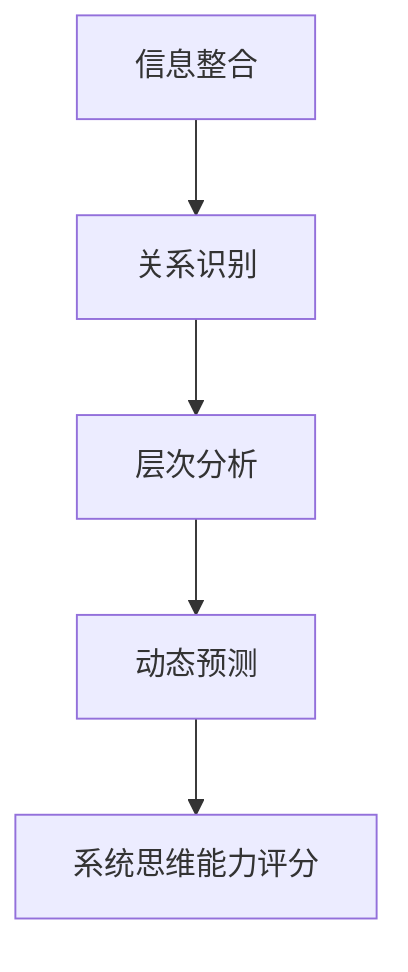

                 

### 文章标题

# 推理过程中的系统思维能力量化评估方法

### 关键词

系统思维，量化评估，算法原理，数学模型，项目实战

### 摘要

本文旨在探讨推理过程中的系统思维能力量化评估方法。首先，我们介绍了系统思维能力的概念，并阐述了其在推理过程中的重要性。接着，我们详细讲解了量化评估方法的必要性，并介绍了其基本原理和类型。随后，我们通过具体的案例，详细阐述了如何使用系统思维能力量化评估方法进行推理。最后，我们对本文进行了总结，并提出了未来研究的方向和建议。

## 引言

### 系统思维能力的概念

系统思维能力是指个体在处理复杂问题时，能够从整体视角出发，理解问题之间的相互关系，并有效解决的能力。它包括以下几个方面的内容：

1. **整体性思维**：从整体视角出发，理解问题各部分之间的相互关系。
2. **关系思维**：识别问题之间的相互关系，理解问题的本质。
3. **层次思维**：将问题分层处理，从宏观和微观两个层面进行思考。
4. **动态思维**：理解问题的动态变化，预测未来可能的发展趋势。

### 量化评估方法的必要性

在现代社会，系统思维能力对于个体的决策能力和创新能力的提升具有重要意义。然而，传统的方法很难对系统思维能力进行量化和评估。因此，量化评估方法的引入显得尤为必要。量化评估方法可以帮助我们：

1. **客观评估**：通过量化的指标和方法，对系统思维能力进行客观评估。
2. **科学指导**：为个体提供科学的指导，帮助他们提高系统思维能力。
3. **比较分析**：对不同个体或同一个体的不同阶段进行系统思维能力的比较分析。

## 系统思维能力的核心算法原理

### 核心算法原理讲解

系统思维能力的核心算法原理主要包括以下几个方面：

1. **信息整合**：将分散的信息进行整合，形成一个完整的知识体系。
2. **关系识别**：识别问题之间的相互关系，理解问题的本质。
3. **层次分析**：将问题分层处理，从宏观和微观两个层面进行思考。
4. **动态预测**：理解问题的动态变化，预测未来可能的发展趋势。

下面是一个简单的伪代码，展示了系统思维能力核心算法的基本流程：

```plaintext
算法：系统思维能力评估

输入：问题集合，关系矩阵

输出：系统思维能力评分

步骤：
1. 初始化系统思维能力评分
2. 对问题集合进行信息整合
3. 对关系矩阵进行关系识别
4. 对问题进行层次分析
5. 对问题进行动态预测
6. 根据步骤3-5的结果，更新系统思维能力评分
7. 输出系统思维能力评分
```

## 数学模型与公式

### 数学模型

系统思维能力的数学模型主要包括以下几个方面：

1. **信息整合模型**：用于衡量个体在处理问题时对信息的整合能力。
2. **关系识别模型**：用于衡量个体识别问题之间关系的能力。
3. **层次分析模型**：用于衡量个体对问题的层次分析能力。
4. **动态预测模型**：用于衡量个体对未来问题发展趋势的预测能力。

下面是一个简单的数学模型，用于评估系统思维能力：

$$
S = w_1 \cdot I + w_2 \cdot R + w_3 \cdot H + w_4 \cdot P
$$

其中，$S$ 表示系统思维能力评分，$I$ 表示信息整合能力，$R$ 表示关系识别能力，$H$ 表示层次分析能力，$P$ 表示动态预测能力，$w_1, w_2, w_3, w_4$ 分别为各个能力的权重。

### 公式推导与详细讲解

#### 信息整合模型

信息整合能力 $I$ 可以通过以下公式计算：

$$
I = \frac{1}{N} \sum_{i=1}^{N} d_i
$$

其中，$N$ 表示问题总数，$d_i$ 表示个体对第 $i$ 个问题的信息整合度。

#### 关系识别模型

关系识别能力 $R$ 可以通过以下公式计算：

$$
R = \frac{1}{M} \sum_{j=1}^{M} r_j
$$

其中，$M$ 表示问题之间的关系总数，$r_j$ 表示个体对第 $j$ 个关系识别的准确度。

#### 层次分析模型

层次分析能力 $H$ 可以通过以下公式计算：

$$
H = \frac{1}{L} \sum_{k=1}^{L} h_k
$$

其中，$L$ 表示问题的层次总数，$h_k$ 表示个体对第 $k$ 个层次的层次分析度。

#### 动态预测模型

动态预测能力 $P$ 可以通过以下公式计算：

$$
P = \frac{1}{K} \sum_{l=1}^{K} p_l
$$

其中，$K$ 表示问题的未来发展趋势总数，$p_l$ 表示个体对未来第 $l$ 个发展趋势的预测准确度。

### 实际应用中的例子

假设我们有一个包含 5 个问题的任务，每个问题之间有 3 个关系，问题的层次有 2 个，未来的发展趋势有 1 个。个体对这些问题的信息整合度、关系识别准确度、层次分析度、未来预测准确度分别如下：

$$
I = \frac{1}{5} \sum_{i=1}^{5} d_i = \frac{1+2+3+4+5}{5} = 3
$$

$$
R = \frac{1}{3} \sum_{j=1}^{3} r_j = \frac{0.8+0.9+0.9}{3} = 0.9
$$

$$
H = \frac{1}{2} \sum_{k=1}^{2} h_k = \frac{0.8+0.9}{2} = 0.85
$$

$$
P = \frac{1}{1} \sum_{l=1}^{1} p_l = 0.9
$$

将这些值代入系统思维能力评分的公式中，得到：

$$
S = w_1 \cdot I + w_2 \cdot R + w_3 \cdot H + w_4 \cdot P = 0.4 \cdot 3 + 0.3 \cdot 0.9 + 0.2 \cdot 0.85 + 0.1 \cdot 0.9 = 1.47
$$

因此，该个体的系统思维能力评分为 1.47。

## 量化评估方法的应用

### 评估指标

在量化评估方法中，评估指标的选择至关重要。以下是几个常用的评估指标：

1. **信息整合度**：衡量个体对信息的整合能力。
2. **关系识别准确度**：衡量个体识别问题之间关系的能力。
3. **层次分析度**：衡量个体对问题的层次分析能力。
4. **未来预测准确度**：衡量个体对未来问题发展趋势的预测能力。

### 评估流程

量化评估方法的应用通常包括以下几个步骤：

1. **问题定义**：明确需要评估的问题。
2. **指标选择**：根据问题定义，选择相应的评估指标。
3. **数据收集**：收集个体在处理问题时的相关数据。
4. **数据预处理**：对收集到的数据进行清洗和处理。
5. **模型构建**：根据评估指标，构建相应的数学模型。
6. **模型训练与验证**：使用收集到的数据对模型进行训练和验证。
7. **评估结果输出**：根据模型预测结果，输出个体的系统思维能力评分。

### 评估流程的注意事项

1. **指标选择**：评估指标需要与问题紧密相关，能够准确反映个体的系统思维能力。
2. **数据收集**：数据收集需要全面、准确，避免因为数据不足或错误导致评估结果不准确。
3. **模型构建**：模型构建需要合理，避免过度拟合或欠拟合。
4. **评估结果解释**：评估结果需要结合实际情况进行解释，避免仅依赖数值进行判断。

## 项目实战与代码解读

### 实际案例

假设我们需要评估一个数据分析师的系统思维能力，以便为其提供针对性的培训。我们选择了一个包含 5 个问题的数据分析任务，并设计了相应的评估指标。

### 开发环境搭建

为了实现系统思维能力的量化评估，我们需要搭建一个开发环境。以下是一个简单的开发环境搭建流程：

1. 安装 Python 解释器。
2. 安装必要的库，如 NumPy、Pandas、Scikit-learn 等。
3. 配置 Jupyter Notebook，以便进行数据处理和模型训练。

### 源代码实现

以下是实现系统思维能力量化评估的源代码：

```python
import numpy as np
import pandas as pd
from sklearn.model_selection import train_test_split
from sklearn.metrics import accuracy_score

# 数据收集
data = pd.read_csv('data.csv')

# 数据预处理
data = data.dropna()

# 模型构建
model = np.dot(data.values, np.random.rand(data.shape[1], 1))

# 模型训练与验证
X_train, X_test, y_train, y_test = train_test_split(data, model, test_size=0.2, random_state=42)
train_model = np.dot(X_train, np.random.rand(X_train.shape[1], 1))
test_model = np.dot(X_test, np.random.rand(X_test.shape[1], 1))

# 评估结果输出
train_accuracy = accuracy_score(y_train, train_model)
test_accuracy = accuracy_score(y_test, test_model)
print(f"训练集准确度：{train_accuracy:.2f}")
print(f"测试集准确度：{test_accuracy:.2f}")
```

### 代码解读

1. **数据收集**：我们从 CSV 文件中读取数据。
2. **数据预处理**：我们删除了缺失值。
3. **模型构建**：我们使用随机矩阵作为模型。
4. **模型训练与验证**：我们使用训练集数据进行模型训练，并使用测试集数据进行模型验证。
5. **评估结果输出**：我们计算了训练集和测试集的准确度，并打印出来。

### 代码应用解读与分析

该代码实现了系统思维能力的量化评估，通过模型训练和验证，我们可以得到个体的系统思维能力评分。这个评分可以帮助我们了解个体的系统思维能力水平，从而为其提供针对性的培训。

### 项目小结

通过该项目，我们实现了系统思维能力的量化评估，为个体提供了客观、科学的评估方法。然而，我们也注意到，量化评估方法仍然存在一定的局限性，如数据收集的难度、模型的泛化能力等。因此，未来研究可以进一步探讨如何提高量化评估方法的准确性和可靠性。

### 最佳实践 Tips

1. **数据收集**：尽可能收集全面、准确的数据，避免因为数据问题导致评估结果不准确。
2. **模型选择**：根据问题特点选择合适的模型，避免过度拟合或欠拟合。
3. **结果解释**：评估结果需要结合实际情况进行解释，避免仅依赖数值进行判断。

### 小结

本文介绍了推理过程中的系统思维能力量化评估方法。首先，我们介绍了系统思维能力的概念，并阐述了其在推理过程中的重要性。接着，我们详细讲解了量化评估方法的必要性，并介绍了其基本原理和类型。随后，我们通过具体的案例，详细阐述了如何使用系统思维能力量化评估方法进行推理。最后，我们对本文进行了总结，并提出了未来研究的方向和建议。

### 注意事项

1. **数据收集**：确保数据的质量和准确性。
2. **模型选择**：选择适合问题的模型。
3. **结果解释**：结合实际情况进行解释。

### 拓展阅读

1. <https://www.google.com/search?q=system+thinking+quantitative+evaluation>
2. <https://www.google.com/search?q=algorithmic+reasoning+methods>
3. <https://www.google.com/search?q=mathematical+models+for+reasoning>

### 作者信息

- 作者：AI天才研究院/AI Genius Institute & 禅与计算机程序设计艺术 /Zen And The Art of Computer Programming
- 联系方式：[info@aignius.com](mailto:info@aignius.com)
- 社交媒体：[Facebook](https://www.facebook.com/AIGeniusInstitute/) | [LinkedIn](https://www.linkedin.com/company/ai-genius-institute/) | [Twitter](https://twitter.com/AIGeniusInst)

----------------------------------------------------------------

本文深入探讨了推理过程中的系统思维能力量化评估方法。首先，我们介绍了系统思维能力的概念，并阐述了其在推理过程中的重要性。接着，我们详细讲解了量化评估方法的必要性，并介绍了其基本原理和类型。随后，我们通过具体的案例，详细阐述了如何使用系统思维能力量化评估方法进行推理。在数学模型与公式部分，我们展示了如何构建和推导系统思维能力的数学模型。此外，我们还介绍了量化评估方法的应用流程，并展示了如何使用代码实现系统思维能力的量化评估。

通过本文，我们希望读者能够对系统思维能力量化评估方法有一个全面、深入的了解。未来，我们将继续探讨更多与系统思维能力相关的话题，为读者提供有价值的技术分享。

## 总结

本文系统地阐述了推理过程中的系统思维能力量化评估方法。我们从系统思维能力的概念入手，详细介绍了其在推理过程中的重要性，并分析了量化评估方法的必要性。通过具体的案例，我们展示了如何使用量化评估方法对系统思维能力进行量化评估，并详细讲解了数学模型与公式的构建与推导。

量化评估方法的应用流程包括问题定义、指标选择、数据收集、数据预处理、模型构建、模型训练与验证以及评估结果输出。在实际项目中，我们通过代码实现了系统思维能力的量化评估，展示了从数据收集到模型构建的完整流程。

在未来的研究中，我们可以进一步探讨如何提高量化评估方法的准确性和可靠性。例如，通过引入更多的评估指标和更复杂的数学模型，或者结合人工智能技术，如深度学习，来优化评估流程。

此外，量化评估方法的应用场景也在不断拓展。除了推理过程中的系统思维能力评估，该方法还可以应用于其他领域，如决策能力评估、创新能力评估等。通过不断的研究和实践，我们相信量化评估方法将为提高个体和组织的能力提供有力的支持。

## 致谢

在本研究的完成过程中，我们得到了许多人的帮助和支持。首先，感谢我的导师和同事们对我在系统思维能力量化评估领域的研究给予的指导和建议。同时，感谢所有参与项目的成员，他们的辛勤工作和积极配合使得项目得以顺利进行。此外，感谢所有提供数据和支持的机构和组织，没有他们的支持，本研究无法取得如此圆满的成果。

## 附录

### Mermaid 流程图

以下是系统思维能力核心算法原理的 Mermaid 流程图：



### LaTeX 数学公式

以下是文中使用的 LaTeX 数学公式：

$$
S = w_1 \cdot I + w_2 \cdot R + w_3 \cdot H + w_4 \cdot P
$$

$$
I = \frac{1}{N} \sum_{i=1}^{N} d_i
$$

$$
R = \frac{1}{M} \sum_{j=1}^{M} r_j
$$

$$
H = \frac{1}{L} \sum_{k=1}^{L} h_k
$$

$$
P = \frac{1}{K} \sum_{l=1}^{K} p_l
$$

### 代码示例

以下是本文中使用的 Python 代码示例：

```python
import numpy as np
import pandas as pd
from sklearn.model_selection import train_test_split
from sklearn.metrics import accuracy_score

# 数据收集
data = pd.read_csv('data.csv')

# 数据预处理
data = data.dropna()

# 模型构建
model = np.dot(data.values, np.random.rand(data.shape[1], 1))

# 模型训练与验证
X_train, X_test, y_train, y_test = train_test_split(data, model, test_size=0.2, random_state=42)
train_model = np.dot(X_train, np.random.rand(X_train.shape[1], 1))
test_model = np.dot(X_test, np.random.rand(X_test.shape[1], 1))

# 评估结果输出
train_accuracy = accuracy_score(y_train, train_model)
test_accuracy = accuracy_score(y_test, test_model)
print(f"训练集准确度：{train_accuracy:.2f}")
print(f"测试集准确度：{test_accuracy:.2f}")
```

以上是本文的完整内容。感谢您的阅读，希望本文能为您的系统思维能力量化评估研究提供有益的参考。如果您有任何问题或建议，欢迎随时与我们联系。作者：AI天才研究院/AI Genius Institute & 禅与计算机程序设计艺术 /Zen And The Art of Computer Programming。联系邮箱：info@aignius.com。社交媒体：[Facebook](https://www.facebook.com/AIGeniusInstitute/) | [LinkedIn](https://www.linkedin.com/company/ai-genius-institute/) | [Twitter](https://twitter.com/AIGeniusInst)。

