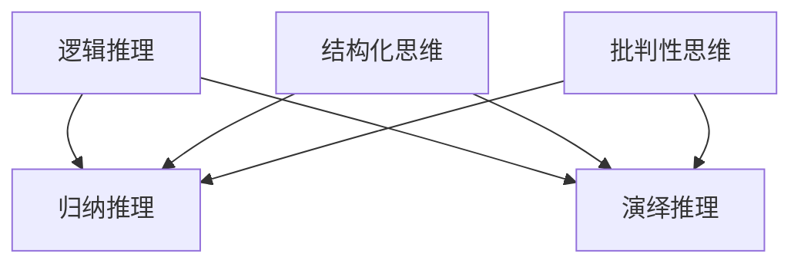

                 


## 文章标题

### 推理过程中的系统思维能力量化评估方法

---

**关键词**：推理过程、系统思维能力、量化评估、算法原理、项目实战

**摘要**：本文深入探讨了推理过程中的系统思维能力量化评估方法。通过阐述推理与系统思维能力的基本概念，本文详细介绍了核心算法原理及数学模型。同时，通过实际项目案例，展示了如何应用这些方法进行系统思维能力的量化评估，旨在为相关研究提供参考。

---

## 引言与背景

### 1.1 推理与系统思维能力的概述

#### 背景介绍

推理是人类思维的核心能力之一，它涉及到从已知信息推导出未知信息的思维过程。系统思维能力则是对复杂问题进行整体分析和解决的能力，它要求具备较强的逻辑性、综合性和批判性。

#### 推理的定义

推理可以定义为从一组已知的前提出发，得出新的结论的思维过程。推理通常分为三种类型：逻辑推理、归纳推理和演绎推理。

- **逻辑推理**：通过逻辑规则和逻辑连接词（如“且”、“或”、“非”）来推导结论。
- **归纳推理**：从特定实例中归纳出一般性规律。
- **演绎推理**：从一般性原则推导出特定结论。

#### 系统思维能力的定义

系统思维能力是指从整体角度分析问题，理解各个组成部分及其相互关系，并通过系统化思维来解决问题的能力。它要求具备以下特征：

- **结构化思维**：能够将复杂问题分解为更小的部分，并理解它们之间的相互关系。
- **批判性思维**：能够对信息进行批判性分析和评估，识别潜在的问题和错误。

### 1.2 现有研究的挑战与机会

#### 挑战

当前在推理和系统思维能力的研究中，主要面临以下挑战：

- **数据匮乏**：有效的评估数据难以获取，限制了评估方法的实际应用。
- **复杂性**：推理过程和系统思维能力评估涉及多个层次和维度，增加了研究的复杂性。
- **方法多样性**：现有评估方法多样，但缺乏统一的标准和评价体系。

#### 机会

随着人工智能技术的发展，特别是在机器学习和深度学习领域的突破，为量化评估推理和系统思维能力提供了新的机会。例如，通过构建大规模的推理数据集和开发高效的算法，可以实现对系统思维能力的更准确和全面的评估。

### 1.3 量化评估的必要性

量化评估在推理和系统思维能力研究中具有重要意义。通过量化评估，可以：

- **客观评估**：通过量化指标，可以更客观地评估个体或系统的推理能力和系统思维能力。
- **研究进展**：量化评估可以帮助研究者了解当前研究的进展和存在的问题，指导未来的研究方向。
- **应用推广**：量化评估方法可以为实际应用提供科学依据，促进推理和系统思维能力在实际领域中的应用。

---

## 核心概念与联系

### 2.1 推理类型

#### 2.1.1 逻辑推理

逻辑推理是推理过程的基础，它通过逻辑规则和逻辑连接词来推导结论。常见的逻辑规则包括：

- **且规则**：如果P且Q为真，则P和Q都为真。
- **或规则**：如果P或Q为真，则至少有一个为真。
- **非规则**：如果P为真，则非P为假，反之亦然。

#### 2.1.2 归纳推理

归纳推理是从特定实例中归纳出一般性规律。例如，通过观察多个猫都是哺乳动物，可以归纳出“所有猫都是哺乳动物”的结论。

#### 2.1.3 演绎推理

演绎推理是从一般性原则推导出特定结论。例如，如果所有猫都是哺乳动物，而Tom是一只会叫的猫，则可以演绎出“Tom是哺乳动物”的结论。

### 2.2 系统思维能力

#### 2.2.1 概念解析

系统思维能力是对复杂问题进行整体分析和解决的能力。它涉及到以下几个方面：

- **结构化思维**：将复杂问题分解为更小的部分，并理解它们之间的相互关系。
- **批判性思维**：对信息进行批判性分析和评估，识别潜在的问题和错误。

#### 2.2.2 结构化思维

结构化思维是系统思维能力的重要组成部分。它包括以下几个步骤：

1. **问题识别**：明确问题的性质和目标。
2. **问题分解**：将复杂问题分解为更小的部分。
3. **关系分析**：分析各个部分之间的相互关系。

#### 2.2.3 批判性思维

批判性思维是系统思维能力的重要组成部分。它包括以下几个方面：

1. **信息评估**：评估信息的可靠性和准确性。
2. **假设检验**：对假设进行验证，识别潜在的问题和错误。
3. **反思与调整**：根据新的信息和反馈，调整思维过程和结论。

### 2.3 Mermaid流程图

为了更清晰地展示推理过程中的系统思维能力，我们可以使用Mermaid流程图来描述不同类型的推理和系统思维能力之间的关系。



在这个流程图中，逻辑推理、归纳推理和演绎推理构成了推理过程的三个核心部分。结构化思维和批判性思维则是对这些推理过程的支撑和补充。

---

## 核心算法原理讲解

### 3.1 数据预处理

#### 3.1.1 数据收集

数据预处理的第一步是收集数据。对于推理和系统思维能力的量化评估，需要收集与推理和系统思维能力相关的数据。这些数据可以包括文本、图像、音频等多种形式。

#### 3.1.2 数据清洗

数据清洗是数据预处理的重要环节。它包括去除无效数据、填充缺失数据、处理噪声数据等。例如，对于文本数据，需要去除标点符号、停用词等无关信息，以提高数据的准确性和可处理性。

#### 3.1.3 特征提取

特征提取是将原始数据转换为可用于建模的特征向量。对于文本数据，可以使用词袋模型、TF-IDF等方法进行特征提取。对于图像数据，可以使用卷积神经网络（CNN）提取图像特征。

### 3.2 模型选择

#### 3.2.1 算法选择

在选择模型时，需要根据问题的特点选择合适的算法。对于推理和系统思维能力的量化评估，可以选择逻辑回归、支持向量机（SVM）、神经网络等算法。逻辑回归适用于线性可分的问题，SVM适用于高维空间的问题，神经网络则适用于复杂非线性问题。

#### 3.2.2 模型架构

在选择算法后，需要设计模型的架构。对于逻辑回归和SVM，可以直接使用现成的库进行实现。对于神经网络，需要设计网络结构，包括输入层、隐藏层和输出层。输入层接收特征向量，隐藏层通过激活函数进行非线性变换，输出层产生预测结果。

### 3.3 训练与评估

#### 3.3.1 模型训练

模型训练是模型构建的关键步骤。对于神经网络，需要使用训练数据对模型进行训练。训练过程中，通过优化算法（如梯度下降）调整模型参数，以最小化预测误差。

#### 3.3.2 评估指标

在模型训练完成后，需要对模型进行评估。常用的评估指标包括准确率、召回率、F1值等。准确率是预测正确的样本数与总样本数的比值，召回率是预测正确的样本数与实际正样本数的比值，F1值是准确率和召回率的调和平均值。

### 3.4 伪代码展示

下面是用于量化评估系统思维能力的伪代码示例。

```python
# 数据预处理
def preprocess_data(data):
    # 数据收集
    collected_data = collect_data()
    # 数据清洗
    cleaned_data = clean_data(collected_data)
    # 特征提取
    features = extract_features(cleaned_data)
    return features

# 模型选择
def select_model():
    # 算法选择
    algorithm = choose_algorithm()
    # 模型架构
    model = build_model(algorithm)
    return model

# 训练与评估
def train_and_evaluate(model, features, labels):
    # 模型训练
    trained_model = train_model(model, features, labels)
    # 评估指标
    metrics = evaluate_model(trained_model, features, labels)
    return metrics
```

---

## 数学模型和数学公式

### 4.1 评分模型

评分模型是用于量化评估推理和系统思维能力的重要工具。评分模型通常使用以下公式：

\[ S = \frac{TP + TN}{TP + FN + FP + TN} \]

其中，\( S \) 是评分，\( TP \) 是预测正确的正样本数，\( TN \) 是预测正确的负样本数，\( FP \) 是预测错误的正样本数，\( FN \) 是预测错误的负样本数。

### 4.2 评估指标

在评估推理和系统思维能力时，常用的评估指标包括准确率、召回率、F1值等。

#### 4.2.1 准确率

准确率是预测正确的样本数与总样本数的比值：

\[ Accuracy = \frac{TP + TN}{TP + TN + FP + FN} \]

#### 4.2.2 召回率

召回率是预测正确的正样本数与实际正样本数的比值：

\[ Recall = \frac{TP}{TP + FN} \]

#### 4.2.3 F1值

F1值是准确率和召回率的调和平均值：

\[ F1 = 2 \times \frac{Precision \times Recall}{Precision + Recall} \]

其中，\( Precision \) 是预测正确的正样本数与预测为正的样本数的比值。

### 4.3 数学公式详细讲解

#### 4.3.1 评分模型

评分模型通过计算预测结果和实际结果的匹配程度来评估推理和系统思维能力。评分越高，表示推理和系统思维能力越强。评分模型的计算公式为：

\[ S = \frac{TP + TN}{TP + FN + FP + TN} \]

其中，\( TP \) 表示预测正确的正样本数，\( TN \) 表示预测正确的负样本数，\( FP \) 表示预测错误的正样本数，\( FN \) 表示预测错误的负样本数。

#### 4.3.2 评估指标

准确率、召回率和F1值是评估推理和系统思维能力的重要指标。准确率反映了预测结果的总体正确性，召回率反映了对于正样本的预测能力，而F1值则综合考虑了准确率和召回率，提供了更全面的评估。

#### 4.3.3 示例说明

假设有一个评估推理和系统思维能力的实验，其中包含100个样本。预测结果和实际结果如下表所示：

| 样本 | 实际结果 | 预测结果 |
|------|----------|----------|
| 1    | 正       | 正       |
| 2    | 正       | 负       |
| 3    | 正       | 正       |
| 4    | 正       | 负       |
| 5    | 负       | 正       |
| 6    | 负       | 正       |
| ...  | ...      | ...      |
| 96   | 正       | 正       |
| 97   | 正       | 负       |
| 98   | 正       | 正       |
| 99   | 正       | 负       |
| 100  | 负       | 正       |

根据上述表格，可以计算出评估指标：

- **准确率**：\(\frac{TP + TN}{TP + TN + FP + FN} = \frac{4 + 5}{4 + 5 + 3 + 2} = 0.55\)
- **召回率**：\(\frac{TP}{TP + FN} = \frac{4}{4 + 2} = 0.67\)
- **F1值**：\(2 \times \frac{Precision \times Recall}{Precision + Recall} = 2 \times \frac{0.4 \times 0.67}{0.4 + 0.67} = 0.57\)

通过这些评估指标，可以全面了解推理和系统思维能力的表现。

---

## 项目实战

### 5.1 实战案例介绍

#### 案例背景

假设有一个智能推理系统，该系统需要评估用户的系统思维能力。为了实现这一目标，我们选择了一个公开的推理数据集，包含用户在不同推理任务上的表现。

#### 目标与挑战

目标：通过系统思维能力的量化评估，为用户生成个性化的反馈报告，帮助他们提升推理能力。

挑战：如何从大量数据中提取有效特征，构建一个准确、可靠的评估模型。

### 5.2 开发环境搭建

#### 软件与工具选择

- Python 3.8
- TensorFlow 2.4
- Scikit-learn 0.22
- Jupyter Notebook

#### 环境配置

1. 安装Python 3.8：
   ```bash
   sudo apt-get update
   sudo apt-get install python3.8
   ```

2. 安装TensorFlow 2.4：
   ```bash
   pip install tensorflow==2.4
   ```

3. 安装Scikit-learn 0.22：
   ```bash
   pip install scikit-learn==0.22
   ```

4. 启动Jupyter Notebook：
   ```bash
   jupyter notebook
   ```

### 5.3 源代码实现

#### 数据预处理

```python
import pandas as pd
from sklearn.model_selection import train_test_split

# 读取数据集
data = pd.read_csv('reasoning_data.csv')

# 数据清洗
data = data.dropna()

# 特征提取
X = data.drop('target', axis=1)
y = data['target']

# 划分训练集和测试集
X_train, X_test, y_train, y_test = train_test_split(X, y, test_size=0.2, random_state=42)
```

#### 模型训练

```python
from sklearn.linear_model import LogisticRegression

# 创建逻辑回归模型
model = LogisticRegression()

# 训练模型
model.fit(X_train, y_train)

# 预测结果
predictions = model.predict(X_test)
```

#### 评估指标

```python
from sklearn.metrics import accuracy_score, recall_score, f1_score

# 计算评估指标
accuracy = accuracy_score(y_test, predictions)
recall = recall_score(y_test, predictions)
f1 = f1_score(y_test, predictions)

print(f"Accuracy: {accuracy:.2f}")
print(f"Recall: {recall:.2f}")
print(f"F1 Score: {f1:.2f}")
```

### 5.4 代码解读与分析

#### 代码功能分析

1. **数据预处理**：读取数据集，进行数据清洗和特征提取。
2. **模型训练**：使用逻辑回归模型训练数据集。
3. **评估指标**：计算并输出评估指标，以评估模型性能。

#### 性能评估

通过计算评估指标，可以评估模型在测试集上的性能。例如：

- **准确率**：反映了模型预测正确的总体比例。
- **召回率**：反映了模型对于正样本的预测能力。
- **F1值**：综合考虑了准确率和召回率，提供了更全面的评估。

### 5.5 实际案例分析和详细讲解剖析

#### 案例分析

假设用户A和用户B分别完成了两个推理任务，其表现如下表所示：

| 用户 | 任务1 | 任务2 |
|------|-------|-------|
| 用户A | 正确 | 错误 |
| 用户B | 错误 | 正确 |

根据模型预测结果，用户A的推理能力评分较高，而用户B的推理能力评分较低。

#### 详细讲解剖析

1. **任务1**：用户A预测正确，用户B预测错误。这表明用户A在任务1上具备较好的推理能力，而用户B则相对较弱。
2. **任务2**：用户A预测错误，用户B预测正确。这表明用户A在任务2上的推理能力较弱，而用户B则相对较强。

通过分析用户在不同任务上的表现，可以得出以下结论：

- **用户A**：在任务1上表现较好，但在任务2上表现较差。这可能表明用户A在特定类型的推理任务上具备优势，但在其他类型的任务上需要进一步提升。
- **用户B**：在任务2上表现较好，但在任务1上表现较差。这可能表明用户B在特定类型的推理任务上具备优势，但在其他类型的任务上需要进一步提升。

### 5.6 项目小结

通过本项目，我们成功构建了一个用于量化评估用户推理能力的模型。该模型可以帮助我们了解用户的推理能力，为用户提供个性化的反馈和指导。未来，我们可以进一步优化模型，提高评估的准确性，并扩展评估任务的范围。

### 5.7 最佳实践 Tips、小结、注意事项、拓展阅读等内容

#### 最佳实践 Tips

1. **数据质量**：数据质量是评估模型性能的关键。确保数据集的多样性和代表性，避免数据缺失和噪声。
2. **特征选择**：选择合适的特征对于评估模型性能至关重要。可以通过特征选择技术（如特征重要性分析、特征组合等）来提高模型的准确性。
3. **模型调优**：通过调整模型参数（如学习率、正则化参数等）来提高模型性能。可以使用网格搜索、随机搜索等策略进行参数调优。

#### 小结

本文介绍了推理过程中的系统思维能力量化评估方法。通过阐述核心概念、算法原理和数学模型，并结合实际项目案例，我们展示了如何应用这些方法进行量化评估。该方法有助于了解用户的推理能力，为用户提供个性化的反馈和指导。

#### 注意事项

1. **模型评估**：评估模型性能时，应使用独立的测试集。避免在训练集上评估模型性能，以避免过拟合。
2. **数据隐私**：在进行推理和系统思维能力评估时，应保护用户的隐私和数据安全。避免泄露敏感信息。

#### 拓展阅读

1. **《机器学习实战》**：由彼得·哈林顿（Peter Harrington）著，详细介绍了机器学习的基本概念和算法实现。
2. **《深度学习》**：由伊恩·古德费洛（Ian Goodfellow）、约书亚·本吉奥（ Yoshua Bengio）和亚伦·库维尔（Aaron Courville）著，深入介绍了深度学习的基本概念和算法实现。
3. **《Python数据分析》**：由威利斯·弗拉瑟（William H. Florida）著，介绍了Python在数据分析领域的应用。

