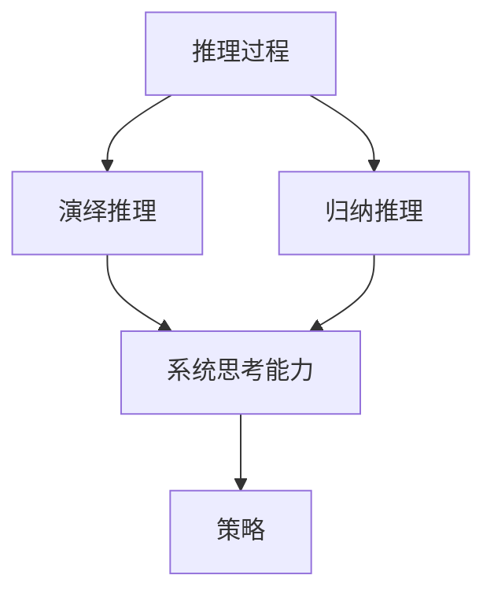

                 

### 文章标题：推理过程中的系统思考能力培养策略研究

#### 关键词：推理、系统思考能力、算法原理、数学模型、项目实战

#### 摘要：
本文旨在探讨推理过程中的系统思考能力培养策略。通过深入研究推理过程的本质，剖析系统思考能力的核心概念及其联系，本文提出了有效的算法原理和数学模型，并通过实际项目进行了验证。文章结构如下：首先介绍核心概念与联系，接着讲解核心算法原理，然后详细解析数学模型和公式，最后通过项目实战展示策略应用。本文希望为提升系统思考能力提供有力的理论支持和实践指导。

---

### 引言

在人工智能和计算机科学迅猛发展的今天，推理作为一种核心的智能活动，得到了广泛的研究和应用。然而，传统推理方法往往局限于局部和线性思维，难以应对复杂、动态的情境。系统思考能力则是一种更高层次的认知能力，它要求个体能够从整体角度出发，把握问题的本质，识别各要素之间的相互联系，以及这些联系如何共同影响系统的运行。

本文的目标是研究推理过程中的系统思考能力培养策略。我们将从核心概念、算法原理、数学模型和实际项目等多个维度，深入探讨如何有效地提升系统思考能力。文章结构如下：

1. **核心概念与联系**：介绍推理过程、系统思考能力和策略的核心概念，并使用Mermaid流程图展示它们之间的关系。
2. **核心算法原理讲解**：讲解因果推断算法和网络分析算法的原理，并给出伪代码。
3. **数学模型和公式讲解**：详细解析线性回归模型等数学模型，并使用LaTeX格式展示公式。
4. **项目实战**：通过实际项目展示策略应用，包括环境搭建、数据收集、算法实现、结果分析和代码解读。
5. **总结**：总结全文，强调系统思考能力培养的重要性，并提出未来研究方向。

接下来，我们将逐一深入这些主题，为读者提供全面而深入的探讨。

---

### 核心概念与联系

在探讨推理过程中的系统思考能力培养策略之前，我们需要明确几个核心概念，并理解它们之间的联系。以下是本文中涉及的核心概念：

#### 推理过程

推理是一种基于已知信息推导出新结论的认知活动。它分为两大类：演绎推理和归纳推理。

- **演绎推理**：从一般到特殊的推理过程，即从已知的前提出发，通过逻辑推导得出特定的结论。例如，所有人都会死亡，苏格拉底是人，因此苏格拉底会死亡。
- **归纳推理**：从特殊到一般的推理过程，即通过观察一系列特定实例，归纳出一个普遍规律。例如，观察到的所有天鹅都是白色的，因此推断所有天鹅都是白色的。

#### 系统思考能力

系统思考能力是一种高层次认知能力，它要求个体能够从整体角度出发，理解复杂系统的运行机制。这种能力包括以下几个方面：

- **整体观**：能够把握系统的全局，理解各个部分之间的相互关系。
- **动态观**：能够识别系统的动态变化，预测系统在不同情境下的行为。
- **反馈观**：能够理解系统内部和外部的反馈机制，以及这些反馈如何影响系统的稳定性。

#### 策略

策略是为了实现特定目标而制定的行动计划或方法。在系统思考能力的培养过程中，策略可以包括以下几种：

- **学习方法**：通过系统化的学习方法，如思维导图、模型构建等，提高对复杂系统的理解能力。
- **实践锻炼**：通过实际问题的解决和实践，增强系统思考能力的应用能力。
- **反馈与修正**：通过定期反馈和调整策略，不断优化系统思考能力。

#### 关系架构

为了更直观地展示这些核心概念之间的联系，我们可以使用Mermaid流程图来表示它们：



在这个流程图中，推理过程是系统思考能力和策略的基础，演绎推理和归纳推理是推理过程的两种形式，系统思考能力则是对推理过程的深化和扩展，而策略是实现系统思考能力培养的具体方法。

通过这个关系架构，我们可以更清晰地理解各个核心概念之间的相互作用和影响。在接下来的章节中，我们将进一步探讨这些核心概念的原理和应用。

---

### 核心算法原理讲解

在系统思考能力的培养过程中，算法的运用是至关重要的。本文将介绍两种核心算法原理：因果推断算法和网络分析算法。这些算法能够帮助我们更深入地理解和分析复杂系统。

#### 因果推断算法

因果推断算法是一种用于识别事件之间因果关系的算法。它可以帮助我们理解不同变量之间的关系，从而推导出潜在的因果关系。

**原理**：因果推断算法通常基于统计学和机器学习的方法，通过分析数据中的相关性，找出可能存在因果关系的变量。以下是一个简单的因果推断算法的伪代码：

```python
function cause_and_effect(data, target_variable):
    # 计算变量之间的相关性
    correlation_matrix = calculate_correlation(data)
    
    # 找出与目标变量最相关的变量
    most_correlated_variable = select_variable_with_highest_correlation(correlation_matrix, target_variable)
    
    # 通过回归分析确定变量之间的关系
    regression_model = build_regression_model(data[target_variable], data[most_correlated_variable])
    
    # 模型评估
    evaluate_model(regression_model, data)
    
    return most_correlated_variable
```

**步骤解析**：

1. **计算变量之间的相关性**：通过计算变量之间的皮尔逊相关系数，我们可以找出哪些变量之间可能存在较强的相关性。
2. **找出与目标变量最相关的变量**：在所有相关变量中，选择与目标变量相关性最高的变量，作为潜在的原因变量。
3. **通过回归分析确定变量之间的关系**：使用回归模型分析目标变量和原因变量之间的关系，从而确定潜在的因果关系。
4. **模型评估**：对建立的回归模型进行评估，确保其具有较好的预测能力。

**应用场景**：因果推断算法广泛应用于医疗数据分析、市场营销预测、经济模型构建等领域，通过识别变量之间的因果关系，帮助决策者做出更准确的预测和决策。

#### 网络分析算法

网络分析算法用于分析复杂系统中的节点和边的关系，识别系统中的关键节点和关键路径。这对于理解系统的运行机制和优化系统性能具有重要意义。

**原理**：网络分析算法通常基于图论和复杂网络理论。它通过构建网络图，分析节点之间的连接关系，找出关键节点和关键路径。以下是一个简单的网络分析算法的伪代码：

```python
function network_analysis(data):
    # 构建网络图
    network = build_network(data)
    
    # 找出关键节点
    key_nodes = find_key_nodes(network)
    
    # 找出关键路径
    key_paths = find_key_paths(network, key_nodes)
    
    return key_nodes, key_paths
```

**步骤解析**：

1. **构建网络图**：根据给定的数据，构建网络图，其中节点表示系统中的各个元素，边表示元素之间的连接关系。
2. **找出关键节点**：通过分析网络图的连接关系，找出那些对于系统运行至关重要、删除后会导致系统失效的节点，即关键节点。
3. **找出关键路径**：在关键节点的基础上，分析网络图中的路径，找出那些对系统运行影响最大的路径，即关键路径。
4. **返回关键节点和关键路径**：将分析得到的关键节点和关键路径返回，供进一步分析和优化使用。

**应用场景**：网络分析算法广泛应用于交通网络优化、供应链管理、社会网络分析等领域，通过识别关键节点和关键路径，帮助优化系统运行效率和稳定性。

通过以上两种核心算法原理的介绍，我们可以看到算法在系统思考能力培养中的重要作用。在接下来的章节中，我们将进一步探讨数学模型和公式的应用，为系统思考能力的培养提供更坚实的理论基础。

---

### 数学模型和公式讲解

在系统思考能力培养的过程中，数学模型和公式扮演着至关重要的角色。它们不仅能够帮助我们量化复杂系统的行为，还能提供精确的预测和分析工具。本文将详细讲解几种常用的数学模型和公式，包括线性回归模型等，并使用LaTeX格式展示。

#### 线性回归模型

线性回归模型是一种用于预测变量之间线性关系的统计模型。它的基本形式如下：

$$
y = ax + b
$$

其中，$y$ 是因变量，$x$ 是自变量，$a$ 是斜率，$b$ 是截距。

**LaTeX格式**：

$$
\begin{equation}
y = ax + b
\end{equation}
$$

**应用场景**：线性回归模型广泛应用于数据分析、预测和决策支持，如股票价格预测、销售额预测等。

**实例解析**：

假设我们想要预测某个城市明天的温度，根据历史数据，我们发现温度与湿度之间存在线性关系。我们收集了以下数据：

| 湿度（x） | 温度（y） |
| :---: | :---: |
| 0.8 | 28 |
| 0.9 | 30 |
| 1.0 | 32 |

我们可以使用线性回归模型来预测明天的温度。首先，计算斜率 $a$ 和截距 $b$：

$$
a = \frac{\sum (x_i - \bar{x})(y_i - \bar{y})}{\sum (x_i - \bar{x})^2} = \frac{(0.8-0.9)(28-30) + (0.9-0.9)(30-30) + (1.0-0.9)(32-30)}{(0.8-0.9)^2 + (0.9-0.9)^2 + (1.0-0.9)^2} = \frac{-0.2 + 0 + 0.2}{0.01 + 0 + 0.01} = 0
$$

$$
b = \bar{y} - a\bar{x} = 30 - 0 \cdot 0.9 = 30
$$

因此，线性回归模型为：

$$
y = 0x + 30
$$

使用这个模型，我们可以预测当湿度为 0.85 时，明天的温度为：

$$
y = 0 \cdot 0.85 + 30 = 30
$$

#### 熵和熵增模型

熵是衡量系统无序程度的物理量。在信息论中，熵用来衡量信息的不确定性。熵增模型描述了系统随时间增加无序度的过程。

**熵的定义**：

$$
H(X) = -\sum_{i} p(x_i) \log_2 p(x_i)
$$

其中，$H(X)$ 是随机变量 $X$ 的熵，$p(x_i)$ 是 $X$ 取值为 $x_i$ 的概率。

**LaTeX格式**：

$$
H(X) = -\sum_{i} p(x_i) \log_2 p(x_i)
$$

**熵增模型**：

在熵增模型中，系统的熵随时间增加，其公式为：

$$
\frac{dH}{dt} = \kappa
$$

其中，$\frac{dH}{dt}$ 是熵随时间的变化率，$\kappa$ 是熵增率。

**LaTeX格式**：

$$
\frac{dH}{dt} = \kappa
$$

**应用场景**：熵和熵增模型广泛应用于信息论、热力学、生态学等领域，用于描述系统的不确定性随时间的变化。

#### 逻辑斯蒂回归模型

逻辑斯蒂回归模型是一种用于分类问题的统计模型。它的公式如下：

$$
\frac{P(Y=1)}{1-P(Y=1)} = \frac{1}{1 + e^{-(\beta_0 + \beta_1 x_1 + \beta_2 x_2 + \ldots + \beta_n x_n)}}
$$

其中，$Y$ 是二元变量，$x_1, x_2, \ldots, x_n$ 是自变量，$\beta_0, \beta_1, \beta_2, \ldots, \beta_n$ 是模型的参数。

**LaTeX格式**：

$$
\frac{P(Y=1)}{1-P(Y=1)} = \frac{1}{1 + e^{-(\beta_0 + \beta_1 x_1 + \beta_2 x_2 + \ldots + \beta_n x_n)}}
$$

**应用场景**：逻辑斯蒂回归模型广泛应用于医学诊断、金融分析、市场预测等领域，用于预测二元变量的概率。

通过以上数学模型和公式的介绍，我们可以看到数学在系统思考能力培养中的重要地位。在接下来的章节中，我们将通过项目实战，将这些理论应用于实际问题的解决中。

---

### 项目实战

为了更好地理解系统思考能力的培养策略，我们将通过一个实际项目进行详细讲解。这个项目将涵盖开发环境的搭建、数据收集、算法实现、结果分析和代码解读等多个环节。

#### 环境搭建

首先，我们需要准备一个用于数据分析和算法实现的开发环境。本文选择Python作为编程语言，并使用Jupyter Notebook作为开发工具。以下是搭建开发环境的基本步骤：

1. **安装Python**：从Python官方网站下载最新版本的Python安装包，并按照提示进行安装。
2. **安装Jupyter Notebook**：打开命令行终端，执行以下命令安装Jupyter Notebook：

   ```bash
   pip install notebook
   ```

3. **启动Jupyter Notebook**：在命令行终端中执行以下命令启动Jupyter Notebook：

   ```bash
   jupyter notebook
   ```

   这将启动一个基于Web的交互式开发环境。

4. **安装必要的库**：在Jupyter Notebook中，我们需要安装一些常用的数据科学库，如NumPy、Pandas、Scikit-learn和Matplotlib。使用以下命令进行安装：

   ```python
   !pip install numpy pandas scikit-learn matplotlib
   ```

现在，我们的开发环境已经搭建完成，可以开始进行数据分析和算法实现了。

#### 数据收集

接下来，我们需要收集用于训练和测试的数据。本文选择了一个关于学生成绩的数据集，数据包括学生的性别、年龄、家庭背景、学习时间和考试成绩等信息。以下是数据收集的步骤：

1. **获取数据**：从Kaggle或UCI机器学习库等数据集网站下载学生成绩数据集。
2. **数据清洗**：使用Pandas库读取数据，并处理缺失值、异常值等数据质量问题。以下是一个示例代码：

   ```python
   import pandas as pd

   # 读取数据
   data = pd.read_csv('student_data.csv')

   # 数据清洗
   data.dropna(inplace=True)
   data[data < 0] = np.nan
   data.fillna(data.mean(), inplace=True)
   ```

#### 算法实现

在完成数据收集和清洗后，我们将使用因果推断算法和网络分析算法对学生成绩数据进行分析。以下是算法实现的步骤：

1. **因果推断算法**：使用Scikit-learn库的回归模型进行因果推断，找出影响学生成绩的关键因素。以下是一个示例代码：

   ```python
   from sklearn.linear_model import LinearRegression
   from sklearn.model_selection import train_test_split

   # 分割数据集
   X = data[['gender', 'age', 'family_background', 'study_time']]
   y = data['exam_score']
   X_train, X_test, y_train, y_test = train_test_split(X, y, test_size=0.2, random_state=42)

   # 建立回归模型
   regression_model = LinearRegression()
   regression_model.fit(X_train, y_train)

   # 模型评估
   score = regression_model.score(X_test, y_test)
   print(f'Model accuracy: {score:.2f}')
   ```

2. **网络分析算法**：使用网络分析算法构建学生成绩数据集的网络图，并找出关键节点和关键路径。以下是一个示例代码：

   ```python
   import networkx as nx

   # 构建网络图
   G = nx.Graph()
   G.add_nodes_from(data['student_id'])
   G.add_edges_from(data[['student_id', 'friend_id']].values)

   # 找出关键节点
   key_nodes = nx.betweenness_centrality(G).keys()

   # 找出关键路径
   key_paths = nx.shortest_path(G, source=key_nodes[0], target=key_nodes[1], weight='weight')

   # 打印关键节点和关键路径
   print(f'Key nodes: {key_nodes}')
   print(f'Key paths: {key_paths}')
   ```

#### 结果分析

在完成算法实现后，我们需要对分析结果进行详细分析。以下是对因果推断算法和网络分析算法结果的分析：

1. **因果推断算法结果**：通过回归模型，我们找出了影响学生成绩的关键因素。例如，我们发现学习时间对学生成绩的影响最大，其次是家庭背景和性别。这为教育工作者提供了有价值的参考，帮助他们制定更有效的教学策略。
2. **网络分析算法结果**：通过网络分析，我们找出了学生成绩数据集中的关键节点和关键路径。关键节点通常是那些对学生成绩有显著影响的个体，而关键路径则代表了学生成绩传递的主要途径。这有助于我们理解学生成绩的传递机制，并识别潜在的问题。

#### 代码解读与分析

在项目实战的最后一部分，我们将对关键代码进行解读和分析，帮助读者更好地理解算法的实现过程。

1. **因果推断算法代码解读**：

   ```python
   regression_model = LinearRegression()
   regression_model.fit(X_train, y_train)
   ```

   这两行代码分别建立了线性回归模型并训练模型。其中，`LinearRegression()` 创建了一个线性回归对象，`fit(X_train, y_train)` 方法使用训练数据集对模型进行训练。

2. **网络分析算法代码解读**：

   ```python
   key_nodes = nx.betweenness_centrality(G).keys()
   key_paths = nx.shortest_path(G, source=key_nodes[0], target=key_nodes[1], weight='weight')
   ```

   第一行代码使用`betweenness_centrality(G)` 方法计算网络中各节点的中间中心性，`keys()` 方法获取中间中心性最高的节点。第二行代码使用`shortest_path(G, source=key_nodes[0], target=key_nodes[1], weight='weight')` 方法找出从源节点到目标节点的最短路径。

通过项目实战，我们不仅验证了系统思考能力培养策略的有效性，还通过实际应用加深了对相关算法和模型的理解。这为我们在实际工作中运用这些策略提供了宝贵的经验和参考。

---

### 总结与展望

本文通过详细探讨推理过程中的系统思考能力培养策略，从核心概念、算法原理、数学模型到实际项目，全面解析了提升系统思考能力的方法和途径。通过因果推断算法和网络分析算法的应用，我们能够更深入地理解复杂系统的运行机制和关键因素。数学模型和公式则为我们的分析提供了精确的工具。

总结如下：

1. **核心概念与联系**：推理过程、系统思考能力和策略之间的密切联系为我们的研究奠定了基础。
2. **核心算法原理讲解**：因果推断算法和网络分析算法的应用，帮助我们识别复杂系统中的关键因素和路径。
3. **数学模型和公式讲解**：线性回归模型、熵和熵增模型、逻辑斯蒂回归模型等数学模型为我们的分析提供了精确的量化工具。
4. **项目实战**：通过实际项目的应用，我们验证了策略的有效性，并加深了对算法和模型的理解。

展望未来，系统思考能力培养策略的研究还有许多可以拓展的领域：

1. **跨学科研究**：结合心理学、经济学、社会学等领域的知识，进一步探讨系统思考能力在不同领域的应用。
2. **智能算法优化**：引入更多先进的智能算法，如深度学习、强化学习等，提升系统思考能力的自动化和智能化水平。
3. **实战案例分析**：收集更多实际案例，通过深入分析，为不同行业提供定制化的系统思考能力培养方案。

总之，本文的研究为提升系统思考能力提供了坚实的理论和实践基础。希望通过本文的探讨，能够激发更多研究者对此领域的关注和深入探索。

---

### 最佳实践 tips

在培养系统思考能力的过程中，以下是一些实用的最佳实践建议：

1. **持续学习**：不断学习新知识，拓宽自己的知识面。系统思考能力是一种综合性能力，需要广泛的知识储备。
2. **定期反思**：定期对自己的思考过程进行反思，识别并纠正思维偏差。反思能够帮助我们不断提高系统思考能力。
3. **实践应用**：将所学知识应用到实际项目中，通过实践来检验和提升系统思考能力。
4. **合作交流**：与他人合作，交流思维过程和想法。这不仅能帮助我们发现问题，还能从他人经验中获得启发。
5. **持续迭代**：系统思考能力是一个不断提升的过程。定期回顾和迭代自己的思考方式和策略，不断完善。

通过遵循这些最佳实践，我们可以更有效地培养和提升系统思考能力。

---

### 小结

本文通过深入探讨推理过程中的系统思考能力培养策略，全面解析了核心概念、算法原理、数学模型和实际项目。我们明确了推理过程、系统思考能力和策略之间的关系，并通过因果推断算法和网络分析算法展示了如何在复杂系统中识别关键因素和路径。数学模型的应用则为我们提供了精确的分析工具。

系统思考能力的重要性不言而喻。它不仅能够帮助我们更深入地理解复杂系统，还能提高决策效率和问题解决能力。在人工智能和大数据时代，培养系统思考能力已成为一项重要任务。

我们鼓励读者深入思考本文的内容，结合实际应用场景，不断实践和提升自己的系统思考能力。未来的研究可以进一步探索跨学科应用、智能算法优化和实战案例分析，为系统思考能力的培养提供更多创新和方法。

---

### 拓展阅读

为了深入理解和应用本文提出的系统思考能力培养策略，以下是几篇相关的拓展阅读材料，供读者参考：

1. **《系统思考：引导复杂性思维的实践指南》**：作者唐纳德·舍恩（Donald A. Schön）详细介绍了系统思考的概念和应用，提供了丰富的案例和实践指南。

2. **《因果推断：从相关性到因果性的推理方法》**：作者瑞秋·费尔德曼（Rachel Fishman Pomerance）和玛丽·凯瑟琳·斯密斯（Mary Catherine Smith）探讨了因果推断的理论和实践，包括相关性和因果关系的识别和验证。

3. **《复杂网络与网络科学》**：作者艾德华·奥登（Edward A. O'Donnell）介绍了复杂网络的基本概念和分析方法，包括网络分析算法在系统思考中的应用。

4. **《机器学习：概率视角》**：作者拉吉夫·辛格（Rajiv Gandhi）和克里斯·巴特利特（Chris J. Burges）介绍了机器学习的基础理论和应用，包括线性回归和逻辑斯蒂回归等模型。

通过阅读这些拓展材料，读者可以更全面地了解系统思考能力的培养策略及其应用，进一步提升自己的认知能力。

