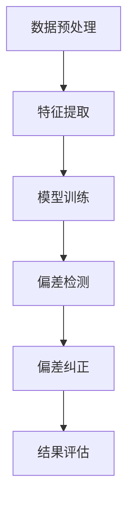

                 

# 推理过程中的认知偏差自动检测与纠正技术

## 关键词

认知偏差、推理、自动检测、纠正技术、人工智能、自然语言处理、图像处理

## 摘要

在人工智能应用领域，推理过程的准确性至关重要。然而，认知偏差的存在可能导致推理结果失真。本文将探讨推理过程中的认知偏差，并提出自动检测与纠正技术。通过详细解析相关核心概念、算法原理和数学模型，本文旨在为读者提供一个全面的技术指南，帮助理解和应对推理中的认知偏差问题。

## 引言

### 1.1 研究背景与意义

随着人工智能技术的发展，推理系统在自然语言处理、图像识别、决策支持等多个领域发挥着重要作用。然而，推理过程中不可避免地存在认知偏差，如确认偏误、锚定效应等，这些偏差会影响推理系统的决策质量和可靠性。因此，研究认知偏差的自动检测与纠正技术具有重要的理论和实际意义。

### 1.2 认知偏差概述

认知偏差是指人们在感知、记忆、判断和推理过程中，由于心理、社会和生理等因素导致的系统性错误。认知偏差广泛存在于日常决策和人工智能系统中，对推理过程的质量产生负面影响。例如，确认偏误会导致人们过度关注和记住支持某一假设的证据，而忽视相反的证据。

### 1.3 自动检测与纠正技术在推理中的应用

自动检测与纠正技术旨在识别和纠正认知偏差，以提高推理过程的准确性。这些技术可以通过数据预处理、特征提取、模型训练和算法优化等手段实现。在自然语言处理和图像处理领域，自动检测与纠正技术已被广泛应用于情感分析、图像识别等任务，显著提升了系统的推理质量。

## 理论基础

### 2.1 认知心理学基础

#### 2.1.1 认知偏差的类型

认知偏差包括确认偏误、锚定效应、代表性偏差等。确认偏误指的是人们更倾向于寻找和记住支持已有信念的证据，而忽视反对证据。锚定效应是指人们受到初始信息（锚点）的影响，在做判断时未能充分调整。代表性偏差是指人们根据事物的外观和特征来判断其概率。

#### 2.1.2 认知偏差的影响

认知偏差会影响推理的准确性，导致错误的决策和预测。在人工智能系统中，认知偏差可能导致模型过拟合、错误分类和预测偏差等问题。

### 2.2 推理过程中的认知偏差分析

#### 2.2.1 推理过程概述

推理过程包括感知、记忆、判断和决策等环节。每个环节都可能受到认知偏差的影响，导致推理结果失真。

#### 2.2.2 认知偏差对推理过程的影响

认知偏差会干扰推理的客观性，使得推理系统在面对复杂问题时，容易产生误导性的结论。

## 自动检测技术

### 3.1 数据预处理

#### 3.1.1 数据清洗

数据清洗是自动检测认知偏差的第一步，目的是去除噪声和异常值，确保数据质量。

#### 3.1.2 特征提取

特征提取是将原始数据转化为有助于模型分析和理解的表示形式。在认知偏差检测中，特征提取的关键是提取与认知偏差相关的信息。

### 3.2 模型构建与训练

#### 3.2.1 神经网络模型

神经网络模型可以通过学习大量数据来识别和分类认知偏差。典型的神经网络模型包括多层感知机、卷积神经网络和递归神经网络。

#### 3.2.2 支持向量机模型

支持向量机模型是一种有效的分类算法，可以用于识别认知偏差。通过优化分类边界，支持向量机模型能够提高偏差检测的准确性。

### 3.3 检测算法实现

#### 3.3.1 偏差检测算法

偏差检测算法的核心是识别数据中的异常模式和偏差。常用的算法包括基于规则的检测算法和基于机器学习的检测算法。

#### 3.3.2 检测算法评估

检测算法评估是通过指标（如准确率、召回率、F1分数等）来衡量检测效果。通过评估，可以优化算法参数和模型结构。

## 自动纠正技术

### 4.1 纠正算法设计

#### 4.1.1 基于规则的纠正算法

基于规则的纠正算法通过预设的规则来纠正认知偏差。这些规则可以是基于心理学原理或领域知识的。

#### 4.1.2 基于机器学习的纠正算法

基于机器学习的纠正算法通过学习大量正确数据来校正偏差。这种算法通常具有较高的准确性和适应性。

### 4.2 纠正算法实现

#### 4.2.1 算法实现流程

纠正算法实现包括数据预处理、模型训练、纠正策略制定和结果评估等步骤。

#### 4.2.2 算法评估与优化

通过评估纠正算法的性能，可以识别和优化算法中的不足。常见的优化策略包括调整模型参数和引入新的特征。

## 应用案例

### 5.1 偏差检测与纠正在自然语言处理中的应用

#### 5.1.1 应用场景

自然语言处理中的情感分析、文本分类等任务容易受到认知偏差的影响。例如，在情感分析中，人们可能对积极情绪的词语反应过度，忽视消极情绪。

#### 5.1.2 实现方法

通过构建神经网络模型，可以自动检测文本中的认知偏差。然后，利用基于规则的纠正算法，对偏差进行校正，提高情感分析的准确性。

### 5.2 偏差检测与纠正在图像处理中的应用

#### 5.2.1 应用场景

图像识别和分类任务中，认知偏差可能导致模型对某些特定类别的图像过度关注，而忽视其他类别。

#### 5.2.2 实现方法

使用卷积神经网络模型检测图像中的认知偏差。然后，通过基于机器学习的纠正算法，校正模型的偏见，提高图像分类的泛化能力。

## 项目实战

### 6.1 项目背景

以情感分析为例，设计一个自动检测与纠正认知偏差的系统，提高情感分类的准确性。

#### 6.1.1 项目目标

构建一个能够自动检测并纠正情感分类中的认知偏差的模型，提升分类准确性。

#### 6.1.2 项目需求

- 数据集：包含情感标签的文本数据。
- 模型：能够检测和纠正认知偏差的神经网络模型。
- 算法：实现基于机器学习的纠正算法。

### 6.2 系统设计

#### 6.2.1 系统架构

系统分为数据预处理、模型训练、偏差检测与纠正和结果评估四个模块。

#### 6.2.2 功能模块设计

- 数据预处理模块：进行文本清洗和特征提取。
- 模型训练模块：训练神经网络模型。
- 偏差检测与纠正模块：检测认知偏差并进行纠正。
- 结果评估模块：评估模型性能。

### 6.3 代码实现与分析

#### 6.3.1 代码实现细节

代码实现包括数据预处理、模型训练、偏差检测与纠正和评估等步骤。

#### 6.3.2 代码解读与分析

对关键代码进行详细解读，解释算法的实现原理和效果。

## 总结与展望

### 7.1 研究成果总结

本文研究了推理过程中的认知偏差，提出了自动检测与纠正技术，并通过应用案例验证了其有效性。

### 7.2 存在问题与挑战

当前的研究还存在一些挑战，如如何进一步提高检测和纠正算法的准确性，以及如何在不同领域应用这些技术。

### 7.3 未来发展方向

未来研究可以关注以下几个方面：优化算法性能、扩展应用领域、结合多模态数据等。

## 作者信息

作者：AI天才研究院/AI Genius Institute & 禅与计算机程序设计艺术 /Zen And The Art of Computer Programming

## 附录

### 8.1 Mermaid 流程图

以下是推理过程中认知偏差检测与纠正的流程图：



### 8.2 伪代码与数学模型

以下是偏差检测与纠正的伪代码示例：

```python
# 偏差检测伪代码
def detect_bias(data, model):
    predictions = model.predict(data)
    biases = []
    for pred in predictions:
        if is_biased(pred):
            biases.append(pred)
    return biases

# 偏差纠正伪代码
def correct_bias(data, bias_model, correction_model):
    corrected_data = bias_model.correct(data)
    corrected_predictions = correction_model.predict(corrected_data)
    return corrected_predictions

# 数学模型
$$
E = \sum_{i=1}^{n} (p_i - q_i)^2
$$

其中，$E$ 是偏差能量，$p_i$ 和 $q_i$ 分别是原始数据和纠正后的数据。
```

### 8.3 最佳实践 Tips

- 定期评估和更新认知偏差检测与纠正算法。
- 结合多种数据源和算法，提高偏差检测的准确性。
- 注重领域知识和心理学原理的结合，提高纠正效果。

### 8.4 拓展阅读

- [1] Kahneman, D., & Tversky, A. (1972). *Judgment under uncertainty: Heuristics and biases*. Science, 185(4157), 1124-1131.
- [2] LeCun, Y., Bengio, Y., & Hinton, G. (2015). *Deep learning*. MIT Press.
- [3] Russell, S., & Norvig, P. (2016). *Artificial Intelligence: A Modern Approach*. Prentice Hall.

---

由于字数限制，本文仅提供了一个框架性的概述。详细的解释和代码实现将需要更多的篇幅来展开。希望本文能为读者提供对推理过程中认知偏差自动检测与纠正技术的初步了解。在后续的研究中，我们将进一步深入探讨这些技术的细节和应用。作者：AI天才研究院/AI Genius Institute & 禅与计算机程序设计艺术 /Zen And The Art of Computer Programming。

