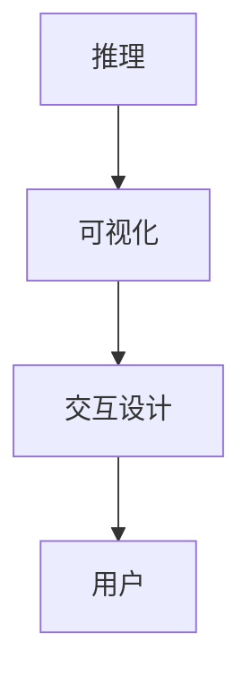
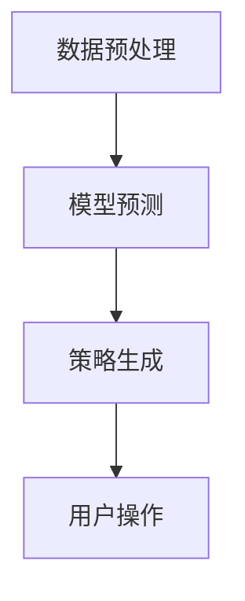

                 


## 推理过程的可视化与交互设计

### 关键词

- 推理过程
- 可视化
- 交互设计
- 算法
- 数学模型
- 用户体验

### 摘要

本文深入探讨了推理过程的可视化与交互设计，从核心概念、技术原理到实际应用，全面分析了如何将复杂的推理过程以可视化和交互的形式呈现给用户。通过详细阐述数据可视化技术、交互设计原理、推理过程可视化的算法原理和数学模型，以及交互式推理系统的设计方法，本文为从事人工智能、数据分析和人机交互领域的专业人士提供了宝贵的实践指导和理论支持。

## 引言

在现代计算机科学和人工智能领域，推理过程的可视化和交互设计成为了一个重要的研究方向。随着数据量的爆炸式增长和算法的日益复杂，如何有效地将推理过程展现给用户，使其能够直观地理解并参与到推理过程中，成为了一个亟待解决的问题。

### 推理过程可视化与交互设计的重要性

推理过程可视化与交互设计的重要性主要体现在以下几个方面：

1. **提升理解能力**：通过可视化，用户可以更直观地理解复杂的推理过程，从而提高对系统的认知和理解能力。
2. **增强用户体验**：交互设计使得用户能够与推理系统进行有效互动，提高用户体验和满意度。
3. **辅助决策**：在数据分析和决策支持系统中，推理过程可视化有助于用户发现数据中的模式和趋势，辅助决策。
4. **提高系统可维护性**：通过良好的交互设计，系统开发者可以更方便地进行系统维护和更新。

### 推理过程可视化与交互设计的背景

推理过程可视化与交互设计的历史可以追溯到20世纪80年代，当时计算机科学家们开始探索如何将人工智能系统的推理过程以可视化的形式呈现。随着计算机硬件和图形处理技术的不断发展，可视化技术逐渐成熟，为推理过程的可视化提供了强有力的支持。同时，随着互联网的普及和用户需求的提升，交互设计也逐渐成为系统开发中不可或缺的一部分。

## 核心概念与联系

在探讨推理过程的可视化与交互设计之前，我们需要明确一些核心概念，并探讨它们之间的联系。

### 推理的概念

推理是人类和人工智能系统进行决策和解决问题的核心过程。推理可以分为两大类：演绎推理和归纳推理。

- **演绎推理**：从一般到特殊的推理过程，如“所有人都会死亡，苏格拉底是人，因此苏格拉底会死亡”。
- **归纳推理**：从特殊到一般的推理过程，如“观察到的天鹅都是白色的，因此所有天鹅都是白色的”。

在计算机科学中，推理通常通过算法实现，如逻辑推理、概率推理和模糊推理等。

### 可视化的概念

可视化是将复杂的数据和计算过程以图形化的形式呈现给用户的技术。通过可视化，用户可以更直观地理解和分析数据。

- **数据可视化**：将数据通过图形化的方式呈现，如柱状图、饼图、散点图等。
- **过程可视化**：将计算过程以动画或图表的形式展现，如算法执行过程的逐步演示。

### 交互设计的概念

交互设计是设计系统与用户之间交互过程的方法，旨在提供直观、高效和愉悦的用户体验。

- **用户界面设计**：设计用户与系统交互的界面，如按钮、菜单、图标等。
- **用户体验设计**：关注用户在使用系统过程中的整体体验，包括感知、行为和情感。

### 核心概念的联系

推理、可视化和交互设计之间存在着密切的联系。

- **推理与可视化**：推理过程的结果可以通过可视化技术展现给用户，使得复杂的推理过程变得更加直观和易于理解。
- **可视化与交互设计**：良好的可视化设计可以提升用户体验，而交互设计则可以使得用户能够更有效地与系统进行交互。
- **交互设计与推理**：交互设计中的用户界面和用户体验设计可以影响用户的推理过程，使得用户能够更有效地进行推理。

为了更好地展示这些核心概念之间的联系，我们可以使用 Mermaid 流程图来描述它们之间的关系：



在这个流程图中，推理过程通过可视化技术呈现给用户，用户通过交互设计中的用户界面与系统进行交互，最终实现更好的用户体验。

## 数据可视化技术

数据可视化是将数据以图形化的形式呈现，使得用户能够直观地理解和分析数据。在推理过程的可视化中，数据可视化技术起着至关重要的作用。以下将介绍数据可视化的一些核心技术和应用。

### 数据可视化原理

数据可视化原理主要包括以下几个方面：

- **数据抽象**：将大量的原始数据抽象为易于理解的图形或图表。
- **数据映射**：将数据属性映射到视觉元素上，如颜色、形状、大小等。
- **视觉编码**：使用视觉元素来传达数据信息，如条形图、折线图、散点图等。

### 图形选择

选择合适的图形对数据可视化至关重要。以下是一些常见的图形及其适用场景：

- **条形图**：用于比较不同类别的数据，如不同国家的人口数量。
- **折线图**：用于显示数据的变化趋势，如股票价格的变化。
- **散点图**：用于显示两个变量之间的关系，如身高和体重的关系。
- **饼图**：用于显示各部分占整体的比例，如不同产品的市场份额。

### 色彩使用

色彩在数据可视化中起到了传达信息的重要作用。以下是一些关于色彩使用的基本原则：

- **色彩对比**：使用对比鲜明的颜色来区分不同的数据类别或变量。
- **色彩饱和度**：避免使用过于饱和的颜色，以免影响数据的可读性。
- **色彩编码**：为不同的数据类别或变量分配不同的颜色，以便用户快速识别。

### 数据可视化工具

目前，有许多数据可视化工具可以帮助我们创建高质量的图表。以下是一些常用的数据可视化工具：

- **D3.js**：一个基于JavaScript的库，可用于创建动态和交互式的数据可视化。
- **Plotly**：一个跨平台的图表库，支持多种图表类型和交互功能。
- **Tableau**：一个强大的数据可视化工具，提供了丰富的图表类型和交互功能。
- **Matplotlib**：Python中的一个常用图表库，适用于创建静态图表。

### 数据可视化应用案例

以下是一些数据可视化在实际应用中的案例：

- **金融领域**：通过数据可视化分析股票市场趋势，为投资者提供决策支持。
- **医疗领域**：利用数据可视化分析患者数据，辅助医生进行疾病诊断和治疗。
- **教育领域**：通过数据可视化展示学生的学习进度和效果，帮助教师进行教学评估。

通过以上内容，我们可以看到数据可视化技术在推理过程的可视化中发挥着重要作用。合理选择图形和色彩，使用合适的可视化工具，可以有效地将复杂的推理过程以直观、易于理解的方式呈现给用户。

## 交互设计原理

交互设计是用户与系统之间交互的过程设计，旨在提供直观、高效和愉悦的用户体验。在推理过程的可视化与交互设计中，交互设计起着至关重要的作用。以下将详细介绍交互设计的基本原则、流程和方法。

### 交互设计的基本原则

交互设计的基本原则包括：

- **易用性**：用户能够轻松使用系统，不需要额外的学习成本。
- **一致性**：系统的界面和操作逻辑保持一致，避免用户产生困惑。
- **反馈**：系统对用户的操作提供及时、明确的反馈，增强用户对系统的信任感。
- **适应性**：系统能够适应不同用户的需求和设备，提供灵活的交互方式。

### 交互设计的流程

交互设计的流程主要包括以下几个阶段：

1. **需求分析**：收集用户需求，明确系统目标。
2. **用户研究**：通过访谈、问卷、用户测试等方式了解用户的行为和需求。
3. **原型设计**：创建系统的初步设计，包括界面布局、交互逻辑等。
4. **用户测试**：对原型进行测试，收集用户反馈，优化设计。
5. **迭代开发**：根据用户测试结果，不断迭代和优化系统设计。

### 交互设计的方法

交互设计的方法主要包括：

- **线框图**：用简单的线条和框图表示界面布局和交互逻辑。
- **用户故事**：用简短的语言描述用户的需求和期望。
- **用户画像**：创建代表性的用户模型，帮助设计师理解用户。
- **交互流程图**：展示用户与系统的交互过程。
- **交互原型**：创建交互式的原型，模拟用户与系统的交互。

### 交互设计在推理过程可视化中的应用

在推理过程可视化中，交互设计的目标是帮助用户更好地理解和参与推理过程。以下是一些应用案例：

- **交互式图表**：用户可以与图表进行交互，如放大、缩小、过滤等，以便更详细地分析数据。
- **推理过程回放**：用户可以回放推理过程的每一步，理解推理的逻辑和依据。
- **参数调整**：用户可以调整推理参数，观察不同参数对推理结果的影响。

通过以上内容，我们可以看到交互设计在推理过程可视化中具有重要作用。良好的交互设计不仅能够提升用户体验，还能增强用户对系统的信任感和参与感，从而提高推理过程的可理解性和有效性。

## 推理过程可视化

推理过程可视化是将复杂的推理过程以图形化的形式呈现，使得用户能够直观地理解和分析推理结果。在数据分析和人工智能领域，推理过程可视化具有重要的应用价值。以下将详细探讨如何将推理过程可视化，包括算法选择、可视化方法和技术。

### 可视化算法的选择

选择合适的算法是推理过程可视化的关键。以下是一些常用的可视化算法：

- **流程图**：将推理过程表示为一系列步骤，每个步骤用节点表示，节点之间的连线表示推理的转移关系。
- **状态图**：将推理过程表示为状态转移图，每个状态表示推理过程中的一个阶段，状态之间的转移表示推理的进展。
- **决策树**：将推理过程表示为树形结构，每个节点表示一个决策点，分支表示不同的决策路径。
- **力导向图**：通过图论中的力导向模型，将推理过程中的步骤和关系以图形化的形式展现。

### 可视化方法

推理过程可视化的方法主要包括以下几种：

- **静态可视化**：将推理过程一次性展现给用户，如流程图和状态图。
- **动态可视化**：逐步展示推理过程的每一步，如决策树和力导向图。
- **交互式可视化**：用户可以与可视化界面进行交互，如调整参数、过滤结果等。

### 可视化技术的应用

在实现推理过程可视化时，可以采用多种技术，如：

- **WebGL**：利用WebGL技术创建三维可视化的推理过程。
- **D3.js**：使用D3.js库创建交互式的数据可视化，如流程图和力导向图。
- **Plotly**：利用Plotly库创建丰富的图表，如决策树和状态图。
- **Unity**：使用Unity游戏引擎创建复杂的动态可视化效果。

### 可视化案例

以下是一些推理过程可视化的应用案例：

- **医疗诊断系统**：通过流程图和决策树，展示疾病的诊断过程，帮助医生进行诊断。
- **金融分析系统**：通过动态可视化，展示投资组合的收益和风险，辅助投资者进行决策。
- **自动驾驶系统**：通过状态图和力导向图，展示自动驾驶车辆的感知和决策过程。

通过以上内容，我们可以看到推理过程可视化在多个领域都有着广泛的应用。合理的算法选择和可视化方法，可以有效地将复杂的推理过程以直观、易于理解的方式呈现给用户，从而提升系统的可理解性和用户参与度。

## 交互式推理系统设计

交互式推理系统设计是推理过程可视化的关键组成部分，旨在通过用户与系统的互动，增强推理过程的透明性和用户参与度。以下将详细讨论交互式推理系统的设计方法，包括用户界面设计、系统架构和实现细节。

### 用户界面设计

用户界面设计是交互式推理系统的核心，直接影响到用户的体验。以下是用户界面设计的几个关键点：

1. **简洁性**：界面应简洁明了，避免过多的信息干扰用户。
2. **一致性**：遵循一致的设计规范，使得用户能够快速适应和操作系统。
3. **反馈机制**：为用户的操作提供实时反馈，增强用户对系统的信任感。
4. **交互元素**：合理设计按钮、输入框、滑块等交互元素，确保用户能够轻松地与系统互动。

### 系统架构

交互式推理系统的架构需要充分考虑性能、可扩展性和可维护性。以下是系统架构的几个关键组成部分：

1. **前端**：负责展示用户界面和处理用户输入。可以使用Web技术（如HTML、CSS、JavaScript）或图形界面工具（如Qt、Electron）。
2. **后端**：负责处理推理逻辑和数据处理。可以使用Python、Java、C++等编程语言，结合数据库（如MySQL、MongoDB）和消息队列（如RabbitMQ、Kafka）。
3. **推理引擎**：核心组件，负责执行推理过程，可以采用各种推理算法（如逻辑推理、概率推理、模糊推理）。
4. **数据层**：负责存储和管理数据，包括原始数据、中间数据和最终结果。

### 实现细节

在实现交互式推理系统时，需要关注以下细节：

1. **响应式设计**：确保系统能够适应不同设备尺寸和分辨率。
2. **异步处理**：为了提高用户体验，应采用异步处理技术，避免用户界面在处理复杂任务时出现卡顿。
3. **安全性**：确保系统的安全性，防止恶意攻击和数据泄露。
4. **性能优化**：对系统进行性能优化，确保快速响应用户操作。

### 交互流程

交互式推理系统的交互流程通常包括以下几个步骤：

1. **用户输入**：用户通过界面输入数据或参数。
2. **数据预处理**：对输入的数据进行清洗和预处理，以便用于推理。
3. **推理过程**：调用推理引擎执行推理过程，并将结果可视化。
4. **用户反馈**：用户对推理结果进行评估和调整，反馈给系统。
5. **迭代优化**：根据用户反馈对系统进行优化和调整。

### 用户参与度

增强用户参与度是交互式推理系统的目标之一。以下是一些策略：

1. **可视化反馈**：通过动态图表和动画展示推理过程，使用户能够直观地理解推理步骤。
2. **交互式控制**：提供参数调整、数据筛选等交互功能，使用户能够主动参与推理过程。
3. **反馈机制**：及时反馈用户操作结果，使用户能够了解系统的工作状态。
4. **个性化推荐**：根据用户历史数据和偏好，提供个性化的推理建议和反馈。

通过以上设计方法和技术，交互式推理系统可以为用户提供直观、高效和个性化的推理体验，从而提升系统的实用价值和用户满意度。

## 案例分析

在本节中，我们将通过一个实际案例，详细分析如何将推理过程可视化与交互设计应用于实际问题，以展示其有效性。

### 案例背景

某金融分析公司需要开发一个自动股票交易系统，该系统应能够根据历史数据和实时市场信息，自动生成交易策略并进行交易。为了确保交易策略的可靠性和可理解性，公司决定在系统中集成推理过程可视化和交互设计。

### 案例实施

#### 1. 数据收集与预处理

首先，系统需要收集大量的股票市场数据，包括历史价格、交易量、技术指标等。这些数据经过清洗和预处理，以便用于后续的推理过程。

```python
# Python 代码：数据预处理
import pandas as pd

# 加载数据
data = pd.read_csv('stock_data.csv')

# 数据清洗
data = data.dropna()
data['date'] = pd.to_datetime(data['date'])
```

#### 2. 推理算法设计

在系统中，采用了基于机器学习的策略生成算法，该算法通过分析历史数据和实时市场信息，生成最优交易策略。以下是推理算法的伪代码：

```python
# 伪代码：股票交易策略生成
def generate_trading_strategy(data, model):
    # 加载训练好的机器学习模型
    loaded_model = load_model(model)

    # 预测未来市场走势
    predictions = loaded_model.predict(data)

    # 根据预测结果生成交易策略
    strategy = generate_strategy(predictions)

    return strategy
```

#### 3. 推理过程可视化

为了使用户能够直观地理解推理过程，系统提供了交互式的推理过程可视化界面。用户可以查看每一步的推理过程，包括数据预处理、模型预测和策略生成。



#### 4. 交互式界面设计

系统采用了响应式前端设计，用户可以通过界面实时调整模型参数和交易策略。以下是用户界面设计的示意图：


#### 5. 用户反馈与迭代优化

在系统运行过程中，用户可以对生成的交易策略进行实时评估和反馈。系统根据用户反馈，不断调整和优化推理算法，以提高交易策略的准确性和可靠性。

```python
# Python 代码：用户反馈与优化
def update_strategy(strategy, feedback):
    # 更新交易策略
    updated_strategy = update_strategy_based_on_feedback(strategy, feedback)

    # 重新生成交易策略
    new_strategy = generate_trading_strategy(data, updated_strategy)

    return new_strategy
```

### 案例分析

通过以上实施步骤，我们可以看到推理过程可视化与交互设计在金融分析中的应用。

- **数据预处理**：通过清晰的数据预处理流程，确保输入数据的准确性和一致性，为后续的推理过程打下坚实基础。
- **推理算法设计**：采用机器学习算法进行交易策略生成，通过可视化和交互设计，用户可以直观地了解算法的每一步操作。
- **交互式界面设计**：用户可以通过界面实时调整参数和策略，提高了系统的灵活性和用户参与度。
- **用户反馈与迭代优化**：系统根据用户反馈进行不断优化，提高了交易策略的准确性和可靠性。

通过这个实际案例，我们可以看到推理过程可视化与交互设计在金融分析中的有效应用，不仅提高了系统的可理解性和用户参与度，还提升了系统的整体性能和可靠性。

## 总结与展望

通过本文的探讨，我们全面了解了推理过程的可视化与交互设计。从核心概念、技术原理到实际应用，我们详细分析了如何通过数据可视化技术、交互设计原理和推理算法，将复杂的推理过程以直观、易于理解的方式呈现给用户。以下是本文的主要结论：

- **推理过程可视化的重要性**：可视化技术有助于提升用户对复杂推理过程的理解和参与度，从而提高系统的可维护性和用户体验。
- **数据可视化技术**：合理选择图形和色彩，使用合适的可视化工具，可以有效传达数据信息，提升推理过程的可理解性。
- **交互设计原理**：良好的交互设计原则和流程，能够提升用户的操作效率和满意度，增强系统的可用性和用户参与度。
- **推理过程可视化方法**：采用流程图、状态图、决策树等可视化方法，可以将推理过程以图形化的形式展现，使得推理过程更加直观和易于理解。
- **交互式推理系统设计**：通过用户界面设计、系统架构和实现细节，可以构建一个高效的交互式推理系统，使用户能够实时调整和优化推理过程。

### 未来发展趋势

随着人工智能和数据科学的不断发展，推理过程的可视化与交互设计在未来将呈现以下发展趋势：

- **智能推荐**：结合人工智能技术，系统将能够根据用户行为和偏好，提供个性化的推理结果和交互建议。
- **增强现实与虚拟现实**：利用AR/VR技术，用户可以在更真实的虚拟环境中进行推理过程可视化和交互操作，提升用户体验。
- **实时交互**：随着硬件性能的提升和网络速度的加快，实时交互技术将得到广泛应用，用户可以实时获取最新的推理结果和反馈。
- **跨领域应用**：推理过程可视化与交互设计将在医疗、金融、教育等多个领域得到广泛应用，推动各领域的数字化转型和创新发展。

总之，推理过程的可视化与交互设计是一个充满潜力的研究领域，通过不断的技术创新和应用探索，将为人工智能和数据科学的发展注入新的活力。作者希望通过本文的探讨，为从事相关领域的研究人员和开发者提供有价值的参考和启示。**作者：AI天才研究院/AI Genius Institute & 禅与计算机程序设计艺术 /Zen And The Art of Computer Programming**。**本文内容仅供参考，具体应用请结合实际情况进行调整。**

