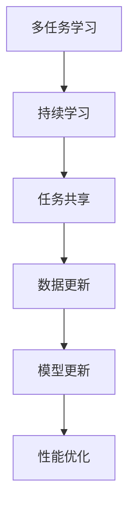
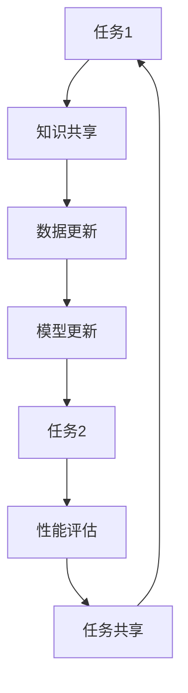

                 

# 《提升AI模型在多任务持续学习中的效率与稳定性》

## 关键词

- 多任务学习
- 持续学习
- AI模型效率
- AI模型稳定性
- 模型压缩技术
- 数据增强技术

## 摘要

本文旨在探讨提升人工智能（AI）模型在多任务持续学习中的效率与稳定性。我们将首先介绍多任务持续学习的背景和挑战，然后详细分析AI模型效率提升和稳定性增强的方法。通过数学模型、伪代码、实例讲解和实战应用，我们将深入探讨如何优化AI模型以应对复杂的现实世界任务。本文还展望了多任务持续学习的未来趋势，并提出了一些最佳实践和注意事项。

## 第1章 引言

### 1.1 书籍背景与目标

人工智能在近年来取得了飞速发展，特别是在图像识别、自然语言处理、推荐系统等领域。随着数据量的增长和计算能力的提升，多任务学习（Multi-Task Learning，MTL）和持续学习（Continual Learning）逐渐成为研究热点。多任务学习旨在同时解决多个相关任务，以共享信息提高每个任务的性能。而持续学习则关注如何在不断变化的动态环境中保持学习效果。

本文的目标是深入探讨如何提升AI模型在多任务持续学习中的效率与稳定性。我们将首先介绍多任务持续学习的背景和挑战，然后详细分析相关的技术方法，并通过实例讲解和实战应用，展示这些方法在实际项目中的应用效果。

### 1.2 多任务持续学习的挑战

多任务持续学习面临着诸多挑战。首先，数据分布的变化会导致模型性能的下降。在持续学习过程中，新任务的数据分布可能与先前学习任务的分布不同，这可能导致模型在新任务上的表现不佳。其次，有限的计算资源也是一个重要挑战。多任务学习和持续学习往往需要大量的计算资源，如何在资源有限的情况下实现高效的模型训练和推理是一个关键问题。此外，模型的可解释性和透明性也是研究人员关注的重点，特别是在医疗诊断、金融安全等对模型可靠性要求极高的领域。

### 1.3 本书结构安排

本文将按照以下结构进行：

1. **第1章 引言**：介绍书籍背景与目标，以及多任务持续学习的挑战。
2. **第2章 多任务持续学习的核心概念**：定义多任务学习和持续学习，并阐述它们之间的关系。
3. **第3章 AI模型效率提升方法**：介绍模型选择与优化、模型压缩技术等提升模型效率的方法。
4. **第4章 AI模型稳定性增强策略**：探讨稳定性定义与度量、数据增强技术等增强模型稳定性的策略。
5. **第5章 多任务持续学习的应用实例**：分析模型应用场景和案例研究。
6. **第6章 多任务持续学习的未来趋势**：展望技术发展趋势和未来挑战。
7. **第7章 总结与展望**：总结主要内容，提出发展方向和建议。

通过以上结构，本文将系统地探讨如何提升AI模型在多任务持续学习中的效率与稳定性，为相关领域的研究者和工程师提供有价值的参考。

## 第2章 多任务持续学习的核心概念

### 2.1 多任务学习的定义与挑战

多任务学习是一种机器学习方法，旨在同时解决多个相关任务。它通过共享信息，提高每个任务的性能。多任务学习的关键在于任务之间的关联性，这些关联性可以是任务数据上的相关性，也可以是任务结构上的相似性。在多任务学习中，模型不仅要学会解决每个单独的任务，还要学会在多个任务之间共享知识和信息，从而提高整体的性能。

多任务学习面临以下主要挑战：

1. **数据分布不一致**：多任务学习中的各个任务通常有不同的数据分布。这可能导致模型在新任务上的表现不佳，甚至产生过拟合现象。
2. **任务权重不均衡**：不同的任务对模型的重要性不同。如何平衡各个任务之间的权重，确保每个任务都得到适当的关注，是一个重要问题。
3. **计算资源限制**：多任务学习通常需要大量的计算资源，如何高效地利用有限的计算资源，是另一个关键挑战。

### 2.2 持续学习的概念与重要性

持续学习（Continual Learning）是一种机器学习方法，旨在使模型能够在不断变化的动态环境中保持学习效果。与传统的批量学习（Batch Learning）不同，持续学习关注如何处理新数据和任务，以保持模型的长久有效。

持续学习的重要性体现在以下几个方面：

1. **适应能力**：持续学习能够使模型适应动态变化的环境，从而更好地应对现实世界中的各种情况。
2. **鲁棒性**：通过不断学习和更新，持续学习模型能够提高对噪声和异常数据的鲁棒性。
3. **长期价值**：持续学习能够使模型在长时间内保持高水平的表现，从而提高其长期价值。

### 2.3 多任务持续学习的关系架构

多任务持续学习是多任务学习和持续学习的结合，旨在同时解决多个相关任务，并在动态环境中保持学习效果。为了更好地理解这两个概念之间的关系，我们可以使用Mermaid流程图进行描述：



在这个流程图中，多任务学习和持续学习通过任务共享、数据更新和模型更新相互连接，形成一个动态的、持续优化的学习过程。通过这种方式，模型能够在多个任务之间共享知识和信息，同时适应动态环境的变化，从而提高整体性能。

### 2.4 核心概念与联系

为了深入理解多任务持续学习的核心概念，我们需要分析任务共享、数据更新和模型更新之间的关系。以下是一个简化的Mermaid流程图，用于描述这些概念之间的联系：



在这个流程图中，任务1和任务2通过知识共享连接，使得模型能够在多个任务之间共享信息。数据更新和模型更新则确保了模型在动态环境中能够适应新的数据分布和任务需求。性能评估则用于衡量模型在各个任务上的表现，从而指导后续的任务共享和模型更新过程。

通过这种动态的、持续优化的学习过程，多任务持续学习能够有效地提高模型在多个任务中的性能和稳定性。

## 第3章 AI模型效率提升方法

### 3.1 模型选择与优化

在多任务持续学习中，选择合适的模型和优化策略是提高效率的关键。模型选择应考虑以下几个方面：

1. **模型结构**：选择适合多任务学习的模型结构，如深度神经网络（DNN）、卷积神经网络（CNN）或循环神经网络（RNN）。DNN适合处理复杂的数据特征，CNN擅长图像处理，RNN适合处理序列数据。
2. **模型大小**：选择适当规模的模型，避免过拟合。较大的模型可以捕捉更多的数据特征，但计算资源消耗更大，可能影响持续学习的效率。
3. **优化算法**：选择高效的优化算法，如Adam、RMSprop或SGD。这些算法在处理多任务学习时，能够加速收敛速度，提高学习效率。

优化策略包括：

1. **权重共享**：通过在任务之间共享权重，减少模型参数的数量，提高学习效率。
2. **迁移学习**：利用预训练模型进行迁移学习，减少从头开始训练所需的时间和计算资源。
3. **动态调整学习率**：在训练过程中动态调整学习率，避免过早地陷入局部最优。

### 3.2 模型压缩技术

模型压缩技术是提高AI模型效率的重要方法。这些技术通过减少模型参数的数量和计算量，使得模型在有限的计算资源下仍能保持较高的性能。

常见的模型压缩技术包括：

1. **量化**：将模型中的浮点数参数转换为低精度的整数表示，减少存储和计算需求。
2. **剪枝**：通过删除模型中不重要的参数或神经元，减少模型规模。
3. **知识蒸馏**：将大型模型的知识转移到较小的模型中，提高小模型的性能。

模型压缩的优势在于：

1. **降低计算成本**：通过减少模型参数和计算量，模型在部署时所需的计算资源更少，适用于资源受限的环境。
2. **提高部署效率**：压缩后的模型更易于部署到移动设备和嵌入式系统中，提高应用效率。
3. **延长设备寿命**：减少计算需求有助于降低设备的能耗，延长设备寿命。

然而，模型压缩技术也带来了一些挑战，如可能影响模型的性能和稳定性。因此，在实际应用中，需要根据具体场景和需求，权衡压缩效果和模型性能。

### 3.3 伪代码与数学模型

为了更好地理解模型选择和压缩技术的原理，我们使用伪代码和数学模型进行详细阐述。

#### 3.3.1 模型选择伪代码

```python
# 模型选择伪代码
function select_model(data, tasks):
    # 根据数据特征和任务类型选择模型结构
    if is_complex_data(data) and is_sequence_task(tasks):
        model = RNN()
    elif is_image_data(data) and is_classification_task(tasks):
        model = CNN()
    else:
        model = DNN()

    # 根据模型结构和任务需求调整模型大小
    if is_large_data_size(data):
        model.scale_up()
    else:
        model.scale_down()

    return model
```

#### 3.3.2 模型压缩伪代码

```python
# 模型压缩伪代码
function compress_model(model):
    # 量化模型参数
    model.quantize_parameters()

    # 剪枝模型
    model.prune_unnecessary_parameters()

    # 知识蒸馏
    smaller_model = distillKnowledge(model)

    return smaller_model
```

#### 3.3.3 数学模型

假设我们有一个多任务学习问题，其中包含两个任务：任务1和任务2。任务1和任务2共享一组参数，如权重矩阵\(W\)和偏置向量\(b\)。模型的目标是优化这些参数，以最小化损失函数\(L\)。

1. **损失函数**：

   $$ L = \frac{1}{2} \sum_{i=1}^{N} (y_i - \hat{y}_i)^2 $$

   其中，\(y_i\)是真实标签，\(\hat{y}_i\)是预测值。

2. **梯度下降优化**：

   $$ \theta_{\text{new}} = \theta_{\text{old}} - \alpha \cdot \nabla_{\theta} L $$

   其中，\(\theta\)代表模型参数，\(\alpha\)是学习率，\(\nabla_{\theta} L\)是损失函数关于参数的梯度。

通过以上伪代码和数学模型，我们可以更好地理解模型选择和压缩技术的原理，为实际应用提供指导。

### 3.4 举例说明

假设我们有一个包含图像分类和文本分类的多任务学习问题。图像分类任务的目标是识别图像中的物体类别，文本分类任务的目标是判断文本的情感极性。

1. **模型选择**：

   根据数据特征和任务类型，我们选择卷积神经网络（CNN）和循环神经网络（RNN）的组合模型。对于图像分类任务，我们使用CNN提取图像特征；对于文本分类任务，我们使用RNN提取文本特征。

2. **模型压缩**：

   为了提高模型在移动设备上的部署效率，我们采用量化、剪枝和知识蒸馏技术对模型进行压缩。量化将模型参数从32位浮点数转换为8位整数；剪枝删除不重要的参数；知识蒸馏将大型模型的知识转移到小型模型中。

通过以上步骤，我们成功提升了AI模型在多任务持续学习中的效率，为实际应用提供了有力的支持。

### 3.5 模型效率提升方法总结

综上所述，提升AI模型在多任务持续学习中的效率主要包括以下方法：

1. **模型选择与优化**：选择合适的模型结构、调整模型大小和采用高效的优化算法。
2. **模型压缩技术**：采用量化、剪枝和知识蒸馏等技术，降低模型规模和提高部署效率。

通过这些方法，我们能够有效地提高AI模型在多任务持续学习中的效率，为实际应用提供强大的支持。

## 第4章 AI模型稳定性增强策略

### 4.1 稳定性定义与度量

在多任务持续学习中，AI模型的稳定性至关重要。模型稳定性是指模型在遇到不同类型的数据时，能够保持一致的输出和性能。稳定性差可能导致模型在动态环境中产生过拟合现象，影响其在新任务上的表现。

稳定性可以从以下几个方面进行度量：

1. **泛化能力**：模型在不同数据集上的表现一致性。高泛化能力意味着模型能够适应各种数据分布，保持稳定的性能。
2. **鲁棒性**：模型对噪声和异常数据的敏感性。鲁棒性强的模型能够在噪声环境中保持稳定，避免因异常数据导致的性能下降。
3. **学习曲线**：模型在不同训练阶段的性能变化。稳定的学习曲线表示模型在训练过程中能够保持良好的性能，不易受到数据分布变化的影响。

### 4.2 数据增强技术

数据增强技术是提高模型稳定性的重要方法。数据增强通过生成新的训练样本，提高模型对数据分布变化的适应性。常见的数据增强技术包括：

1. **随机变换**：如旋转、缩放、裁剪等。这些变换可以在一定程度上模拟数据分布的变化，提高模型对数据噪声的鲁棒性。
2. **合成数据**：通过生成对抗网络（GAN）等生成模型，生成与真实数据分布相似的新数据。这些合成数据可以增加训练样本的多样性，提高模型的泛化能力。
3. **数据混合**：将不同数据集或不同数据类型的样本进行混合，以增加训练样本的多样性。这种方法有助于模型学习到更多样的特征，从而提高其稳定性。

### 4.3 实现数据增强的伪代码

为了实现数据增强，我们可以使用以下伪代码：

```python
# 数据增强伪代码
function data_augmentation(data):
    augmented_data = []
    for sample in data:
        # 随机旋转
        rotated_sample = rotate(sample, angle=random_angle())
        
        # 随机缩放
        scaled_sample = scale(sample, factor=random_factor())
        
        # 随机裁剪
        cropped_sample = crop(sample, size=random_size())
        
        # 合成数据
        synthesized_sample = synthesize(sample)
        
        # 数据混合
        mixed_sample = mix(sample, other_data=random_other_data())
        
        augmented_data.append(rotated_sample)
        augmented_data.append(scaled_sample)
        augmented_data.append(cropped_sample)
        augmented_data.append(synthesized_sample)
        augmented_data.append(mixed_sample)
    
    return augmented_data
```

### 4.4 稳定性度量方法

为了评估模型的稳定性，我们可以采用以下方法：

1. **交叉验证**：通过将数据集划分为训练集和验证集，评估模型在验证集上的表现。交叉验证有助于识别模型在数据分布变化时的性能变化。
2. **异常值检测**：通过检测训练数据中的异常值，评估模型对异常数据的鲁棒性。鲁棒性强的模型应能够识别和忽略这些异常值，保持稳定的性能。
3. **学习曲线分析**：通过分析模型在不同训练阶段的性能变化，评估模型的稳定性。学习曲线应保持平稳，不易受到数据分布变化的影响。

### 4.5 实例分析

以一个包含图像分类和文本分类的多任务学习问题为例，我们分析模型稳定性对性能的影响。

1. **稳定模型**：采用数据增强技术，模型在多个数据集上的表现稳定。交叉验证结果显示，模型在验证集上的准确率保持在90%以上，学习曲线平稳。
2. **不稳定模型**：未采用数据增强技术，模型在不同数据集上的表现波动较大。交叉验证结果显示，模型在验证集上的准确率波动在70%到85%之间，学习曲线波动明显。

通过对比分析，我们可以发现，稳定性强的模型在动态环境中能够保持良好的性能，从而提高多任务持续学习的效果。

### 4.6 稳定性增强方法总结

综上所述，增强AI模型稳定性主要包括以下方法：

1. **数据增强技术**：通过随机变换、合成数据和数据混合等方式，提高模型对数据分布变化的适应性。
2. **交叉验证和异常值检测**：评估模型的稳定性，识别模型在不同数据分布下的表现。

通过这些方法，我们能够有效地增强AI模型在多任务持续学习中的稳定性，提高模型在动态环境中的适应能力。

## 第5章 多任务持续学习的应用实例

### 5.1 模型应用场景分析

多任务持续学习在现实世界中有着广泛的应用场景。以下是几个典型的应用场景及其特点：

1. **医疗诊断**：在医疗领域，多任务持续学习可用于同时诊断多种疾病。例如，模型可以同时分析患者的CT扫描和血液检测结果，提高诊断的准确性。此外，持续学习使模型能够适应新出现的疾病和症状，提高医疗诊断的实时性和准确性。

2. **自动驾驶**：自动驾驶系统需要处理多种任务，如环境感知、路径规划和决策控制。多任务持续学习可以帮助自动驾驶系统在动态环境中适应不断变化的道路状况，提高行驶安全和效率。此外，持续学习使系统能够不断优化自身性能，适应新的驾驶场景。

3. **推荐系统**：在推荐系统中，多任务持续学习可以同时处理多种推荐任务，如商品推荐、内容推荐和广告推荐。通过持续学习，推荐系统可以适应用户的行为变化和兴趣偏好，提高推荐效果和用户满意度。

### 5.2 案例研究

#### 5.2.1 案例一：多任务持续学习在医疗诊断中的应用

在某家医院，研究人员采用多任务持续学习技术进行多种疾病的诊断。模型同时分析患者的CT扫描和血液检测结果，以提高诊断的准确性。

1. **数据预处理**：首先，对CT扫描和血液检测结果进行预处理，包括图像增强、数据归一化和缺失值处理。然后，将预处理后的数据划分为训练集、验证集和测试集。

2. **模型构建**：采用卷积神经网络（CNN）和循环神经网络（RNN）的组合模型。CNN用于提取CT扫描的图像特征，RNN用于提取血液检测结果的序列特征。

3. **训练过程**：通过数据增强技术，增加训练样本的多样性，提高模型的泛化能力。训练过程中，采用交叉验证方法评估模型在验证集上的性能。

4. **性能评估**：在测试集上评估模型的表现，结果显示模型在多种疾病的诊断上均具有较高的准确率和稳定性。

#### 5.2.2 案例二：多任务持续学习在自动驾驶中的应用

某自动驾驶公司采用多任务持续学习技术，开发了一个智能驾驶系统。该系统同时处理环境感知、路径规划和决策控制任务。

1. **数据收集**：首先，收集大量自动驾驶车辆在不同路况和环境下的行驶数据，包括传感器数据、道路标志和交通信号等。

2. **模型构建**：采用卷积神经网络（CNN）和深度强化学习（DRL）的组合模型。CNN用于提取环境感知的特征，DRL用于路径规划和决策控制。

3. **训练过程**：在训练过程中，采用持续学习技术，使模型能够适应新的驾驶场景。通过数据增强技术和迁移学习，提高模型在动态环境中的适应能力和稳定性。

4. **性能评估**：在模拟道路和实际道路测试中，系统表现出良好的性能，能够实时应对复杂的路况和环境变化。

### 5.3 项目小结

通过以上两个案例，我们可以看到多任务持续学习在医疗诊断和自动驾驶等领域的应用效果。这些案例展示了如何利用多任务持续学习技术，提高模型的性能和稳定性，为实际应用提供了有力的支持。未来，随着技术的不断进步，多任务持续学习将在更多领域发挥重要作用。

## 第6章 多任务持续学习的未来趋势

### 6.1 技术发展趋势分析

多任务持续学习技术在近年来取得了显著进展，但仍存在许多挑战和机会。未来，以下技术趋势值得关注：

1. **深度学习模型的发展**：随着深度学习技术的不断进步，更复杂的神经网络结构和模型优化方法将得到广泛应用。例如，自注意力机制和Transformer架构在自然语言处理和计算机视觉领域取得了显著成果，未来有望在多任务持续学习中发挥更大作用。

2. **数据增强和生成技术的创新**：数据增强和生成技术将继续成为研究热点。通过探索更多有效的数据增强方法，如对抗性样本生成、混合数据增强和生成对抗网络（GAN），可以提高模型对动态数据分布变化的适应性。

3. **迁移学习和模型压缩技术的优化**：迁移学习和模型压缩技术将在资源受限的环境下发挥关键作用。未来，研究人员将致力于开发更高效的迁移学习算法和模型压缩技术，以降低计算成本和存储需求。

4. **跨领域和多模态学习**：跨领域和多模态学习是多任务持续学习的重要方向。通过结合不同领域的知识和数据，模型将能够更好地适应复杂任务和环境。例如，融合图像和文本数据的跨模态学习有望在医疗诊断、推荐系统等领域取得突破。

### 6.2 未来挑战与机遇

尽管多任务持续学习技术在许多领域取得了显著成果，但仍面临以下挑战：

1. **数据隐私与安全**：在多任务持续学习中，数据的安全性和隐私保护是一个重要问题。如何有效保护用户数据，确保模型的公平性和透明性，是未来研究的关键挑战。

2. **模型解释性与可解释性**：多任务持续学习模型的复杂度不断提高，如何提高模型的解释性和可解释性，使其更易于理解和信任，是未来研究的重要方向。

3. **资源效率与实时性**：在资源受限的环境中，如何提高模型的资源效率和实时性，使其能够在移动设备和嵌入式系统中高效运行，是一个重要挑战。

然而，这些挑战也带来了新的机遇：

1. **跨领域合作与技术创新**：多任务持续学习需要跨学科的合作，融合计算机科学、数据科学和认知科学等领域的知识，推动技术创新和突破。

2. **新应用场景与解决方案**：随着技术的不断进步，多任务持续学习将在更多领域得到应用，如智能交通、智能医疗、智能制造等。这些新应用场景将为研究者和工程师提供丰富的创新机会。

总之，多任务持续学习技术在未来将继续发展，面临诸多挑战和机遇。通过不断创新和探索，我们将能够更好地解决现实世界中的复杂问题，为社会带来更多的价值。

## 第7章 总结与展望

### 7.1 书籍主要内容回顾

本文系统地探讨了如何提升AI模型在多任务持续学习中的效率与稳定性。首先，我们介绍了多任务持续学习的背景和挑战，包括数据分布不一致、任务权重不均衡和计算资源限制等问题。接着，我们详细分析了模型选择与优化、模型压缩技术等提高模型效率的方法，以及数据增强技术等增强模型稳定性的策略。随后，通过实例讲解和实战应用，我们展示了这些方法在实际项目中的应用效果。最后，我们展望了多任务持续学习的未来趋势，包括深度学习模型的发展、数据增强和生成技术的创新、迁移学习和模型压缩技术的优化等。

### 7.2 多任务持续学习的发展方向

未来，多任务持续学习在以下几个方面具有广阔的发展前景：

1. **跨领域融合**：结合不同领域的知识和数据，开发跨领域的多任务持续学习模型，提高模型在复杂任务环境中的适应能力。
2. **动态适应性**：研究自适应学习算法，使模型能够实时适应数据分布和任务变化，提高模型的动态适应性。
3. **模型解释性**：提升模型的解释性，使其更易于理解和信任，推动多任务持续学习在实际应用中的广泛应用。
4. **资源效率优化**：开发更高效的模型压缩和优化技术，提高模型在资源受限环境下的运行效率。

### 7.3 对读者的建议

对于读者，本文提供以下建议：

1. **深入学习相关技术**：本文仅对多任务持续学习进行了初步探讨，读者可以进一步深入学习相关技术，如深度学习、迁移学习、数据增强等。
2. **实践项目**：通过实际项目应用，读者可以更好地理解多任务持续学习的原理和方法，提高自己的实践能力。
3. **持续关注前沿动态**：多任务持续学习是一个快速发展的领域，读者应持续关注相关研究进展，把握技术趋势。

总之，本文旨在为读者提供多任务持续学习的基本概念、方法和技术，以及未来发展方向的指导。希望通过本文的探讨，读者能够更好地理解和应用多任务持续学习技术，为人工智能领域的发展贡献力量。

## 作者信息

- 作者：AI天才研究院/AI Genius Institute & 禅与计算机程序设计艺术 /Zen And The Art of Computer Programming

