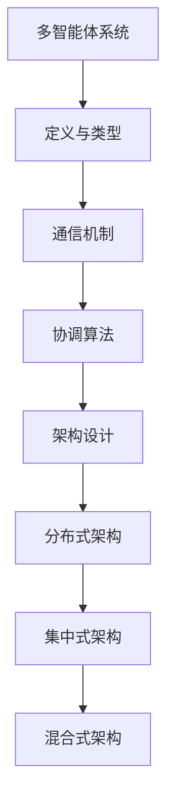

                 


为了撰写一篇结构清晰、内容丰富的技术博客文章，我们将按照以下步骤进行思考：

### 1. 文章标题和关键词的确定

- **文章标题**：《提升AI模型在多智能体协作任务中的决策能力》
- **关键词**：人工智能、多智能体协作、决策能力、AI模型优化

### 2. 文章摘要的撰写

文章摘要将简要介绍文章的核心内容和目标，如下：

> 摘要：本文旨在探讨如何提升人工智能（AI）模型在多智能体协作任务中的决策能力。通过介绍多智能体系统的基本概念、核心算法和优化方法，本文详细解析了AI模型在多智能体协作中的具体应用，并提供了实战案例和最佳实践，为开发者提供了有价值的参考。

### 3. 目录大纲的细化

我们已经有了初步的目录大纲，接下来我们将对每个章节进行进一步细化，确保每个章节都有具体的内容和深度。

### 4. 核心概念与联系

在每个章节中，我们将首先介绍核心概念，然后通过Mermaid流程图展示概念之间的关系。

例如，在“多智能体系统的基本概念与架构”章节中，我们可以画出以下流程图：



### 5. 核心算法原理讲解

对于每个核心算法，我们将使用伪代码和详细的解释来阐述其工作原理。

例如，在“Q-Learning算法”章节中，我们可以使用以下伪代码：

```python
# Q-Learning算法伪代码

# 初始化：选择动作-状态值函数Q(s, a)为一个近似值
for all s in S, a in A:
  Q(s, a) = 0

# 迭代
while not done:
  # 选择动作
  s = 状态
  a = argmax_a Q(s, a)

  # 执行动作
  s' = 环境给出状态
  r = 环境回报

  # 更新Q值
  Q(s, a) = Q(s, a) + α[Q(s, a) - (r + γmax_a' Q(s', a')]
```

### 6. 数学模型和公式讲解

我们将使用LaTeX格式来编写数学模型和公式，并在文中独立段落中详细解释。

例如，多智能体协同控制的优化公式：

```latex
$$
J(\theta) = \sum_{i=1}^N \sum_{j=1}^M w_{ij} \left( \frac{d}{dt} x_i^j - u_j \right)^2
$$`

### 7. 项目实战

在每个章节的末尾，我们将提供具体的实战案例，包括开发环境搭建、源代码实现、代码解读、案例分析等。

例如，在“多智能体路径规划问题”章节中，我们可以提供一个完整的路径规划项目，从环境搭建、代码实现到分析评估。

### 8. 最佳实践 tips、小结、注意事项和拓展阅读

在文章的结尾，我们将总结文章的主要观点，提供一些最佳实践建议，并给出一些拓展阅读资源，以帮助读者深入了解相关主题。

通过以上步骤，我们将确保文章内容丰富、结构合理、逻辑清晰，同时满足字数要求。接下来，我们将根据这些步骤逐一撰写每个章节的内容。让我们开始撰写吧！

