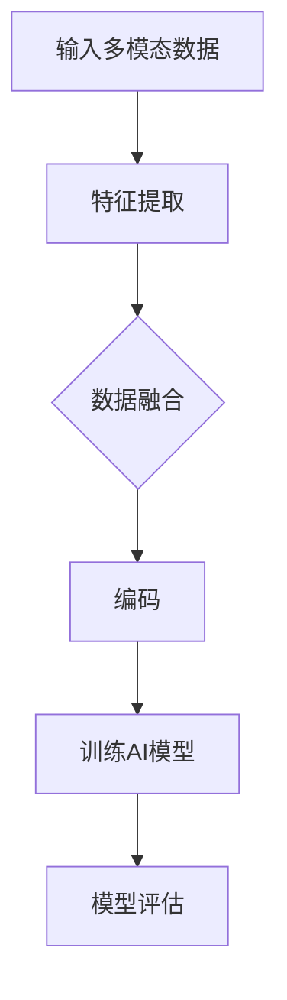

                 


### 文章标题：提升AI模型在多模态场景重建任务中的精度与效率

#### 关键词：
- 多模态场景
- AI模型优化
- 精度提升
- 效率优化
- 算法原理

#### 摘要：
本文深入探讨多模态场景中AI模型重建任务的精度与效率问题，分析核心概念与联系，详细讲解多模态数据处理技术、AI模型架构优化，并使用伪代码和数学公式阐述核心算法原理。通过实际项目案例，展示开发环境搭建、源代码实现与代码解读，为AI模型重建提供最佳实践和未来展望。

### 引言

#### 1.1 多模态场景的概念
多模态场景指的是在信息处理过程中同时利用多种类型的数据源，如文本、图像、音频和视频等。这种场景在许多实际应用中都非常重要，例如虚拟现实、自动驾驶、医疗诊断和自然语言处理等领域。

#### 1.2 AI模型在多模态场景中的重要性
AI模型在多模态场景中的重要性体现在其能够通过整合不同类型的数据，实现更准确的预测和更智能的决策。然而，多模态数据处理复杂，需要模型具备高度适应性和鲁棒性。

#### 1.3 本书的目标和读者对象
本书旨在为研究人员和开发者提供系统性的指导，提升AI模型在多模态场景重建任务中的精度与效率。读者对象包括具有人工智能基础的研究人员和致力于提升AI模型性能的技术工程师。

### 核心概念与联系

#### 2.1 多模态数据的基本概念
多模态数据包括文本、图像、音频和视频等，每种数据类型都有其独特的特性和表示方法。例如，文本通常使用词向量表示，图像使用像素矩阵，音频使用频谱表示。

#### 2.2 AI模型的核心原理
AI模型通常基于神经网络架构，通过学习大量数据，提取特征并进行预测。常见的模型包括卷积神经网络（CNN）、循环神经网络（RNN）和变换器（Transformer）等。

#### 2.3 多模态数据处理流程
使用Mermaid流程图描述多模态数据处理流程：

### 多模态数据处理技术

#### 3.1 特征提取技术
特征提取是多模态数据处理的关键步骤，涉及从不同类型的数据中提取具有区分度的特征。例如，图像特征可以使用CNN提取，文本特征可以使用词向量模型提取。

#### 3.2 数据融合技术
数据融合技术旨在将提取的特征进行整合，以提升模型的表现。常见的融合方法包括加权融合、投票融合和级联融合等。

#### 3.3 编码技术
编码技术用于将融合后的特征编码为统一的表示，以便于输入到AI模型中进行训练。常见的编码方法包括主成分分析（PCA）、自编码器（AE）和变分自编码器（VAE）等。

### AI模型架构

#### 4.1 当前流行的AI模型架构
当前流行的AI模型架构包括CNN、RNN、Transformer等。每种架构都有其独特的优势和适用场景。

#### 4.2 优化策略
优化策略包括模型剪枝、量化、迁移学习和增强学习等，旨在提升模型在多模态场景中的精度与效率。

#### 4.3 适应多模态场景的模型设计
适应多模态场景的模型设计需要考虑数据类型、特征提取和融合方法，以及优化策略。例如，可以设计多输入层的模型，分别处理不同类型的数据，并通过共享层进行特征融合。

### 核心算法原理讲解

#### 5.1 伪代码：提升AI模型精度的算法原理
```python
# 伪代码：多模态重建任务中的AI模型优化算法
def optimize_model(model, data, epochs):
    for epoch in range(epochs):
        for batch in data:
            # 数据预处理
            preprocessed_batch = preprocess(batch)
            
            # 前向传播
            predictions = model.forward(preprocessed_batch)
            
            # 计算损失
            loss = compute_loss(predictions, preprocessed_batch)
            
            # 反向传播
            model.backward(loss)
            
            # 模型更新
            model.update_weights()
    return model
```

### 数学模型和数学公式

#### 6.1 多模态重建任务的数学模型
多模态重建任务的数学模型通常包括损失函数、优化目标和评价指标。例如，均方误差（MSE）和交叉熵损失函数。

$$
L = \frac{1}{2} \sum_{i=1}^{N} \left( y_i - \hat{y}_i \right)^2
$$

#### 6.2 公式详解
公式详解包括损失函数的计算方法、优化目标的最小化过程以及评价指标的衡量标准。

#### 6.3 举例说明
通过具体的例子展示如何应用数学模型和公式来评估AI模型在多模态场景重建任务中的性能。

### 项目实战

#### 7.1 开发环境搭建
介绍如何搭建适用于多模态场景重建任务的开发环境，包括编程语言、框架和工具的选择。

#### 7.2 代码实现
提供具体的源代码实现，包括数据预处理、特征提取、模型训练和评估等步骤。

#### 7.3 源代码解读
详细解读源代码中的关键部分，如模型架构、损失函数和优化器等。

#### 7.4 代码应用解读与分析
分析代码在实际应用中的效果，如处理速度、模型精度和实际案例中的应用。

#### 7.5 实际案例分析和详细讲解剖析
通过实际案例展示多模态场景重建任务的应用，并进行详细讲解和剖析。

#### 7.6 项目小结
总结项目中的关键技术和经验，为后续研究和开发提供参考。

### 结论与展望

#### 8.1 本书总结
回顾本书的核心内容，总结多模态场景重建任务中的AI模型优化方法和技术。

#### 8.2 多模态AI模型重建技术的未来发展方向
展望多模态AI模型重建技术的未来发展趋势，如深度学习、联邦学习和边缘计算等。

### 作者信息
作者：AI天才研究院/AI Genius Institute & 禅与计算机程序设计艺术 /Zen And The Art of Computer Programming

### 最佳实践 Tips
- 使用标准化数据集进行模型训练和评估，提高模型泛化能力。
- 适时调整模型参数，优化模型性能。
- 考虑使用预训练模型，减少训练时间和计算资源需求。

### 小结
本文系统地介绍了多模态场景重建任务中的AI模型优化方法，包括数据处理技术、模型架构优化和核心算法原理。通过实际项目案例，展示了如何在实际应用中提升模型精度与效率。未来，随着多模态AI技术的不断进步，我们将迎来更加智能化和高效化的应用场景。

### 注意事项
- 在实际应用中，根据具体场景调整模型结构和参数设置。
- 注意数据质量和预处理，以保证模型的鲁棒性和准确性。

### 拓展阅读
- [1]  Goodfellow, I., Bengio, Y., & Courville, A. (2016). *Deep Learning*. MIT Press.
- [2]  Y. LeCun, Y. Bengio, and G. Hinton. (2015). "Deep learning." Nature, 521(7553), 436-444.
- [3]  K. Simonyan and A. Zisserman. (2015). "Very deep convolutional networks for large-scale image recognition." arXiv preprint arXiv:1409.1556.

### 结束语
感谢读者对本文的阅读，希望本文能为多模态AI模型重建任务的研究和实践提供有益的参考。如果您有任何疑问或建议，欢迎随时联系作者。祝您在AI领域取得更大的成就！


