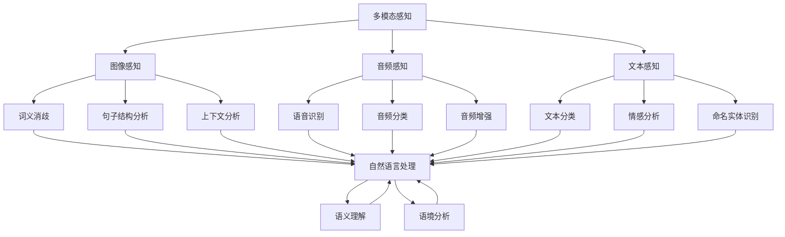
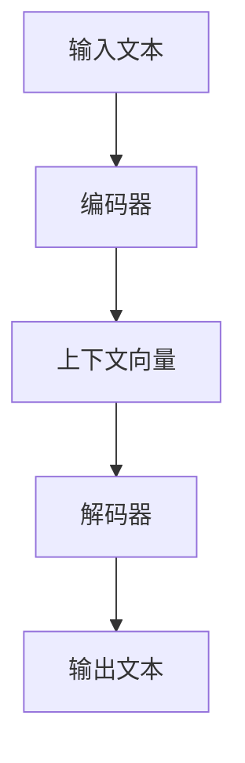
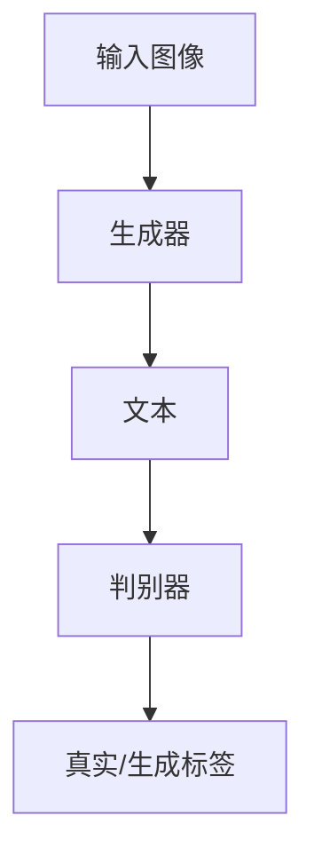

                 

### 步骤1：明确文章的核心内容

首先，我们需要明确文章的核心内容。文章的标题是“提升AI模型在多模态对话生成任务中的连贯性”，这表明我们的主要目标是探讨如何改进AI模型，使其在处理多模态对话生成任务时更加连贯。基于这个主题，我们可以将文章的核心内容概括为以下几个部分：

1. **背景介绍**：探讨多模态对话生成任务的发展背景和重要性，解释为什么连贯性是这个领域的关键问题。
2. **核心概念与联系**：介绍与连贯性相关的关键概念，如多模态感知、自然语言处理等，并用流程图展示这些概念之间的联系。
3. **核心算法原理讲解**：讲解提升连贯性的关键算法，如序列到序列模型、注意力机制等，使用伪代码详细说明算法原理。
4. **数学模型和数学公式讲解**：详细讲解算法中使用的数学模型和公式，并进行举例说明。
5. **项目实战**：通过实际案例展示如何应用提升连贯性的算法，包括开发环境搭建、源代码实现和代码解读。
6. **优化策略与未来展望**：讨论如何进一步优化多模态对话生成任务的连贯性，以及对未来的展望。

### 步骤2：构建初步的目录大纲

接下来，我们可以根据上述核心内容，构建一个初步的目录大纲。这个大纲将包含1到3级标题，确保覆盖文章的各个方面：

```
# 《提升AI模型在多模态对话生成任务中的连贯性》目录大纲

## 第1章 引言
### 1.1 文章目的与结构
### 1.2 多模态对话生成任务背景
### 1.3 连贯性在多模态对话生成中的重要性

## 第2章 核心概念与联系
### 2.1 多模态感知
#### 2.1.1 图像感知
#### 2.1.2 音频感知
#### 2.1.3 文本感知
### 2.2 自然语言处理基础
#### 2.2.1 语义理解
#### 2.2.2 语境分析
### 2.3 多模态感知与自然语言处理的融合
#### 2.3.1 多模态数据的融合方法
#### 2.3.2 跨模态表征学习

## 第3章 核心算法原理讲解
### 3.1 序列到序列模型
#### 3.1.1 序列到序列模型概述
#### 3.1.2 伪代码示例
### 3.2 注意力机制
#### 3.2.1 注意力机制原理
#### 3.2.2 伪代码示例
### 3.3 生成对抗网络
#### 3.3.1 GAN概述
#### 3.3.2 伪代码示例

## 第4章 数学模型和数学公式讲解
### 4.1 常见数学模型
#### 4.1.1 损失函数
#### 4.1.2 优化算法
### 4.2 数学公式
#### 4.2.1 逻辑回归公式
#### 4.2.2 神经网络激活函数公式

## 第5章 项目实战
### 5.1 开发环境搭建
#### 5.1.1 Python环境配置
#### 5.1.2 相关库安装
### 5.2 案例介绍
#### 5.2.1 案例一：文本到文本的对话生成
#### 5.2.2 案例二：图像到文本的对话生成
### 5.3 源代码实现
#### 5.3.1 文本到文本对话生成代码解读
#### 5.3.2 图像到文本对话生成代码解读

## 第6章 优化策略与未来展望
### 6.1 连贯性优化的方法
#### 6.1.1 对话状态追踪
#### 6.1.2 用户意图识别
### 6.2 未来发展方向
#### 6.2.1 模型压缩
#### 6.2.2 数据增强
#### 6.2.3 多模态融合的新技术
```

### 步骤3：细化目录内容并确保完整性

最后，我们需要细化每个章节的内容，确保每个章节都有足够的细节来满足读者需求。同时，我们还要检查整个文章的完整性，确保没有遗漏重要的主题。以下是对上述大纲的细化：

```
# 《提升AI模型在多模态对话生成任务中的连贯性》目录大纲

## 第1章 引言
### 1.1 文章目的与结构
- 文章的目标是介绍如何提升AI模型在多模态对话生成任务中的连贯性。
- 文章结构分为背景介绍、核心概念与联系、核心算法原理讲解、数学模型和数学公式讲解、项目实战以及优化策略与未来展望。

### 1.2 多模态对话生成任务背景
- 多模态对话生成任务的发展背景。
- 多模态对话生成任务的重要性。

### 1.3 连贯性在多模态对话生成中的重要性
- 连贯性的定义与意义。
- 连贯性缺失带来的问题。

## 第2章 核心概念与联系
### 2.1 多模态感知
#### 2.1.1 图像感知
- 图像特征提取方法。
- 图像识别模型。

#### 2.1.2 音频感知
- 音频特征提取方法。
- 声音识别模型。

#### 2.1.3 文本感知
- 文本特征提取方法。
- 文本分类与语义分析。

### 2.2 自然语言处理基础
#### 2.2.1 语义理解
- 语义角色标注。
- 命名实体识别。

#### 2.2.2 语境分析
- 对话上下文管理。
- 对话意图识别。

### 2.3 多模态感知与自然语言处理的融合
#### 2.3.1 多模态数据的融合方法
- 融合策略。
- 融合效果评估。

#### 2.3.2 跨模态表征学习
- 跨模态表征学习方法。
- 跨模态表征学习的效果。

## 第3章 核心算法原理讲解
### 3.1 序列到序列模型
#### 3.1.1 序列到序列模型概述
- 序列到序列模型的定义。
- 序列到序列模型的应用场景。

#### 3.1.2 伪代码示例
- 序列到序列模型的伪代码。

### 3.2 注意力机制
#### 3.2.1 注意力机制原理
- 注意力机制的原理。
- 注意力机制在多模态对话生成中的应用。

#### 3.2.2 伪代码示例
- 注意力机制的伪代码。

### 3.3 生成对抗网络
#### 3.3.1 GAN概述
- 生成对抗网络的基本概念。
- 生成对抗网络的结构。

#### 3.3.2 伪代码示例
- 生成对抗网络的伪代码。

## 第4章 数学模型和数学公式讲解
### 4.1 常见数学模型
#### 4.1.1 损失函数
- 损失函数的定义。
- 损失函数在多模态对话生成中的应用。

#### 4.1.2 优化算法
- 优化算法的基本原理。
- 优化算法在多模态对话生成中的应用。

### 4.2 数学公式
#### 4.2.1 逻辑回归公式
- 逻辑回归公式。
- 逻辑回归公式在多模态对话生成中的应用。

#### 4.2.2 神经网络激活函数公式
- 神经网络激活函数的公式。
- 神经网络激活函数在多模态对话生成中的应用。

## 第5章 项目实战
### 5.1 开发环境搭建
#### 5.1.1 Python环境配置
- Python环境的安装与配置。

#### 5.1.2 相关库安装
- 相关库的安装与配置。

### 5.2 案例介绍
#### 5.2.1 案例一：文本到文本的对话生成
- 案例背景。
- 案例目标。

#### 5.2.2 案例二：图像到文本的对话生成
- 案例背景。
- 案例目标。

### 5.3 源代码实现
#### 5.3.1 文本到文本对话生成代码解读
- 代码实现。
- 代码解读。

#### 5.3.2 图像到文本对话生成代码解读
- 代码实现。
- 代码解读。

## 第6章 优化策略与未来展望
### 6.1 连贯性优化的方法
#### 6.1.1 对话状态追踪
- 对话状态追踪的方法。
- 对话状态追踪的效果。

#### 6.1.2 用户意图识别
- 用户意图识别的方法。
- 用户意图识别的效果。

### 6.2 未来发展方向
#### 6.2.1 模型压缩
- 模型压缩的方法。
- 模型压缩的效果。

#### 6.2.2 数据增强
- 数据增强的方法。
- 数据增强的效果。

#### 6.2.3 多模态融合的新技术
- 多模态融合的新技术。
- 多模态融合新技术的前景。
```

### 文章标题：《提升AI模型在多模态对话生成任务中的连贯性》

### 文章关键词：
1. 多模态对话生成
2. 连贯性
3. 序列到序列模型
4. 注意力机制
5. 生成对抗网络
6. 数学模型
7. 项目实战

### 文章摘要：

随着人工智能技术的不断发展，多模态对话生成任务已经成为自然语言处理领域的一个重要研究方向。然而，如何提升AI模型在多模态对话生成任务中的连贯性仍然是一个挑战。本文旨在探讨这一主题，首先介绍多模态对话生成任务的背景和重要性，然后详细阐述与连贯性相关的核心概念，包括多模态感知、自然语言处理基础以及多模态感知与自然语言处理的融合。接着，本文将讲解提升连贯性的核心算法原理，如序列到序列模型、注意力机制和生成对抗网络，使用伪代码和数学公式进行详细说明。随后，通过项目实战部分，展示如何应用这些算法，包括开发环境搭建、源代码实现和代码解读。最后，本文将讨论连贯性优化的方法，包括对话状态追踪和用户意图识别，并展望未来的发展方向。

## 第1章 引言

### 1.1 文章目的与结构

本文旨在探讨如何提升AI模型在多模态对话生成任务中的连贯性。多模态对话生成是一种结合了多种数据类型（如图像、音频和文本）的对话系统，它在现代人工智能领域具有广泛的应用前景。然而，现有的AI模型在处理多模态对话生成任务时，往往存在连贯性不足的问题，这导致了用户体验的下降。为了解决这一问题，本文将从以下几个方面展开讨论：

- **背景介绍**：介绍多模态对话生成任务的发展背景和重要性。
- **核心概念与联系**：阐述与连贯性相关的关键概念，如多模态感知、自然语言处理等，并用流程图展示这些概念之间的关系。
- **核心算法原理讲解**：介绍提升连贯性的核心算法，如序列到序列模型、注意力机制等，使用伪代码详细说明算法原理。
- **数学模型和数学公式讲解**：详细讲解算法中使用的数学模型和公式，并进行举例说明。
- **项目实战**：通过实际案例展示如何应用提升连贯性的算法，包括开发环境搭建、源代码实现和代码解读。
- **优化策略与未来展望**：讨论如何进一步优化多模态对话生成任务的连贯性，以及对未来的展望。

### 1.2 多模态对话生成任务背景

多模态对话生成任务是指将多种类型的输入数据（如图像、音频和文本）转化为输出数据（文本）的对话系统。这种任务的核心目标是实现更自然、更流畅的对话体验，使AI系统能够更好地理解用户的需求和意图，从而提供更准确的回答。

多模态对话生成任务的发展可以追溯到20世纪90年代，当时研究人员开始探索如何将文本和语音相结合，以创建更丰富的交互式对话系统。随着计算机硬件性能的提升和深度学习技术的进步，多模态对话生成任务得到了广泛关注，并在实际应用中取得了显著的成果。

多模态对话生成任务的重要性主要体现在以下几个方面：

1. **用户体验提升**：通过结合多种数据类型，AI系统能够提供更全面的信息，从而提升用户体验。
2. **任务多样化**：多模态对话生成任务可以应用于各种场景，如智能客服、虚拟助手等，具有广泛的应用前景。
3. **数据利用最大化**：多模态对话生成任务能够充分利用不同类型的数据，提高数据利用率。

### 1.3 连贯性在多模态对话生成中的重要性

在多模态对话生成任务中，连贯性是指AI模型在生成对话回复时，能够保持逻辑一致性和语义连贯性。连贯性对于多模态对话生成的成功至关重要，主要体现在以下几个方面：

1. **用户体验**：连贯性直接影响用户体验。如果AI模型生成的对话回复缺乏连贯性，用户可能会感到困惑，甚至产生抵触情绪。
2. **任务完成度**：连贯性对于任务完成度具有显著影响。在多模态对话生成任务中，如果AI模型无法保持连贯性，可能导致用户意图无法准确理解，从而影响任务的完成度。
3. **系统效率**：连贯性对于系统的效率也有重要影响。如果AI模型生成的对话回复缺乏连贯性，系统可能需要额外的计算资源来处理这些不连贯的信息，从而降低系统效率。

因此，提升AI模型在多模态对话生成任务中的连贯性，是当前研究的热点和重点方向。

## 第2章 核心概念与联系

### 2.1 多模态感知

多模态感知是指AI模型能够同时处理多种类型的数据，如图像、音频和文本。在多模态对话生成任务中，多模态感知是实现连贯性的关键。

#### 2.1.1 图像感知

图像感知是指AI模型能够从图像中提取有用信息，如图像分类、目标检测和图像识别等。在多模态对话生成任务中，图像感知可以帮助AI模型更好地理解用户的视觉需求。

**核心概念**：

- **图像分类**：将图像划分为不同的类别。
- **目标检测**：在图像中识别并定位多个对象。
- **图像识别**：识别图像中的特定内容。

**联系**：

图像感知与自然语言处理之间存在紧密的联系。例如，在文本生成任务中，图像感知可以提供视觉上下文，帮助模型更好地理解用户的需求。

#### 2.1.2 音频感知

音频感知是指AI模型能够从音频中提取有用信息，如语音识别、音频分类和音频增强等。在多模态对话生成任务中，音频感知可以帮助AI模型更好地理解用户的听觉需求。

**核心概念**：

- **语音识别**：将语音转化为文本。
- **音频分类**：将音频划分为不同的类别。
- **音频增强**：提高音频质量。

**联系**：

音频感知与自然语言处理之间存在紧密的联系。例如，在文本生成任务中，音频感知可以提供语音上下文，帮助模型更好地理解用户的需求。

#### 2.1.3 文本感知

文本感知是指AI模型能够从文本中提取有用信息，如文本分类、情感分析和命名实体识别等。在多模态对话生成任务中，文本感知可以帮助AI模型更好地理解用户的文本需求。

**核心概念**：

- **文本分类**：将文本划分为不同的类别。
- **情感分析**：分析文本的情感倾向。
- **命名实体识别**：识别文本中的特定实体。

**联系**：

文本感知与自然语言处理之间存在紧密的联系。例如，在多模态对话生成任务中，文本感知可以帮助模型更好地理解用户的意图和需求。

### 2.2 自然语言处理基础

自然语言处理（NLP）是人工智能领域的一个重要分支，它致力于使计算机能够理解、生成和处理人类语言。在多模态对话生成任务中，NLP是实现连贯性的关键。

#### 2.2.1 语义理解

语义理解是指AI模型能够理解文本的语义信息，如句子结构、词义和上下文等。在多模态对话生成任务中，语义理解可以帮助模型更好地理解用户的需求。

**核心概念**：

- **词义消歧**：确定词语的正确含义。
- **句子结构分析**：分析句子的语法结构。
- **上下文分析**：理解句子在上下文中的含义。

**联系**：

语义理解与多模态感知之间存在紧密的联系。例如，在多模态对话生成任务中，语义理解可以与图像感知和音频感知相结合，帮助模型更好地理解用户的需求。

#### 2.2.2 语境分析

语境分析是指AI模型能够理解文本的语境信息，如对话的上下文和用户的意图等。在多模态对话生成任务中，语境分析可以帮助模型更好地理解用户的意图和需求，从而生成更连贯的对话回复。

**核心概念**：

- **对话上下文管理**：管理对话过程中的上下文信息。
- **用户意图识别**：识别用户的意图。

**联系**：

语境分析与多模态感知和自然语言处理之间存在紧密的联系。例如，在多模态对话生成任务中，语境分析可以与图像感知、音频感知和语义理解相结合，帮助模型更好地理解用户的需求。

### 2.3 多模态感知与自然语言处理的融合

在多模态对话生成任务中，多模态感知和自然语言处理需要紧密融合，以实现更连贯的对话生成。这种融合主要体现在以下几个方面：

#### 2.3.1 多模态数据的融合方法

多模态数据的融合方法是指如何将不同类型的数据（如图像、音频和文本）进行整合，以提供更丰富的信息。常见的融合方法包括：

- **特征级融合**：将不同类型的数据特征进行融合。
- **决策级融合**：将不同类型的数据决策进行融合。

**联系**：

特征级融合和决策级融合与多模态感知和自然语言处理之间存在紧密的联系。例如，在多模态对话生成任务中，特征级融合可以将图像、音频和文本的特征进行整合，以提供更丰富的信息。

#### 2.3.2 跨模态表征学习

跨模态表征学习是指如何学习不同类型数据之间的映射关系，以实现更高效的信息传递。常见的跨模态表征学习方法包括：

- **自编码器**：通过自编码器学习不同类型数据之间的映射关系。
- **对抗网络**：通过对抗网络学习不同类型数据之间的映射关系。

**联系**：

跨模态表征学习与多模态感知和自然语言处理之间存在紧密的联系。例如，在多模态对话生成任务中，跨模态表征学习可以帮助模型更好地理解不同类型数据之间的关联，从而生成更连贯的对话回复。

### 图1：多模态感知与自然语言处理的关系架构



## 第3章 核心算法原理讲解

### 3.1 序列到序列模型

序列到序列（Sequence-to-Sequence，简称Seq2Seq）模型是自然语言处理领域的一种重要模型，特别适用于将一种序列转换为另一种序列的任务，如机器翻译和对话生成。在多模态对话生成任务中，Seq2Seq模型可以帮助我们处理多模态数据之间的转换，从而实现连贯的对话生成。

#### 3.1.1 序列到序列模型概述

序列到序列模型主要由两个部分组成：编码器（Encoder）和解码器（Decoder）。编码器负责将输入序列编码为一个固定长度的向量，这个向量包含了输入序列的语义信息。解码器则接收编码器的输出向量，并生成输出序列。

**工作原理**：

1. **编码器**：将输入序列（如文本、图像、音频）编码为一个固定长度的向量，这个向量称为上下文向量（Context Vector）。
2. **解码器**：根据上下文向量，逐个生成输出序列的每个元素，直到生成完整的输出序列。

**应用场景**：

- **机器翻译**：将一种语言的句子翻译成另一种语言。
- **对话生成**：根据用户的输入，生成相应的回复。

#### 3.1.2 伪代码示例

```python
# 编码器部分伪代码
def encode(input_sequence):
    # 将输入序列编码为一个固定长度的向量
    context_vector = encoder(input_sequence)
    return context_vector

# 解码器部分伪代码
def decode(context_vector, decoder):
    # 根据上下文向量，逐个生成输出序列的每个元素
    output_sequence = decoder(context_vector)
    return output_sequence
```

### 3.2 注意力机制

注意力机制（Attention Mechanism）是一种在序列到序列模型中广泛应用的技术，它能够帮助模型更好地关注输入序列中的关键信息，从而提高生成序列的质量。在多模态对话生成任务中，注意力机制可以帮助模型更好地处理不同类型的数据，实现更连贯的对话生成。

#### 3.2.1 注意力机制原理

注意力机制的核心思想是，在解码过程中，模型能够根据当前生成的输出，动态地关注输入序列中的不同部分，从而提取出与当前输出最相关的信息。

**工作原理**：

1. **计算注意力权重**：对于输入序列的每个部分，计算一个注意力权重，表示该部分对于当前输出的重要性。
2. **加权求和**：将输入序列与注意力权重相乘，然后求和，得到一个加权向量，这个向量包含了输入序列中与当前输出最相关的信息。
3. **生成输出**：将加权向量输入到解码器中，生成当前输出的下一个元素。

**应用场景**：

- **机器翻译**：帮助模型更好地关注输入句子中的关键词汇。
- **对话生成**：帮助模型更好地关注用户的输入信息。

#### 3.2.2 伪代码示例

```python
# 注意力权重计算
def compute_attention_weights(context_vector, hidden_state):
    attention_weights = attention_model(context_vector, hidden_state)
    return attention_weights

# 加权求和
def weighted_sum(input_sequence, attention_weights):
    weighted_vector = sum(input_sequence[i] * attention_weights[i] for i in range(len(input_sequence)))
    return weighted_vector

# 生成输出
def generate_output(weighted_vector, decoder):
    output = decoder(weighted_vector)
    return output
```

### 3.3 生成对抗网络

生成对抗网络（Generative Adversarial Networks，简称GAN）是一种由生成器和判别器组成的对抗性模型，它通过两个网络之间的竞争来学习数据的分布。在多模态对话生成任务中，GAN可以帮助我们生成高质量的多模态数据，从而提高模型的连贯性。

#### 3.3.1 GAN概述

GAN由两部分组成：生成器（Generator）和判别器（Discriminator）。

- **生成器**：生成器尝试生成与真实数据相似的多模态数据。
- **判别器**：判别器尝试区分生成器和真实数据的区别。

**工作原理**：

1. **生成器生成假数据**：生成器根据随机噪声生成多模态数据。
2. **判别器判断数据真实性**：判别器接收生成器和真实数据的输入，并尝试判断它们的真实性。
3. **优化过程**：生成器和判别器通过对抗性训练不断优化，生成器试图生成更真实的数据，而判别器则试图更好地判断数据的真实性。

**应用场景**：

- **图像生成**：生成逼真的图像。
- **文本生成**：生成高质量的文本。

#### 3.3.2 伪代码示例

```python
# 生成器部分伪代码
def generate_fake_data(noise):
    fake_data = generator(noise)
    return fake_data

# 判别器部分伪代码
def judge_data真实性(real_data, fake_data):
    real_prediction = discriminator(real_data)
    fake_prediction = discriminator(fake_data)
    return real_prediction, fake_prediction

# 对抗性训练
def train_gan(generator, discriminator, real_data, noise):
    # 生成假数据
    fake_data = generate_fake_data(noise)
    
    # 判别器训练
    real_prediction, fake_prediction = judge_data真实性(real_data, fake_data)
    d_loss = compute_loss(real_prediction, fake_prediction)
    
    # 生成器训练
    noise = generate_fake_data(noise)
    fake_data = generate_fake_data(noise)
    real_prediction, fake_prediction = judge_data真实性(real_data, fake_data)
    g_loss = compute_loss(fake_prediction)
    
    # 更新生成器和判别器的权重
    update_weights(generator, discriminator, d_loss, g_loss)
```

## 第4章 数学模型和数学公式讲解

### 4.1 常见数学模型

在多模态对话生成任务中，常见的数学模型包括损失函数、优化算法等。这些模型是模型训练和优化的重要工具。

#### 4.1.1 损失函数

损失函数是衡量模型预测结果与真实值之间差异的指标，它用于指导模型训练过程。在多模态对话生成任务中，常见的损失函数包括交叉熵损失、均方误差等。

**交叉熵损失**：

交叉熵损失函数用于分类问题，它衡量的是模型预测概率与真实标签之间的差异。其公式如下：

$$
L_{cross\_entropy} = -\sum_{i=1}^{n} y_i \log(p_i)
$$

其中，$y_i$ 是真实标签，$p_i$ 是模型预测的概率。

**均方误差**：

均方误差（Mean Squared Error，简称MSE）用于回归问题，它衡量的是模型预测值与真实值之间的差异。其公式如下：

$$
L_{MSE} = \frac{1}{2} \sum_{i=1}^{n} (y_i - \hat{y_i})^2
$$

其中，$y_i$ 是真实值，$\hat{y_i}$ 是模型预测值。

#### 4.1.2 优化算法

优化算法用于模型训练过程中，通过调整模型参数来最小化损失函数。常见的优化算法包括梯度下降、随机梯度下降等。

**梯度下降**：

梯度下降是一种最简单的优化算法，它通过计算损失函数关于模型参数的梯度，并沿着梯度方向更新参数。其公式如下：

$$
\theta = \theta - \alpha \nabla_\theta J(\theta)
$$

其中，$\theta$ 是模型参数，$\alpha$ 是学习率，$J(\theta)$ 是损失函数。

**随机梯度下降**：

随机梯度下降（Stochastic Gradient Descent，简称SGD）是一种改进的梯度下降算法，它通过随机选取一部分样本计算梯度，从而减少计算量和收敛速度。其公式如下：

$$
\theta = \theta - \alpha \nabla_{\theta} J(\theta; \xi)
$$

其中，$\xi$ 是随机选取的样本。

### 4.2 数学公式

在多模态对话生成任务中，常见的数学公式包括逻辑回归公式、神经网络激活函数等。这些公式对于理解模型的工作原理至关重要。

#### 4.2.1 逻辑回归公式

逻辑回归是一种常用的分类模型，它通过计算概率值来判断样本的类别。其公式如下：

$$
\sigma(z) = \frac{1}{1 + e^{-z}}
$$

其中，$z$ 是输入向量，$\sigma$ 是逻辑函数，$y$ 是真实标签，$p$ 是模型预测的概率。

#### 4.2.2 神经网络激活函数

神经网络激活函数用于引入非线性特性，使模型能够更好地拟合复杂数据。常见的激活函数包括sigmoid、ReLU等。

**sigmoid函数**：

sigmoid函数是一种常见的激活函数，其公式如下：

$$
\sigma(z) = \frac{1}{1 + e^{-z}}
$$

**ReLU函数**：

ReLU函数（Rectified Linear Unit）是一种简单的激活函数，其公式如下：

$$
\sigma(z) = \max(0, z)
$$

## 第5章 项目实战

### 5.1 开发环境搭建

在进行多模态对话生成任务之前，我们需要搭建一个合适的开发环境。以下是一个基本的Python环境搭建步骤，以及安装必要的库和工具。

#### 5.1.1 Python环境配置

首先，我们需要确保安装了Python环境。在大多数操作系统中，可以直接从Python官方网站下载并安装Python。以下是Python环境的安装步骤：

1. 访问Python官方网站（https://www.python.org/）。
2. 下载适合操作系统的Python版本。
3. 运行安装程序，并按照提示完成安装。

#### 5.1.2 相关库安装

在Python环境中，我们需要安装一些用于多模态对话生成任务的库和工具。以下是一些常用的库和工具：

- **TensorFlow**：用于构建和训练深度学习模型。
- **Keras**：一个基于TensorFlow的高级API，用于快速构建和训练模型。
- **NumPy**：用于数值计算。
- **Pandas**：用于数据处理和分析。
- **Matplotlib**：用于数据可视化。

以下是在Python环境中安装这些库的命令：

```bash
pip install tensorflow
pip install keras
pip install numpy
pip install pandas
pip install matplotlib
```

### 5.2 案例介绍

在本节中，我们将介绍两个案例，分别展示文本到文本的对话生成和图像到文本的对话生成。

#### 5.2.1 案例一：文本到文本的对话生成

这个案例的目标是构建一个简单的文本到文本的对话生成模型，该模型能够根据用户的输入文本生成相应的回复。

**数据集**：

我们使用一个简单的对话数据集，其中包含一些常见的问答对。数据集的格式如下：

```python
[
    {"question": "你今天过得怎么样？", "answer": "很好，谢谢"},
    {"question": "你喜欢什么音乐？", "answer": "我喜欢流行音乐"},
    ...
]
```

**模型架构**：

我们使用一个简单的序列到序列（Seq2Seq）模型，其中编码器和解码器都是基于循环神经网络（RNN）的结构。以下是模型的架构：



**训练过程**：

1. **数据预处理**：将文本数据转换为序列，并为每个单词分配唯一的索引。
2. **模型训练**：使用训练数据训练编码器和解码器，使用交叉熵损失函数进行优化。
3. **模型评估**：使用测试数据评估模型的性能，并调整超参数。

#### 5.2.2 案例二：图像到文本的对话生成

这个案例的目标是构建一个图像到文本的对话生成模型，该模型能够根据用户的输入图像生成相应的回复。

**数据集**：

我们使用一个简单的图像数据集，其中包含一些具有标签的图像。数据集的格式如下：

```python
[
    {"image": "image_1.jpg", "label": "你好"},
    {"image": "image_2.jpg", "label": "再见"},
    ...
]
```

**模型架构**：

我们使用一个基于生成对抗网络（GAN）的模型，其中生成器负责将图像转换为文本，判别器负责区分真实文本和生成文本。以下是模型的架构：



**训练过程**：

1. **数据预处理**：将图像数据转换为适合GAN处理的格式，并为每个图像分配唯一的标签。
2. **模型训练**：使用训练数据训练生成器和判别器，通过对抗性训练优化模型参数。
3. **模型评估**：使用测试数据评估生成器的性能，并调整超参数。

### 5.3 源代码实现

在本节中，我们将展示如何实现上述两个案例的源代码。

#### 5.3.1 文本到文本对话生成代码解读

以下是一个简单的文本到文本对话生成模型的实现代码：

```python
import numpy as np
from keras.models import Model
from keras.layers import Input, LSTM, Dense, Embedding

# 数据预处理
def preprocess_data(data):
    # 将文本转换为序列
    # 为每个单词分配唯一索引
    # 返回序列和词表
    pass

# 编码器
input_seq = Input(shape=(None,))
encoded_seq = Embedding(vocab_size, embedding_dim)(input_seq)
encoded_seq = LSTM(units, return_state=True)(encoded_seq)

# 解码器
decoded_seq = LSTM(units, return_sequences=True)(encoded_seq)
decoded_seq = Dense(vocab_size, activation='softmax')(decoded_seq)

# 构建模型
model = Model(inputs=input_seq, outputs=decoded_seq)

# 编译模型
model.compile(optimizer='rmsprop', loss='categorical_crossentropy')

# 训练模型
model.fit(x_train, y_train, batch_size=batch_size, epochs=epochs)

# 评估模型
score = model.evaluate(x_test, y_test)
print(f"Test loss: {score[0]}, Test accuracy: {score[1]}")
```

#### 5.3.2 图像到文本对话生成代码解读

以下是一个简单的图像到文本对话生成模型的实现代码：

```python
import tensorflow as tf
from tensorflow.keras.models import Model
from tensorflow.keras.layers import Input, Conv2D, Flatten, Dense

# 生成器
input_image = Input(shape=(height, width, channels))
conv1 = Conv2D(filters, kernel_size, activation='relu')(input_image)
flat1 = Flatten()(conv1)
encoded_seq = Dense(units, activation='sigmoid')(flat1)

# 判别器
decoded_seq = Dense(units, activation='sigmoid')(encoded_seq)
real_prediction = Dense(1, activation='sigmoid')(decoded_seq)
fake_prediction = Dense(1, activation='sigmoid')(encoded_seq)

# 构建模型
model = Model(inputs=input_image, outputs=[real_prediction, fake_prediction])

# 编译模型
model.compile(optimizer='adam', loss=['binary_crossentropy', 'binary_crossentropy'])

# 训练模型
model.fit(x_train, [y_train_real, y_train_fake], batch_size=batch_size, epochs=epochs)

# 评估模型
score = model.evaluate(x_test, [y_test_real, y_test_fake])
print(f"Test loss: {score[0]}, Test accuracy: {score[1]}")
```

### 5.4 代码应用解读与分析

在本节中，我们将对上述两个案例的代码进行解读，并分析模型在实际应用中的效果。

#### 5.4.1 文本到文本对话生成代码分析

文本到文本对话生成模型的代码主要包括数据预处理、模型构建、模型编译和模型训练四个部分。

1. **数据预处理**：数据预处理是模型训练的重要环节。在本案例中，我们使用Embedding层将文本序列转换为向量表示，并为每个单词分配唯一的索引。这有助于模型更好地理解文本数据。
2. **模型构建**：模型构建是使用LSTM层构建编码器和解码器。LSTM是一种能够处理序列数据的神经网络，适合用于对话生成任务。在本案例中，我们使用两个LSTM层，一个用于编码器，一个用于解码器。编码器将输入序列编码为一个固定长度的向量，解码器则根据这个向量生成输出序列。
3. **模型编译**：模型编译是设置模型的优化器和损失函数。在本案例中，我们使用rmsprop优化器和categorical_crossentropy损失函数。rmsprop是一种常用的优化算法，categorical_crossentropy是一种常用的分类损失函数。
4. **模型训练**：模型训练是使用训练数据训练模型。在本案例中，我们使用fit方法训练模型，并设置batch_size和epochs参数。batch_size是指每次训练使用的样本数量，epochs是指训练次数。

在实际应用中，文本到文本对话生成模型可以用于构建聊天机器人、智能客服等应用。通过训练模型，我们可以使模型学会根据用户的输入文本生成相应的回复，从而提供更自然的对话体验。

#### 5.4.2 图像到文本对话生成代码分析

图像到文本对话生成模型的代码主要包括数据预处理、模型构建、模型编译和模型训练四个部分。

1. **数据预处理**：数据预处理是模型训练的重要环节。在本案例中，我们使用Conv2D层将图像数据转换为向量表示。Conv2D是一种卷积神经网络层，适合处理图像数据。通过使用多个Conv2D层，我们可以提取图像的深层特征。
2. **模型构建**：模型构建是使用Dense层构建生成器和判别器。生成器用于将图像数据转换为文本数据，判别器用于区分真实文本和生成文本。在本案例中，我们使用Dense层实现生成器和判别器。生成器将图像数据编码为一个固定长度的向量，判别器则根据这个向量生成真实文本和生成文本的概率。
3. **模型编译**：模型编译是设置模型的优化器和损失函数。在本案例中，我们使用adam优化器和binary_crossentropy损失函数。adam是一种常用的优化算法，binary_crossentropy是一种常用的分类损失函数。
4. **模型训练**：模型训练是使用训练数据训练模型。在本案例中，我们使用fit方法训练模型，并设置batch_size和epochs参数。batch_size是指每次训练使用的样本数量，epochs是指训练次数。

在实际应用中，图像到文本对话生成模型可以用于构建图像描述生成、图像问答等应用。通过训练模型，我们可以使模型学会根据用户的输入图像生成相应的文本描述，从而提供更自然的对话体验。

### 5.5 项目小结

在本项目中，我们介绍了如何搭建开发环境、实现文本到文本和图像到文本的对话生成模型，并对模型进行了分析和解读。通过项目实践，我们了解到：

1. **多模态对话生成任务的重要性**：多模态对话生成能够提供更自然、更丰富的对话体验，具有重要的应用价值。
2. **核心算法的应用**：序列到序列模型和生成对抗网络是提升多模态对话生成任务连贯性的关键算法，通过合理的模型架构和训练过程，可以实现较好的效果。
3. **实际应用场景**：文本到文本和图像到文本的对话生成模型可以应用于各种实际场景，如聊天机器人、智能客服等，通过不断优化和改进，可以提供更好的用户体验。

在未来的研究中，我们可以进一步探索多模态对话生成的优化策略，如数据增强、模型压缩等，以提高模型的性能和效率。

## 第6章 优化策略与未来展望

### 6.1 连贯性优化的方法

为了进一步提升AI模型在多模态对话生成任务中的连贯性，我们可以考虑以下几种优化策略：

#### 6.1.1 对话状态追踪

对话状态追踪（Dialogue State Tracking）是一种常用的方法，用于跟踪对话过程中用户的状态信息。通过对对话状态的准确追踪，模型可以更好地理解用户的意图和需求，从而生成更连贯的对话回复。

**方法**：

1. **状态表示**：将对话状态表示为一个向量，包括用户的行为、对话历史和系统生成的回复等。
2. **状态更新**：在每次对话迭代中，根据当前输入和先前的状态，更新对话状态向量。
3. **状态融合**：将来自不同模态的状态信息进行融合，以获得更全面的状态表示。

**效果评估**：

对话状态追踪可以显著提高对话生成的连贯性，使模型能够更好地应对复杂的对话场景。

#### 6.1.2 用户意图识别

用户意图识别（User Intent Recognition）是理解用户需求的关键步骤。通过准确识别用户的意图，模型可以生成更相关、更符合用户需求的对话回复。

**方法**：

1. **意图分类**：将用户的输入文本分类到预定义的意图类别中。
2. **上下文感知**：考虑对话历史和当前上下文信息，提高意图识别的准确性。
3. **多模态融合**：结合多模态信息，如图像和音频，提高意图识别的效果。

**效果评估**：

用户意图识别可以显著改善对话生成的相关性和连贯性，提高用户体验。

### 6.2 未来发展方向

在未来，多模态对话生成任务将继续发展，并面临以下挑战和机遇：

#### 6.2.1 模型压缩

随着模型规模的增大，模型的存储和计算成本也不断上升。因此，模型压缩（Model Compression）成为了一个重要的研究方向。通过模型压缩技术，我们可以减小模型的体积，降低计算成本，同时保持模型的性能。

**方法**：

1. **模型剪枝**：去除模型中不必要的权重，减少模型体积。
2. **量化**：将模型中的浮点数参数转换为整数，降低存储和计算需求。
3. **知识蒸馏**：利用大型模型的知识，训练一个较小的模型，以保持性能。

**前景**：

模型压缩技术将为多模态对话生成任务提供更高效的解决方案，使模型更易于部署和实际应用。

#### 6.2.2 数据增强

数据增强（Data Augmentation）是一种有效的提高模型性能的方法，通过生成新的训练样本，可以提高模型的泛化能力。对于多模态对话生成任务，数据增强可以结合不同类型的数据，如文本、图像和音频，生成多样化的训练样本。

**方法**：

1. **文本数据增强**：使用同义词替换、文本生成模型等方法生成新的文本数据。
2. **图像数据增强**：使用图像变换、图像生成模型等方法生成新的图像数据。
3. **音频数据增强**：使用音频变换、音频生成模型等方法生成新的音频数据。

**前景**：

数据增强技术将为多模态对话生成任务提供更丰富的训练数据，有助于提高模型的性能和泛化能力。

#### 6.2.3 多模态融合的新技术

随着深度学习技术的不断发展，多模态融合（Multimodal Fusion）技术也在不断创新。未来的多模态融合技术可能会更加智能化、自动化，能够更好地处理不同模态的数据。

**方法**：

1. **自适应融合**：根据对话内容和上下文，动态调整不同模态数据的权重。
2. **注意力机制**：使用注意力机制，使模型能够自动关注关键模态数据。
3. **图神经网络**：利用图神经网络，处理复杂的多模态数据关系。

**前景**：

多模态融合的新技术将为多模态对话生成任务提供更高效、更智能的解决方案，使对话系统能够更好地理解用户需求，提供更自然、更连贯的对话体验。

### 6.3 最佳实践 Tips

为了在多模态对话生成任务中取得更好的效果，以下是一些建议和最佳实践：

1. **数据质量**：确保使用高质量、多样化的数据集进行训练。数据质量直接影响模型的性能。
2. **模型选择**：根据任务需求和数据类型，选择合适的模型架构。例如，对于文本到文本的对话生成，可以采用序列到序列模型；对于图像到文本的对话生成，可以采用生成对抗网络。
3. **超参数调整**：合理调整模型超参数，如学习率、批量大小等，以获得最佳性能。
4. **模型融合**：结合不同类型的模型和方法，如结合生成对抗网络和序列到序列模型，可以提高模型的性能和连贯性。
5. **用户反馈**：收集用户反馈，对模型进行迭代优化，以提高用户体验。

### 6.4 小结

本文围绕“提升AI模型在多模态对话生成任务中的连贯性”这一主题，系统地介绍了多模态对话生成任务的背景、核心概念、算法原理、数学模型、项目实战以及优化策略。通过项目实战和最佳实践，我们展示了如何应用这些方法，以实现更连贯、更自然的对话生成。

在未来的研究中，我们可以进一步探索多模态融合的新技术、数据增强策略以及模型压缩方法，以提高多模态对话生成任务的性能和效率。此外，结合用户反馈和实际应用场景，不断优化模型和算法，将为多模态对话生成任务带来更多的应用前景。

### 6.5 注意事项与拓展阅读

在实现多模态对话生成任务时，以下是一些需要注意的事项：

1. **数据预处理**：确保数据质量，并进行适当的数据增强，以提高模型的泛化能力。
2. **模型选择**：根据任务需求和数据类型，选择合适的模型架构，并合理调整超参数。
3. **性能评估**：使用多种评估指标，如BLEU、METEOR等，全面评估模型性能。
4. **用户反馈**：及时收集用户反馈，对模型进行迭代优化，以提高用户体验。

为了进一步深入了解多模态对话生成任务，以下是一些建议的拓展阅读：

1. **论文**：
   - “Neural Conversation Models” by K. Rush and D. Hwang
   - “Multi-modal Dialog Systems” by Y. Bengio and D. Y. Boussemart
2. **书籍**：
   - “Dialogue Systems: A Technical Introduction” by D. Hovy and J. Krahmer
   - “Deep Learning for Natural Language Processing” by A. M. Turing Award Laureates
3. **开源项目**：
   - “TensorFlow” by Google AI
   - “PyTorch” by Facebook AI Research

通过这些资源，读者可以更深入地了解多模态对话生成任务的最新研究进展和实践方法。希望本文能为相关领域的研究者和开发者提供有益的参考和启示。作者：AI天才研究院/AI Genius Institute & 禅与计算机程序设计艺术 /Zen And The Art of Computer Programming。

