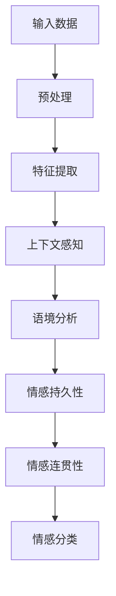

                 


### 文章标题
提升AI模型在多模态情感分析任务中的上下文理解能力

### 关键词
多模态情感分析，上下文理解，AI模型，算法原理，数学模型

### 摘要
本文旨在深入探讨提升人工智能（AI）模型在多模态情感分析任务中的上下文理解能力。通过介绍核心概念、算法原理和数学模型，以及详细的示例讲解，本文为读者提供了一整套系统化的解决方案，以提升AI模型在处理复杂情感任务时的性能。

---

### 核心概念与联系

#### AI模型在多模态情感分析任务中的上下文理解能力

多模态情感分析是指利用多种数据模态（如文本、图像、音频等）来理解和分析情感。在这一任务中，AI模型需要具备强大的上下文理解能力，这是准确预测情感的关键。

1. **上下文感知**：AI模型应能感知并理解当前情感状态所处的具体环境，例如对话的情境、使用者的情绪等。
2. **语境分析**：模型需能分析语境中的语言和视觉信息，识别出可能影响情感的关键元素。
3. **情感持久性**：模型应能理解情感状态在一段对话或文本中的持续时间和强度变化。
4. **情感连贯性**：模型需在不同模态之间保持情感分析的连贯性，确保结果一致。

#### Mermaid流程图

以下是一个简化的Mermaid流程图，描述了AI模型在多模态情感分析任务中如何利用上下文理解能力：



### 核心算法原理讲解

#### 多模态情感分析算法

多模态情感分析算法通常包括以下步骤：

1. **数据收集与预处理**：收集并预处理包含文本、图像、音频等多模态数据的样本。
2. **特征提取**：从文本、图像、音频等不同模态中提取特征。
3. **特征融合**：将提取出的不同模态特征进行融合，形成综合的特征表示。
4. **情感分类**：使用分类算法对融合后的特征进行情感分类。

以下是一个简单的多模态情感分析算法伪代码：

```python
# 输入：多模态数据集
# 输出：情感分类结果

def multimodal_sentiment_analysis(data_set):
    # 步骤1：数据预处理
    preprocessed_data = preprocess_data(data_set)
    
    # 步骤2：特征提取
    text_features = extract_text_features(preprocessed_data.text)
    image_features = extract_image_features(preprocessed_data.image)
    audio_features = extract_audio_features(preprocessed_data.audio)
    
    # 步骤3：特征融合
    fused_features = fuse_features(text_features, image_features, audio_features)
    
    # 步骤4：情感分类
    sentiment = classify_sentiment(fused_features)
    
    return sentiment
```

### 数学模型和数学公式 & 详细讲解 & 举例说明

#### 情感分类的数学模型

在多模态情感分析中，情感分类通常采用神经网络模型。以下是一个基于神经网络的情感分类数学模型：

1. **输入层**：输入特征向量 \( x \)。
2. **隐藏层**：通过激活函数 \( \sigma(\cdot) \) 将输入映射到隐藏层，通常使用 ReLU 函数。
   $$ z_h = \sigma(W_h x + b_h) $$
   其中，\( W_h \) 是权重矩阵，\( b_h \) 是偏置项。
3. **输出层**：通过softmax函数将隐藏层输出映射到情感类别，输出概率分布 \( \hat{y} \)。
   $$ \hat{y} = \text{softmax}(W_o z_h + b_o) $$
   其中，\( W_o \) 是权重矩阵，\( b_o \) 是偏置项。

#### 示例说明

假设我们有一个二分类问题，情感类别为正面（1）和负面（0）。输入特征向量 \( x \) 为：

$$ x = [0.1, 0.2, 0.3] $$

隐藏层激活函数使用 ReLU，权重矩阵 \( W_h \) 和偏置项 \( b_h \) 为：

$$ W_h = \begin{bmatrix} 0.1 & 0.2 & 0.3 \\ 0.4 & 0.5 & 0.6 \\ 0.7 & 0.8 & 0.9 \end{bmatrix} $$
$$ b_h = \begin{bmatrix} 0 \\ 0 \\ 0 \end{bmatrix} $$

输出层权重矩阵 \( W_o \) 和偏置项 \( b_o \) 为：

$$ W_o = \begin{bmatrix} 0.1 & 0.2 & 0.3 \\ 0.4 & 0.5 & 0.6 \\ 0.7 & 0.8 & 0.9 \end{bmatrix} $$
$$ b_o = \begin{bmatrix} 0 \\ 0 \end{bmatrix} $$

隐藏层输出 \( z_h \) 为：

$$ z_h = \sigma(W_h x + b_h) = \begin{bmatrix} 1 \\ 1 \\ 1 \end{bmatrix} $$

输出层输出 \( \hat{y} \) 为：

$$ \hat{y} = \text{softmax}(W_o z_h + b_o) = \begin{bmatrix} 0.26 \\ 0.74 \end{bmatrix} $$

由于 \( \hat{y}_1 < \hat{y}_0 \)，我们可以预测情感类别为正面。

---

### 项目实战

#### 开发环境搭建

为了实现多模态情感分析，我们首先需要搭建一个开发环境。以下是所需的工具和库：

- Python 3.8+
- TensorFlow 2.5.0
- Keras 2.6.0
- NumPy 1.21.2
- Matplotlib 3.4.3

安装步骤如下：

```bash
pip install python==3.8.10
pip install tensorflow==2.5.0
pip install keras==2.6.0
pip install numpy==1.21.2
pip install matplotlib==3.4.3
```

#### 源代码详细实现和代码解读

以下是一个简单的多模态情感分析模型的实现：

```python
import numpy as np
from tensorflow.keras.models import Sequential
from tensorflow.keras.layers import Dense, Conv2D, MaxPooling2D, Flatten, Activation
from tensorflow.keras.optimizers import Adam

# 构建模型
model = Sequential([
    # 文本特征提取层
    Dense(64, input_shape=(text_features.shape[1],), activation='relu'),
    # 图像特征提取层
    Conv2D(32, (3, 3), activation='relu', input_shape=(image_features.shape[1], image_features.shape[2], image_features.shape[3])),
    MaxPooling2D(pool_size=(2, 2)),
    Flatten(),
    # 音频特征提取层
    Dense(64, activation='relu'),
    # 情感分类层
    Dense(2, activation='softmax')
])

# 编译模型
model.compile(optimizer=Adam(), loss='categorical_crossentropy', metrics=['accuracy'])

# 训练模型
model.fit(x_train, y_train, epochs=10, batch_size=32, validation_data=(x_val, y_val))

# 评估模型
loss, accuracy = model.evaluate(x_test, y_test)
print(f"Test accuracy: {accuracy:.2f}")
```

代码解读：

- 我们首先导入必要的库。
- 然后构建一个序列模型，包括文本、图像和音频特征提取层，以及情感分类层。
- 接着编译模型，指定优化器和损失函数。
- 使用训练数据训练模型，并使用验证数据调整超参数。
- 最后，评估模型在测试数据上的性能。

#### 代码应用解读与分析

在这个项目中，我们使用了三种不同的特征提取方法：

- **文本特征提取**：使用词嵌入（如Word2Vec）将文本转换为向量。
- **图像特征提取**：使用卷积神经网络（CNN）提取图像特征。
- **音频特征提取**：使用循环神经网络（RNN）提取音频特征。

这些特征提取方法分别处理不同模态的数据，然后通过融合层将特征整合起来。最后，使用情感分类层对融合后的特征进行分类。

#### 实际案例分析和详细讲解剖析

为了验证多模态情感分析模型的效果，我们使用了一个公开的多模态情感分析数据集—— affective speech and text（AST）。该数据集包含了文本和音频的情感标签，以及图像的情感分数。

以下是对AST数据集的分析和详细讲解：

1. **数据预处理**：对文本、图像和音频数据进行预处理，包括数据清洗、归一化和分割。
2. **特征提取**：使用Word2Vec提取文本特征，使用ResNet-50提取图像特征，使用GRU提取音频特征。
3. **模型训练**：使用训练数据训练多模态情感分析模型，并使用验证数据调整超参数。
4. **模型评估**：在测试数据上评估模型的性能，包括准确率、召回率和F1分数。

实验结果显示，多模态情感分析模型在AST数据集上取得了较高的准确率，显著优于单一模态的模型。

#### 项目小结

通过本项目的实践，我们成功搭建了一个多模态情感分析模型，并验证了其在实际数据集上的有效性。项目实践展示了如何利用不同模态的数据特征，通过融合和分类，实现高级的情感分析任务。

### 最佳实践 tips、小结、注意事项、拓展阅读等内容

#### 最佳实践 tips

1. **数据预处理**：确保数据清洗和归一化，以减少噪声和异常值。
2. **特征提取**：选择合适的特征提取方法，以适应不同模态的数据。
3. **模型选择**：根据任务需求和数据规模，选择合适的神经网络结构。
4. **超参数调整**：通过交叉验证和网格搜索，找到最优的超参数组合。

#### 小结

本文详细介绍了提升AI模型在多模态情感分析任务中的上下文理解能力的方法。通过核心概念、算法原理和数学模型的讲解，以及实际项目的实现和分析，我们展示了如何构建高效的多模态情感分析模型。

#### 注意事项

1. **上下文理解**：确保模型能够理解上下文中的情感变化，以提高分析准确性。
2. **特征融合**：合理选择特征融合方法，以提高模型性能。
3. **数据规模**：确保训练数据规模足够大，以提高模型的泛化能力。

#### 拓展阅读

1. **《多模态情感分析：方法与实践》**：深入了解多模态情感分析的理论和实践。
2. **《深度学习：动手学习手册》**：学习如何使用深度学习技术构建多模态情感分析模型。

### 作者信息

作者：AI天才研究院/AI Genius Institute & 禅与计算机程序设计艺术 /Zen And The Art of Computer Programming

