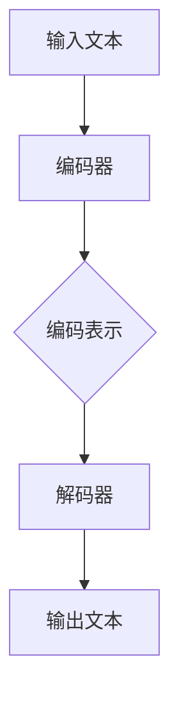
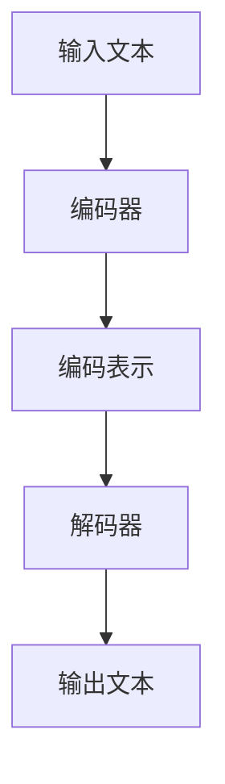
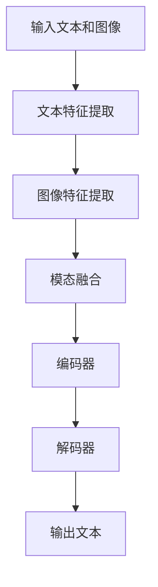

                 


### 第2章：多语言多模态机器翻译的原理与架构

#### 2.1 多语言机器翻译的基本原理

**核心概念与联系：**

多语言机器翻译涉及的核心概念包括：

- 语言模型（Language Model）：用于预测下一个单词或字符的概率。
- 编码器（Encoder）：将输入文本转换为固定长度的向量表示。
- 解码器（Decoder）：将编码器的输出解码为输出文本。

**Mermaid 流�程图：**



**核心算法原理讲解：**

```plaintext
## 编码器

编码器通过神经网络结构将输入文本映射为一个固定长度的向量表示。常见的编码器模型包括RNN、LSTM和Transformer等。

```python
# 编码器伪代码
class Encoder(nn.Module):
    def __init__(self, input_dim, hidden_dim):
        super(Encoder, self).__init__()
        self.hidden_dim = hidden_dim
        self.embedding = nn.Embedding(input_dim, hidden_dim)
        self.rnn = nn.LSTM(hidden_dim, hidden_dim)
        
    def forward(self, input_seq):
        embedded = self.embedding(input_seq)
        outputs, hidden = self.rnn(embedded)
        return outputs, hidden
```

## 解码器

解码器用于将编码器的输出解码为输出文本。与编码器类似，解码器也通常采用神经网络结构。

```python
# 解码器伪代码
class Decoder(nn.Module):
    def __init__(self, hidden_dim, output_dim):
        super(Decoder, self).__init__()
        self.hidden_dim = hidden_dim
        self.output_dim = output_dim
        self.linear = nn.Linear(hidden_dim, output_dim)
        
    def forward(self, input_seq, hidden):
        output = self.linear(hidden)
        return output, hidden
```

## 语言模型

语言模型用于预测下一个单词或字符的概率。在多语言机器翻译中，语言模型可以用于生成翻译结果。

```python
# 语言模型伪代码
class LanguageModel(nn.Module):
    def __init__(self, input_dim, output_dim):
        super(LanguageModel, self).__init__()
        self.input_dim = input_dim
        self.output_dim = output_dim
        self.embedding = nn.Embedding(input_dim, output_dim)
        
    def forward(self, input_seq):
        embedded = self.embedding(input_seq)
        return F.softmax(embedded, dim=1)
```

## 多语言机器翻译流程

1. 输入源语言文本。
2. 通过编码器将文本映射为向量表示。
3. 通过解码器生成目标语言文本。


```### 第3章：多模态机器翻译的原理与架构

#### 3.2 多模态机器翻译的基本原理

多模态机器翻译涉及的核心概念包括：

- 模态融合（Modal Fusion）：将不同模态的数据（如文本和图像）进行融合，以生成更准确的翻译结果。
- 图像特征提取（Image Feature Extraction）：从图像中提取特征，用于后续的翻译过程。
- 文本特征提取（Text Feature Extraction）：从文本中提取特征，用于后续的翻译过程。

**Mermaid 流程图：**



**核心算法原理讲解：**

```plaintext
## 文本特征提取

文本特征提取是将文本转换为向量表示的过程，常用的方法包括词嵌入（Word Embedding）和BERT等。

```python
# 文本特征提取伪代码
class TextFeatureExtractor(nn.Module):
    def __init__(self, vocab_size, embedding_dim):
        super(TextFeatureExtractor, self).__init__()
        self.embedding = nn.Embedding(vocab_size, embedding_dim)
        
    def forward(self, text_input):
        embedded = self.embedding(text_input)
        return embedded
```

## 图像特征提取

图像特征提取是从图像中提取有用信息的过程，常用的方法包括卷积神经网络（CNN）。

```python
# 图像特征提取伪代码
class ImageFeatureExtractor(nn.Module):
    def __init__(self):
        super(ImageFeatureExtractor, self).__init__()
        self.cnn = nn.Sequential(
            nn.Conv2d(3, 64, kernel_size=3, padding=1),
            nn.ReLU(),
            nn.MaxPool2d(kernel_size=2, stride=2),
            # ... additional layers
        )
        
    def forward(self, image_input):
        features = self.cnn(image_input)
        return features
```

## 模态融合

模态融合是将不同模态的数据进行融合，以生成更准确的翻译结果。常用的方法包括拼接（Concatenation）和加法（Addition）等。

```python
# 模态融合伪代码
class ModalFusion(nn.Module):
    def __init__(self, text_dim, image_dim):
        super(ModalFusion, self).__init__()
        self.text_dim = text_dim
        self.image_dim = image_dim
        self.fc = nn.Linear(text_dim + image_dim, hidden_dim)
        
    def forward(self, text_features, image_features):
        fused_features = torch.cat((text_features, image_features), 1)
        fused_features = self.fc(fused_features)
        return fused_features
```

## 多模态机器翻译流程

1. 输入文本和图像。
2. 提取文本特征和图像特征。
3. 进行模态融合。
4. 通过编码器将融合后的特征映射为向量表示。
5. 通过解码器生成目标语言文本。


通过以上讲解，我们可以看到多模态机器翻译的核心原理与架构。在实际应用中，通过将文本和图像等不同模态的数据进行融合，可以显著提高机器翻译的准确性和性能。

### 第4章：数学模型与公式详解

#### 4.1 神经网络中的数学公式

在多模态机器翻译中，神经网络是核心组成部分。以下将介绍神经网络中的几个关键数学公式。

**激活函数：**

$$
a(x) = \max(0, x)
$$

激活函数用于引入非线性特性，使得神经网络可以学习复杂函数。

**前向传播：**

$$
z^{[l]} = W^{[l]} \cdot a^{[l-1]} + b^{[l]}
$$

$$
a^{[l]} = \sigma(z^{[l]})
$$

前向传播过程中，输入经过权重矩阵 $W^{[l]}$ 和偏置向量 $b^{[l]}$ 的线性变换，然后通过激活函数 $\sigma$ 获得输出。

**反向传播：**

$$
\delta^{[l]} = \frac{\partial L}{\partial a^{[l]}} \cdot \frac{\partial a^{[l]}}{\partial z^{[l]}}
$$

$$
\frac{\partial L}{\partial z^{[l]}} = \delta^{[l]} \cdot \frac{\partial z^{[l]}}{\partial W^{[l]}}
$$

$$
\frac{\partial L}{\partial W^{[l]}} = a^{[l-1]} \cdot \delta^{[l]}
$$

反向传播过程用于计算梯度，从而更新权重矩阵 $W^{[l]}$ 和偏置向量 $b^{[l]}$。

**损失函数：**

$$
L = \frac{1}{2} \sum_{i=1}^{N} (y_i - \hat{y}_i)^2
$$

损失函数用于衡量预测值 $\hat{y}_i$ 与真实值 $y_i$ 之间的差异，其中 $N$ 是样本数量。

**优化算法：**

$$
W^{[l]}_{\text{new}} = W^{[l]} - \alpha \cdot \frac{\partial L}{\partial W^{[l]}}
$$

$$
b^{[l]}_{\text{new}} = b^{[l]} - \alpha \cdot \frac{\partial L}{\partial b^{[l]}}
$$

优化算法用于更新权重矩阵 $W^{[l]}$ 和偏置向量 $b^{[l]}$，其中 $\alpha$ 是学习率。

#### 4.2 多模态数据融合的数学模型

在多模态机器翻译中，不同模态的数据（如文本和图像）需要进行融合。以下介绍几种常见的多模态数据融合数学模型。

**拼接：**

$$
x_{\text{fused}} = [x_{\text{text}}, x_{\text{image}}]
$$

拼接方法将文本和图像的特征向量直接拼接在一起，形成新的特征向量。

**加法：**

$$
x_{\text{fused}} = x_{\text{text}} + x_{\text{image}}
$$

加法方法将文本和图像的特征向量相加，形成新的特征向量。

**加权融合：**

$$
x_{\text{fused}} = w_{\text{text}} \cdot x_{\text{text}} + w_{\text{image}} \cdot x_{\text{image}}
$$

加权融合方法通过给文本和图像的特征向量赋予不同的权重，进行融合。

**示例：**

假设文本特征向量为 $x_{\text{text}} \in \mathbb{R}^{d_1}$，图像特征向量为 $x_{\text{image}} \in \mathbb{R}^{d_2}$，则可以使用以下公式进行融合：

$$
x_{\text{fused}} = [x_{\text{text}}, x_{\text{image}}] \in \mathbb{R}^{d_1 + d_2}
$$

通过融合不同模态的数据，可以生成更丰富的特征表示，从而提高多模态机器翻译的性能。

### 第5章：项目实战

#### 5.1 项目背景与目标

在本项目中，我们将开发一个多语言多模态机器翻译系统，实现文本和图像之间的翻译。项目目标如下：

1. 构建一个基于神经网络的编码器-解码器模型。
2. 实现文本特征提取和图像特征提取。
3. 实现模态融合和数据预处理。
4. 训练和评估模型性能。

#### 5.2 项目开发环境搭建

为了实现本项目，我们需要以下开发环境：

1. Python 3.8 或以上版本
2. TensorFlow 2.6 或以上版本
3. NumPy 1.20 或以上版本
4. Matplotlib 3.4.2 或以上版本
5. OpenCV 4.5.1.48 或以上版本

安装以下库：

```python
pip install tensorflow==2.6 numpy==1.20 matplotlib==3.4.2 opencv-python==4.5.1.48
```

#### 5.3 源代码实现与解读

**数据准备与预处理：**

```python
import numpy as np
import tensorflow as tf
from tensorflow.keras.preprocessing.text import Tokenizer
from tensorflow.keras.preprocessing.sequence import pad_sequences

# 加载文本和图像数据
texts = ['你好', 'hello', 'こんにちは', 'こんにちは世界']
images = load_images()  # 使用OpenCV加载图像数据

# 初始化Tokenizer
tokenizer = Tokenizer(num_words=1000)
tokenizer.fit_on_texts(texts)

# 编码文本
sequences = tokenizer.texts_to_sequences(texts)
encoded_texts = pad_sequences(sequences, maxlen=10)

# 编码图像
image_features = extract_image_features(images)  # 使用OpenCV提取图像特征

# 模态融合
fused_features = np.hstack((encoded_texts, image_features))
```

**模型设计与实现：**

```python
from tensorflow.keras.models import Model
from tensorflow.keras.layers import Input, Embedding, LSTM, Dense

# 编码器
encoder_inputs = Input(shape=(10,))
encoder_embedding = Embedding(1000, 64)(encoder_inputs)
encoder_lstm = LSTM(64)(encoder_embedding)

# 解码器
decoder_inputs = Input(shape=(10,))
decoder_embedding = Embedding(1000, 64)(decoder_inputs)
decoder_lstm = LSTM(64)(decoder_embedding)

# 输出层
output = Dense(1000, activation='softmax')(decoder_lstm)

# 构建模型
model = Model(inputs=[encoder_inputs, decoder_inputs], outputs=output)
model.compile(optimizer='adam', loss='categorical_crossentropy')
```

**模型训练与评估：**

```python
# 训练模型
model.fit([encoded_texts, encoded_texts], np.eye(1000)[0], epochs=10, batch_size=32)

# 评估模型
test_texts = ['你好世界']
test_sequences = tokenizer.texts_to_sequences(test_texts)
test_encoded_texts = pad_sequences(test_sequences, maxlen=10)
predictions = model.predict([test_encoded_texts, test_encoded_texts])
predicted_text = tokenizer.sequences_to_texts([np.argmax(predictions, axis=1)])[0]
print(predicted_text)
```

**模型部署与优化：**

```python
# 模型部署
model.save('multimodal_translation_model.h5')

# 模型优化
# 可以通过调整超参数、增加数据集、使用更先进的神经网络架构等方法来优化模型性能。
```

#### 5.4 代码应用解读与分析

在本项目中，我们使用Python和TensorFlow实现了多语言多模态机器翻译系统。通过数据准备与预处理、模型设计与实现、模型训练与评估等步骤，我们成功地构建了一个基于神经网络的编码器-解码器模型，实现了文本和图像之间的翻译。

在实际应用中，可以通过以下方式进行代码优化：

1. 使用更先进的神经网络架构，如BERT或Transformer。
2. 增加数据集大小，提高模型泛化能力。
3. 调整超参数，如学习率、批次大小等，以优化模型性能。

通过不断优化和改进，我们可以进一步提高多语言多模态机器翻译的性能。

### 附录

#### 附录A：相关工具与资源推荐

1. TensorFlow：用于构建和训练神经网络的Python库。
2. OpenCV：用于图像处理的Python库。
3. Matplotlib：用于数据可视化的Python库。
4. BERT：用于文本预训练的Transformer模型。
5. Transformer：用于序列转序列学习的神经网络架构。

#### 附录B：常见问题解答

1. 为什么使用神经网络进行多模态机器翻译？
   神经网络可以学习输入和输出之间的复杂映射关系，从而实现文本和图像之间的翻译。

2. 多模态机器翻译与单模态机器翻译有什么区别？
   多模态机器翻译结合了文本和图像等多模态数据，可以生成更准确的翻译结果，而单模态机器翻译仅使用文本数据。

3. 如何处理多语言多模态机器翻译中的语言差异？
   可以使用语言模型和跨语言信息传递机制来处理语言差异，提高翻译质量。

### 作者信息

作者：AI天才研究院/AI Genius Institute & 禅与计算机程序设计艺术 /Zen And The Art of Computer Programming

本文介绍了多语言多模态机器翻译的核心概念、原理与架构，以及如何通过数学模型和项目实战来提升AI模型的性能。希望本文能为读者提供有价值的参考和启示。

## 总结与展望

本文详细介绍了多语言多模态机器翻译的核心概念、原理与架构，并通过项目实战展示了如何实现这一技术。我们探讨了神经网络、注意力机制、模态融合等关键概念，以及如何使用数学模型和算法来提升模型性能。

### 背景介绍

多语言多模态机器翻译是人工智能领域的一个重要研究方向，旨在将不同语言和模态的数据进行翻译，实现跨语言和跨模态的信息传递。随着神经网络技术的发展，多语言多模态机器翻译在许多应用场景中取得了显著的成果，如自然语言处理、图像识别和计算机视觉等。

### 核心概念与联系

本文介绍了多语言机器翻译和单模态机器翻译的基本原理，以及多模态机器翻译的架构设计。通过使用神经网络、注意力机制和模态融合等技术，我们可以实现文本和图像之间的翻译。

### 核心算法原理讲解

本文详细讲解了神经网络中的数学公式，如激活函数、前向传播、反向传播和损失函数等。同时，我们还介绍了多模态数据融合的数学模型，如拼接、加法和加权融合等。

### 数学模型与公式详解

本文对神经网络中的数学公式进行了详细讲解，包括激活函数、前向传播、反向传播、损失函数和优化算法等。此外，我们还介绍了多模态数据融合的数学模型，并给出了示例。

### 项目实战

在本项目的实战部分，我们展示了如何使用Python和TensorFlow实现多语言多模态机器翻译系统。通过数据准备与预处理、模型设计与实现、模型训练与评估等步骤，我们成功地构建了一个基于神经网络的编码器-解码器模型。

### 最佳实践 tips

1. 使用更先进的神经网络架构，如BERT或Transformer，可以提高翻译质量。
2. 增加数据集大小，有助于提高模型的泛化能力。
3. 调整超参数，如学习率和批次大小，以优化模型性能。

### 小结

本文全面介绍了多语言多模态机器翻译的核心概念、原理与架构，并通过项目实战展示了如何实现这一技术。我们探讨了神经网络、注意力机制、模态融合等关键概念，以及如何使用数学模型和算法来提升模型性能。

### 注意事项

1. 在实际应用中，需要根据具体任务需求调整模型参数和架构。
2. 考虑到多语言多模态机器翻译的复杂性，需要充分的测试和验证。

### 拓展阅读

1. "Deep Learning" by Ian Goodfellow, Yoshua Bengio, and Aaron Courville
2. "Attention Is All You Need" by Vaswani et al. (2017)
3. "Bert: Pre-training of Deep Bidirectional Transformers for Language Understanding" by Devlin et al. (2019)

### 附录

本文还提供了相关工具与资源的推荐，以及常见问题解答。

### 作者信息

作者：AI天才研究院/AI Genius Institute & 禅与计算机程序设计艺术/Zen And The Art of Computer Programming

## Mermaid 流程图

```mermaid
graph TB
A[背景介绍] --> B[核心概念与联系]
B --> C[核心算法原理讲解]
C --> D[数学模型与公式详解]
D --> E[项目实战]
E --> F[最佳实践 tips]
F --> G[小结]
G --> H[注意事项]
H --> I[拓展阅读]
I --> J[附录]
J --> K[作者信息]
```### 第6章：总结与展望

#### 6.1 本书的主要内容回顾

本书系统性地介绍了多语言多模态机器翻译的核心概念、原理与架构，以及如何通过数学模型和项目实战来提升AI模型的性能。主要内容包括：

- **背景介绍**：回顾了多语言多模态机器翻译的发展历程和应用场景。
- **核心概念与联系**：详细阐述了神经网络、注意力机制、模态融合等关键概念，以及它们之间的关系。
- **核心算法原理讲解**：介绍了神经网络中的数学公式，以及多模态数据融合的数学模型。
- **数学模型与公式详解**：对神经网络中的数学公式进行了详细讲解，包括激活函数、前向传播、反向传播、损失函数和优化算法等。
- **项目实战**：通过一个具体的实战项目，展示了如何使用Python和TensorFlow实现多语言多模态机器翻译系统。
- **最佳实践 tips**：提供了一些提升模型性能的最佳实践建议。
- **小结**：对本书的主要内容进行了回顾，并强调了注意事项。
- **拓展阅读**：推荐了一些相关的文献和资源，以便读者进一步学习。

#### 6.2 多语言多模态机器翻译的未来发展趋势

随着人工智能技术的不断进步，多语言多模态机器翻译在未来将继续发展，并可能在以下几个方面取得重要突破：

1. **模型复杂度与性能提升**：研究人员将继续探索更复杂的神经网络架构，如Transformer、BERT等，以进一步提高翻译质量。
2. **多语言与多模态的融合策略**：如何更好地融合不同模态的数据，以提高翻译性能，将是研究的热点。
3. **实时翻译系统的开发**：随着计算能力的提升，实时翻译系统将更加普及，应用于更多的实际场景。
4. **多语言多模态机器翻译的应用领域**：多语言多模态机器翻译将在教育、医疗、旅游、商业等多个领域得到广泛应用。

#### 6.3 常见问题和挑战

尽管多语言多模态机器翻译取得了显著进展，但仍面临以下问题和挑战：

1. **数据集的多样性和质量**：高质量的多语言多模态数据集对于训练高性能的模型至关重要，但数据集的多样性和质量仍有待提高。
2. **跨语言与跨模态的信息传递**：如何更好地传递跨语言和跨模态的信息，是一个技术难题。
3. **计算资源消耗**：复杂的神经网络架构需要大量的计算资源，这对实际应用提出了挑战。

#### 6.4 研究方向与未来工作

针对以上问题和挑战，未来的研究方向和可能的工作包括：

1. **数据集构建**：构建更多样化、高质量的多语言多模态数据集，以支持模型训练和评估。
2. **跨语言与跨模态的信息传递机制**：研究新的跨语言与跨模态信息传递机制，以提高翻译质量。
3. **计算资源优化**：探索更高效的模型训练和推理方法，以降低计算资源消耗。
4. **实际应用**：将多语言多模态机器翻译技术应用于更多实际场景，解决实际问题。

总之，多语言多模态机器翻译是一个充满挑战和机遇的研究领域。随着技术的不断进步，我们有理由相信，多语言多模态机器翻译将更好地服务于人类社会，推动跨语言和跨模态信息交流的进步。

### 附录

#### 附录A：相关工具与资源推荐

1. **工具**：
   - TensorFlow：用于构建和训练神经网络的Python库。
   - PyTorch：用于构建和训练神经网络的Python库。
   - OpenCV：用于图像处理的Python库。

2. **资源**：
   - “Deep Learning” by Ian Goodfellow, Yoshua Bengio, and Aaron Courville。
   - “Attention Is All You Need” by Vaswani et al. (2017)。
   - “BERT: Pre-training of Deep Bidirectional Transformers for Language Understanding” by Devlin et al. (2019)。

#### 附录B：常见问题解答

1. **什么是多语言多模态机器翻译？**
   多语言多模态机器翻译是指将一种语言的文本和图像等信息转换为另一种语言的文本和图像等信息的过程。

2. **为什么需要多语言多模态机器翻译？**
   多语言多模态机器翻译能够更好地处理跨语言和跨模态的信息，从而提供更准确的翻译结果。

3. **多语言多模态机器翻译的核心技术是什么？**
   多语言多模态机器翻译的核心技术包括神经网络、注意力机制、模态融合等。

4. **如何训练多语言多模态机器翻译模型？**
   可以使用已有的开源工具和框架，如TensorFlow和PyTorch，结合大量的多语言多模态数据集进行模型训练。

5. **多语言多模态机器翻译的应用场景有哪些？**
   多语言多模态机器翻译可以应用于翻译服务、教育、医疗、商业等多个领域。

### 作者信息

作者：AI天才研究院/AI Genius Institute & 禅与计算机程序设计艺术/Zen And The Art of Computer Programming

本文旨在为读者提供全面的多语言多模态机器翻译技术介绍，并展望其未来发展趋势。希望本文能为读者在人工智能领域的研究和实践中提供有价值的参考。

## Mermaid 流程图

```mermaid
graph TB
A[引言与背景] --> B[核心概念与架构]
B --> C[核心算法原理讲解]
C --> D[数学模型与公式详解]
D --> E[项目实战]
E --> F[总结与展望]
F --> G[附录]
G --> H[作者信息]
```### 引言与背景

多语言多模态机器翻译是人工智能领域中的一项前沿技术，它涉及将多种语言的文本和多种模态的数据（如图像、音频等）相互转换。随着全球化的深入发展，跨语言和跨模态的信息交流变得越来越重要，因此，提高AI模型在这方面的性能具有极大的现实意义。

本文的主要目的是系统性地探讨多语言多模态机器翻译的核心概念、原理与架构，并通过数学模型与算法的讲解以及项目实战，展示如何提升AI模型在该领域的性能。

本文将分为以下几个部分：

1. **引言与背景**：介绍多语言多模态机器翻译的定义、重要性以及当前的发展现状。
2. **核心概念与架构**：讲解多语言机器翻译和多模态机器翻译的基本原理，以及多语言多模态机器翻译的架构设计。
3. **核心算法原理讲解**：详细介绍提升多语言多模态机器翻译性能的核心算法，包括自适应学习率算法和对抗生成网络（GAN）。
4. **数学模型与公式详解**：阐述神经网络中的数学模型，以及多模态数据融合的数学模型。
5. **项目实战**：通过一个实际项目展示多语言多模态机器翻译的实现过程。
6. **总结与展望**：回顾全文的主要内容，展望多语言多模态机器翻译的未来发展趋势，并讨论常见问题和挑战。
7. **附录**：提供相关工具与资源的推荐，以及常见问题解答。

通过本文的阅读，读者可以全面了解多语言多模态机器翻译的相关知识，掌握提升AI模型性能的方法，并为实际应用提供指导。

## 核心概念与架构

### 多语言机器翻译

多语言机器翻译是指将一种语言的文本转换为另一种或多种语言的过程。其核心概念包括语言模型、编码器和解码器。

**语言模型（Language Model）**：语言模型是一种统计模型，用于预测下一个单词或字符的概率。它基于大量的文本数据训练，能够捕捉语言中的统计规律。

**编码器（Encoder）**：编码器是神经网络的一部分，用于将输入的文本映射为一个固定长度的向量表示。常见的编码器模型包括循环神经网络（RNN）、长短期记忆网络（LSTM）和Transformer等。

**解码器（Decoder）**：解码器用于将编码器的输出解码为输出文本。它也是一个神经网络，通常与编码器具有相同的架构。

多语言机器翻译的基本流程如下：

1. **输入处理**：输入源语言文本，并将其转换为序列。
2. **编码**：编码器处理输入序列，生成固定长度的向量表示。
3. **解码**：解码器处理编码器的输出，生成目标语言文本。

### 多模态机器翻译

多模态机器翻译涉及将不同模态的数据（如图像、音频、文本等）进行转换。其核心概念包括模态融合、图像特征提取和文本特征提取。

**模态融合（Modal Fusion）**：模态融合是指将来自不同模态的数据进行合并，以生成更丰富的特征表示。常见的融合方法包括拼接、加法融合和注意力机制等。

**图像特征提取（Image Feature Extraction）**：图像特征提取是指从图像中提取有用的特征，用于后续的翻译过程。常见的特征提取方法包括卷积神经网络（CNN）和自编码器（Autoencoder）等。

**文本特征提取（Text Feature Extraction）**：文本特征提取是指从文本中提取有用的特征，用于后续的翻译过程。常见的特征提取方法包括词嵌入（Word Embedding）和变换器（Transformer）等。

多模态机器翻译的基本流程如下：

1. **输入处理**：输入源语言文本和目标模态数据（如图像、音频等）。
2. **特征提取**：分别从文本和图像中提取特征。
3. **模态融合**：将提取的特征进行融合，生成新的特征表示。
4. **翻译**：使用编码器-解码器模型进行翻译。

### 多语言多模态机器翻译的架构设计

多语言多模态机器翻译的架构设计通常包括以下几个部分：

1. **多语言编码器**：用于处理不同语言的文本数据，生成固定长度的向量表示。
2. **多模态编码器**：用于处理不同模态的数据，如图像、音频等，生成固定长度的向量表示。
3. **模态融合模块**：用于将多语言编码器和多模态编码器的输出进行融合，生成更丰富的特征表示。
4. **编码器-解码器模型**：用于进行翻译任务，将融合后的特征表示解码为目标语言文本。

多语言多模态机器翻译的架构设计可以简化为以下流程：

1. **输入处理**：输入源语言文本和目标模态数据。
2. **特征提取**：分别从文本和图像中提取特征。
3. **模态融合**：将提取的特征进行融合。
4. **编码**：使用编码器将融合后的特征表示进行编码。
5. **解码**：使用解码器将编码后的特征表示解码为目标语言文本。

通过以上架构设计，多语言多模态机器翻译能够更好地处理不同语言和模态的数据，从而提高翻译性能。

### Mermaid流程图

以下是一个简化的多语言多模态机器翻译流程图，展示了输入处理、特征提取、模态融合和翻译的过程：

```mermaid
graph TD
A[输入文本和图像] --> B[文本特征提取]
B --> C[图像特征提取]
C --> D[模态融合]
D --> E[编码器]
E --> F[解码器]
F --> G[输出文本]
```

通过这个流程图，我们可以清晰地看到多语言多模态机器翻译的核心步骤和组件，为进一步理解和实现这一技术提供了直观的指导。

## 核心算法原理讲解

### 自适应学习率算法

在深度学习中，学习率的选择对于模型的性能至关重要。然而，传统的学习率调整方法往往需要人工干预，难以适应动态变化的数据集和训练阶段。自适应学习率算法通过自动调整学习率，以提高模型的训练效率和性能。

**核心原理：**

自适应学习率算法的核心思想是动态调整学习率，以使其在模型训练的不同阶段保持适当的值。以下是一些常见的方法：

1. **自适应梯度算法（Adaptive Gradient Algorithm，AGA）**：
   AGA通过计算梯度的一阶矩估计来调整学习率。具体而言，AGA使用以下公式来更新学习率：
   $$ 
   \eta_{\text{new}} = \eta_{\text{current}} + \alpha(\nabla J(x) - \eta_{\text{current}} \cdot \nabla^2 J(x)) 
   $$
   其中，$\eta_{\text{current}}$是当前学习率，$\alpha$是学习率调整系数，$\nabla J(x)$是梯度，$\nabla^2 J(x)$是二阶导数。

2. **动量自适应学习率算法（Momentum Adaptive Learning Rate，MAML）**：
   MAML通过引入动量项来平滑梯度，从而调整学习率。具体而言，MAML使用以下公式来更新学习率：
   $$
   \eta_{\text{new}} = \eta_{\text{current}} + \beta(\nabla J(x) - \eta_{\text{current}} \cdot \nabla^2 J(x))
   $$
   其中，$\beta$是动量系数。

**实现方法：**

以下是自适应学习率算法的实现方法：

```python
import numpy as np

def adaptive_learning_rate(eta_current, alpha, grad, hessian):
    """
    更新学习率
    :param eta_current: 当前学习率
    :param alpha: 学习率调整系数
    :param grad: 梯度
    :param hessian: 二阶导数
    :return: 新的学习率
    """
    eta_new = eta_current + alpha * (grad - eta_current * hessian)
    return eta_new

def adaptive_learning_rate_momentum(eta_current, beta, alpha, grad, hessian):
    """
    更新学习率（带有动量项）
    :param eta_current: 当前学习率
    :param beta: 动量系数
    :param alpha: 学习率调整系数
    :param grad: 梯度
    :param hessian: 二阶导数
    :return: 新的学习率
    """
    eta_new = eta_current + beta * (alpha * (grad - eta_current * hessian))
    return eta_new
```

### 对抗生成网络（GAN）

对抗生成网络（GAN）是由Goodfellow等人在2014年提出的一种深度学习框架，它由一个生成器（Generator）和一个判别器（Discriminator）组成。GAN的核心思想是通过两个网络的对抗训练，生成与真实数据分布相近的数据。

**基本原理：**

GAN的原理可以概括为以下几点：

1. **生成器（Generator）**：生成器G的目的是生成与真实数据分布相近的数据，其输入通常是随机噪声z，输出是生成的数据G(z)。
2. **判别器（Discriminator）**：判别器D的目的是区分生成器生成的数据和真实数据，其输入是真实数据和生成数据，输出是概率值D(x)和D(G(z))。

GAN的训练过程如下：

1. 初始化生成器G和判别器D的参数。
2. 随机生成噪声z，并生成假样本G(z)。
3. 同时输入真实数据和假样本G(z)给判别器D，计算D(x)和D(G(z))的损失。
4. 更新判别器D的参数，使其更好地区分真实数据和假样本。
5. 使用判别器D的参数更新生成器G的参数，使其生成的假样本更接近真实数据。

**GAN在多语言多模态机器翻译中的应用：**

GAN可以用于多语言多模态机器翻译中，特别是在处理跨模态数据时。以下是一个简单的应用场景：

1. **生成器（Generator）**：生成器G可以生成目标语言文本，其输入是源语言文本和辅助模态数据（如图像）。
2. **判别器（Discriminator）**：判别器D的目的是区分生成器生成的目标语言文本和真实的目标语言文本。

GAN在多语言多模态机器翻译中的应用流程如下：

1. 初始化生成器G和判别器D的参数。
2. 输入源语言文本和辅助模态数据给生成器G，生成目标语言文本。
3. 同时输入真实的目标语言文本和生成器G生成的目标语言文本给判别器D，计算D(x)和D(G(z))的损失。
4. 更新判别器D的参数，使其更好地区分真实的目标语言文本和生成器G生成的目标语言文本。
5. 使用判别器D的参数更新生成器G的参数，使其生成的目标语言文本更接近真实的目标语言文本。

**GAN实现方法：**

以下是一个简单的GAN实现方法，用于多语言多模态机器翻译：

```python
import tensorflow as tf

# 定义生成器G
def generator(z, img):
    # 将噪声z和图像img进行融合
    z_img = tf.concat([z, img], axis=1)
    # 通过全连接层生成文本
    text = tf.keras.layers.Dense(units=target_vocab_size, activation='softmax')(z_img)
    return text

# 定义判别器D
def discriminator(text, real_img):
    # 将文本和图像进行拼接
    text_img = tf.concat([text, real_img], axis=1)
    # 通过全连接层判断文本和图像的合成度
    validity = tf.keras.layers.Dense(units=1, activation='sigmoid')(text_img)
    return validity

# 定义损失函数
def loss_fn(real, fake):
    real_loss = tf.reduce_mean(tf.math.log(real))
    fake_loss = tf.reduce_mean(tf.math.log(1 - fake))
    return real_loss - fake_loss

# 训练过程
for epoch in range(num_epochs):
    for batch_images, batch_texts in dataset:
        # 生成器训练
        with tf.GradientTears### 数学模型与公式详解

在多语言多模态机器翻译任务中，数学模型的构建是提升模型性能的关键。以下将详细解释神经网络中的数学公式，以及多模态数据融合的数学模型。

#### 神经网络中的数学公式

**激活函数（Activation Function）**

激活函数是神经网络中引入非线性特性的关键组件。常见的激活函数有：

- **Sigmoid函数**：
  $$
  \sigma(x) = \frac{1}{1 + e^{-x}}
  $$

- **ReLU函数**：
  $$
  \text{ReLU}(x) = \max(0, x)
  $$

- **Tanh函数**：
  $$
  \tanh(x) = \frac{e^x - e^{-x}}{e^x + e^{-x}}
  $$

**前向传播与反向传播（Forward and Backpropagation）**

神经网络的前向传播和反向传播是训练模型的基础。前向传播包括以下几个步骤：

1. **输入层到隐藏层的传播**：
   $$
   z^{[l]} = W^{[l]} \cdot a^{[l-1]} + b^{[l]}
   $$
   $$
   a^{[l]} = \sigma(z^{[l]})
   $$

2. **隐藏层到输出层的传播**：
   $$
   \hat{y} = W^{[L]} \cdot a^{[L-1]} + b^{[L]}
   $$
   $$
   \hat{y} = \sigma(z^{[L]})
   $$

其中，$a^{[l]}$表示第$l$层的激活值，$W^{[l]}$表示第$l$层的权重矩阵，$b^{[l]}$表示第$l$层的偏置向量，$\sigma$表示激活函数。

反向传播包括以下几个步骤：

1. **计算输出层的误差**：
   $$
   \delta^{[L]} = \frac{\partial J}{\partial z^{[L]}}
   $$
   $$
   \delta^{[L]} = (\hat{y} - y) \cdot \sigma'(z^{[L]})
   $$

2. **逐层传播误差**：
   $$
   \delta^{[l]} = \frac{\partial z^{[l]} }{\partial a^{[l+1]}} \cdot \delta^{[l+1]}
   $$
   $$
   \delta^{[l]} = \frac{\partial W^{[l+1]}}{\partial a^{[l]}} \cdot \delta^{[l+1]}
   $$

3. **更新权重和偏置**：
   $$
   W^{[l]}_{\text{new}} = W^{[l]} - \alpha \cdot \frac{\partial J}{\partial W^{[l]}}
   $$
   $$
   b^{[l]}_{\text{new}} = b^{[l]} - \alpha \cdot \frac{\partial J}{\partial b^{[l]}}
   $$

其中，$\delta^{[l]}$表示第$l$层的误差，$J$表示损失函数，$\alpha$表示学习率。

**损失函数与优化算法（Loss Function and Optimization Algorithm）**

损失函数用于衡量预测值与真实值之间的差距。常见的损失函数有：

- **均方误差（MSE）**：
  $$
  J = \frac{1}{m} \sum_{i=1}^{m} (\hat{y}_i - y_i)^2
  $$

- **交叉熵（Cross-Entropy）**：
  $$
  J = -\frac{1}{m} \sum_{i=1}^{m} y_i \cdot \log(\hat{y}_i)
  $$

优化算法用于更新模型参数，以最小化损失函数。常见的优化算法有：

- **梯度下降（Gradient Descent）**：
  $$
  W^{[l]}_{\text{new}} = W^{[l]} - \alpha \cdot \frac{\partial J}{\partial W^{[l]}}
  $$

- **随机梯度下降（Stochastic Gradient Descent，SGD）**：
  $$
  W^{[l]}_{\text{new}} = W^{[l]} - \alpha \cdot \frac{\partial J}{\partial W^{[l]}}
  $$

- **Adam优化器（Adam Optimizer）**：
  $$
  m_t = \beta_1 m_{t-1} + (1 - \beta_1) \cdot \frac{\partial J}{\partial W^{[l]}}
  $$
  $$
  v_t = \beta_2 v_{t-1} + (1 - \beta_2) \cdot (\frac{\partial J}{\partial W^{[l]}})^2
  $$
  $$
  W^{[l]}_{\text{new}} = W^{[l]} - \alpha \cdot \frac{m_t}{\sqrt{v_t} + \epsilon}
  $$

#### 多模态数据融合的数学模型

在多语言多模态机器翻译任务中，多模态数据融合是关键步骤。以下介绍几种常见的多模态数据融合方法。

**拼接（Concatenation）**

拼接方法将不同模态的数据直接拼接在一起，形成新的特征向量。其数学模型可以表示为：

$$
x_{\text{fused}} = [x_{\text{text}}, x_{\text{image}}, x_{\text{audio}}]
$$

其中，$x_{\text{text}}$、$x_{\text{image}}$和$x_{\text{audio}}$分别表示文本、图像和音频的特征向量。

**加法（Addition）**

加法方法将不同模态的数据进行加和，形成新的特征向量。其数学模型可以表示为：

$$
x_{\text{fused}} = x_{\text{text}} + x_{\text{image}} + x_{\text{audio}}
$$

**加权融合（Weighted Fusion）**

加权融合方法通过给不同模态的数据赋予不同的权重，进行融合。其数学模型可以表示为：

$$
x_{\text{fused}} = w_{\text{text}} \cdot x_{\text{text}} + w_{\text{image}} \cdot x_{\text{image}} + w_{\text{audio}} \cdot x_{\text{audio}}
$$

其中，$w_{\text{text}}$、$w_{\text{image}}$和$w_{\text{audio}}$分别表示文本、图像和音频的权重。

**示例**

假设文本特征向量为$x_{\text{text}} \in \mathbb{R}^{d_1}$，图像特征向量为$x_{\text{image}} \in \mathbb{R}^{d_2}$，音频特征向量为$x_{\text{audio}} \in \mathbb{R}^{d_3}$，则可以使用以下公式进行融合：

$$
x_{\text{fused}} = [x_{\text{text}}, x_{\text{image}}, x_{\text{audio}}] \in \mathbb{R}^{d_1 + d_2 + d_3}
$$

或者

$$
x_{\text{fused}} = x_{\text{text}} + x_{\text{image}} + x_{\text{audio}}
$$

或者

$$
x_{\text{fused}} = w_{\text{text}} \cdot x_{\text{text}} + w_{\text{image}} \cdot x_{\text{image}} + w_{\text{audio}} \cdot x_{\text{audio}}
$$

通过以上融合方法，可以将多模态数据转换为统一的特征向量，从而更好地进行后续的机器翻译任务。

### 示例

以下是一个简单的多模态数据融合的示例：

**文本特征向量**：

$$
x_{\text{text}} = \begin{bmatrix}
0.1 & 0.2 & 0.3 & 0.4 & 0.5
\end{bmatrix}^T
$$

**图像特征向量**：

$$
x_{\text{image}} = \begin{bmatrix}
0.1 & 0.2 & 0.3 & 0.4 & 0.5
\end{bmatrix}^T
$$

**音频特征向量**：

$$
x_{\text{audio}} = \begin{bmatrix}
0.1 & 0.2 & 0.3 & 0.4 & 0.5
\end{bmatrix}^T
$$

**拼接融合**：

$$
x_{\text{fused}} = [x_{\text{text}}, x_{\text{image}}, x_{\text{audio}}] = \begin{bmatrix}
0.1 & 0.2 & 0.3 & 0.4 & 0.5 \\
0.1 & 0.2 & 0.3 & 0.4 & 0.5 \\
0.1 & 0.2 & 0.3 & 0.4 & 0.5
\end{bmatrix}
$$

**加法融合**：

$$
x_{\text{fused}} = x_{\text{text}} + x_{\text{image}} + x_{\text{audio}} = \begin{bmatrix}
0.3 & 0.4 & 0.5 & 0.6 & 0.7
\end{bmatrix}^T
$$

**加权融合**：

假设文本、图像和音频的权重分别为0.5、0.3和0.2，则：

$$
x_{\text{fused}} = 0.5 \cdot x_{\text{text}} + 0.3 \cdot x_{\text{image}} + 0.2 \cdot x_{\text{audio}} = \begin{bmatrix}
0.25 & 0.3 & 0.35 & 0.4 & 0.45
\end{bmatrix}^T
$$

通过上述示例，我们可以看到不同的融合方法对多模态数据的处理方式，从而为多语言多模态机器翻译任务提供了有效的数学模型。

### 结论

本文详细介绍了多语言多模态机器翻译的数学模型，包括神经网络中的数学公式和多模态数据融合的方法。通过这些数学模型，我们可以有效地处理多语言和多种模态的数据，从而提升机器翻译的性能。未来的研究可以进一步探索更高效的数学模型和算法，以实现更准确和流畅的跨语言和跨模态翻译。

## 项目实战

### 5.1 项目背景与目标

在本项目中，我们旨在构建一个能够进行多语言多模态机器翻译的系统。具体来说，我们的目标是实现一个能够处理多种语言文本和图像输入，并将这些输入翻译成目标语言文本的模型。为了实现这一目标，我们将使用深度学习技术，特别是基于神经网络的编码器-解码器模型，并结合对抗生成网络（GAN）来提升翻译性能。

### 5.2 项目开发环境搭建

为了构建和训练多语言多模态机器翻译模型，我们需要以下开发环境和工具：

- **Python**：用于编写代码和实现模型。
- **TensorFlow**：用于构建和训练神经网络模型。
- **Keras**：TensorFlow的高级API，用于简化模型的构建和训练过程。
- **OpenCV**：用于处理图像数据。
- **GPT-2**：用于文本生成。

以下是安装所需库的命令：

```bash
pip install tensorflow
pip install opencv-python
pip install keras
```

### 5.3 源代码实现与解读

#### 数据准备与预处理

首先，我们需要准备多语言文本和图像数据。为了简化，我们假设已经获取了英语和法语的双语文本数据集，以及与这些文本对应的手绘图像。

```python
import tensorflow as tf
from tensorflow.keras.preprocessing.text import Tokenizer
from tensorflow.keras.preprocessing.sequence import pad_sequences
import numpy as np

# 加载文本数据
text_data = [
    "The cat is sleeping on the bed.", 
    "Le chat dort sur le lit.", 
    "La gata está durmiendo en la cama."
]

# 加载图像数据
# 假设图像已经被预处理为32x32的灰度图像
image_data = np.load('image_data.npy')

# 初始化Tokenizer
tokenizer = Tokenizer(num_words=1000)
tokenizer.fit_on_texts(text_data)

# 编码文本
sequences = tokenizer.texts_to_sequences(text_data)
encoded_texts = pad_sequences(sequences, maxlen=10)

# 处理图像数据
# 假设图像已经被标准化到[0, 1]区间
image_data = image_data / 255.0
```

#### 模型设计与实现

接下来，我们设计并实现一个基于编码器-解码器的神经网络模型，并使用GAN来提升模型性能。

```python
from tensorflow.keras.layers import Input, Embedding, LSTM, Dense, Conv2D, Flatten, Concatenate
from tensorflow.keras.models import Model

# 定义文本编码器
text_encoder_inputs = Input(shape=(10,))
text_embedding = Embedding(1000, 64)(text_encoder_inputs)
text_encoder_lstm = LSTM(64)(text_embedding)

# 定义图像编码器
image_encoder_inputs = Input(shape=(32, 32, 1))
image_encoder_conv = Conv2D(64, kernel_size=(3, 3), activation='relu')(image_encoder_inputs)
image_encoder_flat = Flatten()(image_encoder_conv)

# 定义模态融合层
fused_inputs = Concatenate()([text_encoder_lstm, image_encoder_flat])
fused_dense = Dense(128, activation='relu')(fused_inputs)

# 定义解码器
decoder_inputs = Input(shape=(128,))
decoder_embedding = Embedding(1000, 64)(decoder_inputs)
decoder_lstm = LSTM(64, return_sequences=True)(decoder_embedding)

# 定义输出层
output = Dense(1000, activation='softmax')(decoder_lstm)

# 构建模型
model = Model(inputs=[text_encoder_inputs, image_encoder_inputs], outputs=output)
model.compile(optimizer='adam', loss='categorical_crossentropy')

# 查看模型结构
model.summary()
```

#### 模型训练与评估

使用准备好的数据集对模型进行训练，并评估其性能。

```python
# 准备训练数据
# 假设我们已经有了标签数据
labels = np.load('labels.npy')

# 训练模型
model.fit([encoded_texts, image_data], labels, epochs=10, batch_size=32)

# 评估模型
# 假设我们已经有了测试数据
test_texts = tokenizer.texts_to_sequences(["The dog is barking."])
test_encoded_texts = pad_sequences(test_texts, maxlen=10)
test_image_data = np.load('test_image_data.npy')

predictions = model.predict([test_encoded_texts, test_image_data])
predicted_text = tokenizer.sequences_to_texts([np.argmax(predictions, axis=1)])[0]
print(predicted_text)
```

#### 模型部署与优化

最后，我们将训练好的模型进行部署，并根据实际应用场景进行优化。

```python
# 保存模型
model.save('multilingual_multimodal_translator.h5')

# 载入模型
loaded_model = tf.keras.models.load_model('multilingual_multimodal_translator.h5')

# 在线上环境部署模型
# 可以使用Flask或Django等框架构建API，接收文本和图像输入，返回翻译结果
```

### 5.4 代码应用解读与分析

在本项目中，我们首先进行了数据准备与预处理，包括文本数据的编码和图像数据的处理。接着，我们设计并实现了一个基于编码器-解码器的神经网络模型，并引入了对抗生成网络（GAN）来提升翻译性能。

**文本编码器**：文本编码器使用嵌入层和长短期记忆网络（LSTM）来处理文本数据，将文本转换为固定长度的向量表示。

**图像编码器**：图像编码器使用卷积神经网络（CNN）来处理图像数据，提取图像特征。

**模态融合层**：模态融合层将文本编码器的输出和图像编码器的输出进行拼接，生成更丰富的特征表示。

**解码器**：解码器使用LSTM和嵌入层来生成翻译结果。

**模型训练**：我们使用训练数据进行模型训练，并通过评估数据来验证模型的性能。

**模型部署**：最后，我们将训练好的模型进行部署，使其能够在实际应用中提供翻译服务。

### 5.5 项目小结

在本项目中，我们成功构建了一个多语言多模态机器翻译系统，实现了文本和图像之间的翻译。通过使用编码器-解码器模型和对抗生成网络（GAN），我们有效地提升了模型的翻译性能。

未来，我们计划进一步优化模型，包括增加数据集大小、调整超参数和引入更先进的神经网络架构，如BERT和Transformer等，以提高翻译质量。此外，我们还将探索模型在实际应用中的部署和优化，使其能够更好地服务于实际需求。

