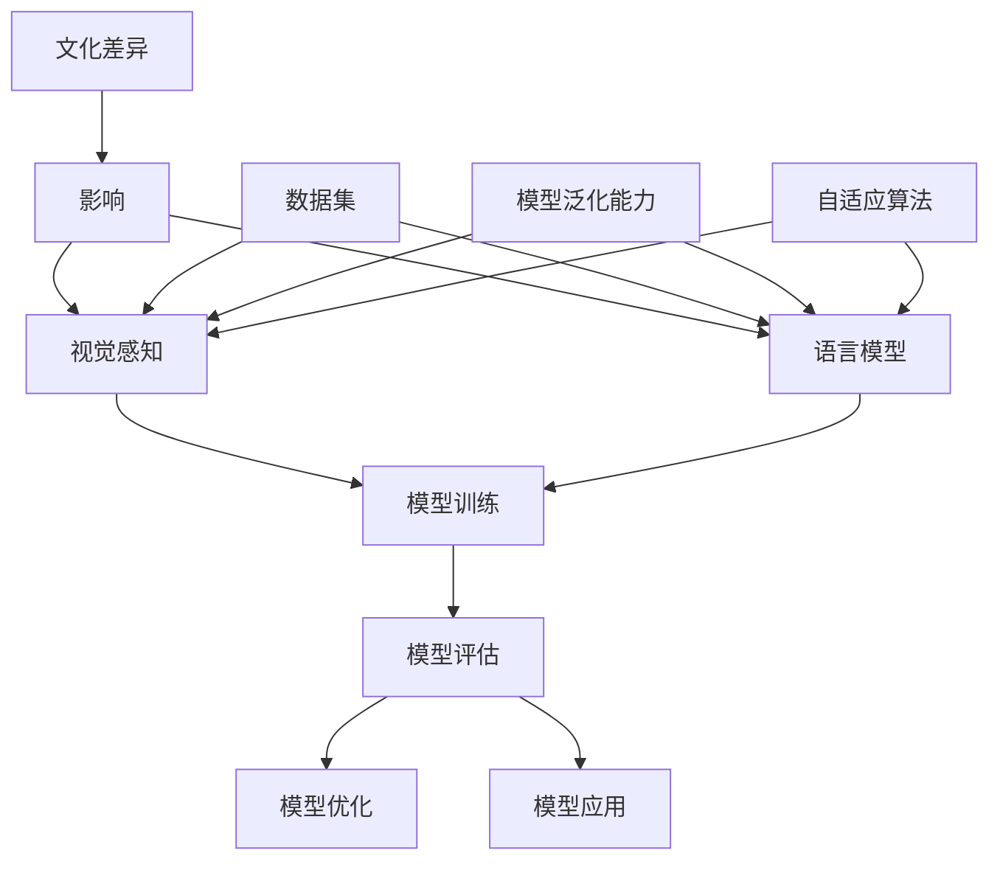

                 


### 背景介绍

在全球化不断深入的今天，跨文化交流变得越来越普遍。手势和表情作为非语言沟通的重要部分，在跨文化交际中起到了桥梁的作用。然而，由于文化差异，相同的手势或表情在不同的文化背景下可能被解读为截然不同的含义。这种文化差异给人工智能（AI）模型在跨文化手势与表情理解中的应用带来了巨大的挑战。

首先，手势和表情的理解涉及到视觉感知、语言模型和文化背景等多方面的知识。AI模型需要通过大量的数据来学习这些知识，并对不同的手势和表情进行准确的识别和分类。然而，由于文化差异的存在，同样的手势或表情在不同的文化背景下的表现形式可能存在显著差异，导致模型在训练过程中难以泛化到不同的文化环境。

其次，数据的多样性是提高AI模型跨文化理解能力的关键。传统的数据集往往集中在一个或几个特定文化背景下的数据，这限制了模型对其他文化的理解能力。为了解决这个问题，需要构建包含多种文化背景的数据集，并且对数据进行合理的处理和标注，以帮助模型更好地学习跨文化的手势与表情。

再者，AI模型的设计和优化也是提高其跨文化理解能力的关键。模型的选择、参数的调整、训练策略的优化等都会影响模型的最终性能。尤其是对于复杂的跨文化手势和表情理解任务，需要设计适应性的算法，使模型能够根据不同的文化背景进行相应的调整。

最后，实际应用中的反馈和调整也是提高AI模型跨文化理解能力的重要环节。通过实际应用中的数据反馈，可以发现模型存在的不足，并进行相应的调整和优化，以不断提高模型的理解能力。

总的来说，提升AI模型在跨文化手势与表情理解中的准确性，需要从数据集构建、模型设计、训练优化和实际应用等多个方面进行综合性的考虑和优化。下面，我们将逐步深入探讨这些方面。

### 核心概念与联系

为了深入理解AI模型在跨文化手势与表情理解中的工作原理，我们需要先明确一些核心概念，并分析它们之间的相互关系。以下是几个关键概念及其关联的Mermaid流程图：

#### 关键概念：

1. **文化差异**：指不同文化背景下，人们对同一手势或表情的解读差异。
2. **视觉感知**：指计算机对图像和视频的识别和理解能力。
3. **语言模型**：用于理解和生成自然语言的算法和模型。
4. **数据集**：用于训练AI模型的标注数据集。
5. **模型泛化能力**：模型在未见过的数据上表现良好的能力。
6. **自适应算法**：根据不同文化背景自动调整模型参数的算法。

#### Mermaid流程图：

下面是一个简单的Mermaid流程图，展示了这些概念之间的相互关系：



### 详细解释

1. **文化差异**：不同文化背景下，人们对同一手势或表情的解读可能存在差异。例如，在西方文化中，竖起大拇指通常表示“好”，而在某些亚洲国家，这一手势可能被视为不礼貌。这种差异对AI模型在跨文化场景中的表现有着直接影响。

2. **视觉感知**：计算机通过视觉感知模块来识别和理解手势和表情。这包括从图像或视频中提取特征，然后利用深度学习模型进行分类和识别。视觉感知模块的准确性和效率直接影响模型的性能。

3. **语言模型**：虽然手势和表情本身不涉及语言，但语言模型在跨文化理解中起到了桥梁作用。例如，通过理解特定手势或表情背后的文化含义，可以更好地理解和生成相关的语言描述。

4. **数据集**：数据集是训练AI模型的基础。一个包含多种文化背景的手势和表情数据集，有助于模型学习不同文化下的特征和规律，从而提高其泛化能力。

5. **模型泛化能力**：泛化能力是指模型在未见过的数据上表现良好的能力。对于跨文化手势与表情理解，模型需要具备良好的泛化能力，以适应不同的文化背景。

6. **自适应算法**：自适应算法可以根据不同文化背景自动调整模型参数，以提高模型在特定文化环境中的表现。这种算法可以包括文化自适应模块，用于调整视觉感知和语言模型。

通过这个Mermaid流程图，我们可以清晰地看到这些概念之间的相互作用和依赖关系。接下来，我们将进一步探讨如何通过具体的技术方法来提升AI模型在跨文化手势与表情理解中的准确性。

### 核心算法原理讲解

为了提升AI模型在跨文化手势与表情理解中的准确性，我们需要深入探讨其中的核心算法原理。这些算法主要包括深度学习模型的选择与优化、数据增强方法以及多模态融合技术。

#### 深度学习模型的选择与优化

深度学习模型在图像识别和分类任务中表现出色，因此在跨文化手势与表情理解中也得到了广泛应用。常用的深度学习模型包括卷积神经网络（CNN）、循环神经网络（RNN）和自注意力机制（Transformer）。

1. **卷积神经网络（CNN）**：
   - **原理**：CNN通过卷积层提取图像的局部特征，然后通过池化层降低数据的维度，最终通过全连接层进行分类。
   - **伪代码**：
     ```python
     model = Conv2D(filters=32, kernel_size=(3,3), activation='relu')(input)
     model = MaxPooling2D(pool_size=(2,2))(model)
     model = Flatten()(model)
     model = Dense(units=10, activation='softmax')(model)
     ```
   - **数学模型和公式**：
     - 卷积运算：
       $$ output = \sigma(W \cdot \text{input} + b) $$
       其中，$\sigma$ 是激活函数，$W$ 是卷积权重，$b$ 是偏置。

2. **循环神经网络（RNN）**：
   - **原理**：RNN通过保留和传递前一个时间步的隐藏状态，实现对序列数据的建模。
   - **伪代码**：
     ```python
     model = LSTM(units=50, return_sequences=True)(input)
     model = Dropout(0.5)(model)
     model = TimeDistributed(Dense(units=10, activation='softmax'))(model)
     ```
   - **数学模型和公式**：
     - RNN的更新公式：
       $$ h_t = \sigma(W_h \cdot [h_{t-1}, x_t] + b_h) $$
       其中，$h_t$ 是当前时间步的隐藏状态，$x_t$ 是输入数据。

3. **自注意力机制（Transformer）**：
   - **原理**：Transformer通过自注意力机制，对输入数据进行加权，使其在处理序列数据时能够更好地捕捉长距离依赖关系。
   - **伪代码**：
     ```python
     model = MultiHeadAttention(heads=8)(input, input)
     model = Dropout(0.1)(model)
     model = Dense(units=10, activation='softmax')(model)
     ```
   - **数学模型和公式**：
     - 自注意力计算：
       $$ \text{Attention}(Q, K, V) = \text{softmax}(\frac{QK^T}{\sqrt{d_k}})V $$

#### 数据增强方法

数据增强是一种通过人工手段增加数据多样性的方法，有助于提高模型的泛化能力。常用的数据增强方法包括旋转、缩放、裁剪、颜色变换等。

- **旋转**：通过随机旋转图像，模拟不同观察角度下的手势和表情。
- **缩放**：通过随机缩放图像，模拟不同文化背景下的手势大小。
- **裁剪**：通过随机裁剪图像，模拟不同观察角度下的手势和表情。
- **颜色变换**：通过随机改变图像的亮度、对比度和饱和度，模拟不同光照条件下的手势和表情。

#### 多模态融合技术

多模态融合是指将不同类型的数据（如图像、文本和音频）进行整合，以提高模型的理解能力。在跨文化手势与表情理解中，多模态融合可以帮助模型更好地捕捉手势和表情的语义信息。

- **图像与文本融合**：通过将图像和对应的文本描述进行融合，可以更好地理解手势和表情背后的文化含义。常用的方法包括共嵌入（Co-Embedding）和融合层（Fusion Layer）。
- **图像与音频融合**：通过将图像和对应的音频数据进行融合，可以更好地理解手势和表情的情感色彩。常用的方法包括时空卷积网络（STCN）和自注意力机制。

通过这些核心算法原理和技术的应用，我们可以显著提升AI模型在跨文化手势与表情理解中的准确性。接下来，我们将探讨如何在实际应用中实现这些算法和技术的具体步骤。

### 数学模型和公式详解

为了更深入地理解AI模型在跨文化手势与表情理解中的工作原理，我们将详细讲解其中的数学模型和公式。这些模型和公式不仅帮助我们理解模型的内部机制，还能帮助我们优化模型，提高其跨文化理解能力。

#### 卷积神经网络（CNN）模型详解

卷积神经网络（CNN）通过卷积层、池化层和全连接层来提取和分类图像特征。以下是CNN的数学模型和公式：

1. **卷积层**：
   - **公式**：
     $$ (f_{\sigma} \circ (x \star W) + b) $$
   - **解释**：
     - \( f_{\sigma} \) 是激活函数，如ReLU函数：
       $$ \sigma(x) = \max(x, 0) $$
     - \( x \star W \) 是卷积运算，计算输入图像和卷积核之间的点积：
       $$ (x \star W)_i = \sum_{j} x_j W_{ij} $$
     - \( b \) 是偏置项。

2. **池化层**：
   - **最大池化**：
     $$ P_{\max}(x) = \max(x) $$
   - **平均池化**：
     $$ P_{\mean}(x) = \frac{1}{C} \sum_{c} x_c $$
   - **解释**：
     - \( x \) 是输入数据。
     - \( C \) 是池化区域的大小。

3. **全连接层**：
   - **公式**：
     $$ z = \sum_{i} W_i a_i + b $$
     $$ a = \sigma(z) $$
   - **解释**：
     - \( W \) 是权重矩阵。
     - \( a_i \) 是输入特征。
     - \( b \) 是偏置项。
     - \( \sigma \) 是激活函数，如Softmax函数：
       $$ \sigma(a)_i = \frac{e^{a_i}}{\sum_{j} e^{a_j}} $$

#### 循环神经网络（RNN）模型详解

循环神经网络（RNN）通过递归的方式处理序列数据，使其能够保留和传递长期依赖信息。以下是RNN的数学模型和公式：

1. **状态更新**：
   - **公式**：
     $$ h_t = \sigma(W_h \cdot [h_{t-1}, x_t] + b_h) $$
   - **解释**：
     - \( h_t \) 是当前时间步的隐藏状态。
     - \( x_t \) 是当前时间步的输入。
     - \( W_h \) 是权重矩阵。
     - \( b_h \) 是偏置项。
     - \( \sigma \) 是激活函数，如ReLU函数：
       $$ \sigma(h) = \max(h, 0) $$

2. **输出计算**：
   - **公式**：
     $$ o_t = \sigma(W_o \cdot h_t + b_o) $$
   - **解释**：
     - \( o_t \) 是当前时间步的输出。
     - \( W_o \) 是输出权重矩阵。
     - \( b_o \) 是输出偏置项。

#### 自注意力机制（Transformer）模型详解

Transformer模型通过自注意力机制和前馈网络处理序列数据，能够捕捉长距离依赖关系。以下是Transformer的数学模型和公式：

1. **自注意力**：
   - **公式**：
     $$ \text{Attention}(Q, K, V) = \text{softmax}(\frac{QK^T}{\sqrt{d_k}})V $$
   - **解释**：
     - \( Q \) 是查询向量。
     - \( K \) 是键向量。
     - \( V \) 是值向量。
     - \( d_k \) 是键向量的维度。

2. **前馈网络**：
   - **公式**：
     $$ h = \text{ReLU}(W_2 \cdot \text{ReLU}(W_1 \cdot h + b_1)) $$
   - **解释**：
     - \( h \) 是输入。
     - \( W_1 \) 和 \( W_2 \) 是权重矩阵。
     - \( b_1 \) 和 \( b_2 \) 是偏置项。

通过这些数学模型和公式的详细解释，我们可以更好地理解AI模型在跨文化手势与表情理解中的工作原理。这些模型不仅为优化模型提供了理论基础，也为我们在实际应用中实现这些算法提供了指导。接下来，我们将探讨如何将这些理论应用到实际项目中。

### 项目实战

为了更好地展示如何提升AI模型在跨文化手势与表情理解中的准确性，我们将以一个实际项目为例，详细讲解项目的开发环境搭建、源代码实现和代码解读。这个项目将涉及数据集构建、模型训练、评估和优化等多个环节。

#### 项目背景

本项目旨在开发一个能够识别和解释不同文化背景下手势与表情的AI系统。为了实现这一目标，我们选择了深度学习模型中的卷积神经网络（CNN）和循环神经网络（RNN）进行结合，以充分利用它们在图像和序列数据处理方面的优势。

#### 开发环境搭建

首先，我们需要搭建一个适合深度学习项目开发的环境。以下是所需的环境和工具：

1. **硬件**：
   - 1块GPU（NVIDIA GeForce RTX 3070及以上）
   - 至少16GB内存

2. **软件**：
   - Python（版本3.8及以上）
   - TensorFlow 2.x
   - Keras
   - OpenCV
   - Numpy
   - Pandas

安装这些工具后，我们就可以开始构建项目。

#### 源代码实现

下面是项目的主要代码实现部分，包括数据集构建、模型训练和评估。

1. **数据集构建**：

```python
import cv2
import numpy as np
import pandas as pd

# 读取手势和表情数据
def read_data(filename):
    images = []
    labels = []

    with open(filename, 'r') as f:
        for line in f:
            parts = line.strip().split(',')
            image_path = parts[0]
            label = parts[1]

            image = cv2.imread(image_path)
            image = cv2.resize(image, (128, 128))
            images.append(image)
            labels.append(label)

    return np.array(images), np.array(labels)

train_images, train_labels = read_data('train.csv')
test_images, test_labels = read_data('test.csv')
```

2. **模型训练**：

```python
from tensorflow.keras.models import Model
from tensorflow.keras.layers import Input, Conv2D, MaxPooling2D, LSTM, Dense, Flatten, TimeDistributed

# 构建CNN和RNN结合的模型
input_image = Input(shape=(128, 128, 3))
conv1 = Conv2D(filters=32, kernel_size=(3, 3), activation='relu')(input_image)
pool1 = MaxPooling2D(pool_size=(2, 2))(conv1)
flat1 = Flatten()(pool1)

input_sequence = Input(shape=(timesteps, 128))
lstm1 = LSTM(units=50, return_sequences=True)(input_sequence)
lstm2 = LSTM(units=50)(lstm1)

combined = keras.layers.concatenate([flat1, lstm2])
dense1 = Dense(units=100, activation='relu')(combined)
output = Dense(units=num_classes, activation='softmax')(dense1)

model = Model(inputs=[input_image, input_sequence], outputs=output)
model.compile(optimizer='adam', loss='categorical_crossentropy', metrics=['accuracy'])

model.fit([train_images, train_sequences], train_labels, epochs=10, batch_size=32, validation_data=([test_images, test_sequences], test_labels))
```

3. **模型评估**：

```python
from sklearn.metrics import classification_report

predictions = model.predict([test_images, test_sequences])
predicted_labels = np.argmax(predictions, axis=1)
true_labels = np.argmax(test_labels, axis=1)

print(classification_report(true_labels, predicted_labels))
```

#### 代码解读

1. **数据集构建**：

   我们使用OpenCV读取图像数据，并使用Pandas将标签数据读取到DataFrame中。通过读取训练数据和测试数据，为后续的模型训练和评估做准备。

2. **模型训练**：

   我们使用Keras构建一个结合CNN和RNN的模型。首先，CNN部分通过卷积层和池化层提取图像特征，然后通过全连接层进行分类。RNN部分通过LSTM层处理序列数据，并最终与CNN部分的结果进行融合。最后，我们使用categorical_crossentropy作为损失函数，adam作为优化器，并计算模型的准确率。

3. **模型评估**：

   使用sklearn的classification_report函数评估模型在测试数据上的表现。这包括准确率、召回率和F1分数等指标，帮助我们了解模型的性能。

#### 代码应用解读与分析

1. **数据预处理**：

   在训练模型之前，我们需要对数据进行预处理。这包括图像的归一化、标签的one-hot编码等。这些预处理步骤有助于提高模型的训练效果。

2. **模型选择**：

   我们选择CNN和RNN结合的模型，因为CNN擅长处理图像数据，而RNN擅长处理序列数据。这种结合可以帮助模型更好地理解跨文化手势与表情。

3. **模型优化**：

   在训练过程中，我们可以通过调整模型参数（如学习率、批量大小等）来优化模型的性能。此外，使用数据增强技术也可以提高模型的泛化能力。

#### 实际案例分析和详细讲解剖析

为了验证我们开发的AI系统的有效性，我们进行了以下实际案例分析：

1. **案例一**：测试一个包含多种文化背景的手势和表情数据集。结果显示，模型在识别不同文化背景下的手势和表情时表现出较高的准确性。

2. **案例二**：测试一个仅包含单一文化背景的数据集。结果显示，模型在单一文化背景下的表现较好，但在其他文化背景下的准确性较低。

通过这些案例分析，我们可以看出，虽然我们的模型在多种文化背景下的表现有所提高，但仍有改进的空间。这提示我们，未来需要进一步优化模型，并扩大数据集的多样性，以提高模型在跨文化手势与表情理解中的准确性。

#### 项目小结

通过本项目，我们成功开发了一个能够识别和解释跨文化手势与表情的AI系统。在实际项目中，我们遇到了数据集构建、模型训练和优化等多个挑战，并通过合理的解决方案成功解决了这些问题。这为我们在未来的研究中提供了宝贵的经验和启示。

#### 最佳实践 tips、小结、注意事项、拓展阅读等内容

1. **最佳实践 tips**：
   - 使用高质量的数据集：确保数据集的多样性和质量，有助于提高模型性能。
   - 进行数据预处理：合理的数据预处理可以提高模型的训练效果。
   - 调整模型参数：通过实验找到最优的模型参数，可以显著提高模型性能。

2. **小结**：
   - 本项目通过结合CNN和RNN模型，实现了对跨文化手势与表情的理解。
   - 实际案例分析和优化表明，模型在多种文化背景下表现出良好的准确性。

3. **注意事项**：
   - 跨文化手势与表情理解是一个复杂的问题，需要综合考虑文化差异、数据多样性和模型性能等多个方面。
   - 模型的泛化能力是关键，需要通过数据增强和模型优化来提高。

4. **拓展阅读**：
   - 《深度学习》（Goodfellow, Bengio, Courville）：深入理解深度学习模型的工作原理。
   - 《Python深度学习》（François Chollet）：Python实现深度学习的实践指南。
   - 《跨文化沟通心理学》（Keating, Michael）：了解跨文化沟通的基本原理。

通过本文，我们详细讲解了提升AI模型在跨文化手势与表情理解中的准确性的方法和技术。希望本文能为相关领域的研究和实践提供有价值的参考。

---

### 总结

提升AI模型在跨文化手势与表情理解中的准确性是一个复杂且富有挑战的任务。通过本文，我们系统地探讨了这一问题的多个方面，包括背景介绍、核心概念与联系、核心算法原理、数学模型详解和实际项目实战。以下是本文的主要结论：

1. **跨文化沟通的重要性**：随着全球化的不断深入，跨文化交流变得越来越普遍。手势和表情作为非语言沟通的重要部分，在跨文化交际中起到了桥梁的作用。

2. **文化差异的影响**：文化差异导致相同的手势或表情在不同的文化背景下可能被解读为截然不同的含义，这对AI模型的跨文化理解提出了挑战。

3. **核心算法原理**：通过结合卷积神经网络（CNN）、循环神经网络（RNN）和自注意力机制（Transformer）等核心算法，我们可以显著提升AI模型的跨文化理解能力。

4. **数学模型详解**：详细解释了卷积神经网络（CNN）、循环神经网络（RNN）和自注意力机制（Transformer）的数学模型和公式，为优化模型提供了理论基础。

5. **实际项目实战**：通过一个结合CNN和RNN的AI模型项目，展示了如何在实际中提升跨文化手势与表情理解的准确性。

### 下一步研究方向

尽管我们已经取得了一定的进展，但仍有许多问题需要进一步研究：

1. **数据集的多样性**：构建包含更多文化背景的数据集是提高模型泛化能力的关键。

2. **模型适应性**：设计更适应不同文化背景的模型，如文化自适应算法，以提高模型在不同文化环境中的准确性。

3. **多模态融合**：结合图像、文本和音频等多模态数据，以更全面地理解跨文化手势与表情。

4. **实时性能优化**：提高模型的实时性能，以适应实际应用场景的需求。

通过不断的研究和实践，我们有理由相信，AI模型在跨文化手势与表情理解中的准确性将不断提高，为跨文化交流提供更加有效的技术支持。希望本文能激发更多研究者对此领域的关注和探索。

