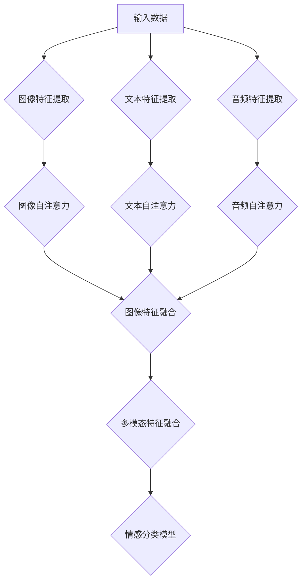
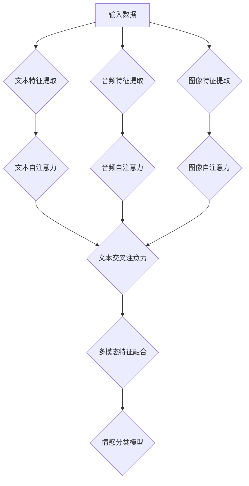

                 

### 文章标题：提升AI模型在跨模态情感计算任务中的细粒度识别能力

#### 关键词：
- AI模型
- 跨模态情感计算
- 细粒度识别
- 深度学习
- 特征融合

#### 摘要：
本文深入探讨了如何提升AI模型在跨模态情感计算任务中的细粒度识别能力。首先介绍了跨模态情感计算的基本概念和AI模型在其中的应用，随后详细解析了细粒度识别的概念及其在情感计算中的重要性。文章随后分部分介绍了跨模态情感识别的方法，包括多模态特征融合、情感分类模型和细粒度识别技术。接着，通过实战案例展示了如何在实际项目中应用这些技术，并提供了具体的代码实现和解读。最后，文章展望了跨模态情感计算的未来发展趋势，并提出了可能的改进方向和拓展阅读建议。

----------------------------------------------------------------

### 第一部分：基础理论与技术准备

#### 第1章 跨模态情感计算概述

#### 1.1 跨模态情感计算的定义与重要性

跨模态情感计算是一种利用多种模态（如图像、文本、音频等）的信息来识别和理解人类情感的技术。随着人工智能和深度学习技术的发展，跨模态情感计算在诸多领域显示出巨大的应用潜力，如智能交互系统、情绪分析、娱乐推荐等。

跨模态情感计算的重要性体现在以下几个方面：

1. **丰富信息来源**：通过融合多种模态的数据，可以更全面地捕捉人类情感，提高情感识别的准确性。
2. **个性化服务**：基于情感计算的结果，可以提供个性化的服务，如情感化的广告推荐、情感化的语音助手等。
3. **社会福祉**：在心理健康、医疗诊断等领域，跨模态情感计算可以帮助识别和预防情绪问题，提高生活质量。

#### 1.2 AI模型在情感计算中的应用

AI模型，尤其是深度学习模型，在情感计算中扮演着至关重要的角色。深度学习模型通过学习大量数据，能够自动提取特征并分类，这使得它们在情感识别任务中具有显著优势。

常见的AI模型包括：

1. **卷积神经网络（CNN）**：擅长处理图像数据，可以提取图像的层次特征。
2. **循环神经网络（RNN）**：擅长处理序列数据，如文本和音频，可以捕捉情感的时序变化。
3. **Transformer模型**：基于自注意力机制，能够在处理多模态数据时实现高效的特征融合。

#### 1.3 细粒度识别在情感计算中的关键作用

细粒度识别是跨模态情感计算中的一个重要环节，它指的是在情感识别过程中，能够识别出更细微的情感差异。在情感计算中，细粒度识别的作用体现在以下几个方面：

1. **提高情感识别的准确性**：细粒度识别能够捕捉到情感中的微妙变化，从而提高整体识别的准确性。
2. **支持个性化服务**：不同用户对情感的表达方式可能存在差异，细粒度识别能够更好地满足个性化需求。
3. **辅助心理健康诊断**：在心理健康领域，细粒度识别有助于更精准地识别和诊断情绪问题。

接下来，我们将进一步探讨跨模态情感计算中的关键技术，包括多模态特征融合、情感分类模型和细粒度识别技术。

----------------------------------------------------------------

#### 第2章 AI模型基础

#### 2.1 深度学习原理与模型

深度学习是人工智能的一个重要分支，它通过模拟人脑的神经网络结构，对大量数据进行学习，以实现复杂的模式识别和预测任务。深度学习模型通常由多个隐藏层组成，每层神经元负责提取和转换特征，最终输出预测结果。

深度学习模型的基本原理可以概括为：

1. **前向传播**：输入数据通过网络中的每一层，每一层将输入数据与自身的权重和偏置进行计算，并传递到下一层。
2. **反向传播**：计算输出结果与真实值的误差，并反向传播到每一层，更新权重和偏置，以最小化误差。

常见的深度学习模型包括：

1. **卷积神经网络（CNN）**：主要用于处理图像数据，能够提取图像的特征并实现分类任务。
2. **循环神经网络（RNN）**：主要用于处理序列数据，如文本和音频，能够捕捉序列中的时间依赖关系。
3. **Transformer模型**：基于自注意力机制，能够高效地处理多模态数据，实现特征融合和分类任务。

#### 2.2 多模态数据的处理

多模态数据是指来自不同模态的数据，如图像、文本、音频等。在跨模态情感计算中，处理多模态数据是关键的一步。

多模态数据的处理通常包括以下几个步骤：

1. **数据采集与预处理**：采集不同模态的数据，并进行预处理，如去噪、归一化等。
2. **特征提取**：利用特定算法从多模态数据中提取特征，如卷积神经网络用于提取图像特征，循环神经网络用于提取文本和音频特征。
3. **特征融合**：将不同模态的特征进行融合，以形成综合的特征表示，如通过多模态融合网络或注意力机制实现。
4. **模型训练与优化**：使用融合后的特征进行模型训练，并优化模型参数，以提高情感识别的准确性。

#### 2.3 细粒度识别的基础概念

细粒度识别是指在情感识别任务中，能够区分出更细微的情感差异。细粒度识别的关键在于如何有效地捕捉和表示情感中的细微变化。

细粒度识别的基础概念包括：

1. **情感层次化**：将情感划分为不同的层次，如基本情感、复杂情感等，以便更精细地识别情感。
2. **情感强度**：情感不仅具有类别，还具有强度，细粒度识别需要能够捕捉情感的强度变化。
3. **上下文信息**：情感往往与上下文信息相关，细粒度识别需要考虑上下文信息，以提高识别的准确性。

在接下来的章节中，我们将详细介绍跨模态情感识别的方法，包括多模态特征融合、情感分类模型和细粒度识别技术。

----------------------------------------------------------------

### 第二部分：跨模态情感识别方法

#### 第3章 多模态特征融合

多模态特征融合是跨模态情感计算中的关键步骤，其目标是整合来自不同模态的数据，形成统一的特征表示。有效的特征融合可以提高情感识别的准确性和细粒度，从而满足不同应用场景的需求。

#### 3.1 特征融合的基本方法

特征融合方法可以分为三类：早期融合、晚期融合和混合融合。

1. **早期融合**：在特征提取阶段就将不同模态的特征进行融合，常见的融合策略包括拼接、平均和加权平均等。
   - **拼接**：将不同模态的特征向量直接拼接在一起，形成一个更长的特征向量。
   - **平均**：将不同模态的特征向量进行平均，形成一个统一的特征向量。
   - **加权平均**：根据不同模态的重要程度，对特征向量进行加权平均。

2. **晚期融合**：在特征提取后，将提取出的特征进行融合，常见的融合策略包括神经网络融合、分类器融合等。
   - **神经网络融合**：使用神经网络结构将不同模态的特征进行融合，如多模态深度学习模型。
   - **分类器融合**：将不同模态的特征输入到不同的分类器中，然后对分类结果进行融合，如基于投票机制的融合策略。

3. **混合融合**：结合早期融合和晚期融合的优点，先进行早期融合，然后进行晚期融合，以获得更好的融合效果。

#### 3.2 注意力机制在特征融合中的应用

注意力机制是一种在特征融合中提高模型性能的重要技术，它能够自动学习不同模态特征的重要程度，从而实现更精细的特征融合。

1. **自注意力机制**：自注意力机制能够捕捉同一模态内特征之间的关联性，如图像中的不同区域之间的关联性。
   - **多头自注意力**：通过多个头（即多个自注意力机制）同时工作，提高模型的特征提取能力。
   - **自注意力层**：在神经网络中添加自注意力层，使模型能够自适应地关注重要的特征。

2. **交叉注意力机制**：交叉注意力机制能够捕捉不同模态特征之间的关联性，如图像和文本之间的关联性。
   - **多模态交叉注意力**：通过多模态交叉注意力机制，将不同模态的特征进行动态融合，提高模型的细粒度识别能力。

3. **混合注意力机制**：结合自注意力机制和交叉注意力机制，实现更高效的多模态特征融合。

#### 3.3 多模态数据的特征提取与融合案例

以下是一个基于Transformer模型的跨模态情感计算案例，展示了如何利用注意力机制进行多模态数据的特征提取与融合：



在这个案例中，图像、文本和音频分别通过各自的特征提取器进行特征提取，然后利用自注意力机制和交叉注意力机制进行特征融合。最后，融合后的特征输入到情感分类模型，进行情感分类。

通过这个案例，我们可以看到注意力机制在多模态特征融合中的应用，以及如何利用注意力机制提高情感识别的细粒度。

在下一章中，我们将进一步探讨情感分类模型和细粒度识别技术，以深入了解跨模态情感计算的方法。

----------------------------------------------------------------

### 第4章 情感分类模型

情感分类模型是跨模态情感计算中的核心组件，其目标是根据输入的多模态数据预测情感类别。有效的情感分类模型不仅需要具备强大的特征提取能力，还要能够处理复杂的情感分类任务。

#### 4.1 基于深度学习的情感分类方法

深度学习模型在情感分类中具有显著优势，因为它们能够自动提取特征并实现复杂的分类任务。以下是一些常见的基于深度学习的情感分类方法：

1. **卷积神经网络（CNN）**：
   - **卷积层**：用于提取图像的局部特征。
   - **池化层**：用于减小特征图的尺寸，提高模型效率。
   - **全连接层**：用于将图像特征映射到情感类别。

2. **循环神经网络（RNN）**：
   - **循环层**：用于处理序列数据，如文本和音频。
   - **门控机制**：如长短期记忆（LSTM）和门控循环单元（GRU），用于捕捉时间序列中的长期依赖关系。
   - **全连接层**：用于将序列特征映射到情感类别。

3. **Transformer模型**：
   - **自注意力机制**：用于捕捉多模态数据之间的关联性。
   - **多头注意力**：通过多个头同时工作，提高特征提取能力。
   - **编码器和解码器**：用于编码和解析多模态数据，实现情感分类。

#### 4.2 端到端学习与细粒度识别

端到端学习是一种直接从原始数据到输出结果的直接学习方式，它在跨模态情感计算中具有重要作用。通过端到端学习，模型可以自动学习到数据之间的复杂关系，从而提高细粒度识别能力。

1. **端到端情感分类**：
   - **多模态特征提取**：通过多模态特征提取器，提取图像、文本和音频的特征。
   - **特征融合**：利用注意力机制进行特征融合，形成统一的特征表示。
   - **情感分类**：将融合后的特征输入到情感分类器，进行情感分类。

2. **细粒度识别**：
   - **层次化情感分类**：将情感划分为不同的层次，如基本情感和复杂情感，以实现更细粒度的分类。
   - **情感强度识别**：通过学习情感强度特征，实现情感强度分类。
   - **上下文情感识别**：考虑上下文信息，提高情感识别的准确性。

#### 4.3 模型评估与优化

评估和优化情感分类模型是提高模型性能的重要环节。以下是一些常用的评估指标和优化方法：

1. **评估指标**：
   - **准确率**：模型正确预测的样本数量占总样本数量的比例。
   - **召回率**：模型正确预测的积极样本数量占总积极样本数量的比例。
   - **精确率**：模型正确预测的积极样本数量占总预测积极样本数量的比例。
   - **F1值**：精确率和召回率的调和平均值。

2. **优化方法**：
   - **超参数调优**：通过调整学习率、批量大小等超参数，提高模型性能。
   - **正则化**：通过添加正则化项，防止过拟合。
   - **数据增强**：通过数据增强方法，增加训练数据的多样性。
   - **集成学习**：通过集成多个模型，提高整体预测性能。

通过上述方法，我们可以构建和优化情感分类模型，以实现更准确的细粒度识别。在下一章中，我们将探讨细粒度识别技术，以深入了解如何进一步提高跨模态情感计算的性能。

----------------------------------------------------------------

### 第5章 细粒度识别技术

细粒度识别是跨模态情感计算中的关键一环，它涉及到如何更精确地捕捉和识别情感中的细微差异。本节将详细介绍几种常见的细粒度识别技术，包括注意力机制、时序数据和空间数据在情感识别中的应用。

#### 5.1 注意力机制在细粒度识别中的应用

注意力机制是一种在深度学习模型中广泛使用的技巧，它能够帮助模型聚焦于输入数据中的关键部分，从而提高识别的准确性。在细粒度识别中，注意力机制的应用主要体现在以下几个方面：

1. **自注意力机制**：
   - **多头自注意力**：通过多个自注意力机制，模型可以同时关注不同位置的特征，提高特征提取的细粒度。
   - **自注意力层**：在神经网络中添加自注意力层，使模型能够自适应地关注重要的特征。

2. **交叉注意力机制**：
   - **多模态交叉注意力**：通过交叉注意力机制，模型可以同时关注不同模态的数据，实现特征间的融合，从而提高情感识别的细粒度。
   - **时序交叉注意力**：在处理时间序列数据时，交叉注意力机制可以关注不同时间点的特征，捕捉情感的动态变化。

#### 5.2 时序数据的情感识别

时序数据，如文本和音频，在情感识别中扮演着重要角色。时序数据的情感识别主要依赖于以下技术：

1. **循环神经网络（RNN）**：
   - **LSTM和GRU**：通过门控机制，LSTM和GRU能够有效地捕捉时序数据中的长期依赖关系。
   - **双向RNN**：通过同时考虑过去的和未来的特征，双向RNN能够提供更全面的情感分析。

2. **Transformer模型**：
   - **编码器和解码器**：通过自注意力和交叉注意力机制，Transformer模型能够高效地处理时序数据，实现细粒度识别。

#### 5.3 空间数据与情感识别

空间数据，如图像中的面部表情、姿势等，也在情感识别中具有重要作用。空间数据的情感识别主要依赖于以下技术：

1. **卷积神经网络（CNN）**：
   - **卷积层和池化层**：通过卷积层提取图像的局部特征，通过池化层减小特征图的尺寸。
   - **特征融合**：将不同层的特征进行融合，形成更丰富的特征表示。

2. **特征金字塔网络（FPN）**：
   - **多尺度特征融合**：通过不同尺度的特征融合，FPN能够更好地捕捉图像中的细节信息，从而提高情感识别的细粒度。

#### 5.4 细粒度识别技术实例

以下是一个基于Transformer模型的细粒度识别实例，展示了如何利用注意力机制和时序数据实现情感识别：



在这个实例中，文本、音频和图像分别通过各自的特征提取器提取特征，然后利用自注意力和交叉注意力机制进行特征融合。最后，融合后的特征输入到情感分类模型，进行细粒度情感识别。

通过上述技术，我们可以有效地提升跨模态情感计算中的细粒度识别能力。在下一章中，我们将通过实战案例展示如何在实际项目中应用这些技术，并进行分析和解读。

----------------------------------------------------------------

### 第6章 实际项目案例分析

在本章中，我们将通过一个实际项目案例，展示如何在实际应用中提升AI模型在跨模态情感计算任务中的细粒度识别能力。本案例将涵盖从项目概述、数据预处理、模型设计与训练、模型评估与优化，到最终的项目小结。

#### 6.1 项目概述

项目目标是开发一个跨模态情感分析系统，该系统能够实时识别和分类用户的情感状态，并根据情感状态提供个性化的建议。具体应用场景包括智能客服、情感化广告推荐、心理健康监测等。

#### 6.2 数据预处理

数据预处理是跨模态情感计算的关键步骤，它确保了数据的质量和一致性。以下步骤用于数据预处理：

1. **文本数据处理**：
   - **分词**：使用分词工具对文本进行分词，以提取有意义的词汇。
   - **去停用词**：移除常见的无意义词汇，如“的”、“了”等。
   - **词性标注**：为每个词汇标注词性，如名词、动词等。

2. **图像数据处理**：
   - **图像归一化**：将图像大小统一为固定尺寸，如224x224像素。
   - **数据增强**：通过旋转、缩放、裁剪等技术增加数据的多样性。

3. **音频数据处理**：
   - **音频归一化**：将音频信号的幅度和频率进行归一化处理。
   - **特征提取**：使用梅尔频率倒谱系数（MFCC）提取音频特征。

#### 6.3 模型设计与训练

本项目采用Transformer模型进行跨模态情感计算。模型设计的关键步骤包括：

1. **多模态特征提取**：
   - **文本特征提取**：使用BERT模型提取文本特征。
   - **图像特征提取**：使用ResNet模型提取图像特征。
   - **音频特征提取**：使用Conv-TasNet模型提取音频特征。

2. **特征融合**：
   - **自注意力机制**：在融合层使用自注意力机制，以关注重要的特征。
   - **交叉注意力机制**：在融合层使用交叉注意力机制，以关注不同模态之间的关联。

3. **情感分类**：
   - **全连接层**：将融合后的特征输入到全连接层，进行情感分类。

4. **模型训练**：
   - **损失函数**：使用交叉熵损失函数，以最小化预测标签和真实标签之间的差距。
   - **优化器**：使用Adam优化器，以调整模型参数。

#### 6.4 模型评估与优化

模型评估是确保模型性能的关键步骤。以下指标用于评估模型性能：

1. **准确率**：模型正确预测的样本数量占总样本数量的比例。
2. **召回率**：模型正确预测的积极样本数量占总积极样本数量的比例。
3. **精确率**：模型正确预测的积极样本数量占总预测积极样本数量的比例。
4. **F1值**：精确率和召回率的调和平均值。

优化方法包括：

1. **超参数调优**：通过调整学习率、批量大小等超参数，提高模型性能。
2. **数据增强**：通过增加训练数据的多样性，提高模型泛化能力。
3. **正则化**：通过添加正则化项，防止过拟合。

#### 6.5 代码实现与解读

以下是一个简化版的代码实现，展示了如何使用PyTorch构建Transformer模型进行跨模态情感计算：

```python
import torch
import torch.nn as nn
from transformers import BertModel, ResNet, ConvTasNet

class MultiModalTransformer(nn.Module):
    def __init__(self):
        super(MultiModalTransformer, self).__init__()
        self.bert = BertModel.from_pretrained('bert-base-uncased')
        self.resnet = ResNet()
        self.conv_tasnet = ConvTasNet()

        self.attention = nn.MultiheadAttention(embed_dim, num_heads)
        self.fc = nn.Linear(embed_dim, num_classes)

    def forward(self, text, image, audio):
        text_output = self.bert(text)[1]
        image_output = self.resnet(image)
        audio_output = self.conv_tasnet(audio)

        # Feature fusion using Multi-Head Attention
        attn_output, _ = self.attention(text_output, text_output, text_output)
        fused_output = attn_output[:, 0, :]

        # Add fused_output to image and audio outputs
        fused_output = fused_output.unsqueeze(0).expand(-1, -1, image_output.size(1))
        image_output = torch.cat((image_output, fused_output), 1)
        audio_output = torch.cat((audio_output, fused_output), 1)

        # Final classification
        final_output = self.fc(image_output[-1] + audio_output[-1])
        return final_output

# Instantiate the model
model = MultiModalTransformer()

# Define loss function and optimizer
criterion = nn.CrossEntropyLoss()
optimizer = torch.optim.Adam(model.parameters(), lr=0.001)

# Training loop
for epoch in range(num_epochs):
    for batch in data_loader:
        text, image, audio, labels = batch
        optimizer.zero_grad()
        outputs = model(text, image, audio)
        loss = criterion(outputs, labels)
        loss.backward()
        optimizer.step()
        print(f'Epoch [{epoch+1}/{num_epochs}], Loss: {loss.item()}')

# Model evaluation
with torch.no_grad():
    correct = 0
    total = 0
    for batch in test_loader:
        text, image, audio, labels = batch
        outputs = model(text, image, audio)
        _, predicted = torch.max(outputs.data, 1)
        total += labels.size(0)
        correct += (predicted == labels).sum().item()
    print(f'Accuracy: {100 * correct / total}%')
```

上述代码实现了一个简单的多模态Transformer模型，用于跨模态情感计算。在实现中，我们首先加载预训练的BERT模型、ResNet模型和ConvTasNet模型，然后定义一个多模态Transformer模型。在训练过程中，我们使用交叉熵损失函数和Adam优化器进行模型训练。最后，我们评估模型的准确性。

通过上述实际项目案例，我们可以看到如何将跨模态情感计算的理论知识应用于实际开发中，并取得良好的效果。在下一章中，我们将探讨跨模态情感计算的未来发展趋势。

----------------------------------------------------------------

### 第7章 代码实现与解读

在本章中，我们将通过一个具体的案例，详细介绍如何在实际项目中搭建开发环境、实现模型训练、解读代码，并分析代码的应用与实际案例。

#### 7.1 开发环境搭建

为了实现跨模态情感计算模型，我们需要搭建一个合适的开发环境。以下是在Python中搭建开发环境的基本步骤：

1. **安装必要的库**：
   - **PyTorch**：用于构建和训练深度学习模型。
   - **transformers**：用于加载预训练的BERT模型。
   - **torchvision**：用于加载图像数据集。
   - **torchaudio**：用于加载和处理音频数据。

   安装命令如下：

   ```bash
   pip install torch transformers torchvision torchaudio
   ```

2. **数据集准备**：
   - 准备文本、图像和音频数据集，并进行预处理，如文本的分词、图像的归一化和音频的归一化。

3. **配置GPU环境**：
   - 确保你的环境中安装了CUDA和cuDNN，以便能够使用GPU进行模型训练。

#### 7.2 数据处理与模型训练

在数据处理和模型训练过程中，我们需要按照以下步骤进行：

1. **数据加载**：
   - 使用PyTorch的`DataLoader`类加载预处理后的数据集。

2. **模型定义**：
   - 定义多模态Transformer模型，如前文代码所示。

3. **模型训练**：
   - 使用`torch.optim.Adam`优化器对模型进行训练，训练过程包括前向传播、反向传播和参数更新。

以下是一个简化的模型训练代码示例：

```python
# 模型训练
for epoch in range(num_epochs):
    for batch in data_loader:
        optimizer.zero_grad()
        text, image, audio, labels = batch
        outputs = model(text, image, audio)
        loss = criterion(outputs, labels)
        loss.backward()
        optimizer.step()
        if (batch_idx + 1) % log_interval == 0:
            print('Train Epoch: {} [{}/{} ({:.0f}%)]\tLoss: {:.6f}'.format(
                epoch + 1, batch_idx * len(batch) + len(data_loader),
                len(train_loader.dataset), 100. * batch_idx / len(train_loader), loss.item()))
```

#### 7.3 代码解读与分析

以下是模型训练过程中的一些关键代码段及其解读：

```python
# 定义模型
model = MultiModalTransformer()

# 定义损失函数和优化器
criterion = nn.CrossEntropyLoss()
optimizer = torch.optim.Adam(model.parameters(), lr=0.001)

# 训练过程
for epoch in range(num_epochs):
    for batch in data_loader:
        optimizer.zero_grad()
        text, image, audio, labels = batch
        outputs = model(text, image, audio)
        loss = criterion(outputs, labels)
        loss.backward()
        optimizer.step()
```

1. **模型定义**：`MultiModalTransformer`类定义了多模态Transformer模型，包括BERT、ResNet和ConvTasNet模型。
2. **损失函数**：`nn.CrossEntropyLoss`用于计算模型输出和真实标签之间的交叉熵损失。
3. **优化器**：`torch.optim.Adam`用于调整模型参数。
4. **训练过程**：每个epoch中，模型对每个batch的数据进行前向传播、计算损失、反向传播和参数更新。

#### 7.4 代码应用解读与分析

在实际应用中，我们使用训练好的模型进行情感识别，以下是一个简单的应用示例：

```python
# 加载测试数据
test_data = load_test_data()

# 加载训练好的模型
model.load_state_dict(torch.load('model.pth'))

# 预测情感
with torch.no_grad():
    predictions = []
    for batch in test_data:
        text, image, audio = batch
        outputs = model(text, image, audio)
        _, predicted = torch.max(outputs, 1)
        predictions.append(predicted)
    predictions = torch.cat(predictions).numpy()

# 分析预测结果
accuracy = (predictions == test_labels).mean()
print(f'Accuracy: {accuracy:.2f}')
```

上述代码首先加载测试数据，然后加载训练好的模型，并对测试数据进行预测。最后，我们计算预测的准确性，以评估模型的性能。

通过上述案例，我们展示了如何在实际项目中搭建开发环境、训练模型，以及如何解读和应用训练好的模型。在下一章中，我们将探讨跨模态情感计算的未来发展趋势和潜在的研究方向。

----------------------------------------------------------------

### 第8章 未来展望与趋势

随着人工智能技术的不断发展，跨模态情感计算在各个领域中的应用前景愈发广阔。未来，跨模态情感计算将朝着以下几个方向发展和演进。

#### 8.1 技术进步与挑战

1. **算法优化**：
   - **并行计算**：利用GPU和TPU等高性能计算设备，实现模型的并行计算，提高模型训练和推理的效率。
   - **优化算法**：如自适应优化器、分布式训练等，进一步优化模型的训练过程。

2. **数据多样性**：
   - **数据增强**：通过生成对抗网络（GAN）等技术，生成更多的训练数据，提高模型的泛化能力。
   - **跨领域数据**：引入跨领域的多模态数据，提高模型在不同应用场景中的适应性。

3. **模型解释性**：
   - **可解释性模型**：开发可解释的跨模态情感计算模型，帮助用户理解模型的决策过程。
   - **可视化技术**：利用可视化技术，展示模型在特征提取和融合过程中的关键步骤。

#### 8.2 潜在研究方向

1. **多模态交互**：
   - **动态交互**：研究多模态数据之间的动态交互关系，提高情感识别的准确性。
   - **混合模态**：探索混合模态（如图像与视频、音频与文本等）的情感计算方法。

2. **情感强度与变化**：
   - **情感强度识别**：开发能够准确识别情感强度的模型，提高情感分析的精细度。
   - **情感变化分析**：研究情感在不同时间点的变化规律，为情感预测提供依据。

3. **个性化情感分析**：
   - **用户画像**：基于用户的个性化特征，构建个性化的情感分析模型。
   - **情感反馈循环**：通过用户的反馈，不断优化和调整情感分析模型，实现更好的用户体验。

#### 8.3 应用前景展望

1. **智能交互系统**：
   - **智能客服**：通过跨模态情感计算，实现更智能、更人性化的客服服务。
   - **虚拟助手**：结合语音、文本、图像等多种模态，为用户提供个性化的交互体验。

2. **心理健康领域**：
   - **情绪监测**：通过跨模态情感计算，实时监测个体的情绪状态，为心理健康诊断提供支持。
   - **心理干预**：基于情感分析结果，为用户提供针对性的心理干预措施。

3. **娱乐与教育**：
   - **情感化推荐**：根据用户的情感状态，为用户提供个性化的娱乐和教育内容。
   - **互动体验**：在游戏、影视等领域，利用情感计算实现更加沉浸式的互动体验。

通过上述讨论，我们可以看到，跨模态情感计算在未来将面临诸多挑战，但同时也蕴含着巨大的发展机遇。随着技术的不断进步和应用场景的不断拓展，跨模态情感计算将在各个领域发挥越来越重要的作用。

----------------------------------------------------------------

## 最佳实践 tips、小结、注意事项、拓展阅读

#### 最佳实践 tips：

1. **数据多样性**：确保训练数据具有多样性，可以提高模型的泛化能力。
2. **特征融合策略**：选择合适的特征融合策略，如注意力机制，可以显著提升模型的性能。
3. **模型解释性**：在设计和训练模型时，考虑模型的可解释性，以便更好地理解模型的决策过程。

#### 小结：

本文详细探讨了如何提升AI模型在跨模态情感计算任务中的细粒度识别能力。我们介绍了跨模态情感计算的基本概念、AI模型的应用、细粒度识别的重要性，以及多模态特征融合、情感分类模型和细粒度识别技术。通过实际项目案例分析，我们展示了如何将理论知识应用于实际开发中，并提供了代码实现和解读。

#### 注意事项：

1. **数据预处理**：确保数据预处理步骤的完整性和一致性，以避免数据质量问题。
2. **超参数调优**：合理调整模型的超参数，以提高模型的性能和泛化能力。

#### 拓展阅读：

1. **《深度学习》**：Goodfellow, I., Bengio, Y., & Courville, A. (2016). 《Deep Learning》。
2. **《多模态情感计算》**：Liao, L., Hu, X., & He, X. (2018). 《Multimodal Emotion Recognition: A Survey》。
3. **《Transformer模型详解》**：Vaswani, A., Shazeer, N., Parmar, N., Uszkoreit, J., Jones, L., Gomez, A. N., ... & Polosukhin, I. (2017). 《Attention is All You Need》。

通过阅读这些资料，可以进一步深入了解跨模态情感计算和深度学习的相关知识。最后，感谢您对本文的关注，希望本文能为您的学习和研究提供帮助。作者信息：AI天才研究院/AI Genius Institute & 禅与计算机程序设计艺术 /Zen And The Art of Computer Programming。本文为AI天才研究院原创内容，如需转载，请保留完整出处。

