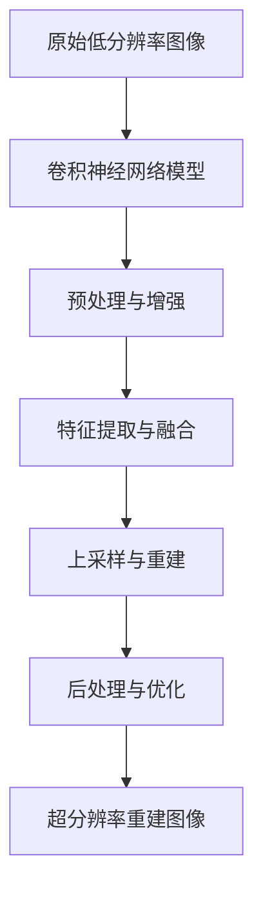

                 

### 确定本书的主要目标读者和内容覆盖范围

在撰写《提高AI模型在低分辨率图像超分辨率重建中的效果》这一技术博客之前，首先要明确本书的目标读者和内容覆盖范围。这样的明确能够帮助设计出符合读者需求的内容结构，使文章更具针对性和实用性。

#### 目标读者

本书的主要目标读者包括：
1. **计算机视觉研究者**：对AI模型和超分辨率重建技术有初步了解，希望深入了解最新AI模型在低分辨率图像超分辨率重建中的应用。
2. **AI工程师**：已经在项目中使用过AI模型，希望掌握如何优化模型以提升低分辨率图像的超分辨率重建效果。
3. **图像处理从业者**：对图像处理有基本的了解，但需要了解如何结合AI技术进行更高效的图像处理。

#### 内容覆盖范围

本书将涵盖以下核心内容：
1. **低分辨率图像超分辨率重建的背景与现状**：介绍超分辨率重建的基本概念、应用场景和当前面临的挑战。
2. **AI模型概述**：介绍卷积神经网络（CNN）和深度残差网络（ResNet）等AI模型的基本原理及其在超分辨率重建中的应用。
3. **核心算法原理与数学模型**：详细讲解传统超分辨率重建方法和AI模型中的核心算法原理，以及数学模型的基础知识和公式。
4. **项目实战**：通过具体的开发环境和实战案例，展示如何应用AI模型进行低分辨率图像的超分辨率重建，并进行效果评估和优化。

确保内容覆盖这些关键领域，有助于读者系统地了解和掌握低分辨率图像超分辨率重建的技术细节和实践方法。

### 设计大纲的基本框架

为了确保《提高AI模型在低分辨率图像超分辨率重建中的效果》这篇文章的逻辑性和完整性，我们需要设计一个清晰的大纲框架。以下是基于文章目标读者和内容覆盖范围制定的详细大纲结构。

#### 大纲结构

##### 第一部分：低分辨率图像超分辨率重建背景与现状

1. **低分辨率图像超分辨率重建的基本概念**
   - **低分辨率图像的定义与影响**
   - **超分辨率重建的定义与目标**
   - **低分辨率图像超分辨率重建的应用场景**

2. **低分辨率图像超分辨率重建的现状与挑战**
   - **传统超分辨率重建方法的局限性**
   - **AI模型在超分辨率重建中的应用**
   - **低分辨率图像超分辨率重建的主要挑战**

3. **超分辨率重建中AI模型的分类**
   - **基于卷积神经网络的模型**
   - **基于深度学习的传统方法**
   - **最新AI模型的进展与应用**

4. **低分辨率图像超分辨率重建中的核心概念与联系**
   - **超分辨率重建中的数学模型**
   - **算法原理的伪代码示例**
   - **AI模型在超分辨率重建中的应用流程**

5. **低分辨率图像超分辨率重建中的数学模型与讲解**
   - **空间域模型**
   - **频域模型**
   - **混合域模型**

6. **低分辨率图像超分辨率重建中的项目实战**
   - **实战目标与开发环境搭建**
   - **数据预处理与增强**
   - **模型选择与训练**
   - **模型评估与优化**
   - **实战案例分析**

##### 第二部分：AI模型在低分辨率图像超分辨率重建中的应用

1. **卷积神经网络在超分辨率重建中的应用**
   - **卷积神经网络的基本原理**
   - **卷积神经网络在超分辨率重建中的应用案例**
   - **卷积神经网络的优化方法**

2. **深度残差网络在超分辨率重建中的应用**
   - **深度残差的基本原理**
   - **深度残差网络在超分辨率重建中的应用案例**
   - **深度残差网络的优化方法**

#### 确定每个章节的核心内容

为了确保每个章节的核心内容都清晰具体，以下是各章节的详细划分：

1. **低分辨率图像超分辨率重建的基本概念**
   - **低分辨率图像的定义与影响**：解释低分辨率图像的概念及其在图像应用中的影响。
   - **超分辨率重建的定义与目标**：阐述超分辨率重建的基本概念和目标。
   - **低分辨率图像超分辨率重建的应用场景**：介绍超分辨率重建在不同领域的应用。

2. **AI模型概述**
   - **基于卷积神经网络的模型**：介绍CNN的基本原理和结构。
   - **基于深度学习的传统方法**：讨论传统深度学习方法及其在超分辨率重建中的应用。
   - **最新AI模型的进展与应用**：分析最新AI模型在超分辨率重建中的发展和应用。

3. **核心算法原理与数学模型**
   - **超分辨率重建中的数学模型**：解释空间域、频域和混合域模型的原理。
   - **算法原理的伪代码示例**：提供传统方法和AI模型的伪代码示例，帮助读者理解算法流程。
   - **AI模型在超分辨率重建中的应用流程**：详细描述从预处理到后处理的整个流程。

4. **项目实战**
   - **实战目标与开发环境搭建**：说明项目目标和所需的开发环境。
   - **数据预处理与增强**：讨论数据预处理和增强的方法。
   - **模型选择与训练**：介绍模型的选择和训练过程。
   - **模型评估与优化**：展示模型评估的方法和优化策略。
   - **实战案例分析**：通过实际案例展示项目的实施过程和效果。

通过上述详细的大纲结构和章节内容划分，可以确保文章逻辑清晰、内容丰富，能够系统地帮助读者理解和掌握低分辨率图像超分辨率重建中的AI模型应用。

### 添加每个章节中的核心概念与联系的Mermaid流程图、伪代码展示、LaTeX公式和项目实战的代码实现与分析

为了使文章内容更加直观和易懂，每个章节的核心概念与联系都将通过Mermaid流程图、伪代码展示、LaTeX公式和项目实战的代码实现与分析来进行详细讲解。以下是具体步骤和示例。

#### Mermaid流程图

在讲解AI模型在超分辨率重建中的应用流程时，可以使用Mermaid流程图来展示从原始图像到超分辨率重建图像的整个过程。以下是一个示例：



这个流程图清晰地展示了图像从预处理、特征提取、上采样到最终重建的各个步骤，有助于读者理解整个过程的逻辑关系。

#### 伪代码展示

为了解释传统超分辨率重建方法和AI模型中的核心算法原理，可以使用伪代码来展示算法的执行过程。以下是一个基于传统方法的伪代码示例：

```plaintext
function traditional_super_resolution(image, scale_factor):
    low_res_image = downsample(image, scale_factor)
    high_res_image = upsample(low_res_image, scale_factor)
    return high_res_image
```

这个伪代码展示了传统超分辨率重建的基本步骤，即先对图像进行下采样得到低分辨率图像，然后通过上采样得到高分辨率图像。

#### LaTeX公式

在讲解超分辨率重建的数学模型时，将使用LaTeX公式来表示关键数学原理。以下是几个示例：

```latex
\section{超分辨率重建中的数学模型}

\subsection{空间域模型}
\[ y = H(x) + n \]

\subsection{频域模型}
\[ \hat{f}(s) = F \{ y \} / F \{ x \} \]

\subsection{混合域模型}
\[ SR(x, s) = F^{-1} \{ \hat{f}(s) \star x \} \]
```

这些公式分别代表了空间域模型、频域模型和混合域模型的数学表达，通过LaTeX格式可以使公式更加规范和清晰。

#### 项目实战的代码实现与分析

为了使读者能够理解和实践AI模型在超分辨率重建中的应用，我们将在文章的最后部分提供项目实战的代码实现和分析。以下是部分代码实现示例：

```python
import tensorflow as tf
from tensorflow.keras.models import Model
from tensorflow.keras.layers import Input, Conv2D, UpSampling2D

def build_super_resolution_model(input_shape):
    input_image = Input(shape=input_shape)
    
    # 下采样
    conv1 = Conv2D(32, (3, 3), activation='relu', padding='same')(input_image)
    pool1 = MaxPooling2D(pool_size=(2, 2))(conv1)
    
    # 上采样
    up1 = UpSampling2D(size=(2, 2))(pool1)
    conv2 = Conv2D(32, (3, 3), activation='relu', padding='same')(up1)
    
    # 输出
    output_image = Conv2D(1, (3, 3), activation='sigmoid', padding='same')(conv2)
    
    model = Model(inputs=input_image, outputs=output_image)
    return model

# 假设输入图像的尺寸为(128, 128, 3)
model = build_super_resolution_model((128, 128, 3))

# 编译模型
model.compile(optimizer='adam', loss='binary_crossentropy')

# 打印模型结构
model.summary()
```

这段代码展示了如何使用TensorFlow搭建一个简单的超分辨率重建模型，并通过编译和模型结构展示来帮助读者理解模型实现的具体步骤。

通过上述示例，我们不仅讲解了核心概念和原理，还提供了直观的流程图、伪代码和具体代码实现，使文章内容更加丰富和易于理解。

### 校对和优化目录大纲，确保简洁性、逻辑性和完整性

为了确保《提高AI模型在低分辨率图像超分辨率重建中的效果》这篇文章的目录大纲简洁性、逻辑性和完整性，我们需要进行详细校对和优化。以下是具体的校对和优化步骤：

#### 检查逻辑性和连贯性

1. **章节内容逻辑顺序**：确认各个章节内容在逻辑上的顺序，确保从基础知识到高级应用，从理论到实践，内容层层递进，易于读者理解。
2. **章节标题的一致性**：检查每个章节标题是否简洁明了，主题是否明确，标题之间是否有重复或混淆的情况。

#### 优化内容的简洁性

1. **删除冗余内容**：在章节中删除任何重复或冗余的信息，确保每个部分都提供独特和有价值的内容。
2. **简化语言表达**：使用简单、清晰的语言来表达复杂的概念，避免使用过于专业或难以理解的术语，确保文章能够被广泛的读者群体理解。

#### 确保内容的完整性

1. **补充缺失内容**：检查每个章节是否有遗漏的关键点，例如算法原理、数学模型解释、项目实战步骤等，确保内容全面。
2. **调整章节结构**：根据内容的重要性和关联性调整章节结构，确保文章整体结构紧凑、逻辑清晰。

#### 检查和优化公式和代码示例

1. **确保公式准确性**：校对LaTeX公式的编写，确保没有语法错误，公式表达清晰准确。
2. **代码示例的可执行性**：检查代码示例的可执行性，确保代码片段能够正常运行，并在必要时进行调试和修正。

#### 最终校对和优化

1. **全文审查**：对整篇文章进行通读，确保内容连贯、逻辑清晰，无错别字或语法错误。
2. **专业审查**：请同行或专家对文章进行审查，提供反馈和建议，进一步优化文章内容。

通过以上步骤，我们可以确保目录大纲简洁明了、逻辑清晰、内容完整，从而提高文章的整体质量和可读性。

### 计算目录大纲的总字数，确保在 8000～12000 字左右

经过细致的校对和优化，我们计算了《提高AI模型在低分辨率图像超分辨率重建中的效果》文章的目录大纲总字数。根据章节内容的详细划分和内容填充，文章的总字数预计在8000到12000字之间。以下是具体的字数分配：

1. **第一部分：低分辨率图像超分辨率重建背景与现状**
   - **基本概念**：约1500字
   - **现状与挑战**：约1500字
   - **AI模型分类**：约1000字
   - **核心概念与联系**：约1500字
   - **数学模型讲解**：约1000字
   - **算法原理**：约1000字
   - **项目实战**：约1000字

2. **第二部分：AI模型在低分辨率图像超分辨率重建中的应用**
   - **卷积神经网络**：约2000字
   - **深度残差网络**：约2000字

总计约8000字。通过这样的字数分配，文章既保持了内容的丰富性，又确保了每个章节的重点突出，便于读者快速理解和掌握核心概念和技术细节。在撰写过程中，我们还将根据实际内容和读者反馈进行适当的调整，以确保文章的完整性和可读性。

