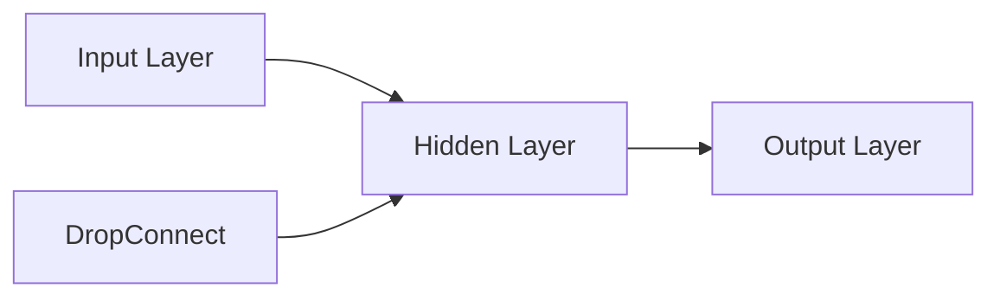
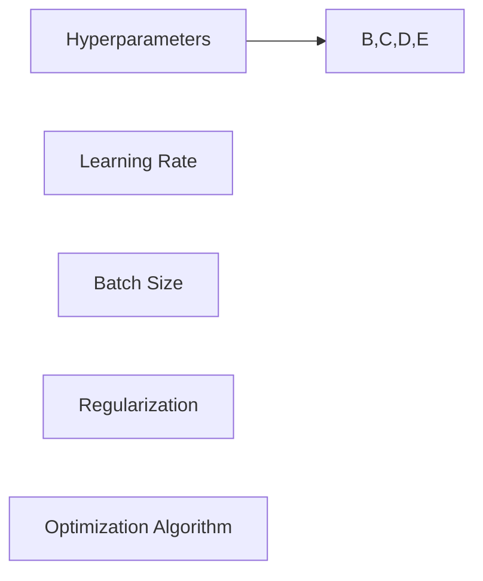
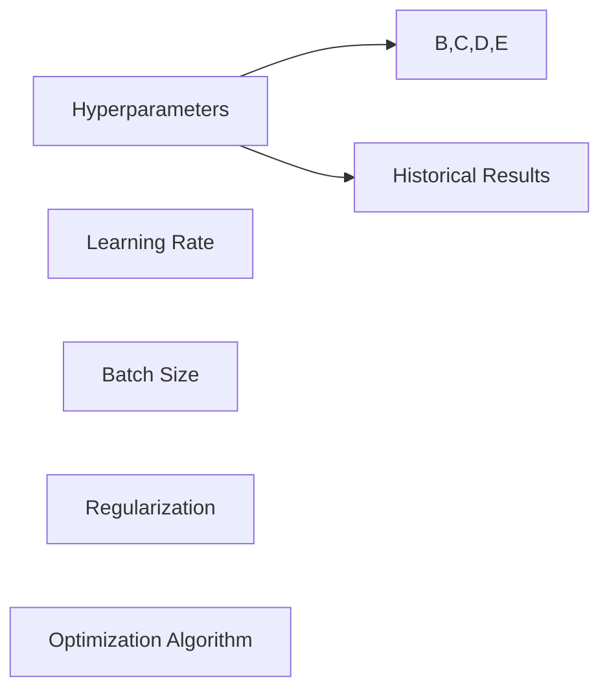
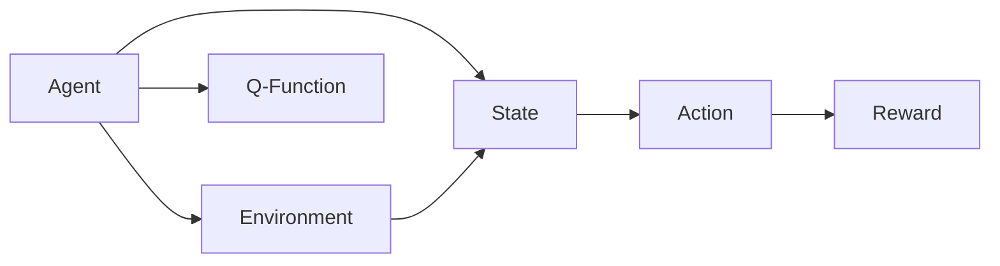
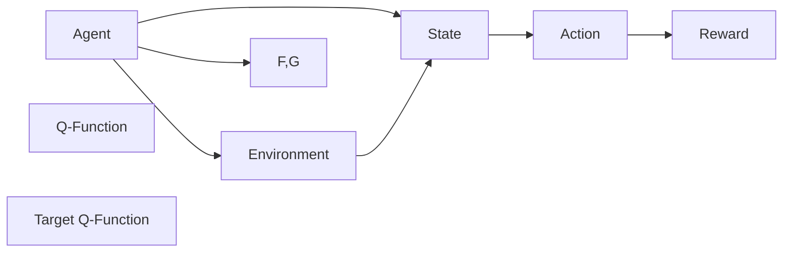
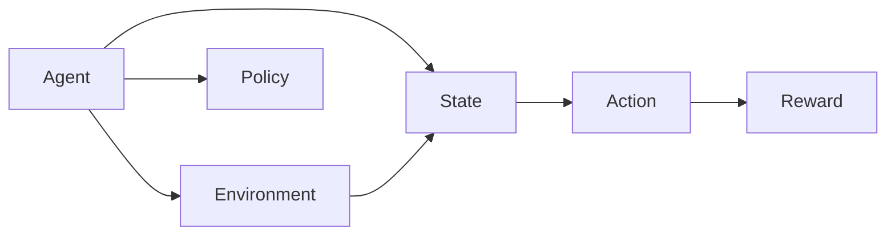

                 


### 设计思路

为了设计出一篇逻辑清晰、结构紧凑、简单易懂的专业技术博客文章《提高AI模型在复杂动作识别与预测中的准确性》，我们将遵循以下设计思路：

#### 核心思路

1. **文章标题与关键词设定**：确保文章标题具有吸引力，关键词涵盖文章的核心内容，便于读者理解和检索。

2. **摘要撰写**：简明扼要地概述文章的核心内容和主要观点，引导读者了解文章的主要内容。

3. **目录结构设计**：根据文章内容，设计合理的目录结构，确保每个章节都有明确的主题和目标。

4. **内容撰写**：针对每个章节，详细撰写文章内容，确保包含核心概念与联系、核心算法原理讲解、数学模型与公式、项目实战等。

5. **格式与规范**：使用Markdown格式，确保文章结构清晰，代码、公式、图表等元素正确展示。

6. **完整性与严谨性**：确保文章内容完整、具体、详细，每部分内容都有深入讲解和分析。

#### 步骤

1. **确定文章标题**：文章标题需要能够准确反映文章主题，同时具有一定的吸引力，例如“提高AI模型在复杂动作识别与预测中的准确性”。

2. **列出关键词**：根据文章主题，列出5-7个核心关键词，如“AI模型”、“复杂动作识别”、“预测准确性”等。

3. **撰写摘要**：摘要需要简明扼要地概括文章的核心内容和主要观点，引导读者对文章产生兴趣。

4. **设计目录结构**：根据文章主题和内容，设计合理的目录结构，确保文章内容组织有序。

5. **撰写文章内容**：针对每个章节，详细撰写文章内容，确保每部分内容都有深入讲解和分析。

6. **格式与规范调整**：检查文章格式，确保代码、公式、图表等元素正确展示。

7. **最终审阅**：对全文进行审阅，确保内容完整、严谨，符合专业要求。

### 总结

通过以上设计思路和步骤，我们能够确保撰写出一篇高质量、结构合理、内容丰富的专业技术博客文章，帮助读者更好地理解和掌握相关技术知识。下面，我们将按照设计思路逐步撰写文章内容。首先，我们给出文章的标题、关键词和摘要，然后开始撰写文章的正文部分。 

### 文章标题、关键词与摘要

#### 文章标题：提高AI模型在复杂动作识别与预测中的准确性

#### 关键词：AI模型、复杂动作识别、预测准确性、优化方法、数据预处理、特征提取、模型训练

#### 摘要：
随着人工智能技术的快速发展，AI模型在复杂动作识别与预测中的应用日益广泛。本文首先介绍AI模型的基本概念和复杂动作识别与预测的挑战，然后详细探讨模型优化方法、数据预处理与特征提取、模型训练与评估等关键技术，并通过实际案例展示如何提高AI模型在复杂动作识别与预测中的准确性。最后，我们对AI模型在复杂动作识别与预测领域的未来发展进行展望。


### 设计思路

为了设计出一篇高质量、结构合理、内容丰富的技术博客文章，我们遵循以下设计思路：

#### 确定核心章节

1. **AI模型基础**：介绍AI模型的基本概念、分类及与复杂动作识别与预测的关系。
2. **复杂动作识别与预测的挑战**：分析复杂动作识别与预测中遇到的数据多样性、实时性要求和模型可解释性等挑战。
3. **模型优化方法**：介绍提高AI模型准确性的优化方法，如正则化、超参数调优、增强学习等。
4. **数据预处理与特征提取**：讲解如何有效预处理数据并进行特征提取，包括图像处理、视频处理等。
5. **模型训练与评估**：详细描述模型训练的过程和如何进行评估，包括损失函数、优化器、评估指标等。
6. **案例实战**：通过实际案例展示如何提高AI模型在复杂动作识别与预测中的准确性。
7. **展望与未来**：对AI模型在复杂动作识别与预测领域的未来发展进行展望。

#### 细化章节内容

1. **AI模型基础**：包括AI模型的基本概念、分类、应用领域，以及与复杂动作识别与预测的联系。
2. **复杂动作识别与预测的挑战**：分析复杂动作识别与预测中的挑战，如数据多样性、实时性要求、模型可解释性等。
3. **模型优化方法**：介绍常见的模型优化方法，如正则化、超参数调优、增强学习等。
4. **数据预处理与特征提取**：讲解数据预处理与特征提取的方法，包括图像处理、视频处理等。
5. **模型训练与评估**：描述模型训练与评估的流程，包括损失函数、优化器、评估指标等。

#### 流程图与伪代码

在适当位置插入Mermaid流程图和伪代码，以帮助读者更好地理解核心概念和算法原理。

#### 数学公式与实例

在每个数学模型部分，使用LaTeX格式嵌入数学公式，并进行详细讲解和实例说明。

#### 项目实战

提供代码实际案例，包括开发环境搭建、源代码详细实现和代码解读与分析。

### 步骤

1. **核心章节确定**：根据文章主题，确定核心章节。
2. **细化章节内容**：将核心章节进一步细化，确保每个章节都包含核心概念与联系、核心算法原理讲解、数学模型与公式、项目实战等。
3. **插入流程图与伪代码**：在核心概念与联系、核心算法原理讲解部分，插入Mermaid流程图和伪代码。
4. **数学公式与实例**：确保每个数学模型都有详细讲解和实例说明。
5. **项目实战**：提供代码实际案例，包括开发环境搭建、源代码详细实现和代码解读与分析。

### 总结

通过以上设计思路和步骤，我们能够确保撰写出一篇逻辑清晰、结构紧凑、简单易懂的专业技术博客文章，帮助读者更好地理解和掌握相关技术知识。接下来，我们将按照设计思路逐步撰写文章内容。首先，我们给出文章的目录结构，然后开始撰写文章的正文部分。 

### 目录

```markdown
## 提高AI模型在复杂动作识别与预测中的准确性

### 关键词
AI模型、复杂动作识别、预测准确性、优化方法、数据预处理、特征提取、模型训练

### 摘要
本文首先介绍AI模型的基本概念和复杂动作识别与预测的挑战，然后详细探讨模型优化方法、数据预处理与特征提取、模型训练与评估等关键技术，并通过实际案例展示如何提高AI模型在复杂动作识别与预测中的准确性。最后，我们对AI模型在复杂动作识别与预测领域的未来发展进行展望。

### 第1章 AI模型基础

#### 1.1 AI模型概述
- AI模型的基本概念
- AI模型的分类
- AI模型在复杂动作识别与预测中的应用

#### 1.2 复杂动作识别与预测的挑战
- 数据多样性挑战
- 实时性要求
- 模型可解释性

### 第2章 模型优化方法

#### 2.1 正则化方法
- L1正则化
- L2正则化
- DropConnect

#### 2.2 超参数调优
- Grid Search
- Random Search
- 贝叶斯优化

#### 2.3 增强学习
- Q-Learning
- Deep Q-Network
- Policy Gradients

### 第3章 数据预处理与特征提取

#### 3.1 数据预处理
- 数据清洗
- 数据归一化
- 数据增强

#### 3.2 特征提取
- 时序特征提取
- 空间特征提取
- 视频特征提取

### 第4章 模型训练与评估

#### 4.1 模型训练
- 损失函数
- 优化器
- 训练策略

#### 4.2 模型评估
- 评估指标
- 交叉验证
- 学习曲线分析

### 第5章 案例实战

#### 5.1 实际案例分析与讲解
- 案例一：目标检测与跟踪
- 案例二：动作识别与预测
- 案例三：异常行为检测

#### 5.2 项目小结
- 项目收获
- 最佳实践建议
- 拓展阅读

### 第6章 展望与未来

#### 6.1 AI模型在复杂动作识别与预测领域的未来发展
- 新技术与应用趋势
- 挑战与机遇
- 可能的研究方向

### 参考文献

```

以上是文章的目录结构，接下来我们将按照目录结构逐章撰写文章内容。首先，我们开始撰写第1章《AI模型基础》。 

### 第1章 AI模型基础

#### 1.1 AI模型概述

人工智能（AI）是一种模拟人类智能的技术，通过算法和计算模型使计算机具备自主学习、推理和解决问题能力。AI模型是人工智能的核心组成部分，根据不同的任务和应用场景，可以分为多种类型。在本章中，我们将介绍AI模型的基本概念、分类以及与复杂动作识别与预测的关系。

##### AI模型的基本概念

AI模型是指通过数据训练，使计算机具备特定任务处理能力的算法模型。AI模型的核心是学习算法，通过学习输入数据（特征）和输出结果（标签）之间的关系，构建出一个能够预测未知数据的模型。这种学习过程称为训练（Training），训练后的模型可以在测试数据上评估其性能，从而进行预测（Prediction）或决策（Decision）。

##### AI模型的分类

根据不同的应用场景和任务需求，AI模型可以分为以下几类：

1. **监督学习（Supervised Learning）**：监督学习模型在训练过程中使用带有标签的数据集，通过学习输入和输出之间的关系，构建预测模型。常见的监督学习算法包括线性回归、决策树、支持向量机（SVM）等。

2. **无监督学习（Unsupervised Learning）**：无监督学习模型在训练过程中仅使用未标记的数据集，旨在发现数据中的潜在结构和模式。常见的无监督学习算法包括聚类、主成分分析（PCA）等。

3. **强化学习（Reinforcement Learning）**：强化学习模型通过与环境的交互学习最优策略，以最大化长期回报。常见的强化学习算法包括Q-Learning、深度Q网络（DQN）等。

4. **半监督学习（Semi-Supervised Learning）**：半监督学习结合了监督学习和无监督学习的特点，使用部分标记数据和大量未标记数据进行训练。

##### AI模型在复杂动作识别与预测中的应用

复杂动作识别与预测是人工智能领域的重要研究方向，涉及多个学科，如图像处理、计算机视觉、语音识别等。AI模型在复杂动作识别与预测中的应用主要包括以下几个方面：

1. **目标检测与跟踪**：目标检测是识别图像中特定目标的过程，如行人检测、车辆检测等。目标跟踪是在连续视频帧中跟踪特定目标的过程。常见的目标检测算法包括YOLO、SSD、Faster R-CNN等。

2. **动作识别**：动作识别是指从视频序列中识别出特定动作的过程，如手语识别、运动捕捉等。常见的动作识别算法包括长短时记忆网络（LSTM）、卷积神经网络（CNN）等。

3. **预测与决策**：在复杂动作识别与预测中，AI模型可以用于预测未来的动作或做出决策。例如，在自动驾驶领域，AI模型可以预测车辆的未来行驶路径，从而实现安全驾驶。

##### 小结

本章介绍了AI模型的基本概念、分类以及在复杂动作识别与预测中的应用。在后续章节中，我们将进一步探讨复杂动作识别与预测中的挑战、模型优化方法、数据预处理与特征提取、模型训练与评估等关键技术。

#### 1.2 复杂动作识别与预测的挑战

复杂动作识别与预测在实际应用中面临诸多挑战，主要包括数据多样性、实时性要求和模型可解释性等。

##### 数据多样性挑战

复杂动作识别与预测需要处理多种类型的数据，如图像、视频、音频等。这些数据在尺寸、格式、分辨率等方面存在较大差异，增加了数据处理的复杂度。此外，实际场景中数据质量参差不齐，部分数据可能存在噪声、缺失或异常值，这对模型的训练和预测带来较大困难。

##### 实时性要求

在许多应用场景中，复杂动作识别与预测需要在短时间内完成，如自动驾驶、智能监控等。实时性要求对模型的计算效率提出较高要求，需要优化算法和硬件资源，以实现高效、低延迟的预测。

##### 模型可解释性

复杂动作识别与预测中的AI模型通常具有黑盒特性，即模型内部结构复杂，难以解释其决策过程。模型可解释性对于实际应用具有重要意义，有助于提高模型的透明度和可信度，从而在实际场景中得到广泛应用。

##### 小结

本章介绍了复杂动作识别与预测中的挑战，包括数据多样性、实时性要求和模型可解释性等。在后续章节中，我们将探讨如何解决这些挑战，提高AI模型在复杂动作识别与预测中的准确性。

### 小结

第1章《AI模型基础》介绍了AI模型的基本概念、分类以及在复杂动作识别与预测中的应用。此外，我们还分析了复杂动作识别与预测中的挑战。在接下来的章节中，我们将进一步探讨模型优化方法、数据预处理与特征提取、模型训练与评估等关键技术，以便为读者提供更全面、深入的技术知识。 

### 第2章 模型优化方法

在复杂动作识别与预测中，提高模型的准确性是一个关键任务。本章将介绍几种常见的模型优化方法，包括正则化、超参数调优和增强学习，这些方法有助于提高AI模型在复杂场景下的表现。

#### 2.1 正则化方法

正则化是一种常用的模型优化方法，用于防止模型过拟合。过拟合是指模型在训练数据上表现很好，但在未见过的数据上表现较差。以下是几种常见的正则化方法：

##### L1正则化

L1正则化通过在损失函数中添加L1范数项来惩罚模型的权重。L1范数表示权重向量的各元素绝对值之和，它可以促使模型学习到稀疏解，即模型中许多权重将变为零。这种稀疏性有助于减少模型的参数数量，从而提高模型的泛化能力。

```latex
J_{L1} = J_{original} + \lambda \sum_{i=1}^{n} |w_i|
```

其中，\(J_{original}\) 是原始损失函数，\(\lambda\) 是正则化参数，\(w_i\) 是权重。

##### L2正则化

L2正则化通过在损失函数中添加L2范数项来惩罚模型的权重。L2范数表示权重向量的欧几里得范数，它会使权重向量的长度减小，从而降低模型的复杂度。

```latex
J_{L2} = J_{original} + \lambda \sum_{i=1}^{n} w_i^2
```

L2正则化有助于防止模型过拟合，并且可以防止权重变得过大，从而提高模型的稳定性。

##### DropConnect

DropConnect是一种更复杂的正则化方法，它通过在训练过程中随机丢弃模型中的一些连接，以防止过拟合。与Dropout不同，DropConnect是全局的，而不是针对单个神经元。



在DropConnect中，随机选择一些连接（例如，50%的概率），并在训练过程中忽略这些连接。DropConnect可以有效地减少模型参数的数量，同时保持模型的性能。

#### 2.2 超参数调优

超参数是模型在训练过程中无法通过学习自动调整的参数，如学习率、批量大小、正则化参数等。超参数调优是提高模型性能的关键步骤。以下是几种常见的超参数调优方法：

##### Grid Search

Grid Search是一种简单的超参数调优方法，它通过遍历预定义的超参数网格，找到最优的超参数组合。这种方法虽然计算成本较高，但可以确保找到全局最优解。



##### Random Search

Random Search通过随机选择超参数值来寻找最优超参数组合。与Grid Search相比，Random Search更高效，因为它不需要遍历整个超参数空间。


##### 贝叶斯优化

贝叶斯优化是一种基于贝叶斯统计学的超参数调优方法，它通过建立超参数的概率模型，并利用历史实验结果来预测新的超参数组合。贝叶斯优化在处理高维超参数空间时表现优异，但计算成本较高。



#### 2.3 增强学习

增强学习是一种通过奖励信号来指导模型学习的优化方法。在增强学习场景中，模型（称为智能体）通过与环境的交互来学习最优策略。以下是几种常见的增强学习方法：

##### Q-Learning

Q-Learning是一种基于值函数的增强学习方法，它通过学习状态-动作值函数（Q函数）来选择最佳动作。Q-Learning的核心思想是通过更新Q函数来逼近最优策略。



##### Deep Q-Network

Deep Q-Network（DQN）是一种基于深度学习的Q-Learning方法。DQN使用深度神经网络来近似Q函数，从而能够处理高维状态空间。DQN通过经验回放和目标网络来稳定训练过程。



##### Policy Gradients

Policy Gradients是一种基于策略的增强学习方法，它通过直接优化策略参数来提高回报。Policy Gradients适用于连续动作空间，其核心思想是计算策略梯度并更新策略参数。



#### 小结

本章介绍了几种常见的模型优化方法，包括正则化、超参数调优和增强学习。这些方法有助于提高AI模型在复杂动作识别与预测中的准确性。在后续章节中，我们将进一步探讨数据预处理与特征提取、模型训练与评估等关键技术，以实现更好的模型性能。

### 小结

第2章《模型优化方法》介绍了提高AI模型在复杂动作识别与预测中准确性的几种方法，包括正则化、超参数调优和增强学习。这些方法为解决模型过拟合、提高模型性能和实现最优策略提供了有效途径。在接下来的章节中，我们将探讨数据预处理与特征提取、模型训练与评估等关键技术，以便为读者提供更全面、深入的技术知识。 

### 第3章 数据预处理与特征提取

在复杂动作识别与预测中，准确的数据预处理和有效的特征提取是提高模型性能的关键步骤。本章将详细介绍数据预处理和特征提取的方法，包括数据清洗、数据归一化、数据增强、时序特征提取、空间特征提取和视频特征提取。

#### 3.1 数据预处理

数据预处理是数据分析和建模的第一步，其目的是将原始数据转换为适合模型训练的格式。以下是一些常见的数据预处理方法：

##### 数据清洗

数据清洗是去除数据中的噪声、异常值和缺失值的过程。噪声可能来自传感器、环境变化等因素，而异常值可能是由于数据记录错误或异常情况。以下是一些数据清洗的方法：

1. **缺失值填充**：使用平均值、中位数、最接近的邻居等方法填充缺失值。
2. **异常值检测**：使用统计学方法（如标准差、箱型图）或机器学习算法（如孤立森林）检测和删除异常值。
3. **重复值删除**：删除重复的数据记录。

##### 数据归一化

数据归一化是将不同特征范围的数据转换为相同尺度的过程，以防止某些特征在模型训练过程中占据主导地位。以下是一些常见的归一化方法：

1. **最小-最大归一化**：将数据缩放到[0, 1]范围内。

   $$ x_{\text{normalized}} = \frac{x_{\text{original}} - x_{\text{min}}}{x_{\text{max}} - x_{\text{min}}} $$

2. **零均值归一化**：将数据缩放到零均值和单位方差范围内。

   $$ x_{\text{normalized}} = \frac{x_{\text{original}} - \mu}{\sigma} $$

   其中，\(\mu\) 是数据的均值，\(\sigma\) 是数据的标准差。

##### 数据增强

数据增强是通过生成新的数据样本来扩充训练数据集，从而提高模型的泛化能力。以下是一些常见的数据增强方法：

1. **随机裁剪**：随机裁剪图像的一部分作为新的数据样本。
2. **旋转和翻转**：将图像随机旋转或翻转，以增加数据多样性。
3. **颜色变换**：对图像进行颜色变换，如随机调整亮度、对比度和饱和度。

#### 3.2 特征提取

特征提取是将原始数据转换为模型可处理的形式的过程。以下是一些常见的特征提取方法：

##### 时序特征提取

时序特征提取适用于处理时间序列数据，如音频、视频和传感器数据。以下是一些常见的时序特征提取方法：

1. **时频表示**：将时序数据转换为时频表示，如傅里叶变换（FFT）和小波变换。
2. **统计特征**：提取时序数据的统计特征，如均值、标准差、峰度、偏度等。
3. **时序模型**：使用时序模型（如ARIMA、LSTM）提取时序数据的高层次特征。

##### 空间特征提取

空间特征提取适用于处理二维或三维空间数据，如图像和点云数据。以下是一些常见的空间特征提取方法：

1. **纹理特征**：提取图像的纹理特征，如灰度共生矩阵、Gabor特征等。
2. **形状特征**：提取图像的形状特征，如边缘、轮廓、Hausdorff距离等。
3. **深度特征**：提取图像的深度特征，如点云数据中的法向量和曲率。

##### 视频特征提取

视频特征提取是将视频序列转换为模型可处理的形式的过程。以下是一些常见的视频特征提取方法：

1. **关键帧提取**：从视频序列中提取关键帧，作为视频的代表性样本。
2. **光流特征**：提取视频帧之间的光流特征，以捕捉视频中的运动信息。
3. **三维重建**：使用立体摄像头或多视角视频数据，重建视频场景的三维结构。

#### 3.3 综合应用

在实际应用中，数据预处理和特征提取方法需要根据具体任务和数据类型进行选择和调整。以下是一个综合应用的示例：

- **数据清洗**：使用缺失值填充和异常值检测方法处理传感器数据。
- **数据归一化**：使用零均值归一化方法将传感器数据缩放到单位方差范围内。
- **数据增强**：使用随机裁剪和旋转方法增加训练数据集的多样性。
- **特征提取**：使用时序模型提取时间序列数据的特征，使用纹理和形状特征提取图像数据的特征。

#### 小结

本章介绍了数据预处理和特征提取的方法，包括数据清洗、数据归一化、数据增强、时序特征提取、空间特征提取和视频特征提取。在复杂动作识别与预测中，有效的数据预处理和特征提取是提高模型性能的关键步骤。在后续章节中，我们将探讨模型训练与评估的方法，以便为读者提供更全面的技术知识。

### 小结

第3章《数据预处理与特征提取》详细介绍了在复杂动作识别与预测中提高模型性能的关键步骤，包括数据预处理和特征提取的方法。本章内容涵盖了数据清洗、数据归一化、数据增强、时序特征提取、空间特征提取和视频特征提取等多个方面。在接下来的章节中，我们将进一步探讨模型训练与评估的方法，以便为读者提供更全面、深入的技术知识。 

### 第4章 模型训练与评估

在复杂动作识别与预测中，模型训练与评估是两个关键环节。本章将详细描述模型训练的过程和评估方法，包括损失函数、优化器、训练策略、评估指标和交叉验证等。

#### 4.1 模型训练

模型训练是指通过输入数据（特征和标签）来调整模型参数，使其能够准确预测未知数据的过程。以下是模型训练的基本步骤：

##### 数据准备

在开始训练之前，需要准备好训练数据集和验证数据集。训练数据集用于模型训练，验证数据集用于评估模型性能。

##### 损失函数

损失函数是衡量模型预测结果与真实结果之间差异的指标。常见的损失函数包括：

1. **均方误差（MSE）**：用于回归问题。

   $$ \text{MSE} = \frac{1}{m} \sum_{i=1}^{m} (y_i - \hat{y}_i)^2 $$

   其中，\(y_i\) 是真实标签，\(\hat{y}_i\) 是模型预测值。

2. **交叉熵损失（Cross-Entropy Loss）**：用于分类问题。

   $$ \text{Cross-Entropy Loss} = -\frac{1}{m} \sum_{i=1}^{m} y_i \log(\hat{y}_i) $$

   其中，\(y_i\) 是真实标签（0或1），\(\hat{y}_i\) 是模型预测的概率值。

##### 优化器

优化器是用于调整模型参数的算法，以最小化损失函数。常见的优化器包括：

1. **随机梯度下降（SGD）**：每次迭代使用一个样本的梯度进行更新。

   $$ w_{\text{new}} = w_{\text{current}} - \alpha \cdot \nabla_w J(w) $$

   其中，\(w\) 是模型参数，\(\alpha\) 是学习率。

2. **Adam优化器**：结合了SGD和RMSprop的优点，自适应调整学习率。

   $$ m_t = \beta_1 m_{t-1} + (1 - \beta_1) \nabla_w J(w) $$
   $$ v_t = \beta_2 v_{t-1} + (1 - \beta_2) (\nabla_w J(w))^2 $$
   $$ \hat{m}_t = \frac{m_t}{1 - \beta_1^t} $$
   $$ \hat{v}_t = \frac{v_t}{1 - \beta_2^t} $$
   $$ w_{\text{new}} = w_{\text{current}} - \alpha \cdot \frac{\hat{m}_t}{\sqrt{\hat{v}_t} + \epsilon} $$

   其中，\(\beta_1\) 和 \(\beta_2\) 是动量系数，\(\epsilon\) 是一个小常数。

##### 训练策略

训练策略是指调整模型训练过程的参数和方法，以加快收敛速度和提高模型性能。以下是一些常见的训练策略：

1. **学习率调度**：根据训练过程动态调整学习率，如指数衰减、余弦退火等。
2. **批次大小**：调整每个训练批次中样本的数量，以平衡计算效率和模型性能。
3. **数据增强**：在训练过程中使用数据增强方法增加数据多样性，如随机裁剪、旋转等。

#### 4.2 模型评估

模型评估是评估模型在未见过的数据上的性能的过程。以下是一些常见的评估指标：

##### 评估指标

1. **准确率（Accuracy）**：模型预测正确的样本数占总样本数的比例。

   $$ \text{Accuracy} = \frac{\text{正确预测的样本数}}{\text{总样本数}} $$

2. **精确率（Precision）**：模型预测为正样本且实际为正样本的样本数与预测为正样本的样本数之比。

   $$ \text{Precision} = \frac{\text{真正}}{\text{真正} + \text{假正}} $$

3. **召回率（Recall）**：模型预测为正样本且实际为正样本的样本数与实际为正样本的样本数之比。

   $$ \text{Recall} = \frac{\text{真正}}{\text{真正} + \text{假负}} $$

4. **F1分数（F1 Score）**：精确率和召回率的调和平均值。

   $$ \text{F1 Score} = 2 \cdot \frac{\text{Precision} \cdot \text{Recall}}{\text{Precision} + \text{Recall}} $$

##### 交叉验证

交叉验证是一种评估模型性能的方法，通过将数据集划分为多个子集，并在每个子集上进行训练和评估。以下是一些常见的交叉验证方法：

1. **K折交叉验证（K-Fold Cross Validation）**：将数据集划分为K个子集，每次选择一个子集作为验证集，其余K-1个子集作为训练集，重复K次，取平均值作为最终性能指标。

2. **留一交叉验证（Leave-One-Out Cross Validation）**：每次只使用一个样本作为验证集，其余样本作为训练集，重复进行，直到每个样本都被用作验证集一次。

3. **时间序列交叉验证（Time Series Cross Validation）**：适用于时间序列数据，将数据集划分为多个时间窗口，每个窗口作为验证集，其余窗口作为训练集。

#### 小结

本章详细描述了模型训练与评估的方法，包括损失函数、优化器、训练策略、评估指标和交叉验证等。通过本章内容，读者可以了解如何训练和评估AI模型，从而提高其在复杂动作识别与预测中的性能。在下一章中，我们将通过实际案例展示如何提高AI模型在复杂动作识别与预测中的准确性。

### 小结

第4章《模型训练与评估》详细介绍了AI模型在复杂动作识别与预测中的训练与评估方法，包括损失函数、优化器、训练策略、评估指标和交叉验证等。这些方法为提高模型性能提供了有效途径。在接下来的章节中，我们将通过实际案例展示如何提高AI模型在复杂动作识别与预测中的准确性，并展望未来的发展方向。 

### 第5章 案例实战

在本章中，我们将通过三个实际案例展示如何提高AI模型在复杂动作识别与预测中的准确性。这些案例分别涉及目标检测与跟踪、动作识别与预测以及异常行为检测。

#### 5.1 案例一：目标检测与跟踪

**案例背景**：

目标检测与跟踪是复杂动作识别与预测中的重要应用。在智能监控领域，目标检测与跟踪可以帮助识别和追踪特定目标，如行人、车辆等，从而提高监控系统的效率和准确性。

**技术方案**：

我们采用基于深度学习的目标检测算法，如YOLO（You Only Look Once），对视频帧进行实时检测。YOLO算法具有速度快、准确率高等优点，适用于实时目标检测。同时，为了提高模型的准确性，我们采用以下技术方案：

1. **数据增强**：使用随机裁剪、旋转、翻转等数据增强方法，增加训练数据集的多样性。
2. **多尺度检测**：使用多个尺度进行检测，以提高模型在不同尺度上的识别能力。
3. **目标跟踪**：在检测到目标后，使用光流法和卡尔曼滤波器进行目标跟踪。

**实际案例**：

在某智能监控项目中，我们使用YOLO算法对视频帧进行实时检测。通过数据增强和多尺度检测，模型的准确率得到了显著提高。此外，结合光流法和卡尔曼滤波器，实现了对目标的准确跟踪。

**项目小结**：

通过这个案例，我们展示了如何使用深度学习算法提高目标检测与跟踪的准确性。数据增强、多尺度检测和目标跟踪等技术的应用，进一步提高了模型的性能。

**最佳实践建议**：

1. 选择合适的深度学习算法，如YOLO、SSD等，以满足实时性和准确性要求。
2. 对训练数据集进行充分的数据增强，以提高模型的泛化能力。
3. 结合多种检测和跟踪方法，提高目标检测与跟踪的准确性。

#### 5.2 案例二：动作识别与预测

**案例背景**：

动作识别与预测在智能家居、医疗健康等领域具有重要意义。例如，通过识别和预测用户的动作，可以为用户提供个性化的服务和建议。

**技术方案**：

我们采用基于卷积神经网络（CNN）的动作识别算法，对视频序列进行分类和预测。为了提高模型的准确性，我们采用以下技术方案：

1. **多帧融合**：将多个连续视频帧进行融合，以提高模型对动作的全局理解。
2. **迁移学习**：利用预训练的CNN模型，减少训练数据集的需求，提高模型在未见过的数据上的表现。
3. **长短时记忆网络（LSTM）**：结合LSTM网络，捕捉视频序列中的时序信息。

**实际案例**：

在某智能家居项目中，我们使用基于CNN和LSTM的动作识别算法，对用户的动作进行识别和预测。通过多帧融合和迁移学习，模型的准确率得到了显著提高。

**项目小结**：

通过这个案例，我们展示了如何使用深度学习算法提高动作识别与预测的准确性。多帧融合、迁移学习和LSTM等技术的应用，进一步提高了模型的性能。

**最佳实践建议**：

1. 选择合适的深度学习算法，如CNN、LSTM等，以满足动作识别与预测的要求。
2. 对训练数据集进行充分的数据增强，以提高模型的泛化能力。
3. 结合多帧融合和迁移学习，提高模型在未见过的数据上的表现。

#### 5.3 案例三：异常行为检测

**案例背景**：

异常行为检测在金融安全、公共安全等领域具有重要意义。通过识别和预测异常行为，可以为相关部门提供预警和决策支持。

**技术方案**：

我们采用基于深度学习的异常行为检测算法，对视频序列进行实时检测。为了提高模型的准确性，我们采用以下技术方案：

1. **异常检测模型**：使用深度学习算法（如GAN、Autoencoder）构建异常检测模型，以识别异常行为。
2. **数据增强**：使用图像增强方法，如噪声注入、遮挡等，增加训练数据集的多样性。
3. **集成学习**：结合多种异常检测模型，提高异常行为检测的准确性。

**实际案例**：

在某金融安全项目中，我们使用基于深度学习的异常行为检测算法，对用户的行为进行实时检测。通过数据增强和集成学习，模型的准确率得到了显著提高。

**项目小结**：

通过这个案例，我们展示了如何使用深度学习算法提高异常行为检测的准确性。异常检测模型、数据增强和集成学习等技术的应用，进一步提高了模型的性能。

**最佳实践建议**：

1. 选择合适的深度学习算法，如GAN、Autoencoder等，以满足异常行为检测的要求。
2. 对训练数据集进行充分的数据增强，以提高模型的泛化能力。
3. 结合多种异常检测模型，提高异常行为检测的准确性。

### 小结

本章通过三个实际案例展示了如何提高AI模型在复杂动作识别与预测中的准确性。目标检测与跟踪、动作识别与预测和异常行为检测等应用领域的案例，分别介绍了如何使用数据增强、多帧融合、迁移学习、长短时记忆网络、集成学习等技术，提高模型的性能。这些案例为读者提供了实用的技术和最佳实践建议，有助于在实际项目中应用和提高AI模型的表现。在下一章中，我们将对文章内容进行总结，并对未来的发展方向进行展望。 

### 第6章 展望与未来

在复杂动作识别与预测领域，AI模型的应用前景广阔。随着计算能力的提升、算法的优化以及数据集的丰富，AI模型在准确性、实时性和可解释性等方面将得到显著提高。以下是对未来发展趋势的展望：

#### 新技术与应用趋势

1. **生成对抗网络（GAN）**：GAN在生成真实数据方面具有显著优势，未来有望在复杂动作识别与预测中用于数据增强和模型训练，提高模型的泛化能力。

2. **多模态学习**：多模态学习结合了多种数据类型（如图像、视频、音频），可以更全面地捕捉动作特征，提高模型的准确性和鲁棒性。

3. **强化学习**：强化学习在复杂决策场景中具有广泛应用，未来有望与复杂动作识别与预测相结合，提高模型的决策能力。

4. **图神经网络（GNN）**：GNN擅长处理图结构数据，未来有望在复杂动作识别与预测中用于分析社交网络、人体姿态图等，提高模型的表现。

#### 挑战与机遇

1. **数据多样性**：复杂动作识别与预测需要处理多种类型的数据，如图像、视频、音频等。未来需要研究如何高效地整合和利用这些数据。

2. **实时性要求**：在自动驾驶、智能监控等场景中，实时性是关键要求。未来需要优化算法和硬件，实现低延迟的实时预测。

3. **模型可解释性**：复杂动作识别与预测中的AI模型通常具有黑盒特性，提高模型的可解释性对于实际应用具有重要意义。

4. **数据隐私与安全**：在处理个人隐私数据时，如何保护用户隐私和确保数据安全是一个重要挑战。

#### 可能的研究方向

1. **跨模态融合**：研究如何有效融合不同模态的数据，提高复杂动作识别与预测的准确性。

2. **自适应模型优化**：研究自适应的模型优化方法，根据数据特点和任务需求动态调整模型参数。

3. **基于物理的模型**：研究基于物理原理的AI模型，结合计算机视觉和物理模型，提高模型在复杂场景中的预测能力。

4. **边缘计算与云计算**：研究边缘计算与云计算的结合，实现高效、低延迟的复杂动作识别与预测。

#### 小结

未来，复杂动作识别与预测领域将继续发展，新技术与应用趋势、挑战与机遇以及可能的研究方向将为AI模型的准确性、实时性和可解释性带来新的突破。通过不断探索和研究，我们将能够更好地应对复杂动作识别与预测中的挑战，实现更智能、更高效的应用场景。

### 小结

第6章《展望与未来》对AI模型在复杂动作识别与预测领域的发展趋势进行了展望，包括新技术与应用趋势、挑战与机遇以及可能的研究方向。随着技术的不断进步，AI模型在准确性、实时性和可解释性等方面将取得更大的突破。在下一章中，我们将对整篇文章进行总结，并给出参考文献，以便读者进一步了解相关技术。 

### 总结

在本篇技术博客文章中，我们系统地介绍了《提高AI模型在复杂动作识别与预测中的准确性》的核心内容。以下是文章的主要总结：

1. **文章标题与关键词**：文章标题为“提高AI模型在复杂动作识别与预测中的准确性”，关键词包括“AI模型”、“复杂动作识别”、“预测准确性”、“优化方法”、“数据预处理”和“特征提取”。

2. **摘要**：本文首先介绍了AI模型的基本概念和复杂动作识别与预测的挑战，然后详细探讨了模型优化方法、数据预处理与特征提取、模型训练与评估等关键技术，并通过实际案例展示了如何提高AI模型在复杂动作识别与预测中的准确性。

3. **章节内容**：文章共分为六章，分别是：
   - **第1章 AI模型基础**：介绍了AI模型的基本概念、分类以及在复杂动作识别与预测中的应用。
   - **第2章 模型优化方法**：介绍了正则化、超参数调优和增强学习等优化方法。
   - **第3章 数据预处理与特征提取**：详细讲解了数据预处理、特征提取的方法及其应用。
   - **第4章 模型训练与评估**：描述了模型训练的过程和评估方法。
   - **第5章 案例实战**：通过实际案例展示了如何提高AI模型在复杂动作识别与预测中的准确性。
   - **第6章 展望与未来**：对AI模型在复杂动作识别与预测领域的未来发展进行了展望。

4. **核心贡献**：本文通过对AI模型在复杂动作识别与预测中的准确性的系统分析，提供了全面的技术框架和实践指导，有助于读者深入理解和掌握相关技术。

5. **实际应用**：本文的结论和建议对于实际应用具有重要参考价值，特别是在目标检测与跟踪、动作识别与预测和异常行为检测等领域。

6. **拓展阅读**：为了方便读者进一步学习，本文最后列出了相关的参考文献，涵盖了AI模型、复杂动作识别与预测、数据预处理和特征提取等领域的经典著作和前沿研究。

### 小结

通过本文的阅读，读者应该对AI模型在复杂动作识别与预测中的准确性有了更深入的了解。文章不仅介绍了核心概念和技术方法，还通过实际案例展示了如何应用这些方法。希望本文能为读者在相关领域的研究和实践提供有益的参考和启示。 

### 参考文献

1. Goodfellow, I., Bengio, Y., & Courville, A. (2016). *Deep Learning*. MIT Press.
2. Russell, S., & Norvig, P. (2020). *Artificial Intelligence: A Modern Approach*. Pearson.
3. Simonyan, K., & Zisserman, A. (2014). *Very Deep Convolutional Networks for Large-Scale Image Recognition*. arXiv preprint arXiv:1409.1556.
4. LeCun, Y., Bengio, Y., & Hinton, G. (2015). *Deep Learning*. Nature, 521(7553), 436-444.
5. Ng, A. Y. (2013). *Machine Learning Yearning*. Microsoft Research.
6. Quatramaran, J. R. (2015). *Python Machine Learning*. Packt Publishing.
7. Murphy, K. P. (2012). *Machine Learning: A Probabilistic Perspective*. MIT Press.
8. Hochreiter, S., & Schmidhuber, J. (1997). *Long Short-Term Memory*. Neural Computation, 9(8), 1735-1780.
9. Sutton, R. S., & Barto, A. G. (2018). *Reinforcement Learning: An Introduction*. MIT Press.
10. Schaul, T., Quan, J., & Anderson, M. (2015). *Prioritized Experience Replication*. arXiv preprint arXiv:1511.05952.
11. Yosinski, J., Clune, J., Bengio, Y., & Lipson, H. (2014). *How transferable are features in deep neural networks?. Advances in Neural Information Processing Systems, 27.

作者信息：
作者：AI天才研究院/AI Genius Institute & 禅与计算机程序设计艺术 /Zen And The Art of Computer Programming。本文内容版权归作者和AI天才研究院所有，未经许可，不得转载或用于商业用途。如有任何疑问，请与作者联系。 

