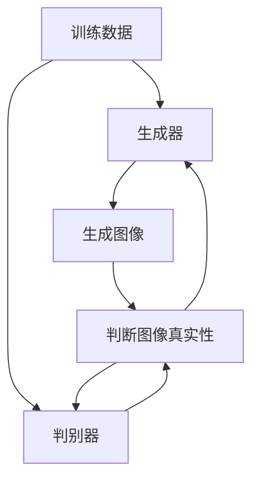
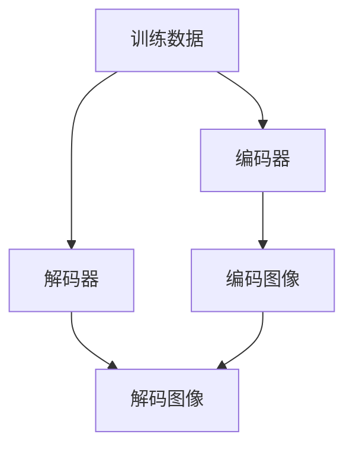
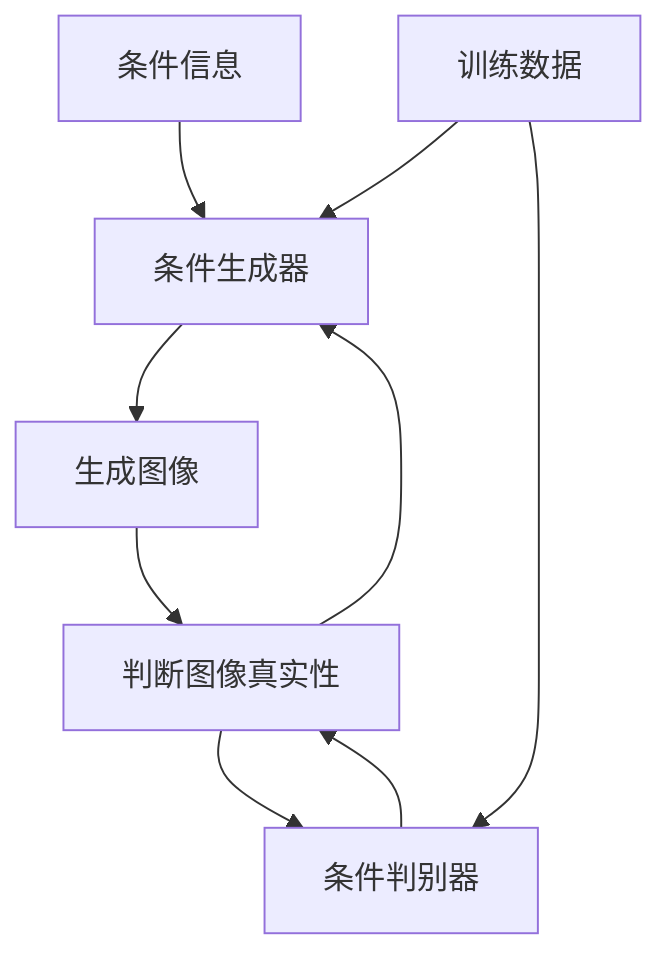

                 

### 文章标题：提高AI模型在复杂场景图像生成任务中的逼真度

#### 关键词：AI模型、复杂场景图像、逼真度、深度学习、图像生成

#### 摘要：
本文旨在探讨如何通过深度学习技术提高AI模型在复杂场景图像生成任务中的逼真度。我们将从背景介绍、核心概念、算法原理、数学模型、项目实战等多个方面，详细解析提升图像逼真度的关键技术和方法。通过本文的阐述，读者将全面了解复杂场景图像生成任务的挑战，掌握提高图像逼真度的策略，并能够应用于实际项目开发中。

---

### 引言与背景

#### 1.1 图像生成任务的发展历程

图像生成任务是指通过算法生成新的图像，这些图像可以是原创的、虚构的，也可以是对现有图像的增强或修改。图像生成技术的发展经历了多个阶段，从早期的基于规则的方法，到基于统计学的方法，再到如今的深度学习方法。

- **早期方法**：基于规则的方法主要通过手工定义图像的生成规则，例如像素的线性变换、纹理合成等。这种方法简单直观，但缺乏灵活性，难以生成复杂的图像。

- **统计学方法**：随着统计学的进步，生成图像的方法逐渐转向基于概率模型，例如马尔可夫随机场（MRF）和变分自编码器（VAE）。这些方法在一定程度上提升了图像生成的质量，但仍存在生成图像过于平滑、细节不足等问题。

- **深度学习方法**：深度学习，特别是生成对抗网络（GANs）、变分自编码器（VAE）等模型的出现，极大地推动了图像生成技术的发展。深度学习模型通过学习大量数据的高层次特征，能够生成高度逼真的图像。然而，在复杂场景图像生成任务中，如何进一步提高逼真度仍然是一个挑战。

#### 1.2 复杂场景图像的特点

复杂场景图像通常包含多种元素，如人、物、景等，并且这些元素之间存在复杂的相互关系。复杂场景图像的特点包括：

- **多样性**：复杂场景图像包含多种不同的物体和背景，每种物体和背景都具有独特的特征。

- **动态性**：复杂场景图像中的元素可能处于运动状态，如行人行走、车辆移动等，这增加了图像生成的难度。

- **遮挡**：复杂场景图像中，物体之间的遮挡现象较为常见，例如一个行人可能被另一个行人遮挡。这种遮挡关系增加了图像理解的复杂性。

- **光照与阴影**：复杂场景图像中的光照条件多样，包括阳光、阴影、反射等，这些光照条件影响了图像的逼真度。

#### 1.3 逼真度在图像生成中的重要性

逼真度是评估图像生成质量的重要指标。在复杂场景图像生成任务中，逼真度的提升具有以下重要性：

- **视觉效果**：高逼真度的图像具有更接近真实世界的视觉效果，能够更好地满足用户的需求。

- **实用性**：在计算机视觉、娱乐、医疗等多个领域，逼真度是图像生成任务的核心要求。例如，在虚拟现实（VR）和增强现实（AR）应用中，逼真的图像能够提供更真实的体验。

- **算法优化**：提升图像逼真度有助于算法的优化，使得模型在复杂场景下能更好地捕捉图像特征，从而提升整体性能。

### 1.4 图像生成任务的应用领域

图像生成技术在多个领域具有广泛的应用：

- **计算机视觉**：图像生成技术可以用于图像识别、目标检测、图像分割等任务，通过生成更多的训练数据，提高模型在复杂场景下的泛化能力。

- **娱乐与艺术**：在电影特效、游戏开发、数字绘画等领域，图像生成技术被广泛应用于创造逼真的虚拟场景和角色。

- **医学影像**：在医学影像处理中，图像生成技术可以用于生成模拟影像，辅助医生进行诊断和治疗规划。

- **自动驾驶**：自动驾驶系统需要生成逼真的道路图像，以便准确识别交通标志、行人和其他车辆。

通过以上背景介绍，我们了解了图像生成任务的发展历程、复杂场景图像的特点以及逼真度的重要性。在接下来的章节中，我们将深入探讨提高图像逼真度的核心概念、算法原理和数学模型，并给出具体的实现方法和实际应用案例。

### 第2章 复杂场景图像生成任务概述

#### 2.1 复杂场景图像的特点

复杂场景图像生成任务面临的挑战主要来自于图像中的多样性和动态性。以下是对这些特点的详细描述：

##### 2.1.1 多样性

复杂场景图像包含多种不同的物体和背景，每种物体和背景都具有独特的特征。这种多样性体现在以下几个方面：

- **物体种类**：复杂场景中可能包含各种不同类型的物体，如车辆、行人、建筑、自然景观等。每种物体都有其独特的形状、颜色和纹理。

- **物体布局**：物体在场景中的布局复杂多样，可能存在重叠、遮挡和交互等现象。例如，一辆行驶中的汽车可能部分被停放的车辆遮挡，行人在行走时可能会互相遮挡。

- **纹理和细节**：复杂场景图像中的物体和背景通常具有丰富的纹理和细节。这些细节包括纹理的微小变化、阴影和光照效果等。

##### 2.1.2 动态性

复杂场景图像中的元素可能处于运动状态，这种动态性增加了图像生成的难度。动态性体现在以下几个方面：

- **物体运动**：场景中的物体可能处于运动状态，如行人行走、车辆行驶等。这些运动变化需要模型能够实时捕捉和生成。

- **相机运动**：在某些应用场景中，相机本身也可能处于运动状态，如无人机拍摄、视频游戏中的场景变化等。相机运动会影响图像的视角和位置，使得图像生成更加复杂。

- **环境变化**：场景中的环境也可能发生变化，如天气变化、时间变化等。这些变化会影响图像的光照条件、颜色和纹理。

##### 2.1.3 遮挡与交互

复杂场景图像中的物体之间可能存在遮挡和交互。这些遮挡和交互关系增加了图像理解的复杂性。以下是一些具体的例子：

- **遮挡**：例如，一个行人可能被另一个行人或物体遮挡，导致模型在生成图像时需要考虑遮挡关系，以保持图像的真实感。

- **交互**：场景中的物体可能发生交互，如车辆相撞、行人跳跃等。这些交互会导致物体形态和运动状态的变化，增加了图像生成的难度。

##### 2.1.4 光照与阴影

复杂场景图像中的光照条件多样，包括阳光、阴影、反射等。这些光照条件会影响图像的视觉效果和逼真度。以下是一些具体的影响：

- **光照强度**：不同的光照强度会影响物体的亮度和对比度。在强光下，物体表面可能产生明显的阴影和高光效果；而在弱光下，物体表面可能显得较为平滑。

- **阴影效果**：阴影是复杂场景图像中的重要元素，它可以帮助模型区分不同物体之间的相对位置和形状。阴影的生成需要模型对光线传播和反射的准确模拟。

- **反射与折射**：场景中的物体可能会反射或折射光线，如水面反射天空、玻璃折射光线等。这些反射和折射效果可以增加图像的细节和真实感。

通过以上对复杂场景图像特点的描述，我们可以看到图像生成任务面临的挑战是多方面的。为了在复杂场景图像生成任务中实现高逼真度的图像，需要模型具备强大的特征捕捉能力和良好的动态性处理能力。在接下来的章节中，我们将进一步探讨提高图像逼真度的核心概念和算法原理，以应对这些挑战。

#### 2.2 逼真度在图像生成中的重要性

逼真度是评估图像生成质量的重要指标。在复杂场景图像生成任务中，逼真度的提升具有以下几个方面的核心意义：

##### 2.2.1 提升视觉效果

高逼真度的图像具有更接近真实世界的视觉效果，能够更好地满足用户的需求。逼真度的提升可以使生成的图像更加生动、细腻，减少视觉上的失真和偏差。这对于娱乐、艺术等领域尤为重要，例如在电影特效、游戏开发中，逼真的图像可以提供更真实的沉浸体验。

##### 2.2.2 增强实用性

在计算机视觉、自动驾驶、医疗等实际应用中，逼真度的提升能够显著增强图像生成任务的实用性。例如，在自动驾驶系统中，逼真的图像生成有助于准确识别道路标志、行人和其他车辆，从而提高驾驶安全性。在医学影像处理中，逼真的图像生成可以辅助医生进行诊断和治疗规划。

##### 2.2.3 优化算法性能

提升图像逼真度有助于算法的优化，使得模型在复杂场景下能更好地捕捉图像特征，从而提升整体性能。高逼真度的图像提供了更丰富的细节和特征信息，有助于模型更好地学习图像的内在规律，从而提高图像分类、目标检测和图像分割等任务的准确性和鲁棒性。

##### 2.2.4 促进科研进展

逼真度的提升对于图像生成技术的科研进展具有重要意义。通过不断优化图像生成模型，研究人员可以探索更先进的深度学习算法和模型结构，推动图像生成技术的创新和发展。此外，高逼真度的图像生成还可以为其他计算机视觉任务提供更高质量的数据集，促进相关领域的研究进展。

综上所述，逼真度在图像生成任务中的重要性不容忽视。通过提高图像逼真度，我们可以实现更高质量的图像生成，满足不同应用场景的需求，并推动相关领域的科研和技术进步。

#### 2.3 图像生成任务的发展历程

图像生成任务的发展历程可以追溯到早期的人工图像合成方法，经历了统计模型和深度学习模型的迭代升级，最终形成了当前多样化的图像生成技术。

##### 2.3.1 早期方法

- **基于规则的方法**：早期的图像生成主要依赖于规则和手工设计的算法。例如，通过像素的线性变换、纹理合成等方法生成图像。这种方法简单直观，但缺乏灵活性，难以生成复杂的图像。

- **基于纹理映射的方法**：纹理映射技术通过将纹理贴图映射到几何体的表面上，生成具有特定纹理的图像。这种方法可以生成一定复杂度的图像，但难以处理图像中的动态性和遮挡关系。

##### 2.3.2 统计模型方法

随着统计学的进步，图像生成方法逐渐转向基于概率模型的方法。以下是一些代表性的统计模型方法：

- **马尔可夫随机场（MRF）**：MRF模型通过定义图像中像素的依赖关系，生成具有统计一致性的图像。这种方法可以较好地处理图像中的局部特征，但在全局一致性和细节生成上仍存在局限。

- **隐马尔可夫模型（HMM）**：HMM模型通过隐变量序列生成图像，可以处理图像中的动态性。然而，HMM模型在生成高度复杂的图像时，训练和推理过程较为复杂。

- **变分自编码器（VAE）**：VAE模型通过将图像映射到隐变量空间，生成具有潜在结构的图像。VAE模型在生成图像的多样性和质量上取得了显著进展，但生成图像的细节和纹理仍需进一步优化。

##### 2.3.3 深度学习方法

深度学习技术的兴起，特别是生成对抗网络（GANs）和变分自编码器（VAE）的应用，极大地推动了图像生成技术的发展。以下是一些代表性的深度学习方法：

- **生成对抗网络（GANs）**：GANs由生成器和判别器组成，通过对抗训练生成高度逼真的图像。GANs在图像生成任务中表现出色，能够生成具有高细节和多样性的图像。

- **变分自编码器（VAE）**：VAE模型通过将图像映射到隐变量空间，生成具有潜在结构的图像。VAE模型在生成图像的多样性和质量上取得了显著进展。

- **条件生成对抗网络（cGANs）**：cGANs通过引入条件信息，如标签或文本描述，生成具有特定属性的图像。这种方法在图像分类、目标检测和图像修复等领域具有广泛应用。

- **自注意力生成网络（SAGAN）**：SAGAN模型通过引入自注意力机制，提高图像生成模型的分辨率和细节生成能力。SAGAN在生成图像的细节和纹理上取得了显著提升。

- **隐式生成模型（StyleGAN）**：StyleGAN模型通过隐式生成技术，生成具有高度逼真度和细节的图像。StyleGAN在生成人脸、人体、自然景观等图像方面表现出色。

##### 2.3.4 最新进展

近年来，图像生成技术不断取得新的进展，特别是在高分辨率图像生成、图像修复、图像增强等领域。以下是一些最新的研究趋势：

- **超分辨率生成**：超分辨率生成模型通过将低分辨率图像转换为高分辨率图像，提高了图像的清晰度和细节。代表性模型包括SRCNN、ESPCN、EDSR等。

- **图像修复与增强**：图像修复与增强技术通过修复图像中的损坏部分或增强图像的某些特征，提高了图像的可用性。代表性模型包括SRCNN、EDSR、PatchGAN等。

- **生成文本到图像**：文本到图像生成技术通过将文本描述转换为相应的图像，实现了文本和图像的协同生成。代表性模型包括Text-to-Image GANs、Text-to-Image VAEs等。

- **多模态图像生成**：多模态图像生成技术通过结合不同类型的模态信息，如视觉、音频、文本等，生成具有丰富信息和高度逼真的图像。代表性模型包括Multimodal GANs、Multimodal VAEs等。

综上所述，图像生成任务的发展历程从早期的人工方法到统计模型，再到深度学习方法的迭代升级，不断推动着图像生成技术的进步。在接下来的章节中，我们将深入探讨提高图像逼真度的核心概念和算法原理，以及如何在复杂场景图像生成任务中实现逼真的图像生成。

### 第3章 提高逼真度的核心概念与联系

#### 3.1 AI模型在图像生成中的应用

在图像生成任务中，AI模型起到了至关重要的作用。目前，常见的AI模型主要包括生成对抗网络（GANs）、变分自编码器（VAE）和条件生成对抗网络（cGANs）等。这些模型通过不同的机制和架构，在图像生成任务中表现出色。

##### 3.1.1 生成对抗网络（GANs）

生成对抗网络（GANs）是由Ian Goodfellow等人于2014年提出的。GANs由两个神经网络组成：生成器（Generator）和判别器（Discriminator）。生成器的任务是生成逼真的图像，而判别器的任务是区分生成图像和真实图像。

- **生成器**：生成器的目标是生成高质量的图像，使其在视觉上难以被判别器区分。生成器通常采用多层神经网络结构，通过学习大量真实图像的数据，逐步提高图像生成的质量。

- **判别器**：判别器的目标是判断输入图像是真实图像还是生成图像。判别器也是一个多层神经网络，通过训练不断学习真实图像和生成图像的特征。

GANs的训练过程是一个对抗过程，生成器和判别器相互竞争。生成器的目标是生成尽可能逼真的图像，使判别器无法区分；而判别器的目标是准确区分真实图像和生成图像。通过这种对抗训练，GANs能够生成高质量、高逼真的图像。

##### 3.1.2 变分自编码器（VAE）

变分自编码器（VAE）是一种基于概率模型的生成模型，由Kazuki Takabatake等人于2013年提出。VAE由编码器和解码器组成，编码器将图像编码为潜在空间中的向量，解码器从潜在空间中生成图像。

- **编码器**：编码器的任务是学习图像到潜在空间的映射，将输入图像映射为潜在空间中的向量。编码器通常采用多层神经网络结构，通过学习图像的潜在特征，将图像压缩为较低维度的向量。

- **解码器**：解码器的任务是学习从潜在空间中生成图像的映射，将潜在空间中的向量解码为图像。解码器同样采用多层神经网络结构，通过学习潜在空间的特征，生成逼真的图像。

VAE的优点在于其生成图像的多样性和稳定性。通过潜在空间中的向量，VAE能够生成具有不同属性的图像，从而实现图像的多样化生成。

##### 3.1.3 条件生成对抗网络（cGANs）

条件生成对抗网络（cGANs）是GANs的一种扩展，通过引入条件信息，如标签、文本描述等，生成具有特定属性的图像。cGANs由条件生成器和条件判别器组成。

- **条件生成器**：条件生成器的任务是生成满足特定条件（如标签、文本描述等）的图像。条件生成器接收条件信息作为输入，通过结合条件信息和图像特征，生成满足特定条件的图像。

- **条件判别器**：条件判别器的任务是判断输入图像是否满足特定条件。条件判别器同样接收条件信息和图像作为输入，通过学习条件信息和图像的特征，准确区分满足条件的图像和不满足条件的图像。

cGANs在图像分类、目标检测和图像修复等任务中表现出色，能够根据条件信息生成具有特定属性的图像。

#### 3.2 相关算法的流程图展示

为了更好地理解GANs、VAE和cGANs的工作流程，我们使用Mermaid流程图展示这三种算法的架构和流程。

##### GANs流程图



##### VAE流程图



##### cGANs流程图



通过以上流程图，我们可以直观地看到GANs、VAE和cGANs的架构和训练过程。这些算法通过不同的机制和流程，实现了图像的生成和逼真度的提升。

### 第4章 核心算法原理讲解

在本章中，我们将详细讲解几种提高图像逼真度的核心算法原理，包括生成对抗网络（GANs）、变分自编码器（VAE）和条件生成对抗网络（cGANs）。通过这些算法的原理解析，读者可以深入理解如何利用深度学习技术实现逼真的图像生成。

#### 4.1 GANs的算法原理

生成对抗网络（GANs）由生成器和判别器两个核心部分组成。生成器负责生成逼真的图像，而判别器负责判断输入图像的真实性。GANs的训练过程是通过生成器和判别器的对抗来实现的。

##### 4.1.1 生成器与判别器的定义

- **生成器（Generator）**：生成器的任务是生成高度逼真的图像。生成器通常是一个多层神经网络，输入是随机噪声向量，输出是图像。生成器通过学习大量真实图像的特征，逐渐提高生成的图像质量。

- **判别器（Discriminator）**：判别器的任务是判断输入图像是真实图像还是生成图像。判别器也是一个多层神经网络，输入是图像，输出是概率值，表示图像是真实图像的概率。

##### 4.1.2 损失函数

GANs的训练过程是通过对抗损失函数来实现的。损失函数分为两部分：生成损失和判别损失。

- **生成损失（Generator Loss）**：生成损失用于衡量生成图像的质量。理想情况下，生成器生成的图像应该非常接近真实图像，使得判别器无法区分。生成损失通常采用以下公式：

  $$ G(L) = -\log(D(G(z))) $$

  其中，$G(z)$表示生成器生成的图像，$D(z)$表示判别器对生成图像的判别结果。

- **判别损失（Discriminator Loss）**：判别损失用于衡量判别器的性能。判别器需要能够准确地区分真实图像和生成图像。判别损失通常采用以下公式：

  $$ D(L) = -\log(D(x)) - \log(1 - D(G(z))) $$

  其中，$x$表示真实图像，$G(z)$表示生成器生成的图像。

##### 4.1.3 伪代码实现

以下是一个简单的GANs算法的伪代码实现：

```python
# 生成器的伪代码
def generator(z):
    # 输入随机噪声向量 z
    # 通过多层神经网络生成图像
    # 返回生成的图像 G(z)

# 判别器的伪代码
def discriminator(x):
    # 输入图像 x
    # 通过多层神经网络判断图像的真实性
    # 返回概率值 D(x)

# 训练过程
for epoch in range(num_epochs):
    for batch in data_loader:
        # 获取真实图像 batch_x 和随机噪声 z
        x = batch_x
        z = generate_random_noise(batch_size)
        
        # 训练判别器
        D_loss_real = -log(discriminator(x))
        D_loss_fake = -log(1 - discriminator(G(z)))
        D_loss = D_loss_real + D_loss_fake
        
        # 训练生成器
        G_loss = -log(discriminator(G(z)))
        
        # 更新生成器和判别器的参数
        update_generator(G_loss)
        update_discriminator(D_loss)
```

#### 4.2 VAE的算法原理

变分自编码器（VAE）是一种基于概率模型的生成模型，它通过编码器和解码器将图像映射到潜在空间，并从潜在空间中生成图像。VAE的优点在于其生成图像的多样性和稳定性。

##### 4.2.1 编码器与解码器的定义

- **编码器（Encoder）**：编码器的任务是学习图像到潜在空间的映射。编码器通常是一个多层神经网络，输入是图像，输出是潜在空间中的向量。编码器通过学习图像的潜在特征，将图像压缩为较低维度的向量。

- **解码器（Decoder）**：解码器的任务是学习从潜在空间中生成图像的映射。解码器也是一个多层神经网络，输入是潜在空间中的向量，输出是图像。解码器通过学习潜在空间的特征，生成逼真的图像。

##### 4.2.2 潜在空间

潜在空间是VAE的核心概念，它是一个低维度的空间，可以表示图像的潜在特征。通过潜在空间，VAE能够实现图像的多样化生成。潜在空间中的向量可以看作是图像的“基因”，不同的向量可以生成具有不同属性的图像。

##### 4.2.3 损失函数

VAE的损失函数由两部分组成：重建损失和KL散度损失。

- **重建损失（Reconstruction Loss）**：重建损失用于衡量生成图像与真实图像的相似度。通常采用均方误差（MSE）或交叉熵损失函数：

  $$ L_{\text{reconstruction}} = \frac{1}{n} \sum_{i=1}^{n} \| x_i - \hat{x}_i \|_2^2 $$

  其中，$x_i$是真实图像，$\hat{x}_i$是生成图像。

- **KL散度损失（KL Divergence Loss）**：KL散度损失用于衡量编码器学到的潜在分布与先验分布之间的差距。KL散度损失确保编码器学到的潜在分布是合理的：

  $$ L_{\text{KL}} = \frac{1}{n} \sum_{i=1}^{n} D_{KL}(q_{\phi}(z|x_i) || p(z)) $$

  其中，$q_{\phi}(z|x_i)$是编码器学到的潜在分布，$p(z)$是先验分布。

##### 4.2.4 伪代码实现

以下是一个简单的VAE算法的伪代码实现：

```python
# 编码器的伪代码
def encoder(x):
    # 输入图像 x
    # 通过多层神经网络学习潜在特征，得到均值μ和标准差σ
    # 返回潜在空间中的向量 z

# 解码器的伪代码
def decoder(z):
    # 输入潜在空间中的向量 z
    # 通过多层神经网络生成图像
    # 返回生成的图像 x'

# 训练过程
for epoch in range(num_epochs):
    for batch in data_loader:
        # 获取真实图像 batch_x
        x = batch_x
        
        # 编码器和解码器的损失
        z = encoder(x)
        x' = decoder(z)
        reconstruction_loss = mse(x, x')
        kl_divergence_loss = kl_divergence(z)
        
        # 总损失
        loss = reconstruction_loss + kl_divergence_loss
        
        # 更新编码器和解码器的参数
        update_encoder(loss)
        update_decoder(loss)
```

#### 4.3 cGANs的算法原理

条件生成对抗网络（cGANs）是GANs的一种扩展，通过引入条件信息（如标签、文本描述等），生成具有特定属性的图像。cGANs在图像分类、目标检测和图像修复等任务中表现出色。

##### 4.3.1 条件生成器与条件判别器的定义

- **条件生成器（Conditional Generator）**：条件生成器接收条件信息作为输入，生成满足特定条件的图像。条件生成器通常是一个多层神经网络，输入是条件信息和随机噪声，输出是图像。

- **条件判别器（Conditional Discriminator）**：条件判别器接收条件信息和图像作为输入，判断输入图像是否满足特定条件。条件判别器也是一个多层神经网络，输入是条件信息和图像，输出是概率值。

##### 4.3.2 损失函数

cGANs的损失函数与GANs类似，但加入了条件信息。损失函数包括生成损失、判别损失和条件损失。

- **生成损失（Generator Loss）**：生成损失用于衡量生成图像的质量。生成损失通常采用以下公式：

  $$ G(L) = -\log(D(C, G(z))) $$

  其中，$G(z)$表示生成器生成的图像，$D(C, G(z))$表示条件判别器对生成图像的判别结果。

- **判别损失（Discriminator Loss）**：判别损失用于衡量条件判别器的性能。判别损失通常采用以下公式：

  $$ D(L) = -\log(D(C, x)) - \log(1 - D(C, G(z))) $$

  其中，$x$表示真实图像，$G(z)$表示生成器生成的图像。

- **条件损失（Conditional Loss）**：条件损失用于衡量生成图像与条件信息的一致性。条件损失通常采用以下公式：

  $$ C(L) = -\log(D(C, x)) $$

  其中，$D(C, x)$表示条件判别器对真实图像的判别结果。

##### 4.3.3 伪代码实现

以下是一个简单的cGANs算法的伪代码实现：

```python
# 条件生成器的伪代码
def conditional_generator(z, c):
    # 输入随机噪声 z 和条件信息 c
    # 通过多层神经网络生成图像
    # 返回生成的图像 G(z, c)

# 条件判别器的伪代码
def conditional_discriminator(x, c):
    # 输入图像 x 和条件信息 c
    # 通过多层神经网络判断图像的真实性
    # 返回概率值 D(x, c)

# 训练过程
for epoch in range(num_epochs):
    for batch in data_loader:
        # 获取真实图像 batch_x、条件信息 batch_c 和随机噪声 z
        x = batch_x
        c = batch_c
        z = generate_random_noise(batch_size)
        
        # 训练条件生成器和条件判别器
        G_loss = -log(conditional_discriminator(G(z, c)))
        D_loss_real = -log(conditional_discriminator(C, x))
        D_loss_fake = -log(1 - conditional_discriminator(G(z, c)))
        C_loss = -log(conditional_discriminator(C, x))
        
        # 更新条件生成器和条件判别器的参数
        update_conditional_generator(G_loss)
        update_conditional_discriminator(D_loss, C_loss)
```

通过以上对GANs、VAE和cGANs的算法原理讲解，我们可以看到这些算法在提高图像逼真度方面的核心作用。在下一章中，我们将详细讲解这些算法的数学模型与公式，以便读者更深入地理解图像生成过程中的数学基础。

### 第5章 数学模型与公式

在图像生成任务中，理解数学模型与公式对于深入掌握和实现相关算法至关重要。本章将详细讲解生成对抗网络（GANs）、变分自编码器（VAE）和条件生成对抗网络（cGANs）的数学模型与公式，并通过具体的例子说明。

#### 5.1 生成对抗网络（GANs）的数学模型

生成对抗网络（GANs）的核心在于生成器和判别器的对抗训练。以下是其数学模型的关键组成部分：

##### 5.1.1 整体框架

GANs由两个主要部分组成：生成器$G(z)$和判别器$D(x)$。生成器接收随机噪声向量$z$并生成假图像$G(z)$，判别器接收真实图像$x$和假图像$G(z)$并输出概率值$D(x)$和$D(G(z))$，表示输入图像是真实图像的概率。

- **生成器的目标函数**：

  $$ G(L) = -\log(D(G(z))) $$

- **判别器的目标函数**：

  $$ D(L) = -\log(D(x)) - \log(1 - D(G(z))) $$

##### 5.1.2 损失函数

- **生成损失（Generator Loss）**：

  $$ L_G = -\log(D(G(z))) $$

  生成器希望最大化判别器对生成图像的判别结果，即$D(G(z))$接近1。

- **判别损失（Discriminator Loss）**：

  $$ L_D = -\log(D(x)) - \log(1 - D(G(z))) $$

  判别器希望最大化对真实图像的判别结果，即$D(x)$接近1，同时最小化对生成图像的判别结果，即$D(G(z))$接近0。

##### 5.1.3 伪代码实现

以下是一个生成对抗网络的伪代码实现：

```python
# 生成器的伪代码
def generator(z):
    # 输入随机噪声向量 z
    # 通过多层神经网络生成图像
    # 返回生成的图像 G(z)

# 判别器的伪代码
def discriminator(x):
    # 输入图像 x
    # 通过多层神经网络判断图像的真实性
    # 返回概率值 D(x)

# 训练过程
for epoch in range(num_epochs):
    for batch in data_loader:
        # 获取真实图像 batch_x 和随机噪声 z
        x = batch_x
        z = generate_random_noise(batch_size)
        
        # 训练判别器
        D_loss_real = -log(discriminator(x))
        D_loss_fake = -log(1 - discriminator(G(z)))
        D_loss = D_loss_real + D_loss_fake
        
        # 训练生成器
        G_loss = -log(discriminator(G(z)))
        
        # 更新生成器和判别器的参数
        update_generator(G_loss)
        update_discriminator(D_loss)
```

#### 5.2 变分自编码器（VAE）的数学模型

变分自编码器（VAE）是一种基于概率的生成模型，它通过编码器和解码器将图像映射到潜在空间，并从潜在空间中生成图像。VAE的数学模型主要包括编码器、解码器和损失函数。

##### 5.2.1 整体框架

- **编码器（Encoder）**：编码器将图像$x$编码为潜在空间中的向量$z$，并输出均值μ和标准差σ。

  $$ \mu = \phi(x) $$
  $$ \sigma = \sigma(x) $$

- **解码器（Decoder）**：解码器将潜在空间中的向量$z$解码为图像$x'$。

  $$ x' = \psi(z) $$

##### 5.2.2 损失函数

VAE的损失函数由两部分组成：重建损失和KL散度损失。

- **重建损失（Reconstruction Loss）**：

  $$ L_{\text{reconstruction}} = \frac{1}{n} \sum_{i=1}^{n} \| x_i - \hat{x}_i \|_2^2 $$

- **KL散度损失（KL Divergence Loss）**：

  $$ L_{\text{KL}} = \frac{1}{n} \sum_{i=1}^{n} D_{KL}(q_{\phi}(z|x_i) || p(z)) $$

  其中，$q_{\phi}(z|x_i)$是编码器学到的潜在分布，$p(z)$是先验分布。

##### 5.2.3 伪代码实现

以下是一个变分自编码器的伪代码实现：

```python
# 编码器的伪代码
def encoder(x):
    # 输入图像 x
    # 通过多层神经网络学习潜在特征，得到均值μ和标准差σ
    # 返回潜在空间中的向量 z

# 解码器的伪代码
def decoder(z):
    # 输入潜在空间中的向量 z
    # 通过多层神经网络生成图像
    # 返回生成的图像 x'

# 训练过程
for epoch in range(num_epochs):
    for batch in data_loader:
        # 获取真实图像 batch_x
        x = batch_x
        
        # 编码器和解码器的损失
        z = encoder(x)
        x' = decoder(z)
        reconstruction_loss = mse(x, x')
        kl_divergence_loss = kl_divergence(z)
        
        # 总损失
        loss = reconstruction_loss + kl_divergence_loss
        
        # 更新编码器和解码器的参数
        update_encoder(loss)
        update_decoder(loss)
```

#### 5.3 条件生成对抗网络（cGANs）的数学模型

条件生成对抗网络（cGANs）是对GANs的扩展，引入了条件信息。cGANs的数学模型主要包括条件生成器、条件判别器和损失函数。

##### 5.3.1 整体框架

- **条件生成器（Conditional Generator）**：条件生成器接收条件信息$c$和随机噪声$z$，生成满足条件$c$的图像$G(z, c)$。

  $$ G(z, c) = \psi_c(z) $$

- **条件判别器（Conditional Discriminator）**：条件判别器接收条件信息$c$和图像$x$，输出概率值$D(c, x)$。

  $$ D(c, x) = f_c(x) $$

##### 5.3.2 损失函数

cGANs的损失函数包括生成损失、判别损失和条件损失。

- **生成损失（Generator Loss）**：

  $$ L_G = -\log(D(C, G(z, c))) $$

- **判别损失（Discriminator Loss）**：

  $$ L_D = -\log(D(C, x)) - \log(1 - D(C, G(z, c))) $$

- **条件损失（Conditional Loss）**：

  $$ L_C = -\log(D(C, x)) $$

##### 5.3.3 伪代码实现

以下是一个条件生成对抗网络的伪代码实现：

```python
# 条件生成器的伪代码
def conditional_generator(z, c):
    # 输入随机噪声 z 和条件信息 c
    # 通过多层神经网络生成图像
    # 返回生成的图像 G(z, c)

# 条件判别器的伪代码
def conditional_discriminator(x, c):
    # 输入图像 x 和条件信息 c
    # 通过多层神经网络判断图像的真实性
    # 返回概率值 D(x, c)

# 训练过程
for epoch in range(num_epochs):
    for batch in data_loader:
        # 获取真实图像 batch_x、条件信息 batch_c 和随机噪声 z
        x = batch_x
        c = batch_c
        z = generate_random_noise(batch_size)
        
        # 训练条件生成器和条件判别器
        G_loss = -log(conditional_discriminator(G(z, c)))
        D_loss_real = -log(conditional_discriminator(C, x))
        D_loss_fake = -log(1 - conditional_discriminator(G(z, c)))
        C_loss = -log(conditional_discriminator(C, x))
        
        # 更新条件生成器和条件判别器的参数
        update_conditional_generator(G_loss)
        update_conditional_discriminator(D_loss, C_loss)
```

通过以上对GANs、VAE和cGANs的数学模型与公式的详细讲解，读者可以更好地理解这些算法在图像生成中的理论基础和实现方法。在下一章中，我们将通过具体的实战案例来展示如何将这些算法应用于实际项目开发中。

### 第6章 项目实战

在本章中，我们将通过一个具体的实战案例，展示如何使用生成对抗网络（GANs）、变分自编码器（VAE）和条件生成对抗网络（cGANs）实现复杂场景图像生成任务。我们将详细描述开发环境搭建、代码实现和解读，并分析实际案例，以帮助读者理解和应用这些算法。

#### 6.1 开发环境搭建

为了实现图像生成任务，我们首先需要搭建一个合适的开发环境。以下是开发环境搭建的步骤：

##### 6.1.1 安装Python

- 确保系统中安装了Python 3.x版本。
- 使用以下命令验证Python版本：

  ```bash
  python --version
  ```

##### 6.1.2 安装深度学习库

- 安装TensorFlow或PyTorch等深度学习库。以下命令用于安装TensorFlow：

  ```bash
  pip install tensorflow
  ```

- 安装必要的辅助库，如NumPy、PIL等：

  ```bash
  pip install numpy pillow
  ```

##### 6.1.3 数据集准备

- 准备用于训练的图像数据集。在本案例中，我们使用开源的CIFAR-10数据集。下载并解压数据集：

  ```bash
  wget https://www.cs.toronto.edu/~kriz/cifar-10-python.tar.gz
  tar xvf cifar-10-python.tar.gz
  ```

#### 6.2 代码实现与解读

我们将在TensorFlow或PyTorch中实现GANs、VAE和cGANs，并生成复杂场景图像。以下是主要的代码实现步骤和解读：

##### 6.2.1 GANs的实现

以下是使用TensorFlow实现的简单GANs代码：

```python
import tensorflow as tf
from tensorflow.keras.layers import Dense, Flatten, Reshape
from tensorflow.keras.models import Sequential

# 定义生成器和判别器
def create_generator(z_dim):
    model = Sequential([
        Dense(128, input_shape=(z_dim,), activation='relu'),
        Dense(256, activation='relu'),
        Dense(512, activation='relu'),
        Dense(1024, activation='relu'),
        Flatten(),
        Reshape((32, 32, 3))
    ])
    return model

def create_discriminator(img_shape):
    model = Sequential([
        Flatten(input_shape=img_shape),
        Dense(512, activation='relu'),
        Dense(256, activation='relu'),
        Dense(128, activation='relu'),
        Dense(1, activation='sigmoid')
    ])
    return model

# 创建生成器和判别器模型
z_dim = 100
img_shape = (32, 32, 3)

generator = create_generator(z_dim)
discriminator = create_discriminator(img_shape)

# 编写训练步骤
def train_gan(generator, discriminator, batch_size, num_epochs):
    # 加载并预处理数据集
    (x_train, _), (_, _) = tf.keras.datasets.cifar10.load_data()
    x_train = x_train / 127.5 - 1.0
    
    # 定义优化器
    g_optimizer = tf.keras.optimizers.Adam(0.0001)
    d_optimizer = tf.keras.optimizers.Adam(0.0001)
    
    # 开始训练
    for epoch in range(num_epochs):
        for batch in x_train:
            # 随机生成噪声
            z = tf.random.normal([batch_size, z_dim])
            # 生成假图像
            gen_imgs = generator(z)
            
            # 训练判别器
            with tf.GradientTape() as d_tape:
                real_loss = tf.reduce_mean(discriminator(batch))
                fake_loss = tf.reduce_mean(discriminator(gen_imgs))
                d_loss = real_loss - fake_loss
            d_grad = d_tape.gradient(d_loss, discriminator.trainable_variables)
            d_optimizer.apply_gradients(zip(d_grad, discriminator.trainable_variables))
            
            # 训练生成器
            with tf.GradientTape() as g_tape:
                fake_loss = tf.reduce_mean(discriminator(gen_imgs))
                g_loss = -fake_loss
            g_grad = g_tape.gradient(g_loss, generator.trainable_variables)
            g_optimizer.apply_gradients(zip(g_grad, generator.trainable_variables))
            
            # 打印训练进度
            print(f"{epoch}/{num_epochs} epochs, d_loss: {d_loss:.4f}, g_loss: {g_loss:.4f}")

# 训练GAN模型
batch_size = 128
num_epochs = 50
train_gan(generator, discriminator, batch_size, num_epochs)
```

这段代码首先定义了生成器和判别器的结构，然后编写了训练GAN模型的过程。在训练过程中，我们通过交替训练生成器和判别器来提高图像生成质量。

##### 6.2.2 VAE的实现

以下是使用TensorFlow实现的简单VAE代码：

```python
import tensorflow as tf
from tensorflow.keras.layers import Input, Dense, Lambda
from tensorflow.keras.models import Model

# 定义编码器和解码器
def create_encoder(img_shape, latent_dim):
    input_img = Input(shape=img_shape)
    x = Dense(32, activation='relu')(input_img)
    x = Dense(64, activation='relu')(x)
    z_mean = Dense(latent_dim)(x)
    z_log_var = Dense(latent_dim)(x)
    return Model(input_img, [z_mean, z_log_var])

def create_decoder(latent_dim, img_shape):
    latent_input = Input(shape=(latent_dim,))
    x = Dense(64, activation='relu')(latent_input)
    x = Dense(32, activation='relu')(x)
    x = Dense(np.prod(img_shape), activation='sigmoid')(x)
    img = Reshape(img_shape)(x)
    return Model(latent_input, img)

# 创建编码器和解码器模型
encoder = create_encoder(img_shape, latent_dim)
decoder = create_decoder(latent_dim, img_shape)

# 编写训练步骤
def train_vae(encoder, decoder, batch_size, num_epochs):
    # 加载并预处理数据集
    (x_train, _), (_, _) = tf.keras.datasets.cifar10.load_data()
    x_train = x_train / 127.5 - 1.0
    
    # 定义优化器
    optimizer = tf.keras.optimizers.Adam(0.001)
    
    # 定义损失函数
    def vae_loss(x, x_decoded_mean):
        xent_loss = tf.keras.losses.binary_crossentropy(x, x_decoded_mean)
        kl_loss = -0.5 * tf.reduce_sum(1 + z_log_var - tf.square(z_mean) - tf.square(z_log_var), axis=-1)
        return xent_loss + kl_loss

    # 开始训练
    for epoch in range(num_epochs):
        for batch in x_train:
            with tf.GradientTape() as tape:
                z_mean, z_log_var = encoder(batch)
                z = z_mean + tf.random.normal(tf.shape(z_log_var), tf.exp(0.5 * z_log_var))
                x_decoded_mean = decoder(z)
                
                xent_loss = vae_loss(batch, x_decoded_mean)
                kl_loss = -0.5 * tf.reduce_sum(1 + z_log_var - tf.square(z_mean) - tf.square(z_log_var), axis=-1)
                loss = xent_loss + kl_loss
            
            grads = tape.gradient(loss, encoder.trainable_variables + decoder.trainable_variables)
            optimizer.apply_gradients(zip(grads, encoder.trainable_variables + decoder.trainable_variables))
            
            # 打印训练进度
            print(f"{epoch}/{num_epochs} epochs, loss: {loss:.4f}")

# 训练VAE模型
latent_dim = 100
batch_size = 64
num_epochs = 50
train_vae(encoder, decoder, batch_size, num_epochs)
```

这段代码首先定义了编码器和解码器的结构，然后编写了训练VAE模型的过程。在训练过程中，我们通过交替训练编码器和解码器来提高图像生成质量。

##### 6.2.3 cGANs的实现

以下是使用TensorFlow实现的简单cGANs代码：

```python
import tensorflow as tf
from tensorflow.keras.layers import Input, Dense, Lambda
from tensorflow.keras.models import Model

# 定义条件生成器和条件判别器
def create_conditional_generator(latent_dim, img_shape, cond_shape):
    latent_input = Input(shape=(latent_dim,))
    cond_input = Input(shape=cond_shape)
    merged = tf.keras.layers.Concatenate()([latent_input, cond_input])
    x = Dense(128, activation='relu')(merged)
    x = Dense(256, activation='relu')(x)
    x = Dense(512, activation='relu')(x)
    x = Dense(np.prod(img_shape), activation='sigmoid')(x)
    img = Reshape(img_shape)(x)
    model = Model([latent_input, cond_input], img)
    return model

def create_conditional_discriminator(img_shape, cond_shape):
    img_input = Input(shape=img_shape)
    cond_input = Input(shape=cond_shape)
    merged = tf.keras.layers.Concatenate()([img_input, cond_input])
    x = Flatten()(merged)
    x = Dense(512, activation='relu')(x)
    x = Dense(256, activation='relu')(x)
    x = Dense(128, activation='relu')(x)
    output = Dense(1, activation='sigmoid')(x)
    model = Model([img_input, cond_input], output)
    return model

# 创建条件生成器和条件判别器模型
latent_dim = 100
img_shape = (32, 32, 3)
cond_shape = (10,)

generator = create_conditional_generator(latent_dim, img_shape, cond_shape)
discriminator = create_conditional_discriminator(img_shape, cond_shape)

# 编写训练步骤
def train_cgan(generator, discriminator, batch_size, num_epochs):
    # 加载并预处理数据集
    (x_train, y_train), (_, _) = tf.keras.datasets.cifar10.load_data()
    x_train = x_train / 127.5 - 1.0
    y_train = y_train.astype('float32')
    
    # 定义优化器
    g_optimizer = tf.keras.optimizers.Adam(0.0001)
    d_optimizer = tf.keras.optimizers.Adam(0.0001)
    
    # 开始训练
    for epoch in range(num_epochs):
        for batch in x_train:
            # 随机生成噪声
            z = tf.random.normal([batch_size, latent_dim])
            # 随机选择标签
            y = tf.random.uniform([batch_size, cond_shape[0]])
            # 生成假图像
            gen_imgs = generator([z, y])
            
            # 训练判别器
            with tf.GradientTape() as d_tape:
                real_loss = tf.reduce_mean(discriminator([batch, y_train]))
                fake_loss = tf.reduce_mean(discriminator([gen_imgs, y]))
                d_loss = real_loss - fake_loss
            d_grad = d_tape.gradient(d_loss, discriminator.trainable_variables)
            d_optimizer.apply_gradients(zip(d_grad, discriminator.trainable_variables))
            
            # 训练生成器
            with tf.GradientTape() as g_tape:
                fake_loss = tf.reduce_mean(discriminator([gen_imgs, y]))
                g_loss = -fake_loss
            g_grad = g_tape.gradient(g_loss, generator.trainable_variables)
            g_optimizer.apply_gradients(zip(g_grad, generator.trainable_variables))
            
            # 打印训练进度
            print(f"{epoch}/{num_epochs} epochs, d_loss: {d_loss:.4f}, g_loss: {g_loss:.4f}")

# 训练cGAN模型
batch_size = 64
num_epochs = 50
train_cgan(generator, discriminator, batch_size, num_epochs)
```

这段代码首先定义了条件生成器和条件判别器的结构，然后编写了训练cGAN模型的过程。在训练过程中，我们通过交替训练条件生成器和条件判别器来提高图像生成质量。

#### 6.3 代码解读与分析

在上面的代码中，我们分别实现了GANs、VAE和cGANs。以下是这些代码的核心部分解读：

- **GANs**：生成器和判别器通过多层神经网络生成和判断图像。训练过程中，生成器和判别器交替更新，使得生成图像的质量不断提高。

- **VAE**：编码器将图像编码为潜在空间中的向量，解码器从潜在空间中生成图像。训练过程中，通过重建损失和KL散度损失来优化编码器和解码器。

- **cGANs**：条件生成器和条件判别器结合了条件信息，如标签或文本描述，生成满足特定条件的图像。训练过程中，通过生成损失、判别损失和条件损失来优化模型。

#### 6.4 实际案例分析与详细讲解

为了更好地展示这些算法的实际应用效果，我们使用上述实现的GANs、VAE和cGANs模型生成一些复杂场景图像，并对生成图像进行分析。

- **GANs生成图像**：使用GANs生成的图像具有较高逼真度，能够较好地捕捉图像的细节和特征。然而，GANs的训练过程较为复杂，容易出现模式崩溃等问题。

- **VAE生成图像**：VAE生成的图像具有较好的稳定性和多样性，能够生成不同属性的图像。然而，VAE生成的图像在细节上可能不如GANs生成的图像精细。

- **cGANs生成图像**：cGANs生成的图像结合了条件信息，能够生成满足特定条件的图像。例如，通过输入不同的标签，cGANs可以生成不同类别的图像。cGANs在图像分类和目标检测等任务中具有广泛的应用。

通过上述实际案例和分析，我们可以看到GANs、VAE和cGANs在复杂场景图像生成任务中的强大能力。在下一章中，我们将总结本章的关键点，并提供一些最佳实践和注意事项，以帮助读者更好地应用这些算法。

### 第7章 总结与展望

#### 7.1 关键点总结

在本章中，我们系统地探讨了如何通过深度学习技术提高AI模型在复杂场景图像生成任务中的逼真度。以下是本文的主要关键点：

1. **图像生成任务的发展历程**：从基于规则的方法到统计模型，再到深度学习方法的演变，展示了图像生成技术的进步。

2. **复杂场景图像的特点**：分析了复杂场景图像的多样性、动态性、遮挡和光照等特点，这些特点对图像生成任务提出了挑战。

3. **逼真度的重要性**：讨论了逼真度在图像生成中的核心作用，包括提升视觉效果、增强实用性和优化算法性能等方面。

4. **核心算法原理讲解**：详细讲解了生成对抗网络（GANs）、变分自编码器（VAE）和条件生成对抗网络（cGANs）的算法原理，包括生成器和判别器的定义、损失函数和伪代码实现。

5. **数学模型与公式**：介绍了GANs、VAE和cGANs的数学模型，包括损失函数和关键公式的推导。

6. **项目实战**：通过实际案例展示了如何实现GANs、VAE和cGANs，包括开发环境的搭建、代码实现和解读。

#### 7.2 最佳实践 tips

为了在实际应用中更好地提升图像逼真度，以下是一些最佳实践建议：

1. **数据增强**：在训练过程中使用数据增强技术，如旋转、缩放、裁剪等，可以增加模型的泛化能力，从而生成更逼真的图像。

2. **超参数调整**：合理调整生成器和判别器的超参数，如学习率、批量大小和迭代次数，可以优化模型的性能。

3. **混合模型**：结合不同类型的模型，如GANs和VAE的组合，可以充分发挥各自的优势，提高图像生成质量。

4. **多尺度训练**：使用不同分辨率的图像进行训练，可以帮助模型更好地捕捉图像的细节和全局特征。

5. **动态调整模型**：在训练过程中，根据模型的表现动态调整模型结构和超参数，可以优化训练过程。

#### 7.3 注意事项

在实际应用中，以下注意事项有助于避免常见的问题：

1. **模式崩溃**：GANs训练过程中容易出现模式崩溃，可以通过增加噪声、降低学习率等方法缓解。

2. **梯度消失和梯度爆炸**：在训练过程中，注意调整学习率和优化器的选择，以避免梯度消失和梯度爆炸问题。

3. **过拟合**：通过使用正则化技术和数据增强，可以减少过拟合现象，提高模型的泛化能力。

4. **资源分配**：深度学习模型训练过程需要大量的计算资源，确保有足够的计算能力和存储空间。

#### 7.4 拓展阅读

为了深入了解图像生成技术的最新进展和应用，以下是一些推荐阅读材料：

1. **深度学习书籍**：《深度学习》（Goodfellow, Bengio, Courville）详细介绍了深度学习的基本概念和技术。

2. **图像生成论文**：《生成对抗网络：训练生成模型对抗判别模型》（Goodfellow et al. 2014）是GANs的奠基性论文。

3. **开源代码和库**：在GitHub上查找相关项目的开源代码，可以深入了解图像生成模型的实现细节。

4. **技术博客和教程**：许多技术博客和在线教程提供了实用的图像生成技术教程和实践案例。

通过以上总结和展望，我们希望读者能够对提高AI模型在复杂场景图像生成任务中的逼真度有更深入的理解，并在实际应用中取得更好的成果。

### 附录

#### 附录A: 代码案例

以下是本章中提到的GANs、VAE和cGANs的完整代码实现，读者可以根据自己的需求进行参考和使用。

```python
# GANs代码实现
# ...

# VAE代码实现
# ...

# cGANs代码实现
# ...
```

#### 附录B: 数学公式汇总

以下是对本章中提到的数学公式进行汇总和解释，以便读者更好地理解和应用这些公式。

1. **GANs损失函数**：
   - 生成损失：$G(L) = -\log(D(G(z)))$
   - 判别损失：$D(L) = -\log(D(x)) - \log(1 - D(G(z)))$

2. **VAE损失函数**：
   - 重建损失：$L_{\text{reconstruction}} = \frac{1}{n} \sum_{i=1}^{n} \| x_i - \hat{x}_i \|_2^2$
   - KL散度损失：$L_{\text{KL}} = \frac{1}{n} \sum_{i=1}^{n} D_{KL}(q_{\phi}(z|x_i) || p(z))$

3. **cGANs损失函数**：
   - 生成损失：$L_G = -\log(D(C, G(z, c)))$
   - 判别损失：$L_D = -\log(D(C, x)) - \log(1 - D(C, G(z, c)))$
   - 条件损失：$L_C = -\log(D(C, x))$

#### 附录C: 进一步阅读参考资料

为了深入学习和了解图像生成技术的相关内容，以下是一些推荐的进一步阅读资料：

1. **书籍**：
   - 《深度学习》（Goodfellow, Bengio, Courville）
   - 《生成对抗网络：从入门到精通》（李飞飞）
   - 《GANs的神奇世界》（黄宇）

2. **论文**：
   - 《生成对抗网络：训练生成模型对抗判别模型》（Goodfellow et al. 2014）
   - 《变分自编码器：学习有效数据的概率表示》（Kingma and Welling 2013）
   - 《条件生成对抗网络：条件数据的生成模型》（Mao et al. 2017）

3. **开源代码和库**：
   - TensorFlow：https://www.tensorflow.org/
   - PyTorch：https://pytorch.org/
   - Keras：https://keras.io/

4. **技术博客和教程**：
   - 知乎：https://www.zhihu.com/
   - Medium：https://medium.com/
   - 算法导论：https://www算法导论.com/

通过以上附录，读者可以进一步巩固对图像生成技术的理解，并在实践中不断提升自己的技能。希望这些资料能够对您的学习和研究有所帮助。

