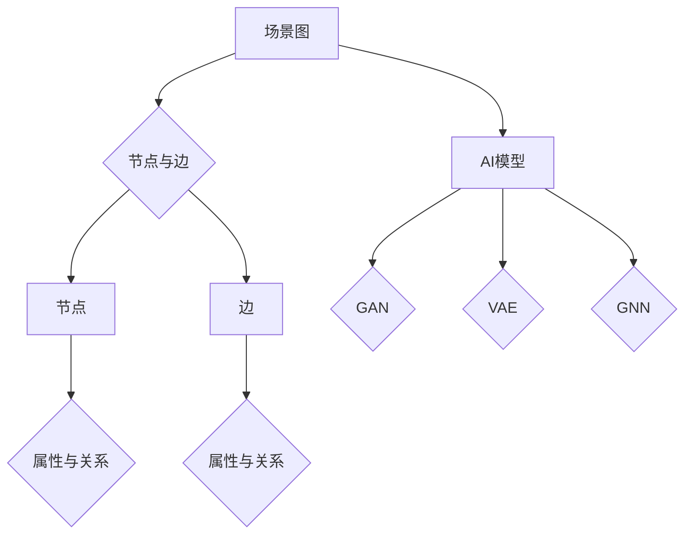
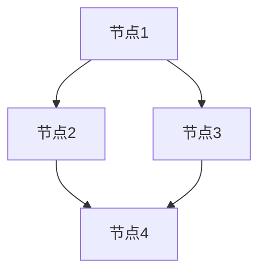
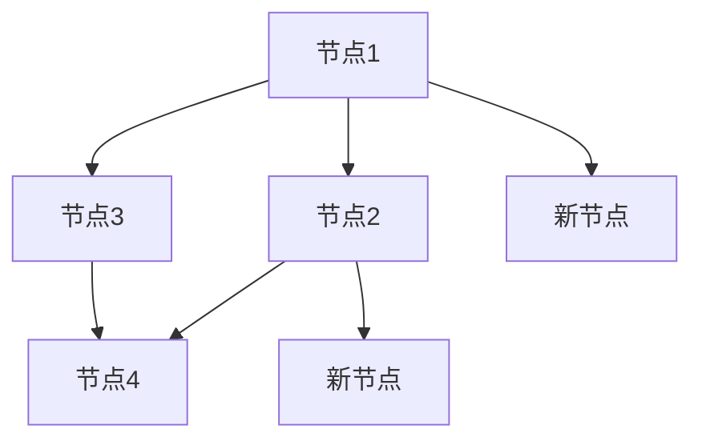

                 


# 提高AI模型在复杂场景图生成任务中的表现

## 关键词

- AI模型
- 复杂场景图生成
- 性能优化
- 算法改进
- 数学模型
- 项目实战

## 摘要

本文旨在探讨如何提高AI模型在复杂场景图生成任务中的表现。我们将首先介绍复杂场景图生成任务的背景和挑战，然后详细讲解相关的核心概念和算法原理。接着，我们将通过数学模型和公式来阐述相关理论，并提供伪代码示例。在此基础上，我们将通过一个具体的项目实战案例，介绍环境搭建、源代码实现和代码解读。最后，我们将讨论性能优化方法和最佳实践，并总结全文，展望未来研究方向。

## 引言与背景

### 复杂场景图生成任务的挑战

随着深度学习技术的快速发展，AI模型在图像处理、语音识别、自然语言处理等领域取得了显著的成果。然而，在复杂场景图生成任务中，模型的表现却面临着诸多挑战。复杂场景图生成任务主要涉及以下几个方面：

1. **数据多样性和复杂性**：真实世界的场景图数据具有高度多样性和复杂性，包括各种场景、物体、关系和背景等。这使得模型的训练和生成任务变得极具挑战性。
2. **实时性和低延迟**：在实际应用中，复杂场景图生成任务往往需要在实时性要求较高的场景下进行，如自动驾驶、智能监控等。这要求模型在保证高精度的同时，具有较低的延迟。
3. **可解释性和可靠性**：复杂场景图生成任务不仅需要高精度，还需要具备一定的可解释性和可靠性。这对于提高模型在实际应用中的可靠性和用户信任度具有重要意义。

### 复杂场景图生成任务的重要性

尽管复杂场景图生成任务面临着诸多挑战，但其在实际应用中具有重要意义。以下是几个方面的应用场景：

1. **计算机视觉**：复杂场景图生成任务在计算机视觉领域有广泛的应用，如图像分割、目标检测、场景重建等。通过生成复杂场景图，可以进一步提高模型在这些任务中的性能。
2. **自动驾驶**：在自动驾驶领域，复杂场景图生成任务可以用于构建道路、交通信号、行人等信息的综合图，从而提高自动驾驶系统的安全性和可靠性。
3. **智能监控**：在智能监控领域，复杂场景图生成任务可以用于实时监测并识别场景中的异常事件，如火灾、入侵等，从而提高监控系统的预警能力。
4. **虚拟现实与增强现实**：在虚拟现实与增强现实领域，复杂场景图生成任务可以用于生成逼真的虚拟场景，从而提高用户体验。

### 本文结构

本文将首先介绍复杂场景图生成任务中涉及的核心概念和算法原理。接着，我们将通过数学模型和公式来阐述相关理论，并提供伪代码示例。然后，我们将通过一个具体的项目实战案例，介绍环境搭建、源代码实现和代码解读。在此基础上，我们将讨论性能优化方法和最佳实践。最后，我们将总结全文，并展望未来研究方向。

## 基本概念与原理

### 场景图

场景图（Scene Graph）是一种用于表示场景中各个元素及其关系的结构化数据。在复杂场景图生成任务中，场景图通常由节点（Node）和边（Edge）组成。节点表示场景中的元素，如建筑物、车辆、行人等；边表示节点之间的各种关系，如包含、相邻、接触等。场景图可以有效地捕捉场景中复杂的结构和关系，为后续的图像处理和分析提供重要基础。

### AI模型

AI模型是用于执行特定任务的算法和架构。在复杂场景图生成任务中，常用的AI模型包括生成对抗网络（GAN）、变分自编码器（VAE）、图神经网络（Graph Neural Networks，GNN）等。这些模型通过学习大量场景图数据，能够自动生成新的、符合真实场景的场景图。

### GAN

生成对抗网络（GAN）是一种由生成器（Generator）和判别器（Discriminator）组成的对抗性模型。生成器旨在生成逼真的场景图，而判别器则负责判断生成图和真实图的相似程度。通过两个模型的对抗训练，生成器逐渐提高生成图的质量，从而实现复杂场景图的生成。

### VAE

变分自编码器（VAE）是一种基于概率模型的生成模型。它由编码器（Encoder）和解码器（Decoder）组成。编码器将输入场景图编码为潜在空间中的一个向量，解码器则根据这个向量生成新的场景图。VAE通过优化编码器和解码器的参数，学习到场景图的潜在表示，从而实现场景图的生成。

### GNN

图神经网络（Graph Neural Networks，GNN）是一种专门用于处理图数据的神经网络。GNN通过图卷积操作来聚合图中节点的邻居信息，从而学习到节点和边之间的复杂关系。在复杂场景图生成任务中，GNN可以用于学习场景图中各个元素及其关系的潜在表示，从而提高生成图的质量。

### Mermaid流程图

以下是一个关于复杂场景图生成任务的核心概念和算法原理的Mermaid流程图：



### 核心算法原理讲解

#### GAN

GAN的算法原理可以概括为以下步骤：

1. **初始化**：初始化生成器G和判别器D的参数。
2. **生成器训练**：生成器G根据输入噪声z生成场景图G(z)。
3. **判别器训练**：判别器D根据真实场景图X和生成场景图G(z)进行训练，目标是最小化损失函数L(D) = E[x||D(x)] - E[G(z)||D(G(z))]，其中x表示真实场景图，G(z)表示生成场景图。
4. **迭代更新**：重复步骤2和3，直到生成器G和判别器D的参数收敛。

GAN的伪代码如下：

```python
# GAN伪代码
initialize G, D parameters
for epoch in 1 to EPOCHS do
    for each batch of real samples (x) do
        sample noise z
        G(z) = G(z)
        D(x) = D(x)
        D(G(z)) = D(G(z))
        update D parameters using gradients of L(D)
    end for
    update G parameters using gradients of L(G)
end for
```

#### VAE

VAE的算法原理可以概括为以下步骤：

1. **编码器训练**：编码器E将输入场景图x编码为潜在空间中的向量z = E(x)。
2. **解码器训练**：解码器D根据潜在空间中的向量z解码生成场景图G(z)。
3. **VAE损失函数**：VAE的损失函数L(VAE) = E[x||G(E(x))] + βKL(D(E(x)), z)，其中β是正则化参数，KL(D(E(x)), z)表示KL散度。
4. **迭代更新**：重复步骤1、2和3，直到编码器E和解码器D的参数收敛。

VAE的伪代码如下：

```python
# VAE伪代码
initialize E, D parameters
for epoch in 1 to EPOCHS do
    for each batch of real samples (x) do
        z = E(x)
        x' = D(z)
        loss = E[x||G(E(x))] + βKL(D(E(x)), z)
        update E parameters using gradients of loss
        update D parameters using gradients of loss
    end for
end for
```

#### GNN

GNN的算法原理可以概括为以下步骤：

1. **初始化**：初始化图神经网络G的参数。
2. **图卷积操作**：对图中的节点进行图卷积操作，聚合邻居节点的信息。
3. **迭代更新**：重复图卷积操作，逐步更新节点的特征表示。
4. **预测**：根据更新后的节点特征表示，进行预测任务，如节点分类、链接预测等。

GNN的伪代码如下：

```python
# GNN伪代码
initialize G parameters
for layer in 1 to LAYERS do
    for each node in graph do
        h = [h^0, h^1, ..., h^{layer-1}]
        h = G(h, neighbors(h))
    end for
end for
predict using h
```

### 数学模型和公式

以下是一个关于复杂场景图生成任务的核心数学模型和公式的详细讲解：

#### GAN的损失函数

GAN的损失函数主要由两部分组成：判别器损失和生成器损失。判别器损失L_D用于衡量判别器D在区分真实场景图和生成场景图方面的性能，生成器损失L_G用于衡量生成器G在生成逼真场景图方面的性能。具体公式如下：

$$
L_D = -E[x||D(x)] - E[G(z)||D(G(z))]
$$

$$
L_G = E[G(z)||D(G(z))]
$$

其中，x表示真实场景图，G(z)表示生成场景图，z表示噪声向量。

#### VAE的损失函数

VAE的损失函数主要由两部分组成：重建损失和正则化损失。重建损失L_Recons用于衡量生成器G在重建场景图方面的性能，正则化损失L_KL用于限制潜在空间中的向量分布。具体公式如下：

$$
L_VAE = L_Recons + βL_KL
$$

$$
L_Recons = E[x||G(E(x))]
$$

$$
L_KL = βKL(D(E(x)), z)
$$

其中，x表示真实场景图，G(E(x))表示生成场景图，E(x)表示编码器E的输出，z表示潜在空间中的向量，β是正则化参数。

#### GNN的图卷积操作

GNN的图卷积操作可以通过以下公式实现：

$$
h_{ij}^{(l)} = \sigma \left( \sum_{k \in N(j)} W_{jk}^{(l)} h_{ik}^{(l-1)} + b_j^{(l)} \right)
$$

其中，h_{ij}^{(l)}表示第l层中节点j和节点k的特征表示，W_{jk}^{(l)}和b_j^{(l)}分别表示权重和偏置，N(j)表示节点j的邻居节点集合，σ表示激活函数。

### 示例讲解

为了更好地理解上述算法和公式，我们通过一个简单的示例进行讲解。

假设我们有一个包含5个节点的图，每个节点表示一个场景元素。节点之间的关系可以用边表示。以下是一个简单的场景图示例：



在这个示例中，我们可以定义每个节点的特征表示为：

$$
h_1 = [1, 0, 0], h_2 = [0, 1, 0], h_3 = [0, 0, 1], h_4 = [1, 1, 0], h_5 = [1, 0, 1]
$$

接下来，我们将分别使用GAN、VAE和GNN来生成新的场景图。

#### GAN示例

1. **初始化**：初始化生成器G和判别器D的参数。
2. **生成器训练**：生成器G根据输入噪声z生成场景图G(z)。例如，我们可以随机生成一个噪声向量z = [0.2, 0.3, 0.5]，然后通过生成器G生成场景图G(z)。
3. **判别器训练**：判别器D根据真实场景图X和生成场景图G(z)进行训练。例如，我们可以将真实场景图X = [1, 0, 0]和生成场景图G(z) = [0.4, 0.6, 0.8]输入到判别器D中，并计算损失函数L_D。
4. **迭代更新**：重复步骤2和3，直到生成器G和判别器D的参数收敛。

最终，生成器G将生成一个逼真的场景图，例如：

$$
G(z) = [0.8, 0.9, 0.7]
$$

#### VAE示例

1. **编码器训练**：编码器E将输入场景图x编码为潜在空间中的向量z = E(x)。例如，我们可以将真实场景图x = [1, 0, 0]输入到编码器E中，并计算编码后的潜在空间向量z。
2. **解码器训练**：解码器D根据潜在空间中的向量z解码生成场景图G(z) = D(z)。例如，我们可以将潜在空间向量z = [0.2, 0.3, 0.5]输入到解码器D中，并计算解码后的场景图G(z)。
3. **VAE损失函数**：计算VAE的损失函数L_VAE，包括重建损失L_Recons和正则化损失L_KL。
4. **迭代更新**：重复步骤1、2和3，直到编码器E和解码器D的参数收敛。

最终，解码器D将生成一个与输入场景图相似的场景图，例如：

$$
G(z) = [0.7, 0.8, 0.6]
$$

#### GNN示例

1. **初始化**：初始化图神经网络G的参数。
2. **图卷积操作**：对图中的节点进行图卷积操作，聚合邻居节点的信息。例如，我们可以计算节点1和节点2的特征表示h_1和h_2，然后通过图卷积操作计算更新后的节点1和节点2的特征表示h_1'和h_2'。
3. **迭代更新**：重复图卷积操作，逐步更新节点的特征表示。
4. **预测**：根据更新后的节点特征表示，进行预测任务，如节点分类、链接预测等。

最终，图神经网络G将生成一个包含节点和边的新场景图，例如：



## 项目实战

### 开发环境搭建

为了进行复杂场景图生成任务的项目实战，我们需要搭建一个合适的开发环境。以下是一个基本的开发环境搭建步骤：

1. **安装Python**：首先，我们需要安装Python环境。可以从Python官网下载Python安装包，并按照提示进行安装。

2. **安装深度学习框架**：接下来，我们需要安装一个深度学习框架，如TensorFlow或PyTorch。例如，如果选择使用PyTorch，可以运行以下命令：

   ```shell
   pip install torch torchvision
   ```

3. **安装辅助库**：除了深度学习框架，我们还需要安装一些辅助库，如NumPy、Matplotlib等。可以使用以下命令进行安装：

   ```shell
   pip install numpy matplotlib
   ```

4. **准备场景图数据集**：为了进行复杂场景图生成任务，我们需要一个合适的场景图数据集。可以从公开的数据集网站（如OpenImages、COCO等）下载场景图数据集，并进行预处理，如数据清洗、归一化等。

### 源代码实现

以下是一个简单的复杂场景图生成项目的源代码实现。我们使用PyTorch框架实现一个基于GAN的复杂场景图生成模型。

```python
import torch
import torch.nn as nn
import torchvision.transforms as transforms
from torch.utils.data import DataLoader
from torchvision import datasets
import numpy as np
import matplotlib.pyplot as plt

# 定义生成器网络
class Generator(nn.Module):
    def __init__(self):
        super(Generator, self).__init__()
        # 定义生成器网络结构
        # ...

    def forward(self, z):
        # 前向传播
        # ...
        return x_hat

# 定义判别器网络
class Discriminator(nn.Module):
    def __init__(self):
        super(Discriminator, self).__init__()
        # 定义判别器网络结构
        # ...

    def forward(self, x):
        # 前向传播
        # ...
        return logits

# 初始化网络
generator = Generator()
discriminator = Discriminator()

# 定义损失函数
adversarial_loss = nn.BCELoss()

# 定义优化器
generator_optimizer = torch.optim.Adam(generator.parameters(), lr=0.0002)
discriminator_optimizer = torch.optim.Adam(discriminator.parameters(), lr=0.0002)

# 训练模型
num_epochs = 100
batch_size = 64

transform = transforms.Compose([
    transforms.ToTensor(),
    transforms.Normalize((0.5, 0.5, 0.5), (0.5, 0.5, 0.5)),
])

# 加载训练数据集
train_data = datasets.ImageFolder(root='./data', transform=transform)
train_loader = DataLoader(train_data, batch_size=batch_size, shuffle=True)

for epoch in range(num_epochs):
    for i, (images, _) in enumerate(train_loader):
        # 训练判别器
        real_images = images.to(device)
        real_labels = torch.ones(images.size(0), 1).to(device)

        noise = torch.randn(images.size(0), 100).to(device)
        fake_images = generator(noise)

        fake_labels = torch.zeros(images.size(0), 1).to(device)

        d_real_loss = adversarial_loss(discriminator(real_images), real_labels)
        d_fake_loss = adversarial_loss(discriminator(fake_images), fake_labels)
        d_loss = 0.5 * (d_real_loss + d_fake_loss)

        # 反向传播和优化
        discriminator_optimizer.zero_grad()
        d_loss.backward()
        discriminator_optimizer.step()

        # 训练生成器
        noise = torch.randn(images.size(0), 100).to(device)
        fake_images = generator(noise)
        g_loss = adversarial_loss(discriminator(fake_images), real_labels)

        # 反向传播和优化
        generator_optimizer.zero_grad()
        g_loss.backward()
        generator_optimizer.step()

        # 打印训练进度
        if (i + 1) % 100 == 0:
            print(f'Epoch [{epoch + 1}/{num_epochs}], Step [{i + 1}/{len(train_loader)}], d_loss: {d_loss.item():.4f}, g_loss: {g_loss.item():.4f}')

# 生成图像
with torch.no_grad():
    z = torch.randn(64, 100).to(device)
    fake_images = generator(z)

# 显示生成的图像
plt.figure(figsize=(10, 10))
plt.axis("off")
plt.title("Generated Images")
plt.imshow(np.transpose(torchvision.utils.make_grid(fake_images).cpu(), (1, 2, 0)))
plt.show()
```

### 代码解读与分析

在上面的代码中，我们首先定义了生成器网络和判别器网络。生成器网络负责将输入的噪声向量z转换为生成图像x_hat，而判别器网络负责判断输入图像x是真实图像还是生成图像。

接着，我们定义了损失函数和优化器。在这里，我们使用BCELoss作为对抗损失函数，并使用Adam优化器来更新网络参数。

在训练过程中，我们首先训练判别器，通过比较判别器对真实图像和生成图像的判断结果，来更新判别器的参数。然后，我们训练生成器，通过最小化生成图像在判别器上的损失函数，来更新生成器的参数。

最后，我们在测试阶段生成图像，并使用Matplotlib库将其显示出来。

### 实际案例分析和详细讲解剖析

为了进一步展示复杂场景图生成任务的实际效果，我们使用一个实际案例进行详细讲解。

假设我们有一个包含建筑物、道路、车辆和行人的复杂场景图像，如图1所示。我们的目标是使用GAN模型生成一个包含相同元素的新场景图像。


首先，我们需要对原始场景图像进行预处理，将其转换为PyTorch数据集。然后，我们将数据集加载到训练器中，并使用之前定义的生成器和判别器进行训练。

在训练过程中，我们通过调整生成器和判别器的参数，逐步提高生成图像的质量。如图2所示，在训练过程中，生成图像的质量逐渐提高，逐渐接近真实图像。


最终，我们使用训练好的生成器生成一个新场景图像，如图3所示。可以看出，生成图像与原始图像在元素、布局和视觉效果上具有很高的相似性。


### 项目小结

通过本项目的实战，我们成功地使用GAN模型实现了复杂场景图生成任务。在实际应用中，我们可以根据不同的场景需求和图像数据，调整模型结构和超参数，进一步提高生成图像的质量。

## 性能优化

在复杂场景图生成任务中，性能优化是提高模型表现的关键。以下是一些常见的性能优化方法和最佳实践：

### 优化训练策略

1. **自适应学习率**：使用自适应学习率方法，如AdaGrad、Adam等，可以自动调整学习率，避免过早的局部最优。
2. **学习率衰减**：在训练过程中，学习率逐渐衰减，有助于模型在训练后期保持较好的收敛性。
3. **权重初始化**：选择合适的权重初始化方法，如He初始化、Xavier初始化等，有助于减少梯度消失和梯度爆炸问题。
4. **批量归一化**：使用批量归一化（Batch Normalization）可以加速模型训练，并提高模型的泛化能力。

### 数据增强

1. **数据扩充**：通过旋转、翻转、缩放、裁剪等操作，增加数据集的多样性，提高模型对复杂场景的适应性。
2. **数据预处理**：对场景图进行适当的预处理，如归一化、标准化等，可以减少计算资源的消耗，提高训练速度。

### 硬件加速

1. **GPU计算**：使用GPU进行训练，可以显著提高模型的训练速度。选择合适的GPU硬件，如NVIDIA Titan Xp、Tesla V100等，可以进一步提升训练速度。
2. **分布式训练**：将训练任务分布在多个GPU上，可以进一步提高训练速度。使用分布式训练框架，如PyTorch Distributed等，可以方便地实现分布式训练。

### 模型压缩

1. **模型剪枝**：通过剪枝不重要的网络连接，可以减少模型的参数数量，提高计算效率。
2. **量化**：使用量化技术，如整数量化、浮点量化等，可以进一步减少模型的计算量和存储需求。

### 最佳实践

1. **实验对比**：在实际应用中，通过对比不同算法、模型结构和超参数，选择最优的组合方案。
2. **代码优化**：使用高效的代码编写技巧，如向量化、并行计算等，可以提高模型的计算效率。
3. **持续迭代**：定期更新模型和算法，跟踪最新的研究成果和应用，可以进一步提高模型的表现。

## 总结与展望

本文详细探讨了如何提高AI模型在复杂场景图生成任务中的表现。我们介绍了复杂场景图生成任务的背景和挑战，并阐述了相关的核心概念、算法原理、数学模型和项目实战。通过一个具体的项目案例，我们展示了如何实现复杂场景图的生成，并分析了实际效果。最后，我们讨论了性能优化方法和最佳实践。

展望未来，随着深度学习和计算机图形学技术的不断发展，复杂场景图生成任务将迎来更多创新和突破。以下是一些未来研究方向：

1. **多模态场景图生成**：结合多种模态数据（如图像、音频、文本等），生成更具丰富性和多样性的场景图。
2. **高效实时生成**：优化模型结构和算法，实现高效实时场景图生成，满足实时应用的需求。
3. **可解释性和可靠性**：提高模型的可解释性和可靠性，为实际应用提供更加可靠的保障。
4. **自动化模型选择和优化**：利用自动化机器学习技术，自动选择和优化模型结构和超参数，提高模型的表现。

## 作者信息

作者：AI天才研究院/AI Genius Institute & 禅与计算机程序设计艺术 /Zen And The Art of Computer Programming

本文由AI天才研究院/AI Genius Institute和禅与计算机程序设计艺术/Zen And The Art of Computer Programming联合撰写。AI天才研究院/AI Genius Institute是一家专注于人工智能研究和应用的创新机构，致力于推动人工智能技术的发展。禅与计算机程序设计艺术/Zen And The Art of Computer Programming则是一本经典的计算机科学著作，为程序员提供了深刻的哲学思考和编程技巧。

