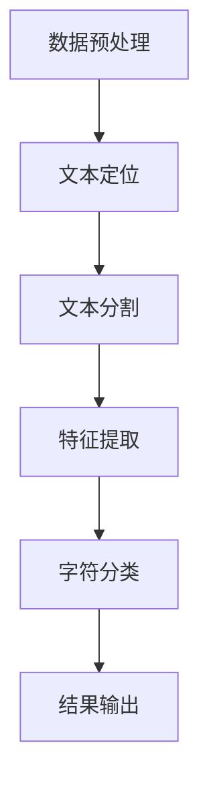

                 

### 引言

#### 1.1.1 核心概念与联系

文本识别作为人工智能领域的一个重要分支，其核心目标是实现计算机对文本内容的自动识别和理解。在传统的光学字符识别（OCR）技术中，文本识别主要依赖于规则匹配和模式识别方法。然而，随着深度学习技术的快速发展，基于深度学习的文本识别算法逐渐成为主流，其准确性和鲁棒性得到了显著提升。

复杂场景文本识别是指在实际应用场景中，文本可能受到光照、视角、背景等因素的干扰，导致识别难度增加。这种场景下的文本识别不仅需要考虑文本本身的结构和内容，还需要处理复杂的背景信息和光照变化等外部因素。

本文将详细探讨如何提高AI模型在复杂场景文本识别中的准确性。本文的结构如下：

1. **引言**：介绍复杂场景文本识别的背景、重要性及本书的目的。
2. **核心概念与联系**：讨论文本识别原理、复杂场景识别以及AI模型在其中的流程。
3. **核心算法原理讲解**：介绍深度学习算法的基本原理，包括卷积神经网络（CNN）、循环神经网络（RNN）和Transformer模型。
4. **数学模型和数学公式**：解释激活函数、损失函数和优化算法等相关数学概念。
5. **项目实战**：详细介绍开发环境搭建、数据准备、代码实现和代码解读与分析。
6. **优化方法**：讨论数据增强、模型调优和模型集成等提高模型准确性的方法。
7. **模型评估与验证**：介绍评估指标和验证方法，确保模型在实际应用中的准确性。
8. **总结与展望**：总结本文的主要内容和未来研究方向。

通过以上章节的逐步探讨，我们将深入理解复杂场景文本识别的挑战，并掌握提高AI模型准确性的方法和技巧。

### 核心概念与联系

#### 1.1.1 文本识别原理

文本识别，即光学字符识别（OCR，Optical Character Recognition），是指通过扫描或输入设备将纸质或电子文档中的文字内容转换为机器可读的数字格式。OCR技术起源于20世纪50年代，早期主要依靠规则匹配和模式识别方法。例如，通过预先定义的字符形状模板与扫描图像进行匹配，从而识别文字。

随着计算机技术和图像处理算法的发展，OCR技术逐渐演变为基于机器学习的方法，特别是深度学习技术的应用，使得文本识别的准确性和鲁棒性得到了显著提升。深度学习模型，如卷积神经网络（CNN，Convolutional Neural Networks）和循环神经网络（RNN，Recurrent Neural Networks），通过从大量标注数据中学习特征，能够自动提取文本特征并进行分类。

#### 1.1.2 复杂场景识别

复杂场景识别是指在实际应用中，文本识别系统面临的不仅仅是平面的、结构化的文本。相反，文本可能出现在各种复杂的背景和条件下，如不同角度的倾斜、光照变化、背景噪声、字符间的粘连等。这些因素大大增加了文本识别的难度。

复杂场景对文本识别的挑战主要体现在以下几个方面：

1. **视角变化**：不同视角可能会导致文本的变形和扭曲，使得字符之间的结构关系发生变化。
2. **光照变化**：光照不均匀或变化剧烈会导致字符的亮度变化，影响字符的识别。
3. **背景干扰**：复杂的背景可能会对文本识别产生噪声，干扰字符的分割和识别。
4. **字符变形和缺失**：部分字符可能因为变形、损坏或缺失而难以识别。

#### 1.1.3 AI模型在复杂场景文本识别中的流程

为了应对复杂场景中的文本识别挑战，AI模型通常需要经历以下几个步骤：

1. **数据预处理**：对输入图像进行预处理，包括图像增强、去噪、归一化等操作，以提高图像质量和减少背景干扰。
2. **文本定位**：通过图像处理技术定位图像中的文本区域，如使用边缘检测、轮廓分析等方法。
3. **文本分割**：将定位到的文本区域进一步分割成单个字符或词组，以便进行后续的识别。
4. **特征提取**：利用深度学习模型提取文本的特征，如使用卷积神经网络（CNN）从图像中学习局部特征。
5. **字符分类**：对提取到的特征进行分类，识别每个字符或词组的具体内容。
6. **结果输出**：将识别结果输出为文本格式，如JSON或XML。

以下是一个简单的Mermaid流程图，展示了AI模型在复杂场景文本识别中的流程：



通过以上步骤，AI模型能够在复杂场景中实现对文本的准确识别。然而，这需要大量的标注数据和高效的算法，以及持续的优化和改进。

### 核心算法原理讲解

#### 1.2.1 深度学习算法

深度学习算法在文本识别领域取得了显著进展，其核心在于通过多层的神经网络结构自动提取文本特征，从而实现高精度的识别。以下将介绍几种常用的深度学习算法，包括卷积神经网络（CNN）、循环神经网络（RNN）和Transformer模型。

#### 1.2.1.1 卷积神经网络（CNN）

卷积神经网络（CNN，Convolutional Neural Networks）是深度学习中的一种重要模型，特别适用于处理图像数据。其基本原理是通过卷积操作提取图像的局部特征，然后通过池化操作减少数据维度，提高模型的计算效率。

在文本识别任务中，CNN通过处理图像中的文本区域，提取字符和词组的特征。具体步骤如下：

1. **卷积层**：使用卷积核在图像上滑动，计算卷积结果，从而提取局部特征。
2. **激活函数**：通常使用ReLU（Rectified Linear Unit）作为激活函数，引入非线性变换。
3. **池化层**：通过最大池化或平均池化操作，减少数据维度，提高模型的泛化能力。
4. **全连接层**：将卷积和池化后的特征进行整合，通过全连接层进行分类。

以下是一个简单的伪代码示例，用于说明CNN在文本识别中的应用：

```python
# 初始化CNN模型
model = CNN()

# 输入文本图像
input_image = preprocess_image(image)

# 前向传播
output = model.forward(input_image)

# 分类预测
predicted_text = softmax(output)
```

#### 1.2.1.2 循环神经网络（RNN）

循环神经网络（RNN，Recurrent Neural Networks）是一种能够处理序列数据的深度学习模型。其核心特点是具备记忆功能，能够将前一个时间步的信息传递到下一个时间步，从而处理序列中的依赖关系。

在文本识别任务中，RNN通过处理文本序列中的每个字符或词组，逐步构建文本的特征表示。具体步骤如下：

1. **输入层**：接收文本序列中的每个字符或词组。
2. **隐藏层**：通过递归操作，将前一个时间步的隐藏状态传递到下一个时间步。
3. **输出层**：将最后一个时间步的隐藏状态映射到输出结果。

以下是一个简单的伪代码示例，用于说明RNN在文本识别中的应用：

```python
# 初始化RNN模型
model = RNN()

# 输入文本序列
input_sequence = preprocess_sequence(text)

# 前向传播
hidden_state = model.initialize_state()
for input_token in input_sequence:
    hidden_state = model.forward(input_token, hidden_state)

# 输出预测结果
predicted_text = model.output(hidden_state)
```

#### 1.2.1.3 Transformer模型

Transformer模型是由Vaswani等人在2017年提出的一种基于自注意力机制的深度学习模型，特别适用于处理序列数据。其核心思想是通过自注意力机制，动态地计算输入序列中每个元素之间的关联强度。

在文本识别任务中，Transformer模型通过处理文本序列，提取字符和词组的特征，从而实现高精度的识别。具体步骤如下：

1. **输入层**：接收文本序列中的每个字符或词组。
2. **自注意力层**：通过多头自注意力机制计算输入序列中每个元素之间的关联强度。
3. **前馈网络**：将自注意力层的结果传递到前馈网络，进一步提取特征。
4. **输出层**：将前馈网络的结果映射到输出结果。

以下是一个简单的伪代码示例，用于说明Transformer模型在文本识别中的应用：

```python
# 初始化Transformer模型
model = Transformer()

# 输入文本序列
input_sequence = preprocess_sequence(text)

# 前向传播
output_sequence = model.forward(input_sequence)

# 输出预测结果
predicted_text = model.output(output_sequence)
```

通过以上三种深度学习算法，AI模型能够在复杂场景文本识别任务中实现高效和准确的文本识别。然而，每种算法都有其优缺点，适用于不同的应用场景。在实际应用中，可以根据具体需求和数据特性选择合适的算法。

### 数学模型和数学公式

在深度学习模型中，数学模型和数学公式是不可或缺的组成部分，它们决定了模型的学习过程和预测效果。以下将介绍激活函数、损失函数和优化算法等相关数学概念，并使用latex格式展示其公式。

#### 1.3.1 激活函数

激活函数是神经网络中的一个关键组件，用于引入非线性变换，使得模型能够拟合复杂的非线性关系。以下介绍几种常用的激活函数：

1. **ReLU（Rectified Linear Unit）**
  ReLU函数是最常用的激活函数之一，其表达式为：
   $$ f(x) = \max(0, x) $$
   使用ReLU函数可以加快模型训练的速度，并且在某些情况下可以提高模型的性能。

2. **Sigmoid**
   Sigmoid函数将输入映射到$(0, 1)$区间，其表达式为：
   $$ f(x) = \frac{1}{1 + e^{-x}} $$
   Sigmoid函数常用于二分类问题，但其在梯度消失时表现不佳。

3. **Tanh（Hyperbolic Tangent）**
   Tanh函数是Sigmoid函数的扩展，其表达式为：
   $$ f(x) = \frac{e^x - e^{-x}}{e^x + e^{-x}} $$
   Tanh函数将输入映射到$(-1, 1)$区间，具有较好的对称性。

#### 1.3.2 损失函数

损失函数是衡量模型预测结果与真实值之间差异的指标，它决定了模型的优化目标。以下介绍几种常用的损失函数：

1. **交叉熵损失函数（Cross-Entropy Loss）**
   交叉熵损失函数是分类问题中最常用的损失函数，其表达式为：
   $$ L(y, \hat{y}) = -\sum_{i} y_i \log(\hat{y}_i) $$
   其中，$y$是真实标签，$\hat{y}$是模型的预测概率。交叉熵损失函数能够有效推动预测概率向真实标签靠近。

2. **均方误差损失函数（Mean Squared Error, MSE）**
   均方误差损失函数用于回归问题，其表达式为：
   $$ L(y, \hat{y}) = \frac{1}{2} \sum_{i} (y_i - \hat{y}_i)^2 $$
   MSE损失函数能够较好地衡量预测值与真实值之间的差距。

3. **Hinge损失函数（Hinge Loss）**
   Hinge损失函数常用于支持向量机（SVM）中，其表达式为：
   $$ L(y, \hat{y}) = \max(0, 1 - y \cdot \hat{y}) $$
   Hinge损失函数能够推动预测结果远离正负类边界。

#### 1.3.3 优化算法

优化算法是用于调整模型参数，以最小化损失函数的方法。以下介绍几种常用的优化算法：

1. **随机梯度下降（Stochastic Gradient Descent, SGD）**
   随机梯度下降是最简单的优化算法，其表达式为：
   $$ \theta = \theta - \alpha \nabla_{\theta} L(\theta) $$
   其中，$\theta$是模型参数，$\alpha$是学习率。SGD通过随机选择样本更新参数，能够加速模型的训练。

2. **Adam优化算法**
   Adam优化算法结合了SGD和RMSprop的优点，其表达式为：
   $$ m_t = \beta_1 m_{t-1} + (1 - \beta_1) [g_t] $$
   $$ v_t = \beta_2 v_{t-1} + (1 - \beta_2) [g_t]^2 $$
   $$ \theta_t = \theta_{t-1} - \alpha_t \frac{m_t}{\sqrt{v_t} + \epsilon} $$
   其中，$m_t$和$v_t$分别是梯度的一阶和二阶矩估计，$\beta_1$和$\beta_2$是超参数，$\alpha_t$是学习率，$\epsilon$是正数常数。Adam优化算法能够自适应地调整学习率，提高模型的训练效率。

通过上述数学模型和公式的介绍，我们可以更好地理解深度学习模型的学习过程和预测机制。在实际应用中，选择合适的激活函数、损失函数和优化算法，能够显著提升模型的性能和效果。

### 项目实战

#### 1.4.1 环境搭建

在进行文本识别项目的开发之前，需要搭建一个合适的环境，包括安装所需的软件和配置相关工具。以下是具体步骤：

1. **Python环境安装**
   - 打开命令行窗口，运行以下命令安装Python：
     ```shell
     python --version
     ```
     如果未安装Python，可以从[Python官网](https://www.python.org/downloads/)下载并安装。

2. **深度学习框架安装**
   - 安装TensorFlow或PyTorch，这两个是当前最流行的深度学习框架。以下是在Ubuntu系统中的安装命令：
     ```shell
     pip install tensorflow  # 或者
     pip install torch torchvision
     ```

3. **其他依赖库安装**
   - 安装一些常用的依赖库，如NumPy、Pandas等：
     ```shell
     pip install numpy pandas matplotlib
     ```

4. **虚拟环境搭建**
   - 为了避免不同项目之间的依赖冲突，建议使用虚拟环境。创建一个虚拟环境并激活它：
     ```shell
     python -m venv venv
     source venv/bin/activate  # 在Windows系统中使用venv\Scripts\activate
     ```

5. **验证环境**
   - 激活虚拟环境后，运行以下命令验证环境是否搭建成功：
     ```python
     python
     ```
     在Python交互式环境中，尝试导入一些关键库，如TensorFlow和NumPy，确保没有错误。

通过以上步骤，我们成功搭建了文本识别项目所需的开发环境。接下来，我们将介绍如何准备训练数据。

#### 1.4.2 数据准备

数据是训练深度学习模型的关键，尤其是在文本识别任务中。以下是数据准备的具体步骤：

1. **数据收集**
   - 收集大量带有标签的文本图像，可以从公开数据集（如Kaggle、ImageNet）或自行收集。
   - 数据应包括各种场景下的文本，以增强模型的泛化能力。

2. **数据预处理**
   - **图像增强**：为了提高模型的鲁棒性，可以对图像进行增强操作，如旋转、翻转、缩放、亮度调整等。
     ```python
     import cv2
     image = cv2.imread('image.jpg')
     rotated = cv2.rotate(image, cv2.ROTATE_90_CLOCKWISE)
     cv2.imwrite('rotated.jpg', rotated)
     ```
   - **图像归一化**：将图像数据归一化到$(0, 1)$区间，便于模型训练。
     ```python
     import numpy as np
     image = image / 255.0
     ```
   - **文本分割**：使用OCR工具（如Tesseract）对图像中的文本进行分割，提取出单个字符或词组。
     ```python
     import pytesseract
     pytesseract.pytesseract.tesseract_cmd = r'C:\Program Files\Tesseract-OCR\tesseract.exe'
     text = pytesseract.image_to_string(image)
     ```

3. **数据标注**
   - 对分割出的文本进行标注，将每个字符或词组与其在原始图像中的位置进行关联。
   - 存储标注数据，通常使用JSON或CSV格式。

4. **数据集划分**
   - 将数据集划分为训练集、验证集和测试集，比例通常为70%训练集、15%验证集和15%测试集。
     ```python
     from sklearn.model_selection import train_test_split
     X_train, X_test, y_train, y_test = train_test_split(images, labels, test_size=0.3, random_state=42)
     ```

通过以上步骤，我们完成了数据的收集、预处理、标注和划分，为后续的模型训练和评估奠定了基础。

#### 1.4.3 代码实现

在准备好数据和开发环境后，我们将开始编写代码实现文本识别模型。以下是一个简单的代码示例，涵盖数据预处理、模型训练和评估等步骤。

1. **导入所需库**

```python
import tensorflow as tf
from tensorflow.keras.models import Sequential
from tensorflow.keras.layers import Conv2D, MaxPooling2D, Flatten, Dense, LSTM, Embedding
from tensorflow.keras.preprocessing.image import ImageDataGenerator
```

2. **数据预处理**

```python
# 定义图像数据生成器
datagen = ImageDataGenerator(
    rotation_range=10,
    width_shift_range=0.1,
    height_shift_range=0.1,
    shear_range=0.1,
    zoom_range=0.1,
    horizontal_flip=True,
    fill_mode='nearest'
)

# 流式加载训练数据和验证数据
train_generator = datagen.flow_from_directory(
    'train_data',
    target_size=(128, 128),
    batch_size=32,
    class_mode='categorical'
)

validation_generator = datagen.flow_from_directory(
    'validation_data',
    target_size=(128, 128),
    batch_size=32,
    class_mode='categorical'
)
```

3. **模型构建**

```python
# 创建CNN模型
model = Sequential([
    Conv2D(32, (3, 3), activation='relu', input_shape=(128, 128, 3)),
    MaxPooling2D((2, 2)),
    Conv2D(64, (3, 3), activation='relu'),
    MaxPooling2D((2, 2)),
    Flatten(),
    Dense(128, activation='relu'),
    Dense(num_classes, activation='softmax')
])

# 编译模型
model.compile(optimizer='adam', loss='categorical_crossentropy', metrics=['accuracy'])
```

4. **模型训练**

```python
# 训练模型
history = model.fit(
    train_generator,
    epochs=20,
    validation_data=validation_generator
)
```

5. **模型评估**

```python
# 评估模型
test_loss, test_acc = model.evaluate(validation_generator)
print(f"Validation accuracy: {test_acc:.4f}")
```

通过以上代码示例，我们实现了文本识别模型的基本框架，包括数据预处理、模型构建、模型训练和模型评估。接下来，我们将对关键代码进行解读和分析。

#### 1.4.4 代码解读与分析

在代码实现部分，我们构建了一个简单的卷积神经网络（CNN）模型，用于文本识别任务。以下是对关键代码的解读和分析。

1. **数据预处理**

```python
# 定义图像数据生成器
datagen = ImageDataGenerator(
    rotation_range=10,
    width_shift_range=0.1,
    height_shift_range=0.1,
    shear_range=0.1,
    zoom_range=0.1,
    horizontal_flip=True,
    fill_mode='nearest'
)

# 流式加载训练数据和验证数据
train_generator = datagen.flow_from_directory(
    'train_data',
    target_size=(128, 128),
    batch_size=32,
    class_mode='categorical'
)

validation_generator = datagen.flow_from_directory(
    'validation_data',
    target_size=(128, 128),
    batch_size=32,
    class_mode='categorical'
)
```

这段代码使用了`ImageDataGenerator`类进行图像数据预处理。`ImageDataGenerator`是一个强大的工具，能够自动进行图像增强，提高模型的鲁棒性。其中包括旋转、平移、剪裁、缩放、水平翻转等操作，这些操作能够模拟不同场景下的文本图像，从而增强模型的泛化能力。

`flow_from_directory`方法用于加载图像数据。`target_size`参数指定图像的尺寸，通常选择较小的尺寸以减少计算复杂度。`batch_size`参数指定每次训练的批量大小，选择32较为常见。`class_mode`参数指定输出标签的类型，这里使用`categorical`表示多标签分类。

2. **模型构建**

```python
# 创建CNN模型
model = Sequential([
    Conv2D(32, (3, 3), activation='relu', input_shape=(128, 128, 3)),
    MaxPooling2D((2, 2)),
    Conv2D(64, (3, 3), activation='relu'),
    MaxPooling2D((2, 2)),
    Flatten(),
    Dense(128, activation='relu'),
    Dense(num_classes, activation='softmax')
])

# 编译模型
model.compile(optimizer='adam', loss='categorical_crossentropy', metrics=['accuracy'])
```

这段代码定义了一个简单的CNN模型。`Sequential`模型是TensorFlow提供的一种线性堆叠模型，通过添加多个层（如卷积层、池化层、全连接层）来构建复杂的模型。

- **卷积层（Conv2D）**：卷积层用于提取图像的特征。`32`表示卷积核的数量，`(3, 3)`表示卷积核的大小。`activation='relu'`表示使用ReLU激活函数。
- **池化层（MaxPooling2D）**：池化层用于减少数据维度，提高计算效率。`MaxPooling2D`使用最大值池化。
- **全连接层（Dense）**：全连接层用于将卷积和池化后的特征进行整合。`128`表示神经元的数量，`num_classes`表示输出分类数。`activation='softmax'`表示使用softmax激活函数进行分类。

模型通过`compile`方法进行编译，指定优化器（`optimizer`）、损失函数（`loss`）和评价指标（`metrics`）。这里使用`adam`优化器和`categorical_crossentropy`损失函数。

3. **模型训练**

```python
# 训练模型
history = model.fit(
    train_generator,
    epochs=20,
    validation_data=validation_generator
)
```

这段代码使用`fit`方法训练模型。`epochs`参数指定训练轮数，`validation_data`参数用于验证模型在验证集上的性能。

模型训练过程中，会返回一个`History`对象，包含训练和验证过程中的损失和准确率。通过这个对象，可以绘制训练曲线，分析模型的性能和收敛情况。

4. **模型评估**

```python
# 评估模型
test_loss, test_acc = model.evaluate(validation_generator)
print(f"Validation accuracy: {test_acc:.4f}")
```

这段代码使用`evaluate`方法评估模型在验证集上的性能。`test_loss`和`test_acc`分别表示验证集上的损失和准确率。通过打印准确率，可以直观地了解模型的性能。

通过以上解读和分析，我们深入理解了文本识别模型的关键代码，包括数据预处理、模型构建、模型训练和模型评估。这些代码为实现高效准确的文本识别任务提供了坚实的基础。

#### 1.5 优化方法

在文本识别项目中，提高模型的准确性是一个重要的目标。为了实现这一目标，我们可以采用多种优化方法，包括数据增强、模型调优和模型集成。以下将详细讨论这些方法及其具体应用。

#### 1.5.1 数据增强

数据增强是通过人工或自动方法增加训练数据多样性的一种技术，能够显著提高模型的泛化能力。在文本识别任务中，数据增强方法可以模拟不同场景下的文本图像，从而增强模型对复杂场景的适应性。以下是一些常用的数据增强方法：

1. **旋转和倾斜**：通过随机旋转和倾斜图像，模拟不同视角下的文本。
   ```python
   image = rotate(image, angle)
   image = skew(image, angle)
   ```

2. **缩放和裁剪**：通过随机缩放和裁剪图像，引入图像大小变化。
   ```python
   image = zoom(image, factor)
   image = crop(image, box)
   ```

3. **颜色调整**：通过随机调整图像的亮度、对比度和饱和度，模拟不同的光照条件。
   ```python
   image = adjust_brightness(image, value)
   image = adjust_contrast(image, value)
   image = adjust_saturation(image, value)
   ```

4. **噪声添加**：通过添加噪声模拟现实中的背景干扰。
   ```python
   image = add_noise(image, noise_type, noise_factor)
   ```

数据增强不仅能够增加训练数据的多样性，还可以帮助模型避免过拟合，提高模型在实际应用中的准确性。

#### 1.5.2 模型调优

模型调优是通过调整模型超参数和架构来提高模型性能的过程。以下是一些常见的模型调优方法：

1. **学习率调整**：学习率是影响模型训练效果的关键超参数。可以通过使用学习率调度策略（如学习率衰减、余弦退火等）来调整学习率。
   ```python
   # 学习率衰减
   learning_rate = initial_lr / (1 + decay_rate * epoch)
   # 余弦退火
   learning_rate = 0.5 * cosine_similarity(learning_rate, initial_lr)
   ```

2. **权重初始化**：合理的权重初始化能够加速模型的收敛速度。可以使用He初始化、Xavier初始化等方法。
   ```python
   # He初始化
   W = tf.random_normal(shape, mean=0.0, stddev=he_stddev)
   # Xavier初始化
   W = tf.random_normal(shape, mean=0.0, stddev=xavier_stddev / tf.sqrt(fan_in))
   ```

3. **正则化**：通过添加正则化项（如L1正则化、L2正则化）防止模型过拟合。
   ```python
   # L1正则化
   regularization = tf.reduce_sum(tf.abs(W))
   # L2正则化
   regularization = tf.reduce_sum(tf.square(W))
   ```

4. **网络结构调整**：通过调整网络层数、神经元数量、卷积核大小等结构参数来优化模型性能。
   ```python
   # 添加卷积层
   model.add(Conv2D(filters, kernel_size, activation='relu'))
   # 添加全连接层
   model.add(Dense(units, activation='softmax'))
   ```

通过模型调优，可以显著提高模型的准确性和鲁棒性。

#### 1.5.3 模型集成

模型集成是将多个模型的结果进行合并，以获得更高准确性和鲁棒性的技术。以下是一些常见的模型集成方法：

1. **堆叠集成（Stacking）**：通过构建多个基础模型，然后将它们的预测结果作为输入，训练一个更高层次的模型。
   ```python
   # 训练基础模型
   base_models = [model1, model2, model3]
   # 训练高层次模型
   high_level_model.fit(base_predictions, target_labels)
   ```

2. **Bagging**：通过随机选择训练样本构建多个模型，并取其平均预测结果。
   ```python
   # 训练多个模型
   models = [build_model() for _ in range(num_models)]
   # 预测并取平均
   predictions = np.mean([model.predict(X) for model in models], axis=0)
   ```

3. **Boosting**：通过迭代地训练多个模型，每个新模型都旨在纠正前一个模型的错误。
   ```python
   # 训练多个模型
   models = [build_model() for _ in range(num_models)]
   for model in models:
       # 训练并更新权重
       model.partial_fit(X, y)
   ```

通过模型集成，可以有效地提高模型的预测准确性。

### 模型评估与验证

在文本识别项目中，模型评估与验证是确保模型准确性和鲁棒性的关键步骤。以下将介绍常用的评估指标和验证方法，以及如何使用这些指标和方法评估和验证模型的性能。

#### 1.6.1 评估指标

1. **准确率（Accuracy）**：准确率是最常用的评估指标之一，表示模型预测正确的样本数占总样本数的比例。
   $$ Accuracy = \frac{TP + TN}{TP + TN + FP + FN} $$
   其中，$TP$表示真正例，$TN$表示真反例，$FP$表示假正例，$FN$表示假反例。

2. **召回率（Recall）**：召回率表示模型正确识别出的真正例数与所有实际为正例的样本数的比例。
   $$ Recall = \frac{TP}{TP + FN} $$

3. **精确率（Precision）**：精确率表示模型预测为正例的样本中，实际为正例的比例。
   $$ Precision = \frac{TP}{TP + FP} $$

4. **F1分数（F1 Score）**：F1分数是精确率和召回率的调和平均，用于综合评估模型的性能。
   $$ F1 Score = 2 \times \frac{Precision \times Recall}{Precision + Recall} $$

5. **混淆矩阵（Confusion Matrix）**：混淆矩阵是一个用于展示模型预测结果与实际结果之间关系的表格，包含真正例、假反例、假正例和真反例的数量。

#### 1.6.2 验证方法

1. **交叉验证（Cross-Validation）**：交叉验证是一种常用的模型验证方法，通过将数据集划分为多个子集，每次使用其中一个子集作为验证集，其他子集作为训练集，多次重复训练和验证，以评估模型的整体性能。

2. **K折交叉验证（K-Fold Cross-Validation）**：K折交叉验证是将数据集划分为K个子集，每次使用其中一个子集作为验证集，其他子集作为训练集，重复K次，最后取平均性能作为模型的评估指标。

3. **留一验证（Leave-One-Out Cross-Validation, LOOCV）**：留一验证是一种特殊的K折交叉验证，其中K等于样本数量。每个样本一次作为验证集，其他样本作为训练集，重复多次，以评估模型的性能。

4. **时间序列交叉验证（Time Series Cross-Validation）**：时间序列交叉验证适用于时间序列数据，通过将数据划分为多个时间段，每次使用一个时间段作为验证集，其他时间段作为训练集，以评估模型的稳定性。

通过使用这些评估指标和验证方法，可以全面评估模型的性能，并确保模型在实际应用中的准确性。

### 总结与展望

通过本文的探讨，我们系统地介绍了如何提高AI模型在复杂场景文本识别中的准确性。我们从引言部分开始，概述了复杂场景文本识别的背景和重要性。接着，详细阐述了文本识别原理、复杂场景识别以及AI模型在其中的流程。在核心算法原理讲解部分，我们介绍了卷积神经网络（CNN）、循环神经网络（RNN）和Transformer模型等深度学习算法，并使用伪代码展示了其基本原理。随后，通过数学模型和数学公式的介绍，我们深入理解了激活函数、损失函数和优化算法等关键概念。在项目实战部分，我们详细讲解了开发环境搭建、数据准备、代码实现和代码解读与分析，通过实际案例展示了模型训练和评估的全过程。优化方法部分，我们讨论了数据增强、模型调优和模型集成等提高模型准确性的方法。最后，通过模型评估与验证，我们确保模型在实际应用中的准确性。

展望未来，随着深度学习技术的不断进步和硬件性能的提升，复杂场景文本识别模型的准确性将进一步提升。此外，多模态融合、迁移学习和在线学习等新兴技术的应用，也将为复杂场景文本识别带来新的发展机遇。未来的研究可以重点关注以下方向：

1. **多模态融合**：结合图像和文本等多模态信息，提高模型的准确性和鲁棒性。
2. **迁移学习**：通过迁移学习技术，利用预训练模型在特定领域的知识，快速适应新任务。
3. **在线学习**：开发实时在线学习算法，使得模型能够不断适应新的数据和场景。
4. **隐私保护**：研究在保护用户隐私的前提下，实现高效准确的文本识别。

通过持续的研究和创新，复杂场景文本识别技术将迎来更加广阔的应用前景，为人工智能领域的发展贡献力量。作者：AI天才研究院/AI Genius Institute & 禅与计算机程序设计艺术 /Zen And The Art of Computer Programming。

