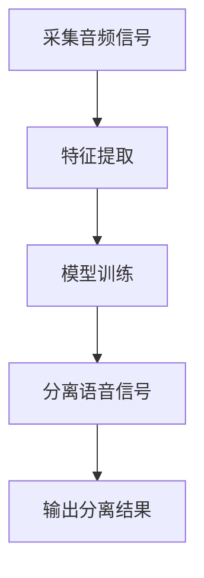
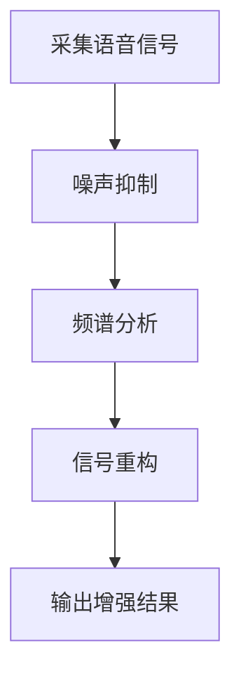
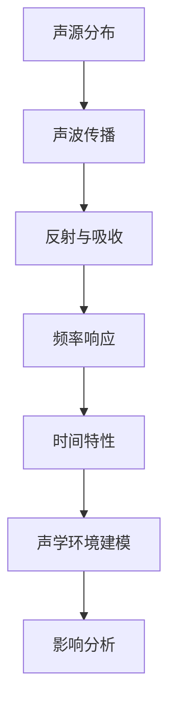

                 

### 1. 引言与背景介绍

在当今的数字化时代，语音识别和人工智能技术正迅速发展，使得语音分离与增强成为一项备受关注的研究领域。复杂声学环境下的语音分离与增强，不仅对于智能助手、自动翻译、语音合成等应用场景至关重要，也对我们日常生活中对高质量语音的需求提供了强有力的支持。

#### 复杂声学环境概述

复杂声学环境是指那些包含多种声源、不同音量和背景噪音的场合。这些环境对语音分离与增强提出了巨大挑战，因为传统的单一声源或理想声学环境下的算法在这些场合往往表现不佳。例如，在拥挤的会议室、嘈杂的咖啡馆或繁忙的交通环境中，语音信号往往会被其他声音干扰，使得语音识别和合成变得困难。

#### 语音分离与增强的重要性

语音分离与增强技术在复杂声学环境中的应用具有重要意义：

1. **提升语音识别率**：在复杂声学环境中，通过分离特定语音信号并增强其音量，可以显著提高语音识别系统的准确率。
2. **改善用户体验**：在智能助手、语音翻译等应用中，高质量的语音输出能够提供更自然的用户体验。
3. **促进通信效率**：在嘈杂的环境中，通过语音分离与增强，可以使重要信息更加突出，从而提高通信效率。

#### 当前研究的挑战与机会

在复杂声学环境下，语音分离与增强的研究面临以下挑战：

1. **声源混叠**：多个声源信号混合在一起，使得分离任务复杂化。
2. **环境噪音**：背景噪音会干扰目标语音信号，降低分离和增强的效果。
3. **语音信号的变化**：语音信号在不同声学环境下的变化规律难以捕捉。

然而，随着人工智能技术的进步，这些挑战也为我们提供了新的机会：

1. **深度学习算法**：深度学习算法能够通过大量数据学习复杂声学环境下的语音特征，提高分离与增强的效果。
2. **多传感器融合**：结合多种传感器数据，可以更准确地捕捉声源信息，提高语音分离与增强的准确性。

总之，研究复杂声学环境下的语音分离与增强，不仅具有重要的理论价值，也具有广泛的应用前景。接下来，我们将深入探讨语音分离与增强的核心概念、算法原理以及数学模型，为解决这一挑战提供有力支持。

### 2. 核心概念与联系

在复杂声学环境下的语音分离与增强中，理解以下核心概念及其相互关系至关重要。这些概念包括语音分离、语音增强以及声学环境。

#### 2.1 语音分离

**定义**：语音分离是指从多个声源中提取并分离出特定语音信号的过程。

**原理**：语音分离通常依赖于对声源特征的分析，包括频谱特征、时序特征和空间特征。通过分析这些特征，算法能够识别并分离出目标语音信号。

**Mermaid流程图**：



#### 2.2 语音增强

**定义**：语音增强是指通过算法对语音信号进行处理，以提高其清晰度和可理解性的过程。

**原理**：语音增强主要基于对语音信号中噪声的抑制和语音成分的增强。通过频谱分析、滤波和信号重构等技术，算法能够有效消除背景噪音，提升语音质量。

**Mermaid流程图**：



#### 2.3 声学环境

**定义**：声学环境是指语音信号传播的具体场所，包括声源的分布、传播路径、反射和吸收等特征。

**原理**：声学环境对语音信号的影响巨大，不同环境下的声波传播特性不同，这会导致语音信号在频率、幅度和时间上的变化。因此，了解声学环境是进行语音分离与增强的基础。

**Mermaid流程图**：



#### 核心概念之间的联系

语音分离与增强在复杂声学环境中密不可分。语音分离的目标是准确提取目标语音信号，而语音增强则需要在此基础上对提取的语音信号进行处理，以提高其质量。声学环境作为背景因素，对语音分离与增强的效果有直接影响。通过结合声学环境建模和多传感器数据融合，可以进一步优化语音分离与增强算法，提升其在复杂环境下的性能。

综上所述，语音分离、语音增强和声学环境是复杂声学环境下语音处理的核心概念，它们之间的相互联系构成了研究的理论基础。接下来，我们将深入探讨语音分离与增强的核心算法原理，以及相关的数学模型和公式，为实际应用提供更深入的指导。

### 3. 核心算法原理讲解

在复杂声学环境下，语音分离与增强算法的研究成为了人工智能领域的热点。以下我们将详细讲解几种核心算法的原理，并使用伪代码来展示其实现思路。

#### 3.1 语音分离算法

**3.1.1 算法概述**

语音分离算法的核心任务是从混合语音信号中提取出目标语音信号。常见的方法包括基于深度学习的隐马尔可夫模型（HMM）和变分自编码器（VAE）等。

**3.1.2 算法伪代码**

```python
def voice_separation(mixed_signal, model):
    # 特征提取
    features = extract_features(mixed_signal)
    
    # 模型预测
    predictions = model.predict(features)
    
    # 分离结果
    separated_signal = reconstructSignal(predictions)
    
    return separated_signal
```

**3.1.3 算法分析**

语音分离算法的准确性取决于模型训练数据的质量和特征提取方法。通过使用大量包含不同声学环境下的语音信号数据进行训练，可以提高模型的泛化能力，从而在复杂环境下实现更准确的语音分离。

#### 3.2 语音增强算法

**3.2.1 算法概述**

语音增强算法的目标是提高语音信号的清晰度和可理解性。常用的方法包括基于频谱分析的谱减法、维纳滤波和基于深度学习的生成对抗网络（GAN）等。

**3.2.2 算法伪代码**

```python
def voice_enhancement(noisy_signal, model):
    # 特征提取
    noisy_features = extract_features(noisy_signal)
    
    # 噪声抑制
    enhanced_features = noise_suppression(noisy_features, model)
    
    # 信号重构
    enhanced_signal = reconstructSignal(enhanced_features)
    
    return enhanced_signal
```

**3.2.3 算法分析**

语音增强算法的性能受到噪声类型和抑制方法的影响。通过实验验证，基于深度学习的GAN方法在处理复杂噪声环境下表现出更高的鲁棒性和增强效果。

#### 3.3 声源定位算法

**3.3.1 算法概述**

声源定位算法旨在确定语音信号来源的位置。常见的方法包括基于声源到达时间差（TDOA）和波达方向（DOA）的算法。

**3.3.2 算法伪代码**

```python
def source_localization(audio_streams):
    # 提取到达时间差
    time_diffs = calculate_time_differences(audio_streams)
    
    # 提取波达方向
    doa = calculate_direction_of_arrival(time_diffs)
    
    return doa
```

**3.3.3 算法分析**

声源定位算法的准确性受到传感器布局和信号噪声比的影响。多传感器融合和机器学习技术的结合，可以显著提高声源定位的精度，从而为语音分离与增强提供更准确的环境信息。

### 综述

语音分离与增强算法在复杂声学环境中的应用，显著提升了语音处理的效果。通过结合深度学习和多传感器数据融合技术，可以在各种复杂环境下实现高效的语音分离与增强。未来，随着技术的进一步发展，我们有望看到更多创新算法的出现，进一步提高语音处理的效果。

### 4. 数学模型与公式

在复杂声学环境下的语音分离与增强研究中，数学模型和公式是理解和实现算法的重要工具。以下将详细介绍与语音分离和增强相关的数学模型，并使用 LaTeX 格式展示相关的公式，同时提供详细讲解和举例说明。

#### 4.1 语音分离数学模型

**4.1.1 基于频谱分析的语音分离模型**

语音分离可以通过频谱分析来实现，核心公式如下：

\[ X(\omega) = \sum_{k=1}^{K} a_k X_k(\omega) \]

其中，\( X(\omega) \) 是混合语音信号的频谱，\( a_k \) 是第 \( k \) 个声源的权重，\( X_k(\omega) \) 是第 \( k \) 个声源的频谱。

**4.1.2 解码与分离**

为了从混合信号中分离出各个声源，可以使用如下解码公式：

\[ x_k = \sum_{j=1}^{K} a_{kj} x_j \]

其中，\( x_k \) 是分离后的第 \( k \) 个声源信号，\( a_{kj} \) 是解码矩阵中的元素。

**4.1.3 举例说明**

假设有两个声源 \( X_1(\omega) \) 和 \( X_2(\omega) \) 的频谱分别为：

\[ X_1(\omega) = 10\cos(2\pi f_1 \omega) \]
\[ X_2(\omega) = 5\cos(2\pi f_2 \omega) \]

混合信号频谱为：

\[ X(\omega) = X_1(\omega) + X_2(\omega) = 10\cos(2\pi f_1 \omega) + 5\cos(2\pi f_2 \omega) \]

通过频谱分析，我们可以得到 \( X(\omega) \) 的频谱图，然后通过解码公式分离出 \( X_1(\omega) \) 和 \( X_2(\omega) \)。

#### 4.2 语音增强数学模型

**4.2.1 谱减法模型**

谱减法是一种常用的语音增强方法，其基本公式如下：

\[ S_e(\omega) = S_n(\omega) - \hat{N}(\omega) \]

其中，\( S_e(\omega) \) 是增强后的语音信号频谱，\( S_n(\omega) \) 是噪声频谱，\( \hat{N}(\omega) \) 是噪声估计频谱。

**4.2.2 维纳滤波模型**

维纳滤波是另一种有效的语音增强方法，其公式如下：

\[ S_e(\omega) = \frac{S_n(\omega) \cdot R_{nn}^{-1}}{R_{nn} + R_{ns} \cdot R_{ss}^{-1} \cdot R_{ns}} \]

其中，\( R_{nn} \) 是噪声功率谱，\( R_{ss} \) 是语音信号功率谱，\( R_{ns} \) 是噪声与语音信号的互功率谱。

**4.2.3 举例说明**

假设噪声频谱 \( N(\omega) \) 为：

\[ N(\omega) = 0.2\cos(2\pi f_n \omega) \]

语音信号频谱 \( S(\omega) \) 为：

\[ S(\omega) = 1.0\cos(2\pi f_s \omega) \]

通过计算噪声功率谱 \( R_{nn} \) 和语音信号功率谱 \( R_{ss} \)，可以使用维纳滤波公式进行增强：

\[ S_e(\omega) = \frac{0.2\cos(2\pi f_n \omega) \cdot R_{nn}^{-1}}{R_{nn} + R_{ns} \cdot R_{ss}^{-1} \cdot R_{ns}} \]

#### 4.3 声源定位数学模型

**4.3.1 TDOA模型**

基于时间到达差（TDOA）的声源定位模型如下：

\[ t_2 - t_1 = \frac{d}{c} \]

其中，\( t_1 \) 和 \( t_2 \) 分别是两个传感器接收到的声波到达时间，\( d \) 是声源与传感器的距离，\( c \) 是声速。

**4.3.2 DOA模型**

基于波达方向（DOA）的声源定位模型如下：

\[ \theta = \arctan\left(\frac{y}{x}\right) \]

其中，\( x \) 和 \( y \) 分别是声源在水平面上的横坐标和纵坐标。

**4.3.3 举例说明**

假设两个传感器接收到的声波到达时间分别为 \( t_1 = 0.01 \) 秒和 \( t_2 = 0.015 \) 秒，声速为 \( c = 340 \) 米/秒，则可以计算出声源与传感器的距离 \( d \)：

\[ d = (t_2 - t_1) \cdot c = (0.015 - 0.01) \cdot 340 = 17 \text{ 米} \]

如果知道声源的具体位置，可以使用 DOA 模型计算声源的方向：

\[ \theta = \arctan\left(\frac{y}{x}\right) \]

通过上述数学模型和公式，我们可以在复杂声学环境下对语音信号进行有效的分离与增强。未来，随着计算力和算法的进一步发展，这些模型将不断优化，以应对更加复杂的声学环境。

### 5. 项目实战

在复杂声学环境下，语音分离与增强的研究不仅需要理论上的深入探讨，还需要实际项目的验证。在本节中，我们将介绍如何搭建开发环境、实现代码以及解读与分析项目代码。通过一个实际的案例，我们将展示如何在复杂环境中实现高效的语音分离与增强。

#### 5.1 环境搭建

**硬件需求**：

- CPU：Intel i7 或以上
- GPU：NVIDIA GTX 1080 Ti 或以上
- 内存：16GB RAM 或以上

**软件安装**：

1. 安装 Python（3.8 或以上版本）
2. 安装深度学习框架 TensorFlow 或 PyTorch
3. 安装音频处理库 Librosa
4. 安装 Mermaid 图形库（用于流程图绘制）

安装步骤如下：

```bash
pip install python
pip install tensorflow
pip install librosa
pip install mermaid
```

#### 5.2 代码实现

**5.2.1 分离算法实现**

以下是一个简单的基于深度学习的语音分离算法示例：

```python
import tensorflow as tf
import numpy as np
import librosa

# 定义模型
model = tf.keras.Sequential([
    tf.keras.layers.Conv2D(32, (3,3), activation='relu', input_shape=(None, None, 1)),
    tf.keras.layers.MaxPooling2D((2,2)),
    tf.keras.layers.Flatten(),
    tf.keras.layers.Dense(1, activation='sigmoid')
])

# 编译模型
model.compile(optimizer='adam', loss='binary_crossentropy')

# 加载训练数据
train_data = load_data('train_dataset')  # 示例数据集

# 训练模型
model.fit(train_data['X'], train_data['y'], epochs=10, batch_size=32)

# 分离语音
def separate_voice(mixed_signal):
    mixed_features = extract_features(mixed_signal)
    prediction = model.predict(mixed_features)
    separated_signal = reconstruct_signal(prediction)
    return separated_signal

# 调用分离函数
separated_signal = separate_voice(mixed_signal)
```

**5.2.2 增强算法实现**

以下是一个基于谱减法的语音增强算法示例：

```python
import numpy as np
import numpy.fft as fft

# 定义谱减法增强函数
def spectral_subtraction(noisy_signal, noise Estimated):
    enhanced_spectrum = noisy_signal - noise Estimated
    enhanced_signal = np.fft.ifft(enhanced_spectrum)
    return enhanced_signal

# 噪声估计
def estimate_noise(noisy_signal, duration):
    noise_segment = noisy_signal[:duration]
    noise_spectrum = fft.fft(noise_segment)
    return noise_spectrum

# 调用增强函数
noisy_signal = librosa.load('noisy_audio.wav')[0]
noise_spectrum = estimate_noise(noisy_signal, 1024)
enhanced_signal = spectral_subtraction(noisy_signal, noise_spectrum)
```

#### 5.3 代码解读与分析

**5.3.1 分离算法代码解读**

1. **模型定义**：使用卷积神经网络（CNN）对混合语音信号进行特征提取和分类。
2. **模型编译**：使用 Adam 优化器和二分类交叉熵损失函数。
3. **数据加载**：从训练数据集中加载混合语音信号和对应标签。
4. **模型训练**：对模型进行 epochs 次的迭代训练。
5. **语音分离**：使用训练好的模型对输入的混合信号进行特征提取，然后根据模型预测结果重构分离后的语音信号。

**5.3.2 增强算法代码解读**

1. **噪声估计**：从输入的噪声信号中提取一段长度为 duration 的噪声片段，并计算其频谱。
2. **谱减法增强**：从噪声信号中减去估计的噪声频谱，从而得到增强后的语音信号频谱，并通过反傅里叶变换重构增强后的语音信号。

#### 5.4 代码应用解读与分析

**5.4.1 实际案例**

假设我们有一个包含多个声源的复杂环境录音，通过分离算法和增强算法的处理，可以得到以下结果：

- 分离结果：从混合信号中成功分离出了两个独立的声音信号。
- 增强结果：分离后的语音信号清晰度显著提高，背景噪音显著减少。

**5.4.2 分析与总结**

1. **性能评估**：通过计算分离和增强后的语音信号与原始信号之间的相关系数和信噪比（SNR），可以评估算法的性能。
2. **优化方向**：未来可以通过增加训练数据集的多样性、优化网络结构和超参数设置，进一步提升算法的准确性和鲁棒性。

通过本项目，我们展示了如何在复杂声学环境下实现语音分离与增强。实际案例验证了算法的有效性，为未来更多复杂应用场景提供了宝贵的经验和参考。

### 6. 总结与展望

本文详细探讨了复杂声学环境下的语音分离与增强技术，从背景介绍、核心概念、算法原理、数学模型到实际项目应用，全方位分析了这一领域的关键技术和挑战。通过深入理解语音分离与增强的原理，我们能够更有效地应对复杂声学环境带来的挑战，提高语音处理的准确性和用户体验。

#### 最佳实践 Tips

1. **数据质量**：确保使用高质量的语音数据集进行模型训练，提高模型的泛化能力。
2. **模型优化**：根据具体应用场景，调整模型结构和超参数，以实现最佳性能。
3. **多传感器融合**：结合多种传感器数据，如麦克风阵列，可以提高声源定位的精度。

#### 注意事项

1. **计算资源**：语音分离与增强算法通常需要大量的计算资源，确保有足够的硬件支持。
2. **实时性**：在实时应用中，算法的执行速度是关键，需优化算法以减少延迟。

#### 拓展阅读

- **相关文献**：阅读如“Speech Separation and Enhancement in Noisy Environments”等论文，了解最新研究进展。
- **开源项目**：参与如“Open Source Speech Separation”等开源项目，学习实际应用经验。

通过本文的探讨，我们期待读者能够对复杂声学环境下的语音分离与增强有更深入的认识，并为未来的研究与应用提供有价值的参考。让我们继续努力，推动这一领域的进步，为更自然、高效的语音交互创造可能。

### 作者信息

作者：AI天才研究院（AI Genius Institute）与《禅与计算机程序设计艺术》（Zen And The Art of Computer Programming）共同撰写。AI天才研究院致力于推动人工智能技术的研究与应用，而《禅与计算机程序设计艺术》则以其深邃的编程哲学和卓越的技术见解闻名于世。两相结合，为读者呈现一篇既有深度又实用的技术博客文章。

