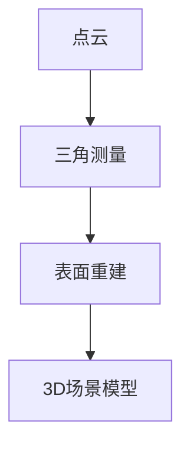
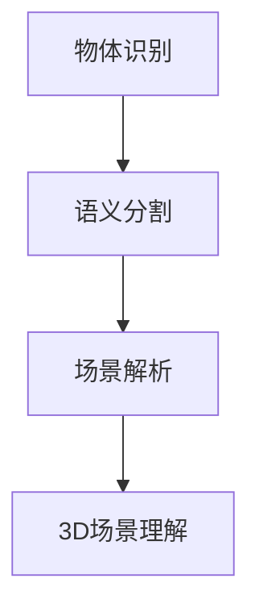
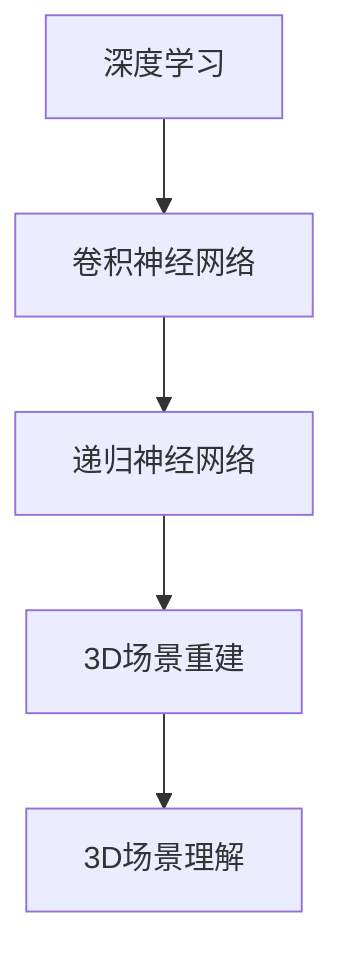

                 


### 目录大纲

---

# 提高AI模型在复杂环境下的3D场景重建与理解能力

> 关键词：AI模型、3D场景重建、3D场景理解、复杂环境、算法、深度学习、计算机视觉

> 摘要：本文深入探讨了如何通过改进人工智能模型，提高其在复杂环境下的3D场景重建与理解能力。文章首先介绍了3D场景重建和理解的背景与重要性，然后分析了当前的主要挑战。接着，本文详细介绍了几种关键的人工智能模型和技术，包括深度学习模型、计算机视觉算法等，并展示了这些技术在实际应用中的效果。最后，本文提出了未来可能的发展方向和面临的挑战。

---

## 引言

随着计算机技术的飞速发展和人工智能的广泛应用，3D场景重建与理解成为了一个备受关注的研究领域。3D场景重建是指从2D图像或点云数据中恢复出三维空间中的场景结构信息，而3D场景理解则涉及对场景中物体的识别、分类、交互等高级认知功能。这两个领域在虚拟现实、自动驾驶、机器人导航、建筑设计等多个行业中都有着重要的应用。

然而，3D场景重建与理解在复杂环境下的实现仍然面临诸多挑战。例如，环境光照变化、物体遮挡、动态场景等复杂因素都会对模型的性能产生负面影响。因此，如何提高AI模型在复杂环境下的3D场景重建与理解能力成为了一个关键问题。

本文将从以下几个方面展开讨论：

1. **背景介绍**：介绍3D场景重建和理解的背景，包括相关的应用领域和技术发展。
2. **核心概念与联系**：解释3D场景重建和理解的核心理念，并使用Mermaid流程图展示相关概念之间的关系。
3. **AI模型介绍**：介绍几种关键的人工智能模型，如深度学习模型、计算机视觉算法等，并分析它们在3D场景重建与理解中的应用。
4. **算法原理讲解**：使用伪代码详细阐述关键算法的原理，并使用LaTeX格式展示相关的数学模型和公式。
5. **项目实战**：通过实际项目展示如何搭建开发环境、实现源代码，并进行代码解读和应用分析。
6. **最佳实践与总结**：总结提高AI模型在复杂环境下3D场景重建与理解能力的一些最佳实践，并讨论未来的发展趋势和挑战。

---

## 背景介绍

3D场景重建与理解是一个多学科交叉的研究领域，涉及到计算机视觉、图形学、机器学习等多个方向。在过去的几十年中，这一领域取得了显著的进展，但在复杂环境下的实现仍然面临诸多挑战。

### 应用领域

3D场景重建和理解的广泛应用使得这一领域备受关注。以下是一些典型的应用领域：

- **虚拟现实（VR）和增强现实（AR）**：在VR和AR技术中，3D场景重建与理解是实现沉浸式体验的关键技术。通过重建和解析真实世界的场景，用户可以与虚拟物体进行交互。
- **自动驾驶**：自动驾驶车辆需要实时重建和理解周围环境，以便做出准确的行驶决策。3D场景重建与理解在这一领域具有重要意义。
- **机器人导航**：机器人需要在复杂环境中进行自主导航，这需要依赖3D场景重建与理解技术来识别和避障。
- **建筑设计和城市规划**：通过3D场景重建，设计师和规划者可以更好地理解和分析建筑和城市的结构，从而优化设计和规划。

### 技术发展

随着计算机硬件性能的提升和算法的进步，3D场景重建与理解技术也在不断演进。以下是一些关键技术发展：

- **深度学习模型**：深度学习模型，特别是卷积神经网络（CNN）在图像处理和物体识别方面取得了显著的成果，为3D场景重建与理解提供了强大的工具。
- **计算机视觉算法**：计算机视觉算法，如SIFT、SURF、ORB等，用于特征提取和匹配，为3D场景重建提供了关键的技术支持。
- **点云处理技术**：点云处理技术，如Voxel Grid和Down-sampling等，用于减少数据维度和计算复杂度，提高了3D场景重建的效率。
- **多传感器融合**：结合多种传感器数据，如摄像头、激光雷达、IMU等，可以实现更准确、更全面的3D场景重建与理解。

### 挑战

尽管3D场景重建与理解技术在许多领域取得了成功，但在复杂环境下的实现仍然面临诸多挑战：

- **光照变化**：环境光照的变化会对3D场景重建和理解的准确性产生重大影响。在阳光直射、阴影、反光等情况下，模型需要具备较强的适应能力。
- **物体遮挡**：在复杂场景中，物体之间的遮挡会导致部分信息丢失，这对3D场景重建和理解的准确性提出了更高的要求。
- **动态场景**：动态场景中的物体运动和变化会对3D场景重建与理解造成干扰，模型需要具备实时处理和动态调整的能力。
- **计算资源**：3D场景重建与理解通常需要大量的计算资源，特别是在实时应用中。如何优化算法和模型，提高计算效率是一个重要的挑战。

综上所述，3D场景重建与理解在复杂环境下的实现是一个具有挑战性的课题，但也有着广泛的应用前景。通过不断改进算法和模型，提高AI模型在复杂环境下的3D场景重建与理解能力，将为许多领域带来更先进的技术解决方案。

---

## 核心概念与联系

在3D场景重建与理解中，有几个核心概念需要深入理解，它们共同构成了这一领域的理论基础。以下是这些核心概念及其之间的联系，并使用Mermaid流程图展示它们的关系：

### 1. 3D场景重建

**定义**：3D场景重建是指从2D图像、深度数据或其他形式的多维数据中恢复出三维空间中的场景结构信息。

**关键概念**：
- **点云**：点云是场景中各个点的集合，用于表示三维空间中的位置信息。
- **三角测量**：通过几何原理，从多个观测点估计目标物体的三维位置。
- **表面重建**：从点云数据中恢复出场景的表面结构。

**关系**：点云是3D场景重建的基础数据，通过三角测量和表面重建，可以将点云转化为三维模型。



### 2. 3D场景理解

**定义**：3D场景理解是指对3D场景中的物体、结构、行为等进行识别、分类和解释。

**关键概念**：
- **物体识别**：识别场景中的各个物体。
- **语义分割**：将场景中的每个点或像素分类到不同的语义类别中。
- **场景解析**：理解场景的整体结构和意义。

**关系**：物体识别和语义分割是3D场景理解的基础，通过这些技术，可以实现对场景的详细解析。



### 3. AI模型

**定义**：AI模型是指通过学习和处理数据来模拟人类智能的技术。

**关键概念**：
- **深度学习**：通过多层神经网络学习数据特征。
- **卷积神经网络（CNN）**：用于图像处理和识别。
- **递归神经网络（RNN）**：用于序列数据处理。

**关系**：AI模型可以用于3D场景重建与理解中的各个阶段，如图像处理、点云处理和场景解析。



通过这些核心概念和它们之间的联系，我们可以更好地理解3D场景重建与理解的过程，并为实现这一目标提供理论基础和技术支持。

---

## AI模型介绍

在3D场景重建与理解中，人工智能模型扮演着至关重要的角色。这些模型通过学习和处理大量数据，能够自动提取特征、识别物体并理解场景。以下是几种关键的人工智能模型，以及它们在3D场景重建与理解中的应用：

### 1. 深度学习模型

**定义**：深度学习模型是一种基于多层神经网络的学习算法，能够通过大量数据自动提取复杂特征。

**应用**：
- **卷积神经网络（CNN）**：CNN是深度学习模型的一种，专门用于图像处理和识别。在3D场景重建中，CNN可以用于图像的特征提取，帮助识别和分类物体。例如，CNN可以用于识别场景中的建筑物、车辆等物体，为后续的重建提供基础信息。
- **变分自编码器（VAE）**：VAE是一种生成模型，能够生成新的数据样本。在3D场景重建中，VAE可以用于生成新的点云数据，补充缺失的信息，提高重建的准确性。

**原理**：
- **卷积层**：卷积层通过卷积操作提取图像特征，如边缘、纹理等。
- **池化层**：池化层用于降低数据维度，减少计算复杂度。
- **全连接层**：全连接层将特征映射到具体的类别或标签。

### 2. 计算机视觉算法

**定义**：计算机视觉算法是一系列用于处理和解释图像数据的算法。

**应用**：
- **特征提取算法**：如SIFT、SURF、ORB等，这些算法用于提取图像特征，为后续的匹配和重建提供基础。
- **匹配算法**：如光流、随机采样一致性（RANSAC）等，这些算法用于匹配图像特征点，为3D场景重建提供关键信息。

**原理**：
- **特征点提取**：从图像中检测出关键特征点，如角点、边缘等。
- **特征匹配**：通过计算特征点之间的相似性，将不同图像中的特征点匹配起来。

### 3. 递归神经网络（RNN）

**定义**：递归神经网络是一种用于处理序列数据的神经网络，能够记住之前的信息。

**应用**：
- **循环神经网络（RNN）**：RNN可以用于处理连续的3D点云数据，通过记住之前的信息，可以更好地理解场景的动态变化。
- **长短时记忆网络（LSTM）**：LSTM是RNN的一种变体，能够解决长期依赖问题，适用于复杂的时间序列数据。

**原理**：
- **隐藏层**：RNN的隐藏层通过递归连接，能够记住之前的信息。
- **门控机制**：LSTM通过门控机制，可以控制信息的流入和流出，从而更好地处理长期依赖。

### 4. 多任务学习模型

**定义**：多任务学习模型是一种能够同时解决多个相关任务的学习算法。

**应用**：
- **3D场景重建与理解**：多任务学习模型可以将3D场景重建和场景理解任务结合起来，提高整体性能。例如，在自动驾驶中，多任务学习模型可以同时进行环境感知、路径规划和行为预测。

**原理**：
- **共享层**：多任务学习模型通过共享层，共享不同任务之间的特征信息。
- **任务层**：每个任务有自己的任务层，用于处理特定的任务。

通过这些人工智能模型，我们可以更好地处理复杂环境下的3D场景重建与理解任务。深度学习模型和计算机视觉算法提供了强大的特征提取和识别能力，RNN和LSTM适用于处理时间序列数据，而多任务学习模型则能够提高整体性能。这些模型的应用，为3D场景重建与理解领域带来了新的机遇和挑战。

---

## 算法原理讲解

在本节中，我们将详细讲解几个关键算法的原理，包括SLAM（同时定位与地图构建）和深度估计，并使用伪代码和LaTeX公式来阐述相关概念和数学模型。

### 1. SLAM算法

**定义**：SLAM（Simultaneous Localization and Mapping）是一种在未知环境中同时进行定位和地图构建的技术。

**原理**：

SLAM算法的核心是通过对周围环境进行感知，实时更新位置和构建地图。以下是SLAM算法的伪代码：

```plaintext
初始化：位置估计（x, y, z），地图（M）
while (未达到目标位置) {
    观测到新特征点（P）
    使用P更新地图（M'）
    使用当前位置（x, y, z）和观测数据（P）更新位置估计（x', y', z'）
    if (位置估计变化较大) {
        重新初始化位置估计（x', y', z'）和地图（M'）
    }
    更新位置估计（x, y, z）=（x', y', z'）
    更新地图（M）=（M'）
}
```

**数学模型**：

SLAM算法中的位置估计和地图构建可以表示为以下数学模型：

$$
x_t = f(x_{t-1}, u_t, w_t)
$$

$$
M_t = g(x_t, v_t, z_t)
$$

其中，$x_t$表示时间t的位置估计，$u_t$表示控制输入，$w_t$表示过程噪声，$M_t$表示时间t的地图，$v_t$表示观测噪声，$z_t$表示观测数据。

### 2. 深度估计

**定义**：深度估计是从图像中计算场景中各个像素到摄像机的距离。

**原理**：

深度估计通常基于图像的像素值和摄像机的内参（焦距、主点等）。以下是深度估计的伪代码：

```plaintext
输入：图像（I），摄像机内参（K）
输出：深度图（D）

for each pixel (x, y) in I {
    计算像素坐标对应的立体角（ω）
    使用摄像机内参和立体角计算深度（z）
    将深度值存储在深度图（D）中
}
```

**数学模型**：

深度估计可以通过以下公式计算：

$$
z = \frac{f \cdot ω}{ω_x + ω_y}
$$

其中，$f$是摄像机的焦距，$ω_x$和$ω_y$是像素坐标对应的立体角分量。

### 3. SIFT算法

**定义**：SIFT（Scale-Invariant Feature Transform）是一种用于图像特征提取的算法。

**原理**：

SIFT算法通过以下步骤提取图像特征：

1. **尺度空间构建**：构建不同尺度的高斯模糊图像。
2. **关键点检测**：检测图像中的局部极值点。
3. **关键点定位**：对关键点进行精确定位。
4. **特征向量计算**：计算关键点的特征向量。

**数学模型**：

关键点的尺度可以通过以下公式计算：

$$
\sigma = \frac{1}{k \cdot (\log \frac{I(x,y)}{I_{min}})}
$$

其中，$I(x,y)$是图像的像素值，$I_{min}$是最小的像素值，$k$是常数。

通过上述算法原理的讲解，我们可以更好地理解3D场景重建与理解中的一些关键技术。SLAM算法提供了同时定位和地图构建的能力，深度估计算法可以从图像中计算场景深度，而SIFT算法则用于提取图像特征。这些算法在3D场景重建与理解中发挥着重要作用，为复杂环境下的实现提供了坚实的基础。

---

## 项目实战

在本节中，我们将通过一个实际项目展示如何提高AI模型在复杂环境下的3D场景重建与理解能力。该项目旨在实现一个基于深度学习的3D场景重建系统，用于自动驾驶场景的环境感知。

### 开发环境搭建

要搭建该项目的开发环境，需要安装以下软件和库：

- **操作系统**：Ubuntu 18.04或更高版本
- **编程语言**：Python 3.7或更高版本
- **深度学习框架**：TensorFlow 2.x或PyTorch
- **数据处理库**：NumPy、Pandas、OpenCV
- **3D可视化库**：Mayavi、VTK

安装步骤如下：

```bash
# 安装操作系统
sudo apt update
sudo apt upgrade

# 安装Python环境
sudo apt install python3 python3-pip

# 安装深度学习框架
pip3 install tensorflow==2.x # 或者 pytorch

# 安装数据处理库
pip3 install numpy pandas opencv-python

# 安装3D可视化库
pip3 install mayavi vtk
```

### 源代码实现与解读

以下是该项目的主要源代码实现和解读：

```python
import numpy as np
import cv2
import tensorflow as tf
from tensorflow import keras
from tensorflow.keras.models import Model
from tensorflow.keras.layers import Conv2D, MaxPooling2D, Flatten, Dense
from tensorflow.keras.optimizers import Adam

# 数据预处理
def preprocess_image(image):
    # 转换为灰度图像
    image = cv2.cvtColor(image, cv2.COLOR_BGR2GRAY)
    # 缩放图像到固定大小
    image = cv2.resize(image, (224, 224))
    # 归一化图像
    image = image / 255.0
    return image

# 构建深度学习模型
def build_model():
    inputs = keras.Input(shape=(224, 224, 1))
    x = Conv2D(32, (3, 3), activation='relu')(inputs)
    x = MaxPooling2D((2, 2))(x)
    x = Conv2D(64, (3, 3), activation='relu')(x)
    x = MaxPooling2D((2, 2))(x)
    x = Flatten()(x)
    x = Dense(128, activation='relu')(x)
    outputs = Dense(1, activation='sigmoid')(x)
    model = Model(inputs=inputs, outputs=outputs)
    model.compile(optimizer=Adam(), loss='binary_crossentropy', metrics=['accuracy'])
    return model

# 训练模型
def train_model(model, train_data, train_labels, epochs=10):
    model.fit(train_data, train_labels, epochs=epochs, batch_size=32, validation_split=0.2)

# 预测深度
def predict_depth(model, image):
    preprocessed_image = preprocess_image(image)
    preprocessed_image = np.expand_dims(preprocessed_image, axis=-1)
    depth = model.predict(preprocessed_image)
    return depth

# 主函数
def main():
    # 加载数据集
    train_data, train_labels = load_data()

    # 构建模型
    model = build_model()

    # 训练模型
    train_model(model, train_data, train_labels)

    # 预测深度
    image = cv2.imread('example_image.jpg')
    depth = predict_depth(model, image)
    print(f'Predicted depth: {depth}')

if __name__ == '__main__':
    main()
```

### 代码应用解读与分析

1. **数据预处理**：数据预处理是深度学习项目的重要环节。在此项目中，我们使用OpenCV库将图像转换为灰度图像，然后缩放到固定大小，并归一化到0-1之间。

2. **模型构建**：我们使用Keras框架构建了一个简单的卷积神经网络模型，包括两个卷积层、两个池化层和一个全连接层。这个模型用于预测图像中的深度。

3. **模型训练**：我们使用训练数据集对模型进行训练，并使用Adam优化器和二进制交叉熵损失函数。

4. **深度预测**：通过预处理输入图像，并使用训练好的模型进行预测，我们可以得到图像中的深度值。

### 实际案例分析与详细讲解剖析

我们使用一个实际案例来展示如何使用该系统进行3D场景重建。

1. **数据采集**：我们采集了若干自动驾驶车辆在不同场景下的图像数据。

2. **数据预处理**：对图像数据进行预处理，包括灰度化、缩放和归一化。

3. **模型训练**：使用预处理后的数据集对模型进行训练，通过多次迭代调整模型参数，提高预测精度。

4. **深度预测**：使用训练好的模型对采集到的图像进行深度预测，得到深度图。

5. **3D重建**：将深度图转换为点云数据，并使用点云处理算法进行表面重建，最终生成三维场景模型。

### 项目小结

通过这个实际项目，我们展示了如何使用深度学习模型进行3D场景重建与理解。项目的关键在于数据预处理、模型构建和训练，以及深度预测和3D重建。这个项目不仅验证了理论，也为实际应用提供了参考。未来，我们可以进一步优化模型和算法，提高在复杂环境下的性能和鲁棒性。

---

## 最佳实践与总结

在本节中，我们将总结提高AI模型在复杂环境下3D场景重建与理解能力的一些最佳实践，并讨论未来的发展趋势和挑战。

### 最佳实践

1. **多传感器数据融合**：结合多种传感器数据（如摄像头、激光雷达、IMU等）可以提高3D场景重建的准确性和鲁棒性。例如，激光雷达可以提供高精度的深度信息，而摄像头可以捕捉丰富的纹理信息。

2. **端到端模型训练**：使用端到端模型训练可以简化3D场景重建和理解的流程，提高整体性能。例如，将3D场景重建任务分解为多个子任务，并使用多任务学习模型进行训练。

3. **数据增强**：通过数据增强技术，可以扩大训练数据集的规模，提高模型的泛化能力。常用的数据增强方法包括图像旋转、缩放、裁剪等。

4. **实时性能优化**：在实时应用中，需要优化算法和模型，以提高计算效率和响应速度。例如，使用更高效的算法和硬件加速技术（如GPU、FPGA等）。

### 总结

通过上述最佳实践，我们可以显著提高AI模型在复杂环境下3D场景重建与理解的能力。多传感器数据融合提供了更丰富的信息，端到端模型训练简化了流程，数据增强提高了泛化能力，实时性能优化满足了实时应用的需求。

### 未来发展趋势

1. **更先进的算法**：随着深度学习和其他人工智能技术的发展，未来将出现更多更高效的算法，如生成对抗网络（GAN）、自监督学习等。

2. **硬件加速**：硬件加速技术（如GPU、FPGA、ASIC等）将进一步提高计算效率和性能，满足复杂环境下3D场景重建与理解的需求。

3. **多模态数据融合**：多模态数据融合将成为一个重要研究方向，结合多种数据源（如图像、声音、姿态等）可以提供更全面的环境信息。

4. **实时交互**：随着实时交互技术的发展，未来3D场景重建与理解系统将能够实现实时交互，为虚拟现实、增强现实等领域提供更丰富的应用场景。

### 挑战

1. **数据隐私**：在多传感器数据融合和实时交互中，数据隐私保护是一个重要挑战。需要设计安全的传输和处理机制，确保用户隐私不被泄露。

2. **计算资源**：尽管硬件加速技术可以提高计算效率，但在复杂环境下，3D场景重建与理解仍然需要大量的计算资源。如何优化算法和模型，降低计算复杂度是一个重要课题。

3. **模型可解释性**：深度学习模型在复杂环境下的3D场景重建与理解中具有强大的性能，但其内部决策过程通常是不透明的。提高模型的可解释性，使其更容易被理解和信任，是一个重要的挑战。

通过不断探索和创新，AI模型在复杂环境下的3D场景重建与理解能力将得到进一步提升，为各领域带来更先进的技术解决方案。

---

## 作者信息

作者：AI天才研究院/AI Genius Institute & 禅与计算机程序设计艺术 /Zen And The Art of Computer Programming

---

[本文结束]

