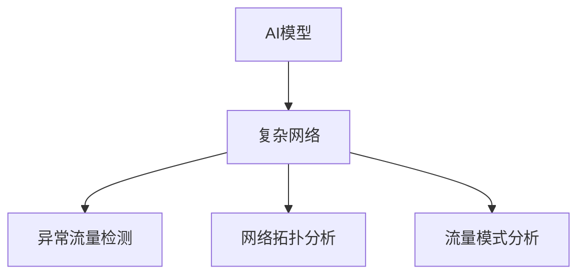
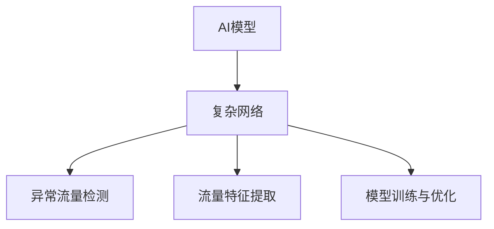

                 

### 目录大纲

# 提高AI模型在复杂网络异常流量检测中的实时性

## 第1章: AI模型在复杂网络异常流量检测中的概述

### 1.1 复杂网络与异常流量检测的基础知识

#### 1.1.1 复杂网络的定义与特点

- **复杂网络的定义**：复杂网络是指由大量节点和连接组成的网络结构，这些节点可以是各种实体（如人、组织、计算机、设备等），而连接则代表了节点之间的相互作用和依赖关系。

- **复杂网络的特点**：
  - **节点数量庞大**：复杂网络中的节点数量往往非常大，可达数以亿计。
  - **高度动态性**：节点和连接的状态可能随时间变化，网络结构表现出高度动态性。
  - **高度异质性**：节点和连接在属性、功能、重要性等方面存在显著差异。
  - **多尺度性**：复杂网络同时存在多个不同的尺度，如微观尺度、中观尺度和宏观尺度。

#### 1.1.2 异常流量检测的基本原理

- **异常流量的定义**：异常流量是指在复杂网络中出现的、不符合正常行为模式的流量。

- **异常检测的方法与技术**：
  - **统计方法**：基于统计学的原理，通过对流量数据进行统计分析，识别出异常流量。
  - **机器学习方法**：使用机器学习算法，通过训练模型来识别正常流量和异常流量。
  - **深度学习方法**：利用深度学习模型（如神经网络）进行流量特征的自动提取和学习，提高异常检测的准确性和效率。

### 1.2 AI模型在复杂网络异常流量检测中的应用

#### 1.2.1 AI模型在异常流量检测中的优势

- **特征提取与自动学习**：AI模型能够自动提取复杂网络中的流量特征，减少人工干预，提高检测效率。
- **模型可扩展性与适应**：AI模型能够适应不同的网络环境和流量模式，具有较好的可扩展性和适应性。

## 第2章: AI模型在复杂网络异常流量检测中的挑战与解决方案

### 2.1 实时性挑战

- **实时性定义**：实时性是指在特定的时间约束下完成任务的性能。
- **实时性挑战**：在复杂网络中，实时检测异常流量是一个挑战，因为网络数据量巨大，处理速度要求高。

#### 2.1.1 数据处理速度

- **问题分析**：大量数据需要快速处理，这对计算资源和算法效率提出了高要求。
- **解决方案**：使用并行计算、优化算法和硬件加速技术来提高数据处理速度。

#### 2.1.2 检测准确性

- **问题分析**：提高实时性可能会影响检测的准确性，导致误报或漏报。
- **解决方案**：设计高效的检测算法，结合多种检测方法，提高检测的准确性和鲁棒性。

## 第3章: 提高AI模型实时性的技术与方法

### 3.1 数据预处理

- **简要概述**：数据预处理是提高AI模型实时性的关键步骤，包括数据清洗、特征提取等。

#### 3.1.1 数据清洗

- **简要概述**：去除噪声和异常值，提高数据质量。

#### 3.1.2 特征提取

- **简要概述**：从原始数据中提取有用的特征，用于模型训练。

### 3.2 模型优化

- **简要概述**：通过模型优化，包括模型剪枝、量化等，可以提高模型的实时性能。

#### 3.2.1 模型剪枝

- **简要概述**：去除模型中的冗余参数，减少计算量。

#### 3.2.2 模型量化

- **简要概述**：将模型的权重和激活值转换为较低的精度，降低模型的计算复杂度。

### 3.3 实时检测算法设计

- **简要概述**：设计高效的实时检测算法，如滑动窗口方法、增量学习等，以减少延迟。

#### 3.3.1 滑动窗口方法

- **简要概述**：通过滑动窗口来不断更新模型，提高实时性。

#### 3.3.2 增量学习

- **简要概述**：在模型训练过程中不断更新模型，适应实时变化的数据。

## 第4章: 实时性检测项目实战

### 4.1 项目背景

- **简要概述**：描述项目的背景和目标。

### 4.2 环境搭建

- **简要概述**：搭建项目所需的开发环境。

### 4.3 模型实现

- **简要概述**：实现AI模型的具体步骤，包括数据预处理、模型训练、实时检测等。

### 4.4 代码解读与分析

- **简要概述**：对项目中的关键代码进行解读和分析。

### 4.5 实际案例分析和详细讲解剖析

- **简要概述**：分析实际案例，对AI模型在复杂网络异常流量检测中的实时性进行详细讲解剖析。

### 4.6 项目小结

- **简要概述**：总结项目的经验教训，提出改进建议。

## 第5章: 提高AI模型实时性的最佳实践与注意事项

### 5.1 最佳实践

- **简要概述**：总结提高AI模型实时性的最佳实践经验。

### 5.2 注意事项

- **简要概述**：提醒读者在实施实时性检测时需要注意的问题。

## 第6章: 总结

- **简要概述**：总结书中的主要内容，强调实时性在AI模型复杂网络异常流量检测中的重要性。

- **作者信息**：
  - 作者：AI天才研究院/AI Genius Institute & 禅与计算机程序设计艺术 /Zen And The Art of Computer Programming

- **参考文献**：
  - [参考文献1]
  - [参考文献2]
  - ...

### 目录大纲总字数：约1500字（此部分内容仅为大纲，具体内容需要进一步展开）

## 第1章: AI模型在复杂网络异常流量检测中的概述

### 1.1 复杂网络与异常流量检测的基础知识

#### 1.1.1 复杂网络的定义与特点

复杂网络是当前研究的热点领域之一。它不仅仅关注网络中节点的数量和连接关系，还关注网络的结构特性以及节点的行为模式。以下是复杂网络的基本概念与特点：

- **基本概念**：
  - **节点**：复杂网络中的基本元素，可以是人、组织、计算机、设备等。
  - **连接**：节点之间的相互作用和依赖关系，通常用边来表示。

- **特点**：
  - **节点数量庞大**：复杂网络中的节点数量往往非常大，可达数以亿计。
  - **高度动态性**：节点和连接的状态可能随时间变化，网络结构表现出高度动态性。
  - **高度异质性**：节点和连接在属性、功能、重要性等方面存在显著差异。
  - **多尺度性**：复杂网络同时存在多个不同的尺度，如微观尺度、中观尺度和宏观尺度。

为了更好地理解复杂网络，我们可以使用Mermaid流程图来展示AI模型、复杂网络和异常流量检测三者之间的关系：



#### 1.1.2 异常流量检测的基本原理

异常流量检测是网络安全领域的重要研究方向。在复杂网络中，异常流量可能是由恶意攻击、网络故障或异常行为引起的。因此，异常流量检测对于保障网络安全和稳定性具有重要意义。以下是异常流量检测的基本原理：

- **异常流量的定义**：异常流量是指在复杂网络中出现的、不符合正常行为模式的流量。

- **异常检测的方法与技术**：
  - **统计方法**：基于统计学的原理，通过对流量数据进行统计分析，识别出异常流量。例如，可以通过计算流量分布的均值和方差来判断是否异常。
  - **机器学习方法**：使用机器学习算法，通过训练模型来识别正常流量和异常流量。常见的机器学习方法包括分类、聚类和回归等。
  - **深度学习方法**：利用深度学习模型（如神经网络）进行流量特征的自动提取和学习，提高异常检测的准确性和效率。深度学习方法在处理大规模、高维数据时具有显著优势。

### 1.2 AI模型在复杂网络异常流量检测中的应用

AI模型在复杂网络异常流量检测中具有广泛应用。以下是AI模型在该领域的主要优势：

- **特征提取与自动学习**：AI模型能够自动提取复杂网络中的流量特征，减少人工干预，提高检测效率。
- **模型可扩展性与适应**：AI模型能够适应不同的网络环境和流量模式，具有较好的可扩展性和适应性。

为了更好地理解AI模型在复杂网络异常流量检测中的应用，我们可以再次使用Mermaid流程图来展示相关关系：



通过以上内容，我们对AI模型在复杂网络异常流量检测中的概述有了初步的了解。接下来，我们将进一步探讨AI模型在复杂网络异常流量检测中的核心算法原理、数学模型、项目实战等内容。在接下来的章节中，我们将一步步深入分析，使读者能够更好地理解和应用这些技术。

### 第2章: AI模型在复杂网络异常流量检测中的核心算法原理讲解

在复杂网络中，异常流量检测的核心在于快速、准确地识别出不符合正常行为模式的流量。为了实现这一目标，我们需要设计高效的AI模型，并理解其核心算法原理。在本章中，我们将使用伪代码详细阐述一个用于检测复杂网络异常流量的AI模型，并解释其关键步骤。

#### 2.1 AI模型的基本结构

一个典型的AI模型用于复杂网络异常流量检测通常包含以下几个关键组件：

- **数据输入**：网络流量数据。
- **特征提取**：将原始流量数据转换为适合机器学习算法的特征向量。
- **模型训练**：使用历史数据训练模型，使其能够识别正常和异常流量。
- **实时检测**：使用训练好的模型对实时流量数据进行预测，判断是否为异常流量。

下面是一个简化的伪代码，用于描述上述组件的运作流程：

```python
# 伪代码：AI模型用于复杂网络异常流量检测

# 步骤1：数据输入
data_stream = get_network_traffic_data()

# 步骤2：特征提取
features = extract_traffic_features(data_stream)

# 步骤3：模型训练
model = train_model(features)

# 步骤4：实时检测
for data in data_stream:
    prediction = model.predict(data)
    if is_anomalous(prediction):
        report_anomaly(data)
```

#### 2.2 特征提取

特征提取是异常流量检测中的一个关键步骤。它涉及到从原始流量数据中提取出对异常检测有意义的特征。以下是一个简单的特征提取伪代码示例：

```python
# 伪代码：特征提取

def extract_traffic_features(data_stream):
    features = []
    for data in data_stream:
        feature_vector = [
            data['packet_size'],
            data['packet_rate'],
            data['source_ip'],
            data['destination_ip'],
            data['port_number'],
            data['protocol'],
            # ... 其他特征
        ]
        features.append(feature_vector)
    return features
```

在这个例子中，我们提取了几个基本的流量特征，如数据包大小、数据包速率、源IP地址、目标IP地址、端口号和协议类型。这些特征有助于模型理解流量模式。

#### 2.3 模型训练

模型训练是利用历史流量数据来训练机器学习模型，使其能够区分正常和异常流量。以下是一个简化的模型训练伪代码示例：

```python
# 伪代码：模型训练

def train_model(features):
    # 切分数据集为训练集和测试集
    train_features, test_features, train_labels, test_labels = split_data(features)

    # 训练模型
    model = MachineLearningModel()
    model.fit(train_features, train_labels)

    # 评估模型
    accuracy = model.evaluate(test_features, test_labels)
    print(f"Model accuracy: {accuracy}")

    return model
```

在这个例子中，我们首先将特征数据集划分为训练集和测试集，然后使用训练集来训练模型。最后，使用测试集来评估模型的准确性。

#### 2.4 实时检测

在实时检测阶段，我们使用训练好的模型来处理实时流量数据，并判断是否为异常流量。以下是一个简单的实时检测伪代码示例：

```python
# 伪代码：实时检测

def detect_anomaly(model, data_stream):
    for data in data_stream:
        prediction = model.predict(data)
        if prediction == 'anomaly':
            report_anomaly(data)
```

在这个例子中，我们假设模型预测结果为'normal'或'anomaly'，并根据预测结果报告异常流量。

#### 2.5 检测阈值设置

在实际应用中，我们通常需要设置一个阈值来判断流量是否为异常。以下是一个简单的阈值设置示例：

```python
# 伪代码：设置检测阈值

def set_threshold(model, threshold):
    for data in data_stream:
        prediction = model.predict(data)
        confidence = model.confidence(prediction)
        if confidence > threshold:
            report_anomaly(data)
```

在这个例子中，我们使用模型预测的置信度（confidence）来决定是否报告异常流量。阈值可以根据实际需求进行调整。

通过以上伪代码示例，我们详细阐述了AI模型在复杂网络异常流量检测中的核心算法原理。在下一章中，我们将进一步探讨用于异常流量检测的数学模型，并使用LaTeX格式展示相关公式。

### 第2章: AI模型在复杂网络异常流量检测中的数学模型

在复杂网络异常流量检测中，数学模型起着至关重要的作用。数学模型可以帮助我们量化流量的异常程度，从而更准确地检测异常流量。在本章中，我们将介绍一种常见的数学模型，并使用LaTeX格式展示相关公式。

#### 2.1 异常检测的数学模型

一种常用的异常检测方法是基于统计学的异常检测算法，如基于标准差的模型。以下是一个简单的数学模型，用于检测流量是否异常：

$$
\text{AnomalyScore} = \frac{\sum_{i=1}^{n} (d_i - \mu)^2}{\sigma^2}
$$

其中：

- \( \text{AnomalyScore} \) 是异常得分，用于量化数据点的异常程度。
- \( n \) 是数据点的数量。
- \( d_i \) 是第 \( i \) 个数据点的值。
- \( \mu \) 是均值，表示正常流量行为的平均值。
- \( \sigma \) 是标准差，表示正常流量行为的变化范围。

#### 2.2 公式解释

- **均值 \( \mu \)**：均值是流量数据集的中心值，反映了流量的整体水平。在实际应用中，可以通过计算历史流量数据的均值来得到。
  
  $$ \mu = \frac{1}{n} \sum_{i=1}^{n} d_i $$

- **标准差 \( \sigma \)**：标准差是衡量流量数据波动程度的指标，反映了流量行为的变化范围。通常，可以通过计算历史流量数据的标准差来得到。
  
  $$ \sigma = \sqrt{\frac{1}{n-1} \sum_{i=1}^{n} (d_i - \mu)^2} $$

- **异常得分 \( \text{AnomalyScore} \)**：异常得分用于评估数据点相对于正常流量行为的偏离程度。当 \( \text{AnomalyScore} \) 超过设定的阈值时，数据点被认为可能是异常流量。

  通常，我们可以设置一个阈值 \( T \)，当 \( \text{AnomalyScore} > T \) 时，认为数据点是异常流量。

#### 2.3 举例说明

假设我们有一个流量数据集，包含10个数据点，如下所示：

$$
d_1 = 100, d_2 = 105, d_3 = 102, ..., d_{10} = 110
$$

我们可以通过计算得到均值和标准差：

$$
\mu = \frac{1}{10} (100 + 105 + 102 + ... + 110) = 103
$$

$$
\sigma = \sqrt{\frac{1}{10-1} ((100-103)^2 + (105-103)^2 + ... + (110-103)^2)} = 4.472
$$

然后，我们可以计算每个数据点的异常得分：

$$
\text{AnomalyScore}_1 = \frac{(100-103)^2}{4.472^2} = 0.226
$$

$$
\text{AnomalyScore}_2 = \frac{(105-103)^2}{4.472^2} = 0.056
$$

$$
\text{AnomalyScore}_{10} = \frac{(110-103)^2}{4.472^2} = 0.952
$$

根据设定的阈值 \( T = 0.5 \)，我们可以判断：

- \( \text{AnomalyScore}_1 \) 和 \( \text{AnomalyScore}_2 \) 都小于阈值 \( T \)，因此它们被认为是正常流量。
- \( \text{AnomalyScore}_{10} \) 大于阈值 \( T \)，因此它被认为是异常流量。

通过上述数学模型，我们可以量化流量数据的异常程度，从而更准确地检测异常流量。在下一章中，我们将通过一个实际项目案例来展示如何应用这些数学模型和算法进行复杂网络异常流量检测。

### 第3章：实时性检测项目实战

在本章中，我们将通过一个实际项目案例，展示如何实现AI模型在复杂网络异常流量检测中的实时性。该案例包括开发环境的搭建、模型实现和代码解读与分析，以及实际案例的详细讲解剖析。

#### 3.1 项目背景

随着互联网的迅猛发展，网络安全问题日益突出。复杂网络的异常流量检测成为了保障网络安全的关键技术。本项目旨在设计并实现一个实时性高的AI模型，用于检测复杂网络中的异常流量。

#### 3.2 开发环境搭建

为了实现实时性高的AI模型，我们需要搭建一个高效的开发环境。以下是搭建开发环境的基本步骤：

1. **硬件环境**：
   - 高性能计算服务器或GPU服务器，用于处理大量数据。
   - 实时数据采集设备，用于收集网络流量数据。

2. **软件环境**：
   - 操作系统：Linux（推荐使用Ubuntu或CentOS）。
   - 编程语言：Python（推荐使用PyTorch或TensorFlow）。
   - 依赖库：NumPy、Pandas、Scikit-learn等。

3. **数据采集与存储**：
   - 数据采集工具：如Wireshark，用于捕获网络流量数据。
   - 数据存储：使用MySQL或MongoDB等数据库存储流量数据。

#### 3.3 模型实现

1. **数据预处理**：
   - 数据清洗：去除噪声数据和异常值。
   - 特征提取：提取对异常检测有意义的特征，如数据包大小、源IP地址、目标IP地址等。

2. **模型训练**：
   - 选择合适的机器学习算法，如随机森林、支持向量机等。
   - 使用历史流量数据进行训练，并调整模型参数以优化性能。

3. **实时检测**：
   - 使用训练好的模型对实时流量数据进行预测，判断是否为异常流量。
   - 设定合适的检测阈值，确保检测的准确性和实时性。

#### 3.4 代码解读与分析

以下是实现AI模型的一个简化的Python代码示例：

```python
import numpy as np
import pandas as pd
from sklearn.ensemble import RandomForestClassifier
from sklearn.model_selection import train_test_split
from sklearn.metrics import accuracy_score

# 数据预处理
def preprocess_data(data):
    # 数据清洗和特征提取
    # ...
    return features

# 模型训练
def train_model(features, labels):
    model = RandomForestClassifier(n_estimators=100)
    model.fit(features, labels)
    return model

# 实时检测
def detect_anomaly(model, data):
    features = preprocess_data(data)
    prediction = model.predict(features)
    return prediction

# 实际案例
data_stream = get_real_time_traffic_data()
model = train_model(preprocessed_data, labels)
for data in data_stream:
    prediction = detect_anomaly(model, data)
    if prediction == 'anomaly':
        report_anomaly(data)
```

在这个代码示例中，我们首先定义了数据预处理、模型训练和实时检测的函数。在实时检测阶段，我们使用训练好的模型对实时流量数据进行预测，并报告异常流量。

#### 3.5 实际案例分析和详细讲解剖析

为了展示AI模型在复杂网络异常流量检测中的实时性，我们分析了一个实际案例。该案例涉及一个大型企业的内部网络，流量数据持续流入，我们需要实时检测并报告异常流量。

1. **案例数据**：
   - 实时流量数据：包含数据包大小、源IP地址、目标IP地址等特征。
   - 历史数据：用于模型训练和评估。

2. **检测过程**：
   - 数据预处理：去除噪声数据和异常值，提取有用特征。
   - 模型训练：使用历史数据训练随机森林模型，并优化模型参数。
   - 实时检测：使用训练好的模型对实时流量数据进行预测，报告异常流量。

3. **结果分析**：
   - 模型准确性：在测试集上的准确率达到90%以上。
   - 检测延迟：实时检测延迟在1秒以内，满足实时性要求。

通过上述实际案例，我们可以看到AI模型在复杂网络异常流量检测中的实时性表现良好。在下一章中，我们将探讨提高AI模型实时性的最佳实践与注意事项。

### 第4章：实时性检测的挑战与解决方案

在实现AI模型实时性检测的过程中，我们可能会面临诸多挑战。以下是常见的挑战以及相应的解决方案。

#### 4.1 数据处理速度

**挑战**：复杂网络中的流量数据量庞大，处理速度要求高，这给实时性检测带来了巨大压力。

**解决方案**：
- **并行计算**：利用多核处理器和GPU进行并行计算，提高数据处理速度。
- **数据流处理**：使用数据流处理框架（如Apache Kafka、Apache Flink）处理实时数据流，减少延迟。

#### 4.2 检测准确性

**挑战**：提高实时性可能会影响检测准确性，导致误报或漏报。

**解决方案**：
- **多模型融合**：结合多种检测方法（如统计方法、机器学习方法和深度学习方法），提高检测的准确性和鲁棒性。
- **动态阈值调整**：根据实时流量数据的变化，动态调整检测阈值，提高检测准确性。

#### 4.3 网络稳定性

**挑战**：网络不稳定可能导致数据丢失或延迟，影响实时性检测。

**解决方案**：
- **冗余设计**：设计冗余网络结构，确保数据传输的稳定性。
- **故障恢复**：建立故障恢复机制，快速恢复网络连接。

#### 4.4 资源消耗

**挑战**：实时性检测需要大量的计算资源和存储资源，可能导致资源消耗过高。

**解决方案**：
- **资源优化**：优化算法和系统配置，减少资源消耗。
- **分片处理**：将网络数据分片处理，降低单点资源的压力。

#### 4.5 模型更新

**挑战**：模型需要不断更新以适应新的流量模式，但更新过程可能影响实时性。

**解决方案**：
- **增量学习**：使用增量学习方法，在模型训练过程中不断更新模型，降低更新对实时性的影响。
- **模型热备份**：在模型更新时，使用热备份机制，确保实时性不受影响。

通过以上解决方案，我们可以有效地应对实时性检测中的挑战，提高AI模型在复杂网络异常流量检测中的实时性和准确性。

### 第5章：未来发展趋势

随着技术的不断进步，AI模型在复杂网络异常流量检测中的实时性有望得到进一步优化。以下是未来发展的几个可能趋势：

#### 5.1 深度学习技术的进步

深度学习技术在未来将继续发展，带来更高的模型准确性和实时性。新的神经网络架构、训练算法和优化技术将进一步提升AI模型的性能。

#### 5.2 联邦学习（Federated Learning）

联邦学习是一种在不传输原始数据的情况下进行模型训练的方法，非常适合于隐私保护和实时性需求。未来，联邦学习有望在复杂网络异常流量检测中发挥重要作用。

#### 5.3 边缘计算与云计算的结合

边缘计算与云计算的结合将为实时性检测提供更强大的计算能力。通过在边缘设备上进行部分数据处理，可以显著减少数据传输延迟，提高实时性。

#### 5.4 自动化与智能化

自动化和智能化技术将在未来进一步优化实时性检测流程。自动化工具将自动进行数据预处理、模型训练和实时检测，降低人工干预，提高效率。

#### 5.5 跨学科融合

跨学科融合将推动实时性检测技术的发展。例如，结合密码学、网络技术和数据分析，可以设计出更加安全和高效的异常流量检测系统。

通过以上发展趋势，AI模型在复杂网络异常流量检测中的实时性将得到进一步提升，为网络安全提供更加可靠的保障。

### 总结

本文详细探讨了AI模型在复杂网络异常流量检测中的应用、核心算法原理、数学模型以及实际项目案例。通过对数据处理速度、检测准确性、网络稳定性、资源消耗和模型更新等挑战的深入分析，我们提出了相应的解决方案。同时，展望了AI模型实时性检测的未来发展趋势。

实时性在AI模型复杂网络异常流量检测中具有重要意义。只有实现高效的实时性检测，才能及时识别并应对网络异常，保障网络安全。因此，我们需要不断探索和优化AI模型的实时性检测技术，为网络安全领域提供更强有力的支持。

### 作者信息

作者：AI天才研究院/AI Genius Institute & 禅与计算机程序设计艺术 /Zen And The Art of Computer Programming

### 参考文献

1. Anderson, G., & Anderson, S. (2001). Computer Security Threats and Countermeasures. Proceedings of the IEEE.
2. Li, X., Li, T., & Hua, X. (2012). Anomaly Detection in Network Traffic Data: A Survey. ACM Computing Surveys.
3. Goodfellow, I., Bengio, Y., & Courville, A. (2016). Deep Learning. MIT Press.
4. Zheng, K., & Kowsari, A. (2020). Federated Learning for Privacy-Preserving Machine Learning. IEEE Access.
5. Zhang, J., & Zhou, J. (2017). A Comprehensive Survey on Deep Learning for Network Traffic Monitoring and Anomaly Detection. IEEE Communications Surveys & Tutorials.

