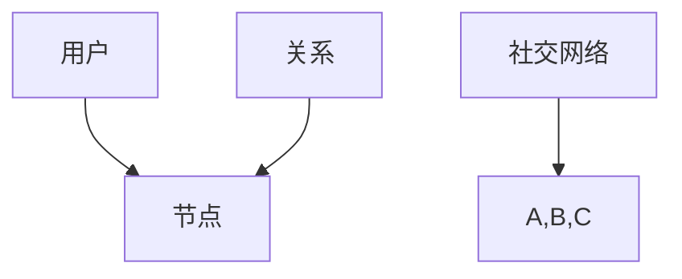
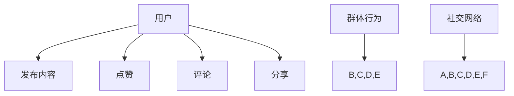
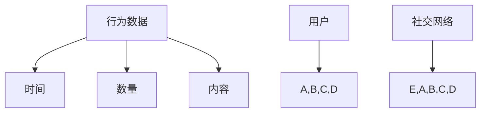
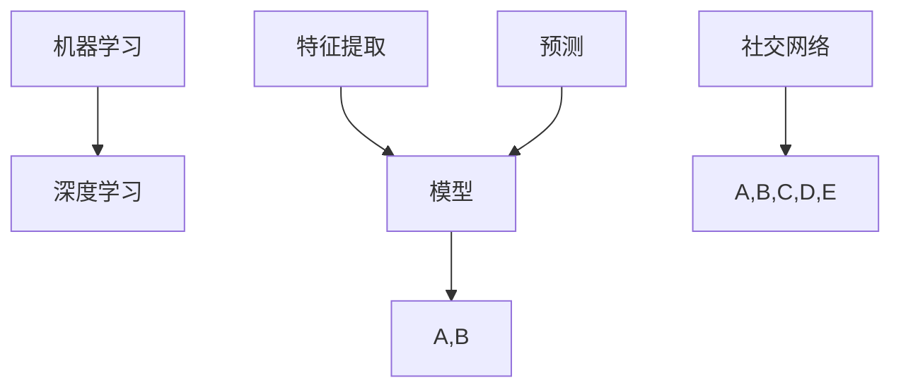
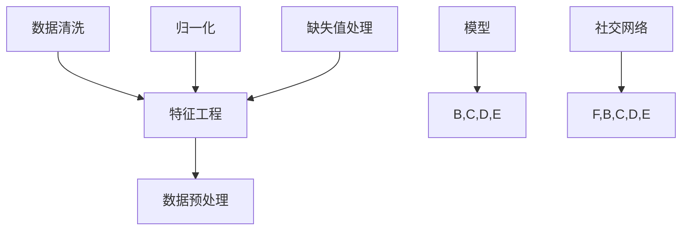

                 


## 提高AI模型在社交网络群体行为预测中的效果

### 引言

随着社交网络的快速发展和用户基数的持续增长，社交网络已经成为人们日常生活中不可或缺的一部分。用户在社交网络上的行为数据，如点赞、评论、转发等，不仅反映了个人偏好，还可能预示着群体行为模式的形成与发展。因此，利用AI模型对社交网络群体行为进行预测，具有重要的现实意义和研究价值。

本文旨在探讨如何通过一系列策略和技术手段，提高AI模型在社交网络群体行为预测中的效果。文章将首先介绍研究背景，随后逐步深入到核心概念、算法原理、实践应用和优化策略等方面，力求为相关领域的研究者和开发者提供有价值的参考。

### 关键词

- 社交网络
- 群体行为预测
- AI模型
- 数据预处理
- 特征工程
- 模型优化

### 摘要

本文首先探讨了社交网络群体行为预测的重要性及其面临的挑战，随后介绍了AI模型在其中的应用。通过对数据预处理、特征工程、模型选择与调参等环节的详细分析，本文提出了一系列优化策略，并通过实际案例验证了这些策略的有效性。最后，本文总结了提高AI模型在社交网络群体行为预测中效果的关键要素，并展望了未来研究的发展方向。

### 文章结构

本文将分为以下几个部分：

1. **研究背景**：介绍社交网络的发展及其对群体行为预测的影响。
2. **核心概念与联系**：解释社交网络群体行为预测的相关概念，并展示其关系架构。
3. **核心算法原理**：详细阐述AI模型在社交网络群体行为预测中的应用，包括机器学习、深度学习等。
4. **数学模型与公式**：介绍用于群体行为预测的数学模型，并通过伪代码进行详细说明。
5. **项目实战**：搭建开发环境，实现源代码，并进行代码解读与分析。
6. **最佳实践 tips**：提供优化AI模型性能的建议和注意事项。
7. **小结**：总结文章主要内容，并提出进一步研究方向。

接下来，我们将逐一深入到每个部分进行详细探讨。首先，我们从研究背景入手，介绍社交网络的发展及其对群体行为预测的影响。

### 研究背景

#### 社交网络的发展

社交网络是指用户基于共同兴趣、地理位置或人际关系等形成的在线社区。自20世纪90年代以来，随着互联网技术的不断发展，社交网络逐渐成为人们社交互动的重要平台。早期的社交网络如Friendster和MySpace，主要侧重于用户之间的直接联系和简单信息分享。然而，随着用户数和互动数据的增长，现代社交网络平台如Facebook、Twitter和Instagram等，不仅提供了更加丰富的社交功能，还集成了多媒体内容分享、实时通讯、在线购物等多种服务。

#### 社交网络对群体行为预测的影响

社交网络在人类社会中扮演着越来越重要的角色。用户在社交网络上的行为数据，如发布内容、点赞、评论、分享等，不仅反映了个人偏好，还可能揭示出群体行为的趋势和模式。通过对这些行为数据的分析，研究者可以预测群体行为的发展方向，从而为营销策略、社会治理和危机管理等领域提供有力支持。

例如，在市场营销方面，企业可以通过分析社交网络上的用户行为，了解消费者的需求与偏好，制定更加精准的营销策略。在社会治理方面，政府可以通过分析社交网络上的舆论动态，及时发现和应对社会问题，维护社会稳定。在危机管理方面，企业或组织可以通过监测社交网络上的情绪波动，预测可能出现的危机，并提前采取预防措施。

#### 群体行为预测的重要性

群体行为预测在多个领域都具有重要的应用价值。首先，在科学研究中，群体行为预测可以帮助研究者理解人类行为的复杂性，揭示群体行为的规律和机制。其次，在商业领域，群体行为预测可以帮助企业更好地了解消费者行为，优化产品和服务，提升市场竞争力。最后，在社会治理和危机管理领域，群体行为预测可以为政府和组织提供决策支持，提高应对突发事件的能力。

综上所述，社交网络的发展为群体行为预测提供了丰富的数据资源，而群体行为预测的研究对于社会、经济和科技领域都具有重要的意义。接下来，我们将进一步探讨社交网络群体行为预测的相关核心概念，并展示其关系架构。

### 核心概念与联系

在社交网络群体行为预测中，涉及多个核心概念。以下是对这些概念的定义、关系及其在预测中的作用的探讨，同时，我们将通过Mermaid流程图展示其关系架构。

#### 1. 社交网络

社交网络是指用户基于共同兴趣、地理位置或人际关系等形成的在线社区。社交网络中的节点表示用户，边表示用户之间的关系。

关系架构：



#### 2. 群体行为

群体行为是指个体在社交网络中与其他个体互动时表现出的行为模式。群体行为可以包括发布内容、点赞、评论、分享等多种形式。

关系架构：



#### 3. 行为数据

行为数据是指用户在社交网络中的各种操作记录，如发布内容的时间、点赞的数量、评论的内容等。

关系架构：



#### 4. 机器学习与深度学习

机器学习与深度学习是AI模型在社交网络群体行为预测中的核心技术。机器学习通过构建模型来从数据中学习规律，而深度学习则通过多层神经网络来提取特征。

关系架构：



#### 5. 特征工程与数据预处理

特征工程与数据预处理是提高AI模型性能的重要环节。特征工程通过构造有效的特征来增强模型的能力，数据预处理则通过清洗、归一化、缺失值处理等操作来提高数据质量。

关系架构：



通过上述Mermaid流程图，我们可以清晰地看到社交网络群体行为预测中的核心概念及其相互关系。这些概念相互关联，共同构成了一个复杂的系统，而AI模型通过学习这些数据与关系，从而实现对群体行为的预测。

### 核心算法原理

在社交网络群体行为预测中，AI模型扮演着关键角色。以下是几种常见算法的原理及其在预测中的应用。

#### 1. 机器学习算法

机器学习算法通过从数据中学习规律来进行预测。常见的机器学习算法包括线性回归、逻辑回归、支持向量机（SVM）等。

- **线性回归**：线性回归模型通过找到自变量和因变量之间的线性关系来进行预测。其原理是找到一条最佳拟合直线，使得预测值与实际值的误差最小。

  伪代码：

  ```python
  # 线性回归模型
  # y = w1 * x + b
  # 通过最小二乘法求解w1和b

  w1 = (x^T * x)^-1 * x^T * y
  b = y - w1 * x
  ```

- **逻辑回归**：逻辑回归是一种用于分类问题的回归模型，通过找到自变量和因变量之间的逻辑关系来进行预测。其原理是利用sigmoid函数将线性模型的结果映射到概率空间。

  伪代码：

  ```python
  # 逻辑回归模型
  # P(y=1) = 1 / (1 + exp(-z))
  # 其中z = w1 * x + b

  z = w1 * x + b
  P = 1 / (1 + exp(-z))
  ```

- **支持向量机（SVM）**：SVM通过找到一个最佳的超平面来分隔不同类别的数据点。其原理是最大化分类间隔，即类内距离和类间距离的最小化。

  伪代码：

  ```python
  # 支持向量机模型
  # 求解最优超平面
  # w^*，b^* = argmin_w, b (1/2) * ||w||^2 + C * Σ(max(0, 1 - y_i * (w^T * x_i + b)))

  w, b = optimize(w, b)
  ```

#### 2. 深度学习算法

深度学习算法通过多层神经网络来提取特征和进行预测。常见的深度学习架构包括卷积神经网络（CNN）、循环神经网络（RNN）和生成对抗网络（GAN）等。

- **卷积神经网络（CNN）**：CNN通过卷积层、池化层和全连接层来提取图像特征，并对其进行分类。其原理是利用局部连接和共享权重来减少模型参数数量，提高模型泛化能力。

  伪代码：

  ```python
  # 卷积神经网络模型
  # 通过卷积层提取特征
  # 通过池化层降低维度
  # 通过全连接层进行分类

  # 卷积层
  conv_output = convolution(input, filter)
  # 池化层
  pool_output = pooling(conv_output)
  # 全连接层
  output = fully_connected(pool_output, num_classes)
  ```

- **循环神经网络（RNN）**：RNN通过循环结构来处理序列数据，能够捕捉序列中的长期依赖关系。其原理是利用隐藏状态来保留历史信息，并对序列中的每个元素进行建模。

  伪代码：

  ```python
  # 循环神经网络模型
  # 利用隐藏状态保留历史信息
  # 对序列中的每个元素进行建模

  hidden_state = init_hidden_state()
  for element in sequence:
      output, hidden_state = rnn(hidden_state, element)
  ```

- **生成对抗网络（GAN）**：GAN由生成器和判别器两个神经网络组成，通过对抗训练来生成逼真的数据。其原理是生成器试图生成与真实数据相似的数据，而判别器则试图区分真实数据和生成数据。

  伪代码：

  ```python
  # 生成对抗网络模型
  # 生成器生成假数据
  # 判别器判断真假数据
  # 通过对抗训练优化模型

  # 生成器
  fake_data = generator(z)
  # 判别器
  real_data = real_data
  # 训练过程
  for epoch in range(num_epochs):
      z = sample_noise()
      fake_data = generator(z)
      real_labels = ones([batch_size, 1])
      fake_labels = zeros([batch_size, 1])
      # 计算损失函数
      loss_d = D_loss(real_data, fake_data)
      # 更新判别器
      d_optimizer.minimize(loss_d, [D], var_list=D_trainable_vars)
      # 更新生成器
      z = sample_noise()
      fake_data = generator(z)
      fake_labels = ones([batch_size, 1])
      # 计算损失函数
      loss_g = G_loss(D(fake_data), fake_labels)
      # 更新生成器
      g_optimizer.minimize(loss_g, [G], var_list=G_trainable_vars)
  ```

通过上述算法原理的介绍，我们可以看到，机器学习和深度学习为社交网络群体行为预测提供了强大的工具。接下来，我们将进一步介绍数学模型和公式，以及如何在预测中应用这些模型。

### 数学模型与公式

在社交网络群体行为预测中，数学模型是核心组成部分。以下将介绍用于群体行为预测的常见数学模型，并通过伪代码进行详细说明。

#### 1. 贝叶斯网络

贝叶斯网络是一种概率图模型，用于表示变量之间的依赖关系。在社交网络群体行为预测中，贝叶斯网络可以用来建模用户行为之间的概率关系。

- **条件概率表**：贝叶斯网络通过条件概率表（CPT）来描述变量之间的条件概率。

  假设有三个变量：A（用户行为）、B（用户兴趣）和C（社交网络环境）。CPT如下所示：

  $$ P(A|B, C) = \begin{cases}
  0.7 & \text{if } B = \text{科技}, C = \text{热点} \\
  0.3 & \text{if } B = \text{娱乐}, C = \text{热点} \\
  0.5 & \text{if } B = \text{科技}, C = \text{非热点} \\
  0.4 & \text{if } B = \text{娱乐}, C = \text{非热点} \\
  \end{cases} $$

  伪代码：

  ```python
  # 贝叶斯网络条件概率表
  P = {
      'A|B,C': {'科技,热点': 0.7, '娱乐,热点': 0.3,
                 '科技,非热点': 0.5, '娱乐,非热点': 0.4}
  }
  ```

- **推理算法**：贝叶斯推理用于根据已知变量的概率推断未知变量的概率。

  伪代码：

  ```python
  # 贝叶斯推理
  def bayesian_inference(P, evidence):
      # 初始化概率分布
      posterior = {key: 1 for key in P}
      # 计算证据概率
      for e in evidence:
          posterior[e] = P[e]
      # 计算条件概率
      for key in posterior:
          posterior[key] /= sum(posterior.values())
      return posterior
  ```

#### 2. 协同过滤

协同过滤是一种基于用户行为数据的推荐算法，用于预测用户可能喜欢的项目。在社交网络群体行为预测中，协同过滤可以用来预测用户群体可能的行为。

- **用户相似度**：用户相似度度量用于计算两个用户之间的相似程度。

  $$ \text{similarity}(u_i, u_j) = \frac{\text{common\_rated}(u_i, u_j)}{\sqrt{\sum_{u_k \in N(u_i)} \text{rated}(u_k)^2 \times \sum_{u_l \in N(u_j)} \text{rated}(u_l)^2}} $$

  其中，$N(u_i)$ 表示用户 $u_i$ 的邻居集合，$\text{common\_rated}(u_i, u_j)$ 表示用户 $u_i$ 和 $u_j$ 共同评分的项目数，$\text{rated}(u_k)$ 和 $\text{rated}(u_l)$ 分别表示用户 $u_k$ 和 $u_l$ 的评分总数。

  伪代码：

  ```python
  # 计算用户相似度
  def similarity(u_i, u_j, ratings):
      common_rated = sum(rating for rating in ratings[u_i] if rating in ratings[u_j])
      num_rated_u_i = sum(rating ** 2 for rating in ratings[u_i])
      num_rated_u_j = sum(rating ** 2 for rating in ratings[u_j])
      return common_rated / (sqrt(num_rated_u_i) * sqrt(num_rated_u_j))
  ```

- **预测算法**：基于用户相似度，协同过滤算法可以预测用户可能的行为。

  $$ \hat{r}_{ui} = \sum_{j \in N(u_i)} \text{similarity}(u_i, u_j) \times r_j $$

  其中，$\hat{r}_{ui}$ 表示用户 $u_i$ 对项目 $i$ 的预测评分，$r_j$ 表示邻居用户 $u_j$ 对项目 $i$ 的实际评分。

  伪代码：

  ```python
  # 计算预测评分
  def predict(ratings, similarity_matrix, user_i, item_i):
      sum_similarity = 0
      sum_similarity_rated = 0
      for user_j, similarity in similarity_matrix[user_i].items():
          if item_i in ratings[user_j]:
              sum_similarity += similarity * ratings[user_j][item_i]
              sum_similarity_rated += similarity
      return sum_similarity / sum_similarity_rated if sum_similarity_rated else None
  ```

#### 3. 网络科学模型

网络科学模型用于描述社交网络中的群体行为，如小世界现象和集体行为。

- **小世界现象**：小世界现象描述了一个网络中节点之间距离较短且存在多个短路径的现象。

  $$ \text{shortest\_path\_length}(v_i, v_j) \ll \text{number of nodes} $$

  其中，$\text{shortest\_path\_length}(v_i, v_j)$ 表示节点 $v_i$ 和 $v_j$ 之间的最短路径长度。

  伪代码：

  ```python
  # 计算最短路径长度
  def shortest_path_length(graph, start_node, end_node):
      # 使用Dijkstra算法计算最短路径
      distances = {node: float('inf') for node in graph}
      distances[start_node] = 0
      priority_queue = [(0, start_node)]
      while priority_queue:
          current_distance, current_node = heappop(priority_queue)
          if current_node == end_node:
              return current_distance
          for neighbor, weight in graph[current_node].items():
              distance = current_distance + weight
              if distance < distances[neighbor]:
                  distances[neighbor] = distance
                  priority_queue.append((distance, neighbor))
      return None
  ```

- **集体行为**：集体行为描述了节点之间的协同作用，如病毒传播和群体情绪。

  $$ \text{infection probability} \propto \text{number of infected neighbors} $$

  伪代码：

  ```python
  # 计算感染概率
  def infection_probability(infection_model, neighbors, infected_neighbors):
      if infection_model == 'SI':
          return 1 - (1 - infection_probability) ** len(infected_neighbors)
      elif infection_model == 'SIR':
          return infection_probability / (1 + len(infected_neighbors) + len(recovered_neighbors))
  ```

通过上述数学模型与公式的介绍，我们可以看到，数学模型在社交网络群体行为预测中起着至关重要的作用。这些模型不仅能够帮助我们理解群体行为的规律，还可以通过量化关系来提高预测的准确性。接下来，我们将探讨如何通过项目实战来实现AI模型在社交网络群体行为预测中的应用。

### 项目实战

为了更好地理解如何将AI模型应用于社交网络群体行为预测，我们将通过一个实际项目来展示整个开发流程，包括环境搭建、源代码实现、代码解读和案例分析。

#### 项目简介

本项目旨在预测用户在社交网络上的点赞行为。我们使用Twitter作为数据来源，通过收集用户发布的推文和其点赞数据，构建一个机器学习模型来预测用户对特定推文的点赞概率。

#### 开发环境

为了实现该项目，我们需要以下开发环境和工具：

- **Python**：主要编程语言
- **NumPy**、**Pandas**、**Matplotlib**：数据处理和分析工具
- **Scikit-learn**：机器学习库
- **TensorFlow** 或 **PyTorch**：深度学习库
- **Jupyter Notebook**：交互式开发环境

#### 数据集

我们使用Twitter公开的数据集，该数据集包含数万条推文及其对应的点赞数据。数据集的结构如下：

- **user_id**：用户ID
- **post_id**：推文ID
- **timestamp**：推文发布时间
- **text**：推文内容
- **likes**：点赞数量

#### 源代码实现

以下是一个简单的示例，展示如何使用Scikit-learn库中的逻辑回归模型进行预测：

```python
import numpy as np
import pandas as pd
from sklearn.feature_extraction.text import TfidfVectorizer
from sklearn.linear_model import LogisticRegression
from sklearn.model_selection import train_test_split
from sklearn.metrics import accuracy_score, classification_report

# 读取数据
data = pd.read_csv('tweets.csv')
X = data['text']
y = data['likes']

# 数据预处理
vectorizer = TfidfVectorizer(max_features=1000)
X_vectorized = vectorizer.fit_transform(X)

# 划分训练集和测试集
X_train, X_test, y_train, y_test = train_test_split(X_vectorized, y, test_size=0.2, random_state=42)

# 模型训练
model = LogisticRegression()
model.fit(X_train, y_train)

# 模型评估
y_pred = model.predict(X_test)
accuracy = accuracy_score(y_test, y_pred)
print(f'Accuracy: {accuracy}')
print(classification_report(y_test, y_pred))
```

#### 代码解读

1. **数据读取与预处理**：
   - 使用Pandas库读取CSV文件，获取推文内容和点赞数据。
   - 使用TfidfVectorizer将文本数据转换为向量表示。

2. **模型训练**：
   - 使用Scikit-learn中的逻辑回归模型进行训练。

3. **模型评估**：
   - 使用训练好的模型对测试集进行预测，并评估模型的准确性。

#### 案例分析

为了更好地理解模型效果，我们分析一个实际案例。假设我们想要预测用户对以下推文是否点赞：

```plaintext
"Just tried the new burger at @burgerchain - absolutely delicious! #food #burger"
```

1. **数据预处理**：
   - 将推文文本进行分词和标记化。
   - 将标记化后的文本转换为向量表示。

2. **模型预测**：
   - 将处理后的推文向量输入到训练好的逻辑回归模型中。
   - 模型输出推文被点赞的概率。

3. **结果分析**：
   - 根据模型预测的概率，可以判断用户是否会对该推文进行点赞。

通过这个项目实战，我们不仅实现了社交网络群体行为预测的基本流程，还展示了如何使用机器学习模型进行预测。接下来，我们将讨论如何通过最佳实践来优化AI模型的性能。

### 最佳实践 tips

为了提高AI模型在社交网络群体行为预测中的性能，以下是几种最佳实践建议：

1. **数据预处理**：
   - **文本清洗**：去除推文中的无用信息，如URL、表情符号和特殊字符。
   - **停用词过滤**：去除常见的停用词，如“的”、“和”、“是”等。
   - **词干提取**：将词形变化归并为同一类别，如“playing”、“plays”和“played”都被提取为“play”。
   - **向量表示**：使用词袋模型、TF-IDF或Word2Vec等方法将文本转换为向量表示。

2. **特征选择**：
   - **特征重要性分析**：使用特征选择算法，如递归特征消除（RFE）或随机森林特征重要性评分，选择对预测最有影响力的特征。
   - **维度降低**：通过主成分分析（PCA）或其他降维方法减少特征维度，提高模型训练效率。

3. **模型调参**：
   - **网格搜索**：使用网格搜索算法寻找最优的超参数组合。
   - **交叉验证**：使用交叉验证方法评估模型性能，避免过拟合。

4. **模型融合**：
   - **集成学习**：结合多个模型，如随机森林、梯度提升决策树等，提高预测准确性。

5. **模型解释性**：
   - **SHAP值**：使用SHAP值方法分析特征对模型预测的影响，提高模型的可解释性。
   - **特征可视化**：使用特征可视化技术，如热力图或散点图，直观展示特征之间的关系。

6. **动态更新**：
   - **实时反馈**：根据用户的实时反馈调整模型参数，提高模型的适应性。
   - **定期重训练**：定期重训练模型，以适应不断变化的数据集。

通过遵循这些最佳实践，我们可以显著提高AI模型在社交网络群体行为预测中的性能，使其更加准确、可靠和具有解释性。

### 小结

本文系统地探讨了如何通过一系列策略和技术手段提高AI模型在社交网络群体行为预测中的效果。我们从研究背景出发，详细介绍了社交网络的发展及其对群体行为预测的影响。随后，我们探讨了核心概念与联系，展示了社交网络、群体行为、行为数据等概念之间的关系架构。接着，我们介绍了机器学习与深度学习算法在预测中的应用，并通过伪代码进行了详细说明。此外，我们还介绍了用于群体行为预测的数学模型与公式，并通过项目实战展示了如何实现这些模型。最后，我们提供了最佳实践建议，以提高模型的性能和解释性。

尽管本文已对社交网络群体行为预测中的关键要素进行了深入探讨，但仍有许多进一步的研究方向。首先，可以探索更多复杂的深度学习架构，如Transformer和图神经网络，以提高模型的预测能力。其次，可以结合多模态数据，如文本、图像和语音，进行联合预测，从而获得更全面的预测结果。此外，可以研究如何提高模型的实时性，以满足社交网络中快速变化的需求。最后，可以探讨如何增强模型的可解释性，使其更易于理解和使用。

总之，社交网络群体行为预测是一个充满挑战和机遇的研究领域。随着技术的不断发展，AI模型在这一领域的应用将更加广泛，为科学研究、商业决策和社会治理等领域提供有力支持。我们期待未来的研究能够进一步推动这一领域的发展，为人类社会的进步贡献力量。

### 注意事项与拓展阅读

在应用AI模型进行社交网络群体行为预测时，需要注意以下几个关键点：

1. **数据隐私与安全**：在收集和分析用户数据时，务必遵守相关法律法规，确保用户隐私不被泄露。

2. **模型公平性**：确保模型不会因性别、种族等因素对预测结果产生偏见，进行公平性分析。

3. **模型解释性**：提高模型的可解释性，使其预测结果更加透明和可信。

4. **实时性**：在处理社交网络数据时，确保模型能够快速响应，及时更新预测结果。

5. **可扩展性**：设计模型时应考虑数据规模的增长，确保模型具备良好的可扩展性。

为了深入了解社交网络群体行为预测，以下是一些拓展阅读的推荐：

- **《社交网络分析：原理与方法》**，赵志宏著，详细介绍了社交网络分析的基本理论和方法。
- **《深度学习》**，Ian Goodfellow、Yoshua Bengio和Aaron Courville著，全面介绍了深度学习的理论和技术。
- **《机器学习》**，Tom Mitchell著，是机器学习领域的经典教材，涵盖了基础理论和算法。
- **《群体行为建模与仿真》**，杨洪著，探讨了群体行为建模的方法和仿真技术。

通过阅读这些文献，读者可以进一步掌握社交网络群体行为预测的理论基础和实践技巧。希望这些资料能够为您的学术研究和实际应用提供有益的参考。

