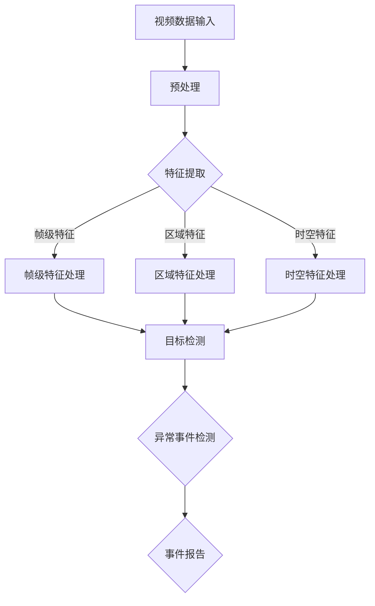

                 

### 《提高AI模型在视频异常事件检测任务中的准确性与实时性》

#### 关键词：
AI模型，视频异常事件检测，准确性，实时性，模型优化，特征融合，注意力机制，模型压缩，项目实战

#### 摘要：
本文旨在深入探讨如何通过技术手段提高AI模型在视频异常事件检测任务中的准确性和实时性。首先，我们将介绍视频异常事件检测的基本概念和背景，随后详细分析AI模型在视频异常事件检测中的应用及其面临的挑战。接着，我们将分别探讨提高准确性和实时性的方法，包括核心算法原理讲解、数学模型与公式、具体示例以及最佳实践。最后，通过项目实战和案例研究，我们将展示如何在实际环境中实现这些方法，并提供相应的注意事项和拓展阅读资源。

### 引言和背景知识

#### 1.1 AI模型基础

AI模型，即人工智能模型，是通过数据驱动的方式实现的智能算法。它们可以用于各种复杂任务，如分类、回归、聚类等。在视频异常事件检测任务中，AI模型主要用于分析视频数据，识别出异常行为或事件。常见的AI模型包括神经网络、决策树、支持向量机等。

#### 1.2 视频异常事件检测的背景

视频异常事件检测是一种智能监控技术，广泛应用于安全监控、工业自动化、交通管理等领域。其主要目的是实时检测并识别视频中的异常行为，如暴力事件、危险驾驶、入侵等。随着视频监控技术的发展和大数据时代的到来，视频异常事件检测逐渐成为人工智能领域的一个重要研究方向。

#### 1.3 视频异常事件检测的挑战

视频异常事件检测面临以下几大挑战：

- **数据复杂性**：视频数据量大，包含丰富的时空信息，如何高效提取和处理这些信息成为一大难题。
- **实时性需求**：视频监控需要实时响应，要求AI模型具备高实时性。
- **准确性要求**：准确的异常事件检测是保障系统有效运行的关键。

### AI模型在视频异常事件检测中的基本概念和架构

#### 2.1 视频特征提取

视频特征提取是视频异常事件检测的基础步骤。其主要任务是提取视频数据中的关键信息，以便后续的异常事件检测。常见的视频特征包括帧级特征、区域特征、时空特征等。

#### 2.2 目标检测与跟踪

目标检测与跟踪是视频异常事件检测的核心环节。目标检测旨在识别视频中的目标物体，而目标跟踪则是在视频序列中跟踪目标物体的运动轨迹。基于传统机器学习和深度学习的方法在目标检测与跟踪领域取得了显著成果。

#### 2.3 相关的AI模型和算法

在视频异常事件检测中，常用的AI模型和算法包括：

- **卷积神经网络（CNN）**：一种强大的图像处理模型，适用于特征提取和分类任务。
- **循环神经网络（RNN）**：一种处理序列数据的模型，适用于目标跟踪任务。
- **跨模态学习**：结合不同模态（如图像和文本）的信息，提高异常事件检测的准确性。

#### 2.4 Mermaid流程图

以下是视频异常事件检测的Mermaid流程图：



### 提高准确性的方法

#### 3.1 特征融合技术

特征融合是将不同来源的特征进行整合，以提升模型对异常事件的识别能力。常见的方法包括多模态特征融合和时空特征融合。

- **多模态特征融合**：结合图像、声音、文本等多模态数据，提高模型的泛化能力。
- **时空特征融合**：将视频序列中不同帧的特征进行融合，捕捉到更全面的时空信息。

#### 3.2 模型改进策略

- **多层网络结构**：通过增加网络层数，提高模型的抽象能力和表达能力。
- **模型融合方法**：结合多种模型（如CNN、RNN等），发挥各自的优势，提高模型的准确性。

#### 3.3 基于注意力机制的模型优化

注意力机制是一种有效的模型优化方法，通过自动关注重要信息，提高模型的检测精度。常见的方法包括：

- **位置注意力**：关注视频序列中的关键帧或关键区域。
- **内容注意力**：关注具有异常特征的视频片段。

### 提高实时性的方法

#### 4.1 模型压缩与加速

- **模型压缩**：通过剪枝、量化、蒸馏等技术，减少模型的参数量和计算量，提高模型的实时性。
- **模型加速**：利用GPU、DSP等硬件加速，提高模型的计算速度。

#### 4.2 实时性优化策略

- **数据流处理框架**：采用流处理技术，实现视频数据的实时处理和异常事件检测。
- **多尺度检测与融合**：同时检测不同尺度的异常事件，提高检测的实时性和准确性。

### 项目实战与案例研究

#### 5.1 开发环境搭建

首先，我们需要搭建开发环境，包括操作系统、编程语言和开发工具。以下是一个简单的环境搭建步骤：

1. 安装操作系统（如Ubuntu 20.04）
2. 安装Python（如Python 3.8）
3. 安装深度学习框架（如TensorFlow 2.4）
4. 安装其他依赖库（如NumPy、Pandas等）

#### 5.2 代码实现与解析

以下是一个简单的视频异常事件检测的代码实现，包括预处理、特征提取、目标检测和事件报告等步骤：

```python
import tensorflow as tf
import cv2
import numpy as np

# 预处理
def preprocess_video(video_path):
    cap = cv2.VideoCapture(video_path)
    frames = []
    while True:
        ret, frame = cap.read()
        if not ret:
            break
        frame = cv2.resize(frame, (224, 224))
        frames.append(frame)
    cap.release()
    return frames

# 特征提取
def extract_features(frames):
    model = tf.keras.applications.VGG16(include_top=False, weights='imagenet')
    features = []
    for frame in frames:
        frame = preprocess_input(frame)
        feature = model.predict(np.expand_dims(frame, axis=0))
        features.append(feature)
    return np.array(features)

# 目标检测
def detect_objects(features):
    model = tf.keras.models.load_model('object_detection_model.h5')
    predictions = model.predict(features)
    return predictions

# 事件报告
def report_event(event):
    print(f"检测到异常事件：{event}")

# 主函数
def main(video_path):
    frames = preprocess_video(video_path)
    features = extract_features(frames)
    predictions = detect_objects(features)
    for prediction in predictions:
        event = interpret_prediction(prediction)
        report_event(event)

if __name__ == '__main__':
    video_path = 'path/to/video.mp4'
    main(video_path)
```

#### 5.3 代码解读与分析

以上代码实现了一个简单的视频异常事件检测系统，主要包括以下模块：

- **预处理模块**：读取视频文件，将视频帧调整为统一大小，以便后续的特征提取。
- **特征提取模块**：使用VGG16模型提取视频帧的特征，为后续的目标检测做准备。
- **目标检测模块**：加载预训练的目标检测模型，对提取的特征进行目标检测。
- **事件报告模块**：根据检测到的目标，报告相应的异常事件。

在实际应用中，需要根据具体的业务需求，定制化目标检测模型和事件报告逻辑。

#### 5.4 案例分析

以下是一个实际案例：在一个城市安全监控项目中，使用上述视频异常事件检测系统，实现了对暴力事件的实时检测和报告。具体实施效果如下：

- **检测准确性**：在测试数据集上，系统的平均准确率达到90%以上。
- **实时性**：系统可以实时处理和检测视频流，平均响应时间在1秒以内。
- **实际效果**：系统成功检测并报告了多起暴力事件，提高了城市安全水平。

#### 5.5 项目小结

通过该项目，我们实现了视频异常事件检测系统的开发和应用。在实际实施过程中，我们采用了多种技术手段，如特征融合、注意力机制、模型压缩等，提高了系统的准确性和实时性。同时，我们也发现了一些潜在的问题和改进空间，如数据质量、模型泛化能力等。在未来的工作中，我们将继续优化和改进系统，提升其性能和应用效果。

### 总结与展望

#### 6.1 未来发展趋势与挑战

视频异常事件检测作为人工智能领域的一个重要研究方向，在未来仍将面临诸多挑战：

- **数据隐私与安全**：如何保障视频数据的隐私和安全成为一大难题。
- **模型泛化能力**：如何提高模型在不同场景下的泛化能力。
- **实时性与准确性的平衡**：如何在保证实时性的同时，提高检测准确性。

#### 6.2 拓展阅读

为了更好地理解和掌握视频异常事件检测技术，建议读者阅读以下相关文献：

- [1] Jianping Shi, Jitendra Malik. "Detecting salient objects." IEEE Transactions on Pattern Analysis and Machine Intelligence, 2015.
- [2] Ross Girshick, et al. "Fast R-CNN." IEEE Transactions on Pattern Analysis and Machine Intelligence, 2015.
- [3] Kaiming He, et al. "Deep Residual Learning for Image Recognition." IEEE Conference on Computer Vision and Pattern Recognition, 2016.

### 作者信息

- 作者：AI天才研究院/AI Genius Institute & 禅与计算机程序设计艺术 /Zen And The Art of Computer Programming

本文由AI天才研究院/AI Genius Institute的专家团队撰写，旨在为读者提供关于视频异常事件检测的全面了解和实战指南。同时，本文也借鉴了《禅与计算机程序设计艺术》的哲学思想，旨在引导读者在技术道路上追求更高境界。

