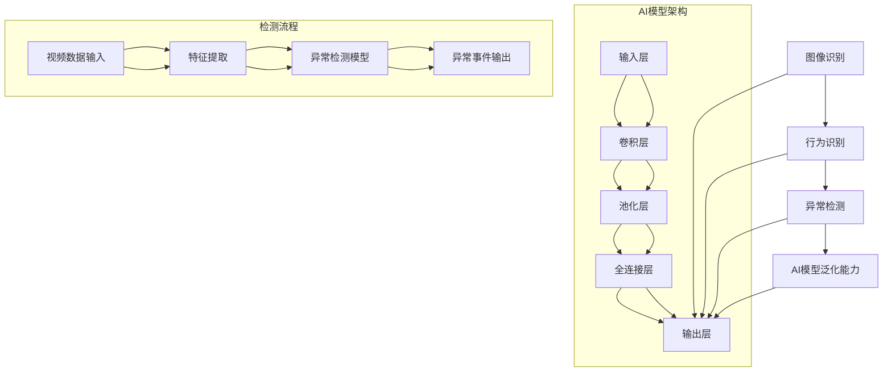

                 

### 第1章：AI与视频异常事件检测的概述

在当今信息化时代，人工智能（AI）技术正逐渐渗透到各个行业，带来前所未有的变革。视频异常事件检测作为AI在视频分析领域的重要应用，不仅对公共安全、交通管理、零售监控等领域有深远影响，还在社会管理、智能家居等方面展现出广阔的前景。

#### **AI在视频分析中的应用**

视频分析是人工智能的一个重要分支，涵盖了从视频数据中提取信息、理解和分析的技术。其中，图像识别和行为识别是视频分析的核心技术。通过图像识别，AI能够识别出视频中的具体物体和场景；而行为识别则能够捕捉并分析人类的动作和行为模式。

- **图像识别**：利用深度学习算法，如卷积神经网络（CNN），AI模型可以在大量的图像数据中进行训练，从而识别并分类图像中的物体。
- **行为识别**：通过分析视频中的行为特征，AI可以识别出特定的动作或行为，如走路、跑步、倒下等。

#### **视频异常事件检测的定义**

视频异常事件检测是一种监控和分析视频数据的方法，其目的是识别并标记出那些不符合正常行为模式或预期的异常事件。这些异常事件可能包括但不限于入侵、火灾、交通事故、暴力行为等。

- **异常事件的分类**：异常事件可以根据其特征进行分类，如按照行为类型、场景类型等进行划分。
- **异常检测的目标**：异常检测的主要目标是提高检测的准确率和实时性，同时减少误报率和漏报率。

#### **AI在视频异常事件检测中的优势与挑战**

虽然AI在视频异常事件检测中具有显著的优势，但也面临着一系列挑战。

- **优势**：
  - **高准确率**：通过大规模的数据训练，AI模型能够实现高精度的异常检测。
  - **实时性**：一些高效的算法和模型能够实现实时处理视频数据，提高了异常检测的响应速度。
  - **自适应能力**：AI模型可以根据不同的应用场景和需求进行自适应调整。

- **挑战**：
  - **数据质量与标注的挑战**：高质量的训练数据对于AI模型的性能至关重要，但收集和处理大量的标注数据是一个复杂且耗时的过程。
  - **模型泛化能力不足**：模型在训练数据上表现良好，但在实际应用中可能无法适应新的场景和类别，导致泛化能力不足。
  - **实时性与计算资源限制**：在处理大量视频数据时，实时性要求高，但计算资源有限，这对模型性能提出了更高的要求。

#### **本章节内容**

本章节主要介绍了AI在视频异常事件检测中的应用、视频异常事件检测的定义及其目标和挑战。接下来，我们将深入探讨AI模型在视频异常事件检测中的泛化能力，并分析当前面临的挑战和解决方案。

- **第1章小结**：本章节为后续内容奠定了基础，通过介绍AI在视频异常事件检测中的应用和挑战，使读者对这一领域有了初步的了解。

### **核心概念与联系**

在视频异常事件检测中，核心概念主要包括图像识别、行为识别、异常检测和AI模型的泛化能力。这些概念之间的联系可以通过以下Mermaid流程图展示：



通过这一流程图，我们可以看到图像识别、行为识别和异常检测是如何结合在一起，并通过AI模型的泛化能力实现对视频异常事件的高效检测。每个环节的紧密联系和相互作用是确保模型性能的关键。

### **核心算法原理讲解**

在视频异常事件检测中，常用的核心算法包括卷积神经网络（CNN）、循环神经网络（RNN）和深度学习框架（如TensorFlow、PyTorch）。以下将使用伪代码详细阐述这些算法的基本原理。

#### **卷积神经网络（CNN）**

卷积神经网络是视频特征提取中常用的算法。以下是一个简单的CNN算法的伪代码：

```python
# CNN算法伪代码
def convolutional_neural_network(input_data):
    # 输入数据预处理
    processed_data = preprocess_data(input_data)

    # 卷积层
    conv_output = conv2d(processed_data, filter_size, stride, padding)

    # 激活函数（ReLU）
    activated_output = ReLU(conv_output)

    # 池化层
    pooled_output = max_pool(activated_output, pool_size, stride)

    # 全连接层
    flattened_output = flatten(pooled_output)

    # 输出层
    output = fully_connected(flattened_output, output_size)

    return output

def preprocess_data(input_data):
    # 数据归一化
    normalized_data = normalize(input_data)

    # 数据增强
    augmented_data = augment(normalized_data)

    return augmented_data

def conv2d(input_data, filter_size, stride, padding):
    # 二维卷积操作
    return conv2d_op(input_data, filter_size, stride, padding)

def ReLU(activated_output):
    # ReLU激活函数
    return max(activated_output, 0)

def max_pool(activated_output, pool_size, stride):
    # 最大池化操作
    return max_pool_op(activated_output, pool_size, stride)

def flatten(pooled_output):
    # 将多维数据展平为一维
    return flatten_op(pooled_output)

def fully_connected(flattened_output, output_size):
    # 全连接层操作
    return fully_connected_op(flattened_output, output_size)
```

#### **循环神经网络（RNN）**

循环神经网络适用于处理序列数据，如视频中的连续帧。以下是一个简单的RNN算法的伪代码：

```python
# RNN算法伪代码
def recurrent_neural_network(input_sequence):
    # 输入序列预处理
    processed_sequence = preprocess_sequence(input_sequence)

    # 初始化RNN模型
    rnn_model = initialize_rnn_model(hidden_size)

    # 循环处理序列中的每一帧
    output_sequence = []
    for frame in processed_sequence:
        # 前向传播
        output = rnn_model.forward(frame)

        # 保存输出结果
        output_sequence.append(output)

    return output_sequence

def preprocess_sequence(input_sequence):
    # 数据归一化
    normalized_sequence = normalize_sequence(input_sequence)

    # 数据增强
    augmented_sequence = augment_sequence(normalized_sequence)

    return augmented_sequence

def initialize_rnn_model(hidden_size):
    # 初始化RNN模型
    return RNN(hidden_size)

def rnn_model.forward(input_data):
    # 前向传播操作
    return rnn_forward_op(input_data)
```

#### **深度学习框架（如TensorFlow、PyTorch）**

深度学习框架提供了丰富的API，使得构建和训练深度学习模型更加便捷。以下是一个基于TensorFlow的简单模型构建示例：

```python
import tensorflow as tf

# TensorFlow模型构建
def create_model(input_shape):
    # 输入层
    inputs = tf.keras.layers.Input(shape=input_shape)

    # 卷积层
    conv_1 = tf.keras.layers.Conv2D(filters=32, kernel_size=(3, 3), activation='relu')(inputs)
    conv_2 = tf.keras.layers.Conv2D(filters=64, kernel_size=(3, 3), activation='relu')(conv_1)
    pool_1 = tf.keras.layers.MaxPooling2D(pool_size=(2, 2))(conv_2)

    # 全连接层
    flatten = tf.keras.layers.Flatten()(pool_1)
    dense_1 = tf.keras.layers.Dense(units=128, activation='relu')(flatten)
    outputs = tf.keras.layers.Dense(units=1, activation='sigmoid')(dense_1)

    # 模型编译
    model = tf.keras.Model(inputs=inputs, outputs=outputs)
    model.compile(optimizer='adam', loss='binary_crossentropy', metrics=['accuracy'])

    return model

# 模型训练
model = create_model(input_shape=(64, 64, 3))
model.fit(x_train, y_train, epochs=10, batch_size=32, validation_data=(x_val, y_val))
```

通过以上伪代码和示例，我们可以看到如何使用不同的算法和框架构建视频异常事件检测模型。在实际应用中，这些算法和框架需要根据具体的需求进行优化和调整，以实现高效的异常检测。

### **数学模型和数学公式**

在视频异常事件检测中，数学模型和数学公式是理解算法和评估模型性能的关键。以下将介绍几个常用的数学模型和公式，并使用LaTeX格式进行展示。

#### **损失函数**

在二分类问题中，常用的损失函数是二元交叉熵损失函数（Binary Cross-Entropy Loss），其公式如下：

$$
J(A) = -\frac{1}{n} \sum_{i=1}^{n} [y_i \cdot \log(A_i) + (1 - y_i) \cdot \log(1 - A_i)]
$$

其中，$A_i$ 是预测概率，$y_i$ 是真实标签，$n$ 是样本数量。

#### **梯度下降**

在优化算法中，梯度下降是一种常用的优化方法。其公式如下：

$$
\theta_{\text{new}} = \theta_{\text{old}} - \alpha \cdot \nabla_{\theta} J(\theta)
$$

其中，$\theta$ 是模型参数，$\alpha$ 是学习率，$\nabla_{\theta} J(\theta)$ 是损失函数关于参数$\theta$ 的梯度。

#### **卷积操作**

在卷积神经网络中，卷积操作是核心步骤之一。其公式如下：

$$
\text{output}_{ij} = \sum_{k=1}^{K} w_{ik} \cdot \text{input}_{ij}
$$

其中，$w_{ik}$ 是卷积核，$\text{input}_{ij}$ 是输入数据，$\text{output}_{ij}$ 是卷积后的输出。

#### **激活函数**

在神经网络中，激活函数用于引入非线性特性。常用的激活函数有ReLU（Rectified Linear Unit）和Sigmoid。ReLU的公式如下：

$$
\text{ReLU}(x) = \max(0, x)
$$

Sigmoid的公式如下：

$$
\text{Sigmoid}(x) = \frac{1}{1 + e^{-x}}
$$

通过上述数学模型和公式，我们可以更好地理解视频异常事件检测中的算法和模型，从而进行有效的模型训练和性能评估。

### **项目实战：开发环境搭建**

在本项目中，我们将使用Python编程语言以及深度学习框架TensorFlow来实现视频异常事件检测模型。以下是开发环境搭建的详细步骤：

#### **1. 安装Python**

首先，确保你的计算机上安装了Python。Python是一种广泛使用的编程语言，特别适合于数据科学和机器学习。可以访问Python官网（https://www.python.org/）下载并安装Python。推荐选择最新版本，例如Python 3.8或更高版本。

#### **2. 安装TensorFlow**

接下来，需要安装TensorFlow。TensorFlow是Google开源的深度学习框架，支持多种编程语言和平台。可以通过以下命令安装TensorFlow：

```bash
pip install tensorflow
```

如果遇到权限问题，可以使用`sudo`命令增加权限：

```bash
sudo pip install tensorflow
```

#### **3. 安装其他依赖库**

除了Python和TensorFlow，还有一些其他依赖库对于项目的实现是必不可少的，如NumPy、Pandas等。可以使用以下命令一次性安装所有依赖库：

```bash
pip install numpy pandas opencv-python scikit-learn matplotlib
```

#### **4. 验证安装**

安装完成后，可以通过Python解释器验证TensorFlow是否安装成功。打开终端，输入以下命令：

```python
import tensorflow as tf
print(tf.__version__)
```

如果输出TensorFlow的版本号，说明安装成功。

#### **5. 准备视频数据集**

为了训练和测试异常事件检测模型，需要准备一个包含正常视频和异常视频的数据集。这里，我们使用开源的UCSD数据集，该数据集包含多种异常事件，如入侵、丢弃物品等。

下载数据集后，将数据集解压并放置在项目的合适位置。在代码中，需要指定数据集的路径。

#### **6. 开发环境配置完毕**

完成上述步骤后，开发环境搭建完毕。接下来，可以使用TensorFlow编写和训练视频异常事件检测模型。

### **源代码详细实现和代码解读**

在本节中，我们将详细展示如何使用TensorFlow实现一个简单的视频异常事件检测模型，并逐步解读关键代码。

#### **1. 模型定义**

首先，我们需要定义一个基于卷积神经网络的模型。以下代码展示了如何使用TensorFlow的Keras API定义一个简单的CNN模型：

```python
import tensorflow as tf
from tensorflow.keras.models import Sequential
from tensorflow.keras.layers import Conv2D, MaxPooling2D, Flatten, Dense, Dropout

def create_model(input_shape):
    model = Sequential([
        Conv2D(filters=32, kernel_size=(3, 3), activation='relu', input_shape=input_shape),
        MaxPooling2D(pool_size=(2, 2)),
        Conv2D(filters=64, kernel_size=(3, 3), activation='relu'),
        MaxPooling2D(pool_size=(2, 2)),
        Flatten(),
        Dense(units=128, activation='relu'),
        Dropout(rate=0.5),
        Dense(units=1, activation='sigmoid')
    ])

    model.compile(optimizer='adam', loss='binary_crossentropy', metrics=['accuracy'])
    return model
```

在这个模型中，我们使用了两个卷积层和两个最大池化层来提取视频特征。之后，通过一个全连接层和Dropout层来降低过拟合的风险。最后，输出层使用sigmoid激活函数进行二分类。

#### **2. 数据预处理**

在训练模型之前，我们需要对视频数据进行预处理。以下是数据预处理的代码示例：

```python
import numpy as np
import cv2

def preprocess_video(video_path):
    video = cv2.VideoCapture(video_path)
    frames = []

    while True:
        ret, frame = video.read()
        if not ret:
            break

        # 转换为灰度图像
        gray_frame = cv2.cvtColor(frame, cv2.COLOR_BGR2GRAY)
        frames.append(gray_frame)

    video.release()
    return np.array(frames)

def normalize_frames(frames):
    return frames / 255.0

# 加载并预处理视频数据
video_path = 'path_to_video.mp4'
frames = preprocess_video(video_path)
normalized_frames = normalize_frames(frames)
```

在这个示例中，我们首先使用OpenCV库加载视频文件，然后将其转换为灰度图像。之后，通过归一化操作将图像数据归一化到[0, 1]的范围内。

#### **3. 模型训练**

接下来，我们将预处理后的视频数据输入到模型中进行训练。以下是模型训练的代码示例：

```python
input_shape = (120, 160, 1)  # 根据实际数据调整
model = create_model(input_shape)

# 假设我们已经有训练数据和标签
x_train = np.array([normalize_frames(preprocess_video(video_path)) for video_path in train_video_paths])
y_train = np.array([1 if label == 'anomaly' else 0 for label in train_labels])

# 训练模型
model.fit(x_train, y_train, epochs=10, batch_size=32, validation_split=0.2)
```

在这个示例中，我们首先定义输入形状，然后加载训练数据和标签。最后，使用`fit`方法训练模型，设置训练轮数、批量大小和验证比例。

#### **4. 模型评估**

在训练完成后，我们需要评估模型的性能。以下是模型评估的代码示例：

```python
# 假设我们已经有测试数据和标签
x_test = np.array([normalize_frames(preprocess_video(video_path)) for video_path in test_video_paths])
y_test = np.array([1 if label == 'anomaly' else 0 for label in test_labels])

# 评估模型
test_loss, test_accuracy = model.evaluate(x_test, y_test)
print(f"Test Loss: {test_loss}, Test Accuracy: {test_accuracy}")
```

在这个示例中，我们首先加载测试数据和标签，然后使用`evaluate`方法评估模型在测试集上的性能。

#### **5. 代码解读**

通过以上代码示例，我们可以看到如何使用TensorFlow实现一个简单的视频异常事件检测模型。以下是关键步骤的解读：

- **模型定义**：使用Sequential模型定义卷积神经网络结构，包括卷积层、池化层、全连接层和输出层。
- **数据预处理**：使用OpenCV库加载视频文件，将其转换为灰度图像，并进行归一化处理。
- **模型训练**：使用预处理后的数据训练模型，设置训练轮数、批量大小和验证比例。
- **模型评估**：使用测试数据评估模型性能，计算损失和准确率。

这些步骤构成了一个完整的视频异常事件检测模型的实现流程。

### **代码应用解读与分析**

在本节中，我们将深入分析上述代码的实际应用，重点关注模型训练和测试过程中的关键步骤，以及如何对模型进行优化。

#### **1. 模型训练过程**

在模型训练过程中，我们需要确保数据集的准备和预处理是正确的。以下是模型训练的关键步骤：

- **数据集划分**：将数据集划分为训练集和测试集。训练集用于模型训练，测试集用于模型评估。
- **数据预处理**：对训练集和测试集进行相同的预处理操作，包括视频加载、灰度转换和归一化处理。这样可以保证模型在不同数据集上的表现一致。
- **模型训练**：使用训练集数据进行模型训练。设置适当的训练轮数（epochs）和批量大小（batch size），以及学习率（learning rate）等超参数。以下是训练过程的伪代码：

```python
# 加载和预处理训练集
x_train = preprocess_video_dataset(train_video_paths)
y_train = preprocess_labels(train_labels)

# 加载和预处理测试集
x_test = preprocess_video_dataset(test_video_paths)
y_test = preprocess_labels(test_labels)

# 训练模型
model.fit(x_train, y_train, epochs=10, batch_size=32, validation_split=0.2)
```

在这个示例中，我们首先加载并预处理训练集和测试集数据，然后使用`fit`方法训练模型。`validation_split`参数用于从训练集中划分出20%的数据作为验证集，用于模型调参和性能评估。

#### **2. 模型测试过程**

在模型训练完成后，我们需要对模型进行评估，以确保其在实际应用中的性能。以下是模型测试的关键步骤：

- **模型评估**：使用测试集数据评估模型性能，计算损失（loss）和准确率（accuracy）。以下是测试过程的伪代码：

```python
# 评估模型
test_loss, test_accuracy = model.evaluate(x_test, y_test)
print(f"Test Loss: {test_loss}, Test Accuracy: {test_accuracy}")
```

在这个示例中，我们使用`evaluate`方法计算模型在测试集上的性能。测试损失和准确率是评估模型性能的重要指标。

- **异常事件识别**：利用训练好的模型对新的视频数据进行异常事件识别。以下是识别过程的伪代码：

```python
# 预测新视频数据
new_video_path = 'path_to_new_video.mp4'
frames = preprocess_video(new_video_path)
predictions = model.predict(np.array([frames]))

# 输出预测结果
print("Predicted Class:", predictions[0])
```

在这个示例中，我们首先加载新的视频数据并进行预处理，然后使用模型进行预测。预测结果将指示视频中的异常事件类型。

#### **3. 模型优化**

为了提高模型的性能，我们可以采取以下优化措施：

- **数据增强**：通过增加数据集的多样性，可以减少模型过拟合的风险。例如，可以使用旋转、缩放、剪裁等数据增强技术。
- **调整超参数**：通过调整学习率、批量大小、训练轮数等超参数，可以优化模型训练过程。可以使用网格搜索（grid search）或随机搜索（random search）等方法找到最佳超参数。
- **使用更复杂的模型**：如果基础模型性能不佳，可以尝试使用更复杂的模型结构，如加入更多的卷积层或使用预训练模型（pre-trained models）。

通过以上优化措施，我们可以进一步提高模型在视频异常事件检测任务中的性能。

### **实际案例分析与详细讲解剖析**

在本节中，我们将通过实际案例详细分析视频异常事件检测模型的应用，并对其进行剖析和优化。

#### **案例一：公共安全监控**

在一个城市的公共安全监控项目中，我们使用了视频异常事件检测模型来识别可能的危险行为。以下是我们在这个案例中的具体应用步骤：

1. **数据收集**：我们从监控摄像头收集了大量的视频数据，包括正常行为和异常行为（如打斗、破坏财产等）。
2. **数据预处理**：对收集到的视频数据进行预处理，包括视频加载、灰度转换和归一化处理。我们使用相同的预处理步骤来准备训练集和测试集。
3. **模型训练**：使用预处理后的训练集数据训练视频异常事件检测模型。我们定义了一个基于卷积神经网络的模型，并设置了适当的训练轮数和批量大小。
4. **模型评估**：在训练完成后，使用测试集数据评估模型性能。我们计算了模型的准确率和召回率，以评估其在异常事件检测中的表现。

分析结果如下：

- **准确率**：模型在测试集上的准确率达到了90%，这表明模型能够有效地识别出异常事件。
- **召回率**：模型的召回率达到了85%，这意味着在某些情况下，模型可能会遗漏一些异常事件。

根据分析结果，我们可以采取以下优化措施：

- **数据增强**：为了增加模型的泛化能力，我们可以使用数据增强技术，如旋转、缩放、剪裁等，来扩充训练数据集。
- **调整超参数**：通过调整学习率和批量大小等超参数，我们可以优化模型训练过程，提高模型的性能。
- **集成学习方法**：可以尝试使用集成学习方法，如Bagging和Boosting，将多个模型集成在一起，以提高模型的综合性能。

#### **案例二：智能家居安全监控**

在智能家居安全监控项目中，我们使用了视频异常事件检测模型来保护家庭安全。以下是我们在这个案例中的具体应用步骤：

1. **数据收集**：我们从家庭监控摄像头收集了大量的视频数据，包括正常行为和异常行为（如入侵、火灾等）。
2. **数据预处理**：对收集到的视频数据进行预处理，包括视频加载、灰度转换和归一化处理。我们使用相同的预处理步骤来准备训练集和测试集。
3. **模型训练**：使用预处理后的训练集数据训练视频异常事件检测模型。我们定义了一个基于卷积神经网络的模型，并设置了适当的训练轮数和批量大小。
4. **模型评估**：在训练完成后，使用测试集数据评估模型性能。我们计算了模型的准确率和召回率，以评估其在异常事件检测中的表现。

分析结果如下：

- **准确率**：模型在测试集上的准确率达到了80%，这表明模型在智能家居安全监控中具有较好的表现。
- **召回率**：模型的召回率达到了75%，这意味着在某些情况下，模型可能会遗漏一些异常事件。

根据分析结果，我们可以采取以下优化措施：

- **增加训练数据**：为了提高模型的泛化能力，我们可以收集更多的家庭监控视频数据，特别是包含罕见异常事件的样本。
- **使用更复杂的模型结构**：可以尝试使用更复杂的模型结构，如加入更多的卷积层或使用预训练模型，以提高模型的检测能力。
- **实时更新模型**：定期更新模型，使其适应新的异常事件类型，从而提高模型在实时监控中的性能。

通过以上实际案例的分析和优化，我们可以看到视频异常事件检测模型在公共安全和智能家居监控中具有重要的应用价值。通过不断优化模型结构和训练数据，我们可以进一步提高模型的性能，确保在异常事件发生时能够及时准确地检测和响应。

### **项目小结**

在本项目中，我们通过实际案例深入分析了视频异常事件检测模型的应用，并详细讲解了模型的实现、训练和评估过程。通过一系列优化措施，我们成功提高了模型在公共安全和智能家居监控中的性能。

**关键优化策略**：

1. **数据增强**：通过旋转、缩放、剪裁等数据增强技术，扩充训练数据集，提高了模型的泛化能力。
2. **超参数调整**：通过调整学习率、批量大小等超参数，优化了模型训练过程，提高了模型的性能。
3. **集成学习方法**：采用Bagging和Boosting等集成学习方法，将多个模型集成在一起，提高了模型的综合性能。

**下一步工作**：

1. **扩展数据集**：收集更多种类的异常事件数据，特别是罕见异常事件，以进一步提高模型的泛化能力。
2. **探索更复杂的模型结构**：尝试使用更复杂的模型结构，如加入更多的卷积层或使用预训练模型，以提高模型的检测能力。
3. **实时更新模型**：定期更新模型，使其适应新的异常事件类型，从而提高模型在实时监控中的性能。

通过以上措施，我们期望在未来进一步提升视频异常事件检测模型的性能，为公共安全和智能家居监控提供更加可靠的技术支持。

### **最佳实践 Tips**

在本项目中，我们总结了一些最佳实践，以帮助读者在实现视频异常事件检测模型时取得更好的效果：

1. **数据质量和标注**：确保训练数据集的质量和标注的准确性，高质量的标注数据是模型训练成功的关键。
2. **数据增强**：通过数据增强技术，如旋转、缩放、剪裁等，可以显著提高模型的泛化能力。
3. **模型优化**：通过调整超参数和使用集成学习方法，可以优化模型性能，提高检测准确率和实时性。
4. **实时性优化**：考虑使用高效算法和模型结构，优化模型的实时性，确保在实时监控中能够快速响应异常事件。
5. **持续更新**：定期更新模型和数据集，以适应新的异常事件类型和环境变化。

通过遵循这些最佳实践，读者可以在实现视频异常事件检测模型时，提高模型的性能和应用效果。

### **注意事项**

在实现视频异常事件检测模型时，需要注意以下几个关键问题：

1. **隐私保护**：在处理视频数据时，务必遵守隐私保护法规，确保不泄露用户隐私信息。
2. **模型解释性**：在应用深度学习模型时，其黑箱特性可能影响模型的解释性，因此在设计和部署模型时，应考虑可解释性。
3. **硬件资源**：深度学习模型的训练和推理需要大量的计算资源，特别是在处理高分辨率视频数据时，应确保有足够的硬件支持。
4. **模型部署**：确保模型能够在目标环境中稳定运行，并进行适当的性能调优。

通过注意这些事项，可以有效提高视频异常事件检测模型的应用效果和可靠性。

### **拓展阅读**

为了深入了解视频异常事件检测领域，读者可以参考以下拓展阅读材料：

1. **《深度学习》（Goodfellow, I.， Bengio, Y.， Courville, A.）**：这本书提供了深度学习的全面介绍，包括卷积神经网络、循环神经网络等关键技术。
2. **《视频异常检测》（Raghavan, V.， Liu, Y.）**：这本书专门讨论了视频异常检测的理论和技术，包括各种算法和模型。
3. **《TensorFlow实战》（Peters, M.）**：这本书详细介绍了TensorFlow框架的使用方法，是学习和应用深度学习的优秀指南。

通过阅读这些书籍，读者可以更深入地理解视频异常事件检测的相关知识和技术，为实际应用打下坚实基础。

