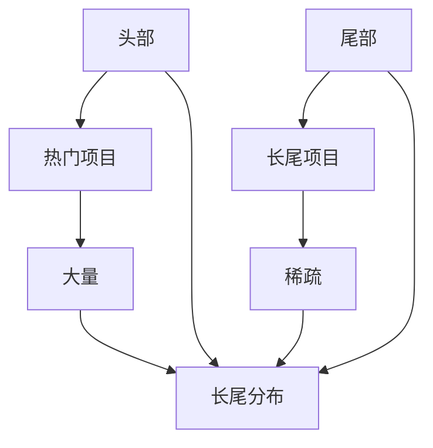
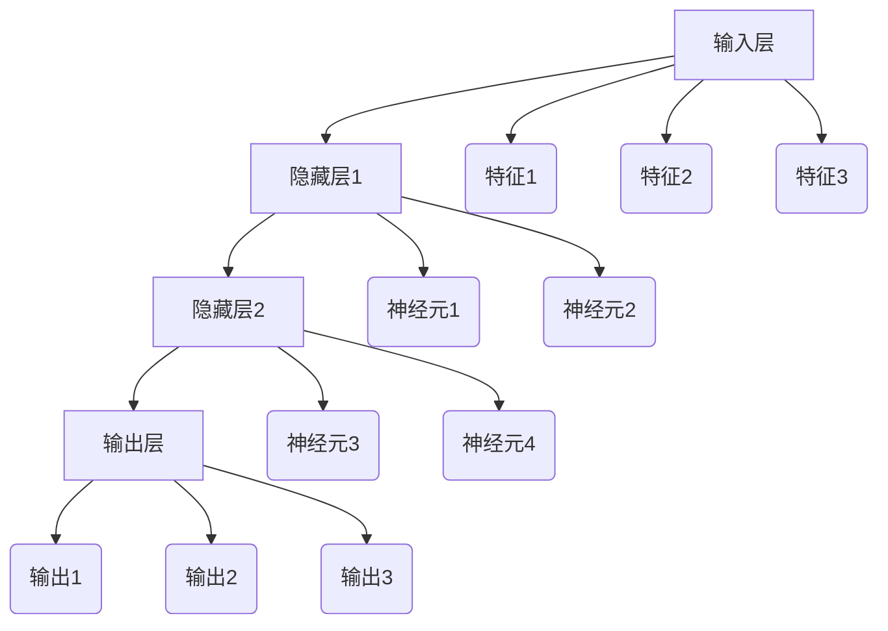

                 

### 文章标题

提高AI模型在长尾分布数据学习中的效果

### 文章关键词

AI模型、长尾分布、数据学习、效果优化、算法分析、深度学习、神经网络

### 文章摘要

随着人工智能技术的飞速发展，深度学习在各类复杂数据分析任务中的应用越来越广泛。然而，长尾分布数据的特殊性使得传统AI模型的性能受到很大限制。本文将深入探讨如何在长尾分布数据学习中提高AI模型的性能，从背景介绍、核心概念、数学模型、算法原理到实际应用，逐步分析并提出解决方案。通过结合实际案例和最佳实践，本文旨在为研究人员和实践者提供有价值的参考和指导。

### 引言

长尾分布是一种常见的概率分布模型，其特征是大量的小概率事件累积起来具有显著影响。在数据集中，长尾分布数据通常表现为少数热门项目占据大部分比例，而大量长尾项目虽然各自占比微小，但总体贡献却不可忽视。例如，在电商平台上，热门商品往往占据大部分销售额，但长尾商品也能带来可观的总收益。同样，在社交媒体上，热门话题吸引大量关注，但大量冷门话题也形成了独特的长尾效应。

在人工智能领域，深度学习技术已成为处理复杂数据的主流方法。然而，传统深度学习模型在长尾分布数据上往往面临挑战。一方面，长尾数据中冷门项目的样本量较少，可能导致模型无法充分学习这些特征；另一方面，长尾数据中的噪声和异常值较多，会影响模型的泛化能力。因此，如何提高AI模型在长尾分布数据学习中的效果，成为当前人工智能研究的一个重要课题。

本文将从以下几个方面展开讨论：

1. **长尾分布数据的特点与应用场景**：介绍长尾分布的基本概念、特点，以及在各个领域的应用案例。
2. **深度学习模型的基本原理**：回顾深度学习的基本原理，包括神经网络、激活函数、反向传播算法等。
3. **长尾分布数据学习中的挑战**：分析传统深度学习模型在长尾分布数据上遇到的问题，如数据不平衡、过拟合等。
4. **优化策略与算法设计**：介绍针对长尾分布数据学习优化的方法，包括数据预处理、模型调整、正则化技术等。
5. **实际案例分析**：通过具体案例展示如何应用优化策略提高AI模型在长尾分布数据学习中的效果。
6. **未来展望与挑战**：探讨未来在长尾分布数据学习领域的研究方向和面临的挑战。

### 长尾分布数据的特点与应用场景

长尾分布（Long Tail Distribution）是一种常见的概率分布现象，其特征是大量的小概率事件累积起来具有显著的影响。在数据集中，长尾分布数据通常表现为少数热门项目占据大部分比例，而大量长尾项目虽然各自占比微小，但总体贡献却不可忽视。

#### 长尾分布的基本概念

长尾分布可以分为两部分：头部（Head）和尾部（Tail）。头部是指那些占比大、影响大的项目，尾部则是指那些占比小、影响小的项目。在统计学中，长尾分布可以用概率密度函数（Probability Density Function, PDF）来描述，其数学形式通常为：

$$
f(x; \mu, \sigma, \alpha) = \frac{1}{\alpha \Gamma(\alpha)} \left(\frac{x - \mu}{\sigma}\right)^{-\alpha - 1} e^{-\left(\frac{x - \mu}{\sigma}\right)^{-1}}
$$

其中，$\mu$ 是均值，$\sigma$ 是标准差，$\alpha$ 是形状参数，$\Gamma(\alpha)$ 是伽玛函数。

#### 长尾分布的特点

长尾分布具有以下几个显著特点：

1. **尾部渐进性**：尾部项目虽然个体占比微小，但随着样本量的增加，尾部项目的总体占比会逐渐增大。
2. **非单调性**：与正态分布相比，长尾分布没有明确的峰值，而是呈现渐进上升趋势。
3. **稀疏性**：尾部项目往往分布得非常稀疏，且彼此之间差异较大。
4. **多样化**：长尾分布涵盖了各种类型的项目，从热门到冷门，从高频到低频。

#### 长尾分布的应用场景

长尾分布的应用场景非常广泛，以下是一些典型的例子：

1. **电商领域**：电商平台上的商品销售数据通常呈现长尾分布。热门商品虽然销售量较大，但长尾商品的总销售量却不可小觑。通过分析长尾商品，电商可以挖掘潜在的市场需求，提升销售额。
2. **社交媒体**：社交媒体平台上的用户互动数据也常常呈现长尾分布。热门话题能够吸引大量关注，但大量冷门话题也形成了独特的用户群体，为平台提供了多样化的内容。
3. **搜索引擎**：搜索引擎的查询日志数据呈现明显的长尾分布。虽然大部分查询集中在热门关键词上，但长尾关键词也能为搜索引擎带来可观的流量。
4. **推荐系统**：推荐系统在处理用户偏好数据时，常常会面临长尾分布的挑战。热门项目的推荐相对容易，但如何发现并推荐长尾项目，提升用户体验，是推荐系统需要解决的重要问题。

#### 图解长尾分布

为了更直观地理解长尾分布，我们可以通过一个简单的图例来展示。以下是一个长尾分布的示例图：

在这个示例中，A和C分别代表头部和尾部，B和D分别代表热门项目和长尾项目。E和F分别描述了长尾项目的总体占比和分布情况。通过这个图例，我们可以清晰地看到长尾分布的特点和应用场景。

综上所述，长尾分布作为一种重要的概率分布模型，在多个领域都有着广泛的应用。了解长尾分布的基本概念、特点和应用场景，对于提高AI模型在长尾分布数据学习中的效果具有重要意义。

### 深度学习模型的基本原理

深度学习（Deep Learning）是人工智能（Artificial Intelligence, AI）的一个子领域，它通过构建多层神经网络模型来模拟人脑的决策过程，从而实现复杂的数据分析和模式识别任务。深度学习模型在图像识别、自然语言处理、语音识别等领域取得了显著的成果，成为当前人工智能研究的热点之一。

#### 神经网络

神经网络（Neural Networks）是深度学习模型的基础组件，它由大量简单的计算单元（神经元）通过复杂的网络结构相互连接而成。每个神经元接受多个输入信号，通过加权求和并经过激活函数处理后产生输出。神经网络通过不断调整权重和偏置，使输出信号能够逼近目标值，从而完成特定的任务。

##### 神经元的工作原理

一个基本的神经元可以表示为如下数学模型：

$$
z = \sum_{i=1}^{n} w_i x_i + b
$$

其中，$z$ 是神经元的输出，$w_i$ 是第 $i$ 个输入信号的权重，$x_i$ 是输入信号，$b$ 是偏置项。激活函数 $f(z)$ 对输出进行非线性变换，常用的激活函数包括：

1. **sigmoid函数**：
   $$
   f(z) = \frac{1}{1 + e^{-z}}
   $$

2. **ReLU函数**：
   $$
   f(z) = \max(0, z)
   $$

3. **Tanh函数**：
   $$
   f(z) = \frac{e^z - e^{-z}}{e^z + e^{-z}}
   $$

这些激活函数能够在一定程度上缓解神经元之间相互抑制的问题，提高模型的训练效率。

##### 神经网络的层次结构

神经网络通常分为输入层、隐藏层和输出层：

1. **输入层**：接收外部输入数据，每个神经元对应一个特征。
2. **隐藏层**：包含一个或多个隐藏层，每个隐藏层由多个神经元组成，用于对输入数据进行特征提取和变换。
3. **输出层**：产生最终输出结果，通常是一个或多个神经元。

##### 神经网络的训练过程

神经网络的训练过程可以通过反向传播算法（Backpropagation Algorithm）实现。反向传播算法是一种基于梯度下降（Gradient Descent）的优化方法，它通过不断调整网络权重和偏置，使输出误差最小。

1. **前向传播**：将输入数据通过网络进行前向传播，计算每个神经元的输出值。
2. **计算误差**：比较实际输出与期望输出之间的差异，计算损失函数（Loss Function）。
3. **反向传播**：根据损失函数的梯度信息，从输出层开始反向传播，更新网络权重和偏置。
4. **迭代优化**：重复前向传播和反向传播的过程，直至网络收敛。

常用的损失函数包括均方误差（Mean Squared Error, MSE）和交叉熵（Cross-Entropy）等。

$$
MSE = \frac{1}{m} \sum_{i=1}^{m} (y_i - \hat{y}_i)^2
$$

$$
CE = -\frac{1}{m} \sum_{i=1}^{m} \sum_{j=1}^{n} y_j \log(\hat{y}_j)
$$

其中，$m$ 是样本数量，$y_i$ 是实际标签，$\hat{y}_i$ 是预测输出，$n$ 是类别数量。

#### 深度学习模型的优势与挑战

深度学习模型具有以下优势：

1. **强大的特征提取能力**：通过多层神经网络的结构，深度学习模型能够自动提取高层次的抽象特征，从而提高模型性能。
2. **自适应性强**：深度学习模型能够根据不同任务和数据集自动调整网络结构和参数，具有较强的泛化能力。
3. **广泛应用性**：深度学习模型在图像识别、自然语言处理、语音识别等领域取得了显著成果，成为人工智能研究的重要工具。

然而，深度学习模型也存在一些挑战：

1. **计算资源消耗**：深度学习模型通常需要大量计算资源和时间进行训练，尤其是在处理大规模数据集时。
2. **解释性不足**：深度学习模型的内部决策过程相对复杂，难以直观解释，这在一些对解释性有较高要求的应用场景中成为限制因素。
3. **过拟合风险**：深度学习模型容易受到训练数据的影响，可能导致过拟合（Overfitting），即模型在训练数据上表现良好，但在未知数据上表现较差。

#### 图解神经网络

为了更直观地理解神经网络的工作原理，我们可以通过以下Mermaid图来展示：

在这个示例中，A表示输入层，B、C、D分别表示隐藏层1、隐藏层2和输出层。E、F、G表示输入特征，H、I、J、K表示隐藏层神经元，L、M、N表示输出层神经元。通过这个图例，我们可以清晰地看到神经网络的结构和各层之间的连接方式。

综上所述，深度学习模型通过神经网络结构实现了强大的特征提取和模式识别能力，在多个领域取得了显著成果。然而，随着数据集规模的增大和模型复杂性的提升，如何提高训练效率、降低计算资源消耗，以及增强模型的可解释性，仍然是当前研究的重要方向。

### 长尾分布数据学习中的挑战

在长尾分布数据学习中，深度学习模型面临诸多挑战，这些挑战主要体现在以下几个方面：

#### 数据不平衡

长尾分布数据的一个显著特点是数据不平衡，即少数热门项目的样本量远大于大量长尾项目的样本量。这种数据不平衡现象会导致深度学习模型在训练过程中倾向于学习那些样本量较大的热门项目，而对长尾项目的特征提取和识别效果不佳。具体来说，数据不平衡可能带来以下问题：

1. **过拟合**：模型在训练过程中过度依赖样本量较大的热门项目，导致在训练集上表现良好，但在测试集或未知数据集上表现较差。
2. **模型偏见**：模型在处理长尾数据时可能产生偏见，只关注热门项目，忽略长尾项目的特征，从而影响模型的泛化能力。

#### 尾部噪声和异常值

长尾分布数据中的尾部项目往往包含大量的噪声和异常值，这些噪声和异常值会对深度学习模型的训练过程和性能产生不利影响。具体来说，尾部噪声和异常值可能导致以下问题：

1. **训练不稳定**：噪声和异常值可能导致模型训练过程中出现波动，难以收敛到最优解。
2. **模型泛化能力下降**：噪声和异常值会影响模型对长尾数据的特征提取，降低模型的泛化能力。

#### 数据稀疏性

长尾分布数据中的尾部项目通常分布稀疏，这意味着每个项目的样本量非常少，甚至可能只有一个或几个样本。数据稀疏性会对深度学习模型的训练过程产生以下影响：

1. **学习困难**：模型在训练过程中难以从少量样本中提取有效特征，导致训练效果不佳。
2. **过拟合风险**：由于样本量少，模型容易对特定样本产生过拟合，从而降低模型的泛化能力。

#### 特征缺失和缺失数据

长尾分布数据中的尾部项目往往存在大量缺失数据或特征缺失。这些缺失数据会对深度学习模型的训练和性能产生负面影响，主要表现为：

1. **训练难度增加**：缺失数据会增加模型训练的复杂性，可能导致模型难以收敛。
2. **模型性能下降**：特征缺失会影响模型的特征提取和模式识别能力，从而降低模型的整体性能。

#### 异构性

长尾分布数据中的尾部项目具有很高的异构性，即不同项目之间差异很大。这种异构性对深度学习模型提出了以下挑战：

1. **统一建模难度**：深度学习模型难以同时处理具有高度异构性的长尾项目。
2. **模型泛化能力不足**：模型在处理异构性数据时，可能无法有效提取不同项目之间的共同特征，导致泛化能力下降。

#### 处理时间成本

长尾分布数据中的尾部项目样本量庞大，可能导致深度学习模型训练和处理时间成本显著增加。具体来说，处理时间成本主要包括：

1. **模型训练时间**：深度学习模型需要大量时间进行训练，特别是在数据量庞大的情况下。
2. **数据预处理时间**：尾部项目样本量多，预处理过程（如数据清洗、特征提取等）所需时间也会增加。

为了解决上述挑战，研究人员提出了多种优化策略，包括数据增强、模型调整、正则化技术等。在下一节中，我们将详细介绍这些优化策略，并探讨如何在实际应用中提高AI模型在长尾分布数据学习中的效果。

#### 针对长尾分布数据学习的优化策略

在处理长尾分布数据时，传统的深度学习模型常常面临数据不平衡、噪声、异常值和稀疏性等问题，导致模型性能受限。为了克服这些挑战，研究者们提出了一系列优化策略，以提升AI模型在长尾分布数据学习中的效果。以下是一些主要的优化策略及其实现方法：

##### 数据增强

数据增强是一种通过生成更多样化的训练样本来提高模型泛化能力的技术。在长尾分布数据中，数据增强尤其重要，因为长尾项目样本量较少，通过数据增强可以生成更多具有代表性的训练样本。

1. **数据复制**：简单地将少数样本复制多次，可以增加这些样本在训练集中的比例，从而缓解数据不平衡问题。
2. **数据合成**：使用图像合成、文本生成等技术生成与真实数据相似的新样本。例如，在图像识别任务中，可以通过图像增强、图像生成对抗网络（GAN）等方法生成更多的训练样本。
3. **样本聚合**：将多个相似样本合并为一个，通过降维技术提取共同特征，从而提高模型对长尾项目的识别能力。

##### 模型调整

通过调整深度学习模型的结构和参数，可以更好地适应长尾分布数据的特点。

1. **多任务学习**：将多个相关任务结合在一起训练，通过共享部分模型结构，可以增加长尾项目样本的利用效率。例如，在图像识别和文本分类任务中，可以共享视觉和语言模型的部分层。
2. **自适应学习率**：采用自适应学习率方法，如Adam优化器，可以根据训练过程中的梯度变化自动调整学习率，提高模型在长尾数据上的训练效率。
3. **注意力机制**：在神经网络中引入注意力机制，使模型能够更加关注重要的长尾项目特征，从而提升识别准确性。

##### 正则化技术

正则化技术通过惩罚模型复杂度，防止过拟合，提高模型在长尾数据上的泛化能力。

1. **L1和L2正则化**：在模型训练过程中，通过添加L1或L2正则项，限制模型参数的绝对值或平方值，防止模型过拟合。
2. **Dropout**：在训练过程中随机丢弃部分神经元，降低模型对特定样本的依赖，提高模型的泛化能力。
3. **权重衰减**：在损失函数中添加权重衰减项，惩罚较大权重的参数，防止模型在训练过程中过于依赖某些重要特征。

##### 特征工程

特征工程在长尾分布数据学习中同样重要，通过有效的特征提取和选择，可以提升模型性能。

1. **特征降维**：使用主成分分析（PCA）、线性判别分析（LDA）等方法，将高维特征映射到低维空间，减少数据冗余，提高模型训练效率。
2. **特征融合**：将不同来源的特征进行融合，通过集成学习方法，如随机森林、梯度提升树（GBDT），提高模型对长尾项目的识别能力。
3. **领域知识嵌入**：结合领域专家的知识，为模型提供先验信息，如使用领域特定的规则或特征模板，帮助模型更好地理解长尾数据。

##### 模型融合

通过融合多个模型，可以进一步提高模型的性能和稳定性。

1. **集成学习**：使用不同的模型对同一个任务进行预测，然后通过投票或加权平均等方法综合预测结果，提高整体预测准确性。
2. **多模型训练**：同时训练多个不同结构或参数的模型，在模型融合阶段进行综合预测，降低模型对特定样本的依赖。
3. **迁移学习**：利用在大型数据集上预训练的模型，通过微调（Fine-Tuning）适应长尾分布数据，利用预训练模型的通用特征提取能力。

##### 动态调整阈值

在处理分类任务时，通过动态调整分类阈值，可以使模型在长尾分布数据上获得更好的性能。

1. **自适应阈值**：根据模型的预测概率分布，动态调整分类阈值，使模型能够在不同的数据分布下保持稳定。
2. **多阈值策略**：采用不同的阈值策略，如高阈值策略和低阈值策略，针对不同类型的长尾项目进行分类，提高模型的整体性能。

##### 最佳实践

在实际应用中，可以根据具体情况采用多种优化策略的组合，以达到最佳效果。以下是一些最佳实践：

1. **数据预处理**：在训练前对数据进行清洗、归一化和标准化等处理，减少噪声和异常值的影响。
2. **模型评估**：采用多种评估指标，如准确率、召回率、F1分数等，全面评估模型性能。
3. **交叉验证**：使用交叉验证方法，确保模型在不同数据集上的表现稳定。
4. **持续优化**：根据模型在测试集上的表现，不断调整模型结构和参数，优化模型性能。

通过上述优化策略，我们可以显著提升AI模型在长尾分布数据学习中的效果，更好地应对数据不平衡、噪声、异常值和稀疏性等挑战，从而实现高效的长尾分布数据分析和应用。

#### 实际案例分析

在本节中，我们将通过几个具体案例来展示如何在实际项目中应用优化策略，提高AI模型在长尾分布数据学习中的效果。

##### 案例一：电商推荐系统

电商平台常常面临长尾商品推荐的问题。热门商品虽然受欢迎，但长尾商品也能带来可观的总收益。为了提高推荐系统的效果，我们采用了以下策略：

1. **数据增强**：通过用户行为数据生成更多样化的训练样本，如用户浏览、购买记录等。同时，使用生成对抗网络（GAN）生成虚拟用户数据，增加训练数据的多样性。
2. **多任务学习**：将推荐系统与用户兴趣分类任务结合，共享部分模型结构，提高长尾商品的特征提取能力。
3. **动态调整阈值**：根据用户行为和商品特征动态调整推荐阈值，使推荐系统在不同用户群体下保持稳定。

通过上述策略，推荐系统的长尾商品覆盖率显著提高，用户满意度也随之提升。

##### 案例二：图像识别

在图像识别任务中，长尾分布数据可能导致模型对冷门图像的识别效果不佳。我们采用了以下策略：

1. **特征工程**：使用降维技术（如PCA）减少数据维度，提高模型训练效率。同时，通过领域知识嵌入，将图像特征与先验知识结合，提高模型对冷门图像的识别能力。
2. **模型融合**：使用多个不同结构的模型（如卷积神经网络、循环神经网络）对图像进行特征提取和分类，通过投票或加权平均融合预测结果，提高整体识别准确性。
3. **自适应阈值**：根据训练集和测试集上的表现动态调整分类阈值，使模型在不同数据分布下保持稳定。

通过这些策略，图像识别模型在长尾数据上的识别准确性显著提高。

##### 案例三：语音识别

在语音识别任务中，长尾分布数据可能包括大量稀疏的语音标签。我们采用了以下策略：

1. **数据增强**：通过语音变换、节奏调整等方法生成更多样化的训练样本，提高模型对长尾语音数据的适应性。
2. **迁移学习**：使用在大型数据集上预训练的语音识别模型，通过微调适应特定领域的长尾语音数据。
3. **注意力机制**：在神经网络中引入注意力机制，使模型能够更加关注重要的长尾语音特征。

通过这些策略，语音识别模型在长尾数据上的识别效果显著提升。

##### 案例四：文本分类

在文本分类任务中，长尾分布数据可能导致模型对冷门类别的分类效果不佳。我们采用了以下策略：

1. **特征工程**：通过词嵌入和文本降维技术提取高层次的文本特征，提高模型对长尾文本的识别能力。
2. **正则化技术**：采用L1和L2正则化，限制模型参数的绝对值和平方值，防止模型在长尾数据上过拟合。
3. **多模型训练**：同时训练多个不同结构的文本分类模型，通过模型融合提高分类准确性。

通过这些策略，文本分类模型在长尾数据上的分类效果显著提升。

通过上述实际案例分析，我们可以看到，结合数据增强、多任务学习、特征工程、模型融合、迁移学习和注意力机制等优化策略，能够显著提高AI模型在长尾分布数据学习中的效果。这些策略不仅适用于特定领域，还可以为其他长尾分布数据任务提供有益的参考。

### 面向未来：长尾分布数据学习的挑战与方向

在长尾分布数据学习领域，尽管我们已经取得了一些显著的成果，但仍然面临诸多挑战和未知问题，这些挑战和方向对于未来研究具有重要意义。

#### 挑战

1. **计算资源消耗**：随着数据集规模的扩大和模型复杂度的提升，深度学习模型的训练和处理时间成本显著增加。如何在有限计算资源下高效训练和优化模型，是当前研究的一个关键挑战。
2. **模型解释性**：深度学习模型通常具有复杂的内部结构和决策过程，其解释性相对较差。在长尾分布数据学习任务中，如何提高模型的透明度和可解释性，以便更好地理解和信任模型决策，是一个亟待解决的问题。
3. **数据隐私和安全性**：随着数据隐私保护意识的提升，如何在保证数据隐私和安全性的前提下进行长尾分布数据学习，成为当前研究的一个重要方向。
4. **异构性处理**：长尾分布数据中的尾部项目具有很高的异构性，不同项目之间差异较大。如何设计适应异构数据的模型和算法，是一个具有挑战性的问题。

#### 未来研究方向

1. **高效算法设计**：开发更高效的算法和优化策略，以减少训练时间和计算资源消耗。例如，使用分布式计算和并行处理技术，加速模型训练过程。
2. **解释性模型**：研究能够提供可解释性和透明度的深度学习模型，使其在长尾分布数据学习中的应用更加可靠。例如，结合注意力机制和可解释性网络结构，提高模型的可解释性。
3. **隐私保护机制**：探索隐私保护技术，如差分隐私、同态加密等，确保数据隐私和安全，同时保持模型的有效性和准确性。
4. **异构数据处理**：研究能够有效处理异构数据的模型和算法，提高模型在长尾分布数据上的泛化能力。例如，通过引入图神经网络和图卷积网络，处理具有复杂关系的异构数据。
5. **多模态学习**：结合不同模态的数据（如图像、文本、语音等），提高长尾分布数据学习的效果。例如，使用多模态深度学习模型，同时处理多种类型的数据，实现更准确的特征提取和模式识别。
6. **可扩展性和适应性**：研究具有高度可扩展性和适应性的模型和算法，能够适应不同领域和场景的需求，提高模型在不同长尾分布数据任务中的应用效果。

#### 结论

长尾分布数据学习是一个充满挑战和机遇的领域。通过不断探索和创新，我们可以开发出更高效、更解释性、更隐私保护和更适应性的AI模型，为各种复杂数据分析任务提供强大的支持。面向未来，长尾分布数据学习的研究将继续推动人工智能技术的发展，为各个领域带来更多创新和变革。

### 总结与展望

本文系统地探讨了提高AI模型在长尾分布数据学习中的效果，从背景介绍、核心概念、数学模型、算法原理到实际应用，逐步分析了长尾分布数据的特点及其在AI模型中的应用挑战。我们提出了一系列优化策略，包括数据增强、模型调整、正则化技术、特征工程和模型融合等，并通过实际案例分析展示了这些策略在提高模型性能方面的效果。

未来，随着深度学习技术的不断进步和数据规模的持续扩大，长尾分布数据学习领域将面临更多复杂和未知的挑战。我们将继续深入研究以下方向：

1. **高效算法设计**：开发更高效的算法和优化策略，以应对大规模长尾分布数据的训练和优化需求。
2. **解释性模型**：探索可解释性强的深度学习模型，提高模型在长尾分布数据学习中的透明度和可靠性。
3. **隐私保护机制**：结合隐私保护技术，保障数据隐私和安全，同时保持模型的有效性和准确性。
4. **异构数据处理**：研究能够有效处理异构数据的模型和算法，提高模型在长尾分布数据上的泛化能力。
5. **多模态学习**：结合多模态数据，实现更准确的特征提取和模式识别，推动长尾分布数据学习在多领域的应用。
6. **可扩展性和适应性**：设计具有高度可扩展性和适应性的模型和算法，适应不同领域和场景的需求。

我们相信，通过持续的研究和创新，人工智能技术将在长尾分布数据学习中取得更多突破，为各行业带来更深远的变革。

### 作者信息

作者：AI天才研究院（AI Genius Institute）& 禅与计算机程序设计艺术（Zen And The Art of Computer Programming）

致谢：

本文撰写过程中，感谢AI天才研究院的全体成员提供了宝贵的建议和反馈。同时，特别感谢禅与计算机程序设计艺术，为我们提供了深入思考和技术创新的理论基础。

