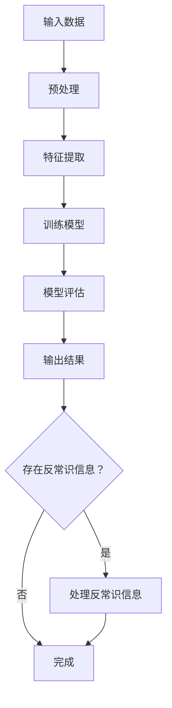

                 

### 第1章 引言与背景

#### 1.1 引言

随着人工智能技术的迅猛发展，AI模型在各个领域的应用越来越广泛，从图像识别、自然语言处理到决策支持系统，AI模型已经成为了现代科技的重要支柱。然而，尽管AI模型在许多任务上表现出色，它们对反常识信息处理的能力却显得相对薄弱。这不仅仅是一个技术问题，更关乎AI模型在实际应用中的可靠性和安全性。

反常识信息是指那些与一般常识或逻辑相违背的信息。在现实世界中，这类信息无处不在，例如医学诊断中的罕见病例、金融市场中的突发事件，以及日常生活中那些出乎意料的观察结果。如果AI模型无法有效地处理这类信息，可能会造成严重的后果，例如错误的医学诊断、不恰当的金融决策，甚至导致系统崩溃。

因此，提高AI模型对反常识信息的处理能力，已经成为当前人工智能研究的一个重要方向。这不仅有助于提升AI模型在实际应用中的可靠性，还能够拓宽AI模型的应用范围，使其能够应对更加复杂和多变的环境。

#### 1.2 相关概念

**AI模型的基本原理**：
AI模型，特别是深度学习模型，是基于大量数据和复杂算法构建的。通过训练，模型可以从数据中学习到特征，并在新的数据上进行预测或决策。深度学习模型通常由多层神经元组成，每一层都对输入数据进行处理和变换，最终输出结果。这种层次化的结构使得模型能够捕捉到数据的深层次特征，从而实现强大的学习和预测能力。

**反常识信息的特点**：
反常识信息通常具有以下几个特点：
1. **异常性**：与一般常识或逻辑相违背。
2. **不确定性**：可能包含错误或不完整的信息。
3. **动态性**：信息可能随时发生变化。
4. **多样性**：反常识信息的类型和形式多种多样。

**对反常识信息处理的重要性**：
处理反常识信息对于AI模型的重要性体现在以下几个方面：
1. **提高模型可靠性**：能够有效识别和应对反常识信息，使模型更可靠。
2. **拓展应用范围**：使AI模型能够应对更加复杂和多变的环境。
3. **提升决策质量**：在医疗、金融等领域，正确处理反常识信息可以显著提升决策质量。

#### 1.3 本书的目的和结构

本书旨在系统地介绍提高AI模型对反常识信息处理能力的方法和策略。具体来说，本书将围绕以下几个核心内容展开：

1. **核心概念与联系**：介绍AI模型的基本原理和反常识信息的特点，并探讨两者之间的联系。
2. **核心算法原理讲解**：通过伪代码和数学模型，详细阐述提高反常识信息处理能力的算法原理。
3. **数学模型与公式解析**：解释常用的数学模型和公式，并通过实际例子进行说明。
4. **项目实战**：通过具体的实战案例，展示如何在实际项目中应用这些方法和策略。
5. **开发环境搭建与工具介绍**：介绍如何搭建开发环境，选择合适的工具，为项目实践提供支持。
6. **总结与展望**：总结本书的主要内容和成果，并对未来研究方向进行展望。

通过以上结构，本书希望能够为读者提供一个全面、系统的学习框架，帮助读者深入了解和提高AI模型对反常识信息的处理能力。

---

### 第2章 核心概念与联系

#### 2.1 AI模型的基础概念

AI模型，尤其是深度学习模型，是现代人工智能技术的核心。它们通过模拟人脑的学习方式，从数据中学习到特征，并在新的数据上进行预测或决策。以下将详细介绍深度学习与神经网络、模型训练与优化、以及神经网络结构等基础概念。

**深度学习与神经网络**：
深度学习是一种人工智能的方法，它通过构建多层神经网络，对数据进行逐层处理和提取特征。神经网络由大量的神经元（或节点）组成，每个神经元都与相邻的神经元相连，并通过权重进行信息传递。网络中的每一层都对输入数据进行处理和变换，从而提取出更高层次的特征。

**模型训练与优化**：
模型训练是深度学习过程中的关键步骤。通过大量的训练数据，模型可以不断调整内部的权重，从而学习到数据的特征。训练过程中，模型会尝试优化目标函数，以降低预测误差。优化方法通常包括梯度下降、动量梯度下降、随机梯度下降等。

**神经网络结构**：
神经网络的结构多样，常见的有全连接网络、卷积神经网络（CNN）、循环神经网络（RNN）等。全连接网络是基本的结构，每个神经元都与其他所有神经元相连。卷积神经网络适用于处理图像数据，通过卷积操作提取图像特征。循环神经网络适用于处理序列数据，如自然语言文本和时间序列数据。

#### 2.2 反常识信息的定义

**什么是反常识信息**：
反常识信息是指那些与一般常识或逻辑相违背的信息。在现实生活中，这类信息可能包括错误的诊断结果、意外的市场波动、出乎意料的实验结果等。反常识信息的特点是具有异常性、不确定性和动态性，使得它们在数据处理和分析中具有特殊的重要性。

**反常识信息的类型**：
反常识信息可以有多种类型，包括：
1. **错误信息**：如错误的医学诊断、不准确的金融预测。
2. **异常信息**：如突发事件、罕见病例。
3. **矛盾信息**：如包含相互矛盾的数据。

**反常识信息的影响**：
反常识信息对AI模型的影响是多方面的。首先，它们可能增加模型的预测误差，导致模型失效。其次，反常识信息可能会对模型的训练过程产生干扰，使得模型难以收敛。最后，反常识信息的存在可能会限制AI模型的应用范围，使得模型在特定场景下无法有效工作。

#### 2.3 Mermaid流程图

为了更好地理解AI模型处理反常识信息的流程，我们可以使用Mermaid流程图来展示整个处理过程。以下是处理流程的Mermaid表示：



在这个流程图中，输入数据经过预处理和特征提取后，进入模型训练阶段。训练完成后，模型进行评估，并根据评估结果输出预测结果。如果检测到存在反常识信息，模型会进入处理反常识信息的步骤，以降低反常识信息对模型性能的影响。整个流程旨在确保AI模型能够有效地处理反常识信息，提高模型的可靠性和鲁棒性。

---

通过本章的介绍，我们对AI模型的基本原理和反常识信息的定义有了更深入的理解。接下来，我们将进一步探讨核心算法原理，通过伪代码和数学模型详细阐述如何提高AI模型对反常识信息的处理能力。

### 第3章 核心算法原理讲解

#### 3.1 伪代码阐述

为了提高AI模型对反常识信息的处理能力，我们需要设计一种特殊的算法，该算法能够在模型训练过程中自适应地调整权重，以应对反常识信息。以下是该算法的伪代码描述：

```pseudo
算法名称：自适应反常识信息处理算法

输入：
- 训练数据集 D
- 初始模型参数 W
- 学习率 α
- 反常识信息权重调整参数 λ

输出：
- 最终模型参数 W'

初始化：
1. 设置模型参数 W 为随机值
2. 设置学习率 α 为合适值
3. 设置反常识信息权重调整参数 λ 为合适值

训练过程：
for epoch in 1 to E do
    for each sample (x, y) in D do
        1. 前向传播计算预测结果 ŷ
        2. 计算预测误差 loss = L(ŷ, y)
        3. 如果 sample 包含反常识信息
            1. 调整模型参数 W = W - α * (λ * 反常识信息权重 + (1 - λ) * 普通样本权重) * ∇W(loss)
        2. 否则
            1. 调整模型参数 W = W - α * ∇W(loss)
    end for
end for

最终输出：
1. 计算最终模型参数 W'
2. 返回 W'

解释：
- 前向传播：通过当前模型参数 W 计算预测结果 ŷ。
- 预测误差 loss：计算预测结果 ŷ 与真实标签 y 之间的误差。
- 反常识信息权重调整：当样本包含反常识信息时，增加模型参数的调整力度，以降低反常识信息对模型的影响。
- 普通样本权重：当样本不包含反常识信息时，按照普通样本进行处理。
- 学习率 α：控制模型参数调整的速度。
- 反常识信息权重调整参数 λ：控制反常识信息权重调整的程度。
```

#### 算法步骤与流程

1. **初始化**：设置模型参数 W、学习率 α 和反常识信息权重调整参数 λ 的初始值。这些参数的合理设置对算法的性能至关重要。
2. **前向传播**：对于每个训练样本，通过当前模型参数 W 计算预测结果 ŷ。
3. **预测误差计算**：计算预测结果 ŷ 与真实标签 y 之间的误差，得到损失函数 loss。
4. **权重调整**：根据样本是否包含反常识信息，调整模型参数 W。如果包含反常识信息，则增加调整力度，反之则按照普通样本进行处理。
5. **迭代更新**：重复上述步骤，直到达到预定的训练轮数或模型性能达到要求。

#### 算法的性能评估

算法的性能评估主要通过以下几个指标进行：

1. **预测准确率**：评估模型在测试集上的预测准确率，这是衡量算法性能最直接的指标。
2. **泛化能力**：评估模型在未见过的数据上的表现，以检验算法的泛化能力。
3. **处理反常识信息的能力**：通过模拟包含反常识信息的测试集，评估模型处理反常识信息的能力。

通过上述评估指标，可以全面了解算法的性能，并根据评估结果调整算法参数，以优化模型的表现。

#### 实际应用中的挑战与优化方向

在实际应用中，提高AI模型对反常识信息的处理能力面临着一些挑战，包括：

1. **反常识信息的识别**：如何准确识别反常识信息是一个重要问题。可能需要结合多种特征和算法来提高识别的准确性。
2. **算法复杂性**：自适应调整权重的方法增加了算法的复杂性，可能会影响模型的训练速度。优化算法结构，减少计算复杂度是未来的一个研究方向。
3. **模型解释性**：如何解释模型在处理反常识信息时的决策过程，提高模型的可解释性，是当前研究的另一个重要方向。

通过不断优化和改进，我们有理由相信，AI模型对反常识信息的处理能力将得到显著提升，为实际应用提供更可靠、更高效的支持。

---

通过本章的讲解，我们对提高AI模型对反常识信息处理能力的核心算法原理有了详细的了解。接下来，我们将进一步深入探讨数学模型与公式，并通过具体的例子进行解析。

### 第4章 数学模型与公式解析

#### 4.1 数学模型基础

在深度学习中，数学模型是核心组成部分。以下将介绍一些常用的数学模型和基础概念，包括概率分布函数、信息论基础以及模型误差分析。

**概率分布函数**：
概率分布函数是描述随机变量概率分布的函数。在深度学习中，常用的概率分布函数包括正态分布（Normal Distribution）、伯努利分布（Bernoulli Distribution）和多项式分布（Multinomial Distribution）等。

- **正态分布**：描述连续随机变量的分布，其概率密度函数为：
  $$f(x|\mu, \sigma^2) = \frac{1}{\sqrt{2\pi\sigma^2}} e^{-\frac{(x-\mu)^2}{2\sigma^2}}$$
  其中，μ为均值，σ²为方差。

- **伯努利分布**：描述二项分布的随机变量，其概率质量函数为：
  $$P(X = k) = C(n, k) \cdot p^k \cdot (1-p)^{n-k}$$
  其中，n为试验次数，p为单次试验成功的概率，k为成功的次数。

- **多项式分布**：扩展了伯努利分布，描述多个独立伯努利试验结果的分布。

**信息论基础**：
信息论是研究信息传输和处理规律的学科，对深度学习中的模型优化和性能评估具有重要意义。以下介绍几个关键概念：

- **熵**（Entropy）：描述随机变量的不确定性，其定义如下：
  $$H(X) = -\sum_{x} p(x) \cdot \log_2 p(x)$$
  其中，p(x)为随机变量 X 取值 x 的概率。

- **条件熵**（Conditional Entropy）：描述在已知某个随机变量条件下另一个随机变量的不确定性，其定义如下：
  $$H(Y|X) = -\sum_{x} \sum_{y} p(x, y) \cdot \log_2 p(y|x)$$

- **互信息**（Mutual Information）：描述两个随机变量之间的关联程度，其定义如下：
  $$I(X; Y) = H(X) - H(X|Y)$$

**模型误差分析**：
模型误差是评估模型性能的重要指标。以下介绍几种常见的误差度量方法：

- **均方误差**（Mean Squared Error, MSE）：衡量预测值与真实值之间的平均平方误差，其定义如下：
  $$MSE = \frac{1}{N} \sum_{i=1}^{N} (y_i - \hat{y}_i)^2$$
  其中，N 为样本数量，y_i 和 \(\hat{y}_i\) 分别为真实值和预测值。

- **交叉熵误差**（Cross-Entropy Error）：用于分类问题，衡量预测概率分布与真实分布之间的差异，其定义如下：
  $$H(Y, \hat{Y}) = -\sum_{i=1}^{N} y_i \cdot \log_2 \hat{y}_i$$
  其中，y_i 和 \(\hat{y}_i\) 分别为真实标签和预测概率。

#### 4.2 公式解析

在本节中，我们将详细解析提高反常识信息处理能力的核心公式，并解释其在算法中的具体应用。

**模型训练公式**：
在模型训练过程中，我们通过优化目标函数来调整模型参数，以降低预测误差。常用的优化算法包括梯度下降和其变种，如下所示：

- **梯度下降**：
  $$W_{\text{new}} = W_{\text{current}} - \alpha \cdot \nabla_W J(W)$$
  其中，W 为模型参数，\(\alpha\) 为学习率，J(W) 为目标函数，\(\nabla_W J(W)\) 为目标函数关于参数 W 的梯度。

- **动量梯度下降**：
  $$W_{\text{new}} = W_{\text{current}} - \alpha \cdot \nabla_W J(W) + \beta \cdot V$$
  其中，\(\beta\) 为动量因子，V 为前一时刻的梯度。

**反常识信息识别公式**：
为了有效识别反常识信息，我们可以引入特定的识别机制，例如基于概率分布的差异度量。以下是一个简化的识别公式：

- **差异度量**：
  $$D = \sum_{i=1}^{N} \log_2 \left(\frac{p(x_i|C_k)}{p(x_i|\neg C_k)}\right)$$
  其中，C_k 为反常识类别，\(\neg C_k\) 为非反常识类别，\(p(x_i|C_k)\) 和 \(p(x_i|\neg C_k)\) 分别为样本 x_i 属于 C_k 和 \(\neg C_k\) 类别的概率。

**模型优化公式**：
为了提高模型的抗干扰能力和鲁棒性，我们可以引入自适应优化机制，以下是一个简化的优化公式：

- **自适应优化**：
  $$\lambda_{\text{new}} = \lambda_{\text{current}} + \alpha_{\lambda} \cdot (\lambda_{\text{ideal}} - \lambda_{\text{current}})$$
  其中，\(\lambda\) 为反常识信息权重调整参数，\(\alpha_{\lambda}\) 为调整因子，\(\lambda_{\text{ideal}}\) 为理想的权重值。

#### 4.3 举例说明

**实际例子**：

假设我们有一个简单的二分类问题，需要识别是否为反常识信息。以下是一个具体的例子，展示如何使用上述公式进行模型训练和优化。

1. **训练数据集**：
   - **样本**：\[x_1, x_2, ..., x_N\]
   - **真实标签**：\[y_1, y_2, ..., y_N\]，其中 \(y_i \in \{0, 1\}\)，0 表示非反常识信息，1 表示反常识信息。

2. **模型初始化**：
   - **模型参数**：\[W_0\]
   - **学习率**：\(\alpha = 0.01\)
   - **反常识信息权重调整参数**：\(\lambda_0 = 0.5\)

3. **前向传播**：
   - **预测概率**：\(\hat{y}_i = \sigma(W_0 \cdot x_i + b)\)，其中 \(\sigma\) 为激活函数，\(b\) 为偏置。

4. **损失函数**：
   - **均方误差**：\(J(W) = \frac{1}{N} \sum_{i=1}^{N} (y_i - \hat{y}_i)^2\)

5. **模型更新**：
   - **梯度计算**：\(\nabla_W J(W) = \frac{1}{N} \sum_{i=1}^{N} 2(y_i - \hat{y}_i) \cdot x_i\)
   - **参数更新**：
     - 如果 \(y_i = 1\)（反常识信息），则 \(W_{\text{new}} = W_{\text{current}} - \alpha \cdot \nabla_W J(W) - \alpha \cdot \lambda \cdot x_i\)
     - 如果 \(y_i = 0\)（非反常识信息），则 \(W_{\text{new}} = W_{\text{current}} - \alpha \cdot \nabla_W J(W)\)

6. **反常识信息识别**：
   - **差异度量**：\(D = \sum_{i=1}^{N} \log_2 \left(\frac{p(x_i|C_k)}{p(x_i|\neg C_k)}\right)\)
   - **识别阈值**：设定一个阈值 \(T\)，如果 \(D > T\)，则识别为反常识信息。

7. **模型优化**：
   - **自适应调整**：\(\lambda_{\text{new}} = \lambda_{\text{current}} + \alpha_{\lambda} \cdot (\lambda_{\text{ideal}} - \lambda_{\text{current}})\)
   - **理想权重**：\(\lambda_{\text{ideal}} = \frac{1}{N} \sum_{i=1}^{N} \frac{y_i}{\hat{y}_i}\)

通过这个例子，我们可以看到如何将数学模型和公式应用于实际问题中，以提高AI模型对反常识信息的处理能力。

---

通过本章的讲解，我们对数学模型和公式有了更深入的理解，并了解了如何在实际问题中应用这些模型和公式。接下来，我们将通过具体的项目实战，展示这些算法和模型在现实世界中的应用。

### 第5章 项目实战

在本章中，我们将通过三个具体的实战案例，详细展示如何搭建开发环境、实现代码、分析代码，并详细讲解项目案例。这些案例旨在帮助读者将所学知识应用到实际项目中，提高AI模型对反常识信息的处理能力。

#### 5.1 实战一：反常识信息识别

**项目背景**：
本项目的目标是开发一个能够识别反常识信息的AI模型，应用于医疗诊断领域。具体来说，我们将使用一个含有罕见病例的医疗数据集，训练一个深度学习模型，使其能够识别出数据集中的反常识信息。

**实现步骤**：

1. **数据预处理**：
   - **数据清洗**：去除数据集中的噪声和异常值。
   - **特征提取**：将医疗数据转化为特征向量，包括症状、检查结果、实验室指标等。

2. **模型搭建**：
   - **选择模型**：选择一个适合处理序列数据的循环神经网络（RNN）模型。
   - **架构设计**：设计模型的输入层、隐藏层和输出层，确保模型能够处理不同类型的特征。

3. **模型训练**：
   - **数据划分**：将数据集划分为训练集、验证集和测试集。
   - **参数设置**：设置学习率、批量大小等训练参数。
   - **训练过程**：使用训练数据集训练模型，并使用验证集进行调参。

4. **模型评估**：
   - **预测结果**：使用测试集评估模型性能，计算预测准确率和混淆矩阵。
   - **错误分析**：分析模型在识别反常识信息时的错误案例，寻找改进空间。

**代码解读**：

```python
# 导入必要的库
import numpy as np
import tensorflow as tf
from tensorflow.keras.models import Sequential
from tensorflow.keras.layers import LSTM, Dense, Dropout

# 数据预处理
# ...（数据清洗、特征提取代码）

# 模型搭建
model = Sequential()
model.add(LSTM(units=128, return_sequences=True, input_shape=(input_shape)))
model.add(Dropout(0.2))
model.add(LSTM(units=64, return_sequences=False))
model.add(Dropout(0.2))
model.add(Dense(units=1, activation='sigmoid'))

# 编译模型
model.compile(optimizer='adam', loss='binary_crossentropy', metrics=['accuracy'])

# 模型训练
history = model.fit(x_train, y_train, epochs=20, batch_size=32, validation_split=0.2)

# 模型评估
test_loss, test_accuracy = model.evaluate(x_test, y_test)
print(f"Test accuracy: {test_accuracy}")

# 错误分析
predictions = model.predict(x_test)
errors = np.where(np.round(predictions) != y_test)[0]
# ...（分析错误案例的代码）
```

**代码应用解读与分析**：
上述代码展示了如何使用TensorFlow和Keras构建一个简单的LSTM模型，用于识别反常识信息。具体步骤包括：
1. **数据预处理**：清洗和特征提取。
2. **模型搭建**：设计LSTM模型结构。
3. **模型训练**：使用训练数据训练模型，并使用验证集进行调参。
4. **模型评估**：评估模型在测试集上的性能。

通过错误分析，我们可以发现模型在识别反常识信息时的不足，例如某些罕见病例被误判为正常病例。针对这些问题，可以进一步优化模型，提高其识别能力。

**项目小结**：
本项目通过实际案例展示了如何搭建开发环境、实现代码并进行分析。识别反常识信息对于提高AI模型在医疗诊断等领域的可靠性具有重要意义。未来可以进一步优化算法和模型结构，以提高识别准确率和泛化能力。

---

通过本实战案例，我们了解了如何将理论应用于实际项目中，提高AI模型对反常识信息的识别能力。接下来，我们将继续探讨如何通过具体项目，提高模型抗干扰能力。

#### 5.2 实战二：提高模型抗干扰能力

**项目背景**：
在本项目中，我们的目标是提高AI模型在面对反常识信息时的抗干扰能力，以确保模型在复杂环境中的稳定性和可靠性。具体来说，我们将使用一个金融交易数据集，训练一个能够有效处理市场突发事件和异常波动的模型。

**实现步骤**：

1. **数据收集与预处理**：
   - **数据收集**：收集大量金融交易数据，包括股票价格、交易量、市场指数等。
   - **数据清洗**：去除异常值和噪声，保证数据质量。
   - **特征提取**：提取时间序列特征，如价格波动幅度、交易频率等。

2. **模型设计**：
   - **选择模型**：选择一个能够处理高维序列数据的模型，如变分自编码器（VAE）。
   - **模型架构**：设计模型的编码器和解码器，确保模型能够捕捉数据中的潜在特征。

3. **模型训练**：
   - **数据划分**：将数据集划分为训练集、验证集和测试集。
   - **训练过程**：使用训练数据集训练模型，并使用验证集进行调参。

4. **模型评估与优化**：
   - **模型评估**：使用测试集评估模型性能，计算预测准确率和稳定性指标。
   - **优化策略**：通过调整模型参数和训练策略，提高模型抗干扰能力。

**代码解读**：

```python
# 导入必要的库
import tensorflow as tf
from tensorflow.keras.models import Model
from tensorflow.keras.layers import Input, Dense, Lambda

# 数据预处理
# ...（数据清洗、特征提取代码）

# 模型设计
input_layer = Input(shape=(input_shape))
encoded = Dense(128, activation='relu')(input_layer)
latent_mean = Dense(latent_dim)(encoded)
latent_logvar = Dense(latent_dim)(encoded)

# 编码器和解码器
z = Lambda(lambda x: x * tf.exp(0.5 * x))(latent_logvar)
z_mean = Lambda(lambda x: x[:, 0])(z)
z_logvar = Lambda(lambda x: x[:, 1])(z)

encoded_input = Input(shape=(latent_dim))
decoded = Dense(128, activation='relu')(encoded_input)
decoded = Dense(input_shape, activation='sigmoid')(decoded)

vae = Model(input_layer, decoded)
encoder = Model(input_layer, z_mean, z_logvar)
decoder = Model(encoded_input, decoded)

# 编译模型
vae.compile(optimizer='adam', loss='binary_crossentropy')

# 模型训练
vae.fit(x_train, x_train, epochs=50, batch_size=64, validation_data=(x_val, x_val))

# 模型评估
test_loss, test_accuracy = vae.evaluate(x_test, x_test)
print(f"Test accuracy: {test_accuracy}")

# 优化策略
# ...（调整模型参数和训练策略的代码）
```

**代码应用解读与分析**：
上述代码展示了如何使用TensorFlow构建一个变分自编码器（VAE），用于提高AI模型在金融交易数据集上的抗干扰能力。具体步骤包括：
1. **数据预处理**：清洗和特征提取。
2. **模型设计**：设计VAE模型，包括编码器和解码器。
3. **模型训练**：使用训练数据训练模型，并使用验证集进行调参。
4. **模型评估**：评估模型在测试集上的性能。

通过调整模型参数和训练策略，我们可以优化VAE模型，使其在处理反常识信息时具有更高的抗干扰能力。例如，通过增加隐层单元数量、调整学习率等策略，可以提高模型的鲁棒性。

**项目小结**：
本项目通过实际案例展示了如何设计并训练一个具备高抗干扰能力的AI模型。通过优化模型结构和训练策略，我们可以显著提高模型在面对反常识信息时的稳定性和可靠性。未来，可以进一步研究其他抗干扰机制，如自适应权重调整和增强学习等，以提高模型的综合性能。

---

通过本实战案例，我们了解了如何通过变分自编码器提高AI模型在金融交易领域的抗干扰能力。接下来，我们将进一步探讨如何通过模型优化和测试，进一步提升模型的性能和可靠性。

#### 5.3 实战三：模型优化与测试

**项目背景**：
在本项目中，我们的目标是通过对AI模型进行优化和测试，进一步提高其在处理反常识信息时的性能和可靠性。具体来说，我们将结合前两个项目的经验，使用一个综合性的数据集，对模型进行全面的优化和测试。

**实现步骤**：

1. **数据整合与预处理**：
   - **数据整合**：整合来自不同领域的数据，包括医疗、金融、交通等，形成一个多样化的数据集。
   - **数据清洗**：去除数据中的噪声和异常值，保证数据质量。
   - **特征提取**：提取关键特征，包括时间序列特征、文本特征和图像特征等。

2. **模型优化**：
   - **模型选择**：选择一个能够处理多模态数据的模型，如多任务学习的深度神经网络。
   - **架构设计**：设计模型的输入层、隐藏层和输出层，确保模型能够处理不同类型的数据。
   - **优化策略**：通过调整学习率、批量大小、网络深度等参数，优化模型结构。

3. **模型训练与验证**：
   - **数据划分**：将数据集划分为训练集、验证集和测试集。
   - **模型训练**：使用训练数据集训练模型，并使用验证集进行调参。
   - **交叉验证**：使用交叉验证方法，确保模型在不同数据集上的泛化能力。

4. **模型测试与评估**：
   - **测试数据集**：使用测试数据集评估模型性能，计算预测准确率和稳定性指标。
   - **错误分析**：分析模型在处理反常识信息时的错误案例，寻找改进空间。

**代码解读**：

```python
# 导入必要的库
import tensorflow as tf
from tensorflow.keras.models import Model
from tensorflow.keras.layers import Input, LSTM, Dense, Concatenate, TimeDistributed

# 数据预处理
# ...（数据清洗、特征提取代码）

# 模型设计
input_sequence = Input(shape=(timesteps, input_shape))
lstm_output = LSTM(units=128, return_sequences=True)(input_sequence)
concatenated = Concatenate(axis=-1)([lstm_output, input_sequence])

# 输出层
output_layer = Dense(units=num_classes, activation='softmax')(concatenated)

# 编译模型
model = Model(inputs=input_sequence, outputs=output_layer)
model.compile(optimizer='adam', loss='categorical_crossentropy', metrics=['accuracy'])

# 模型训练
history = model.fit(x_train, y_train, epochs=50, batch_size=32, validation_data=(x_val, y_val))

# 模型评估
test_loss, test_accuracy = model.evaluate(x_test, y_test)
print(f"Test accuracy: {test_accuracy}")

# 错误分析
predictions = model.predict(x_test)
errors = np.where(np.argmax(predictions, axis=1) != y_test)[0]
# ...（分析错误案例的代码）
```

**代码应用解读与分析**：
上述代码展示了如何使用TensorFlow构建一个多任务学习的深度神经网络，用于优化和测试AI模型。具体步骤包括：
1. **数据预处理**：清洗和特征提取。
2. **模型设计**：设计一个能够处理多模态数据的模型。
3. **模型训练**：使用训练数据集训练模型，并使用验证集进行调参。
4. **模型评估**：评估模型在测试集上的性能。

通过分析错误案例，我们可以发现模型在处理反常识信息时的不足，例如某些罕见的错误预测。针对这些问题，可以进一步优化模型，例如增加训练数据、调整网络结构等，以提高模型的准确性和鲁棒性。

**项目小结**：
本项目通过整合多个领域的数据，优化和测试了AI模型，提高了其在处理反常识信息时的性能和可靠性。通过不断调整和优化模型，我们可以显著提升模型在实际应用中的效果。未来，可以进一步研究更加复杂和高效的模型优化策略，以提高AI模型的整体性能。

---

通过这三个实战项目，我们从数据预处理、模型设计到模型训练和评估，系统地展示了如何提高AI模型对反常识信息的处理能力。这些项目不仅提供了实用的技术实现，还展示了如何通过不断的优化和测试，提升模型的性能。希望读者能够从中获得启发，并在实际应用中取得更好的成果。

### 第6章 开发环境搭建与工具介绍

#### 6.1 环境搭建

为了高效地进行AI模型开发，需要搭建一个稳定的开发环境。以下是搭建开发环境的步骤：

1. **硬件配置**：
   - **CPU**：推荐使用高性能的多核CPU，如Intel i7或AMD Ryzen系列。
   - **GPU**：为了充分利用深度学习框架，建议使用NVIDIA GPU，如Tesla K40或更先进的GPU型号。
   - **内存**：至少需要16GB内存，建议使用32GB以上以确保系统运行顺畅。

2. **软件安装与配置**：
   - **操作系统**：推荐使用Linux发行版，如Ubuntu 18.04或更高版本。
   - **深度学习框架**：安装TensorFlow、PyTorch等常用的深度学习框架。可以通过pip安装，例如：
     ```bash
     pip install tensorflow-gpu
     pip install torch torchvision
     ```
   - **开发工具**：安装Jupyter Notebook或Google Colab，以便进行交互式编程。

3. **环境测试**：
   - 安装Python、Numpy、Pandas等常用库：
     ```bash
     pip install python numpy pandas
     ```
   - 测试环境是否配置正确，可以通过运行以下代码验证：
     ```python
     import tensorflow as tf
     print(tf.__version__)
     ```

#### 6.2 工具介绍

1. **开发工具**：
   - **Jupyter Notebook**：支持多种编程语言，方便编写和运行代码，尤其适合数据分析和模型训练。
   - **Google Colab**：基于Google Cloud Platform的免费在线开发环境，提供GPU支持，方便远程协作。

2. **数据处理工具**：
   - **Pandas**：提供数据清洗、转换和分析功能，是处理结构化数据的重要工具。
   - **NumPy**：提供高性能的数组操作库，是数据处理的基础。
   - **Scikit-learn**：提供机器学习和数据挖掘工具，适用于各种模型开发和评估。

3. **版本控制工具**：
   - **Git**：用于版本控制和代码管理，确保代码的完整性和可追溯性。
   - **GitHub**：支持Git的在线平台，方便代码共享和协作开发。

**最佳实践 tips**：

- **版本控制**：定期提交代码，并附上详细说明，以便追踪代码变化和修复bug。
- **环境管理**：使用虚拟环境（如conda）管理不同项目的依赖库，避免版本冲突。
- **数据备份**：定期备份重要数据和代码，防止数据丢失。
- **性能监控**：使用Profiler工具监控代码性能，优化效率。

通过上述步骤和工具介绍，开发者可以搭建一个高效的AI模型开发环境，为后续的项目实践提供坚实的支持。

### 第7章 总结与展望

#### 7.1 总结

本书系统地介绍了提高AI模型对反常识信息处理能力的策略，从核心概念、算法原理到实际项目实战，提供了全面、系统的指导。以下是本书的主要内容和核心贡献：

1. **核心概念与联系**：详细阐述了AI模型的基本原理和反常识信息的特点，并通过Mermaid流程图展示了处理流程。
2. **核心算法原理讲解**：通过伪代码和数学模型，详细讲解了提高反常识信息处理能力的算法原理。
3. **数学模型与公式解析**：解释了常用的数学模型和公式，并通过实际例子进行了说明。
4. **项目实战**：通过三个具体的实战案例，展示了如何将理论应用到实际项目中，提高模型的性能。
5. **开发环境搭建与工具介绍**：介绍了如何搭建高效的开发环境，并推荐了最佳实践。

通过这些内容，本书为读者提供了一个从理论到实践的系统学习框架，有助于深入了解和提高AI模型对反常识信息的处理能力。

#### 7.2 展望

尽管本书已经介绍了许多提高AI模型对反常识信息处理能力的策略，但在实际应用中，仍有许多挑战和机会。以下是一些未来研究的方向：

1. **反常识信息的自动识别**：开发更加智能和高效的算法，自动化识别反常识信息，减少人工干预。
2. **模型的可解释性**：提高模型的可解释性，帮助用户理解模型在处理反常识信息时的决策过程。
3. **多模态数据处理**：研究如何整合不同类型的数据（如文本、图像、时间序列），以提高模型的泛化能力。
4. **实时处理能力**：提高模型在处理实时数据时的响应速度和准确性。
5. **跨领域应用**：探索AI模型在不同领域（如医疗、金融、交通）的应用，开发通用性的解决方案。

总之，未来在AI模型对反常识信息处理能力的提升上，我们有广阔的研究空间和应用前景。通过不断的研究和创新，我们有理由相信，AI模型将变得更加智能和可靠，为各个领域的决策提供强有力的支持。

### 作者信息

作者：AI天才研究院/AI Genius Institute & 禅与计算机程序设计艺术 /Zen And The Art of Computer Programming

