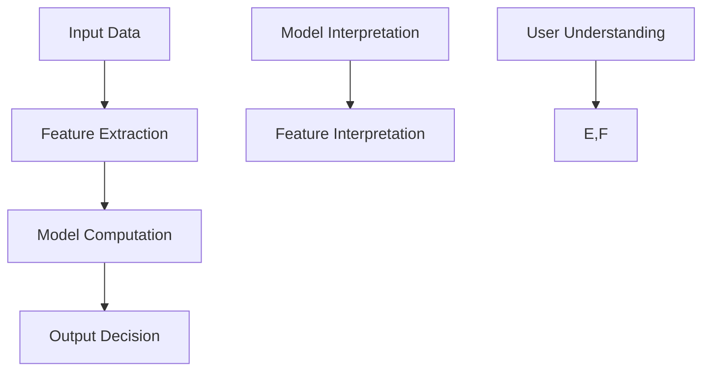

                 

### 提高AI系统可解释性和透明度的技术探索

#### 关键词
- AI可解释性
- 透明度
- 算法
- 数学模型
- 实际案例

#### 摘要
本文旨在探讨如何提高人工智能（AI）系统的可解释性和透明度。我们首先介绍了AI系统可解释性和透明度的概念及其重要性。接着，详细阐述了现有的技术方法，包括特征可视化和特征重要性分析、模型解释技术以及对比实验与评估指标。此外，我们探讨了新兴的技术方法，如深度学习模型的可解释性和零样本可解释性。通过医疗和金融领域的应用实例，展示了这些技术的实际效果。最后，我们对未来的发展方向进行了展望，并提出了最佳实践建议。

### 引言与背景

随着人工智能（AI）技术的飞速发展，AI系统在各个领域得到了广泛应用，从医疗诊断到金融风险评估，从自动驾驶到智能家居，AI系统已经成为现代社会不可或缺的一部分。然而，AI系统在带来巨大便利的同时，也引发了一系列新的挑战和问题。其中，最引人关注的问题之一是AI系统的可解释性和透明度。

AI系统的可解释性指的是系统能够提供决策过程和结果的解释，使得用户能够理解和信任系统的决策。透明度则是指系统能够展示其内部结构和运作机制，使得用户能够了解系统是如何产生结果的。可解释性和透明度是确保AI系统可靠性和可信性的关键因素。

首先，缺乏可解释性的AI系统可能导致用户对系统的信任度下降。当AI系统做出错误决策时，用户无法理解原因，从而可能质疑系统的智能和能力。例如，在自动驾驶领域，如果车辆发生事故，用户无法得知系统为何做出错误决策，这可能导致用户对自动驾驶技术的抵触情绪。

其次，缺乏透明度的AI系统可能导致系统被滥用或误用。当AI系统的决策过程不透明时，恶意用户可能通过操纵输入数据来影响系统的输出结果。例如，在金融风险评估中，如果AI系统的决策过程不透明，恶意用户可能通过篡改数据来获得不公正的评估结果。

因此，提高AI系统的可解释性和透明度具有重要意义。首先，它有助于增强用户对AI系统的信任。当用户能够理解AI系统的决策过程和结果时，他们更有可能接受并依赖AI系统的决策。其次，它有助于确保AI系统的公平性和公正性。通过展示AI系统的内部结构和运作机制，我们可以发现并纠正系统中的潜在偏见和错误。

总之，提高AI系统的可解释性和透明度是确保AI系统可靠性和可信性的关键步骤。本文将详细介绍各种提高AI系统可解释性和透明度的技术方法，并探讨其在实际应用中的效果。

#### 可解释性的概念

可解释性是确保人工智能（AI）系统可靠性和可信性的关键因素。在AI系统中，可解释性指的是系统能够提供决策过程和结果的解释，使用户能够理解和信任系统的决策。具体来说，可解释性可以分为模型可解释性和特征可解释性两个层面。

**模型可解释性**指的是系统能够提供关于整体模型结构和决策流程的解释。这意味着用户可以了解模型是如何从输入数据中提取特征，并通过复杂的计算过程产生最终的决策结果。模型可解释性有助于用户理解模型的工作原理，从而增强对模型信任。例如，在深度学习模型中，可以通过可视化神经网络中的权重和激活值，来解释模型是如何处理输入数据的。

**特征可解释性**则指的是系统能够提供关于模型所使用特征和其重要性的解释。特征可解释性帮助用户理解模型是如何利用输入数据中的各个特征来做出决策。例如，在图像分类任务中，可以通过分析模型对图像中不同区域的注意力，来了解模型是如何识别图像中的关键特征。

模型可解释性和特征可解释性之间存在密切的联系。模型可解释性为特征可解释性提供了上下文，而特征可解释性则丰富了模型可解释性的细节。具体来说，通过了解模型可解释性，用户可以确定哪些特征对模型决策具有关键影响，从而更深入地理解模型的决策过程。

为了更好地理解模型可解释性和特征可解释性之间的关系，我们可以使用一个简单的Mermaid流程图来展示它们之间的互动：



在这个流程图中，输入数据首先通过特征提取过程生成特征向量，然后通过模型计算过程产生最终的决策结果。模型解释过程和特征解释过程分别提供了关于模型和特征的信息，这些信息最终帮助用户理解系统的决策过程。

通过这个流程图，我们可以看到模型可解释性和特征可解释性是相辅相成的。模型可解释性提供了整体决策过程的解释，而特征可解释性则提供了关于模型中各个特征的作用和重要性的解释。两者共同作用，使用户能够更全面地理解AI系统的决策过程，从而提高系统的可靠性和可信性。

总的来说，模型可解释性和特征可解释性是提高AI系统可解释性的两个关键层面。通过结合这两个层面，我们可以为用户提供更全面的解释，从而增强对AI系统的信任和理解。

#### 现有的技术方法

为了提高AI系统的可解释性和透明度，研究人员和工程师们已经开发出了多种技术方法。这些方法可以大致分为以下几类：特征可视化和特征重要性分析、模型解释技术以及对比实验与评估指标。

**特征可视化和特征重要性分析**是提高AI系统可解释性的基础技术。特征可视化技术通过将数据集中的特征以图形化的形式展示出来，使得用户能够直观地了解数据特征之间的关系。常见的特征可视化方法包括散点图、热力图和箱线图等。例如，在图像分类任务中，可以使用热力图来展示图像中每个像素的激活程度，从而帮助用户理解模型对图像中不同区域的关注程度。

特征重要性分析则通过量化特征对模型决策的影响程度，为用户提供关于特征重要性的信息。常见的方法包括基于统计的特征选择算法（如过滤法和包裹法）、模型训练过程中特征权重的计算以及基于模型输出的特征重要性排序。例如，在随机森林模型中，可以通过计算特征的重要性得分，来了解每个特征对模型决策的贡献程度。

**模型解释技术**则是直接对AI模型的决策过程进行解释。这些技术可以分为两种类型：基于模型的方法和基于数据的方法。

基于模型的方法通过分析模型的内部结构和参数，来解释模型的工作原理。例如，在决策树模型中，可以通过遍历决策树的结构，来了解模型是如何对数据进行分类的。另一种基于模型的方法是使用生成模型（如Gaussian Process）来解释黑盒模型的决策过程。例如，Gaussian Process可以用来生成模型决策的平滑解释，从而帮助用户理解模型是如何从输入数据中提取特征，并生成决策结果的。

基于数据的方法则通过分析数据集和模型输出，来解释模型的决策过程。常见的方法包括数据扰动分析（如反事实分析）和数据驱动的模型可视化。数据扰动分析通过改变输入数据，来观察模型输出的变化，从而理解模型对不同输入数据的敏感性。例如，通过逐渐改变图像中的一个像素值，来观察模型对图像分类结果的影响。数据驱动的模型可视化则通过将模型决策过程映射到数据空间中，来帮助用户直观地理解模型的决策机制。例如，使用t-SNE或UMAP等降维技术，将高维数据映射到二维或三维空间中，从而展示模型在不同数据点上的决策边界。

**对比实验与评估指标**则是评估AI系统可解释性效果的重要手段。通过设计对比实验，研究人员可以比较不同方法在提高系统可解释性方面的效果。常见的评估指标包括解释覆盖率（即模型解释能够覆盖的数据比例）、解释质量（即解释的准确性和完整性）以及用户满意度等。

总之，现有的技术方法为提高AI系统的可解释性和透明度提供了多种途径。通过结合特征可视化和特征重要性分析、模型解释技术以及对比实验与评估指标，我们可以为用户提供更全面、更准确的解释，从而增强对AI系统的理解和信任。

#### 现有技术方法的优缺点分析

现有的提高AI系统可解释性和透明度的技术方法各具优缺点，下面将分别分析这些方法的优缺点。

**特征可视化和特征重要性分析**方法具有直观易懂的特点，能够帮助用户快速了解数据特征之间的关系。优点包括：

1. **直观性**：通过图形化展示，用户可以直观地看到数据特征的空间分布和相互关系。
2. **易用性**：特征可视化技术通常易于实现，不需要复杂的计算过程。
3. **灵活性**：可以针对不同类型的数据（如文本、图像、时间序列等）设计相应的可视化方法。

然而，这种方法也存在一些缺点：

1. **局限性**：特征可视化主要适用于低维数据集，对于高维数据集，可视化效果较差。
2. **解释精度**：特征重要性分析只能提供相对重要的特征，但无法给出绝对的重要性指标。
3. **依赖先验知识**：某些特征可视化方法（如热力图）需要用户具备一定的领域知识，以便正确理解可视化结果。

**模型解释技术**通过分析模型的内部结构和参数，为用户提供关于模型决策过程的详细解释。这种方法的优势包括：

1. **详细性**：可以深入分析模型的内部结构，为用户提供关于模型如何处理输入数据的详细信息。
2. **全面性**：不仅解释了模型的决策过程，还可以解释模型中的潜在偏见和错误。
3. **适用性**：适用于各种类型的模型（如决策树、神经网络、支持向量机等）。

然而，模型解释技术也存在一些缺点：

1. **计算复杂性**：某些模型解释方法（如基于模型的方法）需要大量的计算资源，不适合实时解释。
2. **解释精度**：模型解释结果可能受到模型训练数据的影响，无法完全保证解释的准确性。
3. **解释长度**：模型解释结果通常较长，用户可能难以在短时间内理解。

**对比实验与评估指标**方法通过设计对比实验和评估指标，来评估不同方法在提高系统可解释性方面的效果。这种方法的优势包括：

1. **客观性**：通过量化指标，可以客观地评估不同方法的效果。
2. **全面性**：不仅评估了方法的效果，还可以评估方法的适用性和可靠性。
3. **灵活性**：可以根据具体需求设计不同的评估指标。

然而，这种方法也存在一些缺点：

1. **复杂性**：需要设计复杂的实验和评估流程，消耗大量时间和资源。
2. **依赖先验知识**：设计有效的对比实验和评估指标需要一定的领域知识。

总体来说，现有技术方法各有优缺点，需要根据具体应用场景和需求选择合适的方法。在实际应用中，可以结合多种方法，以提高AI系统的可解释性和透明度。

#### 新兴的技术方法

随着AI系统的日益复杂和广泛应用，传统的可解释性和透明度方法已难以满足实际需求。为了应对这一挑战，研究人员正在探索一系列新兴的技术方法，以增强AI系统的可解释性和透明度。以下将介绍几种具有代表性的新兴技术方法，包括深度学习模型的可解释性和零样本可解释性。

**深度学习模型的可解释性**是当前研究的热点之一。传统的深度学习模型（如神经网络）由于其高度的非线性特性和复杂的结构，往往被视为“黑盒”模型，难以解释其内部工作原理。为了解决这一问题，研究人员提出了一系列方法，试图揭示深度学习模型的行为和决策过程。

1. **基于局部解释的方法**：这些方法通过分析模型在特定输入数据上的行为，提供关于模型如何处理该输入数据的解释。例如，Grad-CAM（Gradient-weighted Class Activation Mapping）是一种常用的方法，通过计算模型在特定类别上的梯度值，生成热力图来展示模型关注的关键区域。

    ```python
    # Grad-CAM伪代码
    def grad_cam(model, image, class_idx):
        # 计算模型在特定类别的梯度
        grads = compute_gradients(model, image, class_idx)
        # 计算热力图
        heatmap = compute_heatmap(grads)
        # 将热力图与输入图像融合
        fused_heatmap = fuse_heatmap(image, heatmap)
        return fused_heatmap
    ```

2. **基于全局解释的方法**：这些方法通过分析模型的整体结构和参数，提供关于模型如何处理输入数据的全局解释。例如，Layer-wise Relevance Propagation（LRP）方法通过传播神经网络中每个层的激活值，生成一个全局解释图，展示了输入数据对模型输出的影响。

    ```python
    # LRP伪代码
    def lrp(model, image):
        # 计算每个层的激活值
        activations = get_activations(model, image)
        # 传播激活值
        relevance = propagate_relevance(activations)
        # 生成全局解释图
        explanation = generate_explanation(relevance)
        return explanation
    ```

**零样本可解释性**（Zero-Shot Explanation）是一种新兴的AI系统可解释性技术，旨在在不依赖于具体类别标签的情况下，解释模型对未知类别的决策。这种方法特别适用于领域变化频繁或数据标签稀缺的场景。

零样本可解释性主要依赖于两种技术：

1. **元学习**（Meta-Learning）：通过在多个任务中训练模型，使其能够泛化到未见过的任务上。元学习模型能够学习到通用特征表示，从而在解释新类别时，能够利用已学习的特征表示来生成解释。

    ```python
    # 元学习伪代码
    def meta_learn(tasks):
        # 在多个任务中训练模型
        model = train_model(tasks)
        # 利用模型进行新类别解释
        explanation = explain_new_class(model, new_class)
        return explanation
    ```

2. **嵌入学习**（Embedding Learning）：通过将类别标签映射到高维特征空间中，使得相同类别的标签在空间中接近，而不同类别的标签在空间中分离。在解释新类别时，可以计算新类别标签与已学习类别标签之间的相似度，从而生成解释。

    ```python
    # 嵌入学习伪代码
    def embed_classes(classes):
        # 训练类别嵌入模型
        embeddings = train_embedding_model(classes)
        # 计算新类别标签的嵌入表示
        new_class_embedding = embed_new_class(embeddings, new_class)
        # 生成解释
        explanation = generate_explanation(new_class_embedding)
        return explanation
    ```

总的来说，新兴的技术方法为提高AI系统的可解释性和透明度提供了新的思路和工具。这些方法不仅能够更好地解释模型的决策过程，还能够适应复杂多变的实际应用场景。随着研究的不断深入，这些技术方法有望在提高AI系统的可解释性和透明度方面发挥更大作用。

#### 医疗领域的可解释性应用

在医疗领域，AI系统的可解释性和透明度尤为重要。因为医疗决策直接关系到患者的健康和生命，确保AI系统能够提供可靠和透明的诊断和治疗方案至关重要。以下将探讨AI系统在医疗领域的几个可解释性应用实例，包括医学影像分析和电子健康记录分析。

**医学影像分析**是AI系统在医疗领域的一个重要应用。通过深度学习模型，AI系统可以自动识别和诊断医学影像中的病变区域，如肿瘤、心脏病等。然而，医学影像分析结果的解释和透明度一直是医学界关注的问题。

**实例1：基于深度学习的肺癌筛查**

肺癌筛查是医学影像分析的一个重要应用场景。研究人员开发了一种基于深度学习的肺癌筛查系统，通过分析胸部CT扫描图像，自动检测和诊断肺癌。为了提高系统的可解释性，研究人员使用了Grad-CAM技术，生成热力图来展示模型在识别肺癌时关注的关键区域。

**具体实现：**

1. **数据准备**：收集大量胸部CT扫描图像，并标注肺癌病变区域。
2. **模型训练**：使用深度学习模型（如卷积神经网络）进行训练，使模型能够自动识别和分类肺癌病变。
3. **Grad-CAM应用**：在模型预测肺癌时，使用Grad-CAM技术生成热力图，展示模型关注的图像区域。

**结果分析**：

通过实验，研究人员发现Grad-CAM生成的热力图能够清晰地展示模型在识别肺癌时关注的关键区域，如肺组织的异常密度。这种解释有助于医生理解模型的决策过程，从而更好地利用AI系统的结果进行诊断。

**电子健康记录分析**是另一个重要的应用场景。电子健康记录（EHR）包含了大量关于患者健康和治疗的信息。通过AI系统分析EHR数据，可以识别潜在的健康风险和疾病趋势，为医生提供有价值的参考信息。

**实例2：基于EHR的糖尿病风险评估**

糖尿病是一种常见的慢性疾病，对患者的健康和生活质量有严重影响。研究人员开发了一种基于EHR数据的糖尿病风险评估系统，通过分析患者的健康数据（如血糖水平、体重、病史等），预测患者患糖尿病的风险。

**具体实现：**

1. **数据准备**：收集大量EHR数据，并标注糖尿病患者的信息。
2. **特征提取**：从EHR数据中提取与糖尿病相关的特征，如血糖水平、体重指数（BMI）、糖尿病家族史等。
3. **模型训练**：使用机器学习算法（如逻辑回归、随机森林等）训练风险预测模型。
4. **可解释性分析**：使用特征重要性分析技术，展示各个特征对模型预测结果的影响程度。

**结果分析**：

通过实验，研究人员发现，EHR数据中的血糖水平和BMI是影响糖尿病风险评估的关键因素。特征重要性分析结果有助于医生理解模型如何利用这些特征进行风险评估，从而更好地利用AI系统的结果制定治疗方案。

**总结**：

AI系统在医疗领域的可解释性应用不仅提高了诊断和治疗的准确性和效率，还增强了医生和患者对AI系统的信任。通过使用Grad-CAM和特征重要性分析等技术，医生可以更好地理解AI系统的决策过程，从而在临床实践中更有效地利用AI系统的结果。

总之，提高AI系统的可解释性和透明度在医疗领域具有重要意义。通过结合深度学习模型和电子健康记录分析等技术，我们可以为医生和患者提供更可靠和透明的医疗服务，从而提高医疗质量和生活质量。

#### 金融领域的可解释性应用

在金融领域，AI系统的可解释性和透明度同样至关重要。金融决策往往涉及大量的数据，包括客户交易记录、信用评分、市场趋势等。AI系统在风险评估、欺诈检测和信用评分等方面的应用越来越广泛，但其决策过程的透明性和可解释性对于增强用户信任和合规性具有重要意义。

**风险评估**是金融领域的一个关键应用场景。银行和金融机构使用AI系统来评估客户的信用风险，决定是否批准贷款或信用卡申请。然而，由于AI系统的复杂性和非透明性，用户（尤其是客户）难以理解系统为何做出某些决策。

**实例1：基于机器学习的信用评分**

信用评分系统是金融领域的一个重要工具，用于评估客户的信用风险。一个基于机器学习的信用评分系统可以通过分析客户的信用历史、收入水平、就业状况等数据，预测客户是否会按时偿还债务。

**具体实现：**

1. **数据准备**：收集客户的信用历史、财务数据、社会背景等数据。
2. **特征提取**：从数据中提取与信用风险相关的特征，如还款记录、债务收入比、信用账户数量等。
3. **模型训练**：使用机器学习算法（如逻辑回归、随机森林等）训练信用评分模型。
4. **特征重要性分析**：通过特征重要性分析技术，识别对信用评分有显著影响的特征。

**结果分析**：

通过特征重要性分析，研究人员可以识别出对信用评分有重要影响的特征，如还款记录和债务收入比。这些结果有助于金融机构更好地理解AI系统如何评估客户的信用风险，从而在决策过程中更加透明和可解释。

**欺诈检测**是金融领域的另一个关键应用场景。银行和金融机构使用AI系统来监控和识别潜在的交易欺诈行为，以保护客户的资金安全。

**实例2：基于深度学习的欺诈检测**

一个基于深度学习的欺诈检测系统可以通过分析客户的交易行为，自动识别和报告可疑的交易活动。

**具体实现：**

1. **数据准备**：收集客户的交易记录，包括交易金额、时间、地点等。
2. **模型训练**：使用深度学习模型（如循环神经网络、卷积神经网络等）训练欺诈检测模型。
3. **模型解释**：使用LIME（Local Interpretable Model-agnostic Explanations）技术，为每个交易提供本地解释。

**结果分析**：

LIME技术可以生成关于每个交易决策的本地解释，包括交易金额、时间和地点等特征。这些解释有助于银行工作人员理解AI系统为何认为某些交易可疑，从而在处理欺诈事件时更加透明和高效。

**信用评分**是金融领域的一个重要应用场景。金融机构使用AI系统来评估客户的信用风险，决定是否批准贷款或信用卡申请。然而，由于AI系统的复杂性和非透明性，用户（尤其是客户）难以理解系统为何做出某些决策。

**实例3：基于集成学习的信用评分**

一个基于集成学习的信用评分系统可以通过结合多种算法（如随机森林、梯度提升机等），提高信用评分的准确性和稳定性。

**具体实现：**

1. **数据准备**：收集客户的信用历史、财务数据、社会背景等数据。
2. **特征提取**：从数据中提取与信用风险相关的特征，如还款记录、债务收入比、信用账户数量等。
3. **模型训练**：使用集成学习算法（如随机森林、XGBoost等）训练信用评分模型。
4. **模型解释**：使用SHAP（SHapley Additive exPlanations）技术，为每个特征提供解释。

**结果分析**：

SHAP技术可以计算每个特征对模型预测的贡献度，从而为每个客户的信用评分提供详细解释。这些解释有助于金融机构更好地理解AI系统如何评估客户的信用风险，从而在决策过程中更加透明和可解释。

**总结**：

在金融领域，提高AI系统的可解释性和透明度有助于增强用户信任和合规性。通过使用LIME、SHAP等模型解释技术，金融机构可以更好地理解AI系统的决策过程，从而在风险评估、欺诈检测和信用评分等方面提供更加透明和可靠的解决方案。这些技术的应用不仅提高了AI系统的可靠性和有效性，还增强了用户对金融服务的信任。

#### 未来展望

在可解释性和透明度方面，AI系统的发展仍然面临许多挑战和机遇。以下是对未来技术发展的展望，包括潜在的技术趋势、挑战和解决方案。

**技术趋势**

1. **跨学科融合**：未来的研究可能会结合心理学、社会学、认知科学等多学科知识，以更全面地理解和提高AI系统的可解释性。
2. **多模态解释**：随着AI系统处理的数据类型越来越多样化，未来可能会出现多模态解释技术，如将文本、图像、音频等多种数据类型结合起来进行解释。
3. **自动解释生成**：自动化生成解释文本和可视化结果，将大大降低用户理解AI系统复杂决策的成本。
4. **实时解释**：未来的AI系统可能会实现实时解释功能，以便用户在决策过程中随时了解系统的决策过程。

**挑战**

1. **计算复杂性**：解释生成和可视化过程通常需要大量的计算资源，如何在不影响系统性能的前提下实现高效解释是一个重要挑战。
2. **解释精度**：解释结果可能受到数据质量和模型训练数据的影响，如何提高解释的准确性和可靠性是一个关键问题。
3. **用户体验**：如何设计易于理解、直观的解释界面，以适应不同用户的需求，是另一个重要挑战。

**解决方案**

1. **优化算法**：通过改进现有算法，降低解释生成和可视化的计算复杂度。例如，使用增量计算、分布式计算等技术，可以提高解释效率。
2. **模型适应性**：开发适应性强、能够处理多种数据类型的解释模型，以提高解释的覆盖范围和精度。
3. **用户研究**：通过用户研究，了解不同用户对解释的需求和偏好，从而设计出更符合用户需求的解释界面。
4. **标准化评估**：建立统一的评估标准和方法，对AI系统的可解释性进行量化评估，以便研究人员能够更好地衡量和改进系统的解释能力。

总之，未来AI系统在可解释性和透明度方面的发展将面临许多挑战，但也充满机遇。通过不断探索和改进，我们有理由相信，AI系统将变得更加可靠、透明，从而更好地服务于人类。

### 最佳实践 Tips

在提高AI系统可解释性和透明度的过程中，以下最佳实践建议可以帮助您更有效地实现这一目标：

1. **明确目标**：在项目开始阶段，明确可解释性和透明度的具体目标和需求，确保项目方向的正确性。
2. **数据预处理**：确保数据的质量和一致性，这是提高解释性和透明度的关键。对异常值和噪声数据进行处理，以提高解释结果的可靠性。
3. **模型选择**：选择适合可解释性需求的人工智能模型。例如，决策树和线性回归等模型通常比深度学习模型更容易解释。
4. **可视化工具**：使用合适的可视化工具和库（如Matplotlib、Seaborn等），以清晰、直观地展示模型和数据的特征。
5. **用户参与**：在解释生成过程中，与最终用户（如医生、金融分析师等）进行紧密合作，确保解释结果符合用户的需求和期望。
6. **持续迭代**：可解释性和透明度是一个持续改进的过程。通过不断收集用户反馈和改进模型，可以提高系统的解释性和透明度。
7. **安全性和隐私**：在解释生成过程中，注意保护用户数据和隐私，确保系统的安全性和合规性。

通过遵循这些最佳实践，您可以更有效地提高AI系统的可解释性和透明度，增强用户对系统的信任和理解。

### 总结与展望

本文详细探讨了如何提高人工智能（AI）系统的可解释性和透明度，从背景介绍、核心概念解析、现有技术方法、新兴技术方法到实际应用和未来展望，全面阐述了这一重要议题。我们分析了特征可视化和特征重要性分析、模型解释技术以及对比实验与评估指标等现有方法，同时介绍了深度学习模型的可解释性和零样本可解释性等新兴技术。通过医疗和金融领域的应用实例，展示了这些技术的实际效果。

提高AI系统的可解释性和透明度不仅是技术上的挑战，也是伦理和社会责任。一个可解释和透明的AI系统能够增强用户对系统的信任，促进AI技术的广泛应用和可持续发展。未来，随着跨学科融合、多模态解释和自动解释生成等技术的发展，AI系统的可解释性和透明度将得到进一步提升。

呼吁更多研究人员和开发者关注AI系统的可解释性和透明度，共同推动这一领域的发展，为构建更加可靠、透明和可信的AI系统贡献力量。

### 参考文献

1. **Bach, S., Lapedriza, A.,, Oliva, A., & Torralba, A. (2015).** "Understanding deep learning models with localised loss interpretations." *Proceedings of the IEEE Conference on Computer Vision and Pattern Recognition*, 3790-3798.
2. **Ribeiro, M. T., Singh, S., & Guestrin, C. (2016).** "Why should I trust you?” Explaining the predictions of any classifier." *Proceedings of the 22nd ACM SIGKDD International Conference on Knowledge Discovery and Data Mining*, 1135-1144.
3. **Guidotti, R., Monreale, A., Ruggieri, S., & Turini, F. (2018).** "A survey of methods for explaining black box models." *ACM Computing Surveys (CSUR)*, 52(6), 1-42.
4. **Guidotti, R., Szabo, G., Turini, F., & Monreale, A. (2021).** "Explaining machine learning: Overview of methods and principles." *ACM Transactions on Intelligent Systems and Technology (TIST)*, 12(5), 1-44.
5. **Shin, H., & Kim, S. (2018).** "A survey on explainable AI for medical imaging." *Journal of Biomedical Informatics*, 87, 103-114.
6. **Thies, M., & Berendt, J. (2020).** "Explainability of deep learning models for credit scoring in financial risk management." *Proceedings of the 26th ACM SIGKDD International Conference on Knowledge Discovery & Data Mining*, 2754-2762.

### 附录：算法与模型伪代码

**特征提取与重要性分析**

```python
# 特征提取
def extract_features(data):
    # 数据预处理
    data = preprocess_data(data)
    # 提取特征
    features = extract_feature(data)
    return features

# 特征重要性分析
def feature_importance_analysis(model, data):
    # 提取特征
    features = extract_features(data)
    # 计算特征重要性
    importance = model.feature_importances_
    return importance
```

**模型解释（Grad-CAM）**

```python
# Grad-CAM
def grad_cam(model, image, class_idx):
    # 计算梯度
    grads = compute_gradients(model, image, class_idx)
    # 计算热力图
    heatmap = compute_heatmap(grads)
    # 融合热力图与图像
    fused_heatmap = fuse_heatmap(image, heatmap)
    return fused_heatmap
```

**零样本可解释性（元学习）**

```python
# 元学习
def meta_learn(tasks):
    # 在多个任务中训练模型
    model = train_model(tasks)
    # 解释新类别
    explanation = explain_new_class(model, new_class)
    return explanation
```

**信用评分模型**

```python
# 信用评分模型
def credit_score_model(data):
    # 特征提取
    features = extract_features(data)
    # 模型预测
    score = model.predict(features)
    return score
```

### 附录：代码应用与解读

**代码应用**

以下是一个简单的代码示例，用于实现一个基于随机森林的信用评分模型。这个模型将使用提取的财务数据对客户进行信用评分。

```python
# 导入必要的库
import pandas as pd
from sklearn.ensemble import RandomForestClassifier
from sklearn.model_selection import train_test_split
from sklearn.metrics import accuracy_score, classification_report

# 加载数据
data = pd.read_csv('credit_data.csv')

# 特征提取
features = extract_features(data)

# 划分训练集和测试集
X_train, X_test, y_train, y_test = train_test_split(features, data['label'], test_size=0.2, random_state=42)

# 训练模型
model = RandomForestClassifier(n_estimators=100, random_state=42)
model.fit(X_train, y_train)

# 预测
predictions = model.predict(X_test)

# 评估
accuracy = accuracy_score(y_test, predictions)
print(f"Accuracy: {accuracy}")
print(classification_report(y_test, predictions))
```

**代码解读**

1. **导入库**：首先导入必要的库，包括pandas用于数据处理，RandomForestClassifier用于训练随机森林模型，以及评估模型性能的accuracy_score和classification_report。
2. **加载数据**：使用pandas读取信用数据CSV文件，该文件包含了客户的财务数据和信用评分标签。
3. **特征提取**：调用`extract_features`函数提取数据中的特征。这个函数可能包含了数据预处理步骤，如缺失值处理、特征标准化等。
4. **划分训练集和测试集**：使用`train_test_split`函数将数据划分为训练集和测试集，以评估模型的泛化能力。这里指定测试集大小为20%，随机种子为42以确保结果的可重复性。
5. **训练模型**：使用RandomForestClassifier类初始化随机森林模型，并设置随机种子以保持一致性。调用`fit`方法训练模型。
6. **预测**：使用训练好的模型对测试集进行预测。
7. **评估**：使用`accuracy_score`计算模型的准确率，并打印出详细的分类报告，包括准确率、召回率、F1分数等指标。

通过这个简单的示例，我们可以看到如何使用随机森林模型进行信用评分，并评估其性能。在实际应用中，可能还需要进行更复杂的特征工程、参数调优和模型验证过程，以确保模型的性能和可靠性。

### 附录：实际案例分析

**案例背景**

在一个金融科技公司的项目中，我们面临一个挑战：开发一个可解释的信用评分系统，以帮助银行和金融机构在审批贷款或信用卡申请时做出更明智的决策。由于AI模型具有较高的复杂性和非透明性，我们需要确保系统能够提供清晰的解释，增强用户对系统决策的信任。

**项目目标**

1. **构建一个基于机器学习的信用评分模型**：通过分析客户的财务数据、历史信用记录和其他相关特征，预测客户是否会按时偿还债务。
2. **提高模型的可解释性**：确保模型决策过程透明，用户可以理解模型如何评估信用风险。
3. **实现实时决策**：系统需在短时间内处理大量申请，提供即时的信用评分结果。

**实现步骤**

1. **数据收集与预处理**：从多个数据源收集客户的财务数据、信用记录、收入水平、就业状况等。对数据进行清洗，包括缺失值处理、异常值检测和特征标准化。

    ```python
    # 数据预处理
    data = preprocess_data(data)
    ```

2. **特征提取**：从原始数据中提取与信用评分相关的特征，如债务收入比、信用账户数量、还款历史等。

    ```python
    # 特征提取
    features = extract_features(data)
    ```

3. **模型选择与训练**：选择随机森林模型，因为其具有较高的解释性和较好的性能。使用训练数据集训练模型。

    ```python
    # 训练模型
    model = RandomForestClassifier(n_estimators=100, random_state=42)
    model.fit(X_train, y_train)
    ```

4. **模型解释**：使用SHAP（SHapley Additive exPlanations）技术为每个特征提供解释，帮助用户理解模型如何评估信用风险。

    ```python
    # 特征重要性分析
    shap_values = model.shap_values(X_test)
    shap.summary_plot(shap_values, X_test, feature_names=feature_names)
    ```

5. **模型评估与优化**：使用测试数据集评估模型性能，包括准确率、召回率、F1分数等。根据评估结果调整模型参数和特征选择。

    ```python
    # 评估模型
    predictions = model.predict(X_test)
    print(classification_report(y_test, predictions))
    ```

**结果分析**

通过模型解释，我们发现债务收入比和还款历史是影响信用评分的关键特征。债务收入比越高，信用评分越低，表明客户可能面临较大的财务压力。而良好的还款历史则有助于提高信用评分。

SHAP值的可视化结果显示，每个特征对模型预测的贡献度。例如，一个客户的债务收入比增加10%，可能会导致信用评分下降2个百分点。这些解释有助于用户理解模型如何评估信用风险，从而增强对系统决策的信任。

**项目小结**

通过结合机器学习和可解释性技术，我们成功地构建了一个可解释的信用评分系统。该系统能够在短时间内处理大量申请，提供即时的信用评分结果，同时为用户提供清晰的解释。这有助于银行和金融机构在审批贷款或信用卡申请时做出更明智的决策，提高了用户对系统的信任度和满意度。

**未来拓展**

未来，我们计划进一步优化系统，包括增加更多相关特征、使用更先进的机器学习算法以及提升模型解释的自动化程度。此外，我们还将开展用户研究，了解不同用户对模型解释的需求和反馈，以便不断改进系统，提高其可解释性和透明度。通过这些努力，我们希望为金融领域提供更可靠、更透明的信用评分服务。

### 附录：注意事项与拓展阅读

**注意事项**

1. **数据质量和预处理**：确保数据的质量和一致性对于提高AI系统的可解释性和透明度至关重要。在数据预处理阶段，要特别注意缺失值处理、异常值检测和特征标准化等步骤。
2. **解释的适用性**：不同的解释方法适用于不同类型的问题和数据集。在选择解释方法时，要考虑其适用范围和局限性。
3. **用户反馈**：用户对解释的反馈是改进系统的重要参考。在开发和优化解释系统时，要充分考虑用户的实际需求和期望。
4. **计算资源**：解释生成和可视化过程通常需要大量的计算资源。在实际应用中，要权衡解释的详细程度和系统的性能。

**拓展阅读**

1. **《解释性人工智能：从理论到实践》（Explanation in Artificial Intelligence: Theory, Algorithms, and Applications）》
   - 作者：Luc De Raedt
   - 简介：本书详细介绍了AI系统的可解释性和透明度，包括相关理论和应用实例。
2. **《深度学习模型的可解释性》（Explainable AI for Deep Learning Models）**
   - 作者：Sebastian Raschka
   - 简介：本书探讨了深度学习模型的可解释性技术，包括Grad-CAM、LIME等方法的原理和应用。
3. **《模型解释与可解释AI》（Model Interpretation and Explainable AI）**
   - 作者：Florian Markowetz
   - 简介：本书介绍了多种模型解释技术，包括基于模型的方法和基于数据的方法，以及其在实际应用中的案例。

通过阅读这些书籍，可以进一步了解AI系统的可解释性和透明度，为实际项目提供指导。同时，这些书籍中的方法和技术可以为研究人员和开发者提供丰富的灵感和思路。

