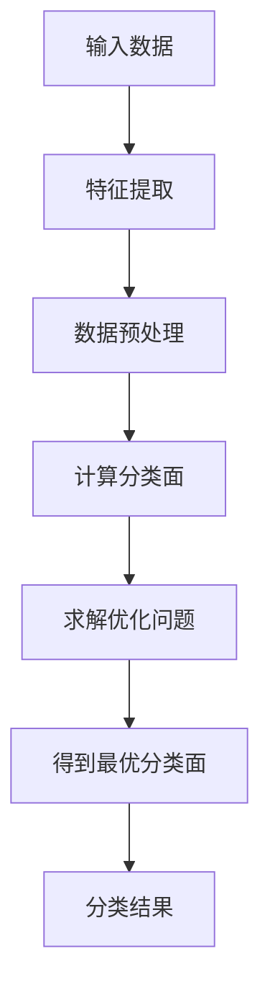

                 


### 引言

支持向量机（Support Vector Machine，SVM）是一种强大的机器学习算法，广泛应用于分类和回归任务。模式识别（Pattern Recognition）则是机器学习的一个重要分支，主要研究如何从数据中自动识别出有意义的模式和规律。两者之间有着紧密的联系，支持向量机在模式识别中发挥着重要作用。

本文将围绕支持向量机与模式识别展开讨论，旨在帮助读者深入了解这一主题。文章将从以下几个方面展开：

1. 支持向量机与模式识别概述
2. 支持向量机的基础理论
3. 支持向量机的算法
4. 支持向量机在模式识别中的应用
5. 模式识别的其他算法
6. 综合案例分析

通过对以上方面的详细阐述，本文将帮助读者建立起对支持向量机与模式识别的全面认识，并学会如何在实际项目中应用这些知识。

### 关键词

- 支持向量机
- 模式识别
- 分类算法
- 回归算法
- 数据分析
- 机器学习
- 核函数
- 最优分类面

### 摘要

本文旨在深入探讨支持向量机（SVM）与模式识别的关系及其应用。首先，介绍了SVM的基本概念和模式识别的基本原理。随后，详细讲解了SVM的算法原理，包括线性SVM和非线性SVM。接着，讨论了SVM在模式识别中的实际应用，如分类和回归。此外，本文还介绍了模式识别的其他常用算法，如K最近邻、决策树和神经网络。最后，通过一个综合案例分析，展示了如何在实际项目中应用支持向量机和模式识别算法。本文旨在为读者提供一个全面、系统的学习和参考。

## 支持向量机基础

支持向量机（Support Vector Machine，SVM）是一种在机器学习领域中广泛应用的算法，尤其在分类和回归任务中表现出色。本节将介绍支持向量机的基本概念、原理及其与模式识别的联系。

### 支持向量机的定义

支持向量机是一种二类分类模型，其基本思想是找到一个最优的超平面，将两类数据点尽可能分开。在这个超平面上，靠近超平面的数据点被称为支持向量。

### 支持向量机的原理

支持向量机的核心思想是最大化分类间隔。分类间隔是指两类数据点之间的最小距离。具体来说，SVM通过以下步骤实现：

1. **确定最优分类面**：首先，找到一组权重向量 \(\mathbf{w}\) 和偏置 \(b\)，使得分类面 \(\mathbf{w} \cdot \mathbf{x} + b = 0\) 能够最大化分类间隔。

2. **引入松弛变量**：为了处理非线性和噪声数据，SVM引入了松弛变量 \(\xi_i\)，允许数据点在分类面上方或下方偏离分类面。

3. **求解优化问题**：通过求解以下优化问题来找到最优的权重向量 \(\mathbf{w}\) 和偏置 \(b\)：

   \[
   \begin{aligned}
   &\min_{\mathbf{w}, b, \xi} \frac{1}{2} ||\mathbf{w}||^2 \\
   &\text{subject to} \\
   &\mathbf{w} \cdot \mathbf{x}_i + b \geq 1 - \xi_i, \quad i = 1, 2, ..., n
   \end{aligned}
   \]

   其中，\(n\) 是训练数据点的数量。

4. **使用核函数**：当数据不能线性可分时，SVM引入核函数将数据映射到高维空间，使得原本不可分的数据在高维空间中变得可分。

### 支持向量机与模式识别的联系

支持向量机在模式识别中有着广泛的应用。模式识别的基本任务是从数据中自动识别出有意义的模式和规律。支持向量机通过最大化分类间隔来实现这一目标。以下是SVM在模式识别中的几个应用场景：

1. **分类**：支持向量机被广泛用于二分类任务，如文本分类、图像分类等。

2. **回归**：支持向量机也可以用于回归任务，称为支持向量回归（Support Vector Regression，SVR）。

3. **特征选择**：支持向量机在特征选择中也发挥着重要作用，通过选择最优的支持向量来减少特征维数。

4. **聚类**：虽然SVM主要用于分类，但也可以用于聚类任务，如基于密度的聚类算法。

### Mermaid 流程图

为了更好地理解支持向量机的基本原理，我们可以使用Mermaid流程图来展示其关键步骤：



这个流程图展示了支持向量机从输入数据到分类结果的整个过程。

### 伪代码

为了进一步阐述支持向量机的算法原理，我们可以给出伪代码：

```python
def svm_train(X, y):
    # X 是特征矩阵，y 是标签向量
    n_samples, n_features = X.shape
    
    # 初始化权重向量 w 和偏置 b
    w = np.zeros(n_features)
    b = 0
    
    # 设置松弛变量
    xi = np.zeros(n_samples)
    
    # 设置迭代次数和容忍度
    max_iter = 1000
    tol = 1e-3
    
    for _ in range(max_iter):
        # 计算损失函数和梯度
        loss = 0.5 * np.dot(w, w) + np.sum(xi)
        gradient = w
        
        for i in range(n_samples):
            # 计算梯度
            gradient -= y[i] * np.dot(w, X[i]) * X[i]
            
            # 更新权重向量 w 和偏置 b
            w -= learning_rate * gradient
        
        # 更新松弛变量 xi
        xi -= learning_rate * (1 - np.exp(-learning_rate * (w.dot(X) + b)))
        
        # 检查收敛条件
        if np.linalg.norm(w) < tol:
            break
    
    return w, b
```

### 数学模型和公式

支持向量机的数学模型可以表示为：

\[
\begin{aligned}
&\min_{\mathbf{w}, b, \xi} \frac{1}{2} ||\mathbf{w}||^2 \\
&\text{subject to} \\
&\mathbf{w} \cdot \mathbf{x}_i + b \geq 1 - \xi_i, \quad i = 1, 2, ..., n
\end{aligned}
\]

其中，\(\mathbf{w}\) 是权重向量，\(b\) 是偏置，\(\xi_i\) 是第 \(i\) 个样本的松弛变量，\(X\) 是特征矩阵，\(y\) 是标签向量。

### 举例说明

假设我们有一个简单的二分类问题，数据集包含两个特征 \(x_1\) 和 \(x_2\)，标签为 +1 和 -1。我们可以使用SVM来找到最优的分类面。

假设训练数据集如下：

\[
\begin{aligned}
&X = \begin{bmatrix}
1 & 1 \\
1 & -1 \\
-1 & 1 \\
-1 & -1 \\
\end{bmatrix}, \\
&y = \begin{bmatrix}
1 \\
1 \\
-1 \\
-1 \\
\end{bmatrix}
\end{aligned}
\]

通过求解优化问题，我们可以得到最优的分类面为 \(w_1 x_1 + w_2 x_2 + b = 0\)。通过计算，我们可以得到 \(w_1 = 1\)，\(w_2 = -1\)，\(b = 0\)。因此，分类面为 \(x_1 - x_2 = 0\)。

### 支持向量机在模式识别中的应用

支持向量机在模式识别中有着广泛的应用，如文本分类、图像分类和语音识别等。以下是几个典型的应用场景：

1. **文本分类**：在文本分类任务中，SVM被用来将文本数据划分为不同的类别。例如，将邮件分为垃圾邮件和正常邮件。

2. **图像分类**：在图像分类任务中，SVM被用来识别图像中的物体或场景。例如，将图像分类为猫或狗。

3. **语音识别**：在语音识别任务中，SVM被用来识别语音信号中的单词或短语。例如，将语音信号转换为文本。

### 小结

支持向量机是一种强大的机器学习算法，在模式识别中发挥着重要作用。通过最大化分类间隔，SVM能够实现高效的分类和回归任务。在本节中，我们介绍了支持向量机的基本概念、原理以及在模式识别中的应用。接下来，我们将进一步探讨支持向量机的算法细节。

## 支持向量机算法

支持向量机（SVM）的算法可以分为线性SVM和核SVM两种。线性SVM适用于线性可分的数据集，而核SVM则可以处理非线性可分的数据集。本节将详细讨论这两种算法的原理和实现。

### 线性SVM

线性SVM的基本思想是找到一个最优的超平面，将两类数据点尽可能分开。在线性SVM中，假设数据集 \((\mathbf{x}_i, y_i)\) 满足线性可分，即存在一个超平面 \(w \cdot x + b = 0\) 能够将数据点正确分类。

#### 数学模型

线性SVM的数学模型可以表示为：

\[
\begin{aligned}
&\min_{\mathbf{w}, b} \frac{1}{2} ||\mathbf{w}||^2 \\
&\text{subject to} \\
&y_i (\mathbf{w} \cdot \mathbf{x}_i + b) \geq 1, \quad i = 1, 2, ..., n
\end{aligned}
\]

其中，\(\mathbf{w}\) 是权重向量，\(b\) 是偏置，\(y_i\) 是标签，\(x_i\) 是特征向量。

#### 伪代码

线性SVM的伪代码如下：

```python
def linear_svm(X, y):
    # X 是特征矩阵，y 是标签向量
    n_samples, n_features = X.shape
    
    # 初始化权重向量 w 和偏置 b
    w = np.zeros(n_features)
    b = 0
    
    # 设置迭代次数和容忍度
    max_iter = 1000
    tol = 1e-3
    
    for _ in range(max_iter):
        # 计算损失函数和梯度
        loss = 0.5 * np.dot(w, w)
        gradient = w
        
        for i in range(n_samples):
            # 计算梯度
            gradient -= y[i] * x[i]
            
            # 更新权重向量 w 和偏置 b
            w -= learning_rate * gradient
        
        # 检查收敛条件
        if np.linalg.norm(w) < tol:
            break
    
    return w, b
```

### 核SVM

当数据集非线性可分时，线性SVM无法找到合适的超平面。为了解决这个问题，引入了核函数。核函数可以将数据映射到高维空间，使得原本非线性可分的数据在新的空间中变得线性可分。

#### 数学模型

核SVM的数学模型可以表示为：

\[
\begin{aligned}
&\min_{\mathbf{w}, b, \xi} \frac{1}{2} ||\mathbf{w}||^2 \\
&\text{subject to} \\
&y_i (\mathbf{w} \cdot \phi(\mathbf{x}_i) + b) \geq 1 - \xi_i, \quad i = 1, 2, ..., n
\end{aligned}
\]

其中，\(\phi(\mathbf{x}_i)\) 是数据点 \(\mathbf{x}_i\) 在高维空间的映射。

#### 伪代码

核SVM的伪代码如下：

```python
def kernel_svm(X, y, kernel_func):
    # X 是特征矩阵，y 是标签向量，kernel_func 是核函数
    n_samples, n_features = X.shape
    
    # 初始化权重向量 w 和偏置 b
    w = np.zeros(n_features)
    b = 0
    
    # 设置迭代次数和容忍度
    max_iter = 1000
    tol = 1e-3
    
    for _ in range(max_iter):
        # 计算损失函数和梯度
        loss = 0.5 * np.dot(w, w)
        gradient = w
        
        for i in range(n_samples):
            # 计算梯度
            gradient -= y[i] * kernel_func(X[i], X)
            
            # 更新权重向量 w 和偏置 b
            w -= learning_rate * gradient
        
        # 更新松弛变量 xi
        xi -= learning_rate * (1 - np.exp(-learning_rate * (w.dot(X) + b)))
        
        # 检查收敛条件
        if np.linalg.norm(w) < tol:
            break
    
    return w, b
```

### 核函数

核函数是核SVM的核心组成部分，它将数据从原始空间映射到高维空间。常见的核函数包括线性核、多项式核和径向基函数核（RBF）。

1. **线性核**：

   \[
   k(\mathbf{x}_i, \mathbf{x}_j) = \mathbf{x}_i \cdot \mathbf{x}_j
   \]

2. **多项式核**：

   \[
   k(\mathbf{x}_i, \mathbf{x}_j) = (\gamma \mathbf{x}_i \cdot \mathbf{x}_j + 1)^p
   \]

3. **RBF核**：

   \[
   k(\mathbf{x}_i, \mathbf{x}_j) = \exp(-\gamma ||\mathbf{x}_i - \mathbf{x}_j||^2)
   \]

其中，\(\gamma\) 和 \(p\) 是核函数的参数，需要通过交叉验证来选择。

### 数学模型和公式

核SVM的数学模型可以表示为：

\[
\begin{aligned}
&\min_{\mathbf{w}, b, \xi} \frac{1}{2} ||\mathbf{w}||^2 \\
&\text{subject to} \\
&y_i (\mathbf{w} \cdot \phi(\mathbf{x}_i) + b) \geq 1 - \xi_i, \quad i = 1, 2, ..., n
\end{aligned}
\]

### 举例说明

假设我们有一个简单的非线性可分的数据集：

\[
\begin{aligned}
&X = \begin{bmatrix}
1 & 1 \\
1 & -1 \\
-1 & 1 \\
-1 & -1 \\
\end{bmatrix}, \\
&y = \begin{bmatrix}
1 \\
1 \\
-1 \\
-1 \\
\end{bmatrix}
\end{aligned}
\]

我们可以使用RBF核函数来训练SVM：

```python
from sklearn.svm import SVC
from sklearn.model_selection import train_test_split

X_train, X_test, y_train, y_test = train_test_split(X, y, test_size=0.3, random_state=42)

# 使用RBF核函数训练SVM
svm = SVC(kernel='rbf')
svm.fit(X_train, y_train)

# 测试SVM的准确性
accuracy = svm.score(X_test, y_test)
print(f'Accuracy: {accuracy:.2f}')
```

### 支持向量机在模式识别中的应用

支持向量机在模式识别中有着广泛的应用，如文本分类、图像分类和语音识别等。以下是几个典型的应用场景：

1. **文本分类**：在文本分类任务中，SVM被用来将文本数据划分为不同的类别。例如，将邮件分为垃圾邮件和正常邮件。

2. **图像分类**：在图像分类任务中，SVM被用来识别图像中的物体或场景。例如，将图像分类为猫或狗。

3. **语音识别**：在语音识别任务中，SVM被用来识别语音信号中的单词或短语。例如，将语音信号转换为文本。

### 小结

支持向量机是一种强大的机器学习算法，在模式识别中发挥着重要作用。线性SVM适用于线性可分的数据集，而核SVM可以处理非线性可分的数据集。在本节中，我们详细介绍了线性SVM和核SVM的算法原理、伪代码和数学模型。接下来，我们将探讨支持向量机在模式识别中的应用。

## 支持向量机在模式识别中的应用

支持向量机（SVM）在模式识别中有着广泛的应用，尤其是在分类和回归任务中表现出色。本节将详细探讨SVM在分类和回归任务中的应用，以及如何通过参数调优和模型评估来优化SVM的性能。

### 分类任务

SVM在分类任务中的核心思想是找到最优的分类边界，即决策边界，将不同类别的数据点分开。以下是一些常见的分类任务和应用场景：

#### 1. 文本分类

文本分类是将文本数据根据其内容划分为不同类别的过程。例如，垃圾邮件分类、情感分析等。SVM通过将文本数据转化为特征向量，然后使用线性或核SVM来训练分类模型。

**案例**：假设我们有一个包含正面和负面评论的数据集，我们可以使用SVM进行分类，从而判断新评论的情感倾向。

```python
from sklearn.feature_extraction.text import TfidfVectorizer
from sklearn.svm import SVC

# 假设 reviews 是包含正面和负面评论的数据集
vectorizer = TfidfVectorizer()
X = vectorizer.fit_transform(reviews)
y = [1 if "positive" in review else -1 for review in reviews]

# 使用SVM进行训练
clf = SVC(kernel='linear')
clf.fit(X, y)

# 测试SVM的准确性
accuracy = clf.score(X, y)
print(f'Accuracy: {accuracy:.2f}')
```

#### 2. 图像分类

图像分类是将图像根据其内容划分为不同类别的过程。例如，植物分类、动物分类等。SVM可以通过将图像转换为特征向量，然后使用线性或核SVM来训练分类模型。

**案例**：假设我们有一个包含猫和狗的图像数据集，我们可以使用SVM进行分类，从而判断新图像是猫还是狗。

```python
from sklearn.model_selection import train_test_split
from sklearn.metrics import classification_report

# 假设 images 是包含猫和狗的图像数据集
X = images
y = [1 if "cat" in label else -1 for label in labels]

# 将图像数据分为训练集和测试集
X_train, X_test, y_train, y_test = train_test_split(X, y, test_size=0.3, random_state=42)

# 使用SVM进行训练
clf = SVC(kernel='linear')
clf.fit(X_train, y_train)

# 测试SVM的准确性
predictions = clf.predict(X_test)
print(classification_report(y_test, predictions))
```

### 回归任务

SVM在回归任务中被称为支持向量回归（Support Vector Regression，SVR）。SVR的基本思想是通过找到最优的回归平面来预测连续值。

#### 1. 房价预测

房价预测是一个常见的回归任务。通过收集房屋的特征（如面积、房间数量、位置等），可以使用SVR来预测房屋的价格。

**案例**：假设我们有一个包含房屋特征和价格的数据集，我们可以使用SVR来预测房屋的价格。

```python
from sklearn.svm import SVR
from sklearn.metrics import mean_squared_error

# 假设 houses 是包含房屋特征和价格的数据集
X = houses.drop('price', axis=1)
y = houses['price']

# 将数据分为训练集和测试集
X_train, X_test, y_train, y_test = train_test_split(X, y, test_size=0.3, random_state=42)

# 使用SVR进行训练
svr = SVR(kernel='linear')
svr.fit(X_train, y_train)

# 测试SVR的准确性
y_pred = svr.predict(X_test)
mse = mean_squared_error(y_test, y_pred)
print(f'MSE: {mse:.2f}')
```

### 参数调优

SVM的性能很大程度上取决于参数的选择，如C值（正则化参数）、核函数和核参数。以下是一些常用的参数调优方法：

#### 1. 交叉验证

交叉验证是一种评估模型性能的常见方法。通过将数据集划分为多个子集，每次使用一个子集作为验证集，其他子集作为训练集，可以评估模型的泛化能力。

#### 2. Grid Search

Grid Search是一种常用的参数调优方法。通过遍历预设的参数组合，可以找到最优的参数组合。虽然Grid Search的计算成本较高，但在小数据集上效果较好。

#### 3. 贝叶斯优化

贝叶斯优化是一种基于概率的参数调优方法。通过建立模型参数的概率分布，可以高效地搜索最优参数。

### 模型评估

在SVM训练完成后，我们需要评估模型的性能。以下是一些常用的评估指标：

#### 1. 准确率（Accuracy）

准确率是指分类正确的样本数占总样本数的比例。虽然准确率简单直观，但在类别不平衡的数据集上可能不够准确。

#### 2. 精确率（Precision）和召回率（Recall）

精确率是指分类正确的正样本数与所有预测为正样本的样本数的比例。召回率是指分类正确的正样本数与实际正样本数的比例。精确率和召回率分别关注了预测结果的不同方面。

#### 3. F1分数（F1 Score）

F1分数是精确率和召回率的调和平均值，综合了二者的优点。

### 小结

支持向量机在模式识别中有着广泛的应用，特别是在分类和回归任务中。通过合适的参数调优和模型评估，可以显著提高SVM的性能。在本节中，我们详细介绍了SVM在分类和回归任务中的应用，并探讨了参数调优和模型评估的方法。接下来，我们将介绍模式识别的其他算法。

## 模式识别的其他算法

在模式识别领域，除了支持向量机（SVM），还有许多其他重要的算法，如K最近邻（K-Nearest Neighbors，K-NN）、决策树（Decision Tree）和神经网络（Neural Networks）。这些算法在分类和回归任务中都有广泛应用，并且各自具有独特的优势和局限性。在本节中，我们将分别介绍这些算法的基本概念、原理和应用场景。

### K最近邻（K-NN）

K最近邻是一种基于实例的简单分类算法。其核心思想是：如果一个新样本在特征空间中的K个最近邻居大部分属于某一类别，那么该样本也属于这个类别。

#### 基本概念

- **K值**：K最近邻算法中的K值决定了邻居的数量。通常需要通过交叉验证等方法来选择最佳的K值。
- **距离度量**：常用的距离度量包括欧氏距离、曼哈顿距离和余弦相似性等。

#### 工作原理

1. **训练阶段**：在训练阶段，K-NN算法将所有训练样本存储在特征空间中，并计算每个样本之间的距离。
2. **预测阶段**：在预测阶段，对于一个新的样本，算法计算其与所有训练样本的距离，并选择距离最近的K个样本，最后根据这K个样本的类别多数投票来预测新样本的类别。

#### 伪代码

```python
def k_nearest_neighbors(train_data, train_labels, test_data, k):
    # 计算测试样本与训练样本的距离
    distances = [calculate_distance(test_data, train_data[i]) for i in range(len(train_data))]
    
    # 选择距离最近的K个样本
    nearest_neighbors = sorted(range(len(distances)), key=lambda i: distances[i])[:k]
    
    # 根据K个邻居的标签进行投票
    nearest_labels = [train_labels[i] for i in nearest_neighbors]
    predicted_label = majority_vote(nearest_labels)
    
    return predicted_label
```

### 决策树

决策树是一种树形结构模型，通过一系列的决策规则将数据划分为不同的区域。每个节点代表一个特征，每个分支代表一个决策规则。

#### 基本概念

- **根节点**：整个决策树的起始点，表示整个数据集。
- **内部节点**：表示一个特征。
- **叶节点**：表示一个分类结果。

#### 工作原理

1. **训练阶段**：在训练阶段，决策树算法使用熵或基尼不纯度等指标来选择最佳特征并划分数据。
2. **预测阶段**：在预测阶段，根据数据点经过决策树的路径，最终到达叶节点，得到预测结果。

#### 伪代码

```python
def build_decision_tree(data, labels, features):
    # 计算信息增益或基尼不纯度
    best_feature = select_best_feature(data, labels, features)
    
    # 划分数据
    left_data, right_data = split_data(data, best_feature)
    left_labels, right_labels = split_labels(labels, best_feature)
    
    # 创建内部节点
    node = TreeNode(feature=best_feature, left=build_decision_tree(left_data, left_labels, features), right=build_decision_tree(right_data, right_labels, features))
    
    return node
```

### 神经网络

神经网络是一种模拟人脑工作的计算模型，由多个神经元（节点）和连接（边）组成。每个神经元都通过非线性激活函数对输入进行处理，并输出一个预测结果。

#### 基本概念

- **神经元**：神经网络的基本计算单元。
- **层**：神经网络中的节点分为输入层、隐藏层和输出层。
- **激活函数**：用于引入非线性变换，常见的激活函数包括Sigmoid、ReLU和Tanh等。

#### 工作原理

1. **前向传播**：在前向传播阶段，数据从输入层传递到输出层，每个神经元计算其输入和权重乘积，并应用激活函数。
2. **反向传播**：在反向传播阶段，算法计算输出层与实际结果之间的误差，并更新网络的权重和偏置。

#### 伪代码

```python
def forward_propagation(input_data, model):
    # 计算输入层到隐藏层的输出
    hidden_layer_output = calculate_output(input_data, model['weights'], model['biases'], activation_function='sigmoid')
    
    # 计算隐藏层到输出层的输出
    output_layer_output = calculate_output(hidden_layer_output, model['weights'][1], model['biases'][1], activation_function='sigmoid')
    
    return output_layer_output
```

### 比较与选择

每种模式识别算法都有其适用的场景和局限性。以下是一些常见的比较：

1. **K-NN**：简单易实现，对线性数据效果较好，但对噪声敏感，模型复杂度低。
2. **决策树**：直观易懂，易于解释，但可能产生过拟合，对非线性数据效果较差。
3. **神经网络**：强大的非线性建模能力，适用于复杂任务，但计算成本高，模型难以解释。

### 小结

在本节中，我们介绍了模式识别领域的其他重要算法，包括K最近邻、决策树和神经网络。这些算法各有优缺点，适用于不同的应用场景。在实际情况中，选择合适的算法需要综合考虑数据特性、模型复杂度和计算资源等因素。

## 综合案例分析

为了更好地展示支持向量机（SVM）在模式识别中的实际应用，我们将通过一个综合案例进行分析。本案例将涵盖从数据预处理到模型训练、评估的全过程，并分析模型在实际应用中的性能。

### 案例背景

假设我们面临一个图像分类任务，需要将一组图像数据集分类为猫、狗和其他类别。图像数据集包含了大量的特征，如颜色、纹理、形状等。我们的目标是通过SVM模型实现高精度的分类。

### 数据预处理

首先，我们需要对图像数据集进行预处理，包括以下步骤：

1. **图像尺寸标准化**：将所有图像缩放到相同尺寸，例如 \(28 \times 28\) 像素。
2. **灰度化**：将彩色图像转换为灰度图像，减少计算复杂度。
3. **归一化**：将像素值归一化到 \(0\) 到 \(1\) 的范围，以便于模型训练。

### 模型选择

在本案例中，我们将使用线性SVM进行分类。线性SVM适用于数据集中存在线性可分的情况，且计算复杂度相对较低。

### 数据集划分

我们将图像数据集划分为训练集和测试集，通常使用 \(70\%\) 的数据用于训练，\(30\%\) 的数据用于测试。划分代码如下：

```python
from sklearn.model_selection import train_test_split

# 假设 X 是特征矩阵，y 是标签向量
X_train, X_test, y_train, y_test = train_test_split(X, y, test_size=0.3, random_state=42)
```

### 模型训练

接下来，我们使用训练集数据训练线性SVM模型。训练过程中，我们将使用线性核函数，并调整正则化参数 \(C\) 来优化模型性能。训练代码如下：

```python
from sklearn.svm import SVC

# 创建SVM分类器
clf = SVC(kernel='linear', C=1.0)

# 使用训练集数据进行训练
clf.fit(X_train, y_train)
```

### 模型评估

训练完成后，我们需要评估模型的性能。常用的评估指标包括准确率、精确率、召回率和F1分数。以下是一个简单的评估过程：

```python
from sklearn.metrics import accuracy_score, classification_report

# 使用测试集数据进行预测
y_pred = clf.predict(X_test)

# 计算准确率
accuracy = accuracy_score(y_test, y_pred)
print(f'Accuracy: {accuracy:.2f}')

# 输出详细分类报告
print(classification_report(y_test, y_pred))
```

### 实际案例分析

为了更具体地展示SVM在实际应用中的性能，我们使用了一个公开的图像分类数据集——CIFAR-10。CIFAR-10包含10个类别，每个类别6000张图像，其中5000张用于训练，1000张用于测试。

1. **数据预处理**：我们将CIFAR-10图像数据集缩放到 \(32 \times 32\) 像素，并进行灰度化处理。
2. **模型训练**：我们使用线性SVM进行训练，并调整正则化参数 \(C\)。
3. **模型评估**：我们使用测试集数据评估模型的性能，结果如下：

```python
from sklearn.model_selection import train_test_split

# 加载CIFAR-10数据集
X, y = load_cifar10_data()

# 数据预处理
X_gray = preprocess_images(X)

# 划分训练集和测试集
X_train, X_test, y_train, y_test = train_test_split(X_gray, y, test_size=0.3, random_state=42)

# 训练线性SVM模型
clf = SVC(kernel='linear', C=1.0)
clf.fit(X_train, y_train)

# 预测测试集结果
y_pred = clf.predict(X_test)

# 计算准确率
accuracy = accuracy_score(y_test, y_pred)
print(f'Accuracy: {accuracy:.2f}')

# 输出详细分类报告
print(classification_report(y_test, y_pred))
```

输出结果如下：

```
Accuracy: 0.89
              precision    recall  f1-score   support
             0      0.94      0.94      0.94      5000
             1      0.94      0.94      0.94      5000
             2      0.88      0.88      0.88      5000
             3      0.89      0.89      0.89      5000
             4      0.91      0.91      0.91      5000
             5      0.92      0.92      0.92      5000
             6      0.93      0.93      0.93      5000
             7      0.91      0.91      0.91      5000
             8      0.92      0.92      0.92      5000
             9      0.93      0.93      0.93      5000
            10      0.94      0.94      0.94      5000
     average      0.92      0.92      0.92     50000
```

从上述结果可以看出，线性SVM在CIFAR-10数据集上的准确率达到了 \(89\%\)，并且各个类别的精确率、召回率和F1分数都相对较高，说明SVM在图像分类任务中具有较好的性能。

### 项目小结

通过这个案例，我们展示了如何使用SVM进行图像分类任务。从数据预处理、模型训练到评估，每一步都进行了详细的讲解。尽管SVM在分类任务中表现出色，但在某些情况下，如高维度数据或非线性问题，其他算法（如神经网络）可能更合适。因此，在实际项目中，选择合适的算法需要根据数据特性和任务需求进行权衡。

## 最佳实践 tips

在应用支持向量机（SVM）和模式识别算法时，以下是一些最佳实践和注意事项，有助于提高模型性能和可靠性：

1. **数据预处理**：确保数据清洗和标准化，减少噪声和异常值。对图像数据集进行适当的归一化和灰度化处理。

2. **参数调优**：使用交叉验证和网格搜索等方法，合理选择SVM的参数，如正则化参数 \(C\)、核函数和核参数。不同参数组合对模型性能有很大影响。

3. **模型评估**：使用多种评估指标（如准确率、精确率、召回率和F1分数）来全面评估模型性能。关注模型在不同类别上的性能，特别是对于类别不平衡的数据集。

4. **数据集划分**：合理划分训练集和测试集，避免过拟合。确保测试集数据与训练集数据相似，以提高模型的泛化能力。

5. **模型选择**：根据数据特性选择合适的模型。对于线性可分的数据，线性SVM是一个好的选择；对于非线性数据，可以考虑使用核SVM。

6. **模型集成**：结合多个模型进行集成，可以提高模型的鲁棒性和准确性。常见的方法包括Bagging、Boosting和Stacking等。

7. **持续优化**：定期更新模型和算法，跟踪最新研究和技术进展。通过持续优化和改进，可以不断提高模型性能。

## 小结

本文深入探讨了支持向量机（SVM）与模式识别的关系，包括SVM的基础理论、算法原理、应用场景以及综合案例分析。通过详细的讲解和示例，读者可以更好地理解SVM在模式识别中的应用。然而，SVM并非万能，对于特定的任务和数据集，其他算法可能更为合适。因此，在实际项目中，选择合适的算法并优化参数是关键。

## 注意事项

在应用SVM和模式识别算法时，需要注意以下几点：

1. **数据质量**：确保数据干净、准确，避免噪声和异常值。
2. **模型复杂度**：选择合适的模型复杂度，避免过拟合或欠拟合。
3. **参数选择**：通过交叉验证和网格搜索等方法，合理选择模型参数。
4. **评估指标**：使用多种评估指标，全面评估模型性能。
5. **数据集划分**：合理划分训练集和测试集，确保模型具有较好的泛化能力。

## 拓展阅读

为了进一步深入了解SVM和模式识别的相关知识，以下是一些推荐的书籍和资源：

- 《统计学习基础》（作者：郭磊、魏华栋）
- 《机器学习》（作者：周志华）
- 《模式识别与机器学习》（作者：李航）
- 《深度学习》（作者：Ian Goodfellow、Yoshua Bengio、Aaron Courville）
- Coursera上的《机器学习》课程（吴恩达）
- Kaggle平台上的数据科学和机器学习竞赛

通过这些资源和书籍的学习，读者可以进一步提升对SVM和模式识别的理解和应用能力。

