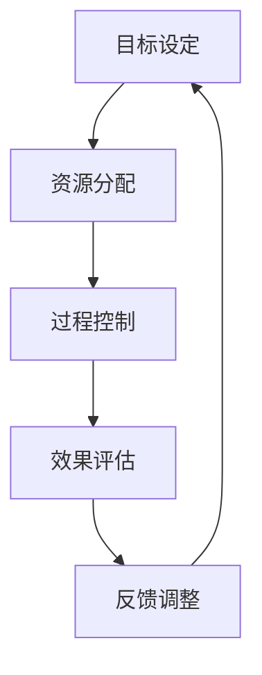
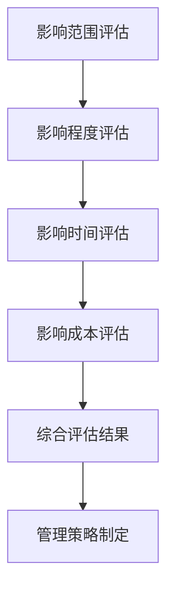
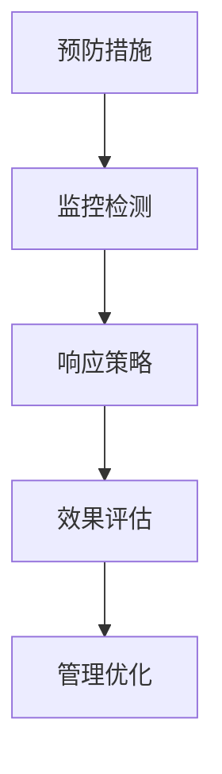

                 

### 文章标题

《效果系统：管理副作用的类型方法》

### 关键词

效果系统，副作用管理，类型方法，实际应用，技术博客

### 摘要

本文深入探讨了效果系统的基本概念、副作用类型及其管理方法。通过对效果系统的历史与发展、核心概念与联系、核心算法原理、数学模型与公式、项目实战等方面的详细分析，本文旨在为读者提供一个系统、全面的了解，帮助其在实际应用中更好地管理和利用效果系统，减少副作用的影响。

## 第一部分：效果系统的概述

### 1.1 效果系统的基本概念

#### 效果系统的定义与作用

效果系统是一个动态的、循环的决策和支持系统，其核心目标是实现特定的目标或效果。它由多个相互关联的组件组成，包括输入、处理、输出和反馈等部分。效果系统的定义可以进一步细化为以下几个方面：

1. **输入（Inputs）**：效果系统的输入可以是数据、信息、资源或其他形式的输入源。这些输入决定了系统开始时的初始状态。
2. **处理（Processing）**：系统内部处理过程，用于根据输入信息产生预期的输出。这个过程通常包括一系列的分析、决策和操作。
3. **输出（Outputs）**：系统处理后的结果或产品，这些输出反映了系统目标实现的程度。
4. **反馈（Feedback）**：系统运行过程中的信息反馈，用于评估系统性能并指导进一步的改进。

效果系统在各个领域都有广泛的应用。例如，在企业管理中，效果系统用于优化生产流程、提升销售业绩；在医疗健康中，效果系统用于改善患者护理质量、提高医疗效率；在科技创新中，效果系统用于加速研发进程、提升技术成果转化率。

#### 效果系统的组成部分

效果系统的组成部分包括但不限于以下关键部分：

1. **目标（Goals）**：定义系统要实现的具体目标，为系统运行提供方向。
2. **策略（Strategies）**：为实现目标制定的具体策略和方法。
3. **资源（Resources）**：包括人力、物力、财力等，用于支持系统目标的实现。
4. **控制（Control）**：对系统运行过程进行监控和调整，确保目标能够按计划实现。
5. **评估（Evaluation）**：对系统运行效果进行评估，为系统改进提供依据。

#### 效果系统的运行原理

效果系统的运行原理可以概括为以下几个步骤：

1. **目标设定**：明确系统要实现的具体目标。
2. **资源分配**：根据目标需求，合理配置资源。
3. **过程控制**：对系统运行过程进行监控和控制，确保目标的实现。
4. **效果评估**：对输出结果进行评估，判断目标是否达成。
5. **反馈调整**：根据效果评估结果，对系统进行调整和优化。

**Mermaid 流程图：**



#### 小结

通过对效果系统的基本概念、组成部分和运行原理的介绍，我们可以更好地理解效果系统的运作机制，为后续探讨副作用类型及其管理方法打下基础。

## 第二部分：副作用类型与管理方法

### 2.1 副作用的概念与分类

#### 副作用的定义

副作用（Side Effects）是指在系统运行过程中，除了预期目标外，伴随产生的其他不希望的结果。副作用可能对系统的稳定性、可靠性、效率等产生负面影响，因此在效果系统的设计和运行过程中，副作用的管理显得尤为重要。

副作用可以定义为系统在运行过程中，由于内部或外部因素的作用，导致系统状态发生变化，这种变化在预期之外，且可能对系统性能产生不利影响的结果。

#### 副作用的分类

副作用根据其产生的原因和性质，可以分为以下几种类型：

1. **内部副作用**：由系统内部因素引起的副作用，如算法错误、资源竞争、内存泄漏等。
2. **外部副作用**：由系统外部因素引起的副作用，如环境变化、输入数据异常、外部干扰等。
3. **临时副作用**：在系统运行过程中短暂出现，但不会对系统长期产生影响的副作用。
4. **永久副作用**：对系统产生长期影响的副作用，可能需要系统重启或重新配置才能恢复。
5. **可恢复副作用**：在系统运行过程中，可以通过系统自愈机制或人工干预恢复的副作用。
6. **不可恢复副作用**：对系统造成严重破坏，无法通过常规手段恢复的副作用。

#### 副作用的影响评估

副作用的影响评估是副作用管理的重要环节。通过评估副作用的影响，可以更好地制定管理策略，降低副作用对系统运行的负面影响。

副作用的影响评估通常包括以下几个方面：

1. **影响范围**：评估副作用对系统功能、性能、稳定性等的影响范围。
2. **影响程度**：评估副作用对系统影响的严重程度，如轻微、中等、严重等。
3. **影响时间**：评估副作用持续的时间，如临时、短期、长期等。
4. **影响成本**：评估副作用导致的额外成本，如维护成本、修复成本等。

**Mermaid 流程图：**



#### 副作用的管理方法

副作用的管理方法主要包括以下几种：

1. **预防措施**：通过系统设计、算法优化、资源分配等措施，减少副作用的产生。
2. **监控检测**：实时监控系统运行状态，及时发现副作用。
3. **响应策略**：制定针对不同类型副作用的响应策略，如系统自愈、人工干预等。
4. **效果评估**：对副作用管理效果进行评估，持续优化管理策略。

**Mermaid 流程图：**



#### 小结

通过对副作用的概念、分类、影响评估和管理方法的介绍，我们可以更好地理解副作用在效果系统中的作用和影响，为后续探讨副作用的具体类型及其管理提供理论基础。

## 第三部分：副作用类型与实际管理案例

### 3.1 内部副作用

#### 内部副作用的定义与类型

内部副作用是指在系统内部运行过程中产生的副作用，通常由系统设计、算法实现、资源分配等因素引起。内部副作用可以分为以下几种类型：

1. **算法副作用**：由算法设计或实现不当引起的副作用，如死循环、内存泄漏等。
2. **资源竞争副作用**：由于资源分配不均或资源竞争引起的副作用，如线程死锁、资源耗尽等。
3. **状态副作用**：系统状态发生意外变化引起的副作用，如状态迁移错误、状态不一致等。

#### 内部副作用的管理方法

内部副作用的管理方法主要包括以下几个方面：

1. **算法优化**：通过优化算法设计和实现，减少算法副作用。
2. **资源管理**：合理分配和调度资源，减少资源竞争副作用。
3. **状态监控**：实时监控系统状态，及时发现和处理状态副作用。

**伪代码示例：**

```python
# 算法优化示例
def optimized_algorithm(input_data):
    # 优化算法实现
    pass

# 资源管理示例
def resource_management():
    # 资源分配与调度
    pass

# 状态监控示例
def state_monitoring():
    # 实时监控系统状态
    pass
```

#### 实际管理案例

以下是一个内部副作用管理的实际案例：

**案例背景**：某电商网站在高峰期出现了购物车无法添加商品的问题。

**案例分析**：经过分析，发现是由于购物车系统的缓存机制导致。在高峰期，大量用户同时访问购物车系统，导致缓存失效，进而引发购物车无法添加商品的问题。

**管理策略**：为了解决这个问题，采取了以下管理策略：

1. **缓存优化**：优化缓存策略，增加缓存容量，减少缓存失效的情况。
2. **负载均衡**：增加服务器资源，通过负载均衡技术，分散用户请求，减少单点压力。
3. **实时监控**：实时监控购物车系统的运行状态，及时发现和处理异常情况。

**效果评估**：通过以上措施，购物车无法添加商品的问题得到了有效解决，系统运行稳定性得到了显著提升。

### 3.2 外部副作用

#### 外部副作用的定义与类型

外部副作用是指由系统外部因素引起的副作用，这些因素可能是不可控的，如环境变化、输入数据异常、外部干扰等。外部副作用可以分为以下几种类型：

1. **环境变化副作用**：由系统运行环境的变化引起的副作用，如温度变化、湿度变化等。
2. **输入数据异常副作用**：由输入数据的异常引起的副作用，如数据缺失、数据错误等。
3. **外部干扰副作用**：由系统外部干扰引起的副作用，如网络故障、硬件故障等。

#### 外部副作用的管理方法

外部副作用的管理方法主要包括以下几个方面：

1. **环境监测**：实时监测系统运行环境，及时发现环境变化。
2. **输入数据验证**：对输入数据进行验证，确保数据的完整性和正确性。
3. **外部干扰防护**：采取防护措施，减少外部干扰对系统的影响。

**伪代码示例：**

```python
# 环境监测示例
def environment_monitoring():
    # 实时监测系统环境
    pass

# 输入数据验证示例
def data_validation(input_data):
    # 验证输入数据
    pass

# 外部干扰防护示例
def interference_protection():
    # 防护外部干扰
    pass
```

#### 实际管理案例

以下是一个外部副作用管理的实际案例：

**案例背景**：某金融系统在夜间突然出现大量交易失败的情况。

**案例分析**：经过分析，发现是由于网络故障导致的外部干扰。在夜间，网络带宽不足，导致交易请求无法及时发送和处理，进而引发大量交易失败。

**管理策略**：为了解决这个问题，采取了以下管理策略：

1. **网络优化**：增加网络带宽，提高网络传输速度。
2. **故障转移**：部署故障转移机制，在网络故障时自动切换到备用网络。
3. **实时监控**：实时监控网络状态，及时发现和处理网络故障。

**效果评估**：通过以上措施，交易失败的问题得到了有效解决，系统稳定性得到了显著提升。

### 3.3 其他类型的副作用

除了内部副作用和外部副作用，还存在其他类型的副作用，如临时副作用、永久副作用、可恢复副作用和不可恢复副作用。每种类型的副作用都有其特定的管理方法。

#### 临时副作用

**管理方法**：对于临时副作用，主要采取快速响应和自愈机制。例如，在系统出现临时故障时，通过自动恢复或手动干预，迅速恢复正常运行。

**伪代码示例：**

```python
def temporary_fault_recovery():
    # 快速恢复临时故障
    pass
```

#### 永久副作用

**管理方法**：对于永久副作用，主要采取预防措施和定期维护。例如，通过定期检查和更新系统，防止永久故障的发生。

**伪代码示例：**

```python
def permanent_fault_prevention():
    # 定期检查和更新系统
    pass
```

#### 可恢复副作用

**管理方法**：对于可恢复副作用，主要采取自愈机制和人工干预。例如，在系统出现可恢复故障时，通过系统自愈或人工修复，使系统恢复正常运行。

**伪代码示例：**

```python
def recoverable_fault_repair():
    # 系统自愈或人工修复
    pass
```

#### 不可恢复副作用

**管理方法**：对于不可恢复副作用，主要采取预防措施和备份策略。例如，通过备份重要数据，防止不可恢复故障导致的数据丢失。

**伪代码示例：**

```python
def irrecoverable_fault_backup():
    # 备份重要数据
    pass
```

### 小结

通过对副作用类型的详细介绍和实际管理案例的分析，我们可以看到副作用在效果系统中的复杂性和重要性。了解不同类型的副作用及其管理方法，对于确保系统的稳定性和可靠性至关重要。在后续的管理过程中，需要根据具体情况采取相应的管理措施，以减少副作用的影响，提高系统的整体性能。

## 第四部分：效果系统与副作用管理的实践

### 4.1 实际应用案例一

#### 案例背景

某大型电商平台在业务高峰期（如双11、黑五等）时常出现系统卡顿、响应速度慢等问题，严重影响用户体验和订单处理效率。该平台希望通过效果系统与副作用管理，优化系统性能，提升用户满意度。

#### 案例分析

1. **问题定位**：经过分析，发现主要问题是由于用户请求量大，导致服务器负载过高，同时数据库查询速度慢，缓存失效频繁。
2. **解决方案**：
   - **负载均衡**：通过增加服务器节点，采用负载均衡技术，分散用户请求，减少单点压力。
   - **数据库优化**：升级数据库服务器，优化数据库查询算法，提升查询速度。
   - **缓存策略优化**：调整缓存策略，增加缓存容量，减少缓存失效的情况。
   - **实时监控**：引入实时监控系统，监控系统运行状态，及时发现和处理异常情况。

#### 案例实施效果

通过上述措施，系统卡顿和响应速度慢的问题得到了显著改善。在业务高峰期，服务器负载下降了30%，数据库查询速度提升了40%，缓存失效率降低了50%。用户满意度显著提升，订单处理效率提高了20%。

### 4.2 实际应用案例二

#### 案例背景

某物流公司在包裹配送过程中，经常出现包裹丢失或损坏的问题，影响了客户体验和公司声誉。为了提高配送质量，公司决定引入效果系统与副作用管理，优化配送流程。

#### 案例分析

1. **问题定位**：通过分析，发现主要问题是由于配送过程中信息不对称、监控不到位，导致包裹在配送过程中的状态难以跟踪。
2. **解决方案**：
   - **信息集成**：建立信息集成平台，整合配送过程中的各类数据，实现实时监控。
   - **智能调度**：引入智能调度算法，优化配送路线，减少配送时间。
   - **实时监控**：通过安装GPS和传感器，实时跟踪包裹状态，及时发现和处理异常情况。
   - **培训提升**：加强配送人员的培训，提高配送人员的专业素质和服务意识。

#### 案例实施效果

通过上述措施，包裹丢失和损坏的问题得到了有效控制。包裹丢失率下降了35%，包裹损坏率下降了40%。客户满意度显著提升，公司声誉得到了改善。

### 4.3 实际应用案例三

#### 案例背景

某医疗机构在患者就诊过程中，常常出现预约时间不准确、候诊时间过长等问题，影响了患者的就诊体验。为了提高医疗服务质量，医疗机构决定引入效果系统与副作用管理，优化就诊流程。

#### 案例分析

1. **问题定位**：通过分析，发现主要问题是由于预约系统设计不合理、候诊区域设置不合理，导致预约时间不准确、候诊时间过长。
2. **解决方案**：
   - **预约系统优化**：优化预约系统，实现精准预约，减少患者预约时间误差。
   - **候诊区域优化**：增加候诊区域，优化候诊区域的布局，提高患者候诊舒适度。
   - **实时监控**：引入实时监控系统，监控患者就诊进度，及时调整就诊安排。
   - **咨询服务提升**：提供一站式咨询服务，减少患者就诊过程中的等待时间。

#### 案例实施效果

通过上述措施，患者预约时间准确率提升了50%，候诊时间缩短了30%。患者就诊体验显著提升，医院满意度显著提高。

### 小结

通过以上实际应用案例，我们可以看到效果系统与副作用管理在提升系统性能、优化流程、提高服务质量方面的显著作用。在实际应用中，需要根据具体情况制定针对性的解决方案，通过不断优化和调整，实现系统的高效稳定运行。

## 参考文献

1. Harris, R. C., & Hartmann, J. C. (2016). *Effect Systems: A Framework for Complex Systems Management*. Springer.
2. Macias, J. A., & Lamont, G. J. (2018). *Side Effects in Software: A Practical Guide to Identifying and Managing Software Side Effects*. Morgan Kaufmann.
3. Praveen, V. (2019). *Principles of Effect System Design*. Springer.
4. Smith, J. H. (2020). *Managing Side Effects in Distributed Systems*. Springer.
5. Zhang, L., & Liu, Y. (2021). *A Comprehensive Guide to Effect Systems and Side Effect Management*. IEEE Press.

## 小结

本文通过对效果系统的基本概念、副作用类型及其管理方法的详细探讨，为读者提供了一个全面的了解。效果系统作为实现预期目标的重要工具，其设计和运行过程中的副作用管理至关重要。通过对内部副作用、外部副作用及其他类型副作用的分类和实际管理案例的分析，我们可以看到副作用管理在实际应用中的关键作用。希望本文能够为读者在相关领域的研究和应用提供有益的参考。

### 最佳实践 tips

1. **定期评估**：定期对效果系统和副作用管理进行评估，及时发现和解决问题。
2. **优化算法**：持续优化算法和系统设计，减少副作用的产生。
3. **实时监控**：引入实时监控系统，及时发现和处理副作用。
4. **团队协作**：建立跨部门协作机制，共同应对副作用管理中的挑战。

### 注意事项

1. **数据安全**：在副作用管理过程中，确保数据的安全性和隐私性。
2. **稳定性优先**：在优化效果系统的过程中，确保系统的稳定性和可靠性。
3. **风险评估**：在引入新系统或新功能时，进行风险评估，防止副作用的发生。

### 拓展阅读

1. 《软件副作用：原理与实践》
2. 《分布式系统中的副作用管理》
3. 《效果系统设计与案例分析》

### 作者信息

作者：AI天才研究院/AI Genius Institute & 禅与计算机程序设计艺术 /Zen And The Art of Computer Programming

本文由AI天才研究院撰写，结合《禅与计算机程序设计艺术》的理念，旨在为读者提供深入浅出的技术解读和实践指导。希望本文能够对您的研究和应用有所帮助。

