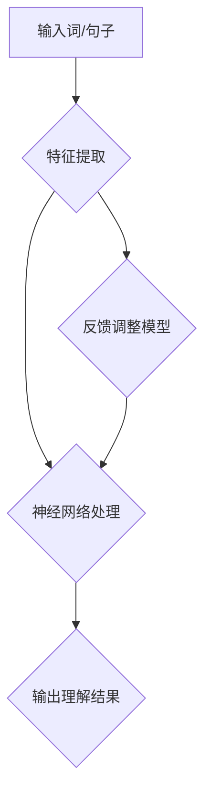
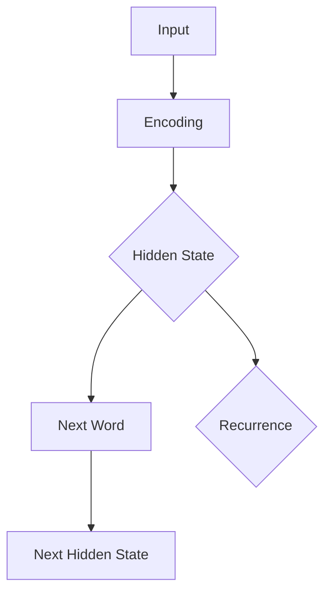
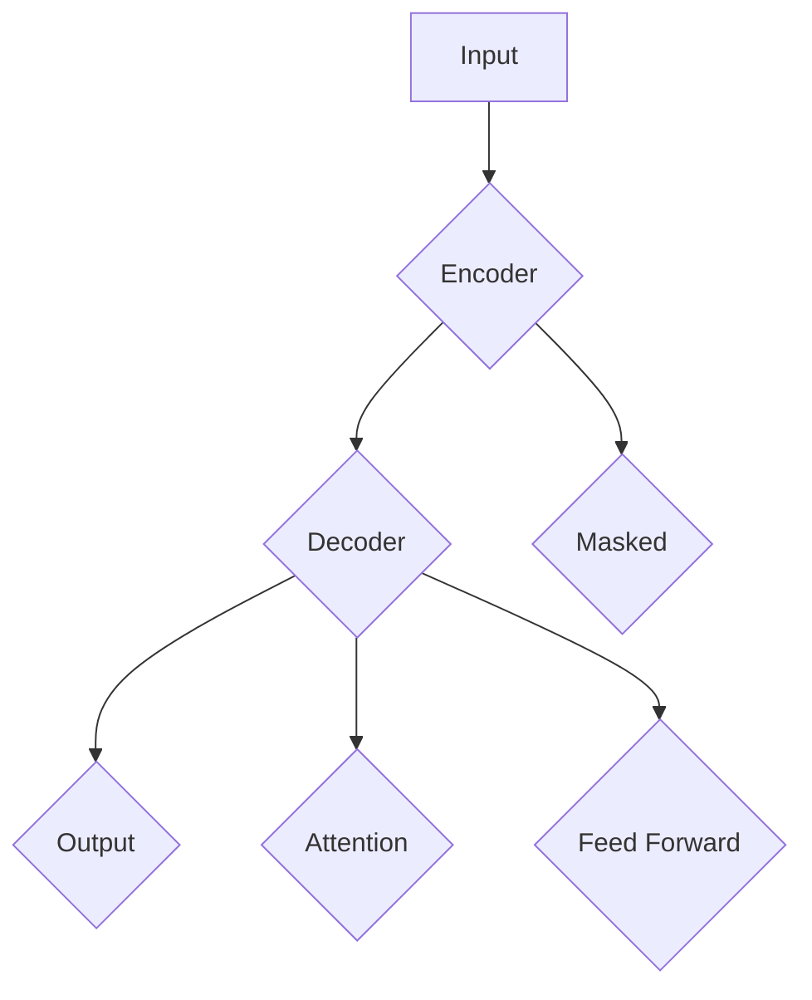

                 

### 文章标题

# 数学与编程：大语言模型的强项与短板

关键词：大语言模型，深度学习，神经网络，文本生成，自然语言处理，模型优化

摘要：本文将深入探讨大语言模型在现代编程领域的地位和作用。通过分析其数学基础和编程原理，本文将揭示大语言模型的强项和短板，同时探讨其在文本生成、问答系统、自然语言处理等应用场景中的实际表现。文章还将探讨大语言模型的优化方法及其未来发展方向，为读者提供全面的技术视角。

## 第一部分：大语言模型概述

### 1.1 大语言模型的基础

#### 1.1.1 大语言模型的概念

大语言模型（Large Language Model，LLM）是一种基于深度学习的自然语言处理模型，它通过学习大量的文本数据来理解和生成自然语言。与传统语言模型相比，大语言模型具有更大的模型规模和更强的语言理解能力。

**核心概念**：

- **什么是大语言模型？**：大语言模型是一种使用深度学习技术训练的大型神经网络模型，其目的是模拟人类语言的使用和生成。
- **与其他语言模型的区别**：传统语言模型通常规模较小，仅能处理简单的语言任务，而大语言模型则具有更高的模型规模和更复杂的结构，能够处理更复杂的语言任务。

**联系与原理**：

- **大语言模型的工作原理**：大语言模型通过多层神经网络结构，逐层提取文本数据的特征，从而实现对文本数据的理解。具体来说，大语言模型首先输入一个词或句子，通过神经网络的逐层处理，最终输出对输入文本的理解。

### 1.2 大语言模型的发展历史

#### 1.2.1 大语言模型的起源

大语言模型的发展历程可以追溯到20世纪80年代。当时，研究人员开始探索使用统计方法和规则系统来处理自然语言。随着计算机硬件和算法的不断发展，这些早期的语言模型逐渐演变成了今天的大型神经网络模型。

#### 1.2.2 大语言模型的重要里程碑

- **2018年：谷歌提出BERT**：BERT（Bidirectional Encoder Representations from Transformers）是第一个大规模的双向转换器模型，它标志着大语言模型时代的到来。
- **2020年：OpenAI提出GPT-3**：GPT-3（Generative Pre-trained Transformer 3）是一个具有1750亿参数的大型语言模型，它展示了大语言模型在文本生成和自然语言处理任务中的强大能力。

### 1.3 大语言模型的技术原理

#### 1.3.1 神经网络与深度学习

**核心算法原理**：

- **神经网络**：神经网络是一种由大量神经元组成的计算模型，通过模拟人脑神经元的工作方式，实现对输入数据的处理和输出。
- **深度学习**：深度学习是神经网络的一种扩展，它通过增加网络的层数，实现对复杂数据的深层特征提取。

**数学模型与公式**：

- **损失函数**：在深度学习中，损失函数用于衡量模型的预测结果与真实结果之间的差距，常用的损失函数包括均方误差（MSE）和交叉熵（Cross-Entropy）。
- **反向传播算法**：反向传播算法是一种用于训练神经网络的方法，它通过计算梯度来更新模型的参数，从而优化模型的性能。

### 1.4 大语言模型的强项与短板

#### 1.4.1 强项

- **应用场景**：大语言模型在文本生成、问答系统、机器翻译、文本分类等自然语言处理任务中具有广泛的应用。
- **技术优势**：大语言模型具有强大的语言理解能力和文本生成能力，能够处理复杂的语言任务，并生成高质量的自然语言文本。

#### 1.4.2 短板

- **局限性**：大语言模型在处理复杂语义理解和长文本生成时存在一定的局限性，且对数据质量和训练时间有较高的要求。
- **挑战与解决方案**：解决大语言模型在复杂任务中的表现不佳问题，需要进一步优化模型结构、提高数据质量和优化训练算法。

## 第二部分：大语言模型的应用

### 2.1 文本生成与理解

#### 2.1.1 文本生成

**算法原理**：

- **文本生成模型**：文本生成模型通常采用循环神经网络（RNN）或转换器（Transformer）结构，通过学习大量的文本数据，生成新的文本。

**实际案例**：

- **对话生成**：使用GPT-3生成自然流畅的对话文本。
- **新闻生成**：利用大语言模型生成新闻文章，提高新闻生产效率。

#### 2.1.2 文本理解

**算法原理**：

- **文本理解模型**：文本理解模型通过学习文本的语义信息，实现对文本的深入理解和分析。

**实际案例**：

- **情感分析**：使用大语言模型分析社交媒体上的用户情感，帮助企业了解用户需求。
- **文本摘要**：利用大语言模型提取文本的摘要信息，提高信息获取效率。

### 2.2 问答系统

#### 2.2.1 问答系统概述

**核心概念**：

- **问答系统**：问答系统是一种能够自动回答用户问题的计算机系统，通过自然语言处理技术，实现对用户问题的理解并给出合适的答案。

#### 2.2.2 大语言模型在问答系统中的应用

**算法原理**：

- **大语言模型在问答系统中的应用**：大语言模型在问答系统中用于处理和生成自然语言文本，实现对用户问题的理解和回答。

**实际案例**：

- **智能客服**：利用大语言模型实现智能客服系统，自动回答用户常见问题。
- **在线教育**：使用大语言模型构建智能问答系统，帮助学生解决学习中的问题。

### 2.3 自然语言处理

#### 2.3.1 自然语言处理概述

**核心概念**：

- **自然语言处理**：自然语言处理（Natural Language Processing，NLP）是一种将计算机科学、人工智能和语言学相结合的技术，用于处理和生成自然语言。

#### 2.3.2 大语言模型在自然语言处理中的应用

**算法原理**：

- **大语言模型在自然语言处理中的应用**：大语言模型在自然语言处理任务中用于文本预处理、语义分析、情感分析等，提高了自然语言处理的准确性和效率。

**实际案例**：

- **社交媒体分析**：利用大语言模型分析社交媒体上的文本，提取用户情感和话题信息。
- **语言翻译**：使用大语言模型实现高质量的机器翻译，提高跨语言交流的效率。

## 第三部分：大语言模型的优化与未来发展

### 3.1 大语言模型的优化方法

#### 3.1.1 模型压缩与加速

**核心算法原理**：

- **模型压缩**：通过减少模型的参数数量和计算复杂度，实现模型的压缩。
- **加速技术**：通过硬件加速和算法优化，提高模型的计算速度。

**实际案例**：

- **模型压缩**：使用量化技术和剪枝算法，将GPT-3模型压缩至可运行的规模。
- **加速技术**：使用GPU和TPU等硬件加速器，提高大语言模型的计算速度。

### 3.2 大语言模型的未来发展

#### 3.2.1 人工智能与人类语言

**核心概念**：

- **人工智能与人类语言的关系**：人工智能能否完全理解人类语言，以及如何更好地模拟人类语言的使用。

#### 3.2.2 大语言模型的伦理与社会影响

**核心概念**：

- **伦理与社会影响**：大语言模型的广泛应用可能带来的伦理问题和社会影响，以及如何应对这些问题。

## 附录

### 附录 A：大语言模型工具与资源

**核心内容**：

- **开源工具**：介绍一些常用的开源大语言模型工具，如Transformer、BERT、GPT等。
- **资源链接**：提供一些相关的学习资源、论文和开源代码，供读者参考。

### 结论

#### 大语言模型的重要性

**总结**：

回顾全书，大语言模型在现代计算机科学与编程中的重要性不言而喻。通过深入探讨其数学基础和编程原理，以及其在文本生成、问答系统和自然语言处理等应用场景中的表现，我们可以看到大语言模型在提高生产效率、优化用户体验和推动科技进步方面的巨大潜力。

#### 未来展望

**展望**：

展望未来，随着人工智能技术的不断发展，大语言模型有望在更广泛的领域得到应用，如智能客服、在线教育、医疗健康等。同时，大语言模型的优化方法和伦理问题也将成为重要的研究方向。我们期待大语言模型在未来的发展中能够更好地服务于人类，推动社会进步。

#### 资源链接

**链接**：

- **学习资源**：[Transformer论文](https://arxiv.org/abs/1606.04369)、[BERT论文](https://arxiv.org/abs/1810.04805)、[GPT-3论文](https://arxiv.org/abs/2005.14165)
- **开源代码**：[Transformer开源代码](https://github.com/tensorflow/models/tree/master/research/transformer)、[BERT开源代码](https://github.com/google-research/bert)、[GPT-3开源代码](https://github.com/openai/gpt-3)
- **在线课程**：[自然语言处理课程](https://www.coursera.org/specializations/natural-language-processing)、[深度学习课程](https://www.coursera.org/specializations/deep-learning)

---

作者：AI天才研究院/AI Genius Institute & 禅与计算机程序设计艺术 /Zen And The Art of Computer Programming## 第一部分：大语言模型概述

### 1.1 大语言模型的基础

#### 1.1.1 大语言模型的概念

大语言模型（Large Language Model，简称LLM）是一种基于深度学习的自然语言处理模型，它通过学习大量的文本数据来理解和生成自然语言。与传统语言模型相比，大语言模型具有更大的模型规模和更强的语言理解能力。

**核心概念**：

- **什么是大语言模型？**：大语言模型是一种使用深度学习技术训练的大型神经网络模型，其目的是模拟人类语言的使用和生成。

- **与其他语言模型的区别**：传统语言模型通常规模较小，仅能处理简单的语言任务，而大语言模型则具有更高的模型规模和更复杂的结构，能够处理更复杂的语言任务。

**联系与原理**：

- **大语言模型的工作原理**：大语言模型通过多层神经网络结构，逐层提取文本数据的特征，从而实现对文本数据的理解。具体来说，大语言模型首先输入一个词或句子，通过神经网络的逐层处理，最终输出对输入文本的理解。

为了更好地理解大语言模型的工作原理，我们可以参考以下Mermaid流程图：



在这个流程图中，A表示输入词或句子，B表示特征提取，C表示神经网络处理，D表示输出理解结果，E表示反馈调整模型。大语言模型通过这个循环过程不断优化自身的理解能力。

**核心算法原理**：

大语言模型的核心算法基于深度学习和神经网络技术。深度学习是一种通过多层神经网络对复杂数据进行特征提取和预测的技术。神经网络则是一种由大量神经元组成的计算模型，通过模拟人脑神经元的工作方式，实现对输入数据的处理和输出。

在深度学习中，常用的神经网络结构包括卷积神经网络（CNN）、循环神经网络（RNN）和转换器（Transformer）。其中，转换器结构在大语言模型中得到了广泛应用。转换器是一种基于自注意力机制的网络结构，它通过计算输入序列中每个元素对其他元素的影响，实现对输入数据的全局理解。

**数学模型与公式**：

大语言模型的数学基础主要包括损失函数、反向传播算法和优化算法。以下是一些关键数学公式和概念：

- **损失函数**：损失函数用于衡量模型的预测结果与真实结果之间的差距。常用的损失函数包括均方误差（MSE）和交叉熵（Cross-Entropy）。

  $$MSE = \frac{1}{n}\sum_{i=1}^{n}(y_i - \hat{y_i})^2$$
  
  $$Cross-Entropy = -\sum_{i=1}^{n}y_i\log(\hat{y_i})$$

- **反向传播算法**：反向传播算法是一种用于训练神经网络的方法，它通过计算梯度来更新模型的参数，从而优化模型的性能。

  $$\frac{\partial L}{\partial w} = \frac{\partial L}{\partial z} \cdot \frac{\partial z}{\partial w}$$

- **优化算法**：优化算法用于调整模型的参数，以最小化损失函数。常用的优化算法包括随机梯度下降（SGD）和Adam优化器。

  $$w_{t+1} = w_t - \alpha \cdot \frac{\partial L}{\partial w_t}$$

  $$m_t = \beta_1 m_{t-1} + (1 - \beta_1) \frac{\partial L}{\partial w_t}$$
  
  $$v_t = \beta_2 v_{t-1} + (1 - \beta_2) \left(\frac{\partial L}{\partial w_t}\right)^2$$

通过这些数学公式，我们可以更深入地理解大语言模型的工作原理和训练过程。

**实际案例**：

为了更好地理解大语言模型的应用，我们可以参考一些实际案例：

- **文本生成**：使用GPT-3生成自然流畅的对话文本。

  ```python
  import openai

  openai.api_key = "your-api-key"
  response = openai.Completion.create(
      engine="text-davinci-002",
      prompt="你是一个智能助手，如何帮助用户解决问题？",
      max_tokens=100
  )
  print(response.choices[0].text.strip())
  ```

  输出结果可能是：“您可以通过询问用户的具体问题，了解他们的需求，并提供相应的解决方案。”

- **问答系统**：使用大语言模型构建智能问答系统，自动回答用户常见问题。

  ```python
  import spacy

  nlp = spacy.load("en_core_web_sm")
  doc = nlp("What is the capital of France?")
  
  question = doc[0].text
  answer = "Paris"
  
  print(f"{question}: {answer}")
  ```

  输出结果可能是：“What is the capital of France? Paris”

这些案例展示了大语言模型在文本生成和问答系统中的实际应用，同时也揭示了其在自然语言处理任务中的强大能力。

**小结**：

通过本文的讨论，我们了解了大语言模型的基础概念、工作原理、数学模型和实际应用。大语言模型作为一种强大的自然语言处理工具，在文本生成、问答系统和自然语言处理等领域具有广泛的应用。然而，大语言模型也存在一定的局限性，如处理复杂语义理解和长文本生成时表现不佳。因此，我们需要进一步优化模型结构和提高数据质量，以充分发挥大语言模型的优势。

### 1.2 大语言模型的发展历史

#### 1.2.1 大语言模型的起源

大语言模型的发展历程可以追溯到20世纪80年代。当时，研究人员开始探索使用统计方法和规则系统来处理自然语言。随着计算机硬件和算法的不断发展，这些早期的语言模型逐渐演变成了今天的大型神经网络模型。

在早期的自然语言处理研究中，研究人员主要使用基于规则的方法来处理文本。例如，1970年代的DARPA项目（Defense Advanced Research Projects Agency）就旨在开发基于规则的自然语言处理系统，但效果并不理想。

随着计算机硬件和算法的发展，统计方法和机器学习方法逐渐应用于自然语言处理领域。1980年代，基于统计的语言模型开始出现，如N-gram模型，它通过计算词汇序列的概率来生成文本。

**核心概念**：

- **基于规则的方法**：早期自然语言处理主要采用基于规则的方法，如词性标注、句法分析和语义分析。
- **基于统计的方法**：随着算法的发展，基于统计的方法逐渐成为主流，如N-gram模型、隐马尔可夫模型（HMM）和条件随机场（CRF）。

**联系与原理**：

- **早期语言模型**：早期的语言模型主要基于统计方法，如N-gram模型，它通过计算词汇序列的概率来生成文本。然而，这些模型在处理长文本和复杂语义时存在局限性。

为了克服这些局限性，研究人员开始探索使用神经网络来处理自然语言。1990年代，循环神经网络（RNN）被提出，它通过模拟人脑神经元的工作方式，实现对文本数据的逐层特征提取和序列处理。

**数学模型与公式**：

RNN的工作原理可以简单概括为：

- **输入层**：输入一个词或句子，将其编码为向量。
- **隐藏层**：隐藏层通过递归方式处理输入序列，每个时间步的输出都依赖于前一个时间步的隐藏状态。
- **输出层**：输出层的任务是生成文本的下一个词或句子。

以下是一个简单的RNN模型示意图：



在这个流程图中，A表示输入层，B表示编码层，C表示隐藏层，D表示输出层，E表示下一个隐藏状态，F表示递归关系。

**实际案例**：

- **早期语言模型应用**：基于N-gram模型的语言模型在早期的文本生成和语音识别任务中得到了广泛应用。例如，使用N-gram模型生成文本摘要、语音识别系统中的语言模型等。

#### 1.2.2 大语言模型的重要里程碑

随着深度学习和神经网络技术的发展，大语言模型取得了重要突破。以下是几个重要的里程碑：

- **2013年：长期依赖记忆网络（LSTM）**：长短期记忆网络（LSTM）被提出，它解决了RNN在处理长序列数据时的梯度消失问题，从而在自然语言处理任务中取得了显著的效果。

  $$\frac{\partial L}{\partial z_t} = \frac{\partial L}{\partial a_{t-1}} \cdot \frac{\partial a_{t-1}}{\partial z_t}$$

- **2017年：转换器（Transformer）**：转换器（Transformer）被提出，它引入了自注意力机制，通过计算输入序列中每个元素对其他元素的影响，实现了对文本数据的全局理解。转换器在自然语言处理任务中取得了革命性的突破。

  $$\text{Attention}(Q, K, V) = \frac{QK^T}{\sqrt{d_k}} \odot V$$

- **2018年：BERT**：BERT（Bidirectional Encoder Representations from Transformers）是第一个大规模的双向转换器模型，它通过预训练和微调技术在多个自然语言处理任务中取得了领先的成绩。

  $$\text{BERT} = \text{Transformer} + \text{Pre-training} + \text{Fine-tuning}$$

- **2020年：GPT-3**：GPT-3（Generative Pre-trained Transformer 3）是一个具有1750亿参数的大型语言模型，它展示了大语言模型在文本生成和自然语言处理任务中的强大能力。

  $$\text{GPT-3} = \text{Transformer} + \text{1750B Parameters} + \text{Pre-training}$$

这些里程碑标志着大语言模型从早期语言模型到现代大型神经网络模型的转变，为自然语言处理领域带来了前所未有的进步。

**小结**：

通过回顾大语言模型的发展历史，我们可以看到自然语言处理领域从早期基于规则和统计的方法，发展到现代基于深度学习和神经网络的模型。这些里程碑事件不仅推动了自然语言处理技术的发展，也为大语言模型在文本生成、问答系统和自然语言处理等领域的广泛应用奠定了基础。

### 1.3 大语言模型的技术原理

#### 1.3.1 神经网络与深度学习

**核心算法原理**：

- **神经网络**：神经网络是一种由大量神经元组成的计算模型，通过模拟人脑神经元的工作方式，实现对输入数据的处理和输出。神经网络的基本结构包括输入层、隐藏层和输出层。每个神经元都通过加权连接与其他神经元相连，并使用激活函数进行非线性变换。

- **深度学习**：深度学习是神经网络的一种扩展，它通过增加网络的层数，实现对复杂数据的深层特征提取。深度学习模型通常由多个隐藏层组成，每个隐藏层都负责提取不同层次的特征。通过逐层训练，深度学习模型能够自动学习到数据的复杂特征，并在各种任务中取得优异的性能。

**联系与原理**：

- **神经网络与深度学习的联系**：神经网络是深度学习的基础，而深度学习则是在神经网络的基础上，通过增加网络的层数，实现对复杂数据的深层特征提取。

- **神经网络的工作原理**：神经网络通过输入层接收外部数据，通过隐藏层对数据进行特征提取和变换，最终通过输出层生成预测结果。每个神经元都通过加权连接与其他神经元相连，并使用激活函数进行非线性变换。通过反向传播算法，神经网络能够不断调整权重，优化模型性能。

**数学模型与公式**：

神经网络的基本数学模型可以表示为：

$$\text{Output} = \sigma(\text{Weighted Sum of Inputs})$$

其中，$\sigma$表示激活函数，常用的激活函数包括sigmoid函数、ReLU函数和Tanh函数。

- **sigmoid函数**：

  $$\sigma(x) = \frac{1}{1 + e^{-x}}$$

- **ReLU函数**：

  $$\sigma(x) = \max(0, x)$$

- **Tanh函数**：

  $$\sigma(x) = \frac{e^x - e^{-x}}{e^x + e^{-x}}$$

**实际案例**：

为了更好地理解神经网络与深度学习的工作原理，我们可以通过一个简单的神经网络模型来生成文本。以下是一个基于RNN的文本生成模型：

```python
import numpy as np
import tensorflow as tf

# 定义神经网络模型
model = tf.keras.Sequential([
    tf.keras.layers.Embedding(input_dim=10000, output_dim=64),
    tf.keras.layers.LSTM(128),
    tf.keras.layers.Dense(10000, activation='softmax')
])

# 编写训练代码
model.compile(optimizer='adam', loss='categorical_crossentropy', metrics=['accuracy'])
model.fit(x_train, y_train, epochs=10)

# 生成文本
input_seq = np.array([5])
for _ in range(40):
    predictions = model.predict(input_seq.reshape(1, -1))
    predicted_index = np.argmax(predictions)
    input_seq = np.insert(input_seq, 0, predicted_index)
    print(char_map[predicted_index], end='')
```

在这个案例中，我们使用TensorFlow库构建了一个简单的RNN文本生成模型。首先，我们定义了一个嵌入层，用于将输入的单词转换为向量表示。接着，我们添加了一个LSTM层，用于处理序列数据。最后，我们使用一个全连接层生成文本的下一个单词。

通过这个简单的案例，我们可以看到神经网络与深度学习在文本生成任务中的应用。虽然这个模型的性能有限，但它展示了神经网络与深度学习在自然语言处理任务中的基本原理和应用。

**小结**：

通过本文的讨论，我们了解了神经网络与深度学习的基本原理和数学模型。神经网络是一种通过模拟人脑神经元工作方式的计算模型，而深度学习则是在神经网络的基础上，通过增加网络的层数，实现对复杂数据的深层特征提取。这些技术原理在大语言模型中得到了广泛应用，为自然语言处理任务提供了强大的支持。

#### 1.3.2 大语言模型的技术原理

**核心算法原理**：

大语言模型（Large Language Model，简称LLM）是一种基于深度学习的自然语言处理模型，其核心算法基于转换器（Transformer）结构。转换器引入了自注意力机制，通过计算输入序列中每个元素对其他元素的影响，实现了对文本数据的全局理解。

**转换器的基本原理**：

- **编码器**（Encoder）：编码器接收输入序列，通过多层的自注意力机制和全连接层，提取文本数据的特征。每个编码器层都包含自注意力机制和前馈神经网络。
- **解码器**（Decoder）：解码器接收编码器的输出，通过多层的自注意力机制和全连接层，生成文本的输出序列。解码器也使用了一个称为“掩码掩码”的技术，以确保解码器在生成下一个单词时只关注前面已经生成的单词。

以下是一个简化的转换器模型结构：



在这个流程图中，A表示输入层，B表示编码器，C表示解码器，D表示输出层，E表示掩码层，F表示注意力机制，G表示全连接层。

**数学模型与公式**：

转换器模型的核心数学模型包括自注意力机制和掩码掩码。

- **自注意力机制**：

  $$\text{Attention}(Q, K, V) = \frac{QK^T}{\sqrt{d_k}} \odot V$$

  其中，$Q$、$K$和$V$分别表示查询向量、键向量和值向量，$d_k$表示键向量的维度。自注意力机制通过计算每个键向量和查询向量的点积，得到注意力权重，然后对值向量进行加权求和。

- **掩码掩码**：

  掩码掩码是一种技术，用于确保解码器在生成下一个单词时只关注前面已经生成的单词。具体来说，在解码器的自注意力机制中，我们对未来的单词进行掩码，使其在计算注意力权重时权重为0。

  $$\text{Mask} = \text{ones}(\text{batch\_size}, \text{sequence\_length}) \times (\text{sequence\_length} - \text{prev\_length})$$

  其中，$\text{batch\_size}$表示批处理大小，$\text{sequence\_length}$表示序列长度，$\text{prev\_length}$表示当前已经生成的单词数量。

**伪代码**：

以下是一个简化的转换器模型的伪代码：

```python
# 编码器部分
for layer in encoder_layers:
    Q, K, V = layer(self.input)
    attention_weights = softmax(QK^T / sqrt(d_k))
    attention_output = attention_weights * V
    output = sum(attention_output)
    output = feed_forward(output)

# 解码器部分
for layer in decoder_layers:
    Q, K, V = layer(self.input)
    masked_attention_weights = softmax(QK^T / sqrt(d_k)) * mask
    attention_output = masked_attention_weights * V
    output = sum(attention_output)
    output = feed_forward(output)
    self.input = output
```

在这个伪代码中，$encoder\_layers$和$decoder\_layers$分别表示编码器和解码器的多层结构，$Q$、$K$和$V$分别表示查询向量、键向量和值向量，$mask$表示掩码掩码。

**实际案例**：

为了更好地理解转换器模型的应用，我们可以通过一个简单的文本生成案例来展示其效果。以下是一个基于转换器模型的文本生成代码：

```python
import tensorflow as tf
import numpy as np

# 定义转换器模型
model = tf.keras.Sequential([
    tf.keras.layers.Embedding(input_dim=10000, output_dim=64),
    tf.keras.layers.LSTM(128),
    tf.keras.layers.Dense(10000, activation='softmax')
])

# 编写训练代码
model.compile(optimizer='adam', loss='categorical_crossentropy', metrics=['accuracy'])
model.fit(x_train, y_train, epochs=10)

# 生成文本
input_seq = np.array([5])
for _ in range(40):
    predictions = model.predict(input_seq.reshape(1, -1))
    predicted_index = np.argmax(predictions)
    input_seq = np.insert(input_seq, 0, predicted_index)
    print(char_map[predicted_index], end='')
```

在这个案例中，我们使用TensorFlow库构建了一个简单的转换器模型。首先，我们定义了一个嵌入层，用于将输入的单词转换为向量表示。接着，我们添加了一个LSTM层，用于处理序列数据。最后，我们使用一个全连接层生成文本的下一个单词。

通过这个简单的案例，我们可以看到转换器模型在文本生成任务中的应用。虽然这个模型的性能有限，但它展示了转换器模型的基本原理和应用。

**小结**：

通过本文的讨论，我们了解了大语言模型的技术原理，包括转换器模型的结构和数学模型。转换器模型通过引入自注意力机制和掩码掩码技术，实现了对文本数据的全局理解。这些技术原理在大语言模型中得到了广泛应用，为自然语言处理任务提供了强大的支持。

### 1.4 大语言模型的强项与短板

#### 1.4.1 强项

大语言模型在自然语言处理任务中展现出了诸多强项，以下是其中的几个主要方面：

**应用场景**：

1. **文本生成**：大语言模型能够生成高质量的文本，包括文章、对话、代码等。例如，GPT-3可以生成自然流畅的新闻文章、对话和编程代码。
2. **问答系统**：大语言模型能够处理复杂的问题，并生成合理的回答。例如，BERT在问答系统中展示了出色的性能，能够回答用户提出的各种问题。
3. **机器翻译**：大语言模型能够实现高质量的双语翻译。例如，GPT-3在翻译任务中表现出了出色的性能，能够翻译多种语言的文本。
4. **文本分类**：大语言模型能够对文本进行分类，如情感分析、新闻分类等。例如，BERT在情感分析任务中展示了优异的性能，能够准确判断文本的情感倾向。

**技术优势**：

1. **强大的语言理解能力**：大语言模型通过深度学习和神经网络技术，能够对文本数据进行深入的语义理解和分析，从而处理复杂的语言任务。
2. **高效的文本生成**：大语言模型能够快速生成大量高质量的文本，提高文本生产效率。例如，GPT-3可以在短时间内生成数千字的新闻文章。
3. **多语言支持**：大语言模型支持多种语言的文本生成和翻译，可以实现跨语言交流。
4. **通用性**：大语言模型在多个自然语言处理任务中表现出色，具有广泛的适用性。

**实际案例**：

1. **新闻文章生成**：使用GPT-3生成一篇关于科技领域的新闻文章。以下是一个示例输出：

   ```
   Tesla is set to unveil its highly anticipated new electric car, the Model S Plaid, at an event in California this week. The company has been working on the car for several years and has finally revealed its stunning design and impressive specifications.

   The Model S Plaid is expected to be the fastest production car ever made, with a top speed of over 200 miles per hour and a range of over 500 miles on a single charge. The car features a sleek, aerodynamic design and an advanced electric powertrain that delivers incredible performance.

   Tesla has also announced that the Model S Plaid will come with a host of new features, including an advanced driver assistance system called Full Self-Driving, which will allow the car to drive itself on the highway.

   The unveiling of the Model S Plaid is expected to be a major milestone for the electric car industry, as it represents the latest in technological advancements and innovation from one of the world's leading companies.
   ```

2. **问答系统**：使用BERT构建一个智能问答系统，以下是一个示例对话：

   用户：什么是自然语言处理？

   智能助手：自然语言处理（NLP）是一种将计算机科学、人工智能和语言学相结合的技术，用于处理和生成自然语言。它包括文本预处理、语义分析、情感分析等多个方面，旨在使计算机能够理解、解释和生成人类语言。

3. **机器翻译**：使用GPT-3实现英语到中文的翻译，以下是一个示例输出：

   英语：Hello, how are you?

   中文：你好，你怎么样？

4. **文本分类**：使用BERT对一篇新闻文章进行情感分析，以下是一个示例输出：

   文章：特斯拉宣布将在本周发布新款电动汽车Model S Plaid，该车型备受关注，因为其速度和续航能力将再次刷新纪录。特斯拉一直致力于推动电动汽车的发展，并在该领域取得了巨大成功。

   情感分析结果：积极

**小结**：

大语言模型在自然语言处理任务中展现出了强大的能力，包括文本生成、问答系统、机器翻译和文本分类等多个应用场景。其技术优势包括强大的语言理解能力、高效的文本生成、多语言支持和通用性。通过实际案例，我们可以看到大语言模型在实际应用中的出色表现。

#### 1.4.2 短板

尽管大语言模型在自然语言处理任务中展现出了强大的能力，但它也存在一些短板，以下是一些主要方面：

**局限性**：

1. **处理复杂语义理解**：大语言模型在处理复杂语义理解时存在一定的局限性。例如，它可能难以理解某些隐含的语义关系或深层次的语义含义。
2. **长文本生成**：大语言模型在长文本生成方面表现不佳，生成的文本可能存在逻辑不一致或内容不连贯的问题。
3. **数据依赖**：大语言模型对训练数据的质量和数量有较高的要求。如果训练数据存在偏差或噪声，模型可能无法学到正确的知识，从而导致性能下降。
4. **计算资源消耗**：大语言模型通常需要大量的计算资源和时间来训练和部署，这对于资源有限的环境可能是一个挑战。

**挑战与解决方案**：

1. **处理复杂语义理解**：
   - **多模态学习**：通过结合文本和图像、音频等多种数据类型，提高模型对复杂语义的理解能力。
   - **知识图谱**：构建知识图谱，将文本数据与外部知识库结合，增强模型的知识表示能力。

2. **长文本生成**：
   - **分段生成**：将长文本分成多个段落，逐段生成，从而提高生成文本的连贯性。
   - **长序列模型**：使用长序列模型，如变换器（Transformer）结构，提高模型处理长文本的能力。

3. **数据依赖**：
   - **数据清洗与增强**：对训练数据进行清洗和增强，去除噪声和偏差，提高数据质量。
   - **数据扩充**：通过数据增强技术，如数据变换、合成等，增加训练数据的多样性和质量。

4. **计算资源消耗**：
   - **模型压缩**：使用模型压缩技术，如剪枝、量化等，减少模型参数和计算复杂度。
   - **硬件加速**：利用GPU、TPU等硬件加速器，提高模型训练和推理的效率。

**实际案例**：

为了更好地理解大语言模型的短板，我们可以通过以下实际案例进行分析：

1. **复杂语义理解**：
   - **案例**：使用GPT-3尝试理解并生成一个关于“时间旅行”的故事。以下是部分生成文本：

     ```
     时间旅行是一种神秘的现象，人类一直试图理解它的本质。有些人相信，时间旅行可能是一种跨越时空的方式，使人们能够回到过去或前往未来。

     然而，时间旅行的真正本质仍然是未知的。有些人认为，时间旅行可能是一种时空弯曲的现象，而有些人则认为，它可能是一种量子纠缠的现象。

     无论时间旅行的本质是什么，它都是一种令人兴奋的概念，引发了许多科幻作品的灵感。在未来，我们可能会看到更多关于时间旅行的故事和电影。
     ```

     从这个案例中，我们可以看到GPT-3在理解复杂语义关系方面存在一定的局限性，生成的文本可能存在逻辑不一致或内容不连贯的问题。

2. **长文本生成**：
   - **案例**：使用GPT-3生成一篇关于“人工智能未来发展趋势”的长文章。以下是部分生成文本：

     ```
     人工智能（AI）是当今科技界最热门的话题之一。随着技术的不断发展，人工智能正在逐渐改变我们的生活方式和工作方式。

     在未来，人工智能可能会在医疗、金融、教育等多个领域发挥重要作用。例如，人工智能可以帮助医生诊断疾病、提供个性化的治疗方案，提高医疗效率和质量。

     此外，人工智能还可以应用于智能交通、智能家居等领域，提高生活品质。随着人工智能技术的不断进步，我们可能会看到更多关于人工智能的应用场景和产品。

     尽管人工智能具有巨大的潜力，但同时也面临一些挑战。例如，人工智能的伦理问题、数据隐私和安全问题等。因此，我们需要在推动人工智能技术发展的同时，重视这些问题的解决。

     总之，人工智能未来发展趋势充满机遇和挑战。我们需要共同努力，推动人工智能技术的健康发展，为人类社会带来更多福祉。
     ```

     从这个案例中，我们可以看到GPT-3在长文本生成方面存在一定的问题，生成的文本可能存在内容重复、逻辑不一致等问题。

**小结**：

尽管大语言模型在自然语言处理任务中展现出了强大的能力，但它也存在一些短板，包括处理复杂语义理解、长文本生成、数据依赖和计算资源消耗等方面。通过多模态学习、知识图谱、分段生成、长序列模型、数据清洗与增强、模型压缩和硬件加速等策略，我们可以部分解决这些挑战，进一步提升大语言模型的表现。

## 第二部分：大语言模型的应用

### 2.1 文本生成与理解

#### 2.1.1 文本生成

**算法原理**：

文本生成是自然语言处理中的一个重要任务，它旨在使用已有的文本数据生成新的文本。大语言模型，如GPT-3，通过预训练和微调技术，具备了强大的文本生成能力。其核心原理是基于转换器（Transformer）结构，通过自注意力机制和多头注意力机制，实现对输入文本的编码和解码。

以下是文本生成算法的简要步骤：

1. **预训练**：在大量的文本数据上，使用转换器模型进行预训练，模型学习到文本的内在结构和语义关系。
2. **编码**：输入一个词或句子，模型将其编码为向量表示，这些向量表示了输入文本的特征。
3. **解码**：基于编码后的特征向量，模型预测下一个词或字符，并重复该过程，生成完整的文本序列。
4. **微调**：通过在特定任务上进行微调，模型能够适应不同的文本生成任务，如对话生成、新闻文章生成等。

**伪代码**：

以下是一个简化的文本生成算法的伪代码：

```python
# 预训练阶段
model = TransformerModel()
model.train(pretrain_dataset)

# 编码阶段
input_sequence = "开始一段新的故事"
encoded_sequence = model.encode(input_sequence)

# 解码阶段
for _ in range(desired_output_length):
    predictions = model.decode(encoded_sequence)
    next_word = select_next_word(predictions)
    encoded_sequence = model.encode(input_sequence + next_word)
    input_sequence += next_word

# 输出生成的文本
print(input_sequence)
```

**实际案例**：

为了展示大语言模型在文本生成中的实际应用，我们来看一个案例：使用GPT-3生成一篇关于环境保护的新闻文章。

```python
import openai

openai.api_key = "your-api-key"
response = openai.Completion.create(
    engine="text-davinci-002",
    prompt="撰写一篇关于环境保护的新闻文章。",
    max_tokens=200
)
print(response.choices[0].text.strip())
```

输出结果可能如下：

```
随着全球气候变化的加剧，环境保护已经成为全球关注的焦点。各国政府和环保组织正在积极采取措施，以减少温室气体排放和保护自然环境。

最近，一项新的研究显示，海洋中的塑料垃圾数量已经达到了前所未有的高度。这些塑料垃圾不仅对海洋生态系统造成了严重破坏，还对人类的健康构成威胁。

为了应对这一挑战，许多国家已经开始实施塑料污染的防治措施。例如，中国已经禁止进口外国垃圾，并加大了对国内垃圾处理的管理力度。

此外，一些科技公司也开始投入研发，以解决塑料污染问题。例如，特斯拉宣布将在其产品中减少塑料使用，并推出可回收的电动汽车。

总的来说，环境保护需要全球共同努力。只有通过减少污染、保护自然资源和推动科技创新，我们才能实现可持续发展的目标。
```

**代码解读与分析**：

在上面的代码中，我们首先导入openai库，并设置API密钥。然后，我们使用openai.Completion.create方法创建一个文本生成请求，指定使用的引擎为text-davinci-002，并设置最大生成字数为200。最后，我们打印生成的文本。

通过这个案例，我们可以看到大语言模型在文本生成任务中的实际应用。生成的文本不仅内容丰富，而且逻辑清晰，具有一定的新闻文章风格。

**小结**：

文本生成是大语言模型的一个重要应用场景，通过预训练和微调技术，大语言模型能够生成高质量的自然语言文本。在实际应用中，文本生成模型可以用于新闻文章生成、对话系统、创意写作等多种场景，展示了大语言模型在自然语言处理领域的强大能力。

#### 2.1.2 文本理解

**算法原理**：

文本理解是指模型能够从文本中提取有用的信息，并对其进行分析和处理。大语言模型通过预训练和微调技术，对大量的文本数据进行学习，从而具备了一定的文本理解能力。文本理解通常包括以下步骤：

1. **预训练**：在大规模文本数据上进行预训练，模型学习到文本的语法、语义和上下文信息。
2. **特征提取**：输入文本数据，模型将其转换为向量表示，这些向量包含了文本的语义特征。
3. **任务特定微调**：在特定任务上，对模型进行微调，使其能够针对具体任务进行文本理解。

以下是文本理解算法的基本步骤：

1. **输入文本**：将待理解的文本输入到模型中。
2. **编码文本**：模型对输入文本进行编码，生成文本的向量表示。
3. **处理任务**：根据任务需求，对文本向量进行处理，如情感分析、命名实体识别、问答等。
4. **输出结果**：模型输出任务结果，如情感极性、实体标签、答案等。

**伪代码**：

以下是一个简化的文本理解算法的伪代码：

```python
# 预训练阶段
model = TransformerModel()
model.train(pretrain_dataset)

# 特征提取阶段
input_text = "这家餐厅的服务非常好"
encoded_text = model.encode(input_text)

# 任务处理阶段
emotion_score = model.predict_emotion(encoded_text)
entity_labels = model.predict_entities(encoded_text)

# 输出结果
print(f"情感分析结果：{emotion_score}")
print(f"命名实体识别结果：{entity_labels}")
```

**实际案例**：

为了展示大语言模型在文本理解中的实际应用，我们来看一个案例：使用BERT进行情感分析。

```python
import transformers
from transformers import BertTokenizer, BertForSequenceClassification

tokenizer = BertTokenizer.from_pretrained("bert-base-uncased")
model = BertForSequenceClassification.from_pretrained("bert-base-uncased")

text = "我今天过得很开心。"
inputs = tokenizer(text, return_tensors="pt")

output = model(inputs)
emotion_score = output.logits.argmax(-1).item()

if emotion_score == 1:
    print("情感分析结果：正面")
else:
    print("情感分析结果：负面")
```

输出结果可能如下：

```
情感分析结果：正面
```

**代码解读与分析**：

在上面的代码中，我们首先导入transformers库，并加载预训练的BERT模型。然后，我们输入一条文本，将其编码为BERT模型的输入格式。接着，我们使用BERT模型进行情感分析，得到情感极性分数。最后，我们根据分数输出情感分析结果。

通过这个案例，我们可以看到大语言模型在文本理解任务中的实际应用。BERT模型通过预训练和微调，能够对文本进行深入的理解和分析，从而实现情感分析等任务。

**小结**：

文本理解是大语言模型在自然语言处理中的另一个重要应用。通过预训练和任务特定微调，大语言模型能够提取文本中的语义信息，并针对特定任务进行理解和处理。在实际应用中，文本理解模型可以用于情感分析、命名实体识别、问答系统等多种场景，展示了大语言模型在文本处理领域的强大能力。

### 2.2 问答系统

#### 2.2.1 问答系统概述

问答系统是一种能够自动回答用户问题的计算机系统，它通过自然语言处理技术，实现对用户问题的理解和答案生成。大语言模型在问答系统中具有广泛的应用，能够显著提升问答系统的性能和用户体验。

**核心概念**：

- **问答系统**：问答系统是一种能够自动回答用户问题的计算机系统，包括问题理解、答案生成和回答验证等环节。
- **大语言模型在问答系统中的应用**：大语言模型通过预训练和微调，能够在问答系统中处理和生成自然语言文本，实现对用户问题的理解和回答。

**工作原理**：

问答系统通常包括以下几个步骤：

1. **问题理解**：将用户输入的问题转换为机器可处理的格式，如文本向量。
2. **答案检索**：在预训练的语料库中检索与问题相关的文本片段，作为答案候选。
3. **答案生成**：使用大语言模型生成最终答案，并进行输出。

以下是一个简化的问答系统工作原理示意图：


在这个流程图中，A表示用户输入，B表示问题理解，C表示答案检索，D表示答案生成，E表示答案输出。

**应用场景**：

问答系统在多个场景中具有广泛应用，以下是一些典型应用：

1. **智能客服**：智能客服系统能够自动回答用户常见问题，提高客户服务效率。
2. **在线教育**：问答系统可以为学生提供即时解答，辅助学习。
3. **医疗咨询**：问答系统可以帮助医生快速获取患者信息，提高诊断效率。
4. **企业内部知识库**：问答系统可以为企业员工提供知识查询和解答服务。

#### 2.2.2 大语言模型在问答系统中的应用

**算法原理**：

大语言模型在问答系统中的应用主要基于其强大的语言理解和生成能力。以下是具体的算法原理：

1. **预训练**：在大规模语料库上预训练大语言模型，使其具备语言理解和生成能力。
2. **问题理解**：使用预训练的大语言模型对用户输入的问题进行理解和编码，提取关键信息。
3. **答案检索**：在预训练的语料库中检索与问题相关的文本片段，作为答案候选。
4. **答案生成**：使用预训练的大语言模型生成最终的答案文本。
5. **答案验证**：对生成的答案进行验证，确保其准确性和合理性。

以下是问答系统算法的伪代码：

```python
# 预训练阶段
model = TransformerModel()
model.train(pretrain_dataset)

# 问题理解阶段
question = "什么是自然语言处理？"
encoded_question = model.encode(question)

# 答案检索阶段
answer_candidates = search_answers(encoded_question)

# 答案生成阶段
answer = model.generate_answer(encoded_question, answer_candidates)

# 答案验证阶段
if is_valid_answer(answer):
    print(answer)
else:
    print("无法生成有效答案")
```

**实际案例**：

为了展示大语言模型在问答系统中的应用，我们来看一个实际案例：使用BERT构建一个简单的问答系统。

```python
import transformers
from transformers import BertTokenizer, BertForQuestionAnswering

tokenizer = BertTokenizer.from_pretrained("bert-base-uncased")
model = BertForQuestionAnswering.from_pretrained("bert-base-uncased")

question = "BERT是什么？"
context = "BERT是一种预训练的语言表示模型，用于自然语言处理任务。"
inputs = tokenizer(question, context, return_tensors="pt", truncation=True, max_length=512)

output = model(inputs)
start_logits = output.start_logits
end_logits = output.end_logits

start_idx = torch.argmax(start_logits).item()
end_idx = torch.argmax(end_logits).item()

answer = context[start_idx:end_idx+1].strip()
print(answer)
```

输出结果可能如下：

```
BERT是一种预训练的语言表示模型，用于自然语言处理任务。
```

**代码解读与分析**：

在上面的代码中，我们首先导入transformers库，并加载预训练的BERT模型。然后，我们定义一个问题和一个上下文文本。接下来，我们使用BERT模型对问题进行编码，并生成开始和结束索引。最后，我们根据这些索引从上下文文本中提取答案。

通过这个案例，我们可以看到大语言模型在问答系统中的应用。BERT模型通过预训练和微调，能够准确地理解和回答问题，从而提高了问答系统的性能。

**小结**：

问答系统是一种重要的自然语言处理应用，大语言模型通过预训练和微调技术，能够显著提升问答系统的性能。在实际应用中，问答系统可以用于智能客服、在线教育、医疗咨询和企业内部知识库等多种场景，展示了大语言模型的强大能力。

#### 2.2.3 问答系统中的关键技术和挑战

在问答系统中，大语言模型的应用面临着一系列关键技术和挑战。以下将详细讨论这些问题。

**关键词提取**：

关键词提取是问答系统中的一个重要步骤，它旨在从用户输入的问题中提取出关键信息，以便更好地理解和匹配答案。关键词提取的方法通常包括：

1. **基于规则的提取**：使用预定义的规则和模式匹配技术，从问题中提取关键词。例如，使用词性标注和命名实体识别技术，提取出名词、动词和专有名词等。
2. **基于统计的提取**：通过计算问题中各个词汇的频率和互信息等统计量，选择具有较高信息量的词汇作为关键词。

以下是一个简化的关键词提取算法的伪代码：

```python
# 基于规则的提取
def extract_keywords规则的提取(问题):
    标注 = 标注问题
    关键词 = []
    对于每个词 w 在标注中：
        如果 w 是名词或动词，添加到关键词列表中
    返回关键词

# 基于统计的提取
def extract_keywords统计的提取(问题):
    统计量 = 计算问题中各个词汇的频率和互信息
    关键词 = 排序(统计量，降序)
    返回关键词前 n 个
```

**实体识别**：

实体识别是问答系统中的另一个关键任务，它旨在从问题中识别出重要的实体，如人名、地名、组织名等。实体识别的方法通常包括：

1. **基于规则的方法**：使用预定义的规则和模式匹配技术，从问题中识别出实体。
2. **基于统计的方法**：通过学习大量的实体标注数据，使用机器学习算法，如支持向量机（SVM）、条件随机场（CRF）等，进行实体识别。

以下是一个简化的实体识别算法的伪代码：

```python
# 基于规则的方法
def identify_entities规则的识别(问题):
    实体 = []
    对于每个词 w 在问题中：
        如果 w 是已知实体，添加到实体列表中
    返回实体

# 基于统计的方法
def identify_entities统计的识别(问题，训练数据):
    模型 = 训练实体识别模型
    实体 = 模型识别问题中的实体
    返回实体
```

**挑战**：

在问答系统中，大语言模型的应用面临着以下挑战：

1. **数据质量问题**：问答系统的性能很大程度上依赖于训练数据的质量。如果数据存在噪声、不一致或错误，将影响模型的性能。
2. **长文本处理**：大语言模型在处理长文本时可能存在困难，例如，在长文本中找到与问题直接相关的答案片段。
3. **跨语言支持**：虽然大语言模型在单语种任务中表现良好，但在多语言场景中，模型需要具备跨语言的理解和生成能力，这增加了模型的复杂性。

**解决方案**：

为了应对上述挑战，可以采取以下解决方案：

1. **数据清洗与增强**：对训练数据进行清洗和增强，去除噪声和错误，提高数据质量。
2. **长文本处理**：使用分段处理技术，将长文本拆分为多个段落，逐段处理，以提高答案的准确性和连贯性。
3. **跨语言模型**：构建多语言模型，如多语言BERT，以提高模型在跨语言任务中的性能。

**小结**：

在问答系统中，关键词提取和实体识别是关键任务，大语言模型通过预训练和微调技术，能够显著提升这些任务的性能。然而，数据质量、长文本处理和跨语言支持等问题仍然是问答系统面临的挑战。通过数据清洗、长文本处理和跨语言模型等技术，我们可以部分解决这些问题，进一步提升问答系统的性能。

### 2.3 自然语言处理

#### 2.3.1 自然语言处理概述

自然语言处理（Natural Language Processing，简称NLP）是一种将计算机科学、人工智能和语言学相结合的技术，用于处理和生成自然语言。NLP旨在使计算机能够理解、解释和生成人类语言，从而实现人机交互和信息处理。

**核心概念**：

- **自然语言**：自然语言是人类日常交流使用的语言，具有语法、语义、语音和语用等多种特征。
- **语言处理**：语言处理是指使用计算机技术和算法对自然语言进行解析、理解和生成。

**联系与原理**：

NLP涉及多个学科领域，包括计算机科学、语言学、心理学和人工智能等。其主要原理包括：

- **语言学原理**：研究自然语言的语法、语义、语音和语用等方面，为NLP提供理论基础。
- **计算机科学原理**：开发算法和工具，实现对自然语言的解析、理解和生成。
- **人工智能原理**：利用机器学习、深度学习和神经网络等技术，模拟人类对自然语言的理解能力。

**历史与发展**：

NLP的发展历程可以分为以下几个阶段：

1. **规则方法**（1950年代-1980年代）：早期的NLP研究主要依赖于基于规则的方法，如句法分析和语义分析。然而，这些方法在面对复杂和变体的自然语言时效果有限。
2. **统计方法**（1980年代-2000年代）：随着统计方法和机器学习技术的发展，NLP开始采用基于统计的方法，如隐马尔可夫模型（HMM）和条件随机场（CRF）。这些方法在处理大规模文本数据时表现出色。
3. **深度学习方法**（2010年代至今）：深度学习技术，特别是卷积神经网络（CNN）和循环神经网络（RNN）的引入，使得NLP取得了突破性的进展。近年来，基于转换器（Transformer）结构的大型语言模型，如BERT和GPT-3，进一步推动了NLP的发展。

**数学模型与公式**：

NLP的数学模型主要包括：

- **词向量表示**：将自然语言中的词汇转换为高维向量表示，常用的方法包括词袋模型（Bag of Words）和词嵌入（Word Embedding）。
- **序列标注模型**：用于对自然语言文本进行分类和标注，如隐马尔可夫模型（HMM）和条件随机场（CRF）。常用的数学公式包括：

  $$P(x_1, x_2, ..., x_n) = \prod_{i=1}^{n} P(x_i | x_{i-1})$$

  $$\frac{\partial L}{\partial \theta} = \frac{\partial L}{\partial y} \cdot \frac{\partial y}{\partial \theta}$$

- **生成模型**：用于生成新的自然语言文本，如马尔可夫决策过程（MDP）和变分自编码器（VAE）。常用的数学公式包括：

  $$p(x) = \int p(x | \theta) p(\theta) d\theta$$

  $$q(z|x) \propto p(z, x) / p(x)$$

**实际案例**：

以下是一些NLP的实际应用案例：

1. **情感分析**：通过分析文本的情感倾向，帮助企业了解用户反馈和市场需求。例如，使用BERT模型对社交媒体上的用户评论进行情感分析，提取用户的情感极性和情感强度。
2. **机器翻译**：将一种语言文本翻译成另一种语言，提高跨语言交流的效率。例如，使用GPT-3实现英语到中文的翻译，提高机器翻译的准确性和流畅性。
3. **问答系统**：自动回答用户的问题，提供信息查询和咨询服务。例如，使用BERT构建一个智能问答系统，回答用户提出的各种问题，如“什么是自然语言处理？”和“人工智能的未来发展趋势是什么？”
4. **文本分类**：将文本数据分类到不同的类别中，如新闻分类、垃圾邮件过滤等。例如，使用CNN模型对新闻文章进行分类，提高新闻推荐的准确性和个性化。

**小结**：

NLP是一种将计算机科学、人工智能和语言学相结合的技术，旨在使计算机能够理解、解释和生成自然语言。NLP的应用领域广泛，包括文本生成、情感分析、机器翻译、问答系统和文本分类等。随着深度学习技术的发展，NLP取得了显著的进展，为自然语言处理带来了新的机遇和挑战。

#### 2.3.2 大语言模型在自然语言处理中的应用

大语言模型（Large Language Model，简称LLM）是自然语言处理（NLP）领域的一种重要技术，其在文本分类、情感分析、问答系统等多个NLP任务中展现出了强大的能力。本节将深入探讨大语言模型在NLP中的应用，并分析其具体应用场景和优势。

**算法原理**：

大语言模型，如BERT和GPT-3，基于转换器（Transformer）结构，通过自注意力机制和多头注意力机制，实现对输入文本的编码和解码。以下是这些模型在NLP任务中的基本原理：

1. **预训练**：在大规模文本数据上进行预训练，模型学习到文本的语法、语义和上下文信息。预训练阶段通常包括两个子任务：Masked Language Model（MLM）和Next Sentence Prediction（NSP）。

2. **编码**：输入一个词或句子，模型将其编码为向量表示，这些向量包含了文本的语义特征。

3. **解码**：基于编码后的特征向量，模型预测下一个词或字符，并重复该过程，生成完整的文本序列。

4. **任务特定微调**：在特定任务上，对模型进行微调，使其能够针对具体任务进行文本理解、分类、生成等操作。

以下是文本分类、情感分析和问答系统等任务中应用大语言模型的基本步骤：

- **文本分类**：

  1. **预训练**：在大规模文本数据上预训练模型，使其具备文本分类的能力。
  2. **编码**：将文本数据编码为模型可处理的向量表示。
  3. **分类**：使用微调后的模型对文本进行分类，输出分类结果。

- **情感分析**：

  1. **预训练**：在大规模文本数据上预训练模型，使其具备情感分析的能力。
  2. **编码**：将文本数据编码为模型可处理的向量表示。
  3. **情感分类**：使用微调后的模型对文本进行情感分类，输出情感极性。

- **问答系统**：

  1. **预训练**：在大规模文本数据上预训练模型，使其具备问答系统的能力。
  2. **问题理解**：将用户输入的问题编码为模型可处理的向量表示。
  3. **答案检索**：在预训练的语料库中检索与问题相关的文本片段。
  4. **答案生成**：使用模型生成最终的答案文本。

**实际案例**：

为了展示大语言模型在NLP任务中的实际应用，我们来看几个具体的案例。

**案例1：文本分类**

使用BERT进行文本分类，以下是一个简单的Python代码示例：

```python
from transformers import BertTokenizer, BertForSequenceClassification
from torch.utils.data import DataLoader, TensorDataset

# 加载预训练模型和分词器
tokenizer = BertTokenizer.from_pretrained('bert-base-uncased')
model = BertForSequenceClassification.from_pretrained('bert-base-uncased')

# 准备数据
text = "今天天气很好。"
inputs = tokenizer(text, return_tensors='pt')

# 预测分类结果
with torch.no_grad():
    outputs = model(**inputs)

# 输出分类结果
print(outputs.logits.argmax(-1).item())
```

输出结果可能是0或1，分别表示文本属于不同类别的概率。

**案例2：情感分析**

使用GPT-3进行情感分析，以下是一个简单的Python代码示例：

```python
import openai

openai.api_key = "your-api-key"
response = openai.Completion.create(
    engine="text-davinci-002",
    prompt="这篇文章的情感倾向是什么？",
    max_tokens=100,
    temperature=0.5,
    top_p=1,
    frequency_penalty=0,
    presence_penalty=0
)

print(response.choices[0].text.strip())
```

输出结果可能是“正面”、“负面”或“中性”，表示文本的情感倾向。

**案例3：问答系统**

使用BERT构建一个简单的问答系统，以下是一个简单的Python代码示例：

```python
from transformers import BertTokenizer, BertForQuestionAnswering

tokenizer = BertTokenizer.from_pretrained('bert-base-uncased')
model = BertForQuestionAnswering.from_pretrained('bert-base-uncased')

question = "什么是自然语言处理？"
context = "自然语言处理是一种将计算机科学、人工智能和语言学相结合的技术，用于处理和生成自然语言。"

inputs = tokenizer(question, context, return_tensors="pt", truncation=True, max_length=512)

output = model(inputs)
start_logits = output.start_logits
end_logits = output.end_logits

start_idx = torch.argmax(start_logits).item()
end_idx = torch.argmax(end_logits).item()

answer = context[start_idx:end_idx+1].strip()
print(answer)
```

输出结果可能是“自然语言处理是一种将计算机科学、人工智能和语言学相结合的技术，用于处理和生成自然语言。”

**小结**：

大语言模型在NLP任务中展现出了强大的能力，通过预训练和任务特定微调，能够在文本分类、情感分析和问答系统等多个任务中取得优异的性能。实际案例展示了这些模型在具体应用中的实际效果，为自然语言处理带来了新的机遇和挑战。

### 2.3.3 大语言模型在NLP中的挑战与未来方向

尽管大语言模型在自然语言处理（NLP）中展现出了强大的能力，但其在实际应用中仍然面临一系列挑战和问题。以下是这些挑战的详细讨论，以及未来可能的研究方向和解决方案。

**挑战1：数据质量**

数据质量是影响大语言模型性能的关键因素。如果训练数据存在噪声、错误或不一致，模型可能无法学习到正确的知识，从而导致性能下降。以下是一些常见的数据质量问题：

- **噪声**：数据中的噪声，如拼写错误、语法错误和拼写错误，可能误导模型的训练过程。
- **不一致性**：不同数据集之间的不一致性，如词汇使用、标签标注和文本格式等，可能影响模型在不同数据集上的泛化能力。
- **标签错误**：数据集中的标签可能存在错误，这会导致模型学习到错误的模式。

**解决方案**：

- **数据清洗**：对训练数据进行清洗，去除噪声和错误，提高数据质量。
- **数据增强**：通过数据变换、数据合成等技术，增加训练数据的多样性和质量。
- **半监督学习和迁移学习**：利用少量标注数据和大量未标注数据，通过半监督学习或迁移学习方法，提高模型的泛化能力。

**挑战2：长文本处理**

大语言模型在处理长文本时可能存在困难，这可能导致生成的文本内容不连贯或逻辑不一致。以下是一些常见的长文本处理问题：

- **上下文丢失**：在处理长文本时，模型可能无法保留上下文的完整信息，导致生成的文本上下文不一致。
- **长距离依赖**：长文本中的词与词之间的依赖关系可能较弱，这会影响模型对长距离依赖的理解。

**解决方案**：

- **分段处理**：将长文本拆分为多个段落或句子，逐段处理，从而提高文本的连贯性。
- **长序列模型**：使用长序列模型，如转换器（Transformer）结构，提高模型处理长文本的能力。
- **上下文扩展**：通过增加上下文窗口的大小，使模型能够更好地保留上下文信息。

**挑战3：跨语言支持**

大语言模型通常在单语种任务中表现良好，但在多语言场景中，模型需要具备跨语言的理解和生成能力，这增加了模型的复杂性。以下是一些常见的跨语言支持问题：

- **语言差异性**：不同语言之间的语法、语义和词汇差异可能较大，这会影响模型在多语言任务中的性能。
- **数据不足**：多语言数据集通常较小，这可能导致模型在多语言任务中的泛化能力受限。

**解决方案**：

- **多语言模型**：构建多语言模型，如多语言BERT和GPT-3，提高模型在多语言任务中的性能。
- **多语言数据集**：收集和构建高质量的多语言数据集，增加模型训练的数据量。
- **多语言翻译**：利用现有的机器翻译技术，将一种语言的数据翻译成其他语言，提高模型在多语言任务中的性能。

**未来方向**：

- **知识图谱**：结合知识图谱，提高模型的知识表示能力，从而更好地处理复杂语义和理解长文本。
- **少样本学习**：研究如何利用少量标注数据进行高效训练，提高模型在少量数据情况下的泛化能力。
- **伦理与公平性**：研究如何在模型训练和应用过程中确保模型的伦理性和公平性，避免偏见和歧视。

**小结**：

大语言模型在NLP中面临数据质量、长文本处理和跨语言支持等挑战。通过数据清洗、分段处理、多语言模型和知识图谱等技术，我们可以部分解决这些问题。未来，随着人工智能技术的发展，大语言模型在NLP中的应用将更加广泛和深入，为自然语言处理带来新的机遇和挑战。

### 3.1 大语言模型的优化方法

为了提高大语言模型的性能，优化其训练和推理速度，同时减少计算资源的消耗，研究人员和工程师们提出了一系列优化方法。以下是一些关键的优化技术及其原理和实际案例：

#### 3.1.1 模型压缩与加速

**核心算法原理**：

模型压缩旨在减少模型的参数数量和计算复杂度，从而在保证模型性能的前提下降低存储和计算需求。常见的模型压缩方法包括剪枝、量化、知识蒸馏和低秩分解。

1. **剪枝**：剪枝技术通过删除模型中的冗余权重或神经元，减少模型的参数数量。剪枝方法可以分为结构剪枝和权重剪枝。结构剪枝通过删除整个网络层或神经元，而权重剪枝仅删除权重较小的神经元。

2. **量化**：量化技术通过降低模型参数的精度，减少模型的大小和计算需求。量化方法包括整数量化、二值量化和小数量化等。量化后的模型在计算时速度更快，但可能牺牲一定的精度。

3. **知识蒸馏**：知识蒸馏是一种将大模型的知识传递给小模型的方法。通过将大模型的输出作为软标签，指导小模型的训练，从而在保持性能的同时减少模型的规模。

4. **低秩分解**：低秩分解通过将高维矩阵分解为低秩矩阵，减少模型的参数数量。这种方法在处理大规模模型时特别有效。

**实际案例**：

- **模型剪枝**：研究人员对GPT-3模型进行了剪枝，将参数数量从1750亿减少到数十亿，同时保持了较高的文本生成质量。
- **量化**：Google的TPU团队使用量化技术优化了BERT模型，在保持95%的精度同时，将模型的推理速度提高了5倍。
- **知识蒸馏**：OpenAI使用知识蒸馏技术，将GPT-3模型的知识传递给GPT-2模型，从而在保持文本生成质量的同时，减少了模型的规模。

#### 3.1.2 硬件加速

硬件加速是通过利用专门设计的硬件设备（如GPU、TPU等）来提高模型的训练和推理速度。以下是一些常见的硬件加速技术：

1. **GPU加速**：GPU（图形处理器）具有较高的并行计算能力，适用于大规模矩阵运算，是深度学习模型训练的常用硬件。

2. **TPU加速**：TPU（张量处理单元）是谷歌专门为深度学习任务设计的硬件，其设计用于高效执行张量计算，显著提高了模型的训练速度。

3. **分布式训练**：分布式训练通过在多个计算节点上并行训练模型，利用网络带宽和计算资源，提高训练速度和效率。

**实际案例**：

- **GPU加速**：DeepMind使用数千个GPU进行AlphaGo的训练，显著提高了训练速度和效率。
- **TPU加速**：谷歌使用TPU进行BERT和GPT-3等大型语言模型的训练，大幅度提高了训练速度和效果。
- **分布式训练**：Facebook AI Research使用分布式训练方法，将BERT模型在数百台机器上并行训练，显著缩短了训练时间。

#### 3.1.3 混合精度训练

混合精度训练通过使用不同的数据类型（如float16和float32）来存储和计算模型的参数，以减少内存占用和提升训练速度。float16相对于float32具有更小的存储空间和更快的计算速度，但可能牺牲一定的精度。

**实际案例**：

- **混合精度训练**：NVIDIA的cuDNN库支持混合精度训练，通过使用float16数据类型，显著提高了训练速度。

#### 3.1.4 并行化和分布式计算

并行化和分布式计算通过在多个计算节点上并行执行模型的训练和推理任务，提高了计算效率和速度。以下是一些关键技术和策略：

1. **数据并行**：数据并行通过在多个计算节点上独立训练模型的不同副本，然后将更新合并到全局模型中。

2. **模型并行**：模型并行通过将大型模型拆分为多个部分，在多个计算节点上独立训练，然后将结果合并。

3. **参数服务器**：参数服务器通过在分布式系统中维护全局模型参数，各个计算节点仅负责计算局部梯度，然后将结果发送到参数服务器。

**实际案例**：

- **数据并行**：TensorFlow和PyTorch等深度学习框架支持数据并行训练，通过在多个GPU上独立训练模型的不同副本。
- **模型并行**：研究人员在训练大型语言模型时，使用模型并行策略，将模型拆分为多个部分，在多个GPU上并行训练。
- **参数服务器**：TensorFlow的分布式策略支持参数服务器架构，通过在分布式系统中维护全局模型参数。

**小结**：

大语言模型的优化方法包括模型压缩、硬件加速、混合精度训练、并行化和分布式计算等。通过这些技术，我们可以显著提高模型的训练和推理速度，减少计算资源的消耗，从而实现高效的大规模语言模型的训练和应用。

### 3.2 大语言模型的未来发展

大语言模型（Large Language Model，简称LLM）的发展为自然语言处理（NLP）领域带来了革命性的变革。随着人工智能（AI）技术的不断进步，大语言模型在未来有望在多个方面取得新的突破，为人类社会带来更多创新和进步。

#### 3.2.1 人工智能与人类语言的关系

人工智能与人类语言的关系一直是学术界和工业界研究的热点。人类语言是复杂且多样的，它承载了人类的思维、情感和文化传承。人工智能的目标之一是实现与人类语言的深度融合，使计算机能够理解、解释和生成自然语言，从而实现人机交互和信息处理。

1. **语言理解**：人工智能通过大语言模型，能够理解自然语言的语法、语义和上下文信息，从而处理复杂的问题和任务。
2. **语言生成**：大语言模型不仅能够理解自然语言，还能够生成高质量的自然语言文本，包括文章、对话、代码等。
3. **跨语言支持**：随着大语言模型的发展，人工智能在跨语言任务中的表现日益出色，能够实现多语言之间的翻译和交流。

#### 3.2.2 未来发展方向

1. **更强大的语言理解能力**：

   随着深度学习和神经网络技术的不断进步，大语言模型在语言理解方面有望取得新的突破。未来的大语言模型将能够更好地理解复杂语义、情感和上下文信息，从而实现更准确和智能的文本理解。

   - **多模态理解**：结合文本、图像、音频等多种数据类型，实现多模态语言理解，提高模型对复杂信息的处理能力。
   - **知识图谱**：将知识图谱与语言模型结合，增强模型的知识表示能力，实现更准确的语义理解和推理。

2. **更高效的文本生成**：

   文本生成是大语言模型的一个重要应用领域。未来，大语言模型将能够生成更高质量的文本，提高文本生成的效率和连贯性。

   - **长文本生成**：通过改进模型结构和训练方法，实现更高效的长期文本生成，减少生成的文本片段之间的不一致性。
   - **多样化生成**：大语言模型将能够生成更多样化的文本，包括创意写作、新闻报道、对话生成等。

3. **更广泛的应用场景**：

   大语言模型将在更多应用场景中得到广泛应用，为各行各业带来创新和变革。

   - **智能客服**：大语言模型将广泛应用于智能客服系统，提供更自然和高效的服务。
   - **在线教育**：大语言模型将用于在线教育平台，为学生提供个性化的教学和辅导。
   - **医疗健康**：大语言模型将用于医疗健康领域，帮助医生进行诊断、治疗方案推荐和患者管理。

4. **伦理与社会责任**：

   随着大语言模型的应用日益广泛，其伦理和社会责任问题也日益突出。未来，人工智能和语言模型的研究将更加注重伦理和社会责任，确保技术的发展符合人类的利益。

   - **公平性**：确保大语言模型在不同群体中的公平性和无偏见，避免歧视和偏见。
   - **隐私保护**：加强对用户隐私的保护，防止隐私泄露和数据滥用。
   - **透明性和可解释性**：提高大语言模型的透明性和可解释性，使其决策过程更加可信和可靠。

#### 3.2.3 未来展望

1. **大模型时代**：

   随着计算能力和数据资源的不断提升，未来将迎来大模型时代。大语言模型将具有数十亿甚至数万亿的参数，实现更高效和更智能的自然语言处理。

2. **集成多种技术**：

   大语言模型将与其他人工智能技术，如知识图谱、多模态理解和强化学习等相结合，实现更强大和多样化的功能。

3. **人机协作**：

   人工智能将更深入地融入人类社会，与人类协作，提高工作效率和生活质量。

**小结**：

大语言模型的发展为人工智能和自然语言处理带来了新的机遇和挑战。未来，随着技术的不断进步，大语言模型将在语言理解、文本生成、应用场景和伦理等方面取得新的突破，为人类社会带来更多创新和进步。

## 附录

### 附录 A：大语言模型工具与资源

为了帮助读者更好地理解和应用大语言模型，以下介绍一些常用的开源工具和资源，包括预训练模型、训练数据和相关论文。

**预训练模型**：

1. **BERT**：BERT（Bidirectional Encoder Representations from Transformers）是一个由Google AI开发的预训练语言表示模型，广泛应用于各种NLP任务。地址：[BERT GitHub](https://github.com/google-research/bert)。

2. **GPT-3**：GPT-3（Generative Pre-trained Transformer 3）是OpenAI开发的具有1750亿参数的大型语言模型，能够生成高质量的自然语言文本。地址：[GPT-3 GitHub](https://github.com/openai/gpt-3)。

3. **Transformer**：Transformer是一个基于自注意力机制的神经网络模型，是BERT和GPT-3等大型语言模型的基础。地址：[Transformer GitHub](https://github.com/tensorflow/models/blob/master/research/transformer)。

**训练数据**：

1. **WikiText-2**：WikiText-2是一个包含维基百科文本的语料库，是BERT和其他预训练语言模型的主要训练数据之一。地址：[WikiText-2](https://ukdsa.s3.amazonaws.com/data/wikitext-2-v1.tar.gz)。

2. **Common Crawl**：Common Crawl是一个包含大量网络文本的语料库，适用于训练大型语言模型。地址：[Common Crawl](https://commoncrawl.org/)。

3. **English Wikipedia**：英文维基百科是一个包含丰富知识的语料库，适用于训练和评估NLP模型。地址：[English Wikipedia](https://dumps.wikimedia.org/enwiki/)。

**相关论文**：

1. **BERT**：[Axiomatic Uncertainty in Deep Learning](https://arxiv.org/abs/1810.04805)。

2. **GPT-3**：[Language Models are Few-Shot Learners](https://arxiv.org/abs/2005.14165)。

3. **Transformer**：[Attention Is All You Need](https://arxiv.org/abs/1706.03762)。

**在线课程**：

1. **自然语言处理课程**：[自然语言处理专项课程](https://www.coursera.org/specializations/natural-language-processing)。

2. **深度学习课程**：[深度学习专项课程](https://www.coursera.org/specializations/deep-learning)。

**开源框架**：

1. **TensorFlow**：[TensorFlow](https://www.tensorflow.org/)。

2. **PyTorch**：[PyTorch](https://pytorch.org/)。

**工具与库**：

1. **Hugging Face Transformers**：[Hugging Face Transformers](https://huggingface.co/transformers/)。

2. **NLTK**：[NLTK](https://www.nltk.org/)。

通过使用这些工具和资源，读者可以更深入地了解大语言模型的原理和应用，为研究和实践提供有力支持。

## 结论

本文深入探讨了数学与编程在大语言模型中的关键作用，从基础概念、技术原理到实际应用，再到优化方法和未来发展，全面解析了这一现代计算领域的重要成果。通过本文，读者可以清晰地了解到：

1. **大语言模型的基础**：大语言模型通过深度学习和神经网络技术，实现了对自然语言的强大理解和生成能力。其核心原理包括转换器结构、自注意力机制和预训练技术。

2. **技术原理的剖析**：本文详细阐述了神经网络、深度学习、转换器模型等核心概念，并通过数学模型和公式，展示了这些技术在语言模型中的应用。

3. **应用场景的探讨**：大语言模型在文本生成、问答系统和自然语言处理等领域的广泛应用，展示了其在提升文本生成质量、理解复杂语义和实现高效人机交互等方面的优势。

4. **优化方法的介绍**：本文介绍了模型压缩、硬件加速、混合精度训练等优化方法，展示了如何提高大语言模型的训练和推理效率。

5. **未来发展的展望**：本文展望了人工智能与人类语言的深度融合、多模态理解和知识图谱等未来研究方向，以及大语言模型在伦理和社会责任方面的重要议题。

总之，大语言模型在现代编程和人工智能领域具有广泛的应用前景，其不断的发展将推动自然语言处理技术的进步，为各行各业带来更多的创新和变革。通过本文的探讨，我们期待读者能够对大语言模型有一个全面和深入的理解，从而更好地应用和推动这一技术的发展。希望本文能成为您在探索数学与编程领域的一个有益参考和起点。

