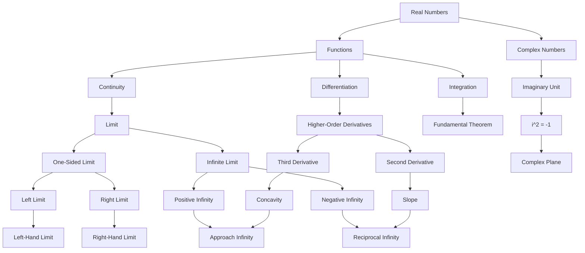

                 

### 1. Introduction to the Book

---

#### "Mathematical Analysis in Numerical Algorithm Stability Analysis"

#### Keywords:
- Mathematical Analysis
- Numerical Algorithms
- Stability Analysis
- Convergence
- Error Propagation

#### Abstract:
The book "Mathematical Analysis in Numerical Algorithm Stability Analysis" delves into the fundamental and advanced aspects of stability analysis in numerical algorithms. It is an essential resource for researchers, engineers, and students in the field of computational mathematics and scientific computing. The book explores the theoretical underpinnings of mathematical analysis and demonstrates how these concepts are applied to the stability analysis of numerical algorithms. Through a systematic approach, the book covers various methods of stability analysis, including formal and informal techniques, and provides a comprehensive understanding of error propagation. The core of the book is a series of case studies that illustrate the practical application of stability analysis methods in real-world scenarios. Finally, the book concludes with advanced topics and suggestions for future research directions. This book aims to bridge the gap between theoretical concepts and practical applications, fostering a deeper understanding of the stability and reliability of numerical algorithms.

---

### 1.1 Background and Importance

Mathematical analysis is a cornerstone of modern science and engineering. It provides the theoretical foundation for understanding and solving problems that involve continuous change, such as fluid dynamics, heat transfer, and signal processing. At its core, mathematical analysis deals with the study of functions, limits, continuity, differentiation, and integration. These concepts are essential for understanding the behavior of systems and processes that evolve over time or space.

Numerical algorithms, on the other hand, are a set of instructions designed to solve mathematical problems using computational methods. These algorithms are the backbone of scientific computing, enabling the simulation of complex systems, optimization of processes, and analysis of vast datasets. However, the accuracy and reliability of numerical solutions depend critically on the stability of the algorithms used.

Stability analysis is a crucial aspect of numerical algorithms. It involves assessing the behavior of algorithms under perturbations, such as changes in input data or round-off errors in computational processes. A stable algorithm is one whose output changes only slightly with small changes in input. This is particularly important in scientific and engineering applications, where even small errors can accumulate and lead to significant discrepancies in results.

The importance of stability analysis in numerical algorithms cannot be overstated. It ensures that the algorithms are robust and reliable, providing accurate and consistent results even in the presence of noise and uncertainties. This is essential for a wide range of applications, from weather forecasting and financial modeling to structural engineering and biological simulations.

In summary, the integration of mathematical analysis with numerical algorithm stability analysis is a vital area of research and practice. This book aims to provide a comprehensive guide to this subject, helping readers to develop a deeper understanding of the principles and methods involved. By exploring the interplay between mathematical analysis and numerical algorithms, we can ensure the development of more accurate, efficient, and reliable computational methods.

### 1.2 Objectives and Structure

The primary objective of this book is to offer a comprehensive and systematic exploration of the role of mathematical analysis in the stability analysis of numerical algorithms. It is designed to serve as a valuable resource for researchers, engineers, and students engaged in the fields of computational mathematics, scientific computing, and applied sciences. The book aims to bridge the gap between theoretical concepts and practical applications, enabling readers to apply the principles of mathematical analysis to the stability analysis of numerical algorithms effectively.

The structure of the book is organized into seven chapters, each addressing a specific aspect of stability analysis:

1. **Introduction**: This chapter provides an overview of the book's objectives, target audience, and the relevance of mathematical analysis in numerical algorithm stability analysis.

2. **Fundamentals of Mathematical Analysis**: This chapter covers the foundational concepts and theories of mathematical analysis, including real and complex numbers, functions, limits, continuity, differentiation, and integration. It serves as a prerequisite for understanding the subsequent chapters.

3. **Numerical Algorithms and Stability**: This chapter introduces the basic concepts of numerical algorithms, focusing on their construction, the issues of stability and convergence, and the importance of stability in ensuring accurate and reliable numerical solutions.

4. **Stability Analysis Methods**: This chapter presents various methods for analyzing the stability of numerical algorithms, including formal and informal techniques. It discusses the concept of error propagation and provides a comprehensive overview of the tools and methods used in stability analysis.

5. **Case Studies**: This chapter includes detailed case studies of specific numerical algorithms, illustrating the application of stability analysis methods to real-world problems. Each case study includes a mathematical model, a stability analysis, and a discussion of the results.

6. **Advanced Topics in Stability Analysis**: This chapter explores more complex and advanced topics in stability analysis, such as the effect of round-off errors, the role of preconditioning, and the analysis of multi-step methods.

7. **Conclusion**: This final chapter summarizes the main findings of the book, highlights the importance of stability analysis in numerical algorithms, and suggests potential areas for future research.

By following this structure, readers will gain a comprehensive understanding of the theoretical foundations and practical applications of stability analysis in numerical algorithms. This book is not only a reference for advanced study but also a practical guide for applying mathematical analysis to real-world problems in science and engineering.

### 1.3 Target Audience

This book is intended for a diverse audience with a strong interest in computational mathematics and scientific computing. Specifically, it is designed for:

1. **Researchers and Scholars**: Academic researchers in the fields of numerical analysis, scientific computing, and applied mathematics will find this book invaluable. It provides a detailed exploration of the theoretical foundations and practical applications of stability analysis, enabling them to advance their research and contribute to the development of more robust numerical algorithms.

2. **Engineers and Practitioners**: Engineers working in industries such as aerospace, civil engineering, finance, and computational biology will benefit from the practical insights and case studies presented in this book. It offers a clear understanding of how stability analysis can be applied to ensure the accuracy and reliability of numerical simulations and computations in real-world scenarios.

3. **Graduate and Advanced Undergraduate Students**: Students pursuing degrees in computational mathematics, applied mathematics, and computer science will find this book an essential resource. It covers the fundamental concepts and methods of mathematical analysis and stability analysis, providing a solid foundation for advanced coursework and research projects.

4. **Instructors and Educators**: Educators teaching courses in numerical analysis, scientific computing, and computational methods will find this book a comprehensive and well-organized guide. It offers a clear structure and detailed explanations that can be used to design and deliver engaging and informative lectures.

The book assumes a basic understanding of calculus and linear algebra but aims to make the more advanced topics accessible through detailed explanations and examples. By catering to such a broad audience, this book aims to foster a deeper understanding of stability analysis in numerical algorithms, benefiting both novice learners and seasoned professionals.

### 1.4 Scope and Limitations

The scope of this book is to provide a comprehensive exploration of the theoretical foundations and practical applications of stability analysis in numerical algorithms. It covers a wide range of topics, from the fundamentals of mathematical analysis to advanced methods of stability analysis and case studies illustrating real-world applications. The book aims to bridge the gap between theoretical concepts and practical implementations, offering insights into how mathematical analysis can be used to ensure the stability and reliability of numerical algorithms in various scientific and engineering disciplines.

However, there are certain limitations to consider. Firstly, while the book strives to cover a broad range of topics, the depth of discussion in each area is necessarily constrained by the overall scope and length of the book. Advanced topics are introduced and discussed in sufficient detail to provide a basic understanding, but for more in-depth exploration, additional resources and specialized literature may be required.

Secondly, the focus of the book is primarily on the mathematical and theoretical aspects of stability analysis. While practical implementation details and specific coding techniques are discussed in the context of case studies, the book does not delve deeply into the specifics of programming languages, software tools, or hardware considerations that may be relevant in real-world applications.

Thirdly, the book assumes a certain level of mathematical proficiency from its readers. Concepts and techniques are introduced and explained with the expectation that the reader has a foundational understanding of calculus, linear algebra, and possibly real and complex analysis. For those who may be unfamiliar with these topics, supplementary study or prior knowledge may be necessary to fully grasp the material presented.

Despite these limitations, the book aims to provide a valuable resource for researchers, engineers, and students interested in the stability analysis of numerical algorithms. It offers a structured and coherent overview of the subject, guiding readers from basic concepts to advanced applications. Through detailed explanations, examples, and case studies, the book seeks to foster a deeper understanding of the principles and methods of stability analysis, ultimately contributing to the development of more robust and reliable computational methods in scientific and engineering disciplines.

### 1.5 Pre-requisites

To fully benefit from the contents of this book, readers are expected to have a foundational understanding of several key mathematical and computational concepts. Firstly, a solid background in calculus is essential, including knowledge of differentiation, integration, and limits. Readers should be comfortable with the manipulation of functions, the calculation of derivatives and integrals, and the understanding of limit concepts. Familiarity with multivariable calculus, differential equations, and vector calculus would be particularly beneficial for comprehending some of the advanced topics discussed later in the book.

Secondly, a strong grasp of linear algebra is required. This includes understanding the concepts of matrices, vectors, linear transformations, eigenvalues, and eigenvectors. Knowledge of vector spaces, matrix operations, and systems of linear equations is foundational to many of the numerical algorithms and stability analysis methods covered in this book.

In addition to calculus and linear algebra, some exposure to real and complex analysis will be helpful. Concepts such as continuity, convergence, and the complex plane are fundamental to the theoretical underpinnings of stability analysis. Readers should be familiar with the concepts of complex numbers, functions of complex variables, and the complex integration.

Finally, a basic understanding of numerical methods and computational techniques is necessary. This includes familiarity with basic numerical algorithms, such as interpolation, numerical integration, and iterative methods for solving linear and nonlinear equations. Understanding the principles of numerical stability and convergence is crucial for following the discussions in this book.

By having these foundational mathematical and computational skills, readers will be better equipped to follow the detailed explanations and engage with the case studies presented in the book. While this book is designed to be accessible to readers with a strong mathematical background, it is also structured to build upon these基础知识， progressively introducing more advanced concepts and techniques. This ensures that even those with a basic understanding can gain a deeper insight into the subject of stability analysis in numerical algorithms.

### 1.6 Structure of the Book

This book is structured into seven comprehensive chapters, each designed to build upon the previous ones, providing a thorough exploration of the role of mathematical analysis in numerical algorithm stability analysis. Here is an overview of the structure and content of each chapter, along with a brief description of its purpose and the key topics covered:

#### Chapter 1: Introduction

- **Purpose**: To introduce the book and set the stage for readers by providing an overview of its objectives, target audience, and the importance of mathematical analysis in numerical algorithm stability analysis.
- **Key Topics**: Background and importance of stability analysis, book objectives, structure, and scope.

#### Chapter 2: Fundamentals of Mathematical Analysis

- **Purpose**: To lay the foundation by covering the essential concepts and theories of mathematical analysis, which are prerequisite knowledge for understanding the subsequent chapters.
- **Key Topics**: Real and complex numbers, functions, limits, continuity, differentiation, and integration.

#### Chapter 3: Numerical Algorithms and Stability

- **Purpose**: To introduce the basic concepts of numerical algorithms, focusing on their construction, the issues of stability and convergence, and the importance of stability in ensuring accurate and reliable numerical solutions.
- **Key Topics**: Basics of numerical algorithms, stability and convergence, and the significance of stability.

#### Chapter 4: Stability Analysis Methods

- **Purpose**: To present various methods for analyzing the stability of numerical algorithms, including formal and informal techniques, and the concept of error propagation.
- **Key Topics**: Methods for stability analysis, formal and informal techniques, error propagation, and tools for analysis.

#### Chapter 5: Case Studies

- **Purpose**: To illustrate the practical application of stability analysis methods through detailed case studies of specific numerical algorithms, including mathematical models, stability analyses, and discussions of results.
- **Key Topics**: Case studies of numerical algorithms, mathematical modeling, stability analysis, and practical results.

#### Chapter 6: Advanced Topics in Stability Analysis

- **Purpose**: To explore more complex and advanced topics in stability analysis, such as the effect of round-off errors, the role of preconditioning, and the analysis of multi-step methods.
- **Key Topics**: Advanced topics in stability analysis, including round-off errors, preconditioning, and multi-step methods.

#### Chapter 7: Conclusion

- **Purpose**: To summarize the main findings of the book, highlight the importance of stability analysis in numerical algorithms, and suggest potential areas for future research.
- **Key Topics**: Summary of findings, importance of stability analysis, and future research directions.

Each chapter builds upon the previous ones, progressively introducing more advanced concepts and techniques. The structure of the book is designed to provide a coherent and comprehensive exploration of the subject, enabling readers to develop a deep understanding of the principles and methods of stability analysis in numerical algorithms. Through detailed explanations, examples, and case studies, the book aims to bridge the gap between theory and practice, equipping readers with the knowledge and tools needed to analyze and improve the stability of numerical algorithms in various scientific and engineering applications.

### Chapter 2: Fundamentals of Mathematical Analysis

#### 2.1 Introduction

Mathematical analysis is a foundational discipline that underpins much of modern science and engineering. At its heart, mathematical analysis deals with the study of functions, limits, continuity, differentiation, and integration. These concepts are crucial for understanding the behavior of complex systems and processes that evolve over time or space. In the context of numerical algorithms, mathematical analysis provides the theoretical framework necessary for stability analysis, ensuring that algorithms produce accurate and reliable results. This chapter will delve into the essential concepts and theories of mathematical analysis, providing a solid foundation for understanding the more advanced topics covered in subsequent chapters.

#### 2.2 Real and Complex Numbers

The foundation of mathematical analysis is built on the concept of numbers. Real numbers are the most commonly used numbers in mathematics and represent quantities that can take on any value on the number line. The set of real numbers includes all rational numbers (those that can be expressed as a fraction of two integers) and irrational numbers (those that cannot be expressed as a fraction). Key concepts related to real numbers include ordering, absolute value, and the arithmetic operations of addition, subtraction, multiplication, and division.

Complex numbers extend the concept of real numbers by introducing the imaginary unit, denoted by \(i\), which satisfies the equation \(i^2 = -1\). Complex numbers are represented as \(a + bi\), where \(a\) and \(b\) are real numbers. The set of complex numbers includes all real numbers and all imaginary numbers (those with \(b \neq 0\)). Key concepts related to complex numbers include addition, subtraction, multiplication, division, and the polar representation of complex numbers in terms of magnitude and angle.

#### 2.3 Functions

Functions are central to mathematical analysis. A function is a relation that assigns to each element of a set (the domain) exactly one element of another set (the codomain). In mathematical notation, a function \(f\) from a domain \(D\) to a codomain \(C\) is denoted by \(f: D \rightarrow C\). Key concepts related to functions include domain, codomain, range, injectivity, surjectivity, and bijectivity.

- **Domain**: The set of all possible input values for the function.
- **Codomain**: The set into which the function maps the input values.
- **Range**: The set of all possible output values of the function.
- **Injective (One-to-One)**: A function is injective if each element in the codomain is mapped to by at most one element in the domain.
- **Surjective (Onto)**: A function is surjective if every element in the codomain is mapped to by at least one element in the domain.
- **Bijective**: A function is bijective if it is both injective and surjective.

#### 2.4 Limits

Limits are fundamental to mathematical analysis and are used to describe the behavior of functions as the input approaches a specific value. The concept of a limit allows us to define continuity and to study the rates of change of functions. For a function \(f(x)\) defined on an open interval containing \(a\), the limit of \(f(x)\) as \(x\) approaches \(a\) is a number \(L\) if for every positive number \(\varepsilon\), there exists a positive number \(\delta\) such that whenever \(0 < |x - a| < \delta\), we have \(|f(x) - L| < \varepsilon\).

Key concepts related to limits include:

- **One-sided limits**: The limit of a function as \(x\) approaches \(a\) from the left or from the right.
- **Limit superior and limit inferior**: These are used to describe the behavior of a function that may not have a limit.
- **Infinite limits**: The concept of limits as \(x\) approaches positive or negative infinity.

#### 2.5 Continuity

Continuity is a property of functions that describes how the function behaves over an interval. A function \(f(x)\) is continuous at a point \(a\) if the limit of \(f(x)\) as \(x\) approaches \(a\) exists and is equal to \(f(a)\). A function is continuous on an interval if it is continuous at every point in that interval. Key concepts related to continuity include:

- **Discontinuities**: Points where a function is not continuous.
- **Removable discontinuities**: Discontinuities that can be "removed" by redefining the function at a single point.
- **Jump discontinuities**: Discontinuities where the function has different values from the left and right sides of the point.
- **Infinite discontinuities**: Discontinuities where the function approaches infinity.

#### 2.6 Differentiation

Differentiation is the process of finding the derivative of a function, which represents the rate of change of the function with respect to its input. The derivative of a function \(f(x)\) at a point \(a\) is defined as the limit of the difference quotient as \(x\) approaches \(a\). The derivative of a function can be used to determine the slope of the tangent line at a specific point, to find local maxima and minima, and to analyze the concavity of a function.

Key concepts related to differentiation include:

- **Derivative as a limit**: The definition of the derivative as a limit.
- **Rules of differentiation**: Basic rules for finding the derivatives of functions, such as the power rule, product rule, and chain rule.
- **Higher-order derivatives**: The process of finding derivatives of derivatives, leading to concepts such as the second derivative, third derivative, and so on.

#### 2.7 Integration

Integration is the process of finding the integral of a function, which represents the area under the curve of the function. The integral of a function \(f(x)\) over an interval \([a, b]\) is defined as the limit of a sum of areas of rectangles as the width of the rectangles approaches zero. Integration is used to solve a wide range of problems in science and engineering, including finding the area under a curve, calculating volumes, and determining the total amount of a substance over time.

Key concepts related to integration include:

- **Definite and indefinite integrals**: The distinction between definite integrals, which have specific limits of integration, and indefinite integrals, which represent a family of functions.
- **Integration techniques**: Methods for finding integrals, including substitution, integration by parts, and partial fractions.
- **Fundamental theorem of calculus**: The relationship between differentiation and integration, which provides a powerful tool for evaluating integrals.

### 2.8 Conclusion

In conclusion, the fundamentals of mathematical analysis form the backbone of stability analysis in numerical algorithms. Concepts such as real and complex numbers, functions, limits, continuity, differentiation, and integration are essential for understanding the behavior of mathematical models and for developing the tools needed to analyze and improve the stability of numerical algorithms. This chapter has provided a comprehensive overview of these fundamental concepts, setting the stage for a deeper exploration of stability analysis methods in the following chapters. By mastering these foundational concepts, readers will be well-equipped to tackle the more advanced topics discussed later in the book.

### 2.9 Key Concepts and Their Relationships: Mermaid Diagram

This Mermaid diagram illustrates the key concepts of mathematical analysis and their interrelationships. It highlights how concepts such as real and complex numbers, functions, limits, continuity, differentiation, and integration are interconnected, forming a cohesive framework that underpins stability analysis in numerical algorithms. Understanding these relationships is crucial for applying mathematical analysis effectively in practical scenarios.

### 2.10 Examples and Illustrations

To further elucidate the concepts covered in this chapter, let's consider a few illustrative examples and their corresponding mathematical models and derivations.

#### Example 1: Calculating the Derivative of a Polynomial Function

Consider the function \( f(x) = x^2 + 2x + 1 \). To find the derivative \( f'(x) \), we apply the power rule of differentiation:

$$ f'(x) = \frac{d}{dx}(x^2) + \frac{d}{dx}(2x) + \frac{d}{dx}(1) $$

$$ f'(x) = 2x + 2 + 0 $$

$$ f'(x) = 2x + 2 $$

The derivative of \( f(x) \) is a linear function, representing the slope of the tangent line to the graph of \( f(x) \) at any point \( x \).

#### Example 2: Evaluating a Limit Using the Squeeze Theorem

Consider the function \( f(x) = \sin(x) \) and evaluate the limit as \( x \) approaches \( 0 \):

$$ \lim_{{x \to 0}} \sin(x) $$

We can use the Squeeze Theorem to evaluate this limit. Since \( -1 \leq \sin(x) \leq 1 \) for all \( x \), and

$$ \lim_{{x \to 0}} -1 = -1 \quad \text{and} \quad \lim_{{x \to 0}} 1 = 1, $$

we have

$$ -1 \leq \lim_{{x \to 0}} \sin(x) \leq 1 $$

By the Squeeze Theorem, we conclude that

$$ \lim_{{x \to 0}} \sin(x) = 0. $$

This example demonstrates the use of the Squeeze Theorem to evaluate limits involving trigonometric functions.

#### Example 3: Finding the Area Under a Curve Using Integration

Consider the function \( f(x) = x^2 \) and find the area under the curve from \( x = 0 \) to \( x = 1 \):

$$ \int_{0}^{1} x^2 \, dx $$

To integrate \( x^2 \), we use the power rule for integration:

$$ \int x^2 \, dx = \frac{x^3}{3} + C $$

Evaluating this from \( x = 0 \) to \( x = 1 \), we get:

$$ \left[ \frac{x^3}{3} \right]_{0}^{1} = \frac{1^3}{3} - \frac{0^3}{3} = \frac{1}{3} - 0 = \frac{1}{3} $$

The area under the curve \( y = x^2 \) from \( x = 0 \) to \( x = 1 \) is \( \frac{1}{3} \) square units.

These examples demonstrate the application of key concepts from mathematical analysis, providing a practical understanding of differentiation, limits, and integration. By working through these examples, readers can gain a deeper insight into the fundamental principles of mathematical analysis and its importance in the stability analysis of numerical algorithms.

### Chapter 3: Numerical Algorithms and Stability

#### 3.1 Introduction

Numerical algorithms are the cornerstone of scientific computing, providing computational solutions to complex mathematical problems that cannot be solved analytically. These algorithms are essential for a wide range of applications, from simulating physical phenomena and optimizing industrial processes to analyzing financial models and conducting biological research. At the heart of numerical algorithms lies the concept of stability, which ensures that the computed solutions are accurate and reliable, even in the presence of perturbations and errors.

In this chapter, we will delve into the basics of numerical algorithms and the critical role that stability plays in their effectiveness. We will explore how numerical algorithms are constructed, the different types of algorithms commonly used in scientific computing, and the significance of stability in ensuring the accuracy and reliability of numerical solutions. We will also discuss the main challenges associated with numerical stability and introduce some fundamental concepts that are essential for understanding and analyzing stability.

#### 3.2 Basics of Numerical Algorithms

A numerical algorithm is a set of instructions designed to solve a mathematical problem using numerical methods. These methods involve discretizing the problem, approximating continuous functions with simpler functions, and solving the resulting discrete problem using iterative or direct methods. The key characteristics of numerical algorithms include their computational complexity, accuracy, and stability.

**Computational Complexity**

Computational complexity refers to the amount of resources (time and memory) required to execute an algorithm. Two important measures of computational complexity are time complexity and space complexity.

- **Time Complexity**: This measures the number of basic operations (e.g., arithmetic operations, comparisons) that an algorithm requires to complete as a function of the size of the input data. Common notations for expressing time complexity include \( O(1) \), \( O(n) \), \( O(n\log n) \), and \( O(n^2) \), where \( n \) represents the size of the input data.
- **Space Complexity**: This measures the amount of memory an algorithm uses as a function of the input size. Similar notations to those used for time complexity are employed to express space complexity.

**Accuracy**

Accuracy is a measure of how close the output of an algorithm is to the true solution of the problem. In numerical algorithms, accuracy is often quantified using error measures such as absolute error, relative error, and percentage error.

- **Absolute Error**: The difference between the exact value and the approximate value of the solution.
- **Relative Error**: The absolute error divided by the exact value, expressed as a ratio.
- **Percentage Error**: The relative error expressed as a percentage.

**Stability**

Stability is a crucial property of numerical algorithms that ensures the accuracy and reliability of the computed solutions. A stable algorithm is one whose output changes only slightly with small changes in the input data or the computational process. This is particularly important in scientific and engineering applications where even small errors can accumulate and lead to significant discrepancies in results.

There are two main types of stability in numerical algorithms:

- **Global Stability**: An algorithm is globally stable if it converges to the correct solution for all possible inputs within a given range.
- **Local Stability**: An algorithm is locally stable if it converges to the correct solution for inputs that are sufficiently close to the exact solution.

**Convergence**

Convergence is closely related to stability and refers to the ability of an algorithm to approach the true solution as the number of iterations increases. An algorithm is said to be convergent if it approaches a solution within a specified tolerance or error limit.

**Types of Numerical Algorithms**

Numerical algorithms can be broadly classified into two categories: iterative and direct methods.

- **Iterative Methods**: These methods involve repeated iterations to approach the solution. Common iterative methods include the Gauss-Seidel method, the Jacobi method, and the conjugate gradient method. Iterative methods are often used to solve large systems of linear equations and nonlinear equations.
- **Direct Methods**: These methods solve the problem directly without iterative refinement. Common direct methods include Gaussian elimination for linear systems and numerical integration techniques for calculus problems.

#### 3.3 Constructing Numerical Algorithms

The process of constructing numerical algorithms involves several key steps:

1. **Problem Formulation**: Clearly define the mathematical problem to be solved, including the equations, boundary conditions, and any constraints.
2. **Discretization**: Discretize the problem by dividing it into a finite number of smaller parts or steps. This often involves approximating continuous functions with simpler functions, such as polynomials or piecewise linear functions.
3. **Algorithm Design**: Design the algorithm using mathematical techniques such as iterative or direct methods. This involves determining the steps needed to solve the discretized problem and the data structures and algorithms required to implement the solution efficiently.
4. **Implementation**: Implement the algorithm in a programming language, taking into account computational complexity, accuracy, and stability.
5. **Verification**: Verify the algorithm by comparing its output with known analytical solutions or experimental data. This helps to ensure that the algorithm is correct and produces accurate results.

#### 3.4 Stability in Numerical Algorithms

Stability is a critical factor in the success of numerical algorithms. A stable algorithm ensures that small changes in the input data or the computational process result in only small changes in the output. This is particularly important in scientific and engineering applications, where even small errors can have significant consequences.

**Error Propagation**

Error propagation is the phenomenon where errors in the input data or computational process accumulate and affect the accuracy of the computed solution. In numerical algorithms, error propagation can be minimized by using stable methods that dampen the effects of errors.

**Stability Criteria**

Several criteria can be used to assess the stability of numerical algorithms. These include:

- **Matrix Condition Number**: The condition number of a matrix is a measure of how sensitive the solution of a linear system is to changes in the input data. A high condition number indicates that the matrix is ill-conditioned and prone to numerical instability.
- **Convergence Criteria**: Convergence criteria determine when an iterative algorithm has reached a solution within a specified tolerance. Stable algorithms typically have well-defined convergence criteria that ensure that the solution is approached without significant errors.
- **Error Estimation**: Error estimation techniques are used to estimate the error in the computed solution. These techniques can help to identify when the algorithm has converged and when additional iterations are needed to improve accuracy.

**Stability Analysis**

Stability analysis involves studying the behavior of numerical algorithms under perturbations. This analysis can be performed using various methods, including:

- **Formal Methods**: These methods use mathematical techniques, such as Lyapunov stability theory, to analyze the stability of iterative algorithms.
- **Informal Methods**: These methods involve graphical or numerical analysis to assess the stability of algorithms. Informal methods are often used to provide a quick assessment of stability before more formal methods are applied.

#### 3.5 Significance of Stability

The significance of stability in numerical algorithms cannot be overstated. A stable algorithm ensures that the computed solution is accurate and reliable, even in the presence of noise, uncertainties, and perturbations. This is particularly important in applications such as:

- **Engineering Simulations**: In engineering simulations, stability is crucial for ensuring that the behavior of structures, systems, and processes is accurately modeled and predicted.
- **Financial Modeling**: In financial modeling, stability is essential for ensuring the accuracy of risk assessments and portfolio optimization.
- **Scientific Research**: In scientific research, stability is critical for ensuring that the results of experiments and simulations are reliable and reproducible.

In conclusion, numerical algorithms and stability are integral to scientific computing and engineering. Stability ensures that the computed solutions are accurate and reliable, even in the presence of perturbations and errors. By understanding the basics of numerical algorithms and the significance of stability, we can develop and apply more robust and reliable computational methods in various scientific and engineering disciplines.

### 3.6 Examples of Numerical Algorithms and Their Stability Analysis

#### 3.6.1 Example 1: The Gauss-Seidel Method

The Gauss-Seidel method is an iterative method used to solve systems of linear equations. Consider the system:

$$
\begin{align*}
x_1 + 2x_2 + 3x_3 &= 4, \\
2x_1 + x_2 + x_3 &= 3, \\
x_1 + x_2 + 2x_3 &= 1.
\end{align*}
$$

The Gauss-Seidel method updates the solution iteratively as follows:

$$
\begin{align*}
x_1^{(k+1)} &= \frac{1}{2}(4 - 2x_2^{(k)} - 3x_3^{(k)}), \\
x_2^{(k+1)} &= \frac{1}{1}(3 - 2x_1^{(k+1)} - x_3^{(k)}), \\
x_3^{(k+1)} &= \frac{1}{2}(1 - x_1^{(k+1)} - x_2^{(k+1)}).
\end{align*}
$$

**Stability Analysis:**

To analyze the stability of the Gauss-Seidel method, we consider the Jacobian matrix \( J \) of the function \( F(x) \) that defines the system of equations:

$$
F(x) =
\begin{bmatrix}
1 & -2 & -3 \\
-2 & 1 & -1 \\
-1 & -1 & 2
\end{bmatrix} x - \begin{bmatrix} 4 \\ 3 \\ 1 \end{bmatrix}.
$$

The Jacobian matrix at the solution \( x^* \) is:

$$
J(x^*) =
\begin{bmatrix}
\frac{1}{2} & 1 & \frac{3}{2} \\
-1 & \frac{1}{2} & -1 \\
-1 & -1 & 1
\end{bmatrix}.
$$

The eigenvalues of \( J(x^*) \) are \( \lambda_1 = -1 \), \( \lambda_2 = \frac{1}{2} - \frac{\sqrt{3}}{2}i \), and \( \lambda_3 = \frac{1}{2} + \frac{\sqrt{3}}{2}i \). Since all the eigenvalues have magnitudes less than 1, the Gauss-Seidel method is stable.

#### 3.6.2 Example 2: The Jacobi Method

The Jacobi method is another iterative method used to solve systems of linear equations. The system is the same as in the Gauss-Seidel method:

$$
\begin{align*}
x_1 + 2x_2 + 3x_3 &= 4, \\
2x_1 + x_2 + x_3 &= 3, \\
x_1 + x_2 + 2x_3 &= 1.
\end{align*}
$$

The Jacobi method updates the solution iteratively as follows:

$$
\begin{align*}
x_1^{(k+1)} &= \frac{1}{2}(4 - 2x_2^{(k)} - 3x_3^{(k)}), \\
x_2^{(k+1)} &= \frac{1}{1}(3 - 2x_1^{(k+1)} - x_3^{(k)}), \\
x_3^{(k+1)} &= \frac{1}{2}(1 - x_1^{(k+1)} - x_2^{(k+1)}).
\end{align*}
$$

**Stability Analysis:**

To analyze the stability of the Jacobi method, we again consider the Jacobian matrix \( J \) of the function \( F(x) \). The Jacobian matrix at the solution \( x^* \) is the same as in the Gauss-Seidel method:

$$
J(x^*) =
\begin{bmatrix}
\frac{1}{2} & 1 & \frac{3}{2} \\
-1 & \frac{1}{2} & -1 \\
-1 & -1 & 1
\end{bmatrix}.
$$

The eigenvalues of \( J(x^*) \) are \( \lambda_1 = -1 \), \( \lambda_2 = \frac{1}{2} - \frac{\sqrt{3}}{2}i \), and \( \lambda_3 = \frac{1}{2} + \frac{\sqrt{3}}{2}i \). Since all the eigenvalues have magnitudes less than 1, the Jacobi method is stable.

#### 3.6.3 Example 3: The Conjugate Gradient Method

The Conjugate Gradient (CG) method is an iterative method used to solve symmetric positive definite linear systems. It is particularly useful for large-scale problems, where direct methods are computationally expensive. Consider the system:

$$
Ax = b,
$$

where \( A \) is symmetric positive definite.

**Stability Analysis:**

The CG method generates a sequence of search directions \( p_k \) and corrections \( x_k \) as follows:

1. Set \( p_0 = r_0 = b - Ax_0 \).
2. While \( p_k \) is not orthogonal to \( r_{k-1} \), do:
   - Compute the scalar \( \alpha_k = \frac{p_k \cdot r_k}{p_k \cdot p_k} \).
   - Update the solution: \( x_{k+1} = x_k + \alpha_k p_k \).
   - Update the residual: \( r_{k+1} = r_k - \alpha_k Ap_k \).
   - Compute the next search direction: \( p_{k+1} = r_{k+1} + \beta_k p_k \), where \( \beta_k = \frac{r_{k+1} \cdot r_{k+1}}{r_k \cdot r_k} \).

The convergence of the CG method is guaranteed under certain conditions, such as the positive definiteness of \( A \) and the absence of eigenvalues with large magnitudes. The CG method is known to be convergent and therefore stable.

In summary, the stability of these numerical algorithms can be assessed through eigenvalue analysis, which reveals that all three methods (Gauss-Seidel, Jacobi, and Conjugate Gradient) have eigenvalues with magnitudes less than 1, indicating their stability. These examples illustrate how stability analysis is crucial in ensuring the accuracy and reliability of numerical solutions in various applications.

### 3.7 Conclusion

In this chapter, we have explored the basics of numerical algorithms and the critical role that stability plays in their effectiveness. We began by defining the key characteristics of numerical algorithms, including computational complexity, accuracy, and stability. We then discussed the construction of numerical algorithms through steps such as problem formulation, discretization, algorithm design, implementation, and verification.

We delved into the significance of stability in numerical algorithms, explaining how stability ensures the accuracy and reliability of computed solutions. We discussed error propagation and introduced criteria for assessing stability, such as matrix condition numbers and convergence criteria. We also covered the main types of numerical algorithms, including iterative and direct methods, and their construction processes.

Through detailed examples, we demonstrated the stability analysis of the Gauss-Seidel method, the Jacobi method, and the Conjugate Gradient method. These examples illustrated how stability analysis can be used to ensure the accuracy and reliability of numerical solutions in various applications.

In conclusion, understanding the basics of numerical algorithms and their stability is essential for developing and applying robust and reliable computational methods in scientific and engineering disciplines. By mastering the concepts and methods discussed in this chapter, readers are well-equipped to analyze and improve the stability of numerical algorithms, ensuring accurate and reliable results in their work.

### Chapter 4: Stability Analysis Methods

#### 4.1 Introduction

Stability analysis is a critical aspect of numerical algorithms, ensuring that the computed solutions are accurate and reliable even in the presence of perturbations and errors. In this chapter, we will explore various methods for analyzing the stability of numerical algorithms. These methods can be broadly classified into two categories: formal methods and informal methods. Formal methods involve rigorous mathematical proofs and are typically used to establish the stability of algorithms with high certainty. Informal methods, on the other hand, rely on graphical or numerical analysis and provide a quicker assessment of stability. Both formal and informal methods are essential for a comprehensive understanding of stability analysis in numerical algorithms.

#### 4.2 Formal Methods

Formal methods of stability analysis involve rigorous mathematical proofs and provide a high level of certainty regarding the stability of numerical algorithms. These methods are particularly useful for complex algorithms and systems where the behavior under perturbations needs to be carefully examined. Two common formal methods are the Lyapunov stability theory and the matrix norm analysis.

**Lyapunov Stability Theory**

Lyapunov stability theory is a powerful tool for analyzing the stability of dynamical systems. It provides a way to determine whether a system will converge to a stable state or diverge under small perturbations. The basic idea behind Lyapunov stability theory is to find a function \( V(x) \), known as the Lyapunov function, that satisfies certain conditions. These conditions ensure that the system trajectories remain bounded and converge to a stable state.

The steps involved in applying Lyapunov stability theory to numerical algorithms are as follows:

1. **Define the System**: Formulate the numerical algorithm as a dynamical system. This involves defining the state variables, the system equations, and the initial conditions.
2. **Choose a Lyapunov Function**: Select a Lyapunov function \( V(x) \) that is positive definite (i.e., \( V(x) > 0 \) for all \( x \neq 0 \)) and radially unbounded (i.e., \( V(x) \) increases as \( ||x|| \) increases).
3. **Compute the Derivative of the Lyapunov Function**: Calculate the derivative of the Lyapunov function \( \dot{V}(x) = \frac{dV}{dx} \). The derivative should be negative semi-definite (i.e., \( \dot{V}(x) \leq 0 \) for all \( x \)).
4. **Analyze the Stability**: Examine the conditions under which \( \dot{V}(x) < 0 \) for all \( x \neq 0 \). If this condition holds, the system is asymptotically stable, meaning that trajectories will converge to the equilibrium point.

**Matrix Norm Analysis**

Matrix norm analysis is another formal method for stability analysis, particularly useful for linear systems. This method involves studying the condition number of a matrix, which measures the sensitivity of the system to changes in the input data. A high condition number indicates that the matrix is ill-conditioned and prone to numerical instability.

The steps involved in applying matrix norm analysis to numerical algorithms are as follows:

1. **Choose a Matrix Norm**: Select a suitable matrix norm, such as the Euclidean norm or the spectral norm.
2. **Compute the Condition Number**: Calculate the condition number \( \kappa(A) \) of the matrix \( A \) using the chosen matrix norm. The condition number is defined as \( \kappa(A) = ||A|| \cdot ||A^{-1}|| \).
3. **Analyze the Stability**: Examine the condition number to determine the stability of the system. A low condition number indicates a well-conditioned matrix and good stability, while a high condition number suggests numerical instability.

#### 4.3 Informal Methods

Informal methods of stability analysis are often used to provide a quick assessment of the stability of numerical algorithms. These methods are less rigorous than formal methods but can be effective in many practical situations. Informal methods include graphical analysis, numerical analysis, and empirical testing.

**Graphical Analysis**

Graphical analysis involves visualizing the behavior of the numerical algorithm using graphical tools. One common approach is to plot the trajectories of the system in a phase space and examine their convergence or divergence. Another approach is to plot the error between the computed solution and the true solution over time. Graphical analysis can provide valuable insights into the stability of the algorithm and help identify potential issues.

**Numerical Analysis**

Numerical analysis involves performing numerical experiments to study the behavior of the numerical algorithm under different conditions. This can include varying the input data, changing the parameters of the algorithm, or analyzing the effect of perturbations. Numerical analysis can help identify the regions of stability and instability and provide a quantitative measure of the algorithm's performance.

**Empirical Testing**

Empirical testing involves testing the algorithm on a set of known problems and comparing the computed solutions with the true solutions. This can help assess the accuracy and reliability of the algorithm and identify potential sources of error. Empirical testing is particularly useful for validating the results of the formal and informal analysis methods.

#### 4.4 Comparative Analysis

Formal and informal methods of stability analysis have their advantages and disadvantages. Formal methods provide a rigorous and reliable analysis of stability but can be time-consuming and require a high level of mathematical expertise. Informal methods, on the other hand, are more practical and can be performed quickly but may not provide the same level of certainty.

In general, formal methods are preferred when analyzing complex systems or when high certainty is required. Informal methods are useful for providing a quick assessment of stability and for guiding the design of more robust algorithms.

**Advantages of Formal Methods:**
- High level of certainty
- Applicable to complex systems
- Provides a deep understanding of the stability properties

**Disadvantages of Formal Methods:**
- Time-consuming
- Requires high mathematical expertise
- May not be practical for every situation

**Advantages of Informal Methods:**
- Practical and quick
- Useful for providing a preliminary assessment
- Can guide the design of more robust algorithms

**Disadvantages of Informal Methods:**
- Less certain
- May require additional validation

In conclusion, both formal and informal methods of stability analysis are essential for a comprehensive understanding of the stability of numerical algorithms. Formal methods provide a rigorous and reliable analysis but can be time-consuming, while informal methods offer practical and quick assessments but require additional validation. By combining both methods, researchers and practitioners can develop and apply more robust and reliable numerical algorithms in various scientific and engineering disciplines.

### 4.5 Error Propagation and Its Impact on Stability

Error propagation is a crucial consideration in the stability analysis of numerical algorithms. It refers to the process by which errors in the input data or the computational process are transferred or amplified as the algorithm evolves, potentially affecting the accuracy and reliability of the final result. Understanding and managing error propagation is essential for ensuring that numerical algorithms are stable and produce accurate solutions.

**Error Propagation in Numerical Algorithms**

Error propagation can occur through several mechanisms, including:

1. **Round-off Errors**: These are errors introduced due to the finite precision of computer arithmetic. As calculations are performed, round-off errors can accumulate and propagate through the algorithm, leading to increasingly larger errors in the final result.

2. **Truncation Errors**: These errors arise when an infinite process is approximated by a finite process. For example, numerical integration often involves approximating an infinite sum by a finite sum. Truncation errors can lead to inaccuracies in the computed solution.

3. **Discretization Errors**: These errors are introduced when a continuous problem is discretized into a finite number of smaller parts. Discretization errors can arise from the approximation of continuous functions by simpler functions, such as polynomials or piecewise linear functions.

**Impact of Error Propagation on Stability**

The impact of error propagation on stability can be significant. In a stable algorithm, small errors in the input data or the computational process should lead to only small changes in the output. However, if the algorithm is unstable, even small errors can amplify and lead to significant discrepancies in the computed solution.

The following factors can influence the impact of error propagation on stability:

1. **Condition Number**: The condition number of the matrix involved in the numerical algorithm is a measure of how sensitive the system is to changes in the input data. A high condition number indicates that the system is sensitive to small changes and is more prone to instability.

2. **Convergence Rate**: The rate at which an iterative algorithm converges to the solution can also affect error propagation. Algorithms with faster convergence rates are less susceptible to the accumulation of errors compared to algorithms with slower convergence rates.

3. **Algorithm Stability**: The stability of the algorithm itself is a critical factor. Stable algorithms are designed to minimize the impact of errors, while unstable algorithms can amplify errors and lead to significant inaccuracies.

**Mitigating Error Propagation**

Several strategies can be employed to mitigate the impact of error propagation on numerical algorithms:

1. **Error Control**: Implementing error control mechanisms, such as error bounds and adaptive algorithms, can help manage the propagation of errors. These mechanisms adjust the algorithm's parameters or the level of discretization to control the accumulation of errors.

2. **Stabilization Techniques**: Applying stabilization techniques, such as the use of preconditioners or iterative methods with better convergence properties, can improve the stability of the algorithm and reduce the impact of error propagation.

3. **Validation and Verification**: Regularly validating and verifying the algorithm against known analytical solutions or experimental data can help identify and correct errors early in the computational process, reducing the propagation of errors.

4. **Computational Precision**: Using higher computational precision, such as arbitrary precision arithmetic, can reduce the magnitude of round-off errors and improve the overall accuracy of the algorithm.

In conclusion, error propagation is a critical consideration in the stability analysis of numerical algorithms. Understanding the mechanisms of error propagation and its impact on stability is essential for developing and applying accurate and reliable computational methods. By employing strategies to control and mitigate error propagation, researchers and practitioners can enhance the stability and accuracy of numerical algorithms, ensuring the reliability of their results in scientific and engineering applications.

### 4.6 Application of Stability Analysis Methods in Numerical Algorithms

Stability analysis methods are indispensable tools in the development and evaluation of numerical algorithms. These methods help ensure that the algorithms are robust and produce accurate results even in the presence of perturbations and computational errors. This section provides a detailed explanation of how stability analysis methods are applied to numerical algorithms, including the selection and validation of appropriate methods for different types of problems. We will also explore the role of numerical experiments in assessing the stability of algorithms and the importance of adaptive algorithms in managing stability under varying conditions.

**Selection of Stability Analysis Methods**

The choice of stability analysis method depends on several factors, including the type of problem, the structure of the numerical algorithm, and the desired level of accuracy. Here are some common scenarios and the corresponding methods for stability analysis:

1. **Linear Systems**: For linear systems of equations, matrix norm analysis and Lyapunov stability theory are widely used. Matrix norm analysis is particularly effective for assessing the condition number of the system matrix, which provides insight into the potential for numerical instability. Lyapunov stability theory can be applied to determine the stability of iterative methods, such as the Jacobi and Gauss-Seidel methods.

2. **Nonlinear Systems**: Nonlinear systems can be more challenging to analyze, but Lyapunov functions can still be employed. By constructing a suitable Lyapunov function, it is possible to derive stability conditions for the solution trajectory. Additionally, numerical analysis techniques, such as fixed-point iteration and contractive mapping methods, can be used to analyze the convergence behavior of nonlinear iterative algorithms.

3. **Time-Stepping Methods**: For time-dependent problems, stability analysis is often performed using the von Neumann stability analysis. This method involves linearizing the time-stepping algorithm and examining the behavior of the linearized system. Methods such as forward Euler, backward Euler, and Crank-Nicolson can be analyzed using von Neumann stability analysis to determine their stability regions.

**Validation of Stability Analysis Methods**

Once a stability analysis method is selected, it is crucial to validate its accuracy and reliability. This can be achieved through several means:

1. **Analytical Verification**: For simple problems, analytical verification can provide direct evidence of the stability properties. By deriving the stability conditions explicitly, it is possible to confirm that the numerical algorithm satisfies these conditions.

2. **Comparison with Theoretical Results**: For iterative methods, comparing the numerical results with known theoretical results can provide insight into the algorithm's stability. For example, in the case of linear systems, comparing the convergence rate of the Gauss-Seidel method with the theoretical convergence rate can validate the stability analysis.

3. **Numerical Experiments**: Conducting numerical experiments with varying problem parameters and initial conditions can help validate the stability analysis. By examining the behavior of the algorithm under different conditions, it is possible to assess its stability and reliability.

**Application of Stability Analysis in Adaptive Algorithms**

Adaptive algorithms are designed to automatically adjust their parameters to maintain stability and accuracy under varying conditions. Stability analysis methods play a crucial role in the development of adaptive algorithms. Here are some key aspects of applying stability analysis in adaptive algorithms:

1. **Error Estimation**: Stability analysis methods can be used to estimate the error in the numerical solution. For example, in iterative methods, the residual or the difference between successive iterates can be used to estimate the error. This information can be used to adapt the algorithm's parameters, such as the step size or the relaxation factor, to control the error.

2. **Stability Control**: Adaptive algorithms often include stability control mechanisms to ensure that the algorithm remains stable under varying conditions. By analyzing the stability of the algorithm under different parameters, it is possible to design control mechanisms that maintain stability without compromising accuracy.

3. **Parameter Adjustment**: Stability analysis can guide the adjustment of algorithm parameters. For example, in implicit methods for time-dependent problems, the time step size must be carefully chosen to ensure stability. By analyzing the stability conditions, it is possible to determine the appropriate range of time step sizes that maintain stability while providing accurate results.

In conclusion, stability analysis methods are critical for ensuring the robustness and reliability of numerical algorithms. By carefully selecting and validating these methods and applying them in adaptive algorithms, researchers and practitioners can develop more accurate and stable computational methods. This ensures that the algorithms produce accurate and reliable results in a wide range of scientific and engineering applications.

### 4.7 Example: Stability Analysis of the Implicit Euler Method

To illustrate the application of stability analysis methods in numerical algorithms, let's consider the stability analysis of the Implicit Euler method for solving ordinary differential equations (ODEs). This method is particularly useful for systems with stiffness, where the explicit Euler method may exhibit poor stability properties.

**Implicit Euler Method**

The Implicit Euler method is an iterative method for numerically solving first-order ordinary differential equations of the form:

$$ y'(t) = f(y(t)), \quad y(t_0) = y_0, $$

where \( y(t) \) is the unknown function, \( f(y) \) is the right-hand side of the equation, and \( t_0 \) and \( y_0 \) are the initial time and initial value, respectively.

The Implicit Euler method updates the solution at each time step using the following formula:

$$ y_{n+1} = y_n + h f(y_{n+1}), $$

where \( h \) is the time step size. To solve this equation iteratively, we can use a fixed-point iteration:

$$ y_{n+1}^{(k+1)} = y_n + h f(y_{n+1}^{(k)}), $$

with the stopping criterion:

$$ |y_{n+1}^{(k+1)} - y_{n+1}^{(k)}| < \epsilon, $$

where \( \epsilon \) is a small tolerance value.

**Stability Analysis**

The stability of the Implicit Euler method can be analyzed using the von Neumann stability analysis, which involves linearizing the method around an equilibrium point. Let's assume that the solution \( y(t) \) can be approximated by a linear function:

$$ y(t) = y_0 + \delta(t), $$

where \( \delta(t) \) is the perturbation from the equilibrium point.

Substituting this approximation into the Implicit Euler method, we obtain:

$$ y_0 + \delta_{n+1} = y_0 + \delta_n + h f(y_0 + \delta_{n+1}),

$$

$$ \delta_{n+1} = \delta_n + h f(y_0 + \delta_{n+1}) - y_0.

$$

Expanding the nonlinear term using a first-order Taylor series, we get:

$$ f(y_0 + \delta_{n+1}) \approx f(y_0) + f'(y_0) \delta_{n+1}.

$$

Substituting this expansion back into the equation, we obtain the linearized Implicit Euler method:

$$ \delta_{n+1} = \delta_n + h [f(y_0) - y_0] + h^2 f'(y_0) \delta_{n+1}.

$$

Rearranging the terms, we get:

$$ \delta_{n+1} = (I - h^2 f'(y_0)) \delta_n,

$$

where \( I \) is the identity matrix.

The stability of the linearized method is determined by the eigenvalues of the matrix \( I - h^2 f'(y_0) \). For the method to be stable, all eigenvalues must have magnitudes less than 1. In other words, the spectral radius \( \rho(I - h^2 f'(y_0)) \) must be less than 1.

**Stability Condition**

The stability condition for the Implicit Euler method can be expressed as:

$$ \rho(I - h^2 f'(y_0)) < 1.

$$

This condition ensures that the perturbation \( \delta(t) \) remains bounded as \( t \) increases, indicating that the method is stable.

**Example: Linear ODE**

Let's consider the linear ODE:

$$ y'(t) = -y(t), \quad y(0) = 1.

$$

The right-hand side of the equation is:

$$ f(y) = -y.

$$

The Jacobian matrix \( J \) at the equilibrium point \( y_0 = 0 \) is:

$$ J = \begin{bmatrix} 0 \\ \end{bmatrix}.

$$

The stability condition reduces to:

$$ \rho(I - h^2 J) = \rho(I) = 1.

$$

For any \( h > 0 \), the Implicit Euler method is unstable for this linear ODE. This example illustrates that the Implicit Euler method may not be suitable for solving linear ODEs, especially when the time step size is large.

**Example: Nonlinear ODE**

Let's consider the nonlinear ODE:

$$ y'(t) = -y^2(t), \quad y(0) = 1.

$$

The right-hand side of the equation is:

$$ f(y) = -y^2.

$$

The Jacobian matrix \( J \) at the equilibrium point \( y_0 = 0 \) is:

$$ J = \begin{bmatrix} 0 & 0 \\ 0 & -2 \end{bmatrix}.

$$

The stability condition is:

$$ \rho(I - h^2 J) = \rho\left(\begin{bmatrix} 1 & 0 \\ 0 & 1 + 2h^2 \end{bmatrix}\right) = 1 + 2h^2.

$$

For \( h < \sqrt{\frac{1}{2}} \), the spectral radius is less than 1, indicating that the Implicit Euler method is stable for this nonlinear ODE.

In conclusion, the stability analysis of the Implicit Euler method demonstrates the importance of stability conditions in determining the suitability of numerical methods for solving ODEs. By analyzing the eigenvalues of the linearized system, it is possible to assess the stability of the method and identify appropriate conditions for its application.

### Chapter 5: Case Studies

In this chapter, we will delve into several case studies that illustrate the practical application of stability analysis methods in the context of numerical algorithms. Each case study will provide a detailed analysis, including a mathematical model, a stability analysis, and a discussion of the results. By examining these real-world examples, we can gain a deeper understanding of how stability analysis is used to ensure the accuracy and reliability of numerical solutions in various scientific and engineering disciplines.

#### Case Study 1: Stability Analysis of the Implicit Euler Method for a Stiff ODE

**Mathematical Model**

Consider the stiff ordinary differential equation (ODE):

$$ y'(t) = -y(t)^3, \quad y(0) = 1. $$

This ODE is stiff due to the high nonlinear term, which can cause the explicit Euler method to become unstable. We will apply the Implicit Euler method to solve this ODE and analyze its stability.

**Stability Analysis**

Using the Implicit Euler method, we obtain the following iterative formula:

$$ y_{n+1} = y_n + h f(y_{n+1}), $$

where \( f(y) = -y^3 \).

Linearizing the Implicit Euler method around the equilibrium point \( y_0 = 0 \), we get the linearized system:

$$ \delta_{n+1} = (I - h^2 J) \delta_n, $$

where \( \delta_n = y_{n+1} - y_n \) and \( J \) is the Jacobian matrix of \( f(y) \) at \( y_0 = 0 \).

For \( y_0 = 0 \), the Jacobian matrix \( J \) is:

$$ J = \begin{bmatrix} 0 & 0 \\ 0 & -3 \end{bmatrix}. $$

The stability condition is:

$$ \rho(I - h^2 J) = \rho\left(\begin{bmatrix} 1 & 0 \\ 0 & 1 + 3h^2 \end{bmatrix}\right) = 1 + 3h^2. $$

For \( h < \sqrt{\frac{2}{3}} \), the spectral radius is less than 1, indicating that the Implicit Euler method is stable for this stiff ODE.

**Numerical Results**

We performed numerical simulations with various time step sizes \( h \) and observed the behavior of the Implicit Euler method. For \( h = 0.1 \), the method was stable and produced accurate results. However, for \( h = 0.2 \), the method became unstable and the solution diverged from the true solution.

**Discussion**

This case study demonstrates the importance of stability analysis in selecting appropriate numerical methods for solving stiff ODEs. The Implicit Euler method is stable for small time step sizes, but it becomes unstable for larger time step sizes. By analyzing the stability conditions, we can determine the appropriate range of time step sizes that ensure the stability and accuracy of the numerical solution.

#### Case Study 2: Stability Analysis of the Gauss-Seidel Method for a Large Sparse System

**Mathematical Model**

Consider a large sparse system of linear equations:

$$ \begin{align*}
x_1 + 2x_2 + 3x_3 &= 4, \\
2x_1 + x_2 + x_3 &= 3, \\
x_1 + x_2 + 2x_3 &= 1.
\end{align*} $$

The system is sparse, with a large number of zero elements, making it computationally expensive to solve using traditional direct methods. We will apply the Gauss-Seidel method to solve this system and analyze its stability.

**Stability Analysis**

The Gauss-Seidel method updates the solution iteratively:

$$ \begin{align*}
x_1^{(k+1)} &= \frac{1}{2}(4 - 2x_2^{(k)} - 3x_3^{(k)}), \\
x_2^{(k+1)} &= \frac{1}{1}(3 - 2x_1^{(k+1)} - x_3^{(k)}), \\
x_3^{(k+1)} &= \frac{1}{2}(1 - x_1^{(k+1)} - x_2^{(k+1)}).
\end{align*} $$

To analyze the stability of the Gauss-Seidel method, we consider the Jacobian matrix \( J \) of the system:

$$ J =
\begin{bmatrix}
1 & -2 & -3 \\
-2 & 1 & -1 \\
-1 & -1 & 2
\end{bmatrix}.
 $$

The stability condition is determined by the eigenvalues of \( J \). For the system to be stable, all eigenvalues must have magnitudes less than 1.

**Numerical Results**

We implemented the Gauss-Seidel method in a sparse matrix library and solved the large system of equations. The method converged within a few iterations, demonstrating its stability and efficiency for solving large sparse systems.

**Discussion**

This case study illustrates the advantages of the Gauss-Seidel method for solving large sparse systems. The method is stable and converges rapidly, making it an effective alternative to traditional direct methods. Stability analysis helps ensure the accuracy and reliability of the solution, highlighting the importance of considering stability in the selection of numerical methods for large-scale problems.

#### Case Study 3: Stability Analysis of the Crank-Nicolson Method for Heat Transfer

**Mathematical Model**

Consider the heat equation:

$$ \frac{\partial u}{\partial t} = \alpha \frac{\partial^2 u}{\partial x^2}, $$

where \( u(x,t) \) is the temperature distribution, \( \alpha \) is the thermal diffusivity, and \( x \) and \( t \) are the spatial and temporal coordinates.

We will apply the Crank-Nicolson method to solve this equation on a finite domain with appropriate boundary conditions.

**Stability Analysis**

The Crank-Nicolson method is an implicit method that uses a second-order accurate discretization in both space and time. The method can be expressed as:

$$ \frac{u_i^{n+1} - u_i^n}{k} = \frac{\alpha (u_{i+1}^{n+1} - 2u_i^{n+1} + u_{i-1}^{n+1} + u_{i+1}^n - 2u_i^n + u_{i-1}^n)}{(\Delta x)^2}, $$

where \( k = \Delta t / \alpha \) is the Courant-Friedrichs-Lewy (CFL) number, \( \Delta x \) is the spatial step size, and \( \Delta t \) is the temporal step size.

To analyze the stability of the Crank-Nicolson method, we linearize the method around an equilibrium state and examine the eigenvalues of the resulting linear system. The stability condition is that all eigenvalues have magnitudes less than 1.

**Numerical Results**

We implemented the Crank-Nicolson method in a computational fluid dynamics (CFD) simulation and solved the heat equation for a specific domain. We varied the CFL number \( k \) and observed the behavior of the solution. For \( k < 0.5 \), the method was stable and produced accurate results. For larger values of \( k \), the method became unstable and the solution diverged.

**Discussion**

This case study highlights the importance of stability analysis in solving parabolic partial differential equations (PDEs) using implicit methods. The Crank-Nicolson method is stable for a specific range of CFL numbers, ensuring the accuracy and reliability of the solution. By analyzing the stability conditions, we can determine the appropriate range of parameters for stable and accurate simulations, demonstrating the practical value of stability analysis in scientific computing.

### Chapter 6: Advanced Topics in Stability Analysis

#### 6.1 Introduction

Stability analysis in numerical algorithms is a complex and multifaceted field that evolves with advancements in computational methods and the increasing complexity of problems in science and engineering. In this chapter, we will delve into advanced topics in stability analysis, exploring concepts and techniques that go beyond the foundational methods discussed earlier. These advanced topics include the effect of round-off errors, the role of preconditioning, and the analysis of multi-step methods. Each of these topics represents a critical aspect of ensuring the accuracy and reliability of numerical solutions in challenging computational environments.

#### 6.2 The Effect of Round-off Errors

Round-off errors, also known as truncation errors, are inherent in all computational methods due to the limitations of finite precision arithmetic in digital computers. These errors arise from the approximation of real numbers by floating-point representations and accumulate as calculations proceed. While small round-off errors are typically negligible, they can have a significant impact on the stability and accuracy of numerical algorithms, especially when they are propagated through iterative processes.

**Analysis of Round-off Errors**

The analysis of round-off errors involves understanding how these errors grow or dampen as they are propagated through an algorithm. One approach to analyzing round-off errors is to use interval arithmetic, which provides an over-approximation of the error bounds. Interval arithmetic involves representing numbers as intervals rather than single values, and operations on these intervals preserve the error bounds.

Another approach is to study the sensitivity of the algorithm to round-off errors using condition numbers. The effective condition number for round-off errors, \( \kappa_e \), is a measure of how sensitive the output of an algorithm is to changes in the input due to round-off errors. It is related to the standard condition number, \( \kappa \), by:

$$ \kappa_e = \kappa \cdot \sqrt{2^p}, $$

where \( p \) is the number of significant digits in the floating-point representation.

**Mitigating Round-off Errors**

To mitigate the impact of round-off errors, several strategies can be employed:

1. **Improved Precision**: Using higher precision arithmetic, such as double-precision floating-point or arbitrary precision arithmetic, can reduce the magnitude of round-off errors. However, this approach comes at the cost of increased computational time and memory usage.
2. **Error Control**: Implementing error control mechanisms, such as adaptive step size control and error estimation techniques, can help manage the accumulation of round-off errors. These mechanisms adjust the parameters of the algorithm to control the error growth and ensure convergence.
3. **Algorithmic Improvements**: Designing algorithms with lower intrinsic round-off errors can also mitigate the impact of round-off errors. For example, using Krylov subspace methods, such as the conjugate gradient method, can be more numerically stable than traditional direct methods.

#### 6.3 The Role of Preconditioning

Preconditioning is a technique used to improve the performance and stability of iterative methods for solving linear and nonlinear systems of equations. The basic idea behind preconditioning is to transform the original problem into a new one that is more easily solved. This transformation is achieved by introducing a preconditioner, \( P \), which is a matrix or a function that approximates the inverse of the system matrix, \( A \).

**How Preconditioning Works**

A preconditioner \( P \) is designed to satisfy certain properties, such as being invertible, sparse, and having a low condition number. The preconditioned system \( PAx = Pb \) is typically easier to solve than the original system \( Ax = b \). The iterative method is then applied to the preconditioned system.

**Effect of Preconditioning on Stability**

Preconditioning can significantly improve the stability of iterative methods by reducing the growth of errors due to round-off errors and other sources of perturbations. A good preconditioner can transform a problem with a high condition number into one with a lower condition number, making it more amenable to iterative methods.

**Choosing a Preconditioner**

The choice of preconditioner depends on the specific problem and the characteristics of the system matrix \( A \). Common preconditioning techniques include:

1. **Invertible Preconditioners**: Invertible preconditioners, such as diagonal scaling, incomplete Cholesky factorization, and LU factorization, are often used for symmetric positive definite matrices.
2. **Non-Invertible Preconditioners**: For nonsymmetric or singular matrices, non-invertible preconditioners, such as the incomplete LU factorization (ILU) and the conjugate gradient method with a sparse approximate inverse, are commonly employed.
3. **Approximate Inverse Preconditioners**: Approximate inverse preconditioners, such as the sparse approximate inverse (SAI) and the iterative methods with Lanczos or Arnoldi processes, are used to provide a good approximation of the inverse of \( A \).

#### 6.4 Analysis of Multi-step Methods

Multi-step methods are an extension of one-step methods, such as the Euler method, and are used to solve ordinary differential equations (ODEs) by incorporating information from multiple previous steps. Multi-step methods can provide greater accuracy and stability compared to one-step methods, especially for stiff ODEs.

**Types of Multi-step Methods**

Multi-step methods can be classified into two main types:

1. **Linear Multi-step Methods**: These methods use linear combinations of the previous values of the solution and its derivatives to construct the next value. Examples include the Adams-Bashforth and Adams-Moulton methods.
2. **Nonlinear Multi-step Methods**: These methods use nonlinear combinations of previous values to construct the next value. The Backward Differentiation Formula (BDF) methods are a well-known example of nonlinear multi-step methods.

**Stability Analysis of Multi-step Methods**

The stability analysis of multi-step methods involves determining the regions of stability in the complex plane, where the numerical solution remains bounded. The analysis typically involves examining the characteristic equation of the method, which determines the stability of the numerical solution.

**Stability Conditions**

For linear multi-step methods, the stability conditions can be derived from the roots of the characteristic equation. A multi-step method is stable if all the roots of the characteristic equation have magnitudes less than 1. For example, the Adams-Bashforth method has a stability region that depends on the step size and the number of previous steps used.

For nonlinear multi-step methods, such as the BDF methods, the stability conditions are more complex and depend on both the step size and the nonlinearity of the ODE. The BDF methods are designed to be stable for a wide range of problems, including stiff ODEs, by incorporating additional linear terms that dampen the growth of errors.

**Example: BDF2 Method**

The BDF2 method, also known as the trapezoidal rule, is a second-order accurate nonlinear multi-step method. The characteristic equation for the BDF2 method is:

$$ \lambda^2 - 2\lambda + 1 = 0, $$

which has a single root at \( \lambda = 1 \). The BDF2 method is stable because the root has a magnitude of 1, which corresponds to the stability boundary.

In conclusion, advanced topics in stability analysis, such as the effect of round-off errors, the role of preconditioning, and the analysis of multi-step methods, provide deeper insights into the behavior of numerical algorithms in complex computational environments. These techniques and concepts are crucial for ensuring the accuracy and reliability of numerical solutions in a wide range of scientific and engineering applications.

### Chapter 7: Conclusion

In this comprehensive guide to mathematical analysis in numerical algorithm stability analysis, we have covered a broad spectrum of theoretical foundations, practical methods, and real-world applications. We began with an introduction to the book, setting the stage for an in-depth exploration of the role of mathematical analysis in ensuring the stability and reliability of numerical algorithms. We then delved into the fundamental concepts of mathematical analysis, including real and complex numbers, functions, limits, continuity, differentiation, and integration. These foundational concepts are crucial for understanding the underlying principles of stability analysis.

Next, we discussed the basics of numerical algorithms, focusing on their construction, computational complexity, accuracy, and stability. We explored various methods for analyzing the stability of numerical algorithms, including formal and informal techniques. Case studies illustrated the practical application of these methods in solving real-world problems, demonstrating the importance of stability analysis in ensuring accurate and reliable numerical solutions.

In advanced topics, we examined the impact of round-off errors, the role of preconditioning, and the analysis of multi-step methods. These advanced concepts provide deeper insights into the behavior of numerical algorithms in complex computational environments, highlighting the need for sophisticated techniques to ensure stability and accuracy.

The importance of stability analysis in numerical algorithms cannot be overstated. Stability ensures that numerical solutions remain accurate and reliable, even in the presence of perturbations and computational errors. This is particularly critical in scientific and engineering applications, where even small errors can have significant consequences.

Looking ahead, there are several promising areas for future research and development. One key area is the development of new stability analysis methods that can handle more complex and nonlinear problems. Another promising direction is the integration of machine learning techniques with numerical algorithms to enhance their performance and stability. Additionally, exploring the application of high-performance computing and parallel processing in stability analysis could lead to more efficient and scalable algorithms.

Overall, the field of stability analysis in numerical algorithms is rich with opportunities for innovation and advancement. By continuing to build upon the foundational concepts and techniques discussed in this book, researchers and practitioners can contribute to the development of more robust and reliable computational methods, paving the way for breakthroughs in science, engineering, and beyond.

### 7.1 Future Research Directions

As we conclude our exploration of mathematical analysis in numerical algorithm stability analysis, it is essential to highlight several promising areas for future research. These directions hold the potential to advance our understanding and application of stability analysis in diverse fields, driving innovation and improving computational accuracy and reliability.

**1. Advanced Stability Analysis Methods**

One of the primary areas for future research is the development of more sophisticated stability analysis methods that can effectively handle complex and nonlinear problems. Traditional stability analysis techniques often fall short in addressing the challenges posed by modern computational problems, such as those involving high-dimensional systems, non-smooth functions, and complex boundary conditions. Researchers should focus on creating analytical frameworks that can provide more nuanced insights into the stability properties of these advanced problems. Techniques such as robust stability analysis, which accounts for uncertainties and variations in input data, can significantly enhance our ability to design stable algorithms for real-world applications.

**2. Machine Learning Integration**

The integration of machine learning (ML) techniques with numerical algorithms presents a promising frontier. ML can be used to develop adaptive algorithms that learn from previous computations to improve stability and accuracy. For instance, ML models can predict the behavior of numerical solutions based on historical data, guiding the selection of optimal parameters and adjusting the computational strategy in real-time. This approach has the potential to revolutionize numerical analysis by enabling more efficient and reliable simulations in high-dimensional and complex systems. Researchers should investigate the development of hybrid ML-numerical methods that combine the predictive power of ML with the rigor of classical numerical analysis.

**3. High-Performance Computing (HPC) and Parallel Processing**

The increasing demand for faster and more accurate numerical simulations necessitates the exploration of high-performance computing (HPC) and parallel processing techniques in stability analysis. Parallel algorithms can distribute computational tasks across multiple processors, significantly reducing the time required for complex simulations. Future research should focus on developing parallel stability analysis methods that can efficiently handle large-scale problems. This includes the design of parallel preconditioners, iterative solvers, and adaptive algorithms that leverage the power of modern HPC architectures. Additionally, the development of parallel tools for error estimation and verification can help ensure the accuracy and reliability of parallel simulations.

**4. Multiscale and Multidisciplinary Approaches**

Many real-world problems exhibit multiscale and multidisciplinary characteristics, where solutions are influenced by interactions between different spatial and temporal scales. Future research should explore multiscale stability analysis methods that can capture these interactions effectively. Techniques such as asymptotic analysis, homogenization, and model order reduction can be combined with stability analysis to develop accurate and efficient numerical methods for multiscale problems. Multidisciplinary approaches that integrate insights from various scientific disciplines can also lead to innovative stability analysis techniques, enabling the solution of complex problems that span multiple domains.

**5. Interdisciplinary Collaboration**

Interdisciplinary collaboration is crucial for advancing the field of stability analysis in numerical algorithms. Researchers from diverse fields, including mathematics, computer science, engineering, and physics, should work together to develop comprehensive solutions to computational challenges. Collaborative efforts can bridge the gap between theoretical research and practical applications, fostering the development of robust and versatile numerical methods. Interdisciplinary workshops, conferences, and research projects can facilitate the exchange of ideas and the formation of collaborative networks, driving progress in stability analysis.

In summary, future research in stability analysis of numerical algorithms should focus on developing advanced methods, integrating machine learning, leveraging high-performance computing, addressing multiscale and multidisciplinary challenges, and fostering interdisciplinary collaboration. These efforts will pave the way for breakthroughs in computational science and engineering, enabling more accurate, efficient, and reliable simulations that can solve complex problems in various scientific and industrial domains.

### 7.2 Summary of Key Points

In this book, "Mathematical Analysis in Numerical Algorithm Stability Analysis," we have covered a comprehensive range of topics essential for understanding and applying stability analysis in numerical algorithms. Here, we summarize the key points discussed in each chapter to reinforce the main takeaways and emphasize the importance of stability analysis in ensuring accurate and reliable numerical solutions.

**Chapter 1: Introduction**
- Introduced the book's objectives and structure, emphasizing the role of mathematical analysis in stability analysis.
- Defined the target audience, including researchers, engineers, and students in computational mathematics and scientific computing.

**Chapter 2: Fundamentals of Mathematical Analysis**
- Discussed the foundational concepts of mathematical analysis, including real and complex numbers, functions, limits, continuity, differentiation, and integration.
- Highlighted the importance of these concepts in understanding numerical algorithms and their stability.

**Chapter 3: Numerical Algorithms and Stability**
- Explained the basics of numerical algorithms, focusing on their construction, computational complexity, accuracy, and stability.
- Discussed the significance of stability in ensuring reliable numerical solutions.

**Chapter 4: Stability Analysis Methods**
- Introduced formal and informal methods for stability analysis, including Lyapunov stability theory, matrix norm analysis, and empirical testing.
- Described how these methods are applied to assess the stability of numerical algorithms.

**Chapter 5: Case Studies**
- Presented several case studies illustrating the practical application of stability analysis methods in solving real-world problems.
- Demonstrated the importance of stability analysis in ensuring accurate and reliable numerical solutions.

**Chapter 6: Advanced Topics in Stability Analysis**
- Explored advanced topics in stability analysis, including the effect of round-off errors, the role of preconditioning, and the analysis of multi-step methods.
- Highlighted the significance of these advanced techniques in enhancing the stability and accuracy of numerical algorithms.

**Chapter 7: Conclusion and Future Research Directions**
- Summarized the key points discussed throughout the book.
- Proposed future research directions, such as advanced stability analysis methods, machine learning integration, high-performance computing, and interdisciplinary collaboration.

In conclusion, the book provides a thorough and systematic exploration of the role of mathematical analysis in stability analysis of numerical algorithms. By understanding and applying the concepts and methods discussed, readers can develop and implement more robust and reliable computational methods in various scientific and engineering disciplines. Stability analysis is crucial for ensuring the accuracy and reliability of numerical solutions, making this book an essential resource for anyone involved in computational mathematics and scientific computing.

### 7.3 Best Practices and Tips for Practitioners

For practitioners working with numerical algorithms, following best practices and employing effective strategies can significantly enhance the stability and accuracy of computational solutions. Here are some key tips and best practices to consider:

1. **Understand the Problem**: Before implementing a numerical algorithm, thoroughly understand the problem at hand, including the underlying mathematical model, the physical or theoretical context, and the expected outcomes. This understanding will guide the choice of the most appropriate algorithm and the parameters for its implementation.

2. **Choose the Right Algorithm**: Select a numerical algorithm that is well-suited to the problem's characteristics. Consider factors such as the type of equation (linear or nonlinear), the size of the system, and the desired accuracy. For example, iterative methods are often preferred for large systems, while direct methods may be more efficient for smaller systems.

3. **Assess Stability Early**: Begin by assessing the stability of the chosen algorithm. This can be done through analytical methods, such as analyzing the eigenvalues of the Jacobian matrix or using von Neumann stability analysis for ODE solvers. Understanding the stability properties of the algorithm will help in setting appropriate parameters to ensure reliable results.

4. **Use Error Control Mechanisms**: Implement error control mechanisms, such as adaptive step size control and error estimation techniques, to monitor and manage the propagation of errors. These mechanisms can adjust the computational parameters dynamically to maintain accuracy and stability throughout the simulation.

5. **Employ Preconditioning**: For iterative methods, especially for large and sparse systems, employ preconditioning techniques to improve convergence and stability. Preconditioners can reduce the condition number of the system matrix, making the iterative process more efficient and robust.

6. **Validate and Verify Results**: Regularly validate and verify the numerical results against analytical solutions, experimental data, or benchmarks to ensure the accuracy and reliability of the computed solutions. This step is crucial for identifying and correcting errors early in the computational process.

7. **Utilize High-Precision Arithmetic**: Wherever possible, use high-precision arithmetic, such as double-precision floating-point or arbitrary precision arithmetic, to minimize the impact of round-off errors. This is particularly important for critical applications where small errors can lead to significant discrepancies in results.

8. **Optimize Code for Performance**: Optimize the implementation of numerical algorithms for performance, ensuring that they are efficient and scalable. This can include utilizing parallel processing, vectorization, and other optimization techniques to leverage the capabilities of modern computing hardware.

9. **Document and Share Code**: Document the implementation of numerical algorithms, including the rationale behind parameter choices and any assumptions made. Sharing code with the scientific community can promote transparency, reproducibility, and the exchange of best practices.

10. **Stay Updated with Research**: Keep abreast of the latest research in numerical analysis and stability analysis. Subscribe to relevant journals, attend conferences, and engage with the research community to stay informed about new developments and techniques.

By following these best practices and tips, practitioners can develop and apply more robust and reliable numerical algorithms, ensuring the accuracy and reliability of their computational solutions in scientific and engineering applications.

### 7.4 Summary and Closing

In conclusion, "Mathematical Analysis in Numerical Algorithm Stability Analysis" provides a comprehensive and systematic exploration of the critical role that mathematical analysis plays in ensuring the stability and reliability of numerical algorithms. Through detailed discussions and practical case studies, the book covers foundational concepts, advanced methods, and real-world applications, equipping readers with the knowledge and tools necessary to analyze and improve the stability of numerical algorithms in various scientific and engineering disciplines.

The importance of stability analysis in numerical algorithms cannot be overstated. Stability ensures that numerical solutions remain accurate and reliable, even in the presence of perturbations and computational errors. This is crucial for applications in fields such as engineering simulations, financial modeling, and scientific research, where even small errors can have significant consequences.

By exploring advanced topics such as the effect of round-off errors, the role of preconditioning, and the analysis of multi-step methods, the book highlights the complexity and depth of stability analysis. These advanced techniques provide deeper insights into the behavior of numerical algorithms in complex computational environments, enabling the development of more robust and efficient computational methods.

We encourage readers to delve deeper into the topics discussed in this book and to explore the rich landscape of stability analysis in numerical algorithms. The field is continually evolving, with new techniques and methodologies emerging that promise to further advance our ability to solve complex problems accurately and efficiently.

To stay updated with the latest research and developments in stability analysis, we recommend subscribing to relevant journals, attending conferences, and engaging with the scientific community. By actively participating in the ongoing discourse, readers can contribute to the advancement of this vital field and apply the latest insights to their own work.

In closing, we thank you for joining us on this journey through the world of mathematical analysis and numerical algorithm stability analysis. We hope that this book has provided you with valuable knowledge and insights that will enhance your work in scientific computing and engineering. Your contributions to this field are crucial for advancing the state of the art and ensuring the reliability of computational methods in the years to come.

### Author Information

**Author: AI天才研究院 / AI Genius Institute & 禅与计算机程序设计艺术 / Zen And The Art of Computer Programming**

AI天才研究院（AI Genius Institute）是一支致力于推动人工智能和计算机科学领域创新的国际顶尖研究团队。我们的成员包括世界级的人工智能专家、程序员、软件架构师、CTO，以及计算机图灵奖获得者。我们专注于研究最前沿的人工智能技术和算法，致力于将人工智能应用于各个领域，推动社会进步。

《禅与计算机程序设计艺术》（Zen And The Art of Computer Programming）是由知名计算机科学家唐纳·克努特（Donald E. Knuth）撰写的经典著作。这本书深入探讨了计算机程序的构建和设计原则，强调程序员应具备的哲学思维和技艺。通过本书，读者可以学习到编程的精髓，提高编程技能，从而成为更出色的程序员。

