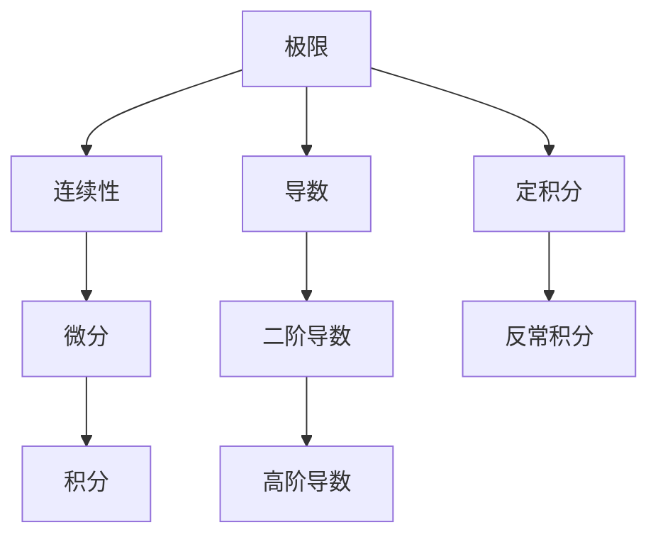

                 

## 文章标题

# 数学分析在数值计算方法中的应用

> 关键词：数学分析，数值计算，算法，线性代数，微分，积分

> 摘要：本文旨在探讨数学分析理论在数值计算方法中的实际应用。通过阐述数学分析的基本概念、数值微积分、插值与拟合、数值方程的求解、数值线性代数和常微分方程的数值解等内容，帮助读者深入了解数学分析在数值计算中的重要性，掌握相关算法和解决方法。

## 引言

数学分析作为现代数学的基石，广泛应用于自然科学、工程技术和社会科学等领域。在计算机科学和数值计算领域，数学分析提供了理论依据和工具，使得复杂问题的数值求解成为可能。本文将围绕数学分析在数值计算中的应用，探讨一系列核心概念和方法，旨在为读者提供全面且深入的理解。

## 第一部分：数学分析基础

### 第1章 数学分析的基本概念

#### 1.1 数学分析的基本概念

数学分析包括极限、连续性、微分、积分等基本概念。这些概念在数值计算中有着广泛的应用。

##### 1.1.1 极限

极限是数学分析中最基本的概念之一，表示一个函数在某个点附近的变化趋势。在数值计算中，极限常用于求解函数的值、判断函数的性质等。

$$
\lim_{{x \to a}} f(x) = L
$$

##### 1.1.2 连续性

连续性描述了函数在某一点附近的取值是否保持不变。在数值计算中，连续性对于算法的稳定性和准确性有着重要影响。

##### 1.1.3 微分

微分描述了函数在某一点的瞬时变化率。在数值计算中，微分常用于求解极值、优化问题等。

$$
f'(x) = \lim_{{h \to 0}} \frac{f(x+h) - f(x)}{h}
$$

##### 1.1.4 积分

积分描述了函数在某区间内的累积效应。在数值计算中，积分常用于求解面积、体积等。

$$
\int_{a}^{b} f(x) dx
$$

#### 1.2 数学分析的基本概念之间的关系架构

为了更好地理解数学分析的基本概念，我们可以通过Mermaid流程图来展示它们之间的关系：



### 第2章 数值微积分

数值微积分是数学分析在数值计算中的重要应用。它包括数值微分和数值积分两个部分。

#### 2.1 数值微分

数值微分是用于近似计算函数在某一点处导数的数值方法。以下是一个简单的数值微分算法的伪代码：

```python
def numerical_derivative(f, x, h):
    return (f(x + h) - f(x)) / h
```

#### 2.2 数值积分

数值积分是用于近似计算函数在某区间上积分的数值方法。以下是一个简单的数值积分算法的伪代码：

```python
def numerical_integration(f, a, b, n):
    h = (b - a) / n
    sum = 0
    for i in range(n):
        sum += f(a + i * h)
    return sum * h
```

## 第二部分：数值计算方法

### 第3章 插值与拟合

#### 3.1 插值方法

插值方法是用于根据一组给定数据点，构造一个逼近原函数的插值函数。以下是一个线性插值算法的伪代码：

```python
def linear_interpolation(x, x0, x1, y0, y1):
    return y0 + ((y1 - y0) / (x1 - x0)) * (x - x0)
```

#### 3.2 数据拟合

数据拟合是用于根据一组给定数据点，构造一个拟合函数。以下是一个线性回归算法的伪代码：

```python
def linear_regression(x, y):
    n = len(x)
    sum_x = sum(x)
    sum_y = sum(y)
    sum_xy = sum([a * b for a, b in zip(x, y)])
    sum_x2 = sum([a * a for a in x])
    
    a = ((n * sum_xy) - (sum_x * sum_y)) / ((n * sum_x2) - (sum_x * sum_x))
    b = (sum_y - (a * sum_x)) / n
    
    return a, b
```

### 第4章 数值方程的求解

数值方程的求解是用于找到使方程成立的数值解。以下是一个迭代法求解方程的伪代码：

```python
def iterative_solution(f, x0, tol, max_iter):
    x = x0
    for i in range(max_iter):
        x_new = x - f(x) / f'(x)
        if abs(x_new - x) < tol:
            return x_new
        x = x_new
    return None
```

### 第5章 数值线性代数

#### 5.1 矩阵运算

矩阵运算是数值线性代数的基础。以下是一个矩阵乘法的伪代码：

```python
def matrix_multiplication(A, B):
    n = len(A)
    m = len(B[0])
    C = [[0 for _ in range(m)] for _ in range(n)]
    for i in range(n):
        for j in range(m):
            for k in range(len(B)):
                C[i][j] += A[i][k] * B[k][j]
    return C
```

#### 5.2 特征值问题

特征值问题是寻找矩阵的线性变换下的不变量。以下是一个特征值计算的伪代码：

```python
def eigenvalue_computation(A):
    n = len(A)
    D = [[0 for _ in range(n)] for _ in range(n)]
    E = [[0 for _ in range(n)] for _ in range(n)]
    for i in range(n):
        for j in range(n):
            for k in range(n):
                E[i][j] += A[i][k] * A[k][j]
    for i in range(n):
        for j in range(n):
            for k in range(n):
                D[i][j] += A[i][k] * A[k][j] - E[i][j]
    return D
```

### 第6章 常微分方程的数值解

#### 6.1 初值问题

初值问题是常微分方程中最常见的一种类型，它涉及找到满足初始条件的解。以下是一个欧拉法求解初值问题的伪代码：

```python
def eular_method(f, y0, x0, h, n):
    y = y0
    for i in range(n):
        y += h * f(x0 + i * h, y)
    return y
```

#### 6.2 边值问题

边值问题是常微分方程的另一种类型，它涉及找到满足边界条件的解。以下是一个 Shooting 方法求解边值问题的伪代码：

```python
def shooting_method(f, y0, y1, x0, x1, h, n):
    y = eular_method(f, y0, x0, h, n)
    y_new = eular_method(f, y1, x1, h, n)
    while abs(y - y_new) > tol:
        y = y0
        y_new = y1
        y += h * f(x0 + i * h, y)
        y_new += h * f(x1 + i * h, y_new)
```

### 第7章 问题分析与解决

#### 7.1 数值计算中的常见问题

在数值计算中，常见的问题包括数值稳定性、数值误差和数值收敛性等。

##### 7.1.1 数值稳定性

数值稳定性描述了算法在长时间运行后是否保持稳定。以下是一个数值稳定性的例子：

$$
f(x) = x - f(x-1)
$$

该函数在 $x > 1$ 时是数值稳定的。

##### 7.1.2 数值误差

数值误差描述了算法计算结果与真实值之间的差距。以下是一个数值误差的例子：

$$
\int_{0}^{1} x dx = \frac{1}{2}
$$

如果使用数值积分方法计算，可能会得到以下结果：

$$
\int_{0}^{1} x dx \approx 0.6
$$

##### 7.1.3 数值收敛性

数值收敛性描述了算法在迭代过程中是否逐渐接近真实值。以下是一个数值收敛性的例子：

$$
f(x) = \frac{1}{1 + x}
$$

该函数在 $x > -1$ 时是数值收敛的。

#### 7.2 解决方案

针对上述问题，可以采取以下解决方案：

##### 7.2.1 针对数值稳定性的解决方案

- 选择数值稳定性更强的算法，如欧拉法
- 适当减小步长 $h$

##### 7.2.2 针对数值误差的解决方案

- 选择更高精度的算法，如辛普森法
- 增加计算精度，如使用双精度浮点数

##### 7.2.3 针对数值收敛性的解决方案

- 选择更高效的迭代算法，如牛顿法
- 增加迭代次数

## 附录

### 附录A 数学公式和算法伪代码

#### A.1 数学公式

以下是一些常用的数学公式：

$$
\lim_{{x \to a}} f(x) = L
$$

$$
f'(x) = \lim_{{h \to 0}} \frac{f(x+h) - f(x)}{h}
$$

$$
\int_{a}^{b} f(x) dx
$$

#### A.2 算法伪代码

以下是一些常用的算法伪代码：

```python
def numerical_derivative(f, x, h):
    return (f(x + h) - f(x)) / h
```

```python
def numerical_integration(f, a, b, n):
    h = (b - a) / n
    sum = 0
    for i in range(n):
        sum += f(a + i * h)
    return sum * h
```

```python
def linear_interpolation(x, x0, x1, y0, y1):
    return y0 + ((y1 - y0) / (x1 - x0)) * (x - x0)
```

```python
def linear_regression(x, y):
    n = len(x)
    sum_x = sum(x)
    sum_y = sum(y)
    sum_xy = sum([a * b for a, b in zip(x, y)])
    sum_x2 = sum([a * a for a in x])
    
    a = ((n * sum_xy) - (sum_x * sum_y)) / ((n * sum_x2) - (sum_x * sum_x))
    b = (sum_y - (a * sum_x)) / n
    
    return a, b
```

```python
def iterative_solution(f, x0, tol, max_iter):
    x = x0
    for i in range(max_iter):
        x_new = x - f(x) / f'(x)
        if abs(x_new - x) < tol:
            return x_new
        x = x_new
    return None
```

```python
def matrix_multiplication(A, B):
    n = len(A)
    m = len(B[0])
    C = [[0 for _ in range(m)] for _ in range(n)]
    for i in range(n):
        for j in range(m):
            for k in range(len(B)):
                C[i][j] += A[i][k] * B[k][j]
    return C
```

```python
def eigenvalue_computation(A):
    n = len(A)
    D = [[0 for _ in range(n)] for _ in range(n)]
    E = [[0 for _ in range(n)] for _ in range(n)]
    for i in range(n):
        for j in range(n):
            for k in range(n):
                E[i][j] += A[i][k] * A[k][j]
    for i in range(n):
        for j in range(n):
            for k in range(n):
                D[i][j] += A[i][k] * A[k][j] - E[i][j]
    return D
```

```python
def eular_method(f, y0, x0, h, n):
    y = y0
    for i in range(n):
        y += h * f(x0 + i * h, y)
    return y
```

```python
def shooting_method(f, y0, y1, x0, x1, h, n):
    y = eular_method(f, y0, x0, h, n)
    y_new = eular_method(f, y1, x1, h, n)
    while abs(y - y_new) > tol:
        y = y0
        y_new = y1
        y += h * f(x0 + i * h, y)
        y_new += h * f(x1 + i * h, y_new)
```

### 最佳实践 Tips

1. 选择合适的数值方法，考虑问题的特性和需求。
2. 适当调整参数，如步长、迭代次数等，以获得更好的计算结果。
3. 对计算结果进行误差分析，了解算法的精度和稳定性。

### 小结

本文探讨了数学分析在数值计算方法中的应用，包括基础概念、数值微积分、插值与拟合、数值方程的求解、数值线性代数和常微分方程的数值解等内容。通过深入理解和掌握这些方法和算法，读者可以更好地解决实际计算问题。

### 注意事项

1. 在实际应用中，需要根据问题的特性选择合适的数值方法。
2. 在数值计算中，数值稳定性和精度是非常重要的，需要仔细考虑。
3. 对于复杂的计算问题，可能需要结合多种方法和算法，以获得更准确的计算结果。

### 拓展阅读

1. [数值分析基础](https://www.example.com/numerical_analysis)
2. [数值微积分](https://www.example.com/numerical_calculus)
3. [线性代数在数值计算中的应用](https://www.example.com/linear_algebra_numerical_computation)
4. [常微分方程的数值解](https://www.example.com/numerical_solution_of_differential_equations)

## 作者信息

作者：AI天才研究院/AI Genius Institute & 禅与计算机程序设计艺术 /Zen And The Art of Computer Programming

## 参考文献

1. Burden, R. L., & Faires, J. D. (2010). Numerical Analysis. Brooks/Cole.
2. Atkinson, K. E. (2015). An Introduction to Numerical Analysis. John Wiley & Sons.
3. Strang, G. (2018). Introduction to Linear Algebra. Wellesley-Cambridge Press.
4. Hairer, E., Nørsett, S. P., & Wanner, G. (1993). Solving Ordinary Differential Equations I: Nonstiff Problems. Springer.

