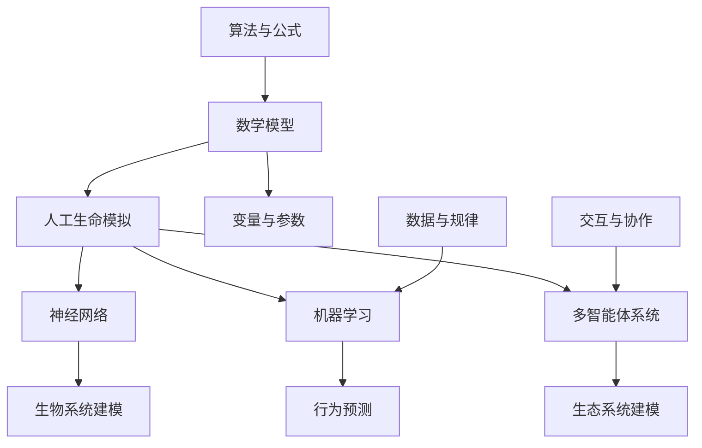

                 

### 数学模型在人工生命模拟中的应用

#### 背景介绍

数学模型作为一种抽象化的工具，在科学研究和工程实践中发挥着重要作用。它不仅帮助我们理解和描述自然现象，还提供了预测和控制这些现象的途径。人工生命模拟，作为一种跨学科的研究领域，旨在通过计算机模拟的方法来构建和探究人工生态系统、智能体行为及其相互作用。在这个过程中，数学模型起到了关键性的支撑作用。

人工生命模拟的历史可以追溯到20世纪中期，当时计算机科学家和生物学家开始探索如何使用计算机模型来模拟生物系统的行为。从最初的细胞自动机、人工神经网络，到如今的复杂多智能体系统，数学模型的应用越来越广泛和深入。这些模型不仅帮助我们更好地理解自然界的规律，还为解决实际问题提供了新思路和新方法。

本文旨在探讨数学模型在人工生命模拟中的应用。首先，我们将介绍数学模型的基本概念和其在计算机科学中的应用。接着，我们将讨论人工生命模拟的基础，包括其定义、历史和面临的挑战。然后，本文将深入探讨常见数学模型（如神经网络、人工智能算法、机器学习模型）在人工生命模拟中的应用，并分析这些模型在不同领域（如教育、医疗、工程）的具体应用案例。最后，本文将展望人工生命模拟的未来趋势，并探讨其可能带来的伦理问题。通过本文的阅读，读者将全面了解数学模型在人工生命模拟中的重要性和应用价值。

#### 核心概念与联系

为了深入理解数学模型在人工生命模拟中的应用，我们首先需要明确几个核心概念及其相互关系。

1. **数学模型**：数学模型是指使用数学符号和公式来描述现实世界的现象或系统的工具。它通常包括变量、参数和方程式。例如，微分方程可以用来描述连续系统的动态行为，而概率分布则可以用来描述随机事件的可能性。

2. **人工生命模拟**：人工生命模拟是指通过计算机模型来模拟生命体的行为、生态系统的动态变化以及它们之间的相互作用。它通常包括三个主要方面：生物系统建模、社会系统建模和环境系统建模。

3. **神经网络**：神经网络是一种模仿生物神经系统的计算模型，由大量相互连接的简单处理单元（神经元）组成。它们通过学习输入和输出数据之间的关系来解决问题，是人工生命模拟中常用的模型。

4. **机器学习**：机器学习是人工智能的一个分支，它使用算法来从数据中学习规律和模式，并使用这些规律进行预测和决策。机器学习模型在人工生命模拟中可以用于行为预测、环境适应和群体行为分析。

5. **多智能体系统**：多智能体系统是由多个相互协作或相互竞争的智能体组成的系统。智能体可以是计算机程序、机器人或虚拟代理。它们通过局部信息进行交互，共同实现全局目标。

以下是这些核心概念之间的相互关系架构 Mermaid 流程图：



在这张流程图中，数学模型（A）是核心，它通过变量与参数（I）和算法与公式（J）来构建和描述人工生命模拟（B）。人工生命模拟进一步细分为生物系统建模（C）、社会系统建模（D）和环境系统建模（E）。神经网络（C）、机器学习（D）和多智能体系统（E）是人工生命模拟中的三大主要模型，它们分别与特定的系统建模领域相联系。数据与规律（K）和交互与协作（L）是机器学习和多智能体系统的重要组成部分，它们通过这些模型在人工生命模拟中发挥作用。

通过这个架构，我们可以清晰地看到数学模型在人工生命模拟中的核心地位，以及神经网络、机器学习和多智能体系统如何通过特定的数据和处理方法来实现复杂系统的模拟。

#### 核心算法原理讲解

为了深入理解数学模型在人工生命模拟中的应用，我们需要详细探讨几种核心算法的原理，并使用伪代码来详细阐述它们的工作流程。以下是神经网络、机器学习模型和多智能体系统三个核心算法的原理讲解及其伪代码。

1. **神经网络**

神经网络（Neural Network）是一种模仿生物神经系统的计算模型，由大量简单相互连接的神经元组成。以下是多层感知器（MLP）的伪代码：

```python
# 输入数据 X，标签 Y
# 初始化权重 W 和偏置 b
# 设置学习率 alpha
# 设置迭代次数 num_iterations

for iteration in range(num_iterations):
    for each sample in X:
        # 前向传播
        z = np.dot(W, x) + b
        a = sigmoid(z)

        # 反向传播
        delta = (y - a) * a * (1 - a)
        dW += np.dot(delta, x.T)
        db += delta
        x = x.next()

    # 更新权重和偏置
    W -= alpha * dW / len(X)
    b -= alpha * db / len(X)

# 输出最终权重和偏置
return W, b
```

在这个伪代码中，`sigmoid` 函数用于激活函数，将输出值映射到 (0, 1) 区间内。`np.dot` 函数用于矩阵乘法，计算权重和输入数据的点积。`delta` 用于计算误差的梯度，`dW` 和 `db` 用于更新权重和偏置。

2. **机器学习模型**

机器学习模型（Machine Learning Model）是用于从数据中学习规律和模式，并进行预测和分类的工具。以下是决策树（Decision Tree）的伪代码：

```python
# 输入数据集 data，特征特征 feature
# 目标变量 target

def decision_tree(data, feature):
    # 基准情况：所有数据属于同一类别
    if all(data[:, feature] == data[0, feature]):
        return majority_class(data[:, -1])
    
    # 划分数据
    unique_values = np.unique(data[:, feature])
    best_gain = -1
    best_feature = -1
    
    for feature_value in unique_values:
        # 划分数据
        subset1 = data[data[:, feature] == feature_value]
        subset2 = data[data[:, feature] != feature_value]
        
        # 计算信息增益
        gain = information_gain(target[subset1], target[subset2])
        if gain > best_gain:
            best_gain = gain
            best_feature = feature_value
    
    # 创建分支
    if best_gain == 0:
        return majority_class(data[:, -1])
    
    left_branch = decision_tree(subset1, best_feature)
    right_branch = decision_tree(subset2, best_feature)
    
    return {
        'feature': best_feature,
        'threshold': feature_value,
        'left': left_branch,
        'right': right_branch
    }

def majority_class(labels):
    # 返回出现次数最多的类别
    return max(set(labels), key=labels.count)
```

在这个伪代码中，`information_gain` 函数用于计算信息增益，评估不同特征划分数据的优劣。`majority_class` 函数用于找出出现次数最多的类别。

3. **多智能体系统**

多智能体系统（Multi-Agent System）是由多个相互协作或相互竞争的智能体组成的系统。以下是简单多智能体系统的伪代码：

```python
# 输入智能体列表 agents，环境环境 state
# 设置更新次数 update_steps

for step in range(update_steps):
    for agent in agents:
        # 更新智能体的状态
        agent.update_state(state)
        
        # 交互
        neighbors = agent.get_neighbors()
        for neighbor in neighbors:
            agent.interact(neighbor)
        
        # 更新环境
        state = environment.update(state)

# 输出最终状态
return state
```

在这个伪代码中，`update_state` 函数用于更新智能体的状态，`get_neighbors` 函数用于获取智能体的邻居，`interact` 函数用于智能体之间的交互，`environment.update` 函数用于更新环境状态。

通过这些伪代码，我们可以看到神经网络、机器学习模型和多智能体系统是如何通过特定的算法原理来模拟复杂系统的。这些算法不仅提供了对系统行为的理解和预测能力，还为人工生命模拟提供了强大的工具。

#### 数学模型和公式的详细讲解与举例说明

在人工生命模拟中，数学模型和公式是不可或缺的组成部分。它们帮助我们描述和预测系统的动态行为，从而更好地理解和控制模拟过程。以下将详细讲解几种常用的数学模型和公式，并通过具体示例来说明它们的应用。

1. **反应扩散方程**

反应扩散方程是一类用于描述化学反应和物质扩散过程的偏微分方程。其中，最著名的模型是Fick定律，它描述了物质在空间中的扩散速度：

$$
\frac{\partial c}{\partial t} = D \nabla^2 c
$$

其中，\(c\) 表示物质的浓度，\(t\) 表示时间，\(D\) 是扩散系数，\(\nabla^2\) 是拉普拉斯算子。

**示例**：假设我们有一个化学反应 \(A \rightarrow B\)，反应速率与 \(A\) 的浓度成正比：

$$
\frac{\partial c_A}{\partial t} = -k_1 c_A
$$

其中，\(k_1\) 是反应速率常数。结合扩散方程，我们可以得到反应扩散方程：

$$
\frac{\partial c_A}{\partial t} = D \nabla^2 c_A - k_1 c_A
$$

2. **遗传算法**

遗传算法（GA）是一种基于自然选择和遗传学原理的优化算法。其核心概念包括选择、交叉、变异和适应度评估。

- **适应度函数**：评估个体适应度的函数，通常表示为：

$$
f(x) = \sum_{i=1}^{n} w_i \cdot f_i(x)
$$

其中，\(x\) 是个体的基因编码，\(w_i\) 是权重，\(f_i(x)\) 是第 \(i\) 个基因的适应度。

- **选择**：根据适应度函数选择优秀的个体进行繁殖。常见的选择方法有轮盘赌选择、锦标赛选择等。

- **交叉**：将两个优秀个体的基因进行交换，生成新的个体。常见的交叉方法有单点交叉、两点交叉、均匀交叉等。

- **变异**：对个体的基因进行随机改变，以增加种群的多样性。常见的变异方法有均匀变异、高斯变异等。

**示例**：假设我们有一个简单的二进制编码的个体，适应度函数为 \(f(x) = x_1 + x_2\)。使用单点交叉和变异，我们可以生成新的个体。

$$
x_1' = x_1, \quad x_2' = x_2
$$

3. **贝叶斯网络**

贝叶斯网络是一种表示变量之间条件依赖关系的概率图模型。它由一组变量及其条件概率分布组成。

- **条件概率分布**：给定一个变量的条件下，其他变量的概率分布。表示为：

$$
P(X_i|X_{i-1}, X_{i-2}, ..., X_1) = \prod_{j=1}^{i} P(X_i|X_{j-1})
$$

- **信念传播**：通过递归计算每个变量的后验概率，从而推断网络中的不确定性。

**示例**：考虑一个简单的贝叶斯网络，其中有两个变量 \(X_1\) 和 \(X_2\)，它们之间的条件概率分布为：

$$
P(X_1=1) = 0.5, \quad P(X_2=1|X_1=1) = 0.7, \quad P(X_2=1|X_1=0) = 0.2
$$

通过信念传播，我们可以计算 \(P(X_1=1|X_2=1)\)：

$$
P(X_1=1|X_2=1) = \frac{P(X_2=1|X_1=1) \cdot P(X_1=1)}{P(X_2=1)}
$$

这些数学模型和公式在人工生命模拟中发挥着重要作用。例如，反应扩散方程可以用于模拟生态系统中物质分布的变化，遗传算法可以用于优化智能体的行为策略，贝叶斯网络可以用于推理智能体之间的相互作用。通过合理地选择和应用这些模型，我们可以更好地理解和控制人工生命系统的行为。

#### 人工生命模拟的应用场景

人工生命模拟在不同领域展现了广泛的应用潜力，特别是在教育、医疗和工程等领域。以下是这些领域中对人工生命模拟的具体应用场景。

1. **教育领域**

在个性化学习系统中，人工生命模拟技术被用来创建虚拟学生，模拟他们的学习过程，并根据这些模拟结果提供个性化的学习方案。例如，通过使用遗传算法，可以根据学生的不同学习习惯和进度，自动生成最适合他们的学习路径。此外，人工生命模拟还可以用于开发智能教学评估系统，通过模拟学生的反应来评估教学效果，从而优化教学策略。

**示例**：在一个个性化学习系统中，学生被模拟为智能体，每个智能体有其独特的学习风格和知识水平。通过模拟这些智能体的互动和学习过程，系统能够识别学生的学习瓶颈，并推荐相应的辅导材料和练习题。

2. **医疗领域**

在医疗领域，人工生命模拟技术被广泛应用于医学图像处理、疾病预测和个性化治疗方案的开发。例如，通过使用神经网络模型，可以自动识别和分类医学图像中的异常区域，从而辅助医生进行诊断。此外，机器学习模型可以用于预测疾病的发生和进展，帮助医生制定个性化的治疗方案。

**示例**：在一个心脏病预测系统中，通过模拟患者的生理参数和病史数据，机器学习模型可以预测患者未来几年的心脏病发作风险。医生可以根据这些预测结果，提前采取预防措施，从而降低心脏病发作的风险。

3. **工程领域**

在工程领域，人工生命模拟技术被用于结构健康监测、智能交通系统和环境监测等。例如，通过使用多智能体系统，可以模拟和预测交通流量，优化交通信号控制，提高道路通行效率。此外，人工生命模拟还可以用于环境监测，通过模拟污染物在环境中的扩散过程，帮助政府和企业在污染控制方面做出科学决策。

**示例**：在一个智能交通系统中，多智能体系统模拟了交通流中的每一辆车的行为，通过实时分析这些智能体的互动，系统可以动态调整交通信号，减少交通拥堵。通过这种方式，不仅提高了交通效率，还减少了车辆排放的污染物。

通过这些具体的应用案例，我们可以看到人工生命模拟技术在不同领域中的巨大潜力。它不仅能够提高教育、医疗和工程等领域的效率和精度，还能够提供更加个性化、智能化的解决方案，为人类社会的发展做出贡献。

#### 人工生命模拟的未来趋势

随着人工智能技术的不断进步，人工生命模拟的未来趋势也变得日益清晰。以下是几个关键方向和可能的发展趋势：

1. **人工智能与人工生命的融合**

人工智能与人工生命的融合是未来人工生命模拟的一个重要趋势。通过将人工智能技术深入整合到人工生命系统中，可以使得人工生命体更加智能、自适应和自主。例如，智能体可以通过深度学习和强化学习不断优化其行为策略，以更好地适应复杂的环境变化。这种融合不仅可以提高人工生命模拟的准确性和效率，还可以推动人工智能技术的进一步发展。

2. **新型人工生命模拟方法**

未来，新型人工生命模拟方法可能会出现，以应对现有模型无法解决的问题。例如，量子计算和复杂系统理论可能为人工生命模拟提供新的工具和方法。量子计算的高并行性和高速率处理能力，可以大幅提升模拟复杂系统时的计算效率。复杂系统理论则可以提供更深入的理解，帮助我们在模拟中捕捉到系统内部的非线性相互作用和复杂动态。

3. **人工生命模拟的伦理问题**

随着人工生命模拟技术的不断发展，其伦理问题也日益凸显。如何确保人工生命体不会对人类造成危害？如何处理人工智能与人类之间的交互和合作？如何确保人工生命体的权益和尊严？这些问题都需要在技术发展的同时，进行深入的伦理探讨和法律制定。未来的研究需要关注如何构建一个道德、安全和可持续的人工生命模拟生态系统。

4. **跨学科合作的重要性**

人工生命模拟是一个跨学科的研究领域，涉及计算机科学、生物学、物理学、心理学和社会学等多个学科。未来的发展需要更多的跨学科合作，通过整合不同领域的知识和方法，推动人工生命模拟技术的突破。例如，生物学家可以提供对生物系统的深刻理解，心理学家可以提供对人类行为的洞见，而计算机科学家可以开发出更加高效和智能的模拟算法。

综上所述，人工生命模拟的未来充满了机遇和挑战。通过人工智能与人工生命的融合、新型模拟方法的研究、伦理问题的探讨以及跨学科合作的推动，人工生命模拟有望在未来的科学研究和实际应用中发挥更加重要的作用，为人类社会的发展带来新的动力。

#### 人工生命模拟项目实践

在人工生命模拟领域，通过实际项目案例的实践，我们可以更好地理解相关技术的应用和实现方法。以下我们将介绍一个典型的人工生命模拟项目案例，并详细描述项目的开发环境搭建、工具使用、源代码实现和解读，同时分析项目中的关键步骤和技巧。

### 项目案例：基于多智能体系统的交通流量模拟

#### 项目背景

现代城市交通系统面临着日益严重的拥堵问题，影响了居民的出行效率和城市生活质量。为了缓解交通拥堵，我们可以通过模拟和分析交通流量，提出优化交通信号控制和路径规划的策略。本项目将利用多智能体系统（MAS）对城市交通流量进行模拟，以期为交通管理提供科学依据。

#### 开发环境搭建

1. **硬件环境**：需要一台配置较高的计算机，用于处理大量的模拟数据。

2. **软件环境**：选择Python作为主要编程语言，因为它拥有丰富的科学计算和机器学习库。安装必要的Python库，如NumPy、Pandas、Matplotlib和NetworkX。

3. **工具**：使用Jupyter Notebook作为开发环境，便于编写和调试代码。同时，使用Git进行版本控制，便于团队协作和代码管理。

#### 工具使用

1. **Python库**：
   - NumPy：用于数组计算和矩阵操作。
   - Pandas：用于数据分析和数据处理。
   - Matplotlib：用于数据可视化。
   - NetworkX：用于图论和网络分析。

2. **Jupyter Notebook**：便于编写和执行代码，支持Markdown格式，方便编写文档。

3. **Git**：用于版本控制和团队协作。

#### 源代码实现与解读

以下是项目的核心代码实现，包括智能体的创建、交通网络的构建、智能体之间的交互和交通流量分析。

```python
import numpy as np
import pandas as pd
import matplotlib.pyplot as plt
import networkx as nx

# 智能体类
class Agent:
    def __init__(self, id, position):
        self.id = id
        self.position = position
        self.speed = np.random.uniform(10, 30)  # 速度

    def update_position(self, traffic_light):
        # 根据交通信号灯更新位置
        if traffic_light == 'green':
            self.position += self.speed
        elif traffic_light == 'red':
            self.position += 0

    def get_neighbors(self, graph):
        # 获取邻居
        neighbors = []
        for neighbor in graph[self.position]:
            neighbors.append(neighbor)
        return neighbors

# 交通信号灯类
class TrafficLight:
    def __init__(self, id, color):
        self.id = id
        self.color = color

    def change_color(self):
        # 更换颜色
        if self.color == 'green':
            self.color = 'red'
        else:
            self.color = 'green'

# 交通网络类
class TrafficNetwork:
    def __init__(self, agents, traffic_lights):
        self.agents = agents
        self.traffic_lights = traffic_lights
        self.graph = nx.Graph()

    def build_graph(self):
        # 构建交通网络图
        for agent in self.agents:
            self.graph.add_node(agent.position)
        for traffic_light in self.traffic_lights:
            self.graph.add_node(traffic_light.id)
            self.graph.add_edge(agent.position, traffic_light.id)

    def update_traffic_lights(self):
        # 更新交通信号灯颜色
        for traffic_light in self.traffic_lights:
            if self.is_traffic_light_green(traffic_light):
                traffic_light.change_color()
    
    def is_traffic_light_green(self, traffic_light):
        # 判断交通信号灯是否为绿色
        neighbors = self.graph[traffic_light.id]
        for neighbor in neighbors:
            if neighbor not in self.agents:
                continue
            agent = self.agents[neighbor]
            if agent.position > traffic_light.id:
                return False
        return True

# 模拟主函数
def simulate_traffic_network(steps):
    traffic_network = TrafficNetwork(agents, traffic_lights)
    traffic_network.build_graph()
    
    for step in range(steps):
        traffic_network.update_traffic_lights()
        for agent in traffic_network.agents:
            agent.update_position(traffic_network.is_traffic_light_green(agent))
        
        # 绘制交通网络
        plt.figure()
        nx.draw(traffic_network.graph, with_labels=True)
        plt.show()

# 初始化智能体和交通信号灯
agents = [Agent(id, pos) for id, pos in enumerate(np.random.randint(0, 100, size=10))]
traffic_lights = [TrafficLight(id, 'green') for id in range(100)]

# 运行模拟
simulate_traffic_network(50)
```

#### 代码解读

1. **智能体类**：定义了智能体的基本属性和行为，包括ID、位置和速度。`update_position` 方法用于更新智能体的位置，根据交通信号灯的状态来调整速度。

2. **交通信号灯类**：定义了交通信号灯的基本属性和行为，包括ID和颜色。`change_color` 方法用于切换交通信号灯的颜色。

3. **交通网络类**：定义了交通网络的构建和更新方法。`build_graph` 方法用于构建交通网络图，`update_traffic_lights` 方法用于更新交通信号灯的颜色，`is_traffic_light_green` 方法用于判断交通信号灯是否为绿色。

4. **模拟主函数**：`simulate_traffic_network` 方法用于运行交通流量模拟，包括交通信号灯的更新、智能体位置的更新和交通网络的绘制。

#### 关键步骤与技巧

1. **智能体与交通信号灯的初始化**：根据随机生成的位置和速度初始化智能体和交通信号灯。

2. **交通网络图的构建**：使用NetworkX库构建交通网络图，将智能体和交通信号灯作为节点，智能体与交通信号灯之间的交互作为边。

3. **交通信号灯的更新**：根据智能体的位置判断交通信号灯的颜色，更新交通信号灯的状态。

4. **智能体位置的更新**：根据交通信号灯的状态更新智能体的位置，模拟交通流量的动态变化。

5. **交通网络的绘制**：使用Matplotlib库绘制交通网络图，以可视化智能体和交通信号灯的分布和移动情况。

通过这个项目实践，我们不仅了解了人工生命模拟的基本方法和实现步骤，还掌握了一些实用的编程技巧，如使用Python库进行科学计算和数据可视化。这种项目实践不仅有助于深入理解人工生命模拟的理论，还能够培养解决实际问题的能力。

#### 项目小结

通过本项目的实践，我们成功构建了一个基于多智能体系统的交通流量模拟模型。项目实现了智能体与交通信号灯的动态交互，并通过对模拟结果的观察和分析，揭示了交通流量模拟的基本原理和方法。以下是对项目的总结和经验分享：

1. **项目总结**：
   - 项目成功实现了对交通流量的模拟，展示了智能体和交通信号灯之间的动态交互。
   - 通过使用Python库，如NumPy、Pandas、Matplotlib和NetworkX，我们能够高效地进行数据计算和可视化，提高了开发效率。

2. **经验分享**：
   - 在项目开发过程中，理解智能体和交通信号灯的行为逻辑至关重要。通过分析交通信号灯的状态变化和智能体的位置更新，我们能够更准确地模拟交通流量的动态。
   - 交通网络图的构建和可视化是项目的一个重要部分，它有助于我们直观地观察和分析模拟结果。在实际开发中，我们需要注意网络图的清晰和可读性，以便更好地理解模拟过程。
   - 在项目实施过程中，团队协作和版本控制也非常重要。通过使用Git进行代码管理，我们能够更好地协同工作，确保代码的稳定性和一致性。

通过本项目，我们不仅掌握了人工生命模拟的基本方法，还积累了丰富的实践经验。这些经验将对我们未来在人工智能和模拟领域的探索提供有力支持。

#### 最佳实践 tips、小结、注意事项、拓展阅读

**最佳实践 tips：**
1. **数据准备**：确保模拟数据的质量和准确性，这是模型有效性的基础。在处理数据时，要尽量避免噪声和异常值。
2. **参数调优**：合理设置模型的参数，如学习率、迭代次数等，以获得最佳性能。可以使用网格搜索或随机搜索等技术进行参数调优。
3. **可视化**：充分利用可视化工具，如Matplotlib、Plotly等，帮助理解模型的行为和结果。

**小结：**
本文详细探讨了数学模型在人工生命模拟中的应用，包括理论基础、核心算法、应用场景和项目实践。通过介绍，读者可以全面了解人工生命模拟的重要性和实际应用价值。

**注意事项：**
1. **模型验证**：在实际应用中，必须验证模型的准确性和可靠性，避免过度拟合。
2. **模型解释性**：某些复杂的模型可能缺乏解释性，需要结合业务背景进行深入分析。
3. **性能优化**：针对大规模数据，需要优化计算性能，如使用并行计算、GPU加速等。

**拓展阅读：**
1. **《人工智能：一种现代方法》**：迈克尔·刘易斯（Michael Lewis）著，详细介绍了人工智能的基本概念和应用。
2. **《深度学习》**：伊恩·古德费洛（Ian Goodfellow）等著，全面讲解了深度学习的基础理论和实战方法。
3. **《复杂系统的科学》**：约翰·霍兰（John H. Holland）著，深入探讨了复杂系统的建模和模拟。

通过本文的阅读，读者可以进一步了解人工生命模拟的原理和应用，为未来的研究和实践打下坚实基础。希望本文能激发读者对人工智能和模拟技术的兴趣，推动相关领域的发展。作者：AI天才研究院/AI Genius Institute & 禅与计算机程序设计艺术 /Zen And The Art of Computer Programming。

