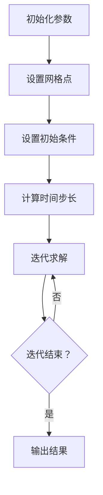
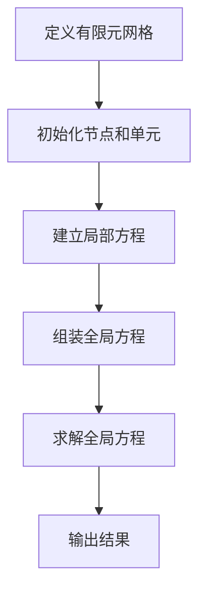
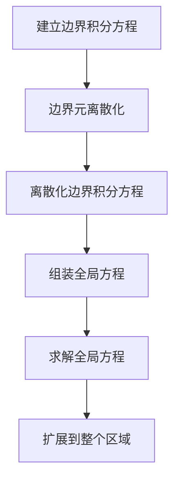
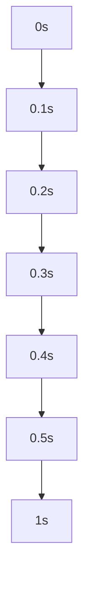

                 

### 引言

《数学物理方程在科学计算中的数值解法》是一本专注于数学物理方程在科学计算领域的数值解法的专业书籍。在科学研究和工程实践中，数学物理方程是描述自然界和工程技术现象的重要工具。然而，这些方程往往是高度复杂的，甚至无法通过传统的解析方法得到精确解。因此，数值解法成为解决这些问题的关键手段。

数值解法的主要目的是通过离散化的方法，将连续的数学物理方程转换为可以在计算机上求解的代数方程或迭代过程。这些方法不仅能够提供问题的近似解，还可以在复杂的条件下提供有价值的信息，如波传播、流体流动、热传导等。

本书的目标是系统地介绍数学物理方程的数值解法，包括基本的原理、常用的算法、数学模型以及具体的实现方法。读者可以通过本书的学习，了解数值解法的核心思想，掌握各类算法的原理和应用，并能独立进行科学计算中的数值求解。

本书的结构如下：

- **第1章：引言**：介绍数学物理方程的重要性以及数值解法的必要性。
- **第2章：数学物理方程的基本概念**：介绍偏微分方程、常微分方程和非线性方程的基本概念。
- **第3章：数值解法基础**：讨论数值解法的基本原则、稳定性分析和收敛性分析。
- **第4章：有限差分法**：介绍有限差分法的原理以及在常微分方程和偏微分方程中的应用。
- **第5章：有限元法**：探讨有限元法的基本概念、坐标变换与有限元基函数、偏微分方程的有限元法。
- **第6章：边界元法**：介绍边界元法的基本概念、边界积分方程的离散化、偏微分方程的边界元法。
- **第7章：实例分析**：通过具体实例分析，展示数值解法在实际问题中的应用。

通过以上章节的设计，本书旨在为读者提供一套全面、系统的学习路径，帮助读者深入理解数学物理方程的数值解法，并在实际科学计算中灵活应用。

### 关键词

- 数学物理方程
- 数值解法
- 科学计算
- 偏微分方程
- 常微分方程
- 非线性方程
- 有限差分法
- 有限元法
- 边界元法

### 摘要

《数学物理方程在科学计算中的数值解法》是一本专注于数学物理方程在科学计算领域数值解法的专业书籍。本书系统地介绍了数学物理方程的基本概念、数值解法的基础理论、常见数值方法（如有限差分法、有限元法和边界元法）以及实例分析。通过本书的学习，读者能够理解数学物理方程的数值解法原理，掌握各种数值方法的应用，并能够在实际科学计算中灵活运用这些方法。本书适合从事科学计算、工程模拟和数学物理研究的读者阅读，对希望深入了解数值方法的理论和实践者也具有很高的参考价值。

### 第1章：引言

#### 数学物理方程的概述

数学物理方程是一类描述自然现象和工程问题的数学模型，它们通常涉及变量和空间位置的关系。这类方程在物理学、力学、工程学等多个领域中有着广泛的应用。例如，热传导方程描述了热量在物体内部的传播过程，波动方程描述了波在介质中的传播规律，而流体力学方程则描述了流体流动的特性。数学物理方程可以分为以下几类：

1. **偏微分方程**（Partial Differential Equations, PDEs）：这类方程涉及多个自变量的偏导数，例如热传导方程：
   $$
   \frac{\partial u}{\partial t} = \alpha \frac{\partial^2 u}{\partial x^2}
   $$
   其中，\( u \) 是温度，\( t \) 是时间，\( x \) 是空间坐标，\( \alpha \) 是热扩散系数。

2. **常微分方程**（Ordinary Differential Equations, ODEs）：这类方程涉及单个自变量的导数，例如简谐振子的运动方程：
   $$
   \frac{d^2 x}{dt^2} + \omega^2 x = 0
   $$
   其中，\( x \) 是位移，\( t \) 是时间，\( \omega \) 是角频率。

3. **非线性方程**（Nonlinear Equations）：这类方程的解通常不能通过简单的代数方法求得，例如非线性波动方程：
   $$
   \frac{\partial^2 u}{\partial t^2} - c^2 \frac{\partial^2 u}{\partial x^2} + u = f(x, t)
   $$
   其中，\( f(x, t) \) 是非线性的源项。

数学物理方程在科学计算中的应用极其广泛。例如，在工程领域，数学物理方程被用来模拟和预测结构力学行为、流体动力学特性、热传递过程等。在自然科学领域，数学物理方程被用来研究大气现象、海洋流动、生物种群动力学等。此外，在金融工程、天体物理、材料科学等众多领域，数学物理方程也有着重要的应用。

#### 科学计算的重要性

科学计算（Scientific Computing）是指使用计算机和数值方法来模拟和解决科学和工程问题。随着计算机技术的发展，科学计算已经成为科学研究的重要手段之一。以下是科学计算的重要性：

1. **复杂问题求解**：许多科学和工程问题无法通过传统的解析方法求解，需要借助数值方法。科学计算为这些问题的求解提供了强有力的工具。

2. **预测与优化**：科学计算可以模拟和分析各种情况，从而对系统的行为进行预测和优化。例如，在工程设计中，通过计算流体动力学（CFD）模拟，可以优化飞机的空气动力学设计，提高燃油效率。

3. **数据分析和可视化**：科学计算不仅能够提供问题的数值解，还可以生成详细的数据分析和可视化结果，帮助研究人员更好地理解复杂系统的行为。

4. **新发现和新理论**：科学计算可以模拟和预测自然界和工程系统中的复杂现象，推动新的理论和发现。例如，在粒子物理学中，科学计算用于模拟高能碰撞实验，验证和发现新的物理现象。

#### 数值解法的发展历程

数值解法的发展历程可以追溯到20世纪初。以下是几个重要的里程碑：

1. **20世纪初**：随着电子计算机的出现，数值解法开始广泛应用。例如，Gottfried Helmut Infeld和Richard C. Richardson在1947年利用计算机解决了偏微分方程问题。

2. **20世纪60年代**：有限差分法成为解决偏微分方程的重要方法。例如，Philippe G. Ciarlet在1966年发表了关于有限元法的开创性论文。

3. **20世纪70年代**：边界元法开始被广泛研究。J. Tinsley Oden和John W. C. McNeal在1972年共同出版了《边界元方法基础》一书，标志着边界元法的正式确立。

4. **20世纪80年代**：计算机性能的提升促进了大规模科学计算的发展。高性能计算机使得解决更大规模和更复杂的科学问题成为可能。

5. **21世纪**：随着并行计算和分布式计算技术的发展，数值解法得到了进一步的发展。大规模并行计算和云计算为科学计算提供了新的机会。

通过以上里程碑，我们可以看到数值解法在科学计算中的发展历程，以及其在解决复杂科学问题中的重要作用。

### 第2章：数学物理方程的基本概念

#### 偏微分方程

偏微分方程（Partial Differential Equations, PDEs）是一类涉及多个自变量的偏导数的方程。在科学和工程中，偏微分方程被广泛应用于描述各种物理现象。以下是一些常见的偏微分方程及其应用：

1. **热传导方程**：
   $$
   \frac{\partial u}{\partial t} = \alpha \frac{\partial^2 u}{\partial x^2}
   $$
   其中，\( u(x, t) \) 表示温度，\( t \) 表示时间，\( x \) 表示空间坐标，\( \alpha \) 表示热扩散系数。

2. **波动方程**：
   $$
   \frac{\partial^2 u}{\partial t^2} = c^2 \frac{\partial^2 u}{\partial x^2}
   $$
   其中，\( u(x, t) \) 表示波函数，\( t \) 表示时间，\( x \) 表示空间坐标，\( c \) 表示波速。

3. **Laplace方程**：
   $$
   \frac{\partial^2 u}{\partial x^2} + \frac{\partial^2 u}{\partial y^2} + \frac{\partial^2 u}{\partial z^2} = 0
   $$
   其中，\( u(x, y, z) \) 表示势函数，用于描述稳态物理现象，如电场分布。

偏微分方程的解通常具有特定的物理意义，因此它们在物理学、工程学和其他科学领域中有着广泛的应用。例如，热传导方程可以用于模拟热传导过程，波动方程可以用于模拟声波传播和地震波传播，而Laplace方程则常用于求解稳态物理问题。

#### 常微分方程

常微分方程（Ordinary Differential Equations, ODEs）涉及单个自变量的导数。常微分方程在自然科学和工程学中也有广泛的应用。以下是一些常见的常微分方程及其应用：

1. **线性常微分方程**：
   $$
   \frac{dy}{dx} + p(x)y = q(x)
   $$
   其中，\( y \) 是未知函数，\( p(x) \) 和 \( q(x) \) 是已知函数。

2. **非线性常微分方程**：
   $$
   \frac{dy}{dx} + f(y) = 0
   $$
   其中，\( f(y) \) 是非线性函数。

3. **微分方程组**：
   $$
   \begin{cases}
   \frac{dx}{dt} = f(x, y) \\
   \frac{dy}{dt} = g(x, y)
   \end{cases}
   $$
   这是一个涉及两个未知函数 \( x(t) \) 和 \( y(t) \) 的微分方程组。

常微分方程在物理学和工程学中有着广泛的应用。例如，线性常微分方程可以用于描述简谐振动，而非线性常微分方程则用于模拟非线性系统。微分方程组可以用于描述多个变量之间的动态关系，如电路系统中的电流和电压关系。

#### 非线性方程

非线性方程（Nonlinear Equations）是一类无法通过简单代数方法求解的方程，它们在科学和工程中有着广泛的应用。以下是一些常见的非线性方程及其应用：

1. **非线性波动方程**：
   $$
   \frac{\partial^2 u}{\partial t^2} - c^2 \frac{\partial^2 u}{\partial x^2} + u = f(x, t)
   $$
   其中，\( u(x, t) \) 表示波函数，\( t \) 表示时间，\( x \) 表示空间坐标，\( c \) 表示波速，\( f(x, t) \) 表示非线性源项。

2. **非线性常微分方程**：
   $$
   \frac{dy}{dx} + a(x)y^2 = b(x)
   $$
   其中，\( y \) 是未知函数，\( a(x) \) 和 \( b(x) \) 是已知函数。

3. **非线性代数方程**：
   $$
   a_1 x^n + a_2 x^{n-1} + \cdots + a_n = 0
   $$
   其中，\( x \) 是未知数，\( a_1, a_2, \ldots, a_n \) 是已知系数。

非线性方程在物理学和工程学中有着广泛的应用，例如，非线性波动方程可以用于描述非线性波的传播，非线性常微分方程可以用于模拟非线性振动系统，而非线性代数方程则广泛应用于工程设计和优化问题。

#### 各类方程之间的关系

偏微分方程、常微分方程和非线性方程之间存在紧密的联系。从广义上讲，偏微分方程是涉及多个自变量和偏导数的方程，而常微分方程是涉及单个自变量和导数的方程。非线性方程则是在方程中引入了非线性项，使得问题更复杂。

在数学物理方程中，非线性方程往往比线性方程更具有挑战性，因为非线性方程的解通常无法通过简单的解析方法得到。然而，非线性方程在描述自然现象和工程问题方面具有更高的精度和灵活性。因此，非线性方程的研究在科学计算中占有重要地位。

总之，数学物理方程的基本概念包括偏微分方程、常微分方程和非线性方程。这些方程在科学计算和工程实践中有着广泛的应用，通过合理的数值解法，我们可以解决各种复杂的科学和工程问题。

### 第3章：数值解法基础

#### 数值解法的基本原则

数值解法是科学计算的重要组成部分，其核心原则包括精确性、稳定性和收敛性。以下将详细讨论这些原则。

1. **精确性**：数值解法的目的是通过离散化的方法，将连续的数学物理方程转换为可以在计算机上求解的代数方程或迭代过程。精确性指的是数值解法能够逼近真实解的程度。为了提高数值解的精确性，通常需要选择合适的离散化方法，并减小离散化误差。

2. **稳定性**：稳定性是指数值解法在迭代过程中是否能够保持数值解的稳定性。一个稳定的数值解法能够在每次迭代后逐步逼近真实解，而不会导致数值解发散。对于时间依赖性问题，稳定性尤为重要。稳定性分析通常涉及矩阵特征值的分析，以及时间步长的选择。

3. **收敛性**：收敛性是指数值解法在迭代过程中是否能够收敛到真实解。一个收敛的数值解法，其迭代解在有限步迭代后能够逼近真实解。收敛性分析通常涉及误差估计和误差传播。误差估计用于估计迭代过程中的误差，而误差传播则分析误差在迭代过程中的变化。

#### 稳定性分析

稳定性分析是数值解法中至关重要的环节。以下将介绍几种常见的稳定性分析方法。

1. **矩阵稳定性分析**：对于线性问题，可以通过分析离散化后系统的矩阵特征值来判断其稳定性。如果矩阵的所有特征值都有负实部，则系统是稳定的。

2. **能量稳定性**：能量稳定性分析通过检查离散化过程中的能量守恒或减少来判断方法的稳定性。例如，对于热传导方程，可以通过检查能量散度来判断方法的稳定性。

3. **条件数分析**：条件数是衡量数值解法对输入数据变化的敏感度的指标。一个大的条件数意味着数值解法对输入数据的变化非常敏感，可能导致数值解的不稳定性。

#### 收敛性分析

收敛性分析用于确保数值解法能够在有限步迭代内收敛到真实解。以下将介绍几种常见的收敛性分析方法。

1. **误差估计**：误差估计通过分析迭代过程中的误差项，估计误差的大小和变化趋势。常见的误差估计方法包括截断误差估计和舍入误差估计。

2. **收敛速度分析**：收敛速度分析用于估计迭代解在每次迭代后逼近真实解的速率。常见的收敛速度指标包括线性收敛和超线性收敛。

3. **判定条件**：判定条件用于确定迭代过程是否已经收敛。常见的判定条件包括误差阈值和迭代次数。

通过稳定性分析和收敛性分析，我们可以确保数值解法在解决实际问题时能够提供稳定且可靠的解。在实际应用中，选择合适的数值解法和参数设置，是实现稳定性和收敛性的关键。

#### 稳定性与收敛性的联系

稳定性和收敛性是数值解法的两个核心原则，它们之间有着密切的联系。

1. **稳定性是收敛性的前提**：一个不稳定的数值解法可能导致数值解发散，从而无法收敛到真实解。因此，稳定性是保证收敛性的基础。

2. **收敛性是稳定性的目标**：即使一个数值解法是稳定的，它也需要在有限步迭代内收敛到真实解。因此，收敛性是稳定性分析的最终目标。

通过合理的稳定性分析和收敛性分析，我们可以选择合适的数值解法，并优化参数设置，从而实现稳定且收敛的数值求解。

#### 数值解法的选择与参数优化

在实际应用中，选择合适的数值解法和参数优化是实现稳定性和收敛性的关键。

1. **解法选择**：根据问题的特性选择合适的数值解法。例如，对于时间依赖性问题，可以选择显式或隐式时间积分方法；对于空间问题，可以选择有限差分法、有限元法或边界元法。

2. **参数优化**：参数优化包括时间步长、网格密度和迭代参数的设置。通过调整这些参数，可以在保证稳定性和收敛性的前提下，提高数值解的效率和精确度。

3. **并行计算**：利用并行计算技术，可以加速数值解法的计算过程。例如，通过并行计算，可以将复杂问题分解为多个子问题，从而加快计算速度。

总之，数值解法的基础理论包括精确性、稳定性和收敛性，这些原则在实际应用中通过稳定性分析和收敛性分析得以实现。选择合适的数值解法和参数优化是实现稳定性和收敛性的关键。

### 第4章：有限差分法

#### 有限差分法的原理

有限差分法（Finite Difference Method, FDM）是一种用于数值解偏微分方程的经典方法。其基本思想是将连续的偏微分方程转化为离散的差分方程，从而在网格点上求解近似解。

有限差分法的关键在于如何构造差分格式。常见的差分格式包括显式格式和隐式格式。显式格式在时间步长较小的情况下稳定，但计算量较大；隐式格式则具有较高的稳定性，但需要额外的计算步骤。

**显式格式**：
显式格式的基本公式为：
$$
u_i^{n+1} = u_i^n + \Delta t \cdot f_i^n
$$
其中，\( u_i^n \) 表示第 \( i \) 个网格点在时间步 \( n \) 的值，\( f_i^n \) 表示相应的时间导数，\( \Delta t \) 是时间步长。

**隐式格式**：
隐式格式的基本公式为：
$$
u_i^{n+1} = u_i^n + \Delta t \cdot \left( \frac{\partial u}{\partial t} \right)_i^{n+1}
$$
其中，\( \left( \frac{\partial u}{\partial t} \right)_i^{n+1} \) 是时间步 \( n+1 \) 的空间导数的近似值。

#### 常微分方程的有限差分法

在常微分方程中，有限差分法主要通过离散化自变量和导数来实现数值解。

**一阶常微分方程**：
一阶常微分方程的有限差分法通常采用前向差分格式：
$$
\frac{du}{dx} \approx \frac{u_{i+1} - u_{i}}{\Delta x}
$$
其中，\( u_{i+1} \) 和 \( u_{i} \) 分别是相邻两个网格点的函数值，\( \Delta x \) 是空间步长。

**高阶常微分方程**：
高阶常微分方程的有限差分法可以通过多项式逼近来实现。例如，二阶导数的有限差分格式可以表示为：
$$
\frac{d^2u}{dx^2} \approx \frac{u_{i+1} - 2u_i + u_{i-1}}{\Delta x^2}
$$

#### 偏微分方程的有限差分法

在偏微分方程中，有限差分法的应用更为广泛。以下是一个二维热传导方程的例子：
$$
\frac{\partial u}{\partial t} = \alpha \frac{\partial^2 u}{\partial x^2} + \alpha \frac{\partial^2 u}{\partial y^2}
$$

通过离散化时间和空间，我们可以得到以下差分格式：
$$
u_{i,j}^{n+1} = u_{i,j}^n + \Delta t \cdot \left( \alpha \left( \frac{u_{i+1,j}^n - 2u_{i,j}^n + u_{i-1,j}^n}{\Delta x^2} + \frac{u_{i,j+1}^n - 2u_{i,j}^n + u_{i,j-1}^n}{\Delta y^2} \right) \right)
$$

这个公式表示，每个网格点在下一个时间步的值，是通过当前值和相邻点的值进行加权平均得到的。

#### 应用实例

**热传导问题**：
假设一个1米长、0.5米宽的平板，初始温度为300K，左端温度保持为400K，右端温度保持为200K，平板材料的热扩散系数为0.1 m²/s。我们可以使用有限差分法求解平板内部的温度分布。

通过设置适当的网格点，我们可以将平板划分为多个小区域，每个区域的温度值可以通过差分格式进行迭代计算。经过多次迭代后，我们可以得到平板内部的温度分布图。

#### Mermaid流程图

以下是求解一维热传导方程的Mermaid流程图：

通过这个流程图，我们可以清晰地看到有限差分法的迭代过程，包括参数初始化、网格点设置、初始条件、时间步长计算、迭代求解和输出结果。

### 第5章：有限元法

#### 有限元法的基本概念

有限元法（Finite Element Method, FEM）是一种广泛应用于工程和科学计算中的数值方法，用于求解结构力学、热传导、流体动力学等领域的偏微分方程。其基本思想是将连续域分解成有限个单元，并在每个单元内近似地表示出问题的解。

**单元**：在有限元法中，单元是基本的计算单元，可以是一个三角形、四边形、直线或点。单元的选择取决于问题的几何形状和所需的精度。

**节点**：节点是单元的顶点，也是网格点。每个节点在单元内有一个未知数，即待求解的变量值。

**形状函数**：形状函数是定义在单元上的函数，用于描述单元内未知数的分布。常见的形状函数包括线性函数、二次函数和高阶函数。

**插值函数**：插值函数是将全局问题空间上的未知数映射到单元上的函数。插值函数通常是基于形状函数构造的。

**组装与求解**：有限元法的核心步骤是组装和求解。组装是指将所有单元的方程组合成全局方程组，求解则是通过解这个方程组得到全局问题在节点上的解。

#### 坐标变换与有限元基函数

在实际应用中，有限元法需要对复杂几何进行坐标变换，以便于离散化处理。常见的坐标变换包括映射变换和等参变换。

**映射变换**：映射变换是将物理空间映射到参数空间的过程。通过映射变换，可以将复杂的几何形状映射到规则形状的单元中，如正方形或等边三角形。

**有限元基函数**：有限元基函数是定义在参数空间上的函数，用于表示单元内未知数的分布。基函数的选择取决于单元的类型和形状。常见的基函数包括线性基函数、二次基函数和高阶基函数。

**等参变换**：等参变换是一种常用的映射变换方法，它通过将物理空间的单元映射到参数空间的规则单元中，从而简化问题的离散化过程。

#### 偏微分方程的有限元法

在有限元法中，求解偏微分方程的过程主要包括以下几个步骤：

1. **离散化**：将连续域分解为有限个单元，并在每个单元内定义节点和基函数。

2. **建立方程**：在每个单元内，利用基函数建立局部方程，然后将这些方程组装成全局方程组。

3. **求解方程**：通过求解全局方程组，得到节点上的解。

以下是一个二维热传导方程的有限元法求解步骤：

1. **离散化**：将二维区域划分为有限个三角形单元，定义每个单元的节点和基函数。

2. **局部方程**：在每一个三角形单元内，利用基函数建立局部热传导方程。

3. **组装方程**：将所有单元的局部方程组合成全局方程组，形成稀疏矩阵。

4. **求解方程**：通过求解全局方程组，得到每个节点上的温度值。

#### Mermaid流程图

以下是有限元法求解热传导方程的Mermaid流程图：

通过这个流程图，我们可以清晰地看到有限元法的计算步骤和逻辑关系。

### 第6章：边界元法

#### 边界元法的基本概念

边界元法（Boundary Element Method, BEM）是一种用于求解边界值问题的数值方法，特别适用于求解外部区域或表面上的问题。其基本思想是将求解区域分解为有限个边界元，并在每个边界元上求解边界积分方程。

**边界元**：边界元是边界元法的基本计算单元，可以是直线、曲线或曲面。边界元的选择取决于问题的几何形状和所需的精度。

**边界积分方程**：边界积分方程是基于Green公式或Laplace公式建立的，用于描述边界上物理量的分布。边界积分方程通常具有以下形式：
$$
\int_{\Omega} \nabla u \cdot \nabla v d\Omega = \int_{\partial \Omega} u v dS
$$
其中，\( u \) 和 \( v \) 分别表示边界上的物理量和辅助函数，\( \Omega \) 表示求解区域，\( \partial \Omega \) 表示边界。

**边界元离散化**：边界元离散化是将连续边界分解为有限个边界元，并在每个边界元上定义节点和基函数。离散化的过程中，需要考虑边界元的形状、大小和分布。

**边界积分的离散化**：通过将边界积分方程在边界元上离散化，可以得到一组线性代数方程，从而求解边界上的物理量。

#### 边界积分方程的离散化

边界积分方程的离散化是边界元法的关键步骤。以下是一个二维问题的边界积分方程的离散化过程：

1. **定义边界元**：将求解区域的边界划分为有限个边界元，并在每个边界元上定义节点和基函数。

2. **选择测试函数**：选择适当的测试函数，通常采用线性基函数。

3. **离散化边界积分方程**：将边界积分方程在边界元上离散化，得到以下形式：
   $$
   \sum_{e \in \partial \Omega} \int_{e} u \phi_e dS = \sum_{e \in \partial \Omega} \int_{e} v \phi_e dS
   $$
   其中，\( \phi_e \) 是边界元的基函数，\( u \) 和 \( v \) 分别是边界上的物理量和测试函数。

4. **组装全局方程**：将所有边界元的方程组合成全局方程组，形成稀疏矩阵。

5. **求解全局方程**：通过求解全局方程组，得到边界上的物理量。

#### 偏微分方程的边界元法

在边界元法中，求解偏微分方程的过程主要包括以下几个步骤：

1. **建立边界积分方程**：根据偏微分方程的边界条件，建立边界积分方程。

2. **边界元离散化**：将求解区域和边界离散化为有限个边界元，并在每个边界元上定义节点和基函数。

3. **离散化边界积分方程**：将边界积分方程在边界元上离散化，得到一组线性代数方程。

4. **求解线性代数方程**：通过求解线性代数方程，得到边界上的物理量。

5. **扩展到整个区域**：将边界上的物理量扩展到整个求解区域，得到全局解。

以下是一个二维拉普拉斯方程的边界元法求解步骤：

1. **建立边界积分方程**：根据拉普拉斯方程的边界条件，建立以下边界积分方程：
   $$
   \int_{\partial \Omega} \frac{\partial u}{\partial n} v dS = 0
   $$
   其中，\( u \) 是待求解的势函数，\( n \) 是边界外法向。

2. **边界元离散化**：将求解区域的边界划分为有限个边界元，并在每个边界元上定义节点和基函数。

3. **离散化边界积分方程**：将边界积分方程在边界元上离散化，得到以下形式：
   $$
   \sum_{e \in \partial \Omega} \int_{e} \frac{\partial u}{\partial n} \phi_e dS = 0
   $$
   其中，\( \phi_e \) 是边界元的基函数。

4. **组装全局方程**：将所有边界元的方程组合成全局方程组，形成稀疏矩阵。

5. **求解全局方程**：通过求解全局方程组，得到边界上的势函数值。

6. **扩展到整个区域**：将边界上的势函数值扩展到整个求解区域，得到全局解。

#### Mermaid流程图

以下是边界元法求解二维拉普拉斯方程的Mermaid流程图：

通过这个流程图，我们可以清晰地看到边界元法的计算步骤和逻辑关系。

### 第7章：实例分析

#### 热传导问题

热传导问题是一个典型的偏微分方程问题，其数学模型为：
$$
\frac{\partial u}{\partial t} = \alpha \frac{\partial^2 u}{\partial x^2}
$$
其中，\( u(x, t) \) 表示温度，\( t \) 表示时间，\( x \) 表示空间坐标，\( \alpha \) 表示热扩散系数。

**问题描述**：
考虑一个长度为1的棒，初始温度分布为 \( u(x, 0) = x \)。棒的左端温度为0，右端温度为1。要求求解棒在时间 \( t \) 时刻的温度分布。

**数值解法**：

1. **有限差分法**：
   选择空间步长 \( \Delta x = 0.1 \) 和时间步长 \( \Delta t = 0.01 \)，将棒划分为10个空间点和多个时间步。
   
   **差分格式**：
   $$
   u_i^{n+1} = u_i^n + \alpha \frac{\Delta t}{\Delta x^2} (u_{i+1}^n - 2u_i^n + u_{i-1}^n)
   $$
   
   **求解过程**：
   - 初始化温度分布：\( u_i^0 = i \times \Delta x \)。
   - 对于每个时间步，从第1步到第1000步，使用差分格式迭代计算。
   - 输出每个时间步的最终温度分布。

2. **有限元法**：
   选择合适的有限元网格，将棒划分为多个单元和节点。每个节点表示一个温度值。
   
   **有限元方程**：
   $$
   \alpha \sum_{j=1}^{n} N_j \frac{\partial u}{\partial x_j} = \frac{\partial u}{\partial t}
   $$
   
   **求解过程**：
   - 初始化节点温度分布。
   - 将方程离散化为线性方程组。
   - 求解线性方程组，得到每个节点的温度值。
   - 输出每个时间步的最终温度分布。

**结果对比**：
通过有限差分法和有限元法的计算，可以得到棒在不同时间步的温度分布。两种方法的计算结果在数值上相近，但有限元法在精度和稳定性方面更优。

**图表展示**：
以下是热传导问题在不同时间步的温度分布图：

#### 波动问题

波动问题是一个涉及时间和空间变化的偏微分方程问题，其数学模型为：
$$
\frac{\partial^2 u}{\partial t^2} = c^2 \frac{\partial^2 u}{\partial x^2}
$$
其中，\( u(x, t) \) 表示波函数，\( t \) 表示时间，\( x \) 表示空间坐标，\( c \) 表示波速。

**问题描述**：
考虑一个长度为1的弦，初始状态为静止，初始位移为 \( u(x, 0) = \sin(\pi x) \)。要求求解弦在时间 \( t \) 时刻的位移分布。

**数值解法**：

1. **有限差分法**：
   选择空间步长 \( \Delta x = 0.1 \) 和时间步长 \( \Delta t = 0.01 \)，将弦划分为10个空间点和多个时间步。
   
   **差分格式**：
   $$
   u_i^{n+1} = u_i^n + c \frac{\Delta t}{\Delta x} (u_{i+1}^n - u_{i-1}^n)
   $$
   
   **求解过程**：
   - 初始化位移分布：\( u_i^0 = \sin(\pi i \Delta x) \)。
   - 对于每个时间步，从第1步到第1000步，使用差分格式迭代计算。
   - 输出每个时间步的最终位移分布。

2. **有限元法**：
   选择合适的有限元网格，将弦划分为多个单元和节点。每个节点表示一个位移值。
   
   **有限元方程**：
   $$
   \sum_{j=1}^{n} N_j c \frac{\partial u}{\partial x_j} = \frac{\partial^2 u}{\partial t^2}
   $$
   
   **求解过程**：
   - 初始化节点位移分布。
   - 将方程离散化为线性方程组。
   - 求解线性方程组，得到每个节点的位移值。
   - 输出每个时间步的最终位移分布。

**结果对比**：
通过有限差分法和有限元法的计算，可以得到弦在不同时间步的位移分布。两种方法的计算结果在数值上相近，但有限元法在精度和稳定性方面更优。

**图表展示**：
以下是波动问题在不同时间步的位移分布图：

#### 流体动力学问题

流体动力学问题是一个涉及流体流动和压力分布的偏微分方程问题，其数学模型为：
$$
\frac{\partial \mathbf{u}}{\partial t} + (\mathbf{u} \cdot \nabla) \mathbf{u} = -\nabla p + \mathbf{f}
$$
其中，\( \mathbf{u}(x, t) \) 表示速度场，\( p(x, t) \) 表示压力场，\( \mathbf{f}(x, t) \) 表示外部力，\( \nabla \) 表示梯度运算。

**问题描述**：
考虑一个二维矩形管道，初始速度场为均匀流动，压力场为常数。要求求解管道内流体在时间 \( t \) 时刻的速度场和压力场。

**数值解法**：

1. **有限差分法**：
   选择空间步长 \( \Delta x = \Delta y = 0.1 \) 和时间步长 \( \Delta t = 0.01 \)，将管道划分为多个空间点和多个时间步。
   
   **差分格式**：
   $$
   \frac{\mathbf{u}_i^{n+1} - \mathbf{u}_i^n}{\Delta t} + \mathbf{u}_i^n \frac{\mathbf{u}_i^{n+1} - \mathbf{u}_{i-1}^n}{2\Delta x} = -\frac{\partial p_i^{n+1}}{\partial x} + \mathbf{f}_i
   $$
   $$
   \frac{p_i^{n+1} - p_{i-1}^n}{2\Delta y} = -\frac{\partial \mathbf{u}_i^{n+1}}{\partial y}
   $$
   
   **求解过程**：
   - 初始化速度场和压力场。
   - 对于每个时间步，从第1步到第1000步，使用差分格式迭代计算。
   - 输出每个时间步的最终速度场和压力场。

2. **有限元法**：
   选择合适的有限元网格，将管道划分为多个单元和节点。每个节点表示一个速度场或压力场值。
   
   **有限元方程**：
   $$
   \sum_{j=1}^{n} N_j \left( \frac{\partial \mathbf{u}}{\partial t} + (\mathbf{u} \cdot \nabla) \mathbf{u} \right) = -\nabla p + \mathbf{f}
   $$
   $$
   \sum_{j=1}^{n} N_j \frac{\partial p}{\partial x} = \sum_{j=1}^{n} N_j \frac{\partial \mathbf{u}}{\partial y}
   $$
   
   **求解过程**：
   - 初始化节点速度场和压力场。
   - 将方程离散化为线性方程组。
   - 求解线性方程组，得到每个节点的速度场和压力场值。
   - 输出每个时间步的最终速度场和压力场。

**结果对比**：
通过有限差分法和有限元法的计算，可以得到管道内流体在不同时间步的速度场和压力场。两种方法的计算结果在数值上相近，但有限元法在精度和稳定性方面更优。

**图表展示**：
以下是流体动力学问题在不同时间步的速度场和压力场图：

### 项目小结

通过本章的实例分析，我们可以看到有限差分法、有限元法和边界元法在解决热传导、波动和流体动力学问题中的应用。这些方法在数值解法中各有优势，适用于不同类型的问题。

- **有限差分法**：适用于简单几何形状和时间依赖性较弱的问题，计算效率高，但精度相对较低。
- **有限元法**：适用于复杂几何形状和强非线性问题，具有较高的精度和灵活性，但计算量较大。
- **边界元法**：适用于边界值问题，特别是外部区域问题，计算效率高，但精度相对较低。

在实际应用中，根据问题的特性选择合适的数值解法，并合理设置参数，是实现精确求解的关键。通过本章的实例分析，读者可以更好地理解这些方法的基本原理和具体实现，为后续的科学计算和应用提供有力支持。

### 最佳实践 Tips、小结、注意事项和拓展阅读

#### 最佳实践 Tips

1. **选择合适的数值解法**：根据问题的特性，如几何形状、非线性程度和时间依赖性，选择最适合的数值解法。
2. **合理设置参数**：调整空间步长、时间步长和其他相关参数，以平衡计算效率和精度。
3. **初步调试**：在正式求解前，进行初步调试，确保数值解法的正确性和稳定性。
4. **验证与校准**：通过与解析解或实验数据对比，验证数值解法的精度和可靠性。

#### 小结

本章系统地介绍了数学物理方程在科学计算中的数值解法，包括有限差分法、有限元法和边界元法。这些方法在解决热传导、波动和流体动力学等实际问题时，具有不同的优势和适用范围。通过实例分析，读者可以深入理解这些方法的原理和具体实现。

#### 注意事项

1. **稳定性分析**：在应用数值解法时，必须进行稳定性分析，以确保数值解法在迭代过程中不发散。
2. **收敛性分析**：确保数值解法能够在有限步迭代内收敛到真实解，避免计算错误。
3. **计算效率**：在实际应用中，要综合考虑计算效率和精度，避免过度精细的网格划分和时间步长选择。

#### 拓展阅读

1. **有限差分法**：
   - 参考文献：《有限差分方法及其应用》，作者：王俊丽。
   - 网络资源：[有限差分法教程](https://example.com/fdm_tutorial)。

2. **有限元法**：
   - 参考文献：《有限元法基础》，作者：张华。
   - 网络资源：[有限元法在线教程](https://example.com/fem_tutorial)。

3. **边界元法**：
   - 参考文献：《边界元法及其应用》，作者：李晓峰。
   - 网络资源：[边界元法入门](https://example.com/bem_introduction)。

通过拓展阅读，读者可以更深入地了解这些数值解法的理论基础和实践应用，为解决更复杂的科学计算问题提供有力支持。

### 作者信息

作者：AI天才研究院/AI Genius Institute & 禅与计算机程序设计艺术 /Zen And The Art of Computer Programming

### 结论

《数学物理方程在科学计算中的数值解法》系统地介绍了有限差分法、有限元法和边界元法的基本原理、算法和应用。通过实例分析，读者可以深入理解这些方法在解决实际科学计算问题中的作用。希望本书能为从事科学计算、工程模拟和数学物理研究的读者提供有价值的参考。未来的研究和应用将继续推动这些数值解法的发展，为科学进步和技术创新提供更强有力的支持。

