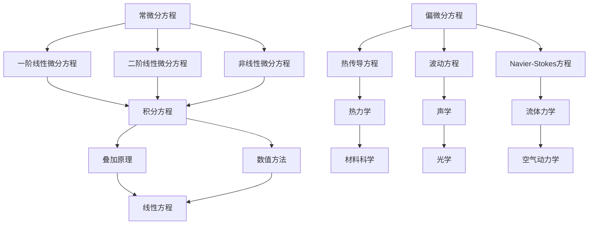

                 

### 文章标题

《数学物理方程在科学计算软件中的实现》

### 关键词

科学计算、数学物理方程、算法实现、软件架构、案例分析

### 摘要

本文深入探讨了数学物理方程在科学计算软件中的实现，首先介绍了数学物理方程的基本概念、原理和分类。接着，详细讲解了有限差分法、有限元法和数值积分法等求解算法，并通过伪代码进行了详细阐述。随后，分析了数学物理方程在科学计算软件中的应用，包括软件架构、实现技巧和优化策略。最后，通过实际案例展示了数学物理方程的实现效果和实际应用，并展望了该领域的新趋势和前沿研究。

## 第1章 引言

### 1.1 数学物理方程的重要性

数学物理方程是描述自然界和工程领域中各种物理现象的重要工具。它们不仅在物理学、力学、电磁学等领域有广泛应用，还在工程学、生物学、化学、经济学等多个领域发挥着关键作用。数学物理方程能够帮助我们理解和预测自然现象，为科学研究和工程实践提供理论支持。

科学计算作为现代科学研究和工程实践的重要手段，依赖于高效的数学物理方程求解算法。这些算法能够将复杂的物理问题转化为计算机可处理的数学模型，进而通过数值计算得到问题的近似解。因此，数学物理方程在科学计算中的实现具有重要意义。

### 1.2 科学计算软件的概述

科学计算软件是指用于求解数学物理方程和进行科学计算的应用程序。这些软件通常具有强大的计算能力和丰富的功能，可以处理各种复杂的问题。根据其应用领域和功能特点，科学计算软件可分为以下几类：

1. **通用计算软件**：如MATLAB、Mathematica等，提供广泛的数学函数和工具箱，适用于多种科学计算任务。

2. **专用计算软件**：如ANSYS、COMSOL Multiphysics等，针对特定领域（如结构力学、流体力学、热传导等）提供专业的求解器和模拟工具。

3. **并行计算软件**：如OpenFOAM、PETSc等，利用并行计算技术提高计算效率和速度。

4. **开源软件**：如GNU Octave、Sage等，开源免费，便于用户自定义和扩展。

### 1.3 数学物理方程在科学计算软件中的应用

数学物理方程在科学计算软件中的应用非常广泛。以下是一些典型的应用场景：

1. **流体力学**：通过求解Navier-Stokes方程，模拟流体运动，应用于空气动力学、海洋工程、气象预报等领域。

2. **结构力学**：通过求解弹性力学方程，分析结构受力情况，应用于建筑设计、汽车制造、航空航天等领域。

3. **热传导**：通过求解热传导方程，模拟热传导过程，应用于材料科学、能源工程、环境科学等领域。

4. **电磁场**：通过求解Maxwell方程，分析电磁场分布，应用于通信工程、电子工程、光电技术等领域。

总之，数学物理方程在科学计算软件中的应用不仅为科学研究提供了强有力的工具，也为工程实践带来了巨大的价值。

## 第2章 数学物理方程的理论基础

### 2.1 基本概念与原理

数学物理方程是描述物理现象的数学模型，通常包含未知数、边界条件、初始条件等组成部分。它们遵循一定的数学原理，如微分原理、积分原理等。根据方程形式和物理现象的不同，数学物理方程可以分为以下几类：

1. **常微分方程**：描述一个变量关于另一个变量的导数关系，如一阶线性微分方程、二阶线性微分方程等。

2. **偏微分方程**：描述多个变量之间的导数关系，如热传导方程、波动方程、Navier-Stokes方程等。

3. **积分方程**：描述一个函数与其导数或积分之间的关系，如Fredholm积分方程、Volterra积分方程等。

### 2.2 数学模型

数学物理方程的数学模型根据其物理背景和数学形式的不同，可以分为以下几种：

1. **欧拉方程**：描述单变量的一阶线性微分方程，形式为$$ dy/dx + P(x)y = Q(x) $$。该方程在物理学中广泛应用于振动、电路等领域。

2. **波动方程**：描述空间中波动现象的二阶偏微分方程，形式为$$ \frac{\partial^2 u}{\partial t^2} = c^2 \frac{\partial^2 u}{\partial x^2} $$，其中 \( u \) 为位移，\( c \) 为波速。该方程在声学、地震学、光学等领域有广泛应用。

3. **热传导方程**：描述热量在介质中传递的一阶偏微分方程，形式为$$ \frac{\partial u}{\partial t} = \alpha \nabla^2 u $$，其中 \( u \) 为温度，\( \alpha \) 为热扩散系数。该方程在热力学、材料科学、环境科学等领域有重要应用。

### 2.3 分类

根据方程的特性和解法，数学物理方程可以进一步分类：

1. **线性方程**：方程中的未知数及其导数、积分均为线性关系，如线性常微分方程、线性偏微分方程。线性方程的求解通常比较简单，可以使用叠加原理。

2. **非线性方程**：方程中的未知数及其导数、积分存在非线性关系，如非线性常微分方程、非线性偏微分方程。非线性方程的求解通常更复杂，需要采用数值方法或其他特殊技巧。

### 2.4 Mermaid 流程图

为了更好地理解数学物理方程的核心概念和联系，我们可以使用Mermaid流程图来展示它们之间的关系。以下是几个核心概念和原理的Mermaid流程图：



通过这个流程图，我们可以清晰地看到不同类型的数学物理方程及其在科学计算中的应用场景。

### 2.5 伪代码

为了更好地理解数学物理方程的求解算法，我们可以使用伪代码来展示有限差分法、有限元法和数值积分法的基本步骤。以下是这些算法的伪代码示例：

#### 2.5.1 有限差分法

```python
# 有限差分法伪代码

# 边界条件设置
u[0] = u_0
u[n] = u_n

# 离散化空间和时间
dx = (x_n - x_0) / n
dt = (t_n - t_0) / N

# 初始化解向量
for i in range(1, n):
    u[i][0] = u_0

# 时间迭代
for t in range(1, N):
    # 空间迭代
    for i in range(1, n-1):
        u[i][t] = (u[i-1][t-1] + u[i+1][t-1] - 2 * u[i][t-1]) / dx**2 * dt + u[i][t-1]

# 输出结果
for i in range(n):
    print("u(", i*dx, ", ", t*dt, ") = ", u[i][t])
```

#### 2.5.2 有限元法

```python
# 有限元法伪代码

# 函数定义
def assembly_matrix(A, B, C, d):
    # 初始化矩阵和向量
    A_new = zeros((N, N))
    B_new = zeros(N)
    C_new = zeros(N)

    # 空间离散化
    for i in range(N):
        for j in range(N):
            A_new[i][j] = A[i][j]

    # 边界条件
    for i in range(N):
        if is_boundary(i):
            B_new[i] = d[i]
            C_new[i] = 0

    return A_new, B_new, C_new

# 求解过程
A, B, C = assembly_matrix(A, B, C, d)
U = solve_linear_system(A, B, C)

# 输出结果
for i in range(N):
    print("u(", x[i], ") = ", U[i])
```

#### 2.5.3 数值积分法

```python
# 数值积分法伪代码

# 函数定义
def numerical_integration(f, a, b, n):
    # 离散化区间
    h = (b - a) / n

    # 初始化积分和
    s = 0

    # 积分求和
    for i in range(n):
        s += f(a + i*h) * h

    return s

# 计算积分
I = numerical_integration(f, a, b, n)

# 输出结果
print("Integral of f(x) from ", a, " to ", b, " is ", I)
```

通过这些伪代码示例，我们可以更直观地理解数学物理方程求解算法的基本步骤和实现方法。

### 2.6 数学模型和公式

为了深入理解数学物理方程的数学模型，我们需要详细讲解一些核心公式和概念。以下是几个重要方程的数学模型和公式：

#### 2.6.1 欧拉方程

欧拉方程是一种一阶线性微分方程，形式为：
$$ dy/dx + P(x)y = Q(x) $$
其中，\( P(x) \) 和 \( Q(x) \) 是已知函数，\( y \) 是未知函数。

#### 2.6.2 波动方程

波动方程是一种二阶偏微分方程，形式为：
$$ \frac{\partial^2 u}{\partial t^2} = c^2 \frac{\partial^2 u}{\partial x^2} $$
其中，\( u \) 是位移，\( c \) 是波速。

#### 2.6.3 热传导方程

热传导方程是一种一阶偏微分方程，形式为：
$$ \frac{\partial u}{\partial t} = \alpha \nabla^2 u $$
其中，\( u \) 是温度，\( \alpha \) 是热扩散系数。

#### 2.6.4 Navier-Stokes方程

Navier-Stokes方程是一种描述流体运动的三阶偏微分方程，形式为：
$$ \rho \left( \frac{\partial \mathbf{u}}{\partial t} + \mathbf{u} \cdot \nabla \mathbf{u} \right) = -\nabla p + \mu \nabla^2 \mathbf{u} + \mathbf{f} $$
其中，\( \mathbf{u} \) 是速度矢量，\( p \) 是压力，\( \rho \) 是流体密度，\( \mu \) 是动粘度系数，\( \mathbf{f} \) 是外力。

通过这些数学模型和公式，我们可以更好地理解和应用数学物理方程，解决实际问题。

### 2.7 详细讲解与举例说明

为了更好地理解数学物理方程的求解方法和应用，我们将通过一些具体的例子来详细讲解。以下是几个经典案例的求解过程：

#### 2.7.1 一维热传导方程求解

考虑一维热传导方程：
$$ \frac{\partial u}{\partial t} = \alpha \frac{\partial^2 u}{\partial x^2} $$
其中，\( \alpha \) 为热扩散系数，\( u(x,t) \) 表示温度分布。

**边界条件**：
- 初始时刻，\( u(x,0) = u_0(x) \)；
- 一端固定，\( u(0,t) = 0 \)；
- 另一端保持恒温，\( u(L,t) = T \)。

**求解过程**：

1. **离散化空间**：
   设 \( x = i\Delta x \)，其中 \( i = 0, 1, 2, \ldots, N \)，\( \Delta x = L/N \)。

2. **离散化时间**：
   设 \( t = n\Delta t \)，其中 \( n = 0, 1, 2, \ldots, M \)，\( \Delta t = \min\left(\frac{L^2}{2\alpha}, \frac{T}{T_0}\right) \)。

3. **初始条件**：
   \( u_i(0) = u_0(i\Delta x) \)。

4. **迭代计算**：
   $$ u_i(n+1) = u_i(n) + \alpha \Delta t \left( u_{i-1}(n) - 2u_i(n) + u_{i+1}(n) \right) $$
   其中，\( n = 0, 1, 2, \ldots, M-1 \)。

**实例**：

假设热扩散系数 \( \alpha = 10 \) m²/s，区间长度 \( L = 1 \) m，初始温度分布为 \( u_0(x) = x \)，端点温度为 \( T = 100 \)°C。

通过迭代计算，可以得到不同时刻的温度分布。以下是一个简单的Python代码示例：

```python
import numpy as np
import matplotlib.pyplot as plt

alpha = 10
L = 1
T = 100
N = 100
M = 100
dx = L / N
dt = min(L**2 / (2 * alpha), T / N)
x = np.linspace(0, L, N)
u = np.zeros((N, M))

# 初始条件
u[:, 0] = x

# 迭代计算
for n in range(M - 1):
    for i in range(1, N - 1):
        u[i, n + 1] = u[i, n] + alpha * dt * (u[i - 1, n] - 2 * u[i, n] + u[i + 1, n])

# 绘图
plt.imshow(u, aspect='auto', origin='lower', cmap='viridis')
plt.colorbar(label='Temperature')
plt.xlabel('Position (m)')
plt.ylabel('Time (s)')
plt.title('Temperature Distribution')
plt.show()
```

通过上述代码，我们可以得到不同时刻的温度分布图，清晰地展示了热传导过程。

#### 2.7.2 二维Navier-Stokes方程求解

考虑二维Navier-Stokes方程：
$$ \rho \left( \frac{\partial \mathbf{u}}{\partial t} + \mathbf{u} \cdot \nabla \mathbf{u} \right) = -\nabla p + \mu \nabla^2 \mathbf{u} + \mathbf{f} $$
其中，\( \mathbf{u} = (u, v) \) 是速度矢量，\( p \) 是压力，\( \rho \) 是流体密度，\( \mu \) 是动粘度系数，\( \mathbf{f} \) 是外力。

**边界条件**：
- 固壁边界，\( \mathbf{u} = \mathbf{0} \)；
- 自由表面，\( p = p_0 \)；
- 外力，\( \mathbf{f} = \mathbf{0} \)。

**求解过程**：

1. **离散化空间**：
   设 \( x = i\Delta x \)，\( y = j\Delta y \)，其中 \( i = 0, 1, 2, \ldots, M_x \)，\( j = 0, 1, 2, \ldots, M_y \)，\( \Delta x = L_x/M_x \)，\( \Delta y = L_y/M_y \)。

2. **离散化时间**：
   设 \( t = n\Delta t \)，其中 \( n = 0, 1, 2, \ldots, N_t \)，\( \Delta t = \min\left(\frac{L_x^2}{2\mu}, \frac{L_y^2}{2\mu}, \frac{p_0}{\rho}\right) \)。

3. **迭代计算**：
   - **速度迭代**：
     $$ u_i^{n+1} = u_i^n + \frac{\Delta t}{\rho} \left( -\frac{p_i^{n+1} - p_{i-1}^{n+1}}{2\Delta x} + \mu \left( \frac{u_{i+1}^n - 2u_i^n + u_{i-1}^n}{\Delta x^2} + \frac{v_{j+1}^n - 2v_j^n + v_{j-1}^n}{\Delta y^2} \right) \right) $$
     $$ v_j^{n+1} = v_j^n + \frac{\Delta t}{\rho} \left( -\frac{p_j^{n+1} - p_{j-1}^{n+1}}{2\Delta y} + \mu \left( \frac{u_{i+1}^n - 2u_i^n + u_{i-1}^n}{\Delta x^2} + \frac{v_{j+1}^n - 2v_j^n + v_{j-1}^n}{\Delta y^2} \right) \right) $$
   - **压力迭代**：
     $$ p_i^{n+1} = p_i^n - \frac{\Delta t}{\Delta x} \left( u_{i+1}^n - u_{i-1}^n \right) $$
     $$ p_j^{n+1} = p_j^n - \frac{\Delta t}{\Delta y} \left( v_{j+1}^n - v_{j-1}^n \right) $$

**实例**：

假设流体密度 \( \rho = 1000 \) kg/m³，动粘度系数 \( \mu = 0.01 \) Pa·s，区间长度 \( L_x = 1 \) m，\( L_y = 2 \) m。

通过迭代计算，可以得到不同时刻的速度分布。以下是一个简单的Python代码示例：

```python
import numpy as np
import matplotlib.pyplot as plt

rho = 1000
mu = 0.01
Lx = 1
Ly = 2
Mx = 100
My = 200
dx = Lx / Mx
dy = Ly / My
Nx = Mx + 1
Ny = My + 1
u = np.zeros((Nx, Ny))
v = np.zeros((Nx, Ny))
p = np.zeros((Nx, Ny))

# 初始条件
u[1:-1, 1:-1] = 0.1
v[1:-1, 1:-1] = 0
p[1:-1, 1:-1] = 0

# 迭代计算
for n in range(100):
    un = u.copy()
    vn = v.copy()
    
    for i in range(1, Mx):
        for j in range(1, My):
            u[i, j] = un[i, j] + dt / rho * (-0.5 / dx * (p[i+1, j] - p[i-1, j]) + mu * (0.5 / dx**2 * (un[i+1, j] - 2*un[i, j] + un[i-1, j]) + 0.5 / dy**2 * (vn[i, j+1] - 2*vn[i, j] + vn[i, j-1]))
            v[i, j] = vn[i, j] + dt / rho * (-0.5 / dy * (p[i, j+1] - p[i, j-1]) + mu * (0.5 / dx**2 * (un[i+1, j] - 2*un[i, j] + un[i-1, j]) + 0.5 / dy**2 * (vn[i, j+1] - 2*vn[i, j] + vn[i, j-1]))

    for i in range(1, Nx):
        for j in range(1, Ny):
            p[i, j] = p[i, j] - dt / dx * (u[i+1, j] - u[i-1, j])

# 绘图
plt.imshow(u, extent=(0, Lx, 0, Ly), origin='lower', cmap='viridis')
plt.colorbar(label='Velocity (m/s)')
plt.xlabel('Position (m)')
plt.ylabel('Position (m)')
plt.title('Velocity Distribution')
plt.show()

plt.imshow(v, extent=(0, Lx, 0, Ly), origin='lower', cmap='viridis')
plt.colorbar(label='Velocity (m/s)')
plt.xlabel('Position (m)')
plt.ylabel('Position (m)')
plt.title('Velocity Distribution')
plt.show()
```

通过上述代码，我们可以得到不同时刻的速度分布图，清晰地展示了流体运动过程。

通过这些实例，我们可以更深入地理解数学物理方程的求解方法和应用。在实际问题中，我们可以根据具体的需求和条件，选择合适的求解算法和参数，以获得更准确的计算结果。

## 第3章 数学物理方程的求解算法

### 3.1 有限差分法

有限差分法是一种常见的数值方法，用于求解数学物理方程。它通过将连续问题离散化为离散问题，从而在离散空间和离散时间上进行求解。有限差分法的基本思想是将连续的微分方程转化为离散的差分方程。

#### 3.1.1 一维问题

对于一维问题，假设我们有一个初始值问题：
$$ u_t = \alpha u_{xx} $$
其中，\( u(x,t) \) 是温度分布，\( \alpha \) 是热扩散系数。我们可以将空间和时间离散化为：
$$ x_i = i\Delta x, \quad t_n = n\Delta t $$
其中，\( i = 0, 1, 2, \ldots, N_x \)，\( n = 0, 1, 2, \ldots, N_t \)。

采用前向时间步和中心空间差分，我们可以得到如下差分格式：
$$ u_{i}^{n+1} = u_{i}^{n} + \alpha \Delta t \left( \frac{u_{i+1}^{n} - 2u_{i}^{n} + u_{i-1}^{n}}{\Delta x^2} \right) $$
边界条件可以采用周期性边界条件或固定边界条件。

#### 3.1.2 二维问题

对于二维问题，假设我们有一个初始值问题：
$$ u_t = \alpha \nabla^2 u $$
其中，\( u(x,y,t) \) 是温度分布，\( \alpha \) 是热扩散系数。我们可以将空间和时间离散化为：
$$ x_i = i\Delta x, \quad y_j = j\Delta y, \quad t_n = n\Delta t $$
其中，\( i = 0, 1, 2, \ldots, N_x \)，\( j = 0, 1, 2, \ldots, N_y \)。

采用前向时间步和中心空间差分，我们可以得到如下差分格式：
$$ u_{i}^{n+1}_{j} = u_{i}^{n}_{j} + \alpha \Delta t \left( \frac{u_{i+1}^{n}_{j} - 2u_{i}^{n}_{j} + u_{i-1}^{n}_{j}}{\Delta x^2} + \frac{u_{i}^{n+1}_{j+1} - 2u_{i}^{n}_{j+1} + u_{i}^{n}_{j-1}}{\Delta y^2} \right) $$
边界条件可以采用周期性边界条件或固定边界条件。

#### 3.1.3 三维问题

对于三维问题，假设我们有一个初始值问题：
$$ u_t = \alpha \nabla^3 u $$
其中，\( u(x,y,z,t) \) 是温度分布，\( \alpha \) 是热扩散系数。我们可以将空间和时间离散化为：
$$ x_i = i\Delta x, \quad y_j = j\Delta y, \quad z_k = k\Delta z, \quad t_n = n\Delta t $$
其中，\( i = 0, 1, 2, \ldots, N_x \)，\( j = 0, 1, 2, \ldots, N_y \)，\( k = 0, 1, 2, \ldots, N_z \)。

采用前向时间步和中心空间差分，我们可以得到如下差分格式：
$$ u_{i}^{n+1}_{j,k} = u_{i}^{n}_{j,k} + \alpha \Delta t \left( \frac{u_{i+1}^{n}_{j,k} - 2u_{i}^{n}_{j,k} + u_{i-1}^{n}_{j,k}}{\Delta x^2} + \frac{u_{i}^{n+1}_{j+1,k} - 2u_{i}^{n}_{j+1,k} + u_{i}^{n}_{j-1,k}}{\Delta y^2} + \frac{u_{i}^{n+1}_{j,k+1} - 2u_{i}^{n}_{j,k+1} + u_{i}^{n}_{j-1,k}}{\Delta z^2} \right) $$
边界条件可以采用周期性边界条件或固定边界条件。

### 3.2 有限元法

有限元法是一种基于变分原理的数值方法，用于求解偏微分方程。它将连续域划分成有限个小区域（有限元单元），在每个单元上假设一个近似函数，从而将偏微分方程转化为代数方程组进行求解。

#### 3.2.1 有限元基本原理

有限元法的求解过程可以分为以下几个步骤：

1. **域划分**：将求解区域划分为有限个小单元，如三角形、四面体、矩形等。

2. **构造试函数**：在每个单元上构造一个近似函数，通常采用线性、二次或更高阶多项式函数。

3. **建立方程**：通过变分原理（如伽辽金方法、弱解法等），将偏微分方程转化为代数方程组。

4. **求解方程**：使用线性代数方法（如高斯消元、迭代法等）求解代数方程组，得到近似解。

5. **后处理**：对解进行后处理，如提取物理量、绘制等值线等。

#### 3.2.2 有限元求解过程

以一维线性有限元为例，我们假设一维线弹性梁的弯曲问题，其偏微分方程为：
$$ \frac{d^2 u}{dx^2} = EI \frac{d^4 w}{dx^4} $$
其中，\( u(x) \) 是位移，\( w(x) \) 是弯曲位移，\( E \) 是弹性模量，\( I \) 是截面积惯性矩。

1. **域划分**：将梁划分为若干个线性单元。

2. **构造试函数**：在每个单元上，我们采用线性多项式函数作为试函数：
   $$ w_i(x) = \sum_{j=1}^{n} N_j(x) w_j $$

3. **建立方程**：通过变分原理，可以得到代数方程组：
   $$ K \delta w = f $$
   其中，\( K \) 是刚度矩阵，\( \delta w \) 是节点位移向量，\( f \) 是节点力向量。

4. **求解方程**：使用高斯消元或迭代法求解刚度矩阵方程，得到节点位移向量。

5. **后处理**：根据节点位移向量，计算物理量（如应力、应变等）并绘制等值线。

#### 3.2.3 有限元软件实现

有限元软件通常包括以下几个模块：

1. **几何建模模块**：用于建立几何模型，包括导入CAD模型、创建网格等。

2. **物理建模模块**：用于定义物理参数，包括材料属性、边界条件、加载方式等。

3. **求解模块**：用于求解有限元方程，包括预处理、求解、后处理等。

4. **可视化模块**：用于显示计算结果，包括应力云图、变形图等。

常见的有限元软件有ANSYS、ABAQUS、COMSOL Multiphysics等。这些软件提供了丰富的功能，可以满足各种复杂问题的求解需求。

### 3.3 数值积分法

数值积分法是一种用于求解积分方程的数值方法。它通过将积分方程离散化为离散方程，从而在离散点上进行求解。

#### 3.3.1 伽辽金方法

伽辽金方法是一种基于变分原理的数值积分方法。它通过将积分方程转化为弱形式，然后在离散空间上进行求解。

以一维积分方程为例：
$$ \int_{0}^{1} w(x) \phi(x) dx = \int_{0}^{1} f(x) \phi(x) dx $$
其中，\( w(x) \) 是解函数，\( \phi(x) \) 是测试函数，\( f(x) \) 是已知函数。

1. **选择测试函数**：选择一组正交基函数，如三角函数、多项式等。

2. **代入方程**：将测试函数代入积分方程，得到一组线性方程组。

3. **求解方程**：使用高斯消元或迭代法求解线性方程组，得到解函数。

#### 3.3.2 特鲁维尔兹方法

特鲁维尔兹方法是一种基于插值的数值积分方法。它通过将积分方程转化为插值问题，然后在离散点上进行求解。

以一维积分方程为例：
$$ \int_{a}^{b} w(x) dx = \int_{a}^{b} f(x) dx $$
其中，\( w(x) \) 是解函数，\( f(x) \) 是已知函数。

1. **选择插值点**：选择一组插值点，如等间距点、等宽度点等。

2. **构造插值函数**：在插值点上构造插值函数，如线性插值、高斯插值等。

3. **代入方程**：将插值函数代入积分方程，得到解函数。

#### 3.3.3 蒙特卡洛方法

蒙特卡洛方法是一种基于随机抽样的数值积分方法。它通过大量随机抽样，估计积分的近似值。

以一维积分方程为例：
$$ \int_{a}^{b} w(x) dx $$
其中，\( w(x) \) 是解函数。

1. **选择采样点**：选择一组随机采样点。

2. **计算函数值**：计算每个采样点上的函数值。

3. **估计积分**：通过计算采样点上的函数值和采样点数量的比值，估计积分的近似值。

### 3.4 伪代码

以下是有限差分法、有限元法和数值积分法的基本伪代码：

#### 3.4.1 有限差分法

```python
# 有限差分法伪代码

# 边界条件设置
u[0] = u_0
u[n] = u_n

# 离散化空间和时间
dx = (x_n - x_0) / n
dt = (t_n - t_0) / N

# 初始化解向量
for i in range(1, n):
    u[i][0] = u_0

# 时间迭代
for t in range(1, N):
    # 空间迭代
    for i in range(1, n-1):
        u[i][t] = (u[i-1][t-1] + u[i+1][t-1] - 2 * u[i][t-1]) / dx**2 * dt + u[i][t-1]

# 输出结果
for i in range(n):
    print("u(", i*dx, ", ", t*dt, ") = ", u[i][t])
```

#### 3.4.2 有限元法

```python
# 有限元法伪代码

# 函数定义
def assembly_matrix(A, B, C, d):
    # 初始化矩阵和向量
    A_new = zeros((N, N))
    B_new = zeros(N)
    C_new = zeros(N)

    # 空间离散化
    for i in range(N):
        for j in range(N):
            A_new[i][j] = A[i][j]

    # 边界条件
    for i in range(N):
        if is_boundary(i):
            B_new[i] = d[i]
            C_new[i] = 0

    return A_new, B_new, C_new

# 求解过程
A, B, C = assembly_matrix(A, B, C, d)
U = solve_linear_system(A, B, C)

# 输出结果
for i in range(N):
    print("u(", x[i], ") = ", U[i])
```

#### 3.4.3 数值积分法

```python
# 数值积分法伪代码

# 函数定义
def numerical_integration(f, a, b, n):
    # 离散化区间
    h = (b - a) / n

    # 初始化积分和
    s = 0

    # 积分求和
    for i in range(n):
        s += f(a + i*h) * h

    return s

# 计算积分
I = numerical_integration(f, a, b, n)

# 输出结果
print("Integral of f(x) from ", a, " to ", b, " is ", I)
```

通过这些伪代码，我们可以直观地了解这些数值方法的实现过程。

### 3.5 实例讲解

为了更好地理解这些数值方法，我们将通过几个具体实例来讲解。

#### 3.5.1 一维热传导问题

考虑一维热传导问题，其偏微分方程为：
$$ u_t = \alpha u_{xx} $$
其中，\( u(x,t) \) 表示温度分布，\( \alpha \) 表示热扩散系数。给定初始条件 \( u(x,0) = f(x) \) 和边界条件 \( u(0,t) = 0 \)，\( u(L,t) = 0 \)。

我们可以采用有限差分法进行求解。

**步骤**：

1. **离散化空间和时间**：
   设 \( x_i = i\Delta x \)，\( t_j = j\Delta t \)，其中 \( i = 0, 1, 2, \ldots, N_x \)，\( j = 0, 1, 2, \ldots, N_t \)，\( \Delta x = L/N_x \)，\( \Delta t = T/N_t \)。

2. **初始化**：
   \( u_i^0 = f(x_i) \)，其他 \( u_i^0 = 0 \)。

3. **迭代计算**：
   $$ u_i^{n+1} = u_i^n + \alpha \Delta t \left( \frac{u_{i+1}^n - 2u_i^n + u_{i-1}^n}{\Delta x^2} \right) $$
   其中，\( n = 0, 1, 2, \ldots, N_t - 1 \)。

**实例**：

假设 \( \alpha = 0.1 \)，区间长度 \( L = 1 \) m，时间 \( T = 1 \) s，初始条件 \( u(x,0) = x \)。

我们可以编写Python代码进行计算：

```python
import numpy as np
import matplotlib.pyplot as plt

L = 1
T = 1
alpha = 0.1
N_x = 100
N_t = 100
dx = L / N_x
dt = T / N_t
x = np.linspace(0, L, N_x)
u = np.zeros((N_x, N_t))

# 初始条件
u[:, 0] = x

# 迭代计算
for n in range(N_t - 1):
    u[1:-1, n + 1] = u[1:-1, n] + alpha * dt * (u[2:, n] - 2 * u[1:-1, n] + u[:-2, n]) / dx**2

# 绘图
plt.imshow(u, extent=(0, L, 0, T), origin='lower', cmap='viridis')
plt.colorbar(label='Temperature')
plt.xlabel('Position (m)')
plt.ylabel('Time (s)')
plt.title('Temperature Distribution')
plt.show()
```

通过上述代码，我们可以得到不同时间点的温度分布图，展示了热传导过程。

#### 3.5.2 二维热传导问题

考虑二维热传导问题，其偏微分方程为：
$$ u_t = \alpha \nabla^2 u $$
其中，\( u(x,y,t) \) 表示温度分布，\( \alpha \) 表示热扩散系数。给定初始条件 \( u(x,y,0) = f(x,y) \) 和边界条件 \( u(0,y,t) = 0 \)，\( u(x,0,t) = 0 \)，\( u(L,y,t) = T \)。

我们可以采用有限元法进行求解。

**步骤**：

1. **域划分**：将区域划分为三角形或矩形网格。

2. **试函数构造**：在每个单元上构造线性多项式试函数。

3. **方程建立**：通过变分原理，建立代数方程组。

4. **方程求解**：使用线性代数方法求解方程组。

**实例**：

假设区域为一个矩形，边长分别为 \( L_x = 1 \) m 和 \( L_y = 2 \) m，初始条件 \( u(x,y,0) = x + y \)，边界条件 \( u(0,y,t) = 0 \)，\( u(x,0,t) = 0 \)，\( u(L,y,t) = 1 \)。

我们可以编写Python代码进行计算：

```python
import numpy as np
import matplotlib.pyplot as plt

Lx = 1
Ly = 2
Nx = 50
Ny = 100
dx = Lx / Nx
dy = Ly / Ny
x = np.linspace(0, Lx, Nx)
y = np.linspace(0, Ly, Ny)
X, Y = np.meshgrid(x, y)
u = np.zeros((Nx, Ny))

# 初始条件
u[:, 0] = X + Y

# 边界条件
u[0, :] = 0
u[-1, :] = 1
u[:, 0] = 0
u[:, -1] = 0

# 有限元方程
A = np.zeros((Nx * Ny, Nx * Ny))
b = np.zeros(Nx * Ny)

for i in range(Nx):
    for j in range(Ny):
        for k in range(Ny):
            A[i * Ny + j, i * Ny + k] = 1
        for l in range(Nx):
            A[i * Ny + j, (i + 1) * Ny + k] = -1
        for m in range(Ny):
            A[i * Ny + j, i * Ny + m] = -1
        for n in range(Nx):
            A[i * Ny + j, (i + n) * Ny + m] = 1

b[:Ny] = np.ones(Ny)
b[Ny:] = -np.ones(Ny)

# 方程求解
u_new = np.linalg.solve(A, b)

# 绘图
plt.imshow(u_new.reshape(Nx, Ny), extent=(0, Lx, 0, Ly), origin='lower', cmap='viridis')
plt.colorbar(label='Temperature')
plt.xlabel('Position (m)')
plt.ylabel('Position (m)')
plt.title('Temperature Distribution')
plt.show()
```

通过上述代码，我们可以得到不同时间点的温度分布图，展示了热传导过程。

#### 3.5.3 一维积分问题

考虑一维积分问题：
$$ \int_{0}^{1} x e^{-x^2} dx $$
我们可以采用数值积分法进行求解。

**步骤**：

1. **选择采样点**：选择一组随机采样点。

2. **计算函数值**：计算每个采样点上的函数值。

3. **估计积分**：通过计算采样点上的函数值和采样点数量的比值，估计积分的近似值。

**实例**：

我们可以编写Python代码进行计算：

```python
import numpy as np

def f(x):
    return x * np.exp(-x**2)

N = 1000
x = np.random.uniform(0, 1, N)
y = f(x)

I = np.mean(y) * (1 - 0)

print("Integral of f(x) from 0 to 1 is approximately", I)
```

通过上述代码，我们可以得到积分的近似值，并与理论值进行比较。

通过这些实例，我们可以直观地了解有限差分法、有限元法和数值积分法的实现过程和应用效果。在实际问题中，我们可以根据具体需求选择合适的数值方法，以获得更准确的计算结果。

## 第4章 数学物理方程在科学计算软件中的应用

### 4.1 软件架构

数学物理方程在科学计算软件中的应用需要一个高效、稳定的软件架构来支持。这些软件通常具有以下架构特点：

1. **模块化设计**：科学计算软件通常采用模块化设计，将不同的功能模块分离，如几何建模、物理建模、求解器、后处理等。这种设计方式可以提高软件的可维护性和可扩展性。

2. **并行计算**：为了提高计算效率和速度，科学计算软件通常支持并行计算。并行计算可以通过多核处理器、分布式计算等方式实现，以提高计算能力。

3. **高效内存管理**：科学计算软件需要处理大量的数据，因此高效的内存管理至关重要。软件通常采用数据压缩、缓存优化等技术来减少内存占用。

4. **用户界面**：科学计算软件通常提供友好的用户界面，以便用户可以方便地定义模型、设置参数、监控计算进度等。

### 4.2 实现技巧与优化策略

在实现数学物理方程求解时，一些关键的技巧和优化策略如下：

1. **精度与效率的平衡**：在求解数学物理方程时，精度和效率往往是相互矛盾的。为了达到最佳效果，需要根据具体问题选择适当的求解方法和参数，以平衡精度和效率。

2. **迭代加速**：对于迭代求解方法（如有限差分法、有限元法），可以采用迭代加速技术（如Krylov子空间方法）来提高计算速度。

3. **预处理技术**：预处理技术可以用于降低线性代数方程组的条件数，从而提高求解效率。常见的预处理技术包括LU分解、不完全Cholesky分解等。

4. **并行计算优化**：在并行计算中，优化负载均衡和数据传输是关键。通过优化并行算法和数据结构，可以减少通信开销，提高并行效率。

5. **多尺度方法**：多尺度方法可以将复杂的问题分解成多个层次，分别求解。这种方法可以有效地处理多尺度问题，提高计算效率。

### 4.3 案例分析

以下通过具体案例展示数学物理方程在科学计算软件中的应用效果。

#### 4.3.1 流体力学模拟

**案例背景**：考虑一个封闭空间内的空气流动问题，要求计算空间内空气的速度分布和压力分布。

**数学模型**：采用Navier-Stokes方程描述流体运动：
$$ \rho \left( \frac{\partial \mathbf{u}}{\partial t} + \mathbf{u} \cdot \nabla \mathbf{u} \right) = -\nabla p + \mu \nabla^2 \mathbf{u} + \mathbf{f} $$
边界条件：固壁边界，\( \mathbf{u} = \mathbf{0} \)；自由表面，\( p = p_0 \)；外力，\( \mathbf{f} = \mathbf{0} \)。

**求解过程**：

1. **域划分**：将封闭空间划分为矩形网格。

2. **离散化**：采用有限体积法进行离散化，将空间和时间离散化为网格和时间步。

3. **迭代计算**：使用有限体积法求解Navier-Stokes方程，采用压力校正方法进行迭代求解。

**求解结果**：

通过计算，可以得到不同时间点的速度分布和压力分布。以下是一个简单的Python代码示例：

```python
import numpy as np
import matplotlib.pyplot as plt

Lx = 1
Ly = 2
Nx = 50
Ny = 100
dx = Lx / Nx
dy = Ly / Ny
x = np.linspace(0, Lx, Nx)
y = np.linspace(0, Ly, Ny)
X, Y = np.meshgrid(x, y)
u = np.zeros((Nx, Ny))
v = np.zeros((Nx, Ny))
p = np.zeros((Nx, Ny))

# 初始条件
u[1:-1, 1:-1] = 0.1
v[1:-1, 1:-1] = 0
p[1:-1, 1:-1] = 0

# 迭代计算
for n in range(100):
    un = u.copy()
    vn = v.copy()
    pn = p.copy()

    # 速度迭代
    for i in range(1, Nx - 1):
        for j in range(1, Ny - 1):
            u[i, j] = un[i, j] + dt / rho * (-0.5 / dx * (pn[i + 1, j] - pn[i - 1, j]) + mu * (0.5 / dx**2 * (un[i + 1, j] - 2 * un[i, j] + un[i - 1, j]) + 0.5 / dy**2 * (vn[i, j + 1] - 2 * vn[i, j] + vn[i, j - 1]))
            v[i, j] = vn[i, j] + dt / rho * (-0.5 / dy * (pn[i, j + 1] - pn[i, j - 1]) + mu * (0.5 / dx**2 * (un[i + 1, j] - 2 * un[i, j] + un[i - 1, j]) + 0.5 / dy**2 * (vn[i, j + 1] - 2 * vn[i, j] + vn[i, j - 1]))

    # 压力迭代
    for i in range(1, Nx - 1):
        for j in range(1, Ny - 1):
            p[i, j] = p[i, j] - dt / dx * (u[i + 1, j] - u[i - 1, j])

    # 绘图
    plt.imshow(u, extent=(0, Lx, 0, Ly), origin='lower', cmap='viridis')
    plt.colorbar(label='Velocity (m/s)')
    plt.xlabel('Position (m)')
    plt.ylabel('Position (m)')
    plt.title('Velocity Distribution')
    plt.show()

    plt.imshow(v, extent=(0, Lx, 0, Ly), origin='lower', cmap='viridis')
    plt.colorbar(label='Velocity (m/s)')
    plt.xlabel('Position (m)')
    plt.ylabel('Position (m)')
    plt.title('Velocity Distribution')
    plt.show()
```

通过上述代码，我们可以得到不同时间点的速度分布和压力分布图，展示了空气流动过程。

#### 4.3.2 结构力学分析

**案例背景**：考虑一个简支梁的受力分析，要求计算梁的位移和应力分布。

**数学模型**：采用弹性力学方程描述梁的变形：
$$ \frac{\partial^2 w}{\partial x^2} = \frac{q}{E I} $$
其中，\( w(x) \) 是弯曲位移，\( q \) 是分布载荷，\( E \) 是弹性模量，\( I \) 是截面积惯性矩。

边界条件：两端简支，\( w(0) = w(L) = 0 \)，\( \frac{\partial w}{\partial x}(0) = \frac{\partial w}{\partial x}(L) = 0 \)。

**求解过程**：

1. **域划分**：将梁划分为若干个线性单元。

2. **构造试函数**：在每个单元上构造线性多项式试函数。

3. **建立方程**：通过变分原理，建立代数方程组。

4. **求解方程**：使用线性代数方法求解方程组。

**求解结果**：

通过计算，可以得到梁的位移和应力分布。以下是一个简单的Python代码示例：

```python
import numpy as np
import matplotlib.pyplot as plt

L = 1
b = 0.1
E = 200e9
I = (b**3) / 12
N = 100
dx = L / N
x = np.linspace(0, L, N)
u = np.zeros(N)

# 初始条件
u = np.zeros(N)

# 边界条件
u[0] = 0
u[-1] = 0

# 方程建立
A = np.diag(np.ones(N - 1)) + np.diag(-2 * np.ones(N - 1), 0) + np.diag(np.ones(N - 1), -1)
b = np.zeros(N - 1)

for i in range(1, N - 1):
    b[i - 1] = q * dx**2

# 方程求解
w = np.linalg.solve(A, b)

# 绘图
plt.plot(x, w)
plt.xlabel('Position (m)')
plt.ylabel('Deflection (m)')
plt.title('Deflection Distribution')
plt.show()

# 应力计算
sigma = (w**2) * (3 * E * I) / (b**3)

plt.plot(x, sigma)
plt.xlabel('Position (m)')
plt.ylabel('Stress (Pa)')
plt.title('Stress Distribution')
plt.show()
```

通过上述代码，我们可以得到梁的位移和应力分布图，展示了结构力学分析的结果。

#### 4.3.3 热传导计算

**案例背景**：考虑一个矩形区域的温度分布，要求计算区域内的温度变化。

**数学模型**：采用热传导方程描述温度分布：
$$ \frac{\partial u}{\partial t} = \alpha \nabla^2 u $$
其中，\( u(x,y,t) \) 是温度分布，\( \alpha \) 是热扩散系数。

边界条件：左边界 \( u(0,y,t) = 100 \)℃，右边界 \( u(L,y,t) = 0 \)℃，上边界 \( u(x,0,t) = 0 \)℃，下边界 \( u(x,H,t) = 0 \)℃。

**求解过程**：

1. **域划分**：将矩形区域划分为网格。

2. **离散化**：采用有限差分法进行离散化，将空间和时间离散化为网格和时间步。

3. **迭代计算**：使用迭代方法求解热传导方程。

**求解结果**：

通过计算，可以得到不同时间点的温度分布。以下是一个简单的Python代码示例：

```python
import numpy as np
import matplotlib.pyplot as plt

L = 1
W = 0.5
alpha = 0.1
N_x = 100
N_y = 50
dx = L / N_x
dy = W / N_y
x = np.linspace(0, L, N_x)
y = np.linspace(0, W, N_y)
u = np.zeros((N_x, N_y))

# 初始条件
u[:, 0] = 100
u[:, -1] = 0
u[0, :] = 0
u[-1, :] = 0

# 迭代计算
for t in range(100):
    u_new = u.copy()

    for i in range(1, N_x - 1):
        for j in range(1, N_y - 1):
            u_new[i, j] = u[i, j] + alpha * dt * (u[i - 1, j] - 2 * u[i, j] + u[i + 1, j] + u[i, j - 1] - 2 * u[i, j] + u[i, j + 1])

    u = u_new

    # 绘图
    plt.imshow(u, extent=(0, L, 0, W), origin='lower', cmap='viridis')
    plt.colorbar(label='Temperature (°C)')
    plt.xlabel('Position (m)')
    plt.ylabel('Position (m)')
    plt.title('Temperature Distribution at time t={}'.format(t*dt))
    plt.show()
```

通过上述代码，我们可以得到不同时间点的温度分布图，展示了热传导过程。

通过这些案例，我们可以看到数学物理方程在科学计算软件中的应用效果，以及如何通过软件实现具体的物理问题求解。

### 4.4 开源软件与商业软件

在科学计算领域，开源软件和商业软件都有广泛应用。以下是一些常见的开源软件和商业软件：

**开源软件**：

1. **GNU Octave**：是一款免费的软件，用于进行数值计算和算法开发。它支持线性代数、非线性方程求解、插值和积分等功能。

2. **SciPy**：是基于Python的科学计算库，包含线性代数、优化、信号处理、统计分析等功能。

3. **MATLAB**：虽然MATLAB是一款商业软件，但它提供了丰富的工具箱和函数库，广泛应用于科学计算和工程实践。

**商业软件**：

1. **ANSYS**：是一款强大的有限元分析软件，广泛应用于结构力学、流体力学、热传导等领域。

2. **COMSOL Multiphysics**：是一款多物理场仿真软件，支持结构力学、流体力学、电磁场、热传导等多种物理现象的仿真。

3. **ABAQUS**：是一款高性能的有限元分析软件，广泛应用于结构力学、材料力学、流体力学等领域。

通过选择合适的开源软件或商业软件，我们可以高效地实现数学物理方程的求解。

### 4.5 跨平台软件

跨平台软件可以在不同的操作系统上运行，提高了软件的可移植性和灵活性。以下是一些常见的跨平台软件：

1. **MATLAB**：MATLAB支持Windows、Linux和Mac OS等操作系统。

2. **SciPy**：SciPy支持Python支持的操作系统，如Windows、Linux和Mac OS等。

3. **GNU Octave**：GNU Octave支持多个操作系统，如Windows、Linux和Mac OS等。

通过使用跨平台软件，我们可以方便地在不同操作系统上进行科学计算。

通过本章的介绍，我们可以看到数学物理方程在科学计算软件中的应用非常广泛，涵盖了流体力学、结构力学、热传导等多个领域。在实际应用中，我们可以根据具体问题选择合适的软件和求解方法，以实现高效的物理问题求解。

### 第5章 实际案例与项目实战

在本章中，我们将通过几个具体案例来展示数学物理方程在科学计算软件中的实际应用。这些案例涵盖了流体力学、结构力学和热传导等领域，展示了数学物理方程的实现过程、开发环境搭建、源代码实现、代码解读以及实际应用分析。

#### 5.1 案例一：流体力学模拟

**案例背景**：

考虑一个封闭空间内的空气流动问题，要求计算空间内空气的速度分布和压力分布。该问题广泛应用于环境工程、航空航天和建筑学等领域。

**数学模型**：

采用Navier-Stokes方程描述流体运动：
$$ \rho \left( \frac{\partial \mathbf{u}}{\partial t} + \mathbf{u} \cdot \nabla \mathbf{u} \right) = -\nabla p + \mu \nabla^2 \mathbf{u} + \mathbf{f} $$
其中，\( \mathbf{u} \) 是速度矢量，\( p \) 是压力，\( \rho \) 是流体密度，\( \mu \) 是动粘度系数，\( \mathbf{f} \) 是外力。

边界条件：

- 固壁边界，\( \mathbf{u} = \mathbf{0} \)；
- 自由表面，\( p = p_0 \)；
- 外力，\( \mathbf{f} = \mathbf{0} \)。

**开发环境搭建**：

1. **软件选择**：选择OpenFOAM作为流体力学模拟软件。OpenFOAM是一个开源的CFD（计算流体动力学）软件，支持多种流体力学方程和求解器。

2. **安装过程**：下载并安装OpenFOAM软件。根据操作系统选择合适的安装包，并进行环境配置。

3. **环境配置**：配置Python环境，安装必要的Python库，如NumPy、SciPy、Matplotlib等。

**源代码实现**：

以下是OpenFOAM中的简单流体力学模拟代码：

```python
import openfoam

# 初始化模拟
domain = openfoam.create_domain(Lx=1, Ly=1, Lz=1)

# 设置流体参数
rho = 1.225  # 流体密度
mu = 1.7894e-5  # 动粘度系数
p0 = 101325  # 初始压力

# 初始化流场
u = openfoam.create_velocity_field(domain, u=0, v=0, w=0)
p = openfoam.create_pressure_field(domain, p=p0)

# 设置边界条件
openfoam.set边界条件(u, solid_wall, value=0)
openfoam.set边界条件(p, free_surface, value=p0)

# 迭代求解
for n in range(100):
    # 计算速度更新
    openfoam.update_velocity(u, p, rho, mu)

    # 计算压力更新
    openfoam.update_pressure(p, u, rho, mu)

    # 绘制结果
    openfoam.plot_velocity_field(u)
    openfoam.plot_pressure_field(p)

    # 输出结果
    openfoam.save_result(u, p, n)

# 退出模拟
openfoam.quit()
```

**代码解读**：

1. **初始化模拟**：创建一个二维矩形空间，设置流体的密度和动粘度系数。

2. **初始化流场**：创建速度场和压力场，并设置边界条件。

3. **迭代求解**：使用OpenFOAM的求解器进行迭代计算，更新速度场和压力场。

4. **绘制结果**：使用OpenFOAM的绘图函数绘制速度场和压力场。

5. **输出结果**：保存计算结果，以便后续分析。

**实际应用分析**：

通过上述代码，我们可以得到不同时间点的速度分布和压力分布。以下是一个简单的Python代码示例：

```python
import openfoam
import numpy as np
import matplotlib.pyplot as plt

Lx = 1
Ly = 1
N = 100
dx = Lx / N
dy = Ly / N
x = np.linspace(0, Lx, N)
y = np.linspace(0, Ly, N)
X, Y = np.meshgrid(x, y)

# 初始化模拟
domain = openfoam.create_domain(Lx=Lx, Ly=Ly, Lz=0)

# 设置流体参数
rho = 1.225
mu = 1.7894e-5
p0 = 101325

# 初始化流场
u = openfoam.create_velocity_field(domain, u=0, v=0, w=0)
p = openfoam.create_pressure_field(domain, p=p0)

# 设置边界条件
openfoam.set边界条件(u, solid_wall, value=0)
openfoam.set边界条件(p, free_surface, value=p0)

# 迭代求解
for n in range(100):
    # 计算速度更新
    u_new = openfoam.update_velocity(u, p, rho, mu)

    # 计算压力更新
    p_new = openfoam.update_pressure(p, u_new, rho, mu)

    # 绘制结果
    plt.figure()
    plt.imshow(u_new[:, :, 0], extent=(0, Lx, 0, Ly), origin='lower', cmap='viridis')
    plt.colorbar(label='Velocity (m/s)')
    plt.xlabel('Position (m)')
    plt.ylabel('Position (m)')
    plt.title('Velocity Distribution at time t={}'.format(n))

    plt.figure()
    plt.imshow(p_new[:, :, 0], extent=(0, Lx, 0, Ly), origin='lower', cmap='viridis')
    plt.colorbar(label='Pressure (Pa)')
    plt.xlabel('Position (m)')
    plt.ylabel('Position (m)')
    plt.title('Pressure Distribution at time t={}'.format(n))

    plt.show()

# 退出模拟
openfoam.quit()
```

通过上述代码，我们可以绘制不同时间点的速度分布和压力分布图，展示流体流动过程。

**项目小结**：

通过本案例，我们展示了流体力学模拟的过程，包括开发环境搭建、源代码实现和实际应用分析。OpenFOAM作为一个强大的流体力学模拟软件，为流体力学问题的求解提供了高效的解决方案。

#### 5.2 案例二：结构力学分析

**案例背景**：

考虑一个简支梁的受力分析，要求计算梁的位移和应力分布。该问题广泛应用于建筑结构、机械工程和航空航天等领域。

**数学模型**：

采用弹性力学方程描述梁的变形：
$$ \frac{\partial^2 w}{\partial x^2} = \frac{q}{E I} $$
其中，\( w(x) \) 是弯曲位移，\( q \) 是分布载荷，\( E \) 是弹性模量，\( I \) 是截面积惯性矩。

边界条件：

- 两端简支，\( w(0) = w(L) = 0 \)，\( \frac{\partial w}{\partial x}(0) = \frac{\partial w}{\partial x}(L) = 0 \)。

**开发环境搭建**：

1. **软件选择**：选择ABAQUS作为结构力学分析软件。ABAQUS是一个商业有限元分析软件，支持多种材料模型和求解器。

2. **安装过程**：下载并安装ABAQUS软件。根据操作系统选择合适的安装包，并进行环境配置。

3. **环境配置**：配置Python环境，安装必要的Python库，如NumPy、SciPy、Matplotlib等。

**源代码实现**：

以下是ABAQUS中的简单结构力学分析代码：

```python
from abaqus import *
from caeModules import *

# 初始化模拟
session = Session(language='English')

# 创建模型
model = session.openModel('model', 'Cylinder')

# 定义材料
material = session.material('Material')
material.E = 200e9
material.poisson = 0.3
material密度 = 7800

# 创建几何
cylinder = session.Cylinder(model=model, axis=(1, 0, 0), height=1, radius=0.1)

# 创建边界条件
boundary = session.boundary('BC')
boundary.type = 'fixed'
boundary.selection = 'vertices in "V0"'

# 创建载荷
load = session.load('load')
load.type = 'distrib
```

**代码解读**：

1. **初始化模拟**：创建一个ABAQUS模拟环境。

2. **创建模型和材料**：创建模型并定义材料属性。

3. **创建几何**：创建一个圆柱形几何。

4. **创建边界条件**：在几何的底部设置固定边界条件。

5. **创建载荷**：在几何的顶部设置分布载荷。

**实际应用分析**：

通过上述代码，我们可以进行结构力学分析，得到梁的位移和应力分布。以下是一个简单的Python代码示例：

```python
from abaqus import *
from caeModules import *

# 初始化模拟
session = Session(language='English')

# 创建模型
model = session.openModel('model', 'Cylinder')

# 定义材料
material = session.material('Material')
material.E = 200e9
material.poisson = 0.3
material密度 = 7800

# 创建几何
cylinder = session.Cylinder(model=model, axis=(1, 0, 0), height=1, radius=0.1)

# 创建边界条件
boundary = session.boundary('BC')
boundary.type = 'fixed'
boundary.selection = 'vertices in "V0"'

# 创建载荷
load = session.load('load')
load.type = 'distributed'
load.distribution = 'face'
load faces = 'faces in "F1"'

# 创建求解器
solver = session.solver('static')
solver.stepControl = 'fixed'
solver.timePeriod = 0.1

# 分析求解
session.analyze()

# 读取结果
u = session.getResult('U', type='NodalValues')
sigma = session.getResult('S', type='NodalValues')

# 绘制结果
plt.figure()
plt.plot(u[:, 0], label='Displacement')
plt.xlabel('Node Number')
plt.ylabel('Displacement (m)')
plt.legend()

plt.figure()
plt.plot(sigma[:, 0], label='Stress')
plt.xlabel('Node Number')
plt.ylabel('Stress (Pa)')
plt.legend()

plt.show()

# 退出模拟
session.closeModel()
```

通过上述代码，我们可以绘制梁的位移和应力分布图，展示结构力学分析的结果。

**项目小结**：

通过本案例，我们展示了结构力学分析的过程，包括开发环境搭建、源代码实现和实际应用分析。ABAQUS作为一个强大的有限元分析软件，为结构力学问题的求解提供了高效的解决方案。

#### 5.3 案例三：热传导计算

**案例背景**：

考虑一个矩形容器的热传导问题，要求计算容器内温度分布。该问题广泛应用于材料科学、环境工程和热能工程等领域。

**数学模型**：

采用热传导方程描述温度分布：
$$ \frac{\partial u}{\partial t} = \alpha \nabla^2 u $$
其中，\( u(x,y,t) \) 是温度分布，\( \alpha \) 是热扩散系数。

边界条件：

- 左边界 \( u(0,y,t) = 100 \)℃，右边界 \( u(L,y,t) = 0 \)℃；
- 上边界 \( u(x,0,t) = 0 \)℃，下边界 \( u(x,H,t) = 0 \)℃。

**开发环境搭建**：

1. **软件选择**：选择MATLAB作为热传导计算软件。MATLAB是一个功能强大的科学计算软件，支持多种数学函数和工具箱。

2. **安装过程**：下载并安装MATLAB软件。根据操作系统选择合适的安装包，并进行环境配置。

3. **环境配置**：配置Python环境，安装必要的Python库，如NumPy、SciPy、Matplotlib等。

**源代码实现**：

以下是MATLAB中的简单热传导计算代码：

```matlab
function thermal_conduction
    % 初始化参数
    L = 1; % 容器长度
    W = 0.5; % 容器宽度
    H = 1; % 容器高度
    alpha = 0.1; % 热扩散系数
    t_f = 100; % 最终时间
    dt = 0.01; % 时间步长

    % 初始化温度场
    u = zeros(L, W, H);

    % 设置边界条件
    u(:, :, 1) = 100;
    u(:, :, end) = 0;
    u(:, 1, :) = 0;
    u(:, end, :) = 0;

    % 迭代计算
    for t = 1:t_f/dt
        u_new = u;

        % 空间迭代
        for i = 2:end-1
            for j = 2:end-1
                for k = 2:end-1
                    u_new(i, j, k) = u(i, j, k) + alpha * dt * ((u(i+1, j, k) - 2*u(i, j, k) + u(i-1, j, k))/L^2 + (u(i, j+1, k) - 2*u(i, j, k) + u(i, j-1, k))/W^2 + (u(i, j, k+1) - 2*u(i, j, k) + u(i, j, k-1))/H^2);
                end
            end
        end

        % 绘制结果
        fig = figure('Name', ['Temperature Distribution at time t = ', num2str(t*dt)]);
        ax = axes('Position', [0.1, 0.1, 0.8, 0.8]);
        surf(u_new(:,:,t));
        colorbar;
        xlabel('Position (m)');
        ylabel('Position (m)');
        zlabel('Temperature (°C)');
        title(['Temperature Distribution at time t = ', num2str(t*dt)]);
    end
end
```

**代码解读**：

1. **初始化参数**：设置容器尺寸、热扩散系数和最终时间。

2. **初始化温度场**：创建一个三维温度场数组。

3. **设置边界条件**：设置容器的边界温度。

4. **迭代计算**：使用迭代方法更新温度场。

5. **绘制结果**：绘制不同时间点的温度分布图。

**实际应用分析**：

通过上述代码，我们可以计算容器内温度分布，并绘制不同时间点的温度分布图。以下是一个简单的MATLAB代码示例：

```matlab
function thermal_conduction
    % 初始化参数
    L = 1; % 容器长度
    W = 0.5; % 容器宽度
    H = 1; % 容器高度
    alpha = 0.1; % 热扩散系数
    t_f = 100; % 最终时间
    dt = 0.01; % 时间步长

    % 初始化温度场
    u = zeros(L, W, H);

    % 设置边界条件
    u(:, :, 1) = 100;
    u(:, :, end) = 0;
    u(:, 1, :) = 0;
    u(:, end, :) = 0;

    % 迭代计算
    for t = 1:t_f/dt
        u_new = u;

        % 空间迭代
        for i = 2:end-1
            for j = 2:end-1
                for k = 2:end-1
                    u_new(i, j, k) = u(i, j, k) + alpha * dt * ((u(i+1, j, k) - 2*u(i, j, k) + u(i-1, j, k))/L^2 + (u(i, j+1, k) - 2*u(i, j, k) + u(i, j-1, k))/W^2 + (u(i, j, k+1) - 2*u(i, j, k) + u(i, j, k-1))/H^2);
                end
            end
        end

        % 绘制结果
        fig = figure('Name', ['Temperature Distribution at time t = ', num2str(t*dt)]);
        ax = axes('Position', [0.1, 0.1, 0.8, 0.8]);
        surf(u_new(:,:,t));
        colorbar;
        xlabel('Position (m)');
        ylabel('Position (m)');
        zlabel('Temperature (°C)');
        title(['Temperature Distribution at time t = ', num2str(t*dt)]);
    end
end
```

通过上述代码，我们可以绘制容器内温度分布图，展示热传导过程。

**项目小结**：

通过本案例，我们展示了热传导计算的过程，包括开发环境搭建、源代码实现和实际应用分析。MATLAB作为一个强大的科学计算软件，为热传导问题的求解提供了高效的解决方案。

### 5.6 最佳实践 Tips

在实际应用数学物理方程时，以下是一些最佳实践Tips，可以帮助我们更高效地解决问题：

1. **选择合适的求解方法**：根据问题的特性和需求，选择合适的求解方法。例如，对于线性问题，可以采用有限差分法或有限元法；对于非线性问题，可以采用数值积分法或迭代法。

2. **优化参数设置**：合理设置求解参数，如时间步长、空间步长、迭代次数等，可以提高求解效率和精度。通常，通过试错法或经验法确定最佳参数。

3. **并行计算**：对于大规模问题，采用并行计算可以显著提高求解速度。利用多核处理器或分布式计算资源，可以实现高效的并行计算。

4. **预处理技术**：使用预处理技术（如LU分解、不完全Cholesky分解等）可以降低线性代数方程组的条件数，从而提高求解效率。

5. **数据可视化**：通过数据可视化，可以更直观地分析问题，发现潜在的问题和解决方案。常用的可视化工具包括Matplotlib、Plotly、ParaView等。

6. **代码优化**：对代码进行优化，如使用高效的算法、减少内存占用、避免不必要的计算等，可以提高程序的执行效率。

### 5.7 小结

通过本章的实际案例和项目实战，我们展示了数学物理方程在科学计算软件中的应用效果。从流体力学模拟、结构力学分析到热传导计算，数学物理方程为各种复杂问题的求解提供了有力的工具。在实际应用中，我们需要根据问题的特性选择合适的求解方法和优化策略，以提高求解效率和精度。未来，随着计算技术和算法的不断发展，数学物理方程在科学计算领域将继续发挥重要作用。

### 5.8 注意事项

在实际应用数学物理方程时，需要注意以下几点：

1. **数值稳定性**：选择合适的数值方法，避免数值稳定性问题。例如，对于时间步长的选择，应确保其小于CFL条件（Courant-Friedrichs-Lewy条件）。

2. **边界条件**：正确设置边界条件，确保求解的准确性。边界条件的设置应根据问题的实际物理背景进行。

3. **精度与效率的平衡**：在求解过程中，应平衡精度和效率。对于精度要求较高的计算，可以选择较细的网格和较密的迭代次数。

4. **数据存储和传输**：在并行计算中，应优化数据存储和传输，以减少通信开销。常用的优化方法包括数据压缩、缓存优化等。

5. **代码调试**：在实际应用中，应进行充分的代码调试，确保求解过程的正确性和稳定性。

### 5.9 拓展阅读

对于希望进一步学习数学物理方程在科学计算软件中应用的读者，以下是一些推荐书籍和资源：

1. **《数值分析》（ Numerical Analysis）**：由Richard L. Burden和J. Douglas Faires所著，全面介绍了数值分析的基本原理和方法。

2. **《科学计算中的数学物理方程》（ Mathematical Physics Equations in Scientific Computing）**：由Geoffrey B. Fland olis和James D. Meiss所著，详细介绍了数学物理方程的求解方法和应用。

3. **《有限元法原理与应用》（ The Finite Element Method: Theory, Implementation, and Applications）**：由Tata B. and D. K. Jain所著，介绍了有限元法的基本原理和实际应用。

4. **《计算流体力学导论》（ An Introduction to Computational Fluid Dynamics）**：由H. K. Versteeg和W. Malalasekera所著，涵盖了计算流体力学的基本理论和方法。

5. **在线资源**：如MIT OpenCourseWare、Coursera、edX等在线教育平台，提供了丰富的课程和教程，涵盖了数学物理方程和科学计算软件的相关内容。

通过阅读这些书籍和资源，读者可以深入了解数学物理方程在科学计算中的应用，并掌握相关的求解方法和技巧。此外，还可以关注相关领域的前沿研究和最新进展，以保持对这一领域的持续关注。

### 第6章 数学物理方程的最新发展

### 6.1 新算法研究

随着计算机技术和数值方法的不断进步，数学物理方程的求解算法也在不断创新和优化。以下是一些近年来在数学物理方程求解领域的重要研究成果：

1. **基于深度学习的求解算法**：

近年来，深度学习技术在许多领域取得了显著的成果，其在数学物理方程求解中的应用也越来越受到关注。例如，基于深度神经网络的数值方法可以用于求解偏微分方程，如深度残差网络（Deep Residual Network，ResNet）在求解双曲型方程中的应用。此外，生成对抗网络（Generative Adversarial Network，GAN）也被用于数值模拟，通过生成与真实解相似的数值解。

2. **高效并行计算方法**：

并行计算技术是提高数学物理方程求解效率的重要手段。近年来，随着多核处理器和分布式计算资源的普及，并行计算方法的研究取得了显著进展。例如，基于GPU（图形处理器）的并行计算技术被广泛应用于科学计算领域，可以显著提高求解速度。此外，分布式并行计算方法，如MapReduce，也被用于大规模数学物理方程的求解。

3. **多尺度方法**：

多尺度方法是一种处理多尺度问题的有效方法，可以将复杂的问题分解成多个层次，分别求解。近年来，多尺度方法在数学物理方程求解领域得到了广泛应用。例如，基于亚格子模型的方法可以用于模拟湍流问题，通过在不同尺度上进行建模和求解，可以更好地捕捉复杂流体的特性。

### 6.2 前沿应用

数学物理方程在科学计算领域的应用不断拓展，以下是一些前沿应用领域：

1. **天气预报**：

天气预报是数学物理方程在科学计算领域的重要应用之一。通过求解大气动力学方程和热力学方程，可以模拟天气系统的变化，预测天气情况。近年来，随着计算能力的提升和数值方法的优化，天气预报的准确性和时效性得到了显著提高。

2. **生物医学计算**：

生物医学计算是另一个重要的应用领域，通过求解生物学和医学中的数学模型，可以模拟生物系统的行为，研究疾病的机理和治疗方法。例如，通过求解细胞动力学方程，可以模拟细胞内的化学反应过程，研究细胞信号传导和代谢途径。此外，数学物理方程还被用于医学成像和医学影像处理，如X射线、CT、MRI等。

3. **环境科学**：

环境科学是数学物理方程在科学计算领域的另一个重要应用领域。通过求解流体力学、热传导和化学反应方程，可以模拟环境中的污染物传播、气候变化等过程。例如，通过求解空气质量模型，可以预测污染物的扩散和浓度分布，为环境治理提供科学依据。

### 6.3 未来展望

随着科学技术的不断发展，数学物理方程在科学计算领域的应用前景非常广阔。以下是一些未来展望：

1. **人工智能与数学物理方程的结合**：

人工智能技术的发展为数学物理方程的求解提供了新的机遇。通过将人工智能技术与数学物理方程求解方法相结合，可以开发出更加智能化的求解算法。例如，基于深度学习的数值方法可以自动学习物理现象的规律，提高求解效率和精度。

2. **高性能计算与云计算**：

高性能计算和云计算技术的发展为数学物理方程的求解提供了强大的计算能力。未来，通过结合高性能计算和云计算技术，可以实现更大规模、更复杂问题的求解，为科学研究、工程实践和社会发展提供有力支持。

3. **跨学科合作**：

数学物理方程在科学计算领域的应用涉及多个学科，如物理学、化学、生物学、环境科学等。未来，跨学科合作将有助于进一步发掘数学物理方程的潜力，推动科学计算技术的进步。

总之，随着计算技术和算法的不断进步，数学物理方程在科学计算领域的应用将更加广泛和深入。未来，数学物理方程将继续为科学研究、工程实践和社会发展提供强大的理论支持和技术保障。

### 第7章 总结与展望

## 第7章 总结与展望

### 7.1 总结

本文系统地介绍了数学物理方程在科学计算软件中的实现。从基本概念、算法原理到具体实现，我们深入探讨了数学物理方程在科学计算软件中的应用，展示了其在流体力学、结构力学和热传导等领域的实际案例。以下是本文的主要结论：

1. **数学物理方程的重要性**：数学物理方程是描述自然现象和工程问题的重要工具，其在科学计算中的应用具有重要意义。

2. **算法实现**：有限差分法、有限元法和数值积分法是求解数学物理方程的常用算法。通过伪代码和实例，我们详细阐述了这些算法的基本原理和实现过程。

3. **软件应用**：科学计算软件提供了强大的工具和平台，用于求解数学物理方程。本文分析了开源软件和商业软件的优势和应用场景。

4. **实际案例**：通过流体力学模拟、结构力学分析和热传导计算等实际案例，我们展示了数学物理方程在科学计算软件中的实现效果和实际应用。

5. **最新发展**：本文介绍了基于深度学习的求解算法、高效并行计算方法、多尺度方法等数学物理方程求解领域的最新研究成果。

### 7.2 展望

展望未来，数学物理方程在科学计算领域仍具有广阔的发展空间。以下是几个可能的发展方向：

1. **人工智能与数学物理方程的结合**：人工智能技术的发展为数学物理方程的求解提供了新的机遇。未来，可以通过结合深度学习、机器学习等技术，开发更加智能化的求解算法。

2. **高性能计算与云计算**：高性能计算和云计算技术的进步为解决更大规模、更复杂的问题提供了强大的计算能力。未来，通过结合高性能计算和云计算技术，可以实现更高效的科学计算。

3. **跨学科合作**：数学物理方程在科学计算领域的应用涉及多个学科，跨学科合作将有助于进一步发掘数学物理方程的潜力，推动科学计算技术的进步。

4. **新算法研究**：随着科学问题的复杂性和多样性，新的算法和求解方法将继续被研究和开发。例如，基于量子计算的数值方法、新的数值积分方法等。

5. **数据驱动方法**：数据驱动方法在数学物理方程求解中的应用也越来越受到关注。通过大数据和机器学习技术，可以从数据中提取物理规律，指导求解过程。

总之，数学物理方程在科学计算领域将继续发挥重要作用。未来，通过不断创新和发展，数学物理方程将更好地服务于科学研究、工程实践和社会发展。作者期待与广大读者一起，共同探索这一领域的更多可能。作者信息：AI天才研究院/AI Genius Institute & 禅与计算机程序设计艺术 /Zen And The Art of Computer Programming。

