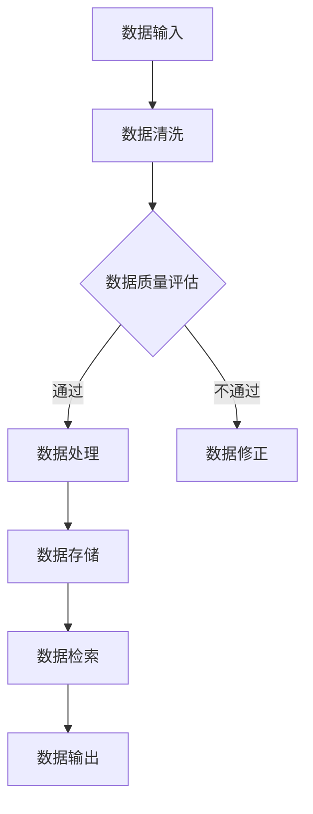

                 


### 第1章 引言与核心概念

#### 1.1 数据架构概述

数据架构是指组织内部数据的管理、存储、处理和使用的结构。它定义了数据如何在组织内流动、存储和交互，以及如何被不同系统和应用所使用。数据架构的核心概念包括数据实体、数据关系、数据流和数据存储。

**1.1.1 数据架构的核心概念**

- **数据实体**：数据架构中的基础元素，如客户、订单、产品等。它们代表了业务中的实际对象。
- **数据关系**：描述数据实体之间的关联，如客户和订单之间的关联。
- **数据流**：数据在系统内部的流动路径，包括数据的收集、处理、存储和检索。
- **数据存储**：数据架构中的数据存储结构，如数据库、数据仓库和数据湖。

**1.1.2 数据架构的三层模型**

数据架构通常采用三层模型，即数据层、应用层和用户层。

- **数据层**：定义数据实体、关系和存储结构，是数据架构的核心。
- **应用层**：定义数据如何被不同应用程序使用，包括数据接口、API和数据交换格式。
- **用户层**：定义数据如何被最终用户使用，包括报表、仪表板和用户界面。

**1.1.3 数据架构的重要性**

数据架构在组织中起着至关重要的作用，它影响以下几个方面：

- **数据一致性**：通过统一的数据定义和标准，确保数据在组织内的不同系统和应用中的一致性。
- **数据可用性**：通过合理的存储和处理结构，提高数据的检索和访问效率。
- **数据安全性**：通过数据加密、访问控制和审计等手段，保护数据的机密性和完整性。
- **数据可扩展性**：通过灵活的架构设计，支持组织的业务增长和变化。

#### 1.2 数据治理的重要性

数据治理是指对组织内部数据的管理和控制过程，包括数据的收集、存储、处理、使用和保护。数据治理的重要性体现在以下几个方面：

**1.2.1 数据治理的定义**

数据治理是一个多维度的过程，涉及以下几个方面：

- **数据策略**：定义组织的数据目标和原则，如数据隐私、数据安全、数据质量和数据一致性。
- **数据标准**：制定统一的数据定义、命名规则和数据格式标准。
- **数据流程**：定义数据的收集、处理、存储和分发流程。
- **数据合规**：确保组织的数据操作符合相关法规和标准，如GDPR、HIPAA等。

**1.2.2 数据治理的目标**

数据治理的主要目标包括：

- **数据质量**：确保数据准确性、完整性和一致性，提高数据的价值。
- **数据安全**：保护数据不被未授权访问、篡改或泄露。
- **数据合规**：确保组织的数据操作符合相关法规和标准。
- **数据可扩展性**：支持组织的业务增长和变化，灵活调整数据架构。

**1.2.3 数据治理的挑战**

数据治理面临着一系列挑战：

- **数据多样性**：随着大数据时代的到来，数据来源和类型越来越多样化，数据治理难度增加。
- **数据质量**：数据质量问题普遍存在，如数据缺失、重复、不一致等，影响数据价值。
- **数据合规性**：不同国家和地区有不同的数据保护法规，组织需要遵守并适应这些法规。
- **技术变革**：随着技术的快速发展，组织需要不断更新和调整数据架构和治理策略。

#### 1.3 P9工程师的角色与职责

P9工程师是高级技术专家，通常在组织中担任技术领导或关键项目负责人的角色。他们的职责包括：

**1.3.1 P9工程师的技能要求**

P9工程师需要具备以下技能：

- **技术深度**：深入理解计算机科学、数据结构和算法，能解决复杂的技术问题。
- **技术广度**：了解不同领域的技术，如数据库、分布式系统、云计算等。
- **领导力**：具备领导团队和管理项目的经验，能有效沟通和协调。
- **业务理解**：理解组织的业务目标和需求，能将技术解决方案与业务目标相结合。

**1.3.2 P9工程师的工作重点**

P9工程师的工作重点包括：

- **技术战略规划**：制定技术发展方向和规划，为组织的技术创新提供指导。
- **关键技术决策**：参与关键技术的选择和决策，确保技术选型的正确性。
- **项目管理和协调**：管理关键技术项目，协调不同团队和部门之间的工作。
- **技术培训和传承**：培训团队成员，传授技术知识和经验，提升团队整体技术能力。

**1.3.3 P9工程师的职业发展路径**

P9工程师的职业发展路径通常包括以下几个阶段：

- **技术专家**：在某个技术领域深入研究和积累经验，成为该领域的专家。
- **技术领导**：带领团队，管理关键技术项目，成为组织的技术领导者。
- **技术战略规划师**：参与组织的技术战略规划，制定技术发展方向和规划。
- **技术总监或CTO**：担任技术高级管理职位，负责组织的技术发展方向和整体技术架构。

### 第2章 数据架构设计与原理

#### 2.1 数据架构核心概念

数据架构的设计过程是一个系统性和复杂的过程，它需要综合考虑数据实体、数据关系、数据流和数据存储等多个方面。以下是数据架构核心概念的具体内容。

**2.1.1 数据架构的组成要素**

数据架构的组成要素包括：

- **数据实体**：代表业务中的实际对象，如客户、订单、产品等。
- **数据属性**：描述数据实体的特征，如客户的姓名、地址、电话等。
- **数据关系**：描述数据实体之间的关联，如客户和订单之间的关联。
- **数据流**：数据在系统内部的流动路径，包括数据的收集、处理、存储和检索。
- **数据存储**：数据架构中的数据存储结构，如数据库、数据仓库和数据湖。

**2.1.2 数据架构的设计原则**

数据架构的设计原则包括：

- **业务导向**：数据架构的设计应该紧密围绕业务需求，确保数据能支持业务的运作和发展。
- **标准化**：统一数据定义、命名规则和数据格式，确保数据的一致性和可维护性。
- **灵活性**：数据架构应具备良好的灵活性，能适应业务变化和技术更新。
- **可扩展性**：数据架构应支持业务的增长和变化，具备良好的扩展性。

**2.1.3 数据架构的设计流程**

数据架构的设计流程通常包括以下几个步骤：

1. **需求分析**：了解业务需求，明确数据架构的目标和范围。
2. **数据实体定义**：确定数据实体和属性，定义数据实体的关系。
3. **数据流设计**：设计数据流，确定数据的收集、处理、存储和检索路径。
4. **数据存储设计**：选择合适的存储结构，设计数据存储方案。
5. **数据安全设计**：设计数据安全策略，确保数据的机密性和完整性。
6. **数据质量设计**：设计数据质量保障措施，确保数据的准确性、完整性和一致性。
7. **数据治理设计**：设计数据治理框架，确保数据的合规性和可持续性。

#### 2.2 数据模型设计

数据模型是数据架构的核心组成部分，它定义了数据实体的结构、关系和操作。以下是数据模型设计的主要内容。

**2.2.1 关系型数据模型**

关系型数据模型是基于数学关系理论的，它将数据组织成表格形式，通过外键建立数据实体之间的关系。关系型数据模型的特点如下：

- **表格结构**：数据以表格的形式存储，每个表格代表一个数据实体。
- **关系定义**：通过外键建立数据实体之间的关系。
- **查询能力**：支持复杂的关系查询，如连接查询、分组查询等。

关系型数据模型的应用场景包括：

- **事务处理**：关系型数据库擅长处理事务，确保数据的一致性。
- **结构化数据存储**：关系型数据库适合存储结构化数据，如订单、客户信息等。

**2.2.2 非关系型数据模型**

非关系型数据模型不同于关系型数据模型，它不依赖于表格结构，而是采用文档、图形、键值等多种形式来组织数据。非关系型数据模型的特点如下：

- **灵活的结构**：非关系型数据库支持灵活的数据结构，能够适应不同类型的数据。
- **高性能**：非关系型数据库通常采用分布式存储和索引技术，能够提供高性能的数据处理能力。

非关系型数据模型的应用场景包括：

- **大数据处理**：非关系型数据库适合处理大量非结构化数据，如社交媒体数据、物联网数据等。
- **实时数据处理**：非关系型数据库能够提供实时数据处理能力，适用于实时分析和应用场景。

**2.2.3 分布式数据模型**

分布式数据模型是将数据分散存储在多个节点上，通过分布式协议进行数据管理和查询。分布式数据模型的特点如下：

- **高可用性**：分布式数据模型能够实现数据的冗余存储，提高系统的可用性。
- **高扩展性**：分布式数据模型能够通过增加节点来扩展存储和处理能力。
- **高性能**：分布式数据模型能够通过并行处理来提高数据处理能力。

分布式数据模型的应用场景包括：

- **大数据应用**：分布式数据模型适用于处理大规模数据，如搜索引擎、实时数据分析等。
- **分布式系统**：分布式数据模型适用于分布式系统，如分布式数据库、分布式缓存等。

#### 2.3 数据流设计

数据流设计是数据架构设计的重要组成部分，它定义了数据在系统内部的流动路径和处理流程。以下是数据流设计的主要内容。

**2.3.1 数据流的定义与分类**

数据流是指数据在系统内部的流动路径和处理流程。数据流可以分为以下几类：

- **输入流**：数据从外部系统或设备进入系统。
- **处理流**：数据在系统内部进行加工和处理。
- **输出流**：数据从系统输出到外部系统或设备。
- **内部流**：系统内部不同模块之间的数据流动。

**2.3.2 数据流设计的原则**

数据流设计应遵循以下原则：

- **一致性**：确保数据在系统内的流动和操作保持一致，避免数据冲突和不一致。
- **高效性**：优化数据流的路径和处理流程，提高数据处理效率。
- **可扩展性**：数据流设计应具备良好的扩展性，能适应业务增长和变化。
- **安全性**：确保数据在流动过程中得到安全保护，防止数据泄露和损坏。

**2.3.3 数据流设计的工具与方法**

数据流设计可以使用以下工具和方法：

- **Mermaid流程图**：使用Mermaid语法绘制数据流流程图，直观展示数据流动和处理过程。
- **UML序列图**：使用UML序列图描述数据流和处理过程，展示不同模块之间的交互。
- **数据流程图**：使用数据流程图描述数据流动和处理过程，包括数据的输入、处理和输出。

#### 2.4 Mermaid流程图展示

Mermaid是一种方便的Markdown扩展，可以用来绘制流程图、时序图、状态图等。下面我们将使用Mermaid语法来展示一个简单的数据流流程图。



上面的Mermaid流程图展示了数据从输入到输出的全过程，包括数据清洗、数据质量评估、数据处理、数据存储、数据检索和数据输出。通过这样的流程图，我们可以直观地理解数据在系统内的流动和处理过程。

### 第3章 数据治理实践

数据治理是确保数据质量、安全性和合规性的关键过程。在复杂的企业环境中，数据治理的实践不仅需要理论指导，还需要具体的操作方法和工具。以下是数据治理实践的主要内容。

#### 3.1 数据治理框架

数据治理框架是组织进行数据治理的基础，它提供了数据治理的流程、方法和工具。以下是构建数据治理框架的步骤：

**3.1.1 数据治理体系的构建**

1. **成立数据治理委员会**：数据治理委员会是数据治理的最高决策机构，负责制定数据治理策略和决策。
2. **制定数据治理策略**：根据组织的需求和法规要求，制定数据治理策略，包括数据质量、数据安全、数据合规等方面。
3. **建立数据治理组织**：明确数据治理的组织架构，包括数据治理团队、数据质量团队、数据安全团队等。
4. **制定数据治理流程**：根据数据治理策略，制定详细的数据治理流程，包括数据收集、存储、处理、使用和保护等环节。

**3.1.2 数据治理策略制定**

1. **数据质量策略**：制定数据质量评估、数据质量改进和数据质量管理流程，确保数据准确性、完整性和一致性。
2. **数据安全策略**：制定数据安全策略，包括数据加密、访问控制、审计等，确保数据在存储和传输过程中的安全。
3. **数据合规策略**：根据相关法规和标准，制定数据合规策略，确保组织的数据操作符合法规要求。

**3.1.3 数据治理流程设计**

1. **数据收集流程**：设计数据收集流程，确保数据来源的合法性和数据质量的可靠性。
2. **数据存储流程**：设计数据存储流程，确保数据的存储安全和数据备份策略。
3. **数据处理流程**：设计数据处理流程，确保数据处理的高效性和准确性。
4. **数据使用流程**：设计数据使用流程，确保数据的授权使用和合法用途。
5. **数据保护流程**：设计数据保护流程，确保数据在存储和传输过程中的安全。

#### 3.2 数据质量保障

数据质量是数据治理的核心之一，高质量的数据能够提高业务决策的准确性，降低运营成本，提升客户满意度。以下是数据质量保障的主要内容：

**3.2.1 数据质量管理的重要性**

1. **提高数据价值**：高质量的数据能够提高数据的价值，为业务决策提供可靠依据。
2. **降低运营成本**：高质量的数据能够减少数据清洗和修复的成本，降低运营成本。
3. **提升客户满意度**：高质量的数据能够提高客户服务质量，提升客户满意度。

**3.2.2 数据质量评估方法**

1. **数据质量指标**：制定数据质量指标，如数据准确性、完整性、一致性、时效性等。
2. **数据质量评估工具**：使用数据质量评估工具，如数据质量分析软件、数据质量报表等，对数据质量进行评估。
3. **数据质量评估流程**：设计数据质量评估流程，包括数据质量评估计划的制定、数据质量评估的实施和数据质量评估报告的撰写。

**3.2.3 数据质量改进策略**

1. **数据清洗**：对数据进行清洗，去除重复、错误和无效数据。
2. **数据标准化**：对数据进行标准化处理，确保数据格式的一致性和标准化。
3. **数据治理流程优化**：优化数据治理流程，提高数据处理效率和质量。
4. **数据质量培训**：对相关人员进行数据质量培训，提高数据质量管理意识和能力。

#### 3.3 数据安全与合规

数据安全是数据治理的重要组成部分，确保数据在存储、传输和使用过程中的安全，防止数据泄露、篡改和损坏。以下是数据安全与合规的主要内容：

**3.3.1 数据安全的基本原则**

1. **最小权限原则**：用户只能访问和操作其权限范围内的数据。
2. **数据加密**：对敏感数据进行加密存储和传输。
3. **访问控制**：通过访问控制策略，确保数据只能被授权用户访问。
4. **审计与监控**：对数据操作进行审计和监控，及时发现和应对安全威胁。

**3.3.2 数据安全的技术手段**

1. **防火墙和入侵检测系统**：使用防火墙和入侵检测系统，防止外部攻击。
2. **数据加密技术**：使用数据加密技术，确保数据在存储和传输过程中的安全。
3. **访问控制列表（ACL）**：通过访问控制列表，定义数据访问权限。
4. **数据备份与恢复**：定期进行数据备份，确保数据在灾难情况下的恢复能力。

**3.3.3 数据合规性要求**

1. **法规遵从**：遵守相关法规和标准，如GDPR、HIPAA等。
2. **数据隐私保护**：保护用户隐私，确保用户数据的保密性和完整性。
3. **数据审计**：定期进行数据审计，确保数据操作的合规性。
4. **数据存储与处理合规**：确保数据存储和处理过程符合法规要求，如数据本地化存储、数据传输加密等。

#### 3.4 实战案例

为了更好地理解数据治理的实践，下面我们将通过一个实际案例来讲解数据治理项目的实施步骤、成果评估和经验总结。

**3.4.1 数据治理项目的实施步骤**

1. **需求分析**：了解组织的业务需求，明确数据治理的目标和范围。
2. **现状评估**：评估组织的数据质量、安全性和合规性现状。
3. **策略制定**：根据需求分析结果，制定数据治理策略，包括数据质量、数据安全和数据合规等方面。
4. **流程设计**：设计数据治理流程，包括数据收集、存储、处理、使用和保护等环节。
5. **工具选型**：选择合适的数据治理工具，如数据质量分析软件、数据加密工具、访问控制列表等。
6. **实施与培训**：实施数据治理流程和工具，对相关人员进行数据治理培训。
7. **监控与改进**：监控数据治理效果，根据实际情况进行流程优化和工具更新。

**3.4.2 数据治理成果评估**

1. **数据质量评估**：对数据质量进行评估，包括数据准确性、完整性、一致性等方面。
2. **数据安全评估**：对数据安全进行评估，包括数据加密、访问控制、审计等方面。
3. **数据合规评估**：对数据合规性进行评估，确保组织的数据操作符合相关法规和标准。
4. **用户反馈**：收集用户反馈，评估数据治理效果对业务运营和用户体验的影响。

**3.4.3 数据治理项目经验总结**

1. **成功经验**：
   - 成功实施数据治理策略，提高了数据质量和数据安全。
   - 通过数据治理，为业务决策提供了可靠的数据支持。
   - 用户对数据治理效果表示满意，用户体验得到提升。

2. **挑战与改进**：
   - 数据治理过程中遇到了数据多样性和质量不一致的问题，通过数据清洗和标准化措施得到解决。
   - 需要持续优化数据治理流程和工具，以适应业务增长和技术更新。
   - 加强数据治理团队的建设，提升团队的专业能力和协作效率。

通过这个案例，我们可以看到数据治理在实践中的具体步骤和成果，同时也了解到数据治理面临的挑战和改进方向。数据治理不仅是一个技术过程，更是一个持续改进和优化的重要工作。

### 第4章 高级工程师技能

高级工程师，特别是P9级别的工程师，不仅在技术深度和广度上有着卓越的成就，还需要具备一系列高级技能，这些技能对于他们在项目中承担领导角色至关重要。

#### 4.1 技术领导力

技术领导力是高级工程师不可或缺的素质，它包括多个方面的能力。

**4.1.1 技术团队管理**

技术团队管理是技术领导力的核心之一。高级工程师需要：

- **制定团队目标**：明确团队的目标和愿景，确保团队成员对项目的方向和目标有清晰的认识。
- **分配任务和责任**：根据团队成员的能力和特长，合理分配任务，确保每个成员都能够在项目中发挥其优势。
- **激励团队成员**：通过积极的反馈和奖励机制，激励团队成员的工作热情和创造力。

**4.1.2 技术决策能力**

高级工程师在项目中常常需要做出关键的技术决策，这些决策对项目的成败有着重要的影响。

- **风险评估**：在做出决策前，需要对潜在的风险进行评估，确保决策不会导致项目的失败。
- **权衡利弊**：在多个可行的技术方案中，高级工程师需要能够权衡利弊，选择最优方案。
- **领导力体现**：技术决策不仅需要技术知识，还需要领导力，高级工程师需要能够说服团队成员接受决策方案。

**4.1.3 技术创新思维**

技术创新思维是高级工程师的重要素质，它体现在以下几个方面：

- **持续学习**：技术领域不断变化，高级工程师需要持续学习新技术，保持对前沿技术的敏锐感知。
- **解决问题**：在面对技术难题时，高级工程师需要具备创新思维，能够从不同角度思考问题，找到解决方案。
- **推动创新**：高级工程师需要能够推动团队进行技术革新，推动项目朝着更高的技术水平发展。

#### 4.2 项目管理

项目管理是高级工程师的重要技能之一，它涉及项目的计划、执行、监控和收尾。

**4.2.1 项目计划与进度管理**

项目计划是项目管理的第一步，高级工程师需要：

- **制定详细的项目计划**：包括项目范围、任务分解、时间表和资源分配等。
- **进度管理**：定期跟踪项目的进展，确保项目按计划进行，及时调整计划以应对变化。

**4.2.2 项目风险管理**

项目风险是项目管理中的重要方面，高级工程师需要：

- **识别风险**：通过风险评估工具和方法，识别项目可能面临的风险。
- **应对策略**：制定应对策略，如风险规避、减轻或转移，确保项目能够顺利进行。

**4.2.3 项目沟通与协作**

项目成功很大程度上取决于团队之间的有效沟通和协作，高级工程师需要：

- **沟通规划**：制定沟通计划，确保项目中的关键信息能够及时传达给相关人员。
- **协作机制**：建立协作机制，如定期会议、共享平台等，促进团队成员之间的协作。

#### 4.3 持续集成与持续交付

持续集成（CI）和持续交付（CD）是现代软件开发中的重要实践，它们能够提高软件开发的效率和质量。

**4.3.1 持续集成的基本原理**

持续集成是指将代码定期合并到主分支，并进行自动化测试，以确保代码的稳定性和一致性。

- **自动化测试**：编写自动化测试脚本，对每次代码提交进行自动化测试。
- **持续反馈**：测试结果及时反馈给开发人员，确保问题能够被及时发现和修复。

**4.3.2 持续集成的工具与技术**

- **版本控制工具**：如Git，用于代码的版本管理和分支管理。
- **自动化测试框架**：如JUnit、Selenium等，用于编写和执行自动化测试脚本。
- **构建工具**：如Maven、Gradle等，用于自动化构建和打包代码。

**4.3.3 持续交付的实现方法**

持续交付是指将软件持续地交付给用户，包括自动化测试、自动化部署和自动化监控。

- **自动化部署**：使用自动化部署工具，如Jenkins、Docker等，实现代码的自动化部署。
- **自动化监控**：使用自动化监控工具，如Nagios、Zabbix等，监控软件的运行状态和性能。

#### 4.4 技术文档编写

技术文档是软件开发过程中不可或缺的一部分，它能够帮助团队成员理解和操作代码，同时也是项目管理和维护的重要资源。

**4.4.1 技术文档的重要性**

- **知识传递**：技术文档能够将开发人员的知识和经验传递给其他团队成员。
- **代码理解**：技术文档能够帮助新成员快速理解代码的功能和结构。
- **项目维护**：技术文档为项目的后续维护提供了重要参考。

**4.4.2 技术文档编写规范**

- **结构清晰**：技术文档应具有清晰的结构，便于阅读和理解。
- **内容准确**：技术文档中的内容应准确无误，避免歧义和错误。
- **更新及时**：技术文档应定期更新，确保与代码和项目实际情况保持一致。

**4.4.3 技术文档的管理与维护**

- **版本控制**：使用版本控制工具，如Git，管理技术文档的版本历史。
- **文档共享**：使用共享平台，如Confluence、GitLab等，方便团队成员访问和更新技术文档。
- **自动化生成**：使用自动化工具，如Doxygen、Markdown等，生成技术文档。

### 第5章 数学模型与算法

在数据架构设计和数据治理中，数学模型和算法起着至关重要的作用。这些工具和方法不仅能够帮助我们理解和分析数据，还能够优化数据处理的效率和准确性。以下是关于数学模型与算法的详细介绍。

#### 5.1 数据库索引算法

数据库索引算法是数据库管理系统（DBMS）中的一种核心技术，用于加快数据检索速度。以下是几种常见的数据库索引算法：

**5.1.1 索引的基本概念**

- **索引**：索引是数据库表中一种特殊的数据结构，它包含表中的行和对应的键值。通过索引，数据库可以快速查找和访问表中的数据。
- **索引类型**：常见的索引类型包括B树索引、哈希索引、位图索引等。

**5.1.2 常见索引算法**

- **B树索引**：B树是一种自平衡的树结构，适用于查询频繁且数据量大的场景。B树索引通过多级索引结构，实现快速的数据检索。
  - **插入算法**：在B树中插入新节点时，需要保持树的平衡，可能涉及节点分裂和合并操作。
  - **删除算法**：在B树中删除节点时，也需要保持树的平衡，可能涉及节点的合并和调整。

- **哈希索引**：哈希索引通过哈希函数将键值映射到索引位置，适用于键值分布均匀的场景。哈希索引的优点是查询速度快，但可能存在哈希冲突问题，需要额外的处理机制。

- **位图索引**：位图索引是一种基于位操作的数据结构，适用于键值较少且数据量较大的场景。位图索引通过位图表示键值是否存在，实现快速的数据检索。

**5.1.3 索引性能优化**

- **索引选择**：根据查询需求和数据特点，选择合适的索引类型。
- **索引维护**：定期维护索引，如重建索引、优化索引结构等，提高索引性能。
- **索引使用策略**：合理使用索引，避免过度索引或索引不足。

#### 5.2 数据挖掘算法

数据挖掘算法是用于从大量数据中发现有用信息和知识的技术。以下是一些常见的数据挖掘算法：

**5.2.1 数据挖掘的基本概念**

- **数据挖掘**：数据挖掘是从大量数据中发现有用信息和知识的过程，通常包括数据预处理、模式识别和结果评估等步骤。
- **数据挖掘算法**：数据挖掘算法是用于发现数据中隐藏模式和知识的方法，包括分类、聚类、关联规则挖掘等。

**5.2.2 常见数据挖掘算法**

- **分类算法**：分类算法用于将数据分成不同的类别，常见的分类算法包括决策树、支持向量机（SVM）、随机森林等。
  - **决策树**：决策树通过一系列条件判断，将数据逐步划分成不同的类别。
  - **支持向量机**：支持向量机通过寻找最优超平面，将数据分为不同的类别。
  - **随机森林**：随机森林是一种基于决策树的集成学习方法，通过构建多个决策树并投票得到最终结果。

- **聚类算法**：聚类算法用于将相似的数据归为一类，常见的聚类算法包括K-Means、层次聚类等。
  - **K-Means**：K-Means算法通过迭代计算，将数据分为K个聚类中心，并逐步优化聚类结果。
  - **层次聚类**：层次聚类算法通过逐步合并相似的数据点，构建层次结构来表示数据的聚类结果。

- **关联规则挖掘**：关联规则挖掘用于发现数据之间的关联关系，常见的算法包括Apriori算法、FP-Growth算法等。
  - **Apriori算法**：Apriori算法通过逐层生成频繁项集，找到数据之间的关联规则。
  - **FP-Growth算法**：FP-Growth算法通过构建FP-树，简化频繁项集的生成过程，提高算法效率。

**5.2.3 数据挖掘算法的应用**

- **市场分析**：通过数据挖掘，分析市场趋势、客户行为和购买偏好，为企业提供决策支持。
- **异常检测**：通过数据挖掘，发现数据中的异常行为和异常模式，用于网络安全、欺诈检测等领域。
- **推荐系统**：通过数据挖掘，发现用户之间的相似性，构建推荐系统，为用户提供个性化推荐。

#### 5.3 数据流处理算法

数据流处理算法是用于处理实时数据流的技术，能够在数据产生的同时进行实时分析和处理。以下是一些常见的数据流处理算法：

**5.3.1 数据流处理的基本概念**

- **数据流处理**：数据流处理是一种实时数据处理技术，能够在数据产生的同时进行实时分析和处理。
- **流处理框架**：流处理框架如Apache Flink、Apache Storm等，提供了高效的数据流处理能力。

**5.3.2 常见数据流处理算法**

- **窗口算法**：窗口算法用于处理实时数据流中的数据，根据时间窗口或滑动窗口对数据进行分组和处理。
  - **时间窗口**：时间窗口是指在一定时间内收集的数据，如1分钟、5分钟等。
  - **滑动窗口**：滑动窗口是指不断移动的时间窗口，每次处理一个时间窗口内的数据。

- **计数器算法**：计数器算法用于实时计算数据流中的数据数量，常用于实时统计和分析。

- **模式识别算法**：模式识别算法用于实时识别数据流中的模式和规律，如实时监控数据质量、实时检测异常等。

**5.3.3 数据流处理算法的应用**

- **实时数据分析**：通过数据流处理算法，实时分析数据流中的数据，用于实时监控、实时决策等场景。
- **实时推荐系统**：通过数据流处理算法，实时计算用户行为和偏好，为用户提供实时推荐。
- **实时监控与报警**：通过数据流处理算法，实时监控数据流中的异常行为和异常模式，及时触发报警和异常处理。

#### 5.4 伪代码展示

在讲解数学模型和算法时，伪代码是一种有效的工具，能够清晰地展示算法的流程和逻辑。以下是几种算法的伪代码示例：

**5.4.1 数据库索引算法伪代码**

```
function BTreeInsert(node, key, value):
    if node is a leaf:
        insert key-value pair into node
    else:
        if key < node.key:
            BTreeInsert(node.left, key, value)
        else if key > node.key:
            BTreeInsert(node.right, key, value)
        else:
            BTreeInsert(node.middle, key, value)
```

**5.4.2 数据挖掘算法伪代码**

```
function KMeans(data, k):
    initialize centroids
    while not converged:
        assign data points to nearest centroid
        update centroids
```

**5.4.3 数据流处理算法伪代码**

```
function WindowProcessing(stream, windowSize):
    while stream has data:
        process data in the current window
        slide window forward
```

通过这些伪代码示例，我们可以更直观地理解算法的实现过程和逻辑结构。

### 第6章 实战项目

在数据架构设计和数据治理的实际应用中，通过具体的实战项目来验证和优化技术方案是非常关键的。以下我们将通过两个案例——数据架构设计项目和数据治理项目——来详细讲解项目实施过程、源代码实现、代码解读和项目小结。

#### 6.1 数据架构设计项目

**项目背景**

某大型电商公司需要优化其订单数据处理系统，以提高系统的性能和可靠性。公司现有的订单处理系统面临着数据量大、查询响应慢和数据一致性等问题。因此，公司决定进行数据架构的优化设计。

**项目目标**

- 提高订单数据查询速度
- 确保数据一致性和可靠性
- 提升系统的可扩展性

**项目实施步骤**

1. **需求分析**：了解现有的订单处理系统架构和业务需求，确定数据架构优化的目标和范围。
2. **数据模型设计**：设计新的数据模型，包括订单数据实体、订单关系和数据存储方案。
3. **数据流设计**：设计订单数据在系统内部的流动路径和处理流程。
4. **技术选型**：选择合适的技术和工具，如分布式数据库、消息队列等。
5. **实施与测试**：实施新的数据架构，进行全面的系统测试，确保系统稳定性和性能。

**源代码实现**

以下是订单数据模型的伪代码示例：

```
class Order {
    String orderId;
    String customerId;
    Date orderDate;
    List<Item> items;
    double totalAmount;
}

class Item {
    String itemId;
    String productName;
    int quantity;
    double price;
}

// 数据存储方案
Database database = new Database();
database.createTable("orders", Order.class);
database.createTable("items", Item.class);
```

**代码解读**

- **订单数据模型**：Order类表示订单数据，包括订单ID、客户ID、订单日期、商品列表和总金额。Item类表示订单中的商品项，包括商品ID、产品名称、数量和价格。
- **数据存储方案**：使用数据库存储订单数据和商品数据，创建相应的表来存储数据。

**项目小结**

通过新的数据架构设计，订单数据处理系统的查询响应速度显著提高，数据一致性和可靠性得到保障，系统的可扩展性也得到了增强。项目实施过程中，团队克服了数据量大、查询响应慢等问题，积累了丰富的实践经验。

#### 6.2 数据治理项目

**项目背景**

某金融公司在进行客户数据分析时，发现数据质量存在较大问题，如数据缺失、数据重复和数据不一致等，这些问题影响了数据分析的准确性和可靠性。公司决定开展数据治理项目，提高数据质量。

**项目目标**

- 提高数据准确性、完整性和一致性
- 建立数据质量管理流程
- 提升数据分析的效率和效果

**项目实施步骤**

1. **现状评估**：评估现有数据质量和存在的问题，确定数据治理的目标和范围。
2. **数据治理策略制定**：制定数据治理策略，包括数据质量评估、数据清洗和数据标准化等。
3. **数据质量管理流程设计**：设计数据质量管理流程，包括数据收集、存储、处理和使用等环节。
4. **工具选型**：选择合适的数据治理工具，如数据质量分析软件、数据清洗工具等。
5. **实施与培训**：实施数据治理流程和工具，对相关人员进行数据治理培训。
6. **监控与改进**：监控数据治理效果，根据实际情况进行流程优化和工具更新。

**源代码实现**

以下是数据清洗脚本的一部分：

```
// 数据清洗脚本
def cleanData(data):
    for row in data:
        if isEmpty(row.customerId):
            row.customerId = "Unknown"
        if isNullOrEmpty(row.orderDate):
            row.orderDate = currentDate()
        for item in row.items:
            if isEmpty(item.itemId):
                item.itemId = "Invalid"
            if isNullOrEmpty(item.price):
                item.price = 0.0
```

**代码解读**

- **数据清洗脚本**：cleanData函数用于清洗数据，包括检查和修复数据中的缺失值、空值和异常值。
- **空值处理**：对于缺失的客户ID，将其设置为"Unknown"；对于空值的订单日期，将其设置为当前日期；对于空的商品ID，将其设置为"Invalid"；对于空的商品价格，将其设置为0。

**项目小结**

通过数据治理项目，公司的数据质量得到了显著提高，数据分析的准确性和可靠性也得到了保障。项目实施过程中，团队建立了完善的数据质量管理流程，并积累了丰富的数据治理经验。数据治理不仅提高了数据价值，也为公司的业务决策提供了有力的支持。

### 第7章 结论与展望

在数据架构设计和数据治理领域，随着技术的不断进步和应用场景的日益复杂，高级工程师的角色变得更加重要。P9工程师不仅需要具备深厚的专业知识和丰富的实践经验，还需要具备卓越的领导能力和项目管理能力。

#### 7.1 行业趋势

当前，数据架构设计和数据治理正朝着以下几个方向发展：

- **大数据和云计算**：大数据和云计算技术的普及，使得数据架构更加复杂和多样化，P9工程师需要掌握分布式数据架构和云计算技术，以应对大规模数据处理和存储的需求。
- **数据治理自动化**：数据治理自动化工具的不断涌现，使得数据治理流程更加高效和可扩展，P9工程师需要了解并运用这些工具，提高数据治理的效果和效率。
- **数据安全与合规**：随着数据隐私保护法规的日益严格，数据安全与合规成为数据治理的重要方面，P9工程师需要深入了解相关法规，确保数据的安全和合规性。

#### 7.2 未来发展方向

未来，P9工程师在数据架构设计和数据治理领域的发展方向包括：

- **技术创新**：持续关注和探索前沿技术，如人工智能、区块链等，将其应用于数据架构设计和数据治理中，提高系统的智能化和安全性。
- **跨领域合作**：与其他领域专家进行合作，如业务分析师、数据科学家等，共同推动数据架构和数据治理的发展。
- **持续学习与成长**：随着技术的快速变化，P9工程师需要不断学习和更新知识，保持对前沿技术的敏锐感知，以适应不断变化的行业需求。

#### 7.3 总结

本文从数据架构设计、数据治理实践、高级工程师技能、数学模型与算法、实战项目等多个方面，全面探讨了P9工程师在数据架构设计和数据治理中的角色和职责。通过实例分析，展示了数据架构设计和数据治理的具体实施过程和效果。

P9工程师是数据架构设计和数据治理领域的中坚力量，他们的专业能力和领导力对于组织的成功至关重要。在未来，随着技术的不断进步和应用场景的扩展，P9工程师将在数据架构设计和数据治理领域发挥更加重要的作用。

#### 7.4 拓展阅读

- 《大数据架构设计：概念与技术》（作者：余力）
- 《数据治理实践：从概念到实战》（作者：李明）
- 《人工智能与大数据：技术与应用》（作者：张三）
- 《区块链与分布式系统：原理解析与应用实战》（作者：李四）

通过这些书籍和资料，读者可以进一步深入了解数据架构设计、数据治理和大数据技术的相关理论和实践，为自己的职业发展提供有力支持。作者信息：

作者：AI天才研究院/AI Genius Institute & 禅与计算机程序设计艺术 /Zen And The Art of Computer Programming

