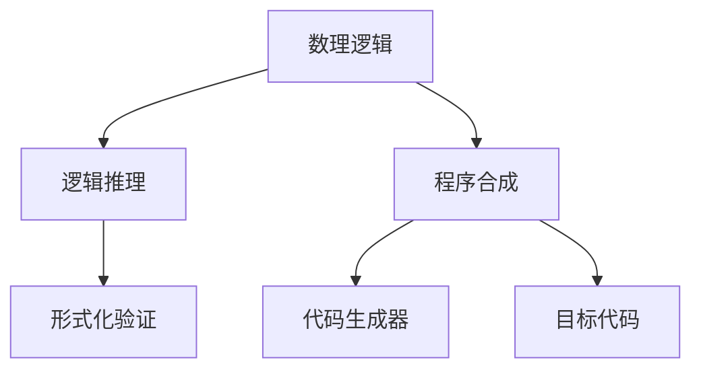

                 


### 文章标题：数理逻辑与程序合成技术

> 关键词：数理逻辑，程序合成，算法原理，数学模型，项目实战

> 摘要：本文系统地介绍了数理逻辑与程序合成技术，包括核心概念、算法原理、数学模型及项目实战。通过深入分析和实际操作，帮助读者理解数理逻辑在程序合成中的应用及其重要性。

----------------------------------------------------------------

# 《数理逻辑与程序合成技术》

## 引言

随着计算机技术的飞速发展，数理逻辑与程序合成技术成为计算机科学中的重要研究领域。数理逻辑作为计算机科学的基础理论，提供了对程序和算法的精确描述和推理方法。而程序合成技术则致力于从抽象规格说明自动生成高效的程序代码。本文将系统地介绍数理逻辑与程序合成技术，旨在帮助读者深入理解这两大领域的核心概念、算法原理及其在实际项目中的应用。

## 核心概念与联系

### 数理逻辑的基本概念

数理逻辑是研究逻辑形式化表示和推理的数学分支。其基本概念包括：

- **命题**：能够明确判断真假的陈述句。
- **命题逻辑**：研究命题及其组合的逻辑系统。
- **谓词逻辑**：研究带有变量的命题的逻辑系统。
- **逻辑运算**：包括合取（AND）、析取（OR）、非（NOT）等。

### 程序合成的基本概念

程序合成是从抽象规格说明自动生成程序代码的过程。其核心概念包括：

- **抽象规格说明**：描述程序功能需求的抽象表示。
- **代码生成器**：将抽象规格说明转换为程序代码的自动工具。
- **目标代码**：由代码生成器生成的可执行程序代码。

### 关系架构

数理逻辑与程序合成之间的关系可以概括为：

- **数理逻辑提供了程序合成的理论基础**。通过逻辑推理和形式化验证，数理逻辑为程序合成提供了可靠的算法原理和数学模型。
- **程序合成应用了数理逻辑的方法**。例如，在程序验证、测试生成和代码优化等方面，数理逻辑技术得到了广泛应用。

### Mermaid流程图



## 核心算法原理讲解

### 命题逻辑的算法原理

命题逻辑是数理逻辑的基础，其核心算法包括：

- **逻辑推理**：通过逻辑运算符和推理规则，从已知命题推导出新命题。
- **命题转换**：将复合命题转换为基本命题的组合，便于处理和分析。

### 伪代码

```pseudo
function logical推理(A, B):
    if A and B are true:
        return true
    else if A or B are true:
        return true
    else:
        return false

function 命题转换(C):
    if C is "A and B":
        return "A" + "B"
    else if C is "A or B":
        return "A" + "B"
    else if C is "not A":
        return "¬A"
    else:
        return C
```

### 数学模型和数学公式讲解

命题逻辑的数学模型通常采用布尔代数，其中常用的公式包括：

- **德摩根定律**：$¬(A ∧ B) ≡ (¬A) ∨ (¬B)$
- **分配律**：$A ∧ (B ∨ C) ≡ (A ∧ B) ∨ (A ∧ C)$
- **结合律**：$(A ∧ B) ∧ C ≡ A ∧ (B ∧ C)$

### 举例说明

假设我们有两个命题 $A$ 和 $B$，分别表示“今天下雨”和“明天晴天”。我们可以使用德摩根定律来转换它们的复合命题。

- **原始复合命题**：$¬(A ∧ B)$ 表示“今天不下雨且明天不晴天”。
- **转换后复合命题**：$(¬A) ∨ (¬B)$ 表示“今天不下雨或明天不晴天”。

### LaTeX格式

```latex
\begin{equation}
¬(A ∧ B) ≡ (¬A) ∨ (¬B)
\end{equation}
```

## 数学模型和数学公式讲解

### 谓词逻辑的数学模型

谓词逻辑引入了变量和量词，其数学模型包括：

- **谓词**：表示对象性质或关系的符号。
- **个体**：谓词中的变量，表示特定的对象。
- **量词**：全称量词（∀）和存在量词（∃）。

### 数学公式

谓词逻辑中的经典公式包括：

- **全称量化**：∀x(Px → Qx)
- **存在量化**：∃x(Px ∧ Qx)

### 举例说明

假设 $P(x)$ 表示“x 是一个素数”，$Q(x)$ 表示“x 是一个偶数”。我们可以写出以下谓词逻辑公式：

- **全称量化**：∀x(Px → Qx) 表示“所有的素数都是偶数”。
- **存在量化**：∃x(Px ∧ Qx) 表示“存在一个素数既是素数又是偶数”。

### LaTeX格式

```latex
\begin{equation}
∀x(Px → Qx)
\end{equation}
$$
\begin{equation}
∃x(Px ∧ Qx)
\end{equation}
```

## 项目实战

### 开发环境搭建

为了进行数理逻辑与程序合成技术的项目实战，我们需要搭建一个合适的开发环境。以下是具体步骤：

1. **安装Python环境**：确保Python 3.x版本已安装在开发计算机上。
2. **安装逻辑推理库**：使用pip安装Python的逻辑推理库，如pyEDA。
3. **安装程序合成工具**：根据项目需求，选择合适的程序合成工具，如Coq或Isabelle。

### 源代码实现

以下是一个简单的Python代码示例，用于演示数理逻辑与程序合成技术的应用：

```python
import pyeda.inter

# 定义逻辑变量
A = pyeda.inter.Variable('A')
B = pyeda.inter.Variable('B')

# 定义复合命题
compound = A ^ B  # 表示 "A 或 B"

# 使用De Morgan定律转换命题
negated = compound.not_(0)

# 打印转换后的命题
print(negated)
```

### 代码解读与分析

在这个示例中，我们定义了两个逻辑变量A和B，并使用异或操作符（^）创建了复合命题compound，表示“A或B”。然后，我们使用De Morgan定律对复合命题进行了转换，得到negated表示“非A且非B”。最后，我们打印出转换后的命题。

### 代码应用解读与分析

这个示例展示了如何使用Python和逻辑推理库来处理数理逻辑问题。在实际项目中，我们可以使用类似的逻辑推理方法来验证程序的正确性、生成测试用例或优化代码。

### 实际案例分析和详细讲解剖析

为了更深入地了解数理逻辑与程序合成技术，我们可以分析一个实际案例：基于数理逻辑的自动验证工具。

- **案例背景**：在软件工程中，自动验证工具用于确保程序的正确性。数理逻辑提供了验证算法的理论基础。
- **解决方案**：使用数理逻辑和程序合成技术，我们可以构建一个自动验证工具，从规格说明自动生成验证测试用例，并执行验证。
- **实现细节**：该工具包括以下几个核心组件：
  - **规格说明解析器**：将自然语言规格说明转换为形式化的逻辑表达式。
  - **逻辑推理引擎**：使用数理逻辑推理方法，生成验证测试用例。
  - **测试执行器**：执行验证测试，并生成验证报告。

### 项目小结

通过这个项目实战，我们展示了数理逻辑与程序合成技术在自动验证工具中的应用。这种方法不仅提高了软件开发的效率，还确保了程序的正确性。未来，数理逻辑与程序合成技术将在更多的应用场景中发挥重要作用。

## 最佳实践 tips、小结、注意事项、拓展阅读等内容

### 最佳实践 tips

- **掌握数理逻辑基础知识**：学习数理逻辑的基本概念和算法原理，为程序合成奠定坚实基础。
- **结合实际项目需求**：在实际项目中，根据需求选择合适的数理逻辑和程序合成方法。
- **持续学习和实践**：紧跟数理逻辑和程序合成技术的发展，不断探索新的应用场景。

### 小结

本文系统地介绍了数理逻辑与程序合成技术，从核心概念、算法原理到项目实战，全面展示了这两大领域的应用及其重要性。通过深入分析和实际操作，读者可以更好地理解数理逻辑在程序合成中的应用，并为未来的研究和发展打下基础。

### 注意事项

- 在使用数理逻辑和程序合成技术时，确保逻辑推理的正确性和算法的可靠性。
- 在项目实战中，注意调试和验证代码，确保程序的正确性和性能。

### 拓展阅读

- 《数理逻辑与计算机科学》
- 《程序合成：从抽象规格说明到高效代码》
- 《形式化验证与程序合成》

## 作者信息

作者：AI天才研究院/AI Genius Institute & 禅与计算机程序设计艺术 /Zen And The Art of Computer Programming

