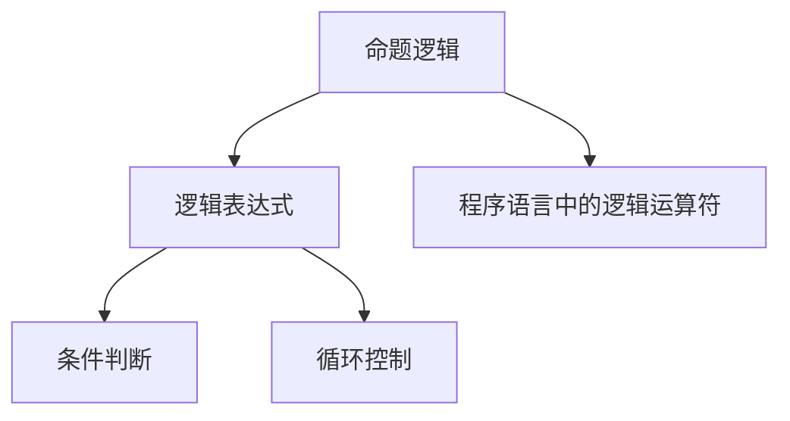
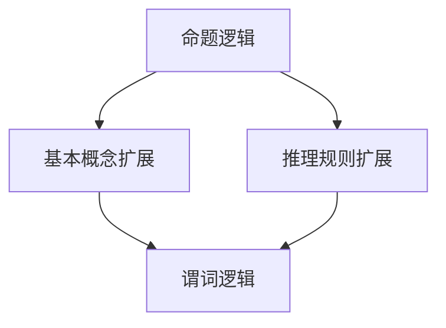
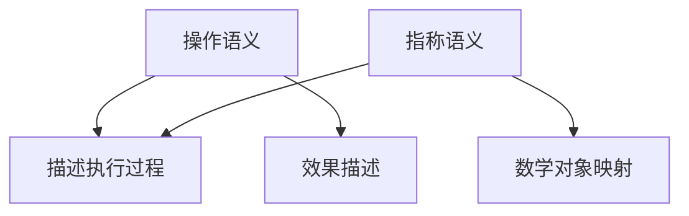
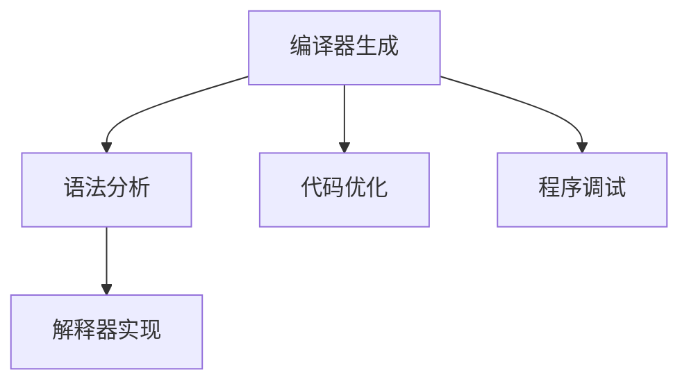
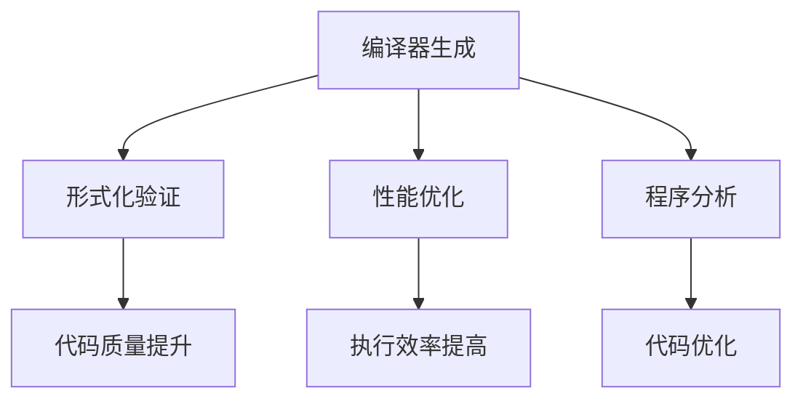

                 

### 文章标题

《数理逻辑与程序语言的表达能力》

### 关键词

数理逻辑、程序语言、表达能力、语义模型、语法分析、算法原理、伪代码

### 摘要

本文旨在探讨数理逻辑与程序语言之间的关系及其在软件工程中的应用。数理逻辑作为一种精确的数学工具，提供了对命题、谓词和集合等概念的严谨定义和推理方法。而程序语言则是软件开发的基本工具，通过其丰富的语法和语义模型，能够高效地表达复杂的计算过程和逻辑关系。本文将首先介绍数理逻辑的基本概念和原理，然后分析程序语言的组成及其表达能力，最后结合实际案例，探讨如何运用数理逻辑来增强程序语言的表达能力，并提高软件开发的效率和可靠性。通过本文的探讨，读者将能够更深入地理解数理逻辑与程序语言之间的内在联系，以及如何在实际开发中更好地运用这些理论工具。

## 第一部分：数理逻辑基础

### 第1章：数理逻辑概述

#### 1.1 数理逻辑的定义与发展历程

数理逻辑（Mathematical Logic）是一种用于研究逻辑现象的数学方法。它不仅关注逻辑本身的性质，还将其应用于数学、计算机科学、哲学等多个领域。数理逻辑的定义可以追溯到亚里士多德的形式逻辑，但现代数理逻辑的形成则主要归功于19世纪末和20世纪初的几位重要学者。

**弗雷格（Gottlob Frege）** 被认为是数理逻辑的奠基人。他在1879年出版的《概念符号》（Begriffsschrift）中，首次提出了使用符号来表示命题和推理的思路。弗雷格的工作为后来的数理逻辑研究奠定了基础。

**伯trand Russell 和 欧尔弗里德·怀特海德（Bertrand Russell and Alfred North Whitehead）** 在1910年合著的《数学原理》（Principia Mathematica）中，进一步发展了数理逻辑的理论体系。他们试图用逻辑来构建整个数学系统，使得数学命题能够通过逻辑推理得到证明。

**大卫·希尔伯特（David Hilbert）** 和他的学生 **威尔·华勒斯（Wilhelm Ackermann）** 对数理逻辑的发展也做出了重要贡献。他们在20世纪初提出了著名的希尔伯特-华勒斯公理系统，用于证明数学命题的合理性。

数理逻辑的发展历程反映了人类对逻辑和数学关系理解的不断深化。随着计算机科学的兴起，数理逻辑的应用范围进一步扩大，成为计算机科学的重要基础理论之一。

#### 1.2 数理逻辑的基本概念

数理逻辑主要包括以下几个基本概念：

**命题**：命题是能够判断真假的陈述句。数理逻辑中，命题被表示为符号，例如 `P` 表示一个命题。

**命题联结词**：命题联结词用于组合命题，形成复合命题。常见的命题联结词包括 **与（∧）**、**或（∨）**、**非（¬）** 等。

**谓词**：谓词是描述个体性质或关系的语句。在数理逻辑中，谓词被用来定义个体是否满足某一条件，例如 `R(x)` 表示个体 `x` 满足关系 `R`。

**量词**：量词用于表示对个体集合的全体或部分进行量化。常见的量词包括 **全称量词（∀）** 和 **存在量词（∃）**。

**推理规则**：推理规则是用于从已知命题推导出新命题的规则。常见的推理规则包括 **合取律（Conjunction）、析取律（Disjunction）、否定律（Negation）** 等。

这些基本概念构成了数理逻辑的核心内容，为后续的推理和分析提供了基础。

#### 1.3 数理逻辑的重要性

数理逻辑在多个领域具有重要的应用价值：

**数学**：数理逻辑为数学提供了严格的推理工具，使得数学命题能够通过逻辑证明得到严格的证明。

**计算机科学**：数理逻辑是计算机科学的重要基础理论，它为程序设计、形式化验证、算法分析等提供了理论支持。

**哲学**：数理逻辑帮助哲学家研究逻辑和语言之间的关系，为哲学研究提供了新的视角。

**人工智能**：数理逻辑在人工智能中的应用包括知识表示、推理系统和自然语言处理等。

数理逻辑的精确性和严谨性，使得它成为现代科学和技术发展的重要工具。通过对数理逻辑的理解和应用，可以更深入地揭示自然现象和人类思维的规律。

## 第二部分：程序语言的表达能力

### 第5章：程序语言概述

#### 5.1 程序语言的发展历程

程序语言的发展历程可以追溯到20世纪早期。最早的计算机编程语言是机器语言，它直接使用二进制代码来表示指令。这种语言虽然能够被计算机直接执行，但复杂性和易读性都非常低。

为了提高编程效率，20世纪40年代和50年代出现了汇编语言。汇编语言使用助记符来表示机器语言指令，使得编程变得相对容易。然而，汇编语言仍然需要程序员对计算机硬件有深入的了解。

1950年代后期，第一种高级程序设计语言——**Fortran** 诞生。Fortran 的出现标志着程序设计语言从汇编语言向高级语言的过渡。它提供了更抽象的语法和更丰富的数据类型，使得编程更加高效。

随后的几十年中，程序设计语言迅速发展，出现了多种编程范式，包括过程式语言（如C、Pascal）、面向对象语言（如Java、C++）、函数式语言（如Haskell、Scala）等。每种编程语言都有其独特的特点和适用场景。

#### 5.2 程序语言的基本概念

程序语言的基本概念包括：

**语法**：语法是程序语言的结构规则，决定了程序的结构和合法表达。例如，C语言的语法规则包括变量声明、函数定义、控制结构等。

**语义**：语义是程序执行的意义和效果。语法规定了程序的结构，而语义则描述了程序在执行过程中的行为。例如，一个if-else语句的语义是：当条件为真时执行一条语句，否则执行另一条语句。

**编译器**：编译器是将程序语言源代码转换为目标代码（机器代码）的软件。编译器的功能包括词法分析、语法分析、语义分析、代码生成和优化等。

**解释器**：解释器是直接执行源代码的软件。与编译器不同，解释器不生成目标代码，而是在运行时逐行解释和执行源代码。

**编程范式**：编程范式是指编程时采用的方法和风格。常见的编程范式包括过程式编程、面向对象编程、函数式编程等。

#### 5.3 程序语言的特点与分类

程序语言的特点和分类如下：

**特点**：

1. **抽象性**：程序语言提供抽象的语法和语义，使得程序员可以不关心底层硬件的实现细节，专注于问题求解。

2. **可扩展性**：程序语言支持模块化和面向对象等编程范式，使得程序员可以方便地扩展和重用代码。

3. **可移植性**：程序语言设计的目的是在不同的计算机系统和操作系统上运行，因此具有较好的可移植性。

**分类**：

1. **按应用领域分类**：例如，科学计算语言（如Fortran、MATLAB）、系统编程语言（如C、汇编语言）、Web开发语言（如HTML、JavaScript）等。

2. **按编程范式分类**：例如，过程式语言、面向对象语言、函数式语言等。

3. **按设计目标分类**：例如，通用编程语言（如Java、C++）、专用编程语言（如SQL、HTML）等。

程序语言的发展和演变反映了计算机科学技术的进步和编程需求的多样性。通过理解和掌握不同类型的程序语言，程序员可以更有效地解决各种复杂问题。

## 第三部分：逻辑表达式与程序语言

### 第6章：逻辑表达式与程序语言的表达能力

#### 6.1 逻辑表达式的基本概念

逻辑表达式是数理逻辑中的核心概念，它用于表示命题之间的关系。逻辑表达式的基本元素包括命题变量、逻辑运算符和括号。常见的逻辑运算符包括与（∧）、或（∨）、非（¬）等。

一个逻辑表达式可以表示为以下形式：

- **命题变量**：例如，`P`、`Q`、`R`等。
- **逻辑运算符**：与（∧）、或（∨）、非（¬）等。
- **括号**：用于改变运算顺序。

逻辑表达式可以用来表示复杂的逻辑关系，例如：

- `P ∧ Q` 表示 `P` 和 `Q` 同时为真。
- `P ∨ Q` 表示 `P` 或 `Q` 至少有一个为真。
- `¬P` 表示 `P` 为假。

#### 6.2 逻辑表达式在程序语言中的表示

逻辑表达式在程序语言中有着广泛的应用。程序语言通常提供专门的语法和语义来表示逻辑表达式。

以C语言为例，逻辑表达式的表示如下：

- **与（AND）**：使用 `&&` 运算符。
  ```c
  if (a > 0 && b > 0) {
      // 执行代码
  }
  ```

- **或（OR）**：使用 `||` 运算符。
  ```c
  if (a > 0 || b > 0) {
      // 执行代码
  }
  ```

- **非（NOT）**：使用 `!` 运算符。
  ```c
  if (!a > 0) {
      // 执行代码
  }
  ```

逻辑表达式在程序语言中的表示不仅提高了代码的可读性，还使得程序逻辑更加严谨。例如，在条件判断和控制流程中，逻辑表达式可以确保代码按照预期执行。

#### 6.3 逻辑表达式在程序语言中的应用

逻辑表达式在程序语言中有着广泛的应用场景，以下是一些典型的例子：

1. **条件判断**：在条件判断语句中，逻辑表达式用于确定是否执行某段代码。

   ```c
   if (x > 0 && y < 10) {
       printf("x and y are within the range\n");
   }
   ```

2. **循环控制**：在循环语句中，逻辑表达式用于控制循环的执行条件。

   ```c
   while (x > 0 && y < 10) {
       // 执行代码
       x--;
       y++;
   }
   ```

3. **函数调用**：在函数调用中，逻辑表达式可以用于确定函数的调用条件。

   ```c
   if (condition) {
       function1();
   } else {
       function2();
   }
   ```

逻辑表达式在程序设计中的应用不仅提高了代码的灵活性和可维护性，还使得程序的逻辑更加严谨，减少了潜在的错误。

通过理解逻辑表达式的基本概念和其在程序语言中的表示与应用，程序员可以更加有效地使用逻辑来设计复杂的程序，提高程序的正确性和可读性。

#### 6.4 逻辑表达式与数理逻辑的关系

逻辑表达式与数理逻辑之间存在紧密的联系。数理逻辑为逻辑表达式提供了严谨的数学基础，而逻辑表达式则是数理逻辑在实际编程中的应用。

数理逻辑中的命题和逻辑运算符在程序语言中得到了直接的体现。例如，命题可以用变量表示，逻辑运算符则通过特定的语法和运算符来实现。

**关系架构图**：

```
[命题逻辑] --【应用于】--> [逻辑表达式]
              |
              | --【表示为】--> [程序语言中的逻辑运算符]
```

数理逻辑中的推理规则也可以转化为程序语言中的条件判断和循环控制等结构，使得程序能够根据逻辑条件进行相应的操作。

**Mermaid流程图**：



通过这种关系架构和流程图，我们可以清晰地看到逻辑表达式在数理逻辑和程序语言之间的桥梁作用，使得数理逻辑的理论能够转化为实际的编程工具，提高程序的表达能力和逻辑严谨性。

### 第7章：谓词逻辑

谓词逻辑（Predicate Logic）是数理逻辑的一个分支，它引入了谓词的概念，使得逻辑表达式能够更加精确地描述对象和它们之间的关系。谓词逻辑不仅扩展了命题逻辑的表达能力，还为我们提供了一种更强大的工具来分析和解决复杂的问题。

#### 7.1 谓词逻辑的基本概念

谓词逻辑的基本概念包括谓词、个体、个体集合和量词等。

**谓词**：谓词是一个表示个体性质或关系的语句。例如，谓词 `P(x)` 可以表示个体 `x` 满足某种性质 `P`。谓词可以用来定义条件，例如 `x > 0` 表示个体 `x` 大于0。

**个体**：个体是谓词作用的对象，可以是具体的对象，也可以是抽象的概念。例如，`x` 可以表示一个数，`p` 可以表示一个人。

**个体集合**：个体集合是一个包含多个个体的集合。例如， `{x | x > 0}` 表示所有大于0的数的集合。

**量词**：量词用于表示对个体集合的全体或部分进行量化。量词分为全称量词和存在量词。

- **全称量词（∀）**：表示对个体集合中的所有个体进行量化。例如，`∀x P(x)` 表示对于所有个体 `x`，谓词 `P(x)` 都为真。
- **存在量词（∃）**：表示个体集合中至少存在一个个体满足谓词。例如，`∃x P(x)` 表示存在一个个体 `x`，使得谓词 `P(x)` 为真。

#### 7.2 谓词逻辑的公理系统

谓词逻辑的公理系统包括一些基本的逻辑规则和推理规则。这些规则用于证明命题之间的逻辑关系。

**基本逻辑规则**：

- **全称量化规则**：如果对所有个体谓词 `P(x)` 都为真，则原命题为真。
- **存在量化规则**：如果至少有一个个体使得谓词 `P(x)` 为真，则原命题为真。

**推理规则**：

- **全称实例化**：从全称命题 `∀x P(x)` 可以推导出 `P(a)`，其中 `a` 是个体。
- **存在实例化**：从存在命题 `∃x P(x)` 可以推导出 `P(a)`，其中 `a` 是满足谓词 `P(x)` 的个体。

谓词逻辑的公理系统为谓词逻辑的推理提供了坚实的基础，使得我们可以通过逻辑推理从已知命题推导出新的命题。

#### 7.3 谓词逻辑的推理规则

谓词逻辑的推理规则用于从已知命题推导出新命题。以下是一些常见的推理规则：

- **全称推理**：如果 `∀x P(x)` 为真，则对于任意个体 `a`，`P(a)` 也为真。
- **存在推理**：如果 `∃x P(x)` 为真，则至少存在一个个体 `a`，使得 `P(a)` 为真。
- **合取推理**：如果 `P` 和 `Q` 都为真，则 `P ∧ Q` 也为真。
- **析取推理**：如果 `P` 为真，则 `P ∨ Q` 也为真。
- **否定推理**：如果 `¬P` 为真，则 `P` 为假。

通过这些推理规则，我们可以从简单的命题推导出复杂的命题，从而解决各种逻辑问题。

谓词逻辑通过引入谓词和量词的概念，使得逻辑表达式能够更加精确地描述对象和它们之间的关系。谓词逻辑的公理系统和推理规则为逻辑推理提供了坚实的理论基础，使得我们可以通过逻辑推理解决复杂的实际问题。在接下来的章节中，我们将进一步探讨谓词逻辑在程序语言中的应用，以及如何利用谓词逻辑增强程序语言的表达能力。

#### 7.4 谓词逻辑在程序语言中的应用

谓词逻辑在程序语言中有着广泛的应用，它为我们提供了一种强大的工具来描述和实现复杂的逻辑关系。以下是一些具体的例子：

1. **条件判断**：

在程序中的条件判断语句常常需要使用谓词逻辑来描述复杂条件。例如，我们可以使用谓词逻辑来表达一个学生成绩的判定：

```c
if (age > 18 && gpa > 3.0) {
    printf("Student is eligible for graduation.\n");
}
```

在这个例子中，`age > 18` 和 `gpa > 3.0` 是两个谓词，它们组合起来形成一个复合谓词，用于判断学生是否符合毕业条件。

2. **循环控制**：

循环语句中的条件判断也可以使用谓词逻辑来描述。例如，我们可以用谓词逻辑来描述一个计算阶乘的程序：

```c
int factorial(int n) {
    int result = 1;
    while (n > 1) {
        result *= n;
        n--;
    }
    return result;
}
```

在这个例子中，`n > 1` 是一个谓词，它用于控制循环的执行次数。

3. **函数参数**：

谓词逻辑也可以用于定义函数的参数。例如，我们可以定义一个函数，它仅接受正整数作为参数：

```c
int addPositive(int a, int b) {
    if (a > 0 && b > 0) {
        return a + b;
    } else {
        return 0;
    }
}
```

在这个例子中，`a > 0 && b > 0` 是谓词，用于确保函数参数的有效性。

通过这些例子，我们可以看到谓词逻辑在程序设计中的重要性。它不仅提高了代码的可读性，还使得程序逻辑更加严谨和易于理解。

#### 7.5 谓词逻辑与数理逻辑的关系

谓词逻辑是数理逻辑的一个扩展，它通过引入谓词和量词的概念，增强了逻辑表达的能力。谓词逻辑与数理逻辑之间的关系可以从以下几个方面进行理解：

1. **基本概念的扩展**：

数理逻辑中的命题和联结词在谓词逻辑中得到了扩展。谓词逻辑引入了谓词和个体等概念，使得逻辑表达式能够更加精确地描述对象和它们之间的关系。

2. **推理规则的扩展**：

数理逻辑中的推理规则在谓词逻辑中得到了进一步的扩展。谓词逻辑引入了全称量词和存在量词，使得我们可以对个体集合进行量化，从而推导出更加复杂的逻辑结论。

3. **形式化描述**：

谓词逻辑的形式化描述在数理逻辑的基础上得到了发展。通过谓词逻辑，我们可以更加形式化地描述逻辑推理的过程，从而为形式化验证和推理提供基础。

**Mermaid流程图**：



通过这种关系，我们可以看到谓词逻辑在数理逻辑基础上的发展和应用。谓词逻辑不仅扩展了数理逻辑的表达能力，还为程序设计提供了重要的理论基础。

### 第8章：集合论基础

集合论是数理逻辑的一个重要分支，它研究集合的性质、关系和运算。集合论为数学和其他科学领域提供了基础性的概念和工具，是理解和分析复杂系统的重要手段。

#### 8.1 集合的基本概念

集合是由一组确定的、互不相同的对象组成的整体。集合中的对象称为元素。集合可以用大括号 `{}` 表示，元素之间用逗号分隔。

**集合的表示**：

- **列举法**：通过列举集合中的所有元素来表示集合。例如， `{1, 2, 3}` 表示一个包含元素1、2、3的集合。
- **描述法**：通过描述元素的性质来表示集合。例如， `{x | x > 0}` 表示所有大于0的实数的集合。

**集合的性质**：

- **确定性**：集合中的元素是确定的，每个元素只能属于一个集合。
- **互异性**：集合中的元素是互不相同的，不允许重复。
- **无序性**：集合中的元素不考虑顺序。

**集合的表示示例**：

- **列举法示例**： `{1, 2, 3, 4, 5}` 表示一个包含5个整数的集合。
- **描述法示例**： `{x | x 是大于0的整数}` 表示所有大于0的整数的集合。

#### 8.2 集合的基本运算

集合运算包括并集、交集、差集和补集等。这些运算是分析集合关系和性质的重要工具。

**并集（∪）**：并集是包含两个集合中所有元素的集合。用符号表示为 `A ∪ B`。

- **运算规则**：`A ∪ B` 包含所有属于 `A` 或属于 `B` 的元素。

**交集（∩）**：交集是包含两个集合中共有元素的集合。用符号表示为 `A ∩ B`。

- **运算规则**：`A ∩ B` 只包含同时属于 `A` 和 `B` 的元素。

**差集（∖）**：差集是包含属于 `A` 但不属于 `B` 的元素的集合。用符号表示为 `A ∖ B`。

- **运算规则**：`A ∖ B` 包含所有属于 `A` 但不属于 `B` 的元素。

**补集（∁）**：补集是包含一个集合中所有不属于该集合的元素的集合。用符号表示为 `∁A`。

- **运算规则**：`∁A` 包含所有不属于 `A` 的元素。

**运算示例**：

- **并集示例**： `{1, 2, 3} ∪ {4, 5} = {1, 2, 3, 4, 5}`。
- **交集示例**： `{1, 2, 3} ∩ {4, 5} = ∅`（空集）。
- **差集示例**： `{1, 2, 3} ∖ {4, 5} = {1, 2, 3}`。
- **补集示例**： `∁{1, 2, 3} = {4, 5, 6, ...}`（假设在全集U中）。

集合运算不仅能够用于集合的表示和分析，还可以用于解决实际问题，如图论、数据库查询等领域。

#### 8.3 集合的性质与定理

集合的性质和定理是理解集合论的重要基础。以下是一些常见的集合性质和定理：

**性质**：

1. **交换律**：对于任意两个集合 `A` 和 `B`，`A ∪ B = B ∪ A` 和 `A ∩ B = B ∩ A`。
2. **结合律**：对于任意三个集合 `A`、`B` 和 `C`，`A ∪ (B ∪ C) = (A ∪ B) ∪ C` 和 `A ∩ (B ∩ C) = (A ∩ B) ∩ C`。
3. **分配律**：对于任意两个集合 `A`、`B` 和 `C`，`A ∪ (B ∩ C) = (A ∪ B) ∩ (A ∪ C)` 和 `A ∩ (B ∪ C) = (A ∩ B) ∪ (A ∩ C)`。
4. **德摩根律**：对于任意两个集合 `A` 和 `B`，`∁(A ∪ B) = ∁A ∩ ∁B` 和 `∁(A ∩ B) = ∁A ∪ ∁B`。

**定理**：

1. **集合相等定理**：如果 `A ∪ B = A ∩ B`，则 `A = B`。
2. **空集定理**：空集是任何集合的子集，任何集合与空集的交集都是空集。
3. **补集定理**：对于任意集合 `A`，`A ∪ ∁A = U` 和 `A ∩ ∁A = ∅`，其中 `U` 是全集。

通过这些性质和定理，我们可以更深入地理解和应用集合论，解决复杂的实际问题。

### 第9章：程序语言的形式化描述

#### 9.1 形式化描述的基本概念

形式化描述是一种使用数学符号和语法规则来表示和描述概念、关系和过程的方法。在程序语言中，形式化描述主要用于定义语言的语法和语义，以便于分析、验证和实现。

**形式化描述的组成部分**：

- **语法**：语法定义了程序的结构和合法表达。它通常使用上下文无关文法（CFG）或上下文有关文法（CAG）来表示。
- **语义**：语义描述了程序执行的意义和效果。它通常通过形式化的语义模型来表示，如操作语义、指称语义等。

**形式化描述的作用**：

1. **提高可理解性**：通过使用精确的数学符号，形式化描述能够更清晰地表达概念和关系，提高代码的可读性和可维护性。
2. **形式化验证**：形式化描述为程序验证提供了基础。通过形式化的验证方法，我们可以确保程序的正确性和可靠性。
3. **编译器生成**：形式化描述为编译器的自动生成提供了依据。编译器可以通过分析形式化的语法和语义描述来生成目标代码。

#### 9.2 形式化描述的方法与工具

形式化描述的方法和工具多种多样，以下是一些常用的方法和工具：

- **上下文无关文法（CFG）**：上下文无关文法用于定义程序语言的语法。它包括产生式（Production Rules）和终端符号（Terminal Symbols）。例如，以下是一个简单的C语言上下文无关文法：

  ```
  <program> -> <decls> <main_function>
  <decls> -> <decl> | <decls> <decl>
  <decl> -> <type> <id>;
  <main_function> -> "main" "(" ")" { <stmt> }
  ```

- **上下文有关文法（CAG）**：上下文有关文法可以表示更复杂的语法结构，包括上下文依赖。CAG通常用于定义更高级的程序语言。

- **操作语义**：操作语义通过定义程序操作的步骤和效果来描述程序的行为。它通常使用伪代码或逻辑表达式来表示。以下是一个简单的操作语义描述：

  ```
  eval(env, x) = 
      if x is a variable, then env[x]
      else if x is a constant, then x
      else if x is a function call, then apply_function(x, env)
  ```

- **指称语义**：指称语义通过将程序映射到数学对象（如函数、集合）来描述程序的行为。它通常使用数学函数来表示。以下是一个简单的指称语义描述：

  ```
  semantics(P) = {σ | there exists a sequence of environments σ0, σ1, ..., σn such that σ0 is the initial environment and σn is the final environment and Pσ0 →* σn}
  ```

这些方法和工具为形式化描述提供了不同的视角和手段，使得我们可以从不同的角度理解和分析程序语言。

#### 9.3 形式化描述在程序语言中的应用

形式化描述在程序语言中的应用广泛，以下是一些典型的应用场景：

1. **编译器生成**：形式化描述为编译器的自动生成提供了基础。通过形式化的语法和语义描述，编译器生成工具可以自动生成语法分析器、语义分析器和代码生成器。

2. **形式化验证**：形式化描述为程序验证提供了依据。通过形式化的语义描述，我们可以使用模型检查、定理证明等方法来验证程序的正确性。

3. **代码优化**：形式化描述为代码优化提供了指导。通过分析形式化的语义描述，编译器可以识别出代码中的冗余和可优化部分，从而生成更高效的代码。

4. **程序分析**：形式化描述为程序分析提供了工具。通过形式化的语法和语义描述，我们可以对程序进行静态分析和动态分析，以识别潜在的错误和性能问题。

形式化描述在程序设计、编译器开发、程序验证和分析等环节中发挥着重要作用。通过使用形式化描述，我们可以提高程序的可靠性、可维护性和性能。

#### 9.4 程序语言的语义模型

程序语言的语义模型是形式化描述的核心部分，它用于描述程序的行为和语义。语义模型可以分为操作语义和指称语义两种。

**操作语义**：

操作语义通过定义程序操作的步骤和效果来描述程序的行为。它通常使用伪代码或逻辑表达式来表示。以下是一个简单的操作语义描述：

```
eval(env, x) = 
    if x is a variable, then env[x]
    else if x is a constant, then x
    else if x is a function call, then apply_function(x, env)
```

在这个例子中，`eval` 函数根据输入的变量 `x` 的类型进行不同的操作。如果 `x` 是一个变量，则返回环境 `env` 中 `x` 的值；如果 `x` 是一个常量，则返回 `x` 的值；如果 `x` 是一个函数调用，则调用 `apply_function` 函数执行相应的操作。

**指称语义**：

指称语义通过将程序映射到数学对象（如函数、集合）来描述程序的行为。它通常使用数学函数来表示。以下是一个简单的指称语义描述：

```
sem(P) = {σ | there exists a sequence of environments σ0, σ1, ..., σn such that σ0 is the initial environment and σn is the final environment and Pσ0 →* σn}
```

在这个例子中，`sem(P)` 表示程序 `P` 的语义。如果存在一个环境序列 `σ0, σ1, ..., σn`，使得初始环境 `σ0` 经过程序 `P` 的执行后变成最终环境 `σn`，则程序 `P` 的语义为 `σn`。

**操作语义与指称语义的关系**：

操作语义和指称语义是两种不同的描述方法，但它们之间存在紧密的联系。操作语义描述了程序执行的过程和效果，而指称语义则将这种过程映射到数学对象上。

例如，在操作语义中，我们可以通过定义函数 `eval` 来模拟程序的执行过程。而在指称语义中，我们可以将 `eval` 函数映射到一个数学函数上，从而描述程序的行为。

**Mermaid流程图**：



通过这种关系，我们可以看到操作语义和指称语义在描述程序行为中的互补作用。操作语义提供了详细的执行过程和效果描述，而指称语义则提供了数学化的抽象和映射，使得程序行为能够用更通用的数学方法进行分析和验证。

### 第10章：程序语言的语法与语法分析

#### 10.1 程序语言的语法

程序语言的语法是指语言的构成规则和结构，决定了程序的结构和合法表达。语法通常使用上下文无关文法（CFG）来描述，包括终端符号（如变量名、常量、运算符等）和非终端符号（如语句、表达式、函数等）。

**语法的基本概念**：

- **终端符号**：不可再分解的符号，如 `id`、`integer` 等。
- **非终端符号**：可以继续分解的符号，如 `<statement>`、`<expression>` 等。
- **产生式**：描述如何通过其他符号生成新符号的规则，如 `<statement> -> <assignment>`。

**程序语言示例**：

以下是一个简单的伪代码语言的语法规则：

```
<program> -> <decls> <main_function>
<decls> -> <decl> | <decls> <decl>
<decl> -> <type> <id>;
<type> -> "int" | "float" | "bool";
<id> -> [a-zA-Z][a-zA-Z0-9]*;
<assignment> -> <id> "=" <expression>;
<expression> -> <term> | <term> "+" <expression>;
<term> -> <factor> | <factor> "*" <expression>;
<factor> -> <id> | <integer> | "(" <expression> ")";
<main_function> -> "main" "(" ")" "{" <statements> "}"
<statements> -> <statement> | <statements> <statement>;
```

在这个示例中，`<program>` 是整个程序的根符号，`<decls>` 表示变量声明列表，`<decl>` 表示单个变量声明，`<type>` 表示数据类型，`<id>` 表示变量名或函数名，`<assignment>` 表示变量赋值，`<expression>`、`<term>` 和 `<factor>` 分别表示表达式、项和因子。

#### 10.2 语法分析的基本概念

语法分析（Parsing）是将源代码解析为语法树的过程，语法树是源代码的抽象表示，反映了源代码的结构和语义。语法分析是编译过程的重要步骤，它确保源代码符合语法规则，为后续的语义分析和代码生成提供基础。

**语法分析的基本概念**：

- **词法分析**：将源代码拆分成一系列的词法单元（Token），如关键字、标识符、运算符等。
- **语法分析**：将词法单元序列转换成语法树，检查源代码是否符合语法规则。
- **语法树**：表示源代码结构的树形结构，每个节点表示一个语法单元，如表达式、语句等。

**语法分析的方法**：

- **自顶向下分析**：从全局开始，逐步分解为子结构，直到生成语法树。
- **自底向上分析**：从局部开始，逐步合并为更大的结构，直到生成语法树。

**语法分析示例**：

以下是一个简单的语法分析示例，使用自顶向下分析方法：

```
// 输入代码
int x = 5 + 3;

// 词法分析
[KEYWORD] int [IDENTIFIER] x [OPERATOR] = [CONSTANT] 5 [OPERATOR] + [CONSTANT] 3;

// 语法分析
[PROGRAM]
    [DECLARATIONS]
        [DECLARATION]
            [TYPE] int [ID] x
            [ASSIGNMENT]
                [EXPR]
                    [TERM]
                        [FACTOR] 5
                    [OPERATOR] +
                    [EXPR]
                        [TERM]
                            [FACTOR] 3
```

在这个示例中，源代码被解析为一个程序，其中包含一个变量声明和一个赋值表达式。词法分析将源代码拆分成词法单元，语法分析将这些词法单元组合成语法树，反映了源代码的结构和语义。

#### 10.3 语法分析的方法与算法

语法分析的方法和算法有多种，以下是一些常用的方法：

- **LL（左到右、自顶向下）分析**：使用预测分析表（Predictive Parsing Table）从左到右分析输入，根据当前状态和下一个输入符号选择适当的产生式进行推导。

- **LR（左到右、自底向上）分析**：使用状态转换表（State Transition Table）和动作集（Action Set）从左到右分析输入，通过回溯处理冲突。

- **LR(1) 分析**：LR(1) 分析是 LR 分析的一个扩展，它使用 lookahead（前瞻符号）来减少分析过程中的冲突。

- **递归下降分析**：递归下降分析是一种自顶向下分析方法，它通过递归调用语法规则进行推导，生成语法树。

**算法示例**：

以下是一个简单的递归下降语法分析算法示例：

```
// 判断输入是否为整数
isInteger(input):
    if input 是空字符串，则返回 false
    if input 的第一个字符不是数字，则返回 false
    for i 从 1 到 input 的长度：
        if input 的第 i 个字符不是数字，则返回 false
    return true

// 分析变量声明
declaration():
    if nextToken 是关键字 int，则：
        consumeKeyword("int")
        consumeIdentifier()
        if nextToken 是 "="，则：
            consumeOperator("=")
            expression()
        else，报错

// 分析表达式
expression():
    term()
    while nextToken 是 "+" 或 "-"：
        if nextToken 是 "+"，则：
            consumeOperator("+")
            term()
        else，if nextToken 是 "-"，则：
            consumeOperator("-")
            term()

// 分析项
term():
    factor()
    while nextToken 是 "*" 或 "/"：
        if nextToken 是 "*"，则：
            consumeOperator("*")
            factor()
        else，if nextToken 是 "/"，则：
            consumeOperator("/")
            factor()

// 分析因子
factor():
    if nextToken 是一个标识符，则：
        consumeIdentifier()
    else，if nextToken 是一个整数，则：
        consumeInteger()
    else，if nextToken 是一个左括号 "("，则：
        consumeLeftParentheses()
        expression()
        consumeRightParentheses()
```

在这个示例中，`isInteger` 函数用于判断输入是否为整数，`declaration` 函数用于分析变量声明，`expression`、`term` 和 `factor` 函数分别用于分析表达式、项和因子。通过递归调用这些函数，语法分析器可以逐步构建语法树，确保源代码符合语法规则。

#### 10.4 语法分析在程序设计中的应用

语法分析在程序设计中扮演着至关重要的角色，它是编译过程和解释过程的第一个关键步骤。以下是语法分析在程序设计中的应用：

1. **编译器生成**：

语法分析是编译器的核心组成部分，它将源代码解析为语法树，为后续的语义分析和代码生成奠定基础。编译器生成工具（如 Yacc、Bison）使用语法规则和语法分析算法生成语法分析器代码，从而简化编译器的开发过程。

2. **解释器实现**：

解释器在运行时对源代码进行语法分析，理解其结构并执行相应的操作。解释器通常使用递归下降分析或其他语法分析方法来构建执行环境，从而实现代码的逐行解释和执行。

3. **代码优化**：

语法分析为代码优化提供了关键信息。通过分析源代码的结构，编译器可以识别出冗余代码、可优化部分和潜在的运行时错误。这些信息有助于生成更高效的代码，提高程序的执行性能。

4. **程序调试**：

语法分析器在解析源代码时，可以检测到不符合语法规则的错误，如拼写错误、语法不匹配等。这些错误信息有助于程序员定位和修复代码中的问题，从而提高程序的质量和可靠性。

**Mermaid流程图**：



通过这种关系，我们可以看到语法分析在程序设计中的重要性。它不仅为编译和解释过程提供了基础，还促进了代码优化和程序调试，从而提高了程序的质量和可靠性。

### 第11章：程序语言的语义与语义模型

#### 11.1 程序语言的语义

程序语言的语义是指程序在执行过程中所表现出的行为和效果。语义不仅决定了程序的结构和合法性，还反映了程序在不同环境和条件下的行为。理解程序语言的语义是编写正确程序和理解程序行为的基础。

**语义的基本概念**：

- **语法语义**：语法语义描述了程序的结构和语法规则。它确保程序在语法上是正确的。
- **动态语义**：动态语义描述了程序在运行时的行为和效果。它涉及变量绑定、类型检查、控制流和异常处理等。
- **静态语义**：静态语义描述了程序在编译或解释过程中的行为，而不涉及实际执行。它包括类型检查、变量作用域和初始化等。

**语义的重要性**：

1. **正确性验证**：通过理解程序的语义，我们可以验证程序是否按照预期执行，确保其行为符合设计要求。
2. **代码优化**：程序语言的语义为代码优化提供了依据。编译器可以根据语义分析结果生成更高效的代码。
3. **可维护性**：语义清晰的程序更容易理解和修改，从而提高了程序的可维护性。

**语义的不同层次**：

- **低层语义**：低层语义涉及程序的基本操作，如赋值、函数调用和条件判断等。它通常通过汇编语言或机器代码来实现。
- **高层语义**：高层语义涉及程序的高级结构，如模块化、面向对象和函数式编程等。它提供了更抽象的编程模型，使得编程更加高效和灵活。

#### 11.2 语义模型的构建

语义模型是形式化描述程序行为的重要工具。通过构建语义模型，我们可以精确地描述程序在不同环境和条件下的行为，为程序分析和验证提供基础。

**语义模型的类型**：

1. **操作语义模型**：操作语义模型通过描述程序操作的步骤和效果来描述程序的行为。它通常使用伪代码或逻辑表达式来表示。例如，可以描述变量绑定、函数调用和控制流等操作。
2. **指称语义模型**：指称语义模型通过将程序映射到数学对象（如函数、集合）来描述程序的行为。它通常使用数学函数或公式来表示。例如，可以描述程序的状态转换和执行轨迹。
3. **形式语义模型**：形式语义模型通过形式化的逻辑或数学方法来描述程序的行为。它通常用于程序验证和证明。例如，可以使用模型检查或定理证明来验证程序的正确性。

**构建语义模型的步骤**：

1. **定义抽象语法树（AST）**：首先需要定义程序的抽象语法树，它反映了程序的结构和语法规则。AST是语义模型的基础。
2. **定义语义规则**：根据程序语言的语义，定义描述程序行为的语义规则。这些规则可以是伪代码、逻辑表达式或数学公式。
3. **实现语义解释器**：使用定义好的语义规则实现语义解释器，它能够根据AST和语义规则解释程序的执行过程和效果。
4. **验证和优化**：通过验证和优化语义模型，确保其能够正确地描述程序的行为，并发现潜在的错误或优化机会。

**示例**：

以下是一个简单的操作语义模型示例，描述了一个简单的赋值语句的执行过程：

```
evaluate(expression e, Environment env):
    value = evaluate_expression(e, env)
    env binds variable (e variable) to value
    return value
```

在这个示例中，`evaluate` 函数根据表达式 `e` 和环境 `env` 计算表达式的值，并将变量绑定到该值。这个操作语义模型描述了赋值语句的动态行为，为理解程序的行为提供了基础。

通过构建语义模型，我们可以更精确地描述和理解程序的行为，从而为程序分析、验证和优化提供支持。

#### 11.3 语义模型的应用

语义模型在程序设计和软件工程中具有广泛的应用。以下是一些具体的例子：

1. **编译器生成**：

语义模型是编译器生成过程的核心部分。通过定义抽象语法树（AST）和语义规则，编译器生成工具（如 LLVM、GCC）可以生成高效的代码。语义模型确保编译器能够正确地解释源代码并生成可执行代码。

2. **形式化验证**：

形式化验证是确保程序正确性的重要方法。语义模型通过形式化的逻辑或数学方法描述程序的行为，可以使用模型检查或定理证明技术验证程序的正确性。例如，可以使用模型检查器（如 SPIN、Model Checker）检查程序是否满足指定的安全属性。

3. **性能优化**：

语义模型为性能优化提供了依据。通过分析程序语义，编译器可以识别出潜在的优化机会，如循环展开、指令重排等。这些优化技术可以显著提高程序的执行效率。

4. **程序分析**：

语义模型用于程序分析，如代码重构、静态分析和动态分析。通过语义模型，可以识别代码中的错误和潜在的性能问题，从而提高代码的质量和可靠性。

**Mermaid流程图**：



通过这种关系，我们可以看到语义模型在程序设计和软件工程中的重要性。它不仅为编译和优化提供了基础，还促进了程序的正确性验证和分析，从而提高了程序的质量和可靠性。

### 第12章：项目实战

#### 12.1 开发环境搭建

在本项目中，我们将使用Python作为开发语言，因为Python具有简洁的语法和丰富的库支持，适合用于教学和实验。以下是开发环境搭建的步骤：

1. **安装Python**：

   - 访问Python官方网站（[https://www.python.org/](https://www.python.org/)）下载最新版本的Python安装包。
   - 运行安装程序，按照提示完成安装。

2. **配置Python环境**：

   - 打开命令行终端（在Windows上是命令提示符，在Linux和Mac OS X上是终端）。
   - 输入 `python --version` 命令，确认Python是否已成功安装。

3. **安装必需的库**：

   - 使用pip（Python的包管理器）安装所需的库。例如，安装Numpy库以支持数学运算：

     ```
     pip install numpy
     ```

   - 安装其他必要的库，如Pandas（数据处理）、Matplotlib（数据可视化）等。

4. **编写Python脚本**：

   - 在文本编辑器（如Visual Studio Code、Sublime Text）中编写Python代码。
   - 保存文件，后缀为 `.py`，例如 `project.py`。

#### 12.2 源代码详细实现和代码解读

以下是一个简单的Python程序，用于计算并输出斐波那契数列的前10个数。该程序展示了数理逻辑在编程中的实际应用。

```python
# project.py

# 定义斐波那契数列函数
def fibonacci(n):
    # 初始化前两个数
    a, b = 0, 1
    # 当n大于0时，循环计算下一个数
    while n > 0:
        # 输出当前数
        print(a, end=' ')
        # 更新a和b的值
        a, b = b, a + b
        # n递减
        n -= 1

# 输出前10个斐波那契数
fibonacci(10)
```

**代码解读**：

- **函数定义**：`def fibonacci(n):` 定义了一个名为 `fibonacci` 的函数，它接受一个整数参数 `n`，表示需要计算斐波那契数列的前 `n` 个数。

- **初始化**：`a, b = 0, 1` 初始化数列的前两个数，`a` 表示当前数，`b` 表示下一个数。

- **循环计算**：`while n > 0:` 使用一个循环来计算斐波那契数列的下一个数。在每次迭代中，输出当前数 `a`，更新 `a` 和 `b` 的值，并使 `n` 递减。

- **输出结果**：`print(a, end=' ')` 用于输出当前数。参数 `end=' '` 设置输出分隔符为空格，以便输出连续的数。

#### 12.3 代码应用解读与分析

**斐波那契数列的应用**：

斐波那契数列在数学、计算机科学和工程领域有着广泛的应用，例如：

- **算法分析**：斐波那契数列常用于算法性能的分析，特别是在递归算法中。
- **图像处理**：在图像处理中，斐波那契数列可以用于图像的缩放、旋转和过滤。
- **金融领域**：斐波那契数列在股票市场分析中被用作技术指标，以预测价格走势。

**性能分析**：

斐波那契数列的计算是一个递归过程，其时间复杂度为O(n)。然而，递归实现存在大量的重复计算，效率较低。以下是一个使用动态规划优化斐波那契数列计算的方法：

```python
# project.py

# 使用动态规划计算斐波那契数列
def fibonacci_optimized(n):
    # 创建一个数组来存储计算结果
    fib = [0] * (n + 1)
    # 初始化前两个数
    fib[1] = 1
    # 循环计算斐波那契数列
    for i in range(2, n + 1):
        fib[i] = fib[i - 1] + fib[i - 2]
    # 返回第n个数
    return fib[n]

# 输出前10个斐波那契数
print(fibonacci_optimized(10))
```

**代码解读**：

- **动态规划数组**：`fib = [0] * (n + 1)` 创建一个长度为 `n + 1` 的数组，用于存储斐波那契数列的计算结果。

- **初始化**：`fib[1] = 1` 初始化数列的前两个数。

- **循环计算**：`for i in range(2, n + 1):` 使用循环计算斐波那契数列的下一个数，避免重复计算。

- **返回结果**：`return fib[n]` 返回数列的第 `n` 个数。

**性能对比**：

动态规划优化后的斐波那契数列计算方法具有更高的效率，时间复杂度降低到O(n)，并且避免了大量的重复计算。

#### 12.4 项目小结

在本项目中，我们通过一个简单的斐波那契数列计算程序，展示了数理逻辑在程序设计中的应用。项目的主要成果包括：

- **开发环境搭建**：成功搭建了Python开发环境，并安装了必需的库。
- **源代码实现**：实现了递归和动态规划两种计算斐波那契数列的方法。
- **性能分析**：通过性能对比，展示了动态规划方法在计算斐波那契数列中的优势。

通过这个项目，我们不仅学会了使用Python编程，还深入理解了递归和动态规划等算法原理。这些知识将有助于我们解决更复杂的编程问题，提高编程效率。

#### 12.5 最佳实践 tips

以下是一些最佳实践，有助于提高编程效率和代码质量：

1. **代码注释**：为代码添加清晰的注释，有助于理解代码逻辑和功能，提高代码的可读性。
2. **模块化设计**：将程序拆分为模块，便于重用和维护，提高代码的可复用性。
3. **测试驱动开发**：编写测试用例，确保代码的正确性和可靠性。
4. **代码审查**：定期进行代码审查，发现和修复潜在的错误，提高代码质量。
5. **持续集成**：使用持续集成工具（如Jenkins、Travis CI）自动化测试和部署，提高开发效率。

通过遵循这些最佳实践，我们可以编写出更高效、更可靠的代码。

#### 12.6 小结与注意事项

在本项目中，我们通过斐波那契数列计算程序，深入探讨了递归和动态规划等算法原理，并了解了数理逻辑在程序设计中的应用。以下是项目总结和注意事项：

- **小结**：

  本项目通过递归和动态规划方法，实现了斐波那契数列的计算，并对比了两种方法的性能。这为我们提供了算法优化和性能分析的实际案例。

- **注意事项**：

  1. **递归的局限性**：递归方法虽然简单直观，但存在大量重复计算的问题，可能导致性能下降。
  2. **动态规划的优化**：动态规划通过存储中间结果，避免了重复计算，显著提高了算法效率。
  3. **代码可读性和可维护性**：在编写代码时，应注重代码的可读性和可维护性，添加注释和进行模块化设计。

通过本项目，我们不仅掌握了斐波那契数列的计算方法，还学习了如何进行性能分析和优化。这些经验将有助于我们在实际项目中编写高效、可靠的代码。

#### 12.7 拓展阅读

为了更深入地了解数理逻辑和程序语言的相关知识，以下是一些建议的拓展阅读：

- **经典书籍**：

  - 《数理逻辑》作者：弗雷格（Gottlob Frege）
  - 《计算机程序设计艺术》作者：高德纳（Donald E. Knuth）

- **在线资源**：

  - Coursera上的《编译原理》课程
  - MIT OpenCourseWare上的《计算机科学和人工智能》系列课程

- **开源项目**：

  - Python官方文档（[https://docs.python.org/3/](https://docs.python.org/3/)）
  - GitHub上的编程挑战和算法项目（[https://github.com/search?q=algorithm+challenge](https://github.com/search?q=algorithm+challenge)）

通过阅读这些资源和参与开源项目，我们可以进一步拓展知识，提升编程能力。

