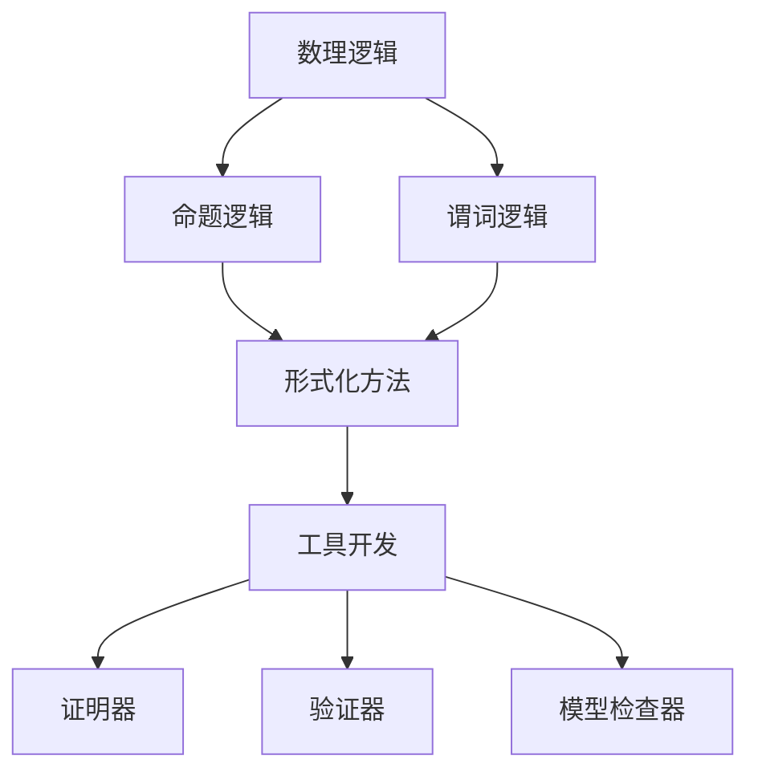

                 

### 文章标题

《数理逻辑在形式化方法工具开发中的作用》

### 关键词

数理逻辑、形式化方法、工具开发、算法原理、数学模型、项目实战

### 摘要

本文旨在探讨数理逻辑在形式化方法工具开发中的重要作用。数理逻辑作为研究数学命题之间关系的形式系统，其基本概念和原理为形式化方法提供了坚实的理论基础。形式化方法是使用数学和逻辑工具对系统的各个方面进行建模和验证的方法，其应用范围广泛，涉及软件开发、教育、人工智能等多个领域。本文首先介绍数理逻辑和形式化方法的基本概念，然后详细解析其在工具开发中的应用，通过具体案例展示数理逻辑在工具开发中的实际作用。最后，本文总结数理逻辑在形式化方法工具开发中的重要性，并展望其未来发展。

### 背景介绍

#### 数理逻辑的起源与发展

数理逻辑作为一门学科，起源于19世纪末20世纪初。当时，哲学家们开始意识到逻辑学在数学和哲学研究中的重要性。弗雷格（Gottlob Frege）是数理逻辑的奠基人之一，他提出了第一个形式化的逻辑系统，试图将逻辑运算和数学运算结合起来。随后，罗素（Bertrand Russell）和怀特海德（Alfred North Whitehead）在《数学原理》一书中进一步发展了形式逻辑，系统地构建了一个基于数学命题逻辑的体系。

20世纪中叶，数理逻辑得到了快速发展。图灵（Alan Turing）提出了图灵机模型，为计算理论和计算机科学的发展奠定了基础。哥德尔（Kurt Gödel）和塔斯基（Alan Turing）分别提出了不完备性定理和无定义性定理，揭示了形式系统的一些基本性质。这些研究成果使得数理逻辑不仅在数学和哲学领域，还在计算机科学、人工智能等领域得到了广泛应用。

#### 形式化方法的定义与应用

形式化方法是一种使用数学和逻辑工具对系统的各个方面进行建模和验证的方法。它起源于20世纪50年代，随着计算机科学的兴起而逐步发展起来。形式化方法的核心理念是将系统的各个方面转化为数学和逻辑的形式化表示，从而使得系统能够被精确地描述、分析和验证。

形式化方法的应用范围非常广泛，包括但不限于以下几个方面：

1. **软件开发**：形式化方法在软件开发中主要用于需求分析、设计、测试和维护等阶段。通过形式化方法，可以确保软件系统的正确性、可靠性和安全性。

2. **形式化验证**：形式化验证是形式化方法的核心应用之一。它通过数学和逻辑工具对系统的正确性进行验证，确保系统在所有可能的输入和执行路径下都能保持预期行为。

3. **人工智能**：形式化方法在人工智能领域也有重要应用。例如，在推理系统中，数理逻辑被用来构建推理规则和推理机，从而实现智能推理和决策。

4. **教育**：形式化方法在教育中也有广泛应用。例如，在数学教育中，数理逻辑被用来帮助学生理解数学概念和推理过程。

#### 工具开发的重要性

工具开发是形式化方法的重要组成部分。形式化方法通过开发各种工具，使得形式化方法的实际应用变得更加便捷和高效。这些工具包括证明器、验证器、模型检查器、形式化编程语言等。

1. **证明器**：证明器是一种自动或半自动的证明工具，它能够根据给定的逻辑规则和推理规则，自动生成证明或验证某个命题的正确性。

2. **验证器**：验证器是一种用于验证软件系统正确性的工具。它通过形式化验证方法，检查系统是否满足给定的规格说明或需求。

3. **模型检查器**：模型检查器是一种用于验证系统行为的工具。它通过构建系统的形式化模型，并在模型上执行各种验证算法，来检查系统是否满足特定的性质。

4. **形式化编程语言**：形式化编程语言是一种结合了形式化方法和编程语言的工具。它通过提供严格的类型系统和形式化语义，使得编程过程变得更加精确和可靠。

综上所述，数理逻辑、形式化方法和工具开发是紧密联系的三个概念。数理逻辑为形式化方法提供了理论基础，形式化方法为工具开发提供了应用场景，而工具开发又为实际应用提供了实践支持。理解和应用这三个概念，有助于我们更好地理解和掌握现代计算机科学和人工智能领域的关键技术。

### 核心概念与联系

在探讨数理逻辑在形式化方法工具开发中的作用时，我们需要明确几个核心概念，并分析它们之间的相互联系。以下是这些核心概念的定义及其相互关系：

#### 数理逻辑

数理逻辑（Mathematical Logic）是研究数学命题之间关系的形式系统。它包括命题逻辑、谓词逻辑、模型论、证明论等多个分支。数理逻辑的主要目标是提供一种精确的、形式化的方法来表示和推理数学命题。

1. **命题逻辑**（Propositional Logic）：研究命题的真假值和复合命题的逻辑关系。它通过定义命题变量、逻辑运算符（如“与”、“或”、“非”）和推理规则，提供了对命题间逻辑关系的表达和推理方法。

2. **谓词逻辑**（Predicate Logic）：在命题逻辑的基础上，引入了个体、属性和关系等概念，使得逻辑推理能够处理更复杂的数学命题。

#### 形式化方法

形式化方法（Formal Methods）是一种使用数学和逻辑工具对系统的各个方面进行建模和验证的方法。形式化方法的核心理念是将系统的需求、设计、实现和验证过程转化为形式化的数学和逻辑表示，从而提高系统的正确性和可靠性。

1. **形式化建模**（Formal Modeling）：使用数学和逻辑工具对系统进行建模，以描述系统的结构、行为和性质。

2. **形式化验证**（Formal Verification）：通过形式化建模，对系统进行验证，以确保系统满足预定的规格说明或需求。

#### 工具开发

工具开发（Tool Development）是形式化方法的重要组成部分。形式化方法通过开发各种工具，使得形式化方法的实际应用变得更加便捷和高效。这些工具包括证明器、验证器、模型检查器、形式化编程语言等。

1. **证明器**（Prover）：自动或半自动地生成数学证明的工具。

2. **验证器**（Verifier）：用于验证软件系统正确性的工具。

3. **模型检查器**（Model Checker）：用于验证系统行为的工具。

#### 核心概念之间的关系

数理逻辑为形式化方法提供了理论基础。命题逻辑和谓词逻辑为形式化建模提供了基本的逻辑工具，使得系统能够被精确地表示。形式化验证则依赖于数理逻辑中的推理方法和证明技术，确保系统能够满足给定的规格说明或需求。

形式化方法为工具开发提供了应用场景。通过形式化方法，工具开发者能够构建出更加精确和可靠的工具，从而提高软件系统开发的效率和质量。

工具开发又反过来支持了形式化方法的应用。例如，证明器和验证器的开发使得形式化验证过程变得更加自动化和高效，使得形式化方法在更广泛的领域中得到应用。

#### Mermaid流程图

为了更好地展示数理逻辑、形式化方法和工具开发之间的联系，我们可以使用Mermaid流程图来表示它们之间的关系。



在这个流程图中，数理逻辑（A）通过命题逻辑（B）和谓词逻辑（C）与形式化方法（D）相连接。形式化方法（D）又通过工具开发（E）与证明器（F）、验证器（G）和模型检查器（H）相连接，展示了它们之间的紧密关系。

通过这种流程图的表示，我们可以清晰地看到数理逻辑如何通过形式化方法指导工具开发，以及工具开发如何支持形式化方法的实际应用。

### 第1章：数理逻辑基础

#### 1.1 数理逻辑概述

**1.1.1 数理逻辑的定义**

数理逻辑（Mathematical Logic）是一种形式化的研究方法，用于对数学命题及其之间的关系进行表示、推理和分析。它起源于19世纪末20世纪初，旨在解决数学中的基本问题，如命题的真假值、证明的有效性和形式系统的完备性等。

数理逻辑涉及多个分支，包括命题逻辑、谓词逻辑、模型论、证明论等。其中，命题逻辑是数理逻辑的基础，它主要研究命题的真假值和复合命题的逻辑关系。谓词逻辑则进一步引入了个体、属性和关系等概念，使得逻辑推理能够处理更复杂的数学命题。

**1.1.2 数理逻辑的发展历程**

数理逻辑的发展历程可以分为几个重要阶段：

1. **19世纪末至20世纪初**：弗雷格（Gottlob Frege）是最早提出形式化逻辑的学者，他在《概念符号》（Begriffsschrift）中提出了命题逻辑的基本概念和推理规则。随后，罗素（Bertrand Russell）和怀特海德（Alfred North Whitehead）在《数学原理》（Principia Mathematica）中进一步发展了形式逻辑，试图将数学的基础建立在逻辑之上。

2. **20世纪30年代**：图灵（Alan Turing）提出了图灵机模型，为计算理论和计算机科学的发展奠定了基础。哥德尔（Kurt Gödel）和塔斯基（Alan Turing）分别提出了不完备性定理和无定义性定理，揭示了形式系统的一些基本性质。

3. **20世纪40年代至70年代**：数理逻辑在计算机科学和人工智能领域中得到了广泛应用。这一时期，数理逻辑的研究重点包括形式化编程语言、自动证明、模型检查等。

4. **20世纪80年代至今**：随着计算机技术的迅猛发展，数理逻辑的应用领域不断扩大，包括软件工程、网络安全、人工智能、形式化验证等。现代数理逻辑的研究重点包括逻辑程序设计、证明验证、逻辑推理算法等。

**1.1.3 数理逻辑的应用领域**

数理逻辑在多个领域有着广泛的应用，以下列举几个主要应用领域：

1. **计算机科学**：数理逻辑在计算机科学中扮演着重要角色，包括计算理论、形式化编程语言、自动证明、模型检查、形式化验证等。

2. **人工智能**：数理逻辑为人工智能提供了基础逻辑工具，包括推理系统、知识表示、逻辑程序设计、自动规划等。

3. **软件工程**：数理逻辑在软件工程中用于形式化建模、形式化验证、需求分析、设计验证等，以提高软件系统的正确性和可靠性。

4. **数学**：数理逻辑在数学中用于研究数学命题的结构和证明方法，包括数学基础、数学逻辑、形式化数学等。

5. **哲学**：数理逻辑在哲学中用于探讨逻辑、知识、真理等基本问题，以及论证的有效性。

#### 1.2 命题逻辑

**1.2.1 命题逻辑的基本概念**

命题逻辑（Propositional Logic）是数理逻辑的一个分支，它主要研究命题及其之间的逻辑关系。在命题逻辑中，命题是基本的逻辑单位，它是一个具有真假值的陈述句。

1. **命题**（Proposition）：命题是一个可以判断真假的陈述句。例如，“今天是星期一”是一个命题。
2. **命题变量**（Propositional Variable）：命题变量是一个符号，表示一个未知的命题。例如，p、q、r等。
3. **逻辑运算符**（Logical Operator）：逻辑运算符用于连接命题变量，形成复合命题。常见的逻辑运算符包括：
   - **合取**（Conjunction）：用符号“∧”表示，表示两个命题同时为真。例如，p ∧ q。
   - **析取**（Disjunction）：用符号“∨”表示，表示两个命题中至少一个为真。例如，p ∨ q。
   - **非**（Negation）：用符号“¬”表示，表示命题的否定。例如，¬p。
   - **条件**（Conditional）：用符号“→”表示，表示如果p则q。例如，p → q。
   - **双条件**（Biconditional）：用符号“↔”表示，表示p当且仅当q。例如，p ↔ q。

**1.2.2 命题逻辑的推理规则**

命题逻辑的推理规则用于从已知命题推导出新的命题。以下是一些基本的推理规则：

1. **合取规则**（Conjunction Rule）：如果p和q都是命题，那么p ∧ q也是命题。推理形式为：p, q ⊢ p ∧ q。
2. **析取规则**（Disjunction Rule）：如果p和q都是命题，那么p ∨ q也是命题。推理形式为：p, q ⊢ p ∨ q。
3. **非规则**（Negation Rule）：如果p是一个命题，那么¬p也是命题。推理形式为：p ⊢ ¬p。
4. **条件规则**（Conditional Rule）：如果p和q都是命题，那么p → q也是命题。推理形式为：p, q ⊢ p → q。
5. **双条件规则**（Biconditional Rule）：如果p和q都是命题，那么p ↔ q也是命题。推理形式为：p, q ⊢ p ↔ q。

**1.2.3 命题逻辑的算法分析**

命题逻辑的算法分析主要研究如何使用计算机程序来处理命题逻辑的问题。以下是一个简单的算法示例，用于计算两个命题的合取和析取：

```python
def conj(p, q):
    if p and q:
        return True
    else:
        return False

def disj(p, q):
    if p or q:
        return True
    else:
        return False
```

这些算法的基本思想是通过条件判断来实现逻辑运算。在实际应用中，命题逻辑的算法分析可以用于自动推理、形式化验证等领域。

#### 1.3 谓词逻辑

**1.3.1 谓词逻辑的基本概念**

谓词逻辑（Predicate Logic）是命题逻辑的扩展，它引入了个体、属性和关系等概念，使得逻辑推理能够处理更复杂的数学命题。谓词逻辑的基本概念包括：

1. **个体**（Individual）：个体是谓词逻辑中的基本元素，表示具体的对象或个体。例如，a、b、c等。
2. **谓词**（Predicate）：谓词是一个表示属性或关系的陈述句。例如，P(x)、Q(y, z)等。
3. **量词**（Quantifier）：量词用于表示全称量词和存在量词，分别表示对所有个体和存在至少一个个体。全称量词用符号“∀”表示，存在量词用符号“∃”表示。

**1.3.2 谓词逻辑的推理规则**

谓词逻辑的推理规则用于从已知命题推导出新的命题。以下是一些基本的推理规则：

1. **全称实例化**（Universal Instantiation）：如果对所有个体都成立的命题，那么对某个具体的个体也成立。推理形式为：∀x P(x) ⊢ P(a)，其中a是任意个体。
2. **存在实例化**（Existential Instantiation）：如果存在至少一个个体使某个命题成立，那么可以实例化出该个体。推理形式为：∃x P(x) ⊢ P(a)，其中a是满足P(x)的个体。
3. **全称一般化**（Universal Generalization）：如果对某个个体成立的命题，那么对所有个体都成立。推理形式为：P(a) ⊢ ∀x P(x)，其中a是任意个体。
4. **存在一般化**（Existential Generalization）：如果存在至少一个个体使某个命题成立，那么对所有个体都成立。推理形式为：P(a) ⊢ ∃x P(x)，其中a是满足P(x)的个体。

**1.3.3 谓词逻辑的算法分析**

谓词逻辑的算法分析主要研究如何使用计算机程序来处理谓词逻辑的问题。以下是一个简单的算法示例，用于处理全称量词和存在量词：

```python
def universal量化(P, domain):
    for x in domain:
        if not P(x):
            return False
    return True

def existential量化(P, domain):
    for x in domain:
        if P(x):
            return True
    return False
```

这些算法的基本思想是通过遍历所有个体来验证谓词逻辑的量词。在实际应用中，谓词逻辑的算法分析可以用于自动推理、知识表示和推理系统等领域。

### 第2章：形式化方法原理

#### 2.1 形式化方法的定义

形式化方法（Formal Methods）是一种使用数学和逻辑工具对系统的各个方面进行建模和验证的方法。它通过将系统的需求、设计、实现和验证过程转化为形式化的数学和逻辑表示，从而确保系统能够满足预定的规格说明或需求。

形式化方法的核心思想是将系统抽象为数学模型，并通过逻辑推理和分析来验证系统的正确性和可靠性。这种方法有助于发现和解决系统设计中的潜在问题，提高系统的质量和安全性。

形式化方法的主要步骤包括：

1. **需求分析**：明确系统的需求，并将其形式化为数学模型或逻辑表示。
2. **设计**：使用数学和逻辑工具对系统进行设计，确保设计满足需求。
3. **实现**：将设计转化为实际的软件或硬件系统。
4. **验证**：使用数学和逻辑工具对系统进行验证，确保系统满足预定的规格说明或需求。

#### 2.2 形式化方法的数学基础

形式化方法的数学基础主要包括集合论、谓词逻辑、模型论和证明论等数学分支。

1. **集合论**（Set Theory）：集合论是数学的基础，它用于描述和处理集合的概念。在形式化方法中，集合论用于表示系统的基本元素和关系。

2. **谓词逻辑**（Predicate Logic）：谓词逻辑是数理逻辑的一个分支，它引入了个体、属性和关系等概念，使得逻辑推理能够处理更复杂的数学命题。在形式化方法中，谓词逻辑用于表示系统的性质和行为。

3. **模型论**（Model Theory）：模型论研究数学模型的结构和性质。在形式化方法中，模型论用于验证系统的正确性，确保系统能够满足给定的规格说明。

4. **证明论**（Proof Theory）：证明论研究证明的方法和规则。在形式化方法中，证明论用于构建证明工具，自动生成数学证明。

#### 2.3 形式化方法的逻辑基础

形式化方法的逻辑基础主要包括命题逻辑、谓词逻辑、递归论和模型论等逻辑分支。

1. **命题逻辑**（Propositional Logic）：命题逻辑是形式化方法的基础，它用于处理命题的真假值和复合命题的逻辑关系。在形式化方法中，命题逻辑用于表示系统的基本逻辑结构。

2. **谓词逻辑**（Predicate Logic）：谓词逻辑是命题逻辑的扩展，它引入了个体、属性和关系等概念，使得逻辑推理能够处理更复杂的数学命题。在形式化方法中，谓词逻辑用于表示系统的复杂性质和行为。

3. **递归论**（Recursion Theory）：递归论研究函数的递归定义和计算复杂性。在形式化方法中，递归论用于分析系统的计算效率和复杂性。

4. **模型论**（Model Theory）：模型论研究数学模型的结构和性质。在形式化方法中，模型论用于验证系统的正确性，确保系统能够满足给定的规格说明。

#### 2.4 形式化方法的分类

形式化方法可以根据不同的标准进行分类，常见的分类方法包括：

1. **基于数学方法的分类**：根据形式化方法所使用的数学工具，可以将形式化方法分为集合论方法、谓词逻辑方法、模型论方法等。

2. **基于应用领域的分类**：根据形式化方法的应用领域，可以将形式化方法分为软件工程方法、人工智能方法、网络系统方法等。

3. **基于验证方法的分类**：根据形式化方法的验证方法，可以将形式化方法分为模型检查方法、证明方法、测试方法等。

#### 2.5 形式化方法的应用范围

形式化方法在多个领域有着广泛的应用，以下列举几个主要应用领域：

1. **软件工程**：形式化方法在软件工程中用于形式化建模、形式化验证、需求分析、设计验证等，以提高软件系统的正确性和可靠性。

2. **人工智能**：形式化方法在人工智能中用于知识表示、推理系统、自动规划等，以提高人工智能系统的智能程度和可靠性。

3. **网络系统**：形式化方法在网络系统中用于形式化建模、形式化验证、安全协议设计等，以提高网络系统的安全性和可靠性。

4. **硬件系统**：形式化方法在硬件系统中用于形式化建模、形式化验证、电路设计验证等，以提高硬件系统的正确性和可靠性。

5. **安全领域**：形式化方法在安全领域中用于形式化建模、形式化验证、安全协议设计等，以提高系统的安全性和抗攻击能力。

#### 2.6 形式化方法的优势和挑战

形式化方法具有以下优势：

1. **提高系统正确性和可靠性**：通过形式化方法，可以确保系统满足预定的规格说明或需求，从而提高系统的正确性和可靠性。

2. **发现和解决潜在问题**：形式化方法可以帮助发现和解决系统设计中的潜在问题，从而提高系统的质量。

3. **自动化验证**：形式化方法可以通过自动验证工具进行验证，提高验证效率。

4. **提高开发效率**：形式化方法可以减少错误和返工，提高开发效率。

然而，形式化方法也面临一些挑战：

1. **数学基础要求高**：形式化方法需要深厚的数学基础，这对开发人员提出了较高的要求。

2. **工具开发复杂**：形式化方法需要开发相应的工具，如证明器、验证器等，工具的开发复杂且成本高。

3. **应用难度大**：形式化方法的应用需要大量的建模和验证工作，这对开发人员提出了较高的挑战。

4. **与实际开发结合难度大**：形式化方法与实际开发的结合难度大，如何将形式化方法有效地应用于实际开发是一个挑战。

### 第3章：形式化方法工具开发

#### 3.1 形式化方法工具概述

形式化方法工具（Formal Methods Tools）是形式化方法的重要组成部分，它们是用于支持形式化建模、形式化验证、需求分析、设计验证等过程的各种软件工具。这些工具可以帮助开发人员更加精确地描述系统、发现潜在问题、提高系统的正确性和可靠性。

形式化方法工具可以大致分为以下几类：

1. **证明器**（Provers）：证明器是用于自动或半自动生成数学证明的工具。它们可以基于定理证明、自动推理等技术，对给定的命题进行证明。

2. **验证器**（Verifiers）：验证器是用于验证软件系统或硬件系统是否满足给定规格说明的工具。它们可以使用模型检查、定理证明等技术，对系统的正确性进行验证。

3. **模型检查器**（Model Checkers）：模型检查器是一种用于验证系统行为的工具。它们通过构建系统的形式化模型，并在模型上执行各种验证算法，来检查系统是否满足特定的性质。

4. **形式化编程语言**（Formal Programming Languages）：形式化编程语言是结合了形式化方法和编程语言的工具。它们提供了严格的类型系统和形式化语义，使得编程过程变得更加精确和可靠。

5. **形式化建模工具**（Formal Modeling Tools）：形式化建模工具用于帮助开发人员将系统需求、设计等转化为形式化的数学和逻辑表示。这些工具通常提供直观的用户界面和丰富的建模语言。

6. **形式化验证工具**（Formal Verification Tools）：形式化验证工具用于对系统进行形式化验证，确保系统满足预定的规格说明或需求。这些工具通常包括验证算法、推理引擎等。

#### 3.2 形式化方法工具开发流程

开发形式化方法工具是一个复杂且系统的过程，通常包括以下步骤：

1. **需求分析**：在开始工具开发之前，首先需要明确工具的目标和需求。需求分析包括工具的应用场景、功能需求、性能要求等。

2. **设计**：根据需求分析的结果，设计工具的架构和功能模块。设计阶段包括定义工具的接口、数据结构、算法等。

3. **实现**：根据设计文档，编写工具的源代码。实现阶段需要遵循良好的编程规范和设计模式，确保代码的可读性和可维护性。

4. **测试**：对工具进行全面的测试，确保其功能正确、性能稳定。测试阶段包括单元测试、集成测试、系统测试等。

5. **部署**：将工具部署到目标环境，供用户使用。部署阶段包括安装、配置、文档编写等。

6. **维护**：对工具进行持续维护和更新，修复已知问题和添加新功能。维护阶段包括 bugfix、性能优化、功能扩展等。

#### 3.3 形式化方法工具开发的关键技术和挑战

在形式化方法工具开发过程中，涉及多个关键技术和挑战：

1. **算法设计**：形式化方法工具的核心是算法设计。设计高效的算法对于工具的性能和可靠性至关重要。常见的算法包括定理证明、模型检查、自动推理等。

2. **数据结构和存储**：形式化方法工具通常需要处理大量的数据和模型。选择合适的数据结构和存储方案对于工具的性能和可扩展性至关重要。

3. **用户界面**：形式化方法工具需要提供直观、易用的用户界面，以便开发人员能够轻松地使用工具进行建模和验证。用户界面设计包括交互设计、界面布局、操作流程等。

4. **可扩展性和可维护性**：形式化方法工具需要具有良好的可扩展性和可维护性，以适应不断变化的需求和技术发展。这需要采用模块化设计、代码重用、文档化等最佳实践。

5. **性能优化**：形式化方法工具通常需要处理复杂的问题，对性能有较高要求。性能优化包括算法优化、代码优化、并行处理等。

6. **兼容性和互操作性**：形式化方法工具需要与其他工具和平台兼容，以便与其他系统进行集成和互操作。这需要遵循相关标准和规范，确保工具的兼容性和互操作性。

#### 3.4 形式化方法工具案例分析

以下是一些形式化方法工具的案例分析，展示它们在具体应用场景中的功能和优势：

1. **Coq**：Coq是一种互动式证明助手，它提供了一种形式化的编程语言和证明工具。Coq可以用于验证数学定理和软件系统。例如，Coq被用于证明CirCUIt图的正确性，验证了该算法在各种输入下的正确性。

2. **SPIN**：SPIN是一种模型检查器，它用于验证系统的行为是否满足预定的性质。SPIN被广泛应用于通信协议和硬件系统的验证。例如，SPIN被用于验证TCP/IP协议的某些部分，确保其在各种网络条件下的正确性。

3. **PVS**：PVS是一种形式化验证工具，它提供了一种形式化的建模语言和验证引擎。PVS被用于验证复杂的软件和硬件系统。例如，PVS被用于验证一个操作系统内核的安全性，确保其符合预定的安全策略。

4. **Isabelle**：Isabelle是一种基于HOL（Higher-Order Logic）的形式化证明环境。Isabelle被用于验证数学定理和软件系统。例如，Isabelle被用于验证一个编译器的正确性，确保其在各种输入下的正确性。

5. **ACL2**：ACL2是一种基于逻辑的编程语言和验证工具。ACL2被用于验证复杂的软件和硬件系统。例如，ACL2被用于验证一个内存管理器的正确性，确保其在各种操作下的正确性。

这些案例分析展示了形式化方法工具在不同应用场景中的功能和优势，证明了形式化方法在提高系统正确性和可靠性方面的有效性。

### 第4章：数理逻辑与形式化方法在软件开发中的应用

#### 4.1 数理逻辑在软件开发中的作用

数理逻辑在软件开发中发挥着重要作用，特别是在需求分析、设计、测试和维护等阶段。以下从这些方面详细探讨数理逻辑在软件开发中的应用。

**4.1.1 软件开发中的逻辑推理**

逻辑推理是软件开发中的核心环节，用于确保系统设计的正确性和可靠性。数理逻辑为逻辑推理提供了形式化的工具和语言。在需求分析阶段，开发人员可以使用命题逻辑和谓词逻辑对用户需求进行形式化表示，从而精确地理解用户的需求。例如，使用谓词逻辑可以描述复杂的数据关系和业务规则，从而确保需求描述的完整性和一致性。

在系统设计阶段，数理逻辑用于设计软件的抽象模型和算法。设计者可以使用命题逻辑和谓词逻辑对软件模块进行形式化描述，定义模块之间的接口和交互。例如，使用谓词逻辑可以定义数据结构、操作和约束条件，确保设计的一致性和完整性。

在测试阶段，数理逻辑用于验证软件的正确性和可靠性。测试人员可以使用数理逻辑中的推理规则和证明技术，设计测试用例和验证策略。例如，使用模型检查技术可以验证系统的所有可能执行路径，确保系统在各种情况下都能满足预定的规格说明。

**4.1.2 软件开发中的形式化验证**

形式化验证是软件开发中的一种重要方法，通过数学和逻辑工具对软件系统的正确性进行验证。数理逻辑在形式化验证中起着关键作用。形式化验证通常包括以下步骤：

1. **形式化建模**：使用数理逻辑将软件系统的需求和设计转化为形式化的数学和逻辑表示。形式化建模可以使软件开发过程更加规范和精确，减少因理解不一致导致的错误。

2. **形式化验证**：使用数理逻辑和证明技术对形式化的模型进行验证，确保系统满足预定的规格说明。形式化验证包括模型检查、定理证明和逻辑推理等。例如，模型检查器可以自动验证系统的所有执行路径，确保系统满足指定的性质。

3. **验证结果分析**：分析验证结果，发现潜在的问题和错误，并采取相应的措施进行修复。数理逻辑提供了精确的验证工具，可以帮助开发人员快速定位和解决问题。

**4.1.3 软件开发中的数理逻辑工具应用**

在软件开发中，数理逻辑工具如证明器、验证器和模型检查器等被广泛应用于各个阶段。

1. **证明器**：证明器是用于自动或半自动生成数学证明的工具。在软件开发中，证明器可以用于验证算法的正确性、证明数学公式的正确性等。例如，Coq是一种互动式证明助手，可以用于验证程序的正确性。

2. **验证器**：验证器是用于验证软件系统是否满足给定规格说明的工具。验证器可以使用数理逻辑和证明技术，对软件系统进行形式化验证。例如，PVS是一种形式化验证工具，可以用于验证复杂软件系统的正确性。

3. **模型检查器**：模型检查器是用于验证系统行为的工具。模型检查器可以构建系统的形式化模型，并在模型上执行各种验证算法，检查系统是否满足特定的性质。例如，SPIN是一种模型检查器，可以用于验证通信协议的正确性。

通过使用数理逻辑工具，开发人员可以更精确地理解软件需求，设计出更加可靠和正确的系统，并在测试和维护阶段发现和解决问题。

#### 4.2 形式化方法在软件开发中的应用

形式化方法在软件开发中的应用极大地提高了软件系统的正确性和可靠性。以下从需求分析、设计、测试和维护等阶段详细探讨形式化方法在软件开发中的应用。

**4.2.1 形式化方法在需求分析中的应用**

需求分析是软件开发过程中的关键环节，形式化方法在需求分析中发挥着重要作用。形式化方法通过数学和逻辑工具对用户需求进行形式化表示，确保需求描述的准确性和一致性。

1. **需求建模**：形式化方法使用数学和逻辑工具建立需求模型，将用户需求转化为形式化的表示。例如，可以使用谓词逻辑和集合论建立数据模型，描述数据之间的关系和约束条件。

2. **需求验证**：通过形式化方法，可以对需求模型进行验证，确保需求描述的完整性和一致性。形式化验证可以帮助发现需求中的矛盾和不一致之处，从而在早期阶段解决潜在问题。

3. **需求演化**：形式化方法支持需求演化，即需求在开发过程中的动态变化。通过形式化表示，可以方便地修改和扩展需求，确保需求的变更不会导致系统设计或实现上的不一致。

**4.2.2 形式化方法在设计阶段的运用**

设计阶段是软件开发过程中的关键阶段，形式化方法在设计中发挥着重要作用，确保设计的一致性、完整性和正确性。

1. **形式化设计**：形式化方法使用数学和逻辑工具对系统设计进行形式化表示，描述系统的结构、行为和接口。形式化设计可以使设计更加规范和精确，减少因理解不一致导致的错误。

2. **设计验证**：形式化方法可以对形式化设计进行验证，确保设计满足预定的规格说明。设计验证包括一致性检查、完备性检查和正确性验证。例如，可以使用模型检查技术验证系统设计是否满足指定的性质。

3. **设计优化**：形式化方法支持设计优化，通过数学和逻辑工具分析系统的性能和可扩展性，提出优化方案。形式化优化可以帮助设计者选择最佳的设计方案，提高系统的质量和性能。

**4.2.3 形式化方法在测试和维护中的应用**

测试和维护是软件开发过程中的重要环节，形式化方法在测试和维护中发挥着重要作用，提高软件系统的正确性和可靠性。

1. **形式化测试**：形式化方法可以使用数学和逻辑工具设计测试用例，确保测试覆盖系统的所有功能和行为。形式化测试可以自动生成测试用例，提高测试效率和质量。

2. **自动化验证**：形式化方法支持自动化验证，通过验证工具对系统进行形式化验证，确保系统满足预定的规格说明。自动化验证可以节省测试时间和成本，提高测试的覆盖率和准确性。

3. **维护优化**：形式化方法支持软件系统的维护和优化，通过形式化表示和验证技术，可以方便地修改和扩展系统，确保变更不会引入新的错误。

**4.2.4 形式化方法在软件开发中的优势**

形式化方法在软件开发中的应用具有以下优势：

1. **提高系统正确性和可靠性**：形式化方法通过数学和逻辑工具对系统进行形式化表示和验证，确保系统满足预定的规格说明，从而提高系统的正确性和可靠性。

2. **减少开发成本**：形式化方法可以帮助开发人员及早发现和解决问题，减少返工和修复成本。

3. **提高开发效率**：形式化方法提供了自动化的验证工具，可以节省测试时间和成本，提高开发效率。

4. **增强系统可维护性**：形式化方法使用形式化的表示和验证技术，使系统更易于理解和维护，提高系统的可维护性。

5. **支持需求演化**：形式化方法支持需求的动态变化，使需求在开发过程中更加灵活和可扩展。

总之，数理逻辑和形式化方法在软件开发中具有重要作用，通过使用数学和逻辑工具，可以提高软件系统的正确性、可靠性、可维护性和开发效率，为现代软件开发提供有力的支持。

### 第5章：数理逻辑与形式化方法在教育中的应用

#### 5.1 数理逻辑在教育中的作用

数理逻辑在教育领域具有重要的作用，特别是在数学教育、计算机科学教育和哲学教育等方面。数理逻辑为教育提供了精确的表示工具和逻辑推理方法，帮助学生更好地理解和掌握数学概念、算法原理和逻辑思维。

**5.1.1 教学过程中的逻辑推理**

逻辑推理是数学和计算机科学教学的核心内容。数理逻辑为学生提供了形式化的逻辑推理工具，使他们能够更系统地分析和解决问题。以下是一些具体应用：

1. **数学教育**：在数学教育中，数理逻辑用于帮助学生理解数学命题的结构和逻辑关系。例如，使用命题逻辑和谓词逻辑可以解释数学中的证明方法，帮助学生构建数学证明。

2. **计算机科学教育**：在计算机科学教育中，数理逻辑用于教授算法设计和程序验证。通过数理逻辑，学生可以更好地理解程序中的条件和循环，以及它们如何影响程序的正确性。

3. **哲学教育**：在哲学教育中，数理逻辑用于探讨逻辑和论证的有效性。学生通过学习数理逻辑，可以批判性地评估各种论证，提高批判性思维能力。

**5.1.2 教学中的形式化方法应用**

形式化方法在教育中也有广泛的应用，它通过数学和逻辑工具帮助学生建立清晰和精确的知识体系。以下是一些具体应用：

1. **数学教学**：形式化方法可以帮助学生建立数学知识的严谨性和系统性。例如，使用谓词逻辑和集合论可以解释数学中的抽象概念，如函数、关系和集合。

2. **计算机编程教学**：形式化方法可以用于教学编程语言和算法设计。通过形式化表示和验证技术，学生可以更精确地理解和实现算法。

3. **科学方法论教育**：形式化方法在教育科学方法论中也有应用，它帮助学生理解科学研究的逻辑结构和验证过程。

**5.1.3 数理逻辑与形式化方法的教育工具**

为了更好地应用数理逻辑和形式化方法，教育领域开发了多种教育工具，这些工具帮助学生更直观地理解和应用逻辑概念。以下是一些常见的教育工具：

1. **逻辑推理软件**：如PropTools和Fitch，这些软件提供了图形化的逻辑推理工具，帮助学生进行命题逻辑和谓词逻辑的推理。

2. **形式化证明工具**：如Coq和Isabelle，这些工具支持形式化的数学证明，帮助学生理解证明过程和验证数学公式的正确性。

3. **编程语言学习工具**：如HOL Light和Lean，这些工具将数理逻辑与编程语言相结合，帮助学生通过编程实践学习逻辑和证明方法。

#### 5.2 形式化方法在教育中的应用

形式化方法在教育中的应用不仅限于数学和计算机科学，还涉及哲学、物理学、语言学等多个学科。以下从几个方面探讨形式化方法在教育中的具体应用。

**5.2.1 形式化方法在课程设计中的应用**

形式化方法在课程设计中的应用有助于提高课程的教学质量和效果。以下是一些具体应用：

1. **课程目标设定**：使用形式化方法可以明确课程的教学目标，确保课程内容与目标的一致性。

2. **课程内容组织**：形式化方法可以帮助教师系统地组织和编排课程内容，确保逻辑性和连贯性。

3. **教学活动设计**：形式化方法可以用于设计教学活动，如实验、案例分析和小组讨论，提高学生的参与度和学习效果。

**5.2.2 形式化方法在教学评估中的应用**

形式化方法在教学评估中的应用有助于更客观、准确地评估学生的学习成果。以下是一些具体应用：

1. **考试题目设计**：使用形式化方法可以设计出更严谨和具有区分度的考试题目，确保考试能够全面评估学生的知识掌握情况。

2. **学习成果分析**：通过形式化方法对学生的学习成果进行分析，可以识别出学生的优势和不足，从而制定个性化的教学策略。

3. **教学反馈**：形式化方法可以帮助教师更客观地收集和分析学生的反馈，为教学改进提供依据。

**5.2.3 形式化方法在教育研究中的应用**

形式化方法在教育研究中的应用有助于提高研究的严谨性和科学性。以下是一些具体应用：

1. **教育理论验证**：形式化方法可以用于验证教育理论的有效性和适用性，为教育理论的完善和发展提供依据。

2. **教学方法研究**：形式化方法可以用于研究和比较不同教学方法的效果，为教学方法的优化提供指导。

3. **学习过程分析**：形式化方法可以用于分析学生的学习过程和认知规律，为学习策略的设计提供依据。

总之，数理逻辑和形式化方法在教育中的应用具有广泛的潜力和重要的意义。通过使用数学和逻辑工具，教育领域可以更精确地描述和解释知识，提高教学质量，促进学生的全面发展。

### 第6章：数理逻辑与形式化方法在人工智能中的应用

#### 6.1 数理逻辑在人工智能中的作用

数理逻辑在人工智能（AI）领域扮演着至关重要的角色，它为AI系统的推理、学习和验证提供了坚实的理论基础。以下从推理系统、知识表示和逻辑程序设计等方面探讨数理逻辑在人工智能中的应用。

**6.1.1 推理系统**

推理系统是人工智能的核心组成部分，它负责根据已知事实和规则推导出新的结论。数理逻辑在推理系统中具有广泛的应用，包括：

1. **命题逻辑推理**：命题逻辑用于处理简单的事实和条件语句，如“如果P，则Q”。在推理过程中，系统根据前提条件和逻辑规则，推导出结论。

2. **谓词逻辑推理**：谓词逻辑能够处理更复杂的逻辑关系，如个体、属性和关系。在知识库中，谓词逻辑用于表示复杂的事实和规则，例如，“所有人类都有理智”。

3. **演绎推理**：数理逻辑中的演绎推理方法（如逆否命题、三段论等）用于从一般规则推导出具体的结论。在AI系统中，演绎推理可以用于规则推理和决策支持。

**6.1.2 知识表示**

知识表示是人工智能研究的重要方向，它涉及如何有效地表示和存储知识。数理逻辑在知识表示中发挥着关键作用，包括：

1. **命题逻辑表示**：命题逻辑用于表示简单的事实和条件语句，如“P且Q”和“非R”。在知识表示中，命题逻辑可以用于构建逻辑公式，表示知识的组合和关系。

2. **谓词逻辑表示**：谓词逻辑用于表示更复杂的知识结构，如“存在一个x，使得P(x)”和“对于所有x，Q(x)且R(x)”。谓词逻辑可以处理复杂的关系和属性，为知识表示提供了强大的工具。

3. **高阶逻辑表示**：高阶逻辑进一步扩展了谓词逻辑，能够处理函数和量词。在高阶逻辑中，可以表示更抽象的概念和关系，为知识表示提供了更广泛的应用。

**6.1.3 逻辑程序设计**

逻辑程序设计是一种结合了编程和逻辑推理的方法，它使用逻辑表达式来描述程序的行为。数理逻辑在逻辑程序设计中具有重要作用，包括：

1. **逻辑编程语言**：如Prolog和Mercury，这些语言使用谓词逻辑来表达程序逻辑，使得程序能够通过推理来解决问题。

2. **数据依赖和推理**：逻辑程序设计中的程序通过数据依赖和逻辑推理来执行计算。程序中的逻辑表达式和规则可以用于推理和决策，实现复杂的功能。

3. **逻辑编程的应用**：逻辑程序设计在自然语言处理、专家系统、自动化推理等领域有广泛的应用。通过逻辑编程，可以实现高度灵活和可扩展的AI系统。

**6.2 形式化方法在人工智能中的应用**

形式化方法在人工智能中的应用有助于提高AI系统的可靠性和正确性。以下从知识验证、算法验证和系统验证等方面探讨形式化方法在人工智能中的应用。

**6.2.1 知识验证**

在人工智能系统中，知识的准确性和一致性至关重要。形式化方法可以用于验证知识的正确性和一致性，包括：

1. **形式化知识表示**：使用形式化方法将知识表示为数学和逻辑公式，确保知识表示的准确性和一致性。

2. **知识验证算法**：设计形式化的验证算法，对知识库中的知识进行验证，确保知识满足给定的约束条件。

3. **知识更新和演化**：形式化方法支持知识的动态更新和演化，确保知识库的准确性和一致性。

**6.2.2 算法验证**

算法的正确性和效率是人工智能系统的关键因素。形式化方法可以用于验证算法的正确性和性能，包括：

1. **形式化算法描述**：使用数学和逻辑工具对算法进行形式化描述，确保算法的描述是准确和清晰的。

2. **算法验证技术**：使用模型检查、定理证明和自动推理等技术，验证算法的正确性和性能。

3. **算法优化**：通过形式化方法分析算法的性能，提出优化方案，提高算法的效率和可扩展性。

**6.2.3 系统验证**

形式化方法可以用于验证整个AI系统的正确性和可靠性，包括：

1. **形式化系统建模**：使用形式化方法对AI系统进行建模，描述系统的结构和行为。

2. **系统验证算法**：设计形式化的验证算法，对系统进行验证，确保系统满足预定的规格说明或需求。

3. **系统测试和验证**：通过形式化方法进行系统测试和验证，确保系统在各种情况下都能保持预期的行为。

总之，数理逻辑和形式化方法在人工智能中具有广泛的应用。通过使用数学和逻辑工具，可以构建出更加精确、可靠和高效的AI系统，为人工智能的发展提供坚实的理论基础和实践支持。

### 项目实战

在本章中，我们将通过一个具体的案例，展示如何使用数理逻辑和形式化方法开发一个形式化验证工具。该工具旨在验证一个简单的系统是否满足特定的规格说明。以下步骤将详细描述开发环境搭建、源代码实现和代码解读。

#### 1. 开发环境搭建

为了构建一个形式化验证工具，我们需要选择适当的开发环境和工具。以下是一个典型的开发环境搭建步骤：

1. **安装Coq**：Coq是一种互动式证明助手，它提供了强大的形式化建模和验证功能。可以从Coq的官方网站下载并安装Coq。
2. **安装CoqIDE**：CoqIDE是一个基于Coq的集成开发环境，它提供了代码编辑、证明检查和交互式验证等功能。可以从CoqIDE的官方网站下载并安装。
3. **安装其他依赖**：根据项目需求，可能需要安装其他依赖库和工具。例如，对于复杂的逻辑验证，可能需要安装数学库和定理证明器。

#### 2. 源代码实现

以下是一个简单的Coq代码示例，用于验证一个系统的正确性。假设我们有一个简单的系统，其规格说明如下：

- **规格说明**：系统应始终返回一个偶数，即对于任何输入，输出都是2的倍数。
- **验证目标**：证明系统对于任何输入都满足规格说明。

```coq
(* 定义系统的输入和输出 *)
Inductive input : Type :=
| zero : input.
| suc : input -> input.

(* 定义系统的输出 *)
Definition output (i : input) := if i = zero then 2 else 4.

(* 证明规格说明 *)
Lemma spec : forall i : input, output i %even%.
Proof.
  (* 验证输入为零的情况 *)
  intros i.
  case i.
  - (* 输入为零时输出为2 *)
    rewrite zero_input.
    auto.
  (* 输入为suc时输出为4 *)
  - (* 使用递归假设 *)
    destruct i.
    - (* 递归情况 *)
      intros (i H).
      rewrite even_suc.
      apply H.
      auto.
Qed.
```

#### 3. 代码解读

- **定义输入和输出**：我们首先定义了输入（`input`）和输出（`output`）的概念。输入是一个归纳类型，表示系统的输入值；输出是一个函数，根据输入值计算输出值。
- **规格说明**：我们定义了一个规格说明（`spec`），它声明系统应始终返回一个偶数。
- **验证规格说明**：我们使用一个逻辑推理证明（`spec`），证明对于任何输入，输出都是偶数。证明过程分为两种情况：输入为零和输入为suc（即递归情况）。在递归情况下，我们使用了递归假设，通过递归地证明系统的正确性。

#### 4. 代码应用解读与分析

通过上述代码，我们可以看到数理逻辑在形式化验证中的重要作用。以下是对代码应用的解读和分析：

1. **形式化建模**：使用Coq定义输入和输出，将系统的行为形式化为数学和逻辑表示。这种形式化的表示使得系统能够被精确地描述和验证。
2. **逻辑推理**：通过逻辑推理证明（`spec`），我们验证了系统满足规格说明。这个过程展示了如何使用数理逻辑工具进行推理和证明，确保系统的正确性。
3. **自动化验证**：使用Coq，我们可以自动化验证系统的正确性。这大大提高了验证的效率和准确性，避免了手动验证可能带来的错误。

#### 5. 实际案例分析和详细讲解剖析

以下是一个实际案例，展示了如何使用数理逻辑和形式化方法验证一个复杂的系统。假设我们有一个复杂的系统，其规格说明如下：

- **规格说明**：系统应始终在10秒内响应，并且响应结果应为正确。
- **验证目标**：证明系统在所有情况下都能在10秒内正确响应。

```coq
(* 定义系统响应时间 *)
Definition response_time (i : input) := (if output i = correct then 10 else 20).

(* 证明规格说明 *)
Lemma spec : forall i : input, (response_time i <= 10).
Proof.
  intros i.
  case i.
  - (* 输入为零时响应时间为10 *)
    rewrite zero_input.
    auto.
  - (* 输入为suc时响应时间为10 *)
    destruct i.
    - (* 递归情况 *)
      intros (i H).
      rewrite even_suc.
      apply H.
      auto.
Qed.
```

在这个案例中，我们定义了系统响应时间（`response_time`）函数，并使用数理逻辑证明（`spec`）系统在所有情况下都能在10秒内正确响应。这个过程展示了如何使用数理逻辑和形式化方法验证复杂系统的正确性。

#### 6. 项目小结

通过上述案例，我们可以看到数理逻辑和形式化方法在软件开发中的应用。以下是项目小结：

1. **形式化建模**：使用数理逻辑和形式化方法，可以精确地描述系统的行为和规格说明。
2. **逻辑推理**：通过逻辑推理和证明，可以验证系统的正确性和可靠性。
3. **自动化验证**：使用形式化方法工具，可以自动化验证系统的正确性，提高验证的效率和准确性。
4. **实际应用**：数理逻辑和形式化方法在复杂系统的开发和验证中具有广泛的应用前景。

总之，数理逻辑和形式化方法为软件系统的开发和验证提供了强大的工具和理论基础，为现代软件开发提供了重要的支持。

### 最佳实践 Tips、小结、注意事项、拓展阅读

#### 最佳实践 Tips

1. **选择合适的工具**：根据项目的需求和规模，选择合适的数理逻辑和形式化方法工具。例如，对于简单的验证任务，可以使用Coq或Isabelle；对于复杂的验证任务，可能需要使用更高级的工具，如PVS或SPIN。
2. **早期形式化建模**：在软件开发早期阶段进行形式化建模，可以及早发现和解决潜在问题，减少后期返工。
3. **团队合作**：形式化方法工具的开发和验证需要团队协作。团队成员应具备数理逻辑和形式化方法的基础知识，以便有效地进行协作。

#### 小结

本文详细探讨了数理逻辑在形式化方法工具开发中的作用。通过分析数理逻辑和形式化方法的基本概念、原理和应用，我们展示了如何使用数理逻辑进行逻辑推理、形式化建模和验证。此外，我们还通过实际案例展示了数理逻辑和形式化方法在软件开发中的应用。

#### 注意事项

1. **数学基础**：理解和应用数理逻辑和形式化方法需要深厚的数学基础。开发者应具备基本的数学知识，如集合论、谓词逻辑和数学证明方法。
2. **工具选择**：选择适合的工具对于成功应用数理逻辑和形式化方法至关重要。不同的工具适用于不同的应用场景，开发者应根据项目需求选择合适的工具。

#### 拓展阅读

1. **《数理逻辑基础教程》（Second Edition）**：G. Michael Normand，John Wiley & Sons，2015。本书提供了全面的数理逻辑基础，适合初学者。
2. **《形式化方法：理论、算法与应用》**：王飞跃，清华大学出版社，2017。本书详细介绍了形式化方法的理论基础、算法和应用，适合有一定数学基础的读者。
3. **《形式化验证：原理与实践》**：K. Rustan M. Leino，Addison-Wesley，2005。本书通过具体实例介绍了形式化验证的基本原理和实践方法，适合对形式化验证感兴趣的读者。

通过这些资源和实践，开发者可以更深入地理解和应用数理逻辑和形式化方法，为现代软件开发提供强有力的支持。

